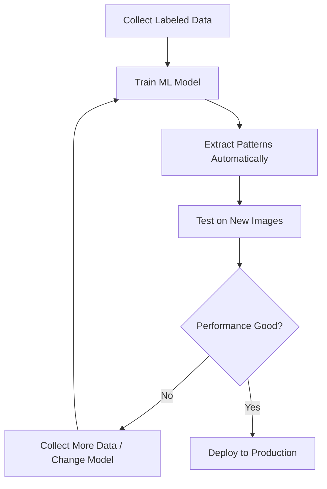
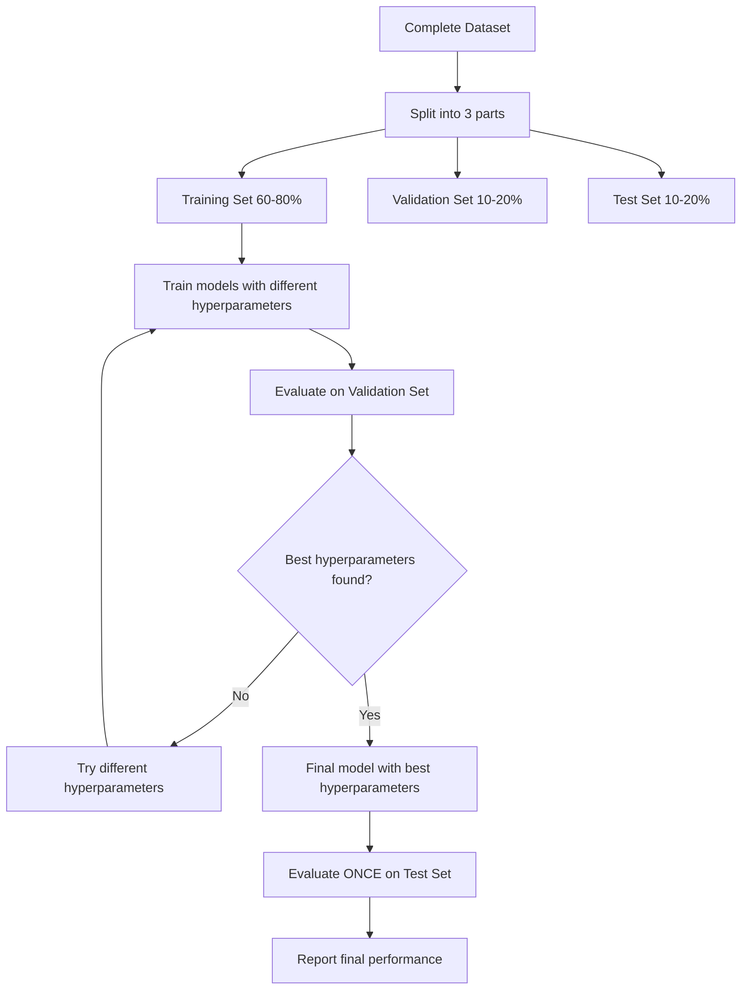
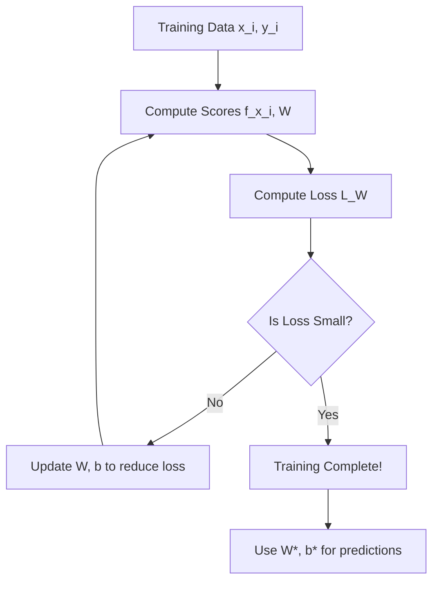
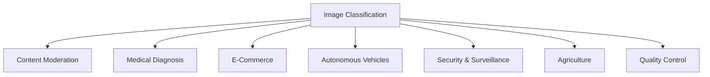
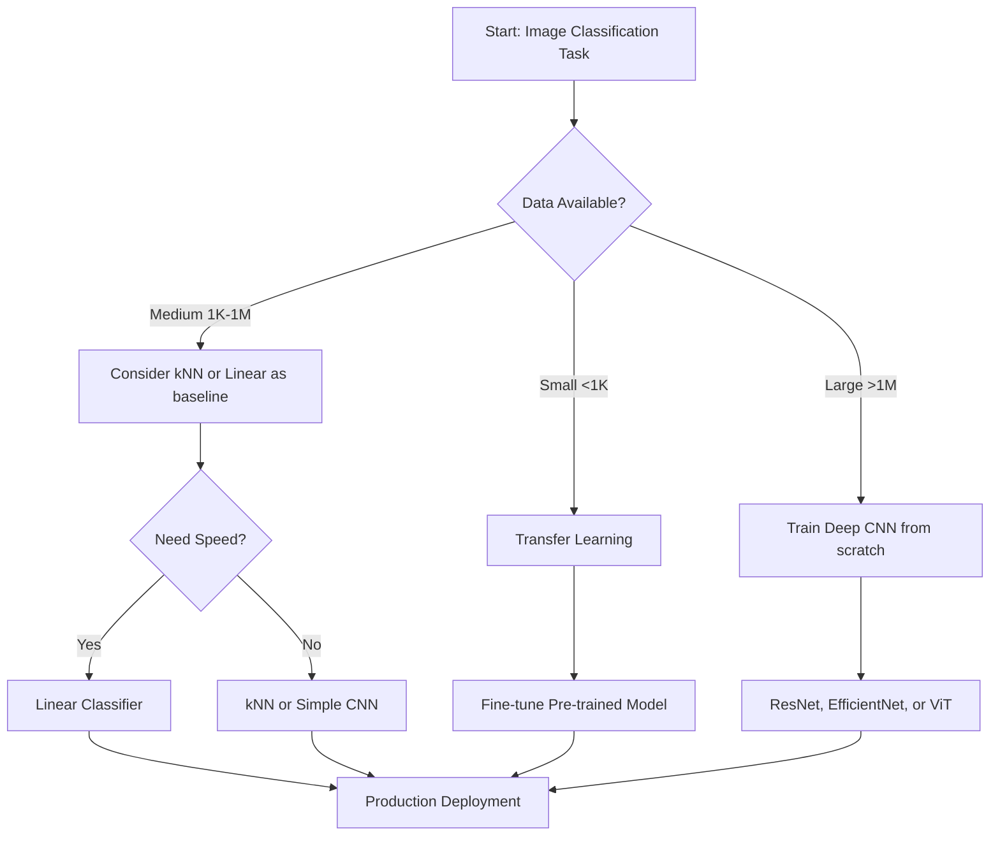

# CS09 – Image Classification

> **Course:** MTech AIML - Computer Vision (AIMLCZG525)
> **Institution:** BITS Pilani WILP
> **Session:** 9 | **Topic:** Image Classification Pipeline
> **Instructor:** Dhruba Adhikary
> **Claude Account:** "vigneshp photos1"

---

## Table of Contents

- [CS09 – Image Classification](#cs09--image-classification)
  - [Table of Contents](#table-of-contents)
  - [Learning Objectives](#learning-objectives)
  - [Quick Reference Links](#quick-reference-links)
  - [Quick Revision Checklist](#quick-revision-checklist)
    - [MUST KNOW FOR EXAM - 15 MINUTE SPEED REVIEW](#must-know-for-exam---15-minute-speed-review)
      - [Core Concepts (3 minutes)](#core-concepts-3-minutes)
      - [Nearest Neighbor \& kNN (4 minutes)](#nearest-neighbor--knn-4-minutes)
      - [Train/Validation/Test Split (3 minutes)](#trainvalidationtest-split-3-minutes)
      - [Linear Classifiers (3 minutes)](#linear-classifiers-3-minutes)
      - [Loss Functions (2 minutes)](#loss-functions-2-minutes)
  - [1. Introduction to Image Classification](#1-introduction-to-image-classification)
    - [1.1 What is Image Classification?](#11-what-is-image-classification)
    - [1.2 The Three Pillars of Recognition](#12-the-three-pillars-of-recognition)
      - [Pillar 1: Machine Learning Methods](#pillar-1-machine-learning-methods)
      - [Pillar 2: Representation (Features)](#pillar-2-representation-features)
      - [Pillar 3: Data](#pillar-3-data)
      - [How the Three Pillars Work Together](#how-the-three-pillars-work-together)
    - [1.3 Why is Image Classification Hard?](#13-why-is-image-classification-hard)
  - [2. Data-Driven Approach](#2-data-driven-approach)
    - [2.1 Traditional vs. Data-Driven Paradigm](#21-traditional-vs-data-driven-paradigm)
    - [2.2 The Data-Driven Philosophy](#22-the-data-driven-philosophy)
    - [2.3 Advantages of Data-Driven Approach](#23-advantages-of-data-driven-approach)
    - [2.4 Dataset Requirements](#24-dataset-requirements)
    - [2.5 Key Insight: Separating Algorithm from Data](#25-key-insight-separating-algorithm-from-data)
    - [2.6 Feature Representation: Bag of Words (BoW)](#26-feature-representation-bag-of-words-bow)
  - [3. Nearest Neighbor Classifier](#3-nearest-neighbor-classifier)
    - [3.1 Algorithm Overview](#31-algorithm-overview)
    - [3.2 Distance Metrics](#32-distance-metrics)
    - [3.3 Example: CIFAR-10 Classification](#33-example-cifar-10-classification)
    - [3.4 Complexity Analysis](#34-complexity-analysis)
  - [4. k-Nearest Neighbors (kNN)](#4-k-nearest-neighbors-knn)
    - [4.1 Motivation: Why Not Just One Neighbor?](#41-motivation-why-not-just-one-neighbor)
    - [4.2 The k-Nearest Neighbors Algorithm](#42-the-k-nearest-neighbors-algorithm)
    - [4.3 Visual Example: k=1 vs k=3 vs k=5](#43-visual-example-k1-vs-k3-vs-k5)
    - [4.4 Effect of k on Decision Boundaries](#44-effect-of-k-on-decision-boundaries)
    - [4.5 Choosing k: Odd vs Even](#45-choosing-k-odd-vs-even)
    - [4.6 Numerical Example: k=3 Classification](#46-numerical-example-k3-classification)
    - [4.7 Distance-Weighted kNN](#47-distance-weighted-knn)
    - [4.8 Complexity Analysis](#48-complexity-analysis)
  - [5. Hyperparameter Selection](#5-hyperparameter-selection)
    - [5.1 What are Hyperparameters?](#51-what-are-hyperparameters)
    - [5.2 The Wrong Way: Using Test Set](#52-the-wrong-way-using-test-set)
    - [5.3 The Correct Way: Train/Validation/Test Split](#53-the-correct-way-trainvalidationtest-split)
    - [5.4 Hyperparameter Tuning Workflow](#54-hyperparameter-tuning-workflow)
      - [Step 1: Split Your Data](#step-1-split-your-data)
      - [Step 2: Define Hyperparameter Grid](#step-2-define-hyperparameter-grid)
      - [Step 3: Train and Validate Each Configuration](#step-3-train-and-validate-each-configuration)
      - [Step 4: Select Best Hyperparameters](#step-4-select-best-hyperparameters)
      - [Step 5: Retrain on Combined Training + Validation Data](#step-5-retrain-on-combined-training--validation-data)
      - [Step 6: Final Evaluation on Test Set (USE ONLY ONCE!)](#step-6-final-evaluation-on-test-set-use-only-once)
      - [Complete Workflow Summary](#complete-workflow-summary)
    - [5.5 Cross-Validation: When Data is Limited](#55-cross-validation-when-data-is-limited)
    - [5.6 Types of Cross-Validation (From Professor's Lecture)](#56-types-of-cross-validation-from-professors-lecture)
      - [5.6.1 Simple K-Fold Cross-Validation](#561-simple-k-fold-cross-validation)
      - [5.6.2 Stratified K-Fold Cross-Validation](#562-stratified-k-fold-cross-validation)
    - [5.7 Practical Experimentation Tips (From Lecture)](#57-practical-experimentation-tips-from-lecture)
      - [Tip 1: Try Different Train/Val/Test Splits](#tip-1-try-different-trainvaltest-splits)
      - [Tip 2: Add Weight Decay (L2 Regularization)](#tip-2-add-weight-decay-l2-regularization)
      - [Tip 3: Analyze Misclassified Images](#tip-3-analyze-misclassified-images)
      - [Tip 4: Experiment with Training Data Size](#tip-4-experiment-with-training-data-size)
    - [5.8 Common Mistakes to Avoid](#58-common-mistakes-to-avoid)
    - [5.9 Summary: The Golden Rule](#59-summary-the-golden-rule)
  - [6. Linear Classifiers](#6-linear-classifiers)
    - [6.1 Intuitive Understanding: The Y = MX + C Connection](#61-intuitive-understanding-the-y--mx--c-connection)
    - [6.2 Motivation: Why Move Beyond kNN?](#62-motivation-why-move-beyond-knn)
    - [6.3 The Score Function](#63-the-score-function)
    - [6.4 Geometric Interpretation: Hyperplanes](#64-geometric-interpretation-hyperplanes)
    - [6.5 Template Matching Interpretation](#65-template-matching-interpretation)
    - [6.6 Limitations of Linear Classifiers](#66-limitations-of-linear-classifiers)
  - [7. Loss Functions](#7-loss-functions)
    - [7.1 Purpose and Motivation](#71-purpose-and-motivation)
    - [7.2 What Makes a Good Loss Function?](#72-what-makes-a-good-loss-function)
    - [7.3 Binary Classification Example](#73-binary-classification-example)
    - [7.4 Multiclass SVM Loss (Hinge Loss)](#74-multiclass-svm-loss-hinge-loss)
    - [7.5 Softmax Classifier (Cross-Entropy Loss)](#75-softmax-classifier-cross-entropy-loss)
    - [7.6 SVM vs Cross-Entropy: Comparison](#76-svm-vs-cross-entropy-comparison)
    - [7.7 Regularization](#77-regularization)
  - [8. Industry Applications](#8-industry-applications)
    - [8.1 Real-World Use Cases](#81-real-world-use-cases)
    - [8.2 Production Deployment Considerations](#82-production-deployment-considerations)
    - [8.3 Example: Medical Image Classification](#83-example-medical-image-classification)
  - [9. Practice Questions](#9-practice-questions)
    - [9.1 Short Answer Questions (5 marks each)](#91-short-answer-questions-5-marks-each)
    - [9.2 Medium Questions (10 marks each)](#92-medium-questions-10-marks-each)
    - [9.3 Long Questions (15 marks each)](#93-long-questions-15-marks-each)
  - [10. Common Misconceptions](#10-common-misconceptions)
  - [11. Exam Preparation Tips](#11-exam-preparation-tips)
    - [11.1 Formula Sheet](#111-formula-sheet)
    - [11.2 Key Concepts Checklist](#112-key-concepts-checklist)
    - [11.3 Common Exam Question Patterns](#113-common-exam-question-patterns)
  - [12. Summary and Key Takeaways](#12-summary-and-key-takeaways)
    - [12.1 Session Overview](#121-session-overview)
    - [12.2 Core Principles Learned](#122-core-principles-learned)
    - [12.3 Critical Decision Points](#123-critical-decision-points)
    - [12.4 What's Next: Building Blocks for Deep Learning](#124-whats-next-building-blocks-for-deep-learning)
    - [12.5 Final Checklist Before Exam](#125-final-checklist-before-exam)
  - [13. References and Further Reading](#13-references-and-further-reading)
    - [13.1 Primary Course Materials](#131-primary-course-materials)
    - [13.2 Datasets](#132-datasets)
    - [13.3 Interactive Tools](#133-interactive-tools)
    - [13.4 Textbooks](#134-textbooks)
    - [13.5 Key Papers (Historical Context)](#135-key-papers-historical-context)
    - [13.6 Online Resources](#136-online-resources)
    - [13.7 Acknowledgments](#137-acknowledgments)
  - [Appendix: Quick Reference Tables](#appendix-quick-reference-tables)
    - [A.1 Complexity Comparison](#a1-complexity-comparison)
    - [A.2 Hyperparameter Tuning Guide](#a2-hyperparameter-tuning-guide)
    - [A.3 Loss Function Properties](#a3-loss-function-properties)
    - [A.4 Data Split Recommendations](#a4-data-split-recommendations)
  - [Document Information](#document-information)

---

## Learning Objectives

By the end of this session, you should be able to:

| # | Objective | Level |
|---|-----------|-------|
| 1 | Explain the three pillars of recognition (methods, representation, data) | **Understand** |
| 2 | Describe the data-driven approach to image classification | **Understand** |
| 3 | Implement and analyze Nearest Neighbor classifier | **Apply** |
| 4 | Compare L1 and L2 distance metrics with examples | **Analyze** |
| 5 | Explain k-Nearest Neighbors algorithm and its hyperparameters | **Apply** |
| 6 | Design proper train/validation/test split methodology | **Apply** |
| 7 | Derive and interpret linear classifier score functions | **Analyze** |
| 8 | Formulate and optimize loss functions (cross-entropy, SVM) | **Apply** |
| 9 | Compare different loss functions and their properties | **Evaluate** |
| 10 | Apply image classification concepts to real-world problems | **Create** |

---

## Quick Reference Links

| Category | Resource / Description | Link / Reference |
|----------|------------------------|------------------|
| **Primary Course** | Stanford CS231N - Convolutional Neural Networks | [cs231n.stanford.edu](http://cs231n.stanford.edu/) |
| **Course Materials** | Lecture Slides by Andrej Karpathy and Fei-Fei Li | [vision.stanford.edu/teaching/cs231n/](http://vision.stanford.edu/teaching/cs231n/) |
| **Dataset** | CIFAR-10 Dataset (10 classes, 60K images) | [toronto.edu/~kriz/cifar.html](https://www.cs.toronto.edu/~kriz/cifar.html) |
| **Interactive Demo** | k-Nearest Neighbors Visualization | [vision.stanford.edu/teaching/cs231n-demos/knn/](http://vision.stanford.edu/teaching/cs231n-demos/knn/) |
| **Hands-on Notebook** | Image Classification Implementation | [GitHub - CV9_Image_Classification.ipynb](https://github.com/mithunkumarsr/LearnComputerVisionWithMithun/blob/main/CV9_Image_Classification.ipynb) |
| **Vision Transformers** | Vision Transformer Resources & Code | [GitHub - vision_transformer](https://github.com/DhrubaAdhikary/vision_transformer) |
| **Cloud API Demo** | Google Cloud Vision API | [cloud.google.com/vision/](https://cloud.google.com/vision/) |
| **Cloud API Demo** | AWS Rekognition | [aws.amazon.com/rekognition/](https://aws.amazon.com/rekognition/) |
| **Cloud API Demo** | Clarifai Computer Vision | [clarifai.com](https://www.clarifai.com/) |
| **Cloud API Demo** | Azure Computer Vision | [azure.microsoft.com/services/cognitive-services/computer-vision/](https://azure.microsoft.com/en-us/services/cognitive-services/computer-vision/) |
| **Textbook** | Computer Vision: Algorithms and Applications, 2nd ed. | Reference for Bag of Words (Chapter 15) |
| **Acknowledgement** | Slide Materials - Noah Snavely | Cornell Tech - Intro to Computer Vision |
| **Acknowledgement** | Slide Materials - Fei-Fei Li, Justin Johnson, Serena Yeung | Stanford University CS231N |

---

## Quick Revision Checklist

### MUST KNOW FOR EXAM - 15 MINUTE SPEED REVIEW

#### Core Concepts (3 minutes)
- [ ] **Three Pillars of Recognition**: Machine learning methods + Representation (features) + Data
- [ ] **Data-driven approach**: Collect labeled data → Train ML model → Evaluate on test set
- [ ] **Image classification task**: Given discrete labels, assign image to one category
- [ ] **Multi-label vs Multi-class**: Multi-label allows multiple labels per image (e.g., music genres), multi-class assigns single label

#### Nearest Neighbor & kNN (4 minutes)
- [ ] **NN Training Complexity**: $O(1)$ - just memorize all training images and labels
- [ ] **NN Testing Complexity**: $O(N \cdot D)$ - compare test image to all N training images
- [ ] **L1 Distance (Manhattan)**: $d_1(I_1, I_2) = \sum_p |I_1^p - I_2^p|$ - sum of absolute differences
- [ ] **L2 Distance (Euclidean)**: $d_2(I_1, I_2) = \sqrt{\sum_p (I_1^p - I_2^p)^2}$ - geometric distance
- [ ] **kNN Algorithm**: Find k closest training neighbors, take majority vote of their labels
- [ ] **Hyperparameters in kNN**: k value (number of neighbors) and distance metric (L1 vs L2)
- [ ] **kNN Problem**: Slow at test time - need to compare with all training data (impractical for production)

#### Train/Validation/Test Split (3 minutes)
- [ ] **Training set**: Used to train/learn model parameters (typically 60-80%)
- [ ] **Validation set**: Used to tune hyperparameters like k, learning rate (typically 10-20%)
- [ ] **Test set**: Final evaluation ONLY - USE ONLY ONCE at the very end! (typically 10-20%)
- [ ] **CRITICAL RULE**: NEVER tune hyperparameters on test set (leads to overfitting on test data)
- [ ] **Cross-validation**: Alternative when data is limited - split into k folds, train k times
- [ ] **k-fold CV**: Each fold serves as validation once while others are training data

#### Linear Classifiers (3 minutes)
- [ ] **Parametric approach**: Learn parameters W and b that work for all data
- [ ] **Score function**: $f(x, W, b) = Wx + b$ where $W \in \mathbb{R}^{C \times D}$, $b \in \mathbb{R}^C$
- [ ] **Input dimensions**: x is image flattened to D-dimensional vector (e.g., 32×32×3 = 3072)
- [ ] **Output dimensions**: C scores, one for each class (e.g., 10 scores for CIFAR-10)
- [ ] **Template matching interpretation**: Each row of W is a learned template for one class
- [ ] **Geometric interpretation**: Decision boundaries are hyperplanes in D-dimensional pixel space
- [ ] **Linear classifier limitations**: Cannot solve problems like XOR, struggles with multi-modal data

#### Loss Functions (2 minutes)
- [ ] **Purpose of loss**: Measure "unhappiness" with current predictions on training data
- [ ] **Softmax function**: $P(Y=k|X=x_i) = \frac{e^{s_k}}{\sum_j e^{s_j}}$ - converts scores to probabilities (0 to 1)
- [ ] **Cross-entropy loss**: $L_i = -\log\left(\frac{e^{s_{y_i}}}{\sum_j e^{s_j}}\right)$ - most common in 2024
- [ ] **SVM (hinge) loss**: $L_i = \sum_{j \neq y_i} \max(0, s_j - s_{y_i} + \Delta)$ - max-margin approach
- [ ] **Training goal**: Find parameters W and b that minimize loss over entire training set
- [ ] **Regularization**: Add penalty term (e.g., $\lambda ||W||^2$) to prevent overfitting

---


## 1. Introduction to Image Classification

### 1.1 What is Image Classification?

**Definition:** Image classification is the task of assigning a label from a fixed set of categories to an input image.

**Formal Problem Statement:**

Given:
- An input image $I \in \mathbb{R}^{H \times W \times C}$ where:
  - $H$ = height in pixels
  - $W$ = width in pixels
  - $C$ = number of channels (3 for RGB, 1 for grayscale)
- A set of discrete labels $\mathcal{L} = \{L_1, L_2, \ldots, L_K\}$

Goal:
- Assign the image to exactly one label $L_i \in \mathcal{L}$

**Example Label Sets:**

| Domain | Example Labels |
|--------|----------------|
| **Animals** | {cat, dog, horse, bird, fish} |
| **Vehicles** | {car, truck, bus, motorcycle, bicycle} |
| **Food** | {apple, banana, pizza, burger, salad} |
| **Medical** | {normal, pneumonia, covid-19, tuberculosis} |
| **General (CIFAR-10)** | {airplane, automobile, bird, cat, deer, dog, frog, horse, ship, truck} |

### 1.2 The Three Pillars of Recognition

Image classification success depends on three fundamental components working together. Think of these as three legs of a stool - remove any one, and the whole system fails.

```
┌─────────────────────────────────────────────────────────┐
│           SUCCESSFUL IMAGE RECOGNITION                  │
└─────────────────────────────────────────────────────────┘
                            │
        ┌───────────────────┼───────────────────┐
        │                   │                   │
        ▼                   ▼                   ▼
┌───────────────┐   ┌───────────────┐   ┌──────────────┐
│   METHODS     │   │REPRESENTATION │   │     DATA     │
├───────────────┤   ├───────────────┤   ├──────────────┤
│ • kNN         │   │ • SIFT        │   │ • PASCAL VOC │
│ • Linear      │   │ • HoG         │   │ • ImageNet   │
│ • Deep        │   │ • Deep        │   │ • COCO       │
│   Learning    │   │   Features    │   │ • Custom     │
└───────────────┘   └───────────────┘   └──────────────┘
```

#### Pillar 1: Machine Learning Methods

**What it does:**
Machine learning methods define **HOW** we make predictions from data. They are the algorithms that learn patterns and make decisions.

**Why it's important:**

Different methods have different capabilities and trade-offs:

| Aspect | Why It Matters | Example |
|--------|----------------|---------|
| **Learning Capacity** | Some methods can learn complex patterns, others only simple ones | Linear classifiers can't solve XOR problem, but neural networks can |
| **Training Speed** | Determines how quickly we can build models | kNN: instant training; Deep CNN: days on GPU |
| **Prediction Speed** | Critical for real-time applications | kNN: slow predictions; Linear: instant predictions |
| **Data Requirements** | Some methods need more data than others | Linear: works with 1K images; Deep learning: needs 1M+ images |
| **Interpretability** | Understanding why a prediction was made | Linear: can visualize weights; Deep networks: "black box" |

**Example showing importance:**
```
Same dataset (CIFAR-10), different methods:

┌─────────────────┬──────────┬───────────┬──────────────┐
│ Method          │ Accuracy │ Train Time│ Test Time    │
├─────────────────┼──────────┼───────────┼──────────────┤
│ kNN             │   40%    │  Instant  │  Very Slow   │
│ Linear          │   40%    │  Minutes  │  Instant     │
│ Deep CNN        │   95%    │  Hours    │  Fast        │
└─────────────────┴──────────┴───────────┴──────────────┘

Without choosing the right method, we can't achieve good performance!
```

**Method Types:**

| Method | Description | Typical Use |
|--------|-------------|-------------|
| **k-Nearest Neighbors** | Non-parametric, instance-based | Baseline, small datasets |
| **Linear Classifiers** | Parametric, single decision boundary | Simple problems, interpretability |
| **Deep Neural Networks** | Multi-layer, learned features | Complex patterns, large datasets |
| **Convolutional Neural Networks** | Spatial hierarchies, translation invariance | Image-specific tasks |
| **Transformers** | Self-attention, global context | State-of-the-art (with large data) |

#### Pillar 2: Representation (Features)

**What it does:**
Representation defines **WHAT** information we extract from raw images to feed into the learning algorithm. It transforms pixels into meaningful features.

**Why it's important:**

Raw pixels are terrible for classification:

```
Problem with Raw Pixels:
┌──────────────────┐              ┌──────────────────┐
│  Cat Image       │              │  Numbers         │
│  [32×32×3]       │  ────────>   │  [3072 values]   │
│                  │              │  145,67,234,...  │
└──────────────────┘              └──────────────────┘
       Easy for                        Hard for
       humans                          computers!

Why raw pixels fail:
• Small shift → completely different numbers
• Rotation → all pixels change
• Lighting change → all values different
• Background matters as much as object
• No semantic meaning
```

**Good representations capture meaningful information:**

| Representation Level | What It Captures | Example |
|---------------------|------------------|---------|
| **Hand-crafted Features** | Edges, corners, textures | SIFT detects keypoints; HoG captures edge orientations |
| **Bag of Words** | Visual vocabulary | Image as histogram of "visual words" |
| **Deep Features** | Hierarchical patterns | Layer 1: edges; Layer 2: shapes; Layer 3: parts; Layer 4: objects |

**Why good features matter:**

```
Same method (Linear Classifier), different features:

┌──────────────────────┬──────────────────────┐
│ Raw Pixels           │ Deep CNN Features    │
├──────────────────────┼──────────────────────┤
│ [32×32×3] = 3072 dim │ [512] dimensions     │
│ Accuracy: ~40%       │ Accuracy: ~85%       │
│ Decision: on pixels  │ Decision: on concepts│
└──────────────────────┴──────────────────────┘

The SAME algorithm performs 2× better with better features!
```

**Evolution of Features:**

```
2000s: Hand-crafted
─────────────────
SIFT, HoG, Color Histograms
↓ Designed by human experts
↓ Required domain knowledge
↓ Fixed, not learned

2010s-Present: Learned Features
───────────────────────────────
Convolutional Neural Networks
↓ Learned automatically from data
↓ Task-specific optimization
↓ Hierarchical representation
```

**Feature Type Comparison:**

| Feature Type | Description | Characteristics |
|--------------|-------------|-----------------|
| **Hand-crafted** | SIFT, HoG, Color Histograms | Designed by experts, interpretable |
| **Learned (Shallow)** | Bag of Words, Fisher Vectors | Data-driven, mid-level |
| **Learned (Deep)** | CNN features, Transformer embeddings | End-to-end, highly effective |

#### Pillar 3: Data

**What it does:**
Data provides the **EXAMPLES** from which algorithms learn patterns. It's the ground truth that teaches the model what each class looks like.

**Why it's important:**

No data = No learning. Quality and quantity of data directly determines success:

```
The Data-Performance Relationship:

Performance
    │
95% ├─────────────────────╱
    │                   ╱
85% ├──────────────────╱
    │              ╱
70% ├──────────╱
    │      ╱
50% ├───╱
    │
    └───┴───┴───┴───┴───┴───> Dataset Size
      1K  10K 100K  1M  10M

More data (generally) = Better performance
```

**What makes good training data:**

| Data Quality Factor | Why It Matters | Example |
|---------------------|----------------|---------|
| **Quantity** | More examples → better generalization | 1K images: overfits; 1M images: generalizes well |
| **Diversity** | Covers different scenarios | Cats: different breeds, poses, lighting, backgrounds |
| **Balance** | Equal examples per class | If 90% cats, 10% dogs → model predicts everything as cat |
| **Label Quality** | Correct labels are essential | Even 5% mislabeled data significantly hurts accuracy |
| **Relevance** | Must match target application | Training on cartoons won't work for real photos |

**Real-world example:**

```
Same method (ResNet-50), different datasets:

Dataset: 100 images per class
├─ Training accuracy: 99%
└─ Test accuracy: 55%  ← OVERFITTING!

Dataset: 10,000 images per class
├─ Training accuracy: 92%
└─ Test accuracy: 88%  ← GENERALIZES WELL!

Dataset: 1,000,000 images per class
├─ Training accuracy: 89%
└─ Test accuracy: 95%  ← EVEN BETTER!
```

**Dataset Comparison:**

| Dataset | Images | Classes | Resolution | Year |
|---------|--------|---------|------------|------|
| **MNIST** | 70K | 10 | 28×28 | 1998 |
| **CIFAR-10** | 60K | 10 | 32×32 | 2009 |
| **CIFAR-100** | 60K | 100 | 32×32 | 2009 |
| **PASCAL VOC** | ~20K | 20 | Variable | 2005-2012 |
| **ImageNet** | 14M | 21K | Variable | 2009 |
| **COCO** | 328K | 80 | Variable | 2014 |
| **JFT-300M** | 300M | ~18K | Variable | Google Internal |

#### How the Three Pillars Work Together

**The Interplay:**

```
┌─────────────────────────────────────────────────────┐
│                    DATA (Pillar 3)                  │
│         Images + Labels (What to learn from)        │
└─────────────────────────────────────────────────────┘
                        │
                        ▼
┌─────────────────────────────────────────────────────┐
│            REPRESENTATION (Pillar 2)                │
│      Features (How to describe the images)          │
│         SIFT, HoG, or Deep Features                 │
└─────────────────────────────────────────────────────┘
                        │
                        ▼
┌─────────────────────────────────────────────────────┐
│              METHOD (Pillar 1)                      │
│    Algorithm (How to make predictions)              │
│        kNN, Linear, Neural Network                  │
└─────────────────────────────────────────────────────┘
                        │
                        ▼
              ┌─────────────────┐
              │  PREDICTION     │
              │  "This is a cat"│
              └─────────────────┘
```

**Critical Insight:**
All three must be appropriate for the task:

```
❌ BAD: Great method + Poor features + Small data = FAILS
❌ BAD: Poor method + Great features + Large data = MEDIOCRE
❌ BAD: Great method + Great features + Poor data = OVERFITS

✓ GOOD: Appropriate method + Good features + Quality data = SUCCESS!
```

**Historical Example - ImageNet Competition:**

```
2010: Traditional Approach
├─ Method: SVM (Support Vector Machine)
├─ Features: SIFT + Color Histograms (hand-crafted)
├─ Data: ImageNet (1.2M images)
└─ Result: ~70% accuracy

2012: Deep Learning Revolution (AlexNet)
├─ Method: Deep CNN (Convolutional Neural Network)
├─ Features: Learned automatically (8 layers)
├─ Data: ImageNet (same 1.2M images)
└─ Result: 84% accuracy ← 14% improvement!

The breakthrough: Better METHOD + Better FEATURES (learned, not hand-crafted)
Same DATA, but used more effectively!
```

**Key Takeaway:**
- **Methods** determine the learning algorithm's capabilities
- **Representation** determines what information is available to learn from
- **Data** provides the examples to learn patterns
- All three must work together for successful image classification

### 1.3 Why is Image Classification Hard?

**Semantic Gap:**
What humans see vs. what computers see

```
Human View:                    Computer View:
┌────────────────┐            ┌────────────────┐
│                │            │ 245 234 220 ...│
│    "A Cat"     │   ──────>  │ 231 245 234 ...│
│                │            │ 220 231 245 ...│
│   (Cat image)  │            │  ⋮   ⋮   ⋮     │
└────────────────┘            └────────────────┘
  (semantic)                    (just numbers!)
```

**Major Challenges:**

| Challenge | Description | Example |
|-----------|-------------|---------|
| **Viewpoint Variation** | Same object looks different from different angles | Cat from front vs. side vs. top |
| **Illumination** | Lighting conditions change appearance | Cat in sunlight vs. shadow |
| **Deformation** | Objects can change shape | Cat sitting vs. stretching vs. curled up |
| **Occlusion** | Parts of object may be hidden | Cat behind furniture |
| **Background Clutter** | Object blends with surroundings | Cat on similarly colored carpet |
| **Intra-class Variation** | Same category has diverse appearances | Persian cat vs. Siamese cat vs. tabby |


## 2. Data-Driven Approach

### 2.1 Traditional vs. Data-Driven Paradigm

**Why Traditional Rule-Based Approaches Fail:**

The traditional approach attempts to write explicit rules for classification. This becomes impractical very quickly.

**Example of Rule-Based Attempt (Why it fails):**

```
Attempt to classify cats:
──────────────────────────
Rule 1: If (has_pointy_ears AND has_whiskers) → cat
  Problem: Dogs can have pointy ears too!

Rule 2: If (has_fur AND has_tail AND meows) → cat
  Problem: Can't detect "meowing" from static image!

Rule 3: If (face_shape == triangular AND eyes == slit-like) → cat
  Problem: How to define "triangular" precisely?
                What about cats with round faces?

Rule 4: ... (this goes on indefinitely!)
```

**Fundamental Problems with Rule-Based:**

| Problem | Explanation |
|---------|-------------|
| **Combinatorial Explosion** | Too many rules needed for all variations |
| **Brittle** | Rules break with slight changes in conditions |
| **Not Scalable** | Adding new categories requires rewriting rules |
| **Expert Dependent** | Requires domain experts to craft rules |
| **Poor Generalization** | Rules work on training cases but fail on new data |

### 2.2 The Data-Driven Philosophy

**Core Principle:** Instead of programming explicit rules, let the machine **learn patterns from data**.



**The Three-Step Pipeline:**

```
┌─────────────────────────────────────────────────────────────┐
│                    STEP 1: COLLECT DATA                     │
├─────────────────────────────────────────────────────────────┤
│  • Gather images with ground truth labels                   │
│  • Ensure diversity (viewpoints, lighting, etc.)            │
│  • Balance classes (avoid bias)                             │
│  Example: CIFAR-10 has 6000 images per class                │
└─────────────────────────────────────────────────────────────┘
                            │
                            ▼
┌─────────────────────────────────────────────────────────────┐
│              STEP 2: TRAIN MACHINE LEARNING MODEL           │
├─────────────────────────────────────────────────────────────┤
│  • Choose algorithm (kNN, Linear, Neural Network, etc.)     │
│  • Learn patterns: What distinguishes cats from dogs?       │
│  • Optimize parameters to minimize errors                   │
│  • Process happens automatically!                           │
└─────────────────────────────────────────────────────────────┘
                            │
                            ▼
┌─────────────────────────────────────────────────────────────┐
│            STEP 3: EVALUATE ON TEST IMAGES                  │
├─────────────────────────────────────────────────────────────┤
│  • Test on NEW images (never seen during training)          │
│  • Measure accuracy, precision, recall, F1-score            │
│  • Diagnose errors: Where does model fail?                  │
│  • Iterate: Improve data or model based on results          │
└─────────────────────────────────────────────────────────────┘
```

### 2.3 Advantages of Data-Driven Approach

| Advantage | Description | Example |
|-----------|-------------|---------|
| **Scalability** | Adding new classes just requires new labeled data | Add "elephant" class with 1000 elephant images |
| **Adaptability** | Model improves as more data becomes available | Performance ↑ from 80% → 95% with 10× more data |
| **Automatic Feature Learning** | No need to hand-craft features | Deep learning discovers edges → textures → parts |
| **Generalization** | Can handle variations not explicitly programmed | Works on cats in poses never seen during training |
| **Measurable Performance** | Clear metrics (accuracy, F1) to track progress | Can quantify: "Model improved by 5% this week" |

### 2.4 Dataset Requirements

**Quality Characteristics of Good Training Data:**

| Characteristic | Why Important | How to Achieve |
|----------------|---------------|----------------|
| **Large Quantity** | More examples → better pattern learning | Collect 1000s-millions of images |
| **Diverse** | Covers all real-world variations | Include different viewpoints, lighting, backgrounds |
| **Balanced** | Equal representation per class | If 90% cats, 10% dogs → model biased toward cats |
| **High-Quality Labels** | Ground truth must be correct | Human verification, multiple annotators |
| **Representative** | Matches deployment distribution | Training data should match real-world usage |

**Example: CIFAR-10 Dataset Structure**

```
CIFAR-10 Dataset
├── Total Images: 60,000
├── Resolution: 32 × 32 pixels (RGB)
├── Classes: 10
│   ├── airplane     (6,000 images)
│   ├── automobile   (6,000 images)
│   ├── bird         (6,000 images)
│   ├── cat          (6,000 images)
│   ├── deer         (6,000 images)
│   ├── dog          (6,000 images)
│   ├── frog         (6,000 images)
│   ├── horse        (6,000 images)
│   ├── ship         (6,000 images)
│   └── truck        (6,000 images)
│
├── Training Set: 50,000 images (5,000 per class)
└── Test Set: 10,000 images (1,000 per class)
```

```
Total Data (60,000 images)
═══════════════════════════════════════════════════
█████████████████████████████████████████ Training (50,000)
████████ Test (10,000)

Per Class (6,000 images each)
═══════════════════════════════════════════════════
██████████████████████████████████ Training (5,000)
██████ Test (1,000)
```

### 2.5 Key Insight: Separating Algorithm from Data

**Critical Understanding:**

The beauty of the data-driven approach is the **separation of concerns**:

```
┌──────────────────────┐         ┌──────────────────────┐
│   Algorithm/Model    │         │    Training Data     │
│   ───────────────    │         │   ───────────────    │
│   (How to learn)     │    +    │   (What to learn)    │
│                      │         │                      │
│   • kNN              │         │   • Images           │
│   • Linear           │         │   • Labels           │
│   • Neural Network   │         │   • Annotations      │
└──────────────────────┘         └──────────────────────┘
           │                                  │
           └─────────────────┬────────────────┘
                             │
                             ▼
                 ┌───────────────────────┐
                 │   Trained Classifier  │
                 │   Can predict labels  │
                 │   for new images      │
                 └───────────────────────┘
```

**Same algorithm, different data:**

| Algorithm | Data | Result |
|-----------|------|--------|
| kNN | CIFAR-10 (objects) | Object classifier |
| kNN | Medical images | Disease detector |
| kNN | Handwritten digits | Digit recognizer |

**Same data, different algorithms:**

| Algorithm | Data | Accuracy | Speed |
|-----------|------|----------|-------|
| kNN | CIFAR-10 | ~40% | Slow |
| Linear Classifier | CIFAR-10 | ~40% | Fast |
| Deep CNN | CIFAR-10 | ~95% | Medium |

### 2.6 Feature Representation: Bag of Words (BoW)

Before diving into classifiers, it's important to understand how images can be represented as features. One classical approach is the **Bag of Words** model, adapted from text processing to computer vision.

**Concept Overview:**

The Bag of Words model treats an image as a collection of visual "words" (local features), ignoring their spatial arrangement.

```
Original Approach (Text):
Document: "cat sat on mat, cat is happy"
→ Bag of Words: {cat: 2, sat: 1, on: 1, mat: 1, is: 1, happy: 1}

Computer Vision Adaptation:
Image → Extract local features → Cluster into visual words → Histogram of visual words
```

**Bag of Words Pipeline:**

```
┌─────────────┐      ┌──────────────┐      ┌─────────────┐      ┌─────────────┐
│   Image     │  →   │   Extract    │  →   │  Cluster    │  →   │  Build      │
│             │      │   Features   │      │  Features   │      │  Histogram  │
│   (Photo)   │      │   (SIFT,     │      │  (Visual    │      │  (Feature   │
│             │      │    HoG)      │      │   Words)    │      │   Vector)   │
└─────────────┘      └──────────────┘      └─────────────┘      └─────────────┘
                             │                    │                     │
                             ▼                    ▼                     ▼
                         Keypoint              Codebook             Frequency
                         detection             (Dictionary)          count
```

**Step-by-Step Process:**

**Step 1: Feature Extraction**
- Detect keypoints in the image (corners, edges, blobs)
- Extract local descriptors (e.g., SIFT, HoG) around each keypoint
- Each descriptor is a vector (e.g., 128 dimensions for SIFT)

**Step 2: Build Visual Vocabulary**
- Collect features from many training images
- Cluster features using k-means (e.g., k=1000 clusters)
- Each cluster center becomes a "visual word"
- Collection of all visual words = "codebook" or "dictionary"

**Step 3: Encode Images**
- For each image, extract features
- Assign each feature to nearest visual word
- Count occurrences of each visual word
- Result: histogram representation of the image

**Example with Numbers:**

```
Suppose we have 1000 visual words in our codebook:

Image of a Cat:
- Extract 500 local features
- Feature 1 → assigned to word 23
- Feature 2 → assigned to word 45
- Feature 3 → assigned to word 23  (again!)
- ... (continue for all 500 features)

Final representation:
Histogram = [0, 0, ..., 15, ..., 0, 8, ..., 0]
             ↑         ↑         ↑
          word 1    word 23   word 45
          (0 times) (15 times)(8 times)

This 1000-dimensional histogram can now be used with kNN or linear classifiers!
```

**Advantages:**
- Order-independent (rotation, small shifts don't matter much)
- Compact representation (fixed-size vector regardless of image size)
- Works with traditional classifiers (kNN, SVM)
- Interpretable (can visualize what each visual word represents)

**Disadvantages:**
- Loses spatial information (doesn't know where features are)
- Requires designing good local features (SIFT, HoG, etc.)
- Computationally expensive to build codebook
- Less effective than deep learning on large-scale tasks

**Historical Context:**
- Very popular in 2000s-early 2010s before deep learning
- Won many computer vision competitions
- Still useful for specialized applications with limited data
- Foundation for understanding modern feature learning

**Connection to Modern Approaches:**
- Deep learning (CNNs) can be viewed as learning visual words automatically
- Instead of hand-crafted features (SIFT), networks learn features from data
- Spatial information is preserved through convolutional layers

---


## 3. Nearest Neighbor Classifier

### 3.1 Algorithm Overview

**Nearest Neighbor (NN)** is the simplest possible image classification algorithm. It operates on a straightforward principle: **find the most similar training image and use its label**.

**Core Concept:**

```
Training Phase:                    Testing Phase:
┌─────────────────────┐           ┌──────────────────────┐
│  Just Memorize!     │           │  Find Most Similar   │
│                     │           │                      │
│  Store all images   │           │  Compare test image  │
│  and their labels   │           │  to ALL training     │
│                     │           │  images              │
│  (No learning!)     │           │                      │
└─────────────────────┘           │  Return label of     │
                                  │  closest match       │
                                  └──────────────────────┘
```

**Formal Algorithm:**

**Training:**
- Input: Training set $\mathcal{D} = \{(x_1, y_1), (x_2, y_2), \ldots, (x_N, y_N)\}$
  - $x_i$: training image
  - $y_i$: corresponding label
- Output: Stored dataset $\mathcal{D}$ (no parameters to learn!)
- Complexity: $O(1)$ - just memorization

**Prediction:**
- Input: Test image $x_{test}$
- Process:
  1. Compute distance $d(x_{test}, x_i)$ for all $i = 1, \ldots, N$
  2. Find $i^* = \arg\min_i d(x_{test}, x_i)$ (closest training image)
  3. Return $y_{i^*}$ (label of closest image)
- Complexity: $O(N \cdot D)$ where $N$ = training set size, $D$ = image dimensions

### 3.2 Distance Metrics

The choice of distance metric $d(\cdot, \cdot)$ is **crucial**. Two common options:

**3.2.1 L1 Distance (Manhattan Distance)**

**Definition:**

$$d_1(I_1, I_2) = \sum_{p} |I_1^p - I_2^p|$$

Where:
- $I_1, I_2$ are images (treated as vectors)
- $p$ indexes all pixels
- $I^p$ is the intensity value at pixel $p$

**Intuition:** Sum of absolute differences at each pixel location.

**Geometric Interpretation:**

```
In 2D Space:

      │
    5 │     B
      │
    4 │
      │
    3 │
      │ L1 distance = |3-1| + |5-2| = 2 + 3 = 5
    2 │ A───┐
      │     │
    1 │     └─→B
      │
      └─────┴─────┴─────┴─────
            1     2     3

"Taxicab" distance: Move along grid (right then up)
```

**Properties:**

| Property | Description |
|----------|-------------|
| **Coordinate-dependent** | Rotating image changes distances |
| **Sparse-friendly** | Works well when many pixels are zero |
| **Interpretation** | Like walking on a city grid (Manhattan) |
| **Decision boundaries** | Creates diamond-shaped neighborhoods |

**3.2.2 L2 Distance (Euclidean Distance)**

**Definition:**

$$d_2(I_1, I_2) = \sqrt{\sum_{p} (I_1^p - I_2^p)^2}$$

Or equivalently:

$$d_2(I_1, I_2) = \|I_1 - I_2\|_2$$

**Intuition:** Straight-line distance in pixel space.

**Geometric Interpretation:**

```
In 2D Space:

      │
    5 │     B
      │    ╱
    4 │   ╱
      │  ╱
    3 │ ╱   L2 distance = √[(3-1)² + (5-2)²]
      │╱                 = √[4 + 9] = √13 ≈ 3.6
    2 A
      │
    1 │
      │
      └─────┴─────┴─────┴─────
            1     2     3

Direct "as the crow flies" distance
```

**Properties:**

| Property | Description |
|----------|-------------|
| **Coordinate-independent** | Rotation-invariant (natural geometry) |
| **Dense-friendly** | All pixel differences contribute |
| **Interpretation** | Physical distance in Euclidean space |
| **Decision boundaries** | Creates circular neighborhoods |

**3.2.3 Numerical Example Comparison**

**Example:** Compare two small images (3 pixels each)

```
Image 1:  [100, 150, 200]
Image 2:  [120, 130, 210]
```

**L1 Calculation:**

$$\begin{align}
d_1 &= |100 - 120| + |150 - 130| + |200 - 210| \\
    &= 20 + 20 + 10 \\
    &= 50
\end{align}$$

**L2 Calculation:**

$$\begin{align}
d_2 &= \sqrt{(100-120)^2 + (150-130)^2 + (200-210)^2} \\
    &= \sqrt{400 + 400 + 100} \\
    &= \sqrt{900} \\
    &= 30
\end{align}$$

**Comparison:**

| Metric | Distance Value | Interpretation |
|--------|----------------|----------------|
| L1 | 50 | Sum of absolute differences |
| L2 | 30 | Euclidean straight-line distance |

Notice: $d_2 < d_1$ (L2 gives smaller values due to square root)

**3.2.5 Detailed Worked Example: Image Similarity Calculation**

Let's work through a complete example with realistic pixel values, following the approach discussed in the lecture.

**Scenario:** We have a test image and two training images. We want to find which training image is most similar.

**Setup:**
- Images are simplified to 6 pixels for clarity (in reality, CIFAR-10 images have 3,072 pixels)
- Pixel values range from 0-255

```
Test Image:     [60, 20, 60, 40, 50, 50]
Training Image 1: [70, 25, 70, 45, 55, 55]  (Label: "airplane")
Training Image 2: [20, 80, 40, 50, 50, 50]  (Label: "cat")
```

**Step 1: Calculate L1 (Manhattan) Distance**

For Training Image 1:
```
d₁(test, train1) = |60-70| + |20-25| + |60-70| + |40-45| + |50-55| + |50-55|
                 = 10 + 5 + 10 + 5 + 5 + 5
                 = 40
```

For Training Image 2:
```
d₁(test, train2) = |60-20| + |20-80| + |60-40| + |40-50| + |50-50| + |50-50|
                 = 40 + 60 + 20 + 10 + 0 + 0
                 = 130
```

**Comparison:**
- Distance to Image 1: 40
- Distance to Image 2: 130
- **Winner:** Image 1 (smaller distance = more similar)
- **Prediction:** "airplane"

**Step 2: Verify with L2 (Euclidean) Distance**

For Training Image 1:
```
d₂(test, train1) = √[(60-70)² + (20-25)² + (60-70)² + (40-45)² + (50-55)² + (50-55)²]
                 = √[100 + 25 + 100 + 25 + 25 + 25]
                 = √300
                 = 17.32
```

For Training Image 2:
```
d₂(test, train2) = √[(60-20)² + (20-80)² + (60-40)² + (40-50)² + (50-50)² + (50-50)²]
                 = √[1600 + 3600 + 400 + 100 + 0 + 0]
                 = √5700
                 = 75.50
```

**Comparison:**
- Distance to Image 1: 17.32
- Distance to Image 2: 75.50
- **Winner:** Image 1 (again!)
- **Prediction:** "airplane"

**Key Insight:**
Both L1 and L2 agree on which image is closer. The test image is more similar to Training Image 1, so we predict its label "airplane".

**Average Distance Per Pixel:**
```
For Image 1:
L1 average: 40 / 6 ≈ 6.67 pixel units per dimension
L2 average: 17.32 / √6 ≈ 7.07 pixel units

This shows the images are quite similar (small average difference per pixel)
```

**3.2.6 Distance Metric Comparison Table**

| Aspect | L1 (Manhattan) | L2 (Euclidean) |
|--------|----------------|----------------|
| **Formula** | $\sum \|I_1^p - I_2^p\|$ | $\sqrt{\sum (I_1^p - I_2^p)^2}$ |
| **Computation** | Faster (no square root) | Slower (square root needed) |
| **Rotation invariance** | No | Yes |
| **Outlier sensitivity** | Less sensitive | More sensitive |
| **Decision regions** | Diamond/rectangular | Circular |
| **Best for** | Sparse data, aligned features | Dense data, natural distances |
| **Coordinate dependence** | Dependent | Independent |

### 3.3 Example: CIFAR-10 Classification

**Dataset Reminder:**
- 60,000 images (32×32 RGB)
- 10 classes
- 50,000 training + 10,000 test

**How Nearest Neighbor Works on CIFAR-10:**

```
Test Image: [airplane photo]
           32×32×3 = 3,072 pixel values
                    │
                    ▼
    ┌───────────────────────────────────────┐
    │  Compare to ALL 50,000 training imgs  │
    └───────────────────────────────────────┘
                    │
                    ▼
    Compute 50,000 distances:
    d(test, train_1) = 245.7
    d(test, train_2) = 389.2
    d(test, train_3) = 178.4  ← Minimum!
    ⋮
    d(test, train_50000) = 421.8
                    │
                    ▼
    Closest is train_3 with label "airplane"
                    │
                    ▼
    Prediction: "airplane" (CORRECT)
```

**Actual Results on CIFAR-10:**

| Method | Accuracy | Notes |
|--------|----------|-------|
| Random Guessing | 10% | (10 classes, chance level) |
| Nearest Neighbor (L1) | ~38% | Better than chance, but poor |
| Nearest Neighbor (L2) | ~35% | Similar to L1 |
| Human Performance | ~94% | Reference point |
| Deep Learning (CNN) | ~95% | State-of-the-art |

**Why NN Performs Poorly:**

| Issue | Explanation |
|-------|-------------|
| **Pixel-level comparison** | Doesn't understand semantics (just raw pixels) |
| **Background sensitivity** | Similar backgrounds → high similarity (wrong!) |
| **No invariance** | Small shift/rotation → large distance |
| **Curse of dimensionality** | 3,072 dimensions is too high-dimensional |

**Example of Failure:**

```
Test Image: Dog on grass
           ↓ (smallest distance)
Nearest Training Image: Cat on grass
Prediction: "cat" (WRONG)

Why? Similar background (grass) causes smaller
     pixel distance than different dog on pavement!
```

### 3.4 Complexity Analysis

**Time Complexity:**

| Phase | Complexity | Explanation |
|-------|------------|-------------|
| **Training** | $O(1)$ | Just store data in memory |
| **Testing (1 image)** | $O(N \cdot D)$ | Compare to $N$ images, each with $D$ dimensions |
| **Testing (M images)** | $O(M \cdot N \cdot D)$ | Repeat for each test image |

**Space Complexity:**

| Component | Space | Explanation |
|-----------|-------|-------------|
| **Storage** | $O(N \cdot D)$ | Must store all $N$ training images |
| **Runtime** | $O(D)$ | Temporary storage for distance computation |

**The Computational Problem:**

```
What we want:             What NN gives us:
┌────────────────┐        ┌────────────────┐
│ Train: Slow    │        │ Train: Fast    │
│ Test:  Fast    │   VS   │ Test:  Slow    │
└────────────────┘        └────────────────┘
     (Ideal)                  (Backwards!)

In production, we predict millions of times,
but train only once. NN is backwards!
```

**Practical Example:**

CIFAR-10 testing with NN:
- Training set: 50,000 images
- Each image: 32×32×3 = 3,072 dimensions
- One prediction: 50,000 × 3,072 = 153,600,000 operations
- For 10,000 test images: 1.536 trillion operations!

**Why This Matters:**

| Scenario | NN Performance |
|----------|----------------|
| **Real-time systems** | Too slow (self-driving cars need <50ms) |
| **Mobile devices** | Too memory-intensive |
| **Web services** | Can't scale to millions of users |
| **Edge computing** | Impractical to store all training data |

**Solution Preview:**
Parametric models (Linear Classifiers, Neural Networks) invert this:
- Training: Expensive but done once
- Testing: Fast (just matrix multiplication)

---


## 4. k-Nearest Neighbors (kNN)

### 4.1 Motivation: Why Not Just One Neighbor?

**Problem with Nearest Neighbor (k=1):**

Nearest Neighbor is extremely sensitive to noise and outliers.

**Example Scenario:**

```
Training Data (2D feature space):

  Class A (○)          Class B (×)

    ○ ○ ○              × × ×
    ○ ○ ○              × × ×
    ○ ○ ● (mislabeled!) × × ×
    ○ ○ ○              × × ×
           │
           └─ This one B point was labeled as A by mistake

Test point (★) near the mislabeled point:

    ○ ○ ○              × × ×
    ○ ○ ○              × × ×
    ○ ★ ●              × × ×
    ○ ○ ○              × × ×

NN prediction: A (wrong! because of mislabeled neighbor)
```

**Solution:** Use multiple neighbors and vote!

### 4.2 The k-Nearest Neighbors Algorithm

**Definition:** Instead of using only the closest training example, find the **k** closest examples and take a **majority vote**.

**Algorithm Steps:**

```
Input: Test image x_test, training set D, parameter k

Step 1: Compute distances
        ┌─────────────────────────────────────┐
        │ d_i = distance(x_test, x_i)         │
        │ for all i = 1, ..., N               │
        └─────────────────────────────────────┘
                        │
                        ▼
Step 2: Sort and select k nearest
        ┌─────────────────────────────────────┐
        │ indices = argsort(distances)        │
        │ k_nearest = indices[0:k]            │
        └─────────────────────────────────────┘
                        │
                        ▼
Step 3: Get labels of k nearest
        ┌─────────────────────────────────────┐
        │ labels = [y_i for i in k_nearest]   │
        └─────────────────────────────────────┘
                        │
                        ▼
Step 4: Majority vote
        ┌─────────────────────────────────────┐
        │ prediction = most_common(labels)    │
        └─────────────────────────────────────┘
                        │
                        ▼
Output: Predicted label
```

**Mathematical Formulation:**

Given test point $x_{test}$:

1. Find k-nearest neighbors:
   $$\mathcal{N}_k(x_{test}) = \{x_{i_1}, x_{i_2}, \ldots, x_{i_k}\}$$
   where $d(x_{test}, x_{i_j}) \leq d(x_{test}, x_i)$ for all $i \notin \{i_1, \ldots, i_k\}$

2. Majority vote:
   $$\hat{y} = \arg\max_{c} \sum_{i \in \mathcal{N}_k(x_{test})} \mathbb{1}[y_i = c]$$

   Where $\mathbb{1}[\cdot]$ is the indicator function (1 if true, 0 if false)

### 4.3 Visual Example: k=1 vs k=3 vs k=5

**Scenario:** 2D classification problem

```
Feature Space (2D for visualization):

  ○ = Class A        × = Class B        ★ = Test point

k=1 (Nearest Neighbor):
─────────────────────────────
     ○ ○              × × ×
     ○ ○ ○            × × ×
     ○ ★ ○            × × ×
     ○ ○              × ×

Nearest 1: ○ (Class A)
Prediction: A
─────────────────────────────

k=3 (3-Nearest Neighbors):
─────────────────────────────
     ○ ○              × × ×
     ○ ② ○            × × ×
     ① ★ ③            × × ×
     ○ ○              × ×

Nearest 3: ○, ○, ○
Vote: A=3, B=0
Prediction: A
─────────────────────────────

k=5 (5-Nearest Neighbors):
─────────────────────────────
     ○ ② ④            × × ×
     ○ ○ ○            × × ×
     ① ★ ③ ⑤          × × ×
     ○ ○              × ×

Nearest 5: ○, ○, ○, ○, ×
Vote: A=4, B=1
Prediction: A (more robust!)
─────────────────────────────
```

### 4.4 Effect of k on Decision Boundaries

**Decision Boundary:** The boundary in feature space that separates different classes.

```
k=1 (Very rough boundaries):
┌─────────────────────────────┐
│  ○○○○    A    ○○○○          │
│  ○○○○  ╱ ╲   ○○○○           │
│  ○○○○ ╱   ╲ ○○○○            │
│      ╱     ╲                │
│  ××××       ××××   B        │
│  ××××   B   ××××            │
│  ××××       ××××            │
└─────────────────────────────┘
Jagged, sensitive to noise

k=5 (Smoother boundaries):
┌─────────────────────────────┐
│  ○○○○         ○○○○          │
│  ○○○○    A   ○○○○           │
│  ○○○○  ───── ○○○○           │
│       ╱      ╲              │
│  ××××╱   B    ╲××××         │
│  ××××          ××××         │
│  ××××    B     ××××         │
└─────────────────────────────┘
Smoother, more robust

k=20 (Very smooth, maybe too smooth):
┌─────────────────────────────┐
│  ○○○○         ○○○○          │
│  ○○○○    A   ○○○○           │
│  ○○○○ ─────── ○○○○          │
│                             │
│  ××××          ××××         │
│  ××××    B     ××××         │
│  ××××    B     ××××         │
└─────────────────────────────┘
May miss local patterns
```

**Bias-Variance Tradeoff:**

| k value | Decision Boundary | Bias | Variance | Risk |
|---------|-------------------|------|----------|------|
| **k=1** | Very complex, jagged | Low | High | Overfitting |
| **k=3-7** | Moderately complex | Medium | Medium | Balanced (Best) |
| **k=large** | Very smooth | High | Low | Underfitting |

### 4.5 Choosing k: Odd vs Even

**Practical Tip:** For binary classification, use **odd k** to avoid ties.

**Example of Tie Problem (k=4, two classes):**

```
Test point: ★
4-Nearest neighbors: ○, ○, ×, ×

Vote: A=2, B=2 (TIE!)

How to break tie?
- Random choice (not ideal)
- Use distance-weighted voting
- Default to one class (biased)
```

**Solution:** Use k=3 or k=5 instead

```
k=3: Vote could be 3-0, 2-1 (no ties)
k=5: Vote could be 5-0, 4-1, 3-2 (no ties)
```

**Recommended k values:**

| Dataset Size | Suggested k | Reasoning |
|--------------|-------------|-----------|
| Small (< 1000) | 3-5 | Limited data, small k |
| Medium (1K-100K) | 5-10 | Balance needed |
| Large (> 100K) | 10-20 | Can afford larger k |

### 4.6 Numerical Example: k=3 Classification

**Scenario:** CIFAR-10 classification with k=3

**Training Data (simplified - 6 examples):**

| ID | Distance to Test | Label |
|----|------------------|-------|
| 1 | 45.2 | airplane |
| 2 | 38.7 | airplane |
| 3 | 52.1 | bird |
| 4 | 41.3 | automobile |
| 5 | 67.8 | airplane |
| 6 | 49.5 | bird |

**Step-by-step:**

1. **Sort by distance:**
   ```
   ID 2: 38.7 (airplane)  ← 1st nearest
   ID 4: 41.3 (automobile) ← 2nd nearest
   ID 1: 45.2 (airplane)  ← 3rd nearest
   ID 6: 49.5 (bird)
   ID 3: 52.1 (bird)
   ID 5: 67.8 (airplane)
   ```

2. **Select k=3 nearest:**
   ```
   Neighbors: [airplane, automobile, airplane]
   ```

3. **Count votes:**
   ```
   airplane: 2 votes
   automobile: 1 vote
   ```

4. **Majority prediction:**
   ```
   Prediction: airplane (2 > 1)
   ```

### 4.7 Distance-Weighted kNN

**Problem:** All k neighbors have equal vote, but closer ones should matter more!

**Solution:** Weight votes by inverse distance.

**Standard kNN:**
$$\hat{y} = \arg\max_{c} \sum_{i \in \mathcal{N}_k} \mathbb{1}[y_i = c]$$

**Distance-Weighted kNN:**
$$\hat{y} = \arg\max_{c} \sum_{i \in \mathcal{N}_k} w_i \cdot \mathbb{1}[y_i = c]$$

Where weights: $w_i = \frac{1}{d(x_{test}, x_i) + \epsilon}$ ($\epsilon$ prevents division by zero)

**Example:**

```
3-Nearest Neighbors:
┌────┬──────────┬───────┬────────┬─────────────┐
│ ID │ Distance │ Label │ Weight │ Contribution│
├────┼──────────┼───────┼────────┼─────────────┤
│ 2  │   38.7   │   A   │  0.026 │  0.026 (A)  │
│ 4  │   41.3   │   B   │  0.024 │  0.024 (B)  │
│ 1  │   45.2   │   A   │  0.022 │  0.022 (A)  │
└────┴──────────┴───────┴────────┴─────────────┘

Standard vote: A=2, B=1 → Predict A
Weighted vote: A=0.048, B=0.024 → Predict A (more confident!)
```

### 4.8 Complexity Analysis

**Time Complexity:**

| Operation | Complexity | Details |
|-----------|------------|---------|
| **Training** | $O(1)$ | Just memorize (same as NN) |
| **Distance computation** | $O(N \cdot D)$ | Compare to all N training points |
| **Sorting** | $O(N \log N)$ | Sort to find k nearest |
| **Voting** | $O(k)$ | Count votes among k neighbors |
| **Total per prediction** | $O(N \cdot D + N \log N)$ | Dominated by distance computation |

**Space Complexity:**

| Component | Space | Details |
|-----------|-------|---------|
| **Training data storage** | $O(N \cdot D)$ | Must store all examples |
| **Distance array** | $O(N)$ | Temporary storage during prediction |
| **Total** | $O(N \cdot D)$ | Linear in training set size |

**Comparison: NN vs kNN**

| Metric | NN (k=1) | kNN (k>1) |
|--------|----------|-----------|
| Training time | $O(1)$ | $O(1)$ |
| Prediction time | $O(N \cdot D)$ | $O(N \cdot D + N \log N)$ |
| Memory | $O(N \cdot D)$ | $O(N \cdot D)$ |
| Accuracy | Lower | Higher (more robust) |
| Decision boundary | Jagged | Smoother |

---


## 5. Hyperparameter Selection

### 5.1 What are Hyperparameters?

**Definition:** Hyperparameters are **choices about the algorithm** that we set before training, rather than learning from data.

**Parameters vs Hyperparameters:**

| Aspect | Parameters | Hyperparameters |
|--------|------------|-----------------|
| **Definition** | Learned from data | Set before training |
| **Examples** | Weights $W$ in neural networks | Learning rate, k in kNN, distance metric |
| **Optimization** | Gradient descent, backpropagation | Manual tuning, grid search, validation |
| **Change during training** | Yes (updated each iteration) | No (fixed during one training run) |

**Hyperparameters in kNN:**

1. **k value:** How many neighbors to consider?
   - Options: 1, 3, 5, 7, 10, 20, ...

2. **Distance metric:** How to measure similarity?
   - Options: L1 (Manhattan), L2 (Euclidean), cosine, ...

### 5.2 The Wrong Way: Using Test Set

**❌ CRITICAL MISTAKE - Never Do This:**

```
Bad Approach:
┌────────────────────────────────────────────────────┐
│ 1. Try k=1 → Test accuracy = 35%                   │
│ 2. Try k=3 → Test accuracy = 38%                   │
│ 3. Try k=5 → Test accuracy = 41%  ← Best!          │
│ 4. Try k=7 → Test accuracy = 39%                   │
│ 5. Choose k=5                                      │
│ 6. Report: "Our model achieves 41% accuracy"       │
└────────────────────────────────────────────────────┘
                    ↓
              PROBLEM!

You've now "trained" on the test set!
The 41% is an OPTIMISTIC estimate.
Real performance on NEW data will be LOWER!
```

**Why This is Wrong:**

| Issue | Explanation |
|-------|-------------|
| **Overfitting to test set** | Choosing hyperparameters that happen to work well on test data |
| **Optimistic bias** | Performance estimate is too high |
| **Not generalizable** | Won't perform as well on truly new data |
| **Defeats purpose of test set** | Test set should be unseen until final evaluation |

### 5.3 The Correct Way: Train/Validation/Test Split

**CORRECT APPROACH: Three-way split**



**Three-way Split Explanation:**

```
┌─────────────────────────────────────────────────────────┐
│              COMPLETE DATASET (100%)                    │
└─────────────────────────────────────────────────────────┘
                            │
        ┌───────────────────┼───────────────────┐
        │                   │                   │
        ▼                   ▼                   ▼
┌──────────────┐    ┌──────────────┐    ┌──────────────┐
│  TRAINING    │    │  VALIDATION  │    │     TEST     │
│   60-80%     │    │   10-20%     │    │   10-20%     │
├──────────────┤    ├──────────────┤    ├──────────────┤
│              │    │              │    │              │
│ Purpose:     │    │ Purpose:     │    │ Purpose:     │
│ Learn model  │    │ Tune hyper-  │    │ Final eval   │
│ parameters   │    │ parameters   │    │ (once only!) │
│              │    │              │    │              │
│ Used:        │    │ Used:        │    │ Used:        │
│ Many times   │    │ Many times   │    │ ONCE         │
│ (training    │    │ (trying diff │    │ (at very end)│
│  iterations) │    │  configs)    │    │              │
└──────────────┘    └──────────────┘    └──────────────┘
```

**Typical Split Ratios:**

| Dataset Size | Training | Validation | Test | Rationale |
|--------------|----------|------------|------|-----------|
| **Small (<10K)** | 60% | 20% | 20% | Need more validation data |
| **Medium (10K-1M)** | 70% | 15% | 15% | Balanced approach |
| **Large (>1M)** | 80% | 10% | 10% | Plenty of data for all splits |
| **Very Large (>10M)** | 90% | 5% | 5% | Even small % gives large absolute numbers |

**5.3.1 Intuitive Analogy: The Multiplication Table Example**

To understand why we need three splits, consider this analogy from the lecture:

**Learning the Multiplication Table (2×1 through 2×12):**

```
Scenario: A student is learning their 2-times table
Goal: Memorize the pattern (2, 4, 6, 8, 10, 12...)

Iteration 1 (Training):
─────────────────────
Student writes: 2, 4, 6, 7, 10, 12  (made mistake: 7 instead of 8)
Loss/Error: 1 mistake

Iteration 2 (Training):
─────────────────────
Student writes: 2, 4, 6, 8, 10, 11  (made mistake: 11 instead of 12)
Loss/Error: 1 mistake
Validation checks: "Still making errors, keep training"

Iteration 3 (Training):
─────────────────────
Student writes: 2, 4, 6, 8, 10, 12  (all correct!)
Loss/Error: 0
Validation checks: "Perfect! Training complete"

Iteration 4 (Testing):
────────────────────
Now test on NEW problems: 2×13, 2×14, 2×15
Did the student learn the PATTERN (add 2 each time)?
Or just MEMORIZED the specific 12 values?

If student can solve 2×13=26, 2×14=28, 2×15=30
→ TRUE UNDERSTANDING (generalization!)

If student can't solve new problems
→ ROTE MEMORIZATION (overfitting!)
```

**Mapping to Machine Learning:**

```
┌─────────────────────┬────────────────────┬───────────────────────┐
│   What It Means     │  In Student Terms  │  In ML Terms          │
├─────────────────────┼────────────────────┼───────────────────────┤
│ TRAINING SET        │ Problems 2×1 to    │ Data used to learn    │
│                     │ 2×8 (practice)     │ model parameters      │
├─────────────────────┼────────────────────┼───────────────────────┤
│ VALIDATION SET      │ Problems 2×9 to    │ Data to check if      │
│                     │ 2×10 (check)       │ learning is going well│
│                     │ Used DURING study  │ Tune hyperparameters  │
├─────────────────────┼────────────────────┼───────────────────────┤
│ TEST SET            │ Problems 2×11 to   │ Final evaluation      │
│                     │ 2×15 (final exam)  │ See if model          │
│                     │ Used ONCE at end   │ generalizes to new    │
│                     │                    │ unseen data           │
└─────────────────────┴────────────────────┴───────────────────────┘
```

**Key Insight from the Analogy:**

The validation set acts like a "study buddy" checking your work WHILE you're still learning:
- If you get validation problems wrong → keep studying (adjust hyperparameters)
- If you get them right → you might be ready for the test
- The test set is the FINAL EXAM → you only see it once, at the very end

**What the Validation Set Prevents:**

```
Without Validation:
Training → Training → Training → Suddenly TEST!
(Did we train enough? Too much? We don't know until it's too late!)

With Validation:
Training → Check validation → Still bad → Train more
Training → Check validation → Getting better → Adjust approach
Training → Check validation → Excellent! → Ready for test

The validation set gives us FEEDBACK DURING TRAINING
The test set gives us FINAL GRADE AFTER LEARNING IS COMPLETE
```

**Real Example with Numbers:**

```
Iteration 1: Train with k=1
- Training loss: 0.00 (100% accuracy - memorized training data!)
- Validation loss: 0.35 (35% accuracy - not generalizing well)
→ Validation says: "You're overfitting! Try different k"

Iteration 2: Train with k=5
- Training loss: 0.08 (92% accuracy)
- Validation loss: 0.15 (85% accuracy)
→ Validation says: "Much better! But let's try more"

Iteration 3: Train with k=10
- Training loss: 0.12 (88% accuracy)
- Validation loss: 0.12 (88% accuracy)
→ Validation says: "Perfect balance! This is the best k"

FINAL: Test with k=10 (chosen from validation)
- Test loss: 0.13 (87% accuracy)
→ Test confirms: Model generalizes well to truly new data
```

### 5.4 Hyperparameter Tuning Workflow

This is the complete process for finding the best hyperparameters and evaluating your model properly.

---

#### Step 1: Split Your Data

**What to do:**
Divide your complete dataset into three separate parts.

**How to do it:**
```
Complete Dataset (100%)
           │
           ├─── 70% → Training Set
           ├─── 15% → Validation Set
           └─── 15% → Test Set

IMPORTANT:
• Training Set: Will be used many times during training
• Validation Set: Will be used many times while tuning hyperparameters
• Test Set: Will be used ONLY ONCE at the very end
```

**Example with CIFAR-10:**
```
Total: 60,000 images
├─ Training: 42,000 images (70%)
├─ Validation: 9,000 images (15%)
└─ Test: 9,000 images (15%)
```

---

#### Step 2: Define Hyperparameter Grid

**What to do:**
List all the hyperparameter values you want to try.

**How to do it:**
```
For kNN, we need to decide:
1. k values (how many neighbors?)
2. Distance metric (how to measure similarity?)

Hyperparameter Grid:
┌──────────────────────────────────────┐
│ k_values = [1, 3, 5, 7, 10, 15, 20]  │
│ distance = [L1, L2]                  │
└──────────────────────────────────────┘

Total combinations to try: 7 × 2 = 14 different models
```

**Why this matters:**
Each combination represents a different model configuration. We'll test all of them to find which works best.

---

#### Step 3: Train and Validate Each Configuration

**What to do:**
For EACH hyperparameter combination, train a model and check how well it performs on the validation set.

**How to do it:**
```
For each combination in grid:
    ┌─────────────────────────────────────────┐
    │ 3a. Train model on TRAINING SET         │
    │     (Learn from 42,000 images)          │
    └─────────────────────────────────────────┘
              │
              ▼
    ┌─────────────────────────────────────────┐
    │ 3b. Test model on VALIDATION SET        │
    │     (Evaluate on 9,000 images)          │
    └─────────────────────────────────────────┘
              │
              ▼
    ┌─────────────────────────────────────────┐
    │ 3c. Record validation accuracy          │
    │     (Save this number for comparison)   │
    └─────────────────────────────────────────┘
```

**Detailed Example:**

```python
# Pseudo-code for clarity

results = []

for k in [1, 3, 5, 7, 10, 15, 20]:
    for distance in ['L1', 'L2']:
        # 3a. Train
        model = kNN(k=k, distance=distance)
        model.fit(training_data, training_labels)

        # 3b. Validate
        predictions = model.predict(validation_data)
        accuracy = calculate_accuracy(predictions, validation_labels)

        # 3c. Record
        results.append({
            'k': k,
            'distance': distance,
            'validation_accuracy': accuracy
        })
```

**Example Results Table:**

```
After testing all 14 combinations:

┌─────┬──────────┬────────────────────────────┐
│  k  │ Distance │ Validation Accuracy        │
├─────┼──────────┼────────────────────────────┤
│  1  │    L1    │     35.2%                  │
│  1  │    L2    │     34.8%                  │
│  3  │    L1    │     38.7%                  │
│  3  │    L2    │     38.1%                  │
│  5  │    L1    │     41.2% ← HIGHEST!       │
│  5  │    L2    │     40.5%                  │
│  7  │    L1    │     39.8%                  │
│  7  │    L2    │     40.1%                  │
│ 10  │    L1    │     38.5%                  │
│ 10  │    L2    │     39.2%                  │
│ 15  │    L1    │     37.8%                  │
│ 15  │    L2    │     38.4%                  │
│ 20  │    L1    │     36.9%                  │
│ 20  │    L2    │     37.5%                  │
└─────┴──────────┴────────────────────────────┘
```

---

#### Step 4: Select Best Hyperparameters

**What to do:**
Find which hyperparameter combination gave the highest validation accuracy.

**How to do it:**
```
Look at all validation accuracies:
├─ k=1, L1: 35.2%
├─ k=3, L1: 38.7%
├─ k=5, L1: 41.2% ← MAXIMUM!
├─ k=7, L1: 39.8%
└─ ...

Decision: Choose k=5 with L1 distance
```

**Why this is important:**
This combination performed best on data the model hasn't trained on (validation set), so it's likely to generalize well to new data.

---

#### Step 5: Retrain on Combined Training + Validation Data

**What to do:**
Now that you know the best hyperparameters (k=5, L1), train a NEW model using ALL available training data.

**How to do it:**
```
Before (during hyperparameter search):
├─ Training data: 42,000 images → Used for training
└─ Validation data: 9,000 images → Used only for evaluation

Now (final model):
└─ Combined data: 51,000 images → Used for training

Model Configuration: k=5, L1 (from Step 4)
```

**Why this step?**
```
More data = Better model!

We've already decided on k=5 and L1, so we don't need
the validation set for tuning anymore.

By training on 51,000 images instead of 42,000, we give
the model 21% more examples to learn from!
```

**Code Example:**
```python
# Combine training and validation data
all_training_data = concat(training_data, validation_data)
all_training_labels = concat(training_labels, validation_labels)

# Train final model with best hyperparameters
final_model = kNN(k=5, distance='L1')
final_model.fit(all_training_data, all_training_labels)
```

---

#### Step 6: Final Evaluation on Test Set (USE ONLY ONCE!)

**What to do:**
Evaluate your final model on the test set to get an honest estimate of real-world performance.

**How to do it:**
```
┌─────────────────────────────────────────────┐
│ 6a. Take the final trained model            │
│     (trained on 51,000 images with k=5, L1) │
└─────────────────────────────────────────────┘
              │
              ▼
┌─────────────────────────────────────────────┐
│ 6b. Predict labels for TEST SET             │
│     (9,000 images that model has NEVER seen)│
└─────────────────────────────────────────────┘
              │
              ▼
┌─────────────────────────────────────────────┐
│ 6c. Calculate test accuracy                 │
└─────────────────────────────────────────────┘
              │
              ▼
┌─────────────────────────────────────────────┐
│ 6d. REPORT this as final performance        │
│     Example: "Our model achieves 40.5%      │
│              accuracy on CIFAR-10"          │
└─────────────────────────────────────────────┘
```

**Critical Rules:**
```
✓ DO: Report test accuracy as your final result
✓ DO: Use test set only ONCE at the very end
✓ DO: Accept the test accuracy as-is (don't re-tune based on it)

✗ DON'T: Look at test set during hyperparameter tuning
✗ DON'T: Re-tune hyperparameters based on test results
✗ DON'T: Run on test set multiple times
```

**Why only once?**
```
If you tune based on test results:
├─ You're essentially "training" on the test set
├─ Test accuracy becomes optimistically biased
└─ Real-world performance will be WORSE than reported

The test set must remain "unseen" to give an honest
estimate of how well the model will work on truly new data.
```

---

#### Complete Workflow Summary

```
┌────────────────────────────────────────────────────────────┐
│                    COMPLETE PROCESS                        │
├────────────────────────────────────────────────────────────┤
│                                                            │
│  Step 1: Split Data                                        │
│  └─ Training (70%) | Validation (15%) | Test (15%)         │
│                                                            │
│  Step 2: Define Grid                                       │
│  └─ k = [1,3,5,7,10,15,20], distance = [L1,L2]             │
│                                                            │
│  Step 3: Train & Validate (repeat 14 times)                │
│  └─ For each combination: train → validate → record        │
│                                                            │
│  Step 4: Select Best                                       │
│  └─ Choose k=5, L1 (highest validation accuracy)           │
│                                                            │
│  Step 5: Retrain on Train+Validation                       │
│  └─ Final model with k=5, L1 on all 51,000 images          │
│                                                            │
│  Step 6: Final Test (ONCE!)                                │
│  └─ Report: "40.5% test accuracy"                          │
│                                                            │
└────────────────────────────────────────────────────────────┘
```

### 5.5 Cross-Validation: When Data is Limited

**Problem:** Small datasets → validation set is too small → unreliable estimates

**Solution:** K-Fold Cross-Validation

**How it Works:**

```
Original Training Data (after holding out test set):
═══════════════════════════════════════════════════

Divide into K folds (e.g., K=5):
┌─────────┬─────────┬─────────┬─────────┬─────────┐
│ Fold 1  │ Fold 2  │ Fold 3  │ Fold 4  │ Fold 5  │
└─────────┴─────────┴─────────┴─────────┴─────────┘

Iteration 1:
┌─────────┬─────────┬─────────┬─────────┬─────────┐
│   VAL   │  TRAIN  │  TRAIN  │  TRAIN  │  TRAIN  │
└─────────┴─────────┴─────────┴─────────┴─────────┘
          Accuracy₁ = 42%

Iteration 2:
┌─────────┬─────────┬─────────┬─────────┬─────────┐
│  TRAIN  │   VAL   │  TRAIN  │  TRAIN  │  TRAIN  │
└─────────┴─────────┴─────────┴─────────┴─────────┘
          Accuracy₂ = 39%

Iteration 3:
┌─────────┬─────────┬─────────┬─────────┬─────────┐
│  TRAIN  │  TRAIN  │   VAL   │  TRAIN  │  TRAIN  │
└─────────┴─────────┴─────────┴─────────┴─────────┘
          Accuracy₃ = 41%

Iteration 4:
┌─────────┬─────────┬─────────┬─────────┬─────────┐
│  TRAIN  │  TRAIN  │  TRAIN  │   VAL   │  TRAIN  │
└─────────┴─────────┴─────────┴─────────┴─────────┘
          Accuracy₄ = 40%

Iteration 5:
┌─────────┬─────────┬─────────┬─────────┬─────────┐
│  TRAIN  │  TRAIN  │  TRAIN  │  TRAIN  │   VAL   │
└─────────┴─────────┴─────────┴─────────┴─────────┘
          Accuracy₅ = 43%

Final Validation Accuracy:
Average = (42 + 39 + 41 + 40 + 43) / 5 = 41%
Std Dev = 1.6% (indicates stability)
```

**Advantages of Cross-Validation:**

| Advantage | Explanation |
|-----------|-------------|
| **Better use of data** | Every example used for both training and validation |
| **More reliable estimates** | Average over K trials reduces variance |
| **Stability measure** | Standard deviation shows consistency |
| **Less sensitive to split** | Not dependent on one lucky/unlucky split |

**Disadvantages:**

| Disadvantage | Explanation |
|--------------|-------------|
| **Computationally expensive** | K times more training |
| **Time-consuming** | Not practical for very large datasets or slow models |
| **Still need held-out test set** | Cross-validation is NOT a replacement for test set |

**When to Use:**

| Scenario | Recommendation |
|----------|----------------|
| **Small dataset (<10K)** | Use 5-fold or 10-fold cross-validation |
| **Medium dataset (10K-1M)** | Simple train/val/test split sufficient |
| **Large dataset (>1M)** | Simple split (cross-validation too expensive) |
| **Medical/critical applications** | Cross-validation for robust estimates |

### 5.6 Types of Cross-Validation (From Professor's Lecture)

The professor emphasized two types of cross-validation that are **important for interviews and practice**:

#### 5.6.1 Simple K-Fold Cross-Validation

**What it does:**
Randomly divides data into K equal-sized folds without considering class distribution.

**Advantage:**
- Simple to implement
- Works well when classes are balanced

**Problem with Imbalanced Data:**
```
Dataset: 1000 images
├─ Class A (cats): 900 images (90%)
└─ Class B (dogs): 100 images (10%)

With random K-fold:
Fold 1: 95% cats, 5% dogs
Fold 2: 85% cats, 15% dogs
Fold 3: 92% cats, 8% dogs

PROBLEM: Inconsistent class distribution!
```

#### 5.6.2 Stratified K-Fold Cross-Validation

**Why it's important (Professor's emphasis):**
> "This is absolutely essential to know from an interview perspective!"

**What it does:**
Ensures each fold has approximately the SAME proportion of each class as the original dataset.

**How it works:**
```
Same dataset: 900 cats, 100 dogs

Stratified K-Fold (K=5):
Each fold maintains 90:10 ratio:

Fold 1: 180 cats + 20 dogs = 200 images
Fold 2: 180 cats + 20 dogs = 200 images
Fold 3: 180 cats + 20 dogs = 200 images
Fold 4: 180 cats + 20 dogs = 200 images
Fold 5: 180 cats + 20 dogs = 200 images

SOLUTION: Consistent class distribution!
```

**Comparison:**

| Aspect | Simple K-Fold | Stratified K-Fold |
|--------|---------------|-------------------|
| **Class distribution** | Random, can vary | Preserved in each fold |
| **Best for** | Balanced datasets | Imbalanced datasets |
| **Interview importance** | Good to know | MUST KNOW |
| **Real-world usage** | Moderate | Very common (preferred) |

**When to use Stratified K-Fold:**
- Class imbalance exists
- Dataset is small
- Some classes have very few examples
- Industry/production scenarios (almost always!)

### 5.7 Practical Experimentation Tips (From Lecture)

Professor's emphasis: **"Don't just run code once. EXPERIMENT!"**

#### Tip 1: Try Different Train/Val/Test Splits

**Why:** 80/10/10 is not always optimal.

**Example results:**
```
Split      Train Acc  Val Acc  Test Acc
────────   ─────────  ───────  ────────
80/10/10   95%        42%      41%
70/15/15   93%        43%      42%  ← Better validation!
60/20/20   89%        44%      43%  ← Even better
90/5/5     97%        40%      39%  ← Overfitting!
```

#### Tip 2: Add Weight Decay (L2 Regularization)

Professor's insight:
> "Most students don't experiment - they just hope for improvement!"

**Try different values:**
```
weight_decay=0:      40% (baseline)
weight_decay=1e-5:   41%
weight_decay=1e-4:   50% ← Can improve significantly!
weight_decay=1e-3:   48%
weight_decay=1e-2:   35% (too much)
```

**Code example:**
```python
# Add weight_decay parameter
optimizer = torch.optim.Adam(
    model.parameters(),
    lr=0.001,
    weight_decay=1e-4  ← Try this!
)
```

#### Tip 3: Analyze Misclassified Images

**Why:** Understanding failures helps improve the model.

**Common patterns:**
- Dogs misclassified as cats → Similar fur patterns
- Blurry images misclassified → Need data augmentation
- Dark images misclassified → Lighting issues

**Actions:**
- Collect more examples of confused classes
- Add data augmentation
- Try different model architecture

#### Tip 4: Experiment with Training Data Size

**Typical results:**
```
Training Data  Accuracy  Insight
─────────────  ────────  ─────────────────────
10% (5K imgs)  25%       Severely underfit
25% (12.5K)    32%       Still not enough
50% (25K)      38%       Getting better
75% (37.5K)    41%       Diminishing returns
100% (50K)     42%       Only 1% improvement!

Key insight: More data helps, but diminishing returns!
```

### 5.8 Common Mistakes to Avoid

| Mistake | Why Wrong | Correct Approach |
|---------|-----------|------------------|
| **Tuning on test set** | Overfitting to test data | Use validation set for tuning |
| **Using validation set only once** | Defeats its purpose | Try many hyperparameters on validation |
| **Not retraining after selecting hyperparameters** | Wastes validation data | Retrain on train+validation with best config |
| **Reporting validation accuracy as final** | Optimistic estimate | Report test set accuracy (used once) |
| **Data leakage** | Test examples seen during training | Ensure complete separation of sets |

### 5.9 Summary: The Golden Rule

```
╔═══════════════════════════════════════════════════════╗
║                    GOLDEN RULE                        ║
╠═══════════════════════════════════════════════════════╣
║                                                       ║
║  The TEST SET is sacred. Touch it only ONCE,          ║
║  at the very end, after ALL decisions are made.       ║
║                                                       ║
║  Use VALIDATION SET for all hyperparameter tuning.    ║
║                                                       ║
╚═══════════════════════════════════════════════════════╝
```

**Complete Workflow:**

```
1. Split data → [Train | Validation | Test]
                  ↓
2. Try hyperparameters on Validation → Choose best
                  ↓
3. Retrain with best hyperparameters on Train+Validation
                  ↓
4. Evaluate ONCE on Test → Report this number
                  ↓
5. DONE! (Never touch test set again)
```

---


## 6. Linear Classifiers

**Why Linear Classifiers?**

Linear classifiers are the **building blocks of neural networks**. Before we can understand deep learning, we must master linear classification.

### 6.1 Intuitive Understanding: The Y = MX + C Connection

**Professor's Explanation from Lecture:**

The simplest way to understand linear classifiers is to recall the basic equation of a line:

$$Y = MX + C$$

Where:
- $M$ = slope
- $C$ = intercept
- If you know $M$ and $C$, you can predict $Y$ for any value of $X$!

**Linear Classifier uses THE SAME IDEA:**

```
Traditional Line Equation:        Image Classification:
──────────────────────           ──────────────────────
Y = MX + C                       Score = W·Image + b

M = slope                        W = weights (our parameters to learn)
C = intercept                    b = bias (class offset)
X = input                        Image pixels = input
Y = output                       Class scores = output
```

**Complete Pipeline (From Professor's Explanation):**

```
Step 1: Start with an image (32×32×3 = 3,072 pixels)
        ↓
Step 2: Each pixel gets assigned a weight W₁, W₂, W₃, ...
        (These W values are our PARAMETERS to learn!)
        ↓
Step 3: Compute score for each class
        Score = W₁×pixel₁ + W₂×pixel₂ + ... + W₃₀₇₂×pixel₃₀₇₂ + b
        ↓
Step 4: Highest score → Predicted class
```

**Example from Lecture:**

```
Given: Random image of an animal (32×32×3)
Classes: Cat, Dog, Horse (N = 3 classes)

For each class, compute probability score:
- Cat score: 0.7  ← Highest!
- Dog score: 0.2
- Horse score: 0.1

Prediction: "This is a Cat" (highest score)

How? By learning the right W values through training!
```

### 6.2 Motivation: Why Move Beyond kNN?

**Problems with kNN:**

| Problem | Impact |
|---------|--------|
| **Slow at test time** | $O(N)$ comparisons per prediction |
| **Memory intensive** | Must store all $N$ training examples |
| **No generalization** | Just memorization, no learning of patterns |
| **Pixel-level comparison** | Doesn't understand semantic content |

**Solution:** **Parametric Models**

Learn a fixed set of parameters that capture patterns, then discard training data!

```
kNN (Non-parametric):          Linear Classifier (Parametric):
────────────────────────       ─────────────────────────────────
Training: Store everything     Training: Learn parameters W, b
Test: Compare to all stored    Test: Just compute Wx + b
Memory: O(N×D)                 Memory: O(C×D) (much smaller!)
Speed: Slow                    Speed: Fast
```

### 6.3 The Score Function

**Fundamental Idea:** Compute a score for each class. Predict the class with highest score.

**Linear Score Function:**

$$f(x, W, b) = Wx + b$$

**Dimensions:**

- $x \in \mathbb{R}^{D \times 1}$: Input image (flattened to vector)
  - $D$ = total number of pixels × channels
  - Example: 32×32×3 = 3,072 for CIFAR-10

- $W \in \mathbb{R}^{C \times D}$: Weight matrix
  - $C$ = number of classes
  - Each row $W_i$ is weights for class $i$

- $b \in \mathbb{R}^{C \times 1}$: Bias vector
  - One bias per class
  - Allows class-specific offsets

- $f(x, W, b) \in \mathbb{R}^{C \times 1}$: Output scores
  - One score per class
  - Higher score = more confident

**Concrete Example: CIFAR-10**

```
Image: Cat photo (32×32×3)
          ↓ Flatten
x: [3072 × 1] vector
          ↓

W: [10 × 3072] matrix  (10 classes, 3072 dimensions)
b: [10 × 1] vector

Computation:
────────────
┌                           ┐   ┌      ┐   ┌     ┐
│ w_airplane (1×3072)       │   │      │   │  b₀ │
│ w_auto     (1×3072)       │   │      │   │  b₁ │
│ w_bird     (1×3072)       │   │      │   │  b₂ │
│ w_cat      (1×3072)       │ × │ x    │ + │  b₃ │
│ w_deer     (1×3072)       │   │ 3072 │   │  b₄ │
│ w_dog      (1×3072)       │   │  ×   │   │  b₅ │
│ w_frog     (1×3072)       │   │  1   │   │  b₆ │
│ w_horse    (1×3072)       │   │      │   │  b₇ │
│ w_ship     (1×3072)       │   │      │   │  b₈ │
│ w_truck    (1×3072)       │   │      │   │  b₉ │
└                           ┘   └      ┘   └     ┘
     [10 × 3072]                [3072×1]    [10×1]

          ↓

Scores:
┌────────────┬────────┐
│ Class      │ Score  │
├────────────┼────────┤
│ airplane   │  -2.1  │
│ automobile │   1.3  │
│ bird       │   0.8  │
│ cat        │  14.5  │ ← Highest!
│ deer       │  -3.2  │
│ dog        │   8.7  │
│ frog       │  -1.5  │
│ horse      │   2.3  │
│ ship       │  -0.9  │
│ truck      │   0.4  │
└────────────┴────────┘

Prediction: cat (score = 14.5)
```

**Matrix Form for Batch Processing:**

For $N$ images simultaneously:

$$F = XW^T + B$$

Where:
- $X \in \mathbb{R}^{N \times D}$: $N$ images (each row is one image)
- $W \in \mathbb{R}^{C \times D}$: Weights (same as before)
- $B \in \mathbb{R}^{N \times C}$: Bias broadcasted across batch
- $F \in \mathbb{R}^{N \times C}$: Scores for all $N$ images

### 6.4 Geometric Interpretation: Hyperplanes

**In Feature Space:** Each class defines a hyperplane.

**Hyperplane Equation:**

For class $c$:
$$w_c^T x + b_c = 0$$

This is the decision boundary.

**Classification Rule:**

- If $w_c^T x + b_c > 0$: Point is on positive side (classified as class $c$)
- If $w_c^T x + b_c < 0$: Point is on negative side (not class $c$)

**2D Example (Binary Classification):**

```
Feature Space (2 dimensions for visualization):

    x₂
     ↑
   5 │       + + +        Class A (positive)
   4 │     + + +
   3 │   + + +
   2 │ ──────────────    Decision boundary: w^T x + b = 0
   1 │   - - -
   0 │ - - -              Class B (negative)
     └────────────→ x₁
       1 2 3 4 5

If w = [1, -1]^T and b = 2:
Decision boundary: x₁ - x₂ + 2 = 0
                   x₂ = x₁ + 2  (line with slope 1)

Points above line: w^T x + b > 0 → Class A
Points below line: w^T x + b < 0 → Class B
```

**Multi-class (3 classes in 2D):**

```
    x₂
     ↑
   5 │   A   │   B
   4 │   A   │   B
   3 │   A   │   B
   2 │───────┼───────   Boundaries
   1 │       │   C
   0 │   A   │   C
     └───────┼───────→ x₁
       1 2 3 4 5

Three hyperplanes divide space into regions:
- Left region: w_A^T x + b_A is largest → Class A
- Upper right: w_B^T x + b_B is largest → Class B
- Lower right: w_C^T x + b_C is largest → Class C

At each point, predict class with highest score!
```

**Role of Bias $b$:**

```
Without bias (b=0):      With bias (b≠0):
Hyperplane through       Hyperplane can be
origin                   offset

    x₂                      x₂
     ↑                       ↑
   5 │     +                5 │         +
   4 │   +                  4 │       +
   3 │ +                    3 │     +
   2 │+ -                   2 │   + - - -
   1 │ - -                  1 │ - - -
   0 └───→ x₁              0 └───────→ x₁

Must pass through       Can be positioned
(0,0)                   anywhere
```

### 6.5 Template Matching Interpretation

**Key Insight:** Each row of $W$ can be viewed as a template for one class.

**Score as Similarity:**

$$\text{score}_c = w_c^T x + b_c = \sum_{i=1}^{D} w_c[i] \cdot x[i] + b_c$$

This is a **dot product** = measure of similarity!

- High score: Image $x$ looks like template $w_c$
- Low score: Image $x$ doesn't match template $w_c$

**Visualizing Templates:**

Each row $w_c$ has same dimensions as input image. Reshape to visualize!

```
For CIFAR-10:
w_cat ∈ ℝ^3072 (row of W)
      ↓ Reshape
32×32×3 image

This is the "template" the classifier learned for cats!

What does it look like?
- Positive weights (bright): Expect bright pixels here (e.g., white fur)
- Negative weights (dark): Expect dark pixels here (e.g., background)
- Near-zero weights: Don't care about these pixels

Actual visualizations from trained models:
┌────────────┬────────────┬────────────┐
│  Template  │  Template  │  Template  │
│   Horse    │    Car     │    Ship    │
│            │            │            │
│   Shows    │   Shows    │   Shows    │
│  horse-    │   car-     │   ship-    │
│   like     │   like     │   like     │
│  features  │  features  │  features  │
└────────────┴────────────┴────────────┘
```

**Example Calculation:**

```
Template w_cat and image x:

Position: │ 1  │ 2  │ 3  │ ... │ 3072│
──────────┼────┼────┼────┼─────┼─────┤
w_cat:    │0.5 │-0.2│0.8 │ ... │ 0.1 │
x:        │200 │ 50 │180 │ ... │ 100 │
──────────┼────┼────┼────┼─────┼─────┤
w·x:      │100 │-10 │144 │ ... │ 10  │

score_cat = 100 + (-10) + 144 + ... + 10 + b_cat
          = 856.3 + b_cat

If this is highest score among all classes → predict cat!
```

**Limitation: One Template Per Class**

```
Problem: Horses can face LEFT or RIGHT

Left-facing horse:     Right-facing horse:
┌──────┐              ┌──────┐
│ 🐴   │              │   🐴 │
│      │              │      │
└──────┘              └──────┘

Linear classifier learns ONE template:
┌──────┐
│ 🐴🐴  │  ← Blur! Averaging left and right
│      │     Results in two-headed horse
└──────┘

Solution: Need multiple templates per class
         → Neural networks with hidden layers!
```

### 6.6 Limitations of Linear Classifiers

**Linear classifiers create linear decision boundaries.** This limits what they can learn.

**Cases Where Linear Classifiers Fail:**

**1. XOR Problem (Not Linearly Separable)**

```
Feature Space:
    x₂
     ↑
   1 │  +     -        Cannot draw single line
     │                to separate + from -
   0 │  -     +
     └───────→ x₁
       0     1

Truth table:
x₁ | x₂ | Class
───┼────┼──────
0  | 0  |  -
0  | 1  |  +
1  | 0  |  +
1  | 1  |  -

No single line can separate!
```

**2. Concentric Circles**

```
    x₂
     ↑
   5 │    - - -
   4 │  - + + + -
   3 │  - + ○ + -    Inner circle: Class A
   2 │  - + + + -    Outer ring: Class B
   1 │    - - -
     └──────────→ x₁
       1 2 3 4 5

Linear boundary cannot separate regions!
```

**3. Multi-Modal Classes**

```
Same class in different regions:

    x₂
     ↑
   5 │  A A    B B
   4 │  A A    B B
   3 │  - - - - - -
   2 │  A A    B B
   1 │  A A    B B
     └──────────→ x₁
       1 2 3 4 5

Class A appears in two disconnected regions!
Linear classifier can't capture this.
```

**Comparison Table:**

| Problem Type | Linearly Separable? | Linear Classifier Works? |
|--------------|---------------------|--------------------------|
| **Two well-separated clusters** | Yes | Yes |
| **XOR pattern** | No | No |
| **Concentric shapes** | No | No |
| **Multi-modal classes** | No | No |
| **Overlapping but distinct** | Partially | Partially |

**Solutions to Limitations:**

| Solution | Approach |
|----------|----------|
| **Feature transformation** | Map $x \to \phi(x)$ with non-linear $\phi$, then apply linear classifier in new space |
| **Kernel methods** | Implicitly work in high-dimensional feature space (e.g., SVM with RBF kernel) |
| **Neural networks** | Stack multiple linear layers with non-linear activations: $f(x) = W_2 \sigma(W_1 x)$ |
| **Deep learning** | Many layers → learn hierarchical features → capture complex patterns |

**Preview: Neural Network Solution**

```
Linear classifier:
x → Wx + b → scores    (one linear layer)

Neural network:
x → W₁x + b₁ → σ → W₂· + b₂ → scores
    ─────────     ─────────────
     Linear       Non-linear    Linear

Multiple layers + non-linearities → Can learn XOR, circles, multi-modal!
```

---


## 7. Loss Functions

### 7.1 Purpose and Motivation

**The Central Question:** Given a score function $f(x, W) = Wx + b$, how do we find the best $W$ and $b$?

**Answer:** Define a **loss function** that measures how "unhappy" we are with current predictions.

**Loss Function Definition:**

$$L(W, b) = \frac{1}{N} \sum_{i=1}^{N} L_i(f(x_i, W, b), y_i) + \lambda R(W)$$

Components:
- $L_i$: Loss for single example $i$
- $f(x_i, W, b)$: Predicted scores for image $i$
- $y_i$: True label for image $i$
- $\frac{1}{N}\sum$: Average loss over all $N$ training examples (data loss)
- $R(W)$: Regularization term (prefer simpler models)
- $\lambda$: Regularization strength (hyperparameter)

**Goal:** Find $W^*, b^*$ that minimize $L$:

$$W^*, b^* = \arg\min_{W,b} L(W, b)$$



### 7.2 What Makes a Good Loss Function?

**Bad Example: 0-1 Loss (Number of Mistakes)**

$$L_{0/1}(W) = \frac{1}{N} \sum_{i=1}^{N} \mathbb{1}[\arg\max_j f(x_i, W)_j \neq y_i]$$

Where $\mathbb{1}[\cdot]$ is 1 if condition is true, 0 otherwise.

**Why This is Bad:**

| Problem | Explanation |
|---------|-------------|
| **Discrete** | Can't use gradient descent (gradient is zero everywhere or undefined) |
| **Doesn't measure confidence** | Predicting cat with score 100 vs 0.01 both count as "correct" |
| **Can't break ties** | Many different $W$ give same loss |
| **Non-differentiable** | Can't optimize with standard methods |

```
Example:
True label: cat
Scores: [dog: 0.01, cat: 0.02, bird: 0.00] → Correct, Loss = 0
Scores: [dog: 0.01, cat: 100.0, bird: 0.00] → Correct, Loss = 0

Both get same loss, but second is much more confident!
We want to encourage confident correct predictions.
```

**Desired Properties:**

| Property | Why Important |
|----------|---------------|
| **Continuous** | Can optimize with gradient descent |
| **Differentiable** | Gradient provides direction to improve |
| **Encourages confidence** | Higher scores for correct class = lower loss |
| **Penalizes mistakes** | Wrong predictions should have high loss |
| **Multi-class compatible** | Works for $C > 2$ classes |

### 7.3 Binary Classification Example

Before multi-class, let's understand with simple case: **two classes** (positive/negative).

**Setup:**

- Positive class (+1): e.g., "cat"
- Negative class (-1): e.g., "not cat"
- Score: $s = w^T x + b$ (single number)
- Decision rule: $\text{sign}(s)$
  - If $s > 0$: Predict positive
  - If $s < 0$: Predict negative

**Visualization:**

```
1D Score Space:

  Negative        │        Positive
     <───────────0───────────>
                 │
        Decision boundary

Example scores:
───────┬───────────────┬─────────────
True   │ Score s       │ Prediction
───────┼───────────────┼─────────────
  +1   │  +5.0         │  Correct
  +1   │  +0.1         │  Correct (but barely!)
  +1   │  -2.0         │  Wrong
  -1   │  -3.0         │  Correct
  -1   │  +1.5         │  Wrong
───────┴───────────────┴─────────────
```

**Which hyperplane is best?**

```
Three hyperplanes, all separate data perfectly:

     + + +
     + + +        A ──────────
     + + +        B ────────────
                  C ──────────────
     - - -
     - - -

All three: 0 training errors (100% accuracy)
But which generalizes best to new data?

Answer: We need margin!
Hyperplane B has largest margin → likely best generalization
```

This motivates **margin-based** loss functions.

### 7.4 Multiclass SVM Loss (Hinge Loss)

**Idea:** Want correct class score to be higher than incorrect class scores by a **margin** $\Delta$.

**For single example:**

$$L_i = \sum_{j \neq y_i} \max(0, s_j - s_{y_i} + \Delta)$$

Where:
- $s_j = f(x_i, W)_j$: Score for class $j$
- $s_{y_i}$: Score for correct class $y_i$
- $\Delta$: Margin (usually $\Delta = 1.0$)
- $\max(0, \cdot)$: Hinge (only penalize if margin violated)

**Intuition:**

```
For each WRONG class j:
  If s_j < s_correct - Δ:  Loss = 0 (margin satisfied)
  If s_j ≥ s_correct - Δ:  Loss = s_j - s_correct + Δ (margin violated)

Sum losses over all wrong classes.
```

**Numerical Example:**

```
True class: cat (class 2)
Δ = 1.0

Scores:
┌─────────┬────────┬────────────────────────────────┐
│ Class   │ Score  │ Loss Contribution              │
├─────────┼────────┼────────────────────────────────┤
│ dog     │  3.0   │ max(0, 3.0 - 5.0 + 1.0) = 0    │
│ cat     │  5.0   │ (correct class, skip)          │
│ bird    │  -2.0  │ max(0, -2.0 - 5.0 + 1.0) = 0   │
│ car     │  4.5   │ max(0, 4.5 - 5.0 + 1.0) = 0.5  │
└─────────┴────────┴────────────────────────────────┘

Total Loss: L_i = 0 + 0 + 0.5 = 0.5

Interpretation: Class "car" violated margin (4.5 vs 5.0),
                contributing loss of 0.5
```

**Another Example (Worse Predictions):**

```
True class: cat
Scores: dog=7.0, cat=3.0, bird=1.0

Losses:
- dog: max(0, 7.0 - 3.0 + 1.0) = max(0, 5.0) = 5.0 ← Bad!
- bird: max(0, 1.0 - 3.0 + 1.0) = max(0, -1.0) = 0  ← OK

Total: L_i = 5.0 + 0 = 5.0 (high loss = bad predictions)
```

**Graphical Representation:**

```
Loss vs (s_j - s_correct):

Loss
  ↑
  │     Hinge
  │    ╱
Δ │   ╱
  │  ╱
  │ ╱
  │╱_______________
  └──────┴────────→ s_j - s_correct
       -Δ    0

If s_j << s_correct: Loss = 0 (good)
If s_j ≈ s_correct: Loss increases linearly
If s_j >> s_correct: High loss (very bad)
```

**Average Over Dataset:**

$$L_{SVM}(W) = \frac{1}{N} \sum_{i=1}^{N} \sum_{j \neq y_i} \max(0, s_j - s_{y_i} + 1)$$

### 7.5 Softmax Classifier (Cross-Entropy Loss)

**Idea:** Interpret scores as (unnormalized) log-probabilities. Use cross-entropy loss.

**Step 1: Softmax Function**

Convert scores to probabilities:

$$P(Y = k | X = x_i) = \frac{e^{s_k}}{\sum_{j=1}^{C} e^{s_j}}$$

Where $s_k = f(x_i, W)_k$ is score for class $k$.

**Properties of Softmax:**

| Property | Explanation |
|----------|-------------|
| **Output range** | Each $P(Y=k) \in [0, 1]$ |
| **Normalization** | $\sum_{k=1}^{C} P(Y=k) = 1$ (valid probability distribution) |
| **Monotonic** | Higher score → higher probability |
| **Differentiable** | Smooth function, can compute gradients |
| **Emphasizes max** | Exponential amplifies differences |

**Numerical Example:**

```
Scores: s = [1.0, 2.0, 3.0]

Exponentials:
e^1.0 ≈ 2.718
e^2.0 ≈ 7.389
e^3.0 ≈ 20.086
Sum = 30.193

Probabilities:
P(class 0) = 2.718 / 30.193 ≈ 0.090 (9.0%)
P(class 1) = 7.389 / 30.193 ≈ 0.245 (24.5%)
P(class 2) = 20.086 / 30.193 ≈ 0.665 (66.5%)

Check: 0.090 + 0.245 + 0.665 = 1.000 (verified)
```

**Step 2: Cross-Entropy Loss**

Negative log-probability of correct class:

$$L_i = -\log P(Y = y_i | X = x_i) = -\log\left(\frac{e^{s_{y_i}}}{\sum_j e^{s_j}}\right)$$

Simplified:

$$L_i = -s_{y_i} + \log\left(\sum_{j=1}^{C} e^{s_j}\right)$$

**Intuition:**

```
If correct class has:
  P = 1.0 (perfect) → Loss = -log(1.0) = 0 (best)
  P = 0.9           → Loss = -log(0.9) ≈ 0.105
  P = 0.5           → Loss = -log(0.5) ≈ 0.693
  P = 0.1           → Loss = -log(0.1) ≈ 2.303
  P → 0 (terrible)  → Loss → ∞ (worst)
```

**Numerical Example:**

```
True class: 2
Scores: [1.0, 2.0, 3.0]
Softmax: [0.090, 0.245, 0.665]

Loss = -log(P(class 2))
     = -log(0.665)
     ≈ 0.408
```

**Better predictions:**

```
Scores: [0.0, 0.5, 5.0] (higher score for correct class)
Softmax: [0.006, 0.010, 0.984]

Loss = -log(0.984) ≈ 0.016 (much lower!)
```

**Full Cross-Entropy Loss:**

$$L_{CE}(W) = \frac{1}{N} \sum_{i=1}^{N} \left[-\log\left(\frac{e^{s_{y_i}}}{\sum_j e^{s_j}}\right)\right]$$

### 7.6 SVM vs Cross-Entropy: Comparison

**Side-by-Side:**

```
Example: True class = 2
Scores: [10.0, -100.0, -100.0]

SVM Loss (Δ=1):
L = max(0, -100-10+1) + max(0, -100-10+1)
  = max(0, -109) + max(0, -109)
  = 0 + 0 = 0

Interpretation: Margin satisfied, loss is 0.
                Even if we increase score[2] to 1000,
                loss stays 0 (saturates).

Cross-Entropy Loss:
Softmax: [e^10/(e^10+e^-100+e^-100), ...]
       ≈ [1.0, 0.0, 0.0] (essentially all weight on correct)

L = -log(1.0) ≈ 0.000045

Interpretation: Not quite 1.0, so small loss.
                Always encourages improvement,
                never saturates.
```

**Comparison Table:**

| Aspect | SVM (Hinge) Loss | Cross-Entropy Loss |
|--------|------------------|-------------------|
| **Formula** | $\sum_{j \neq y_i} \max(0, s_j - s_{y_i} + \Delta)$ | $-\log\left(\frac{e^{s_{y_i}}}{\sum_j e^{s_j}}\right)$ |
| **Interpretation** | Margin-based | Probabilistic |
| **Saturation** | Yes (when margin satisfied) | No (always wants higher P) |
| **Output** | Just scores | Probabilities (calibrated) |
| **Sensitivity** | Only cares about margin | Cares about all score magnitudes |
| **Common usage** | Less common now | Most common (2024) |
| **Multi-class** | Natural extension | Natural (via softmax) |

**When Predictions are Good:**

```
Scores: [correct: 1000, wrong: -1000, ...]

SVM: Loss = 0 (satisfied, done)
CE:  Loss ≈ 0.0000... (tiny but non-zero, keeps improving)
```

**When Predictions are Bad:**

```
Scores: [correct: -1000, wrong: 1000, ...]

SVM: Loss = 2001 (very high)
CE:  Loss ≈ 1000 (also very high)

Both appropriately penalize bad predictions.
```

**Current Practice (2024):**

Cross-entropy is the **de facto standard** for classification tasks because:
1. Provides calibrated probabilities
2. Works well with gradient descent
3. Never saturates (always improving)
4. Theoretically grounded (maximum likelihood)

### 7.7 Regularization

**Problem:** Multiple $W$ can give same loss on training data!

**Example:**

```
If W gives perfect classification (loss = 0):
Then 2W also gives perfect classification
(scores are just scaled, rankings unchanged)

Which is better? Need to add preference!
```

**Regularization Term:**

$$L_{total}(W) = \underbrace{\frac{1}{N} \sum_{i=1}^{N} L_i}_{\text{Data loss}} + \underbrace{\lambda R(W)}_{\text{Regularization}}$$

**Common Regularizers:**

**L2 Regularization (Weight Decay):**

$$R(W) = \sum_{i,j} W_{i,j}^2 = \|W\|_2^2$$

Prefers smaller, more spread-out weights.

**L1 Regularization:**

$$R(W) = \sum_{i,j} |W_{i,j}| = \|W\|_1$$

Encourages sparsity (many weights become exactly zero).

**Comparison:**

| Regularizer | Effect | Use Case |
|-------------|--------|----------|
| **L2** | Smooth, spread-out weights | Default choice, general use |
| **L1** | Sparse weights (feature selection) | When interpretability needed |
| **Elastic Net** | $\alpha\|W\|_1 + (1-\alpha)\|W\|_2^2$ | Balance between L1 and L2 |

**Role of $\lambda$:**

```
λ = 0:   No regularization (may overfit)
λ small: Slight preference for simple models
λ large: Strong preference (may underfit)

Typical values: λ ∈ [10^-5, 10^-1]
(Another hyperparameter to tune!)
```

**Why Regularization Helps:**

| Benefit | Explanation |
|---------|-------------|
| **Prevents overfitting** | Penalizes complex models |
| **Improves generalization** | Simpler models generalize better |
| **Numerical stability** | Avoids extreme weight values |
| **Implicit feature selection** | (L1) Zeros out irrelevant features |

---


## 8. Industry Applications

### 8.1 Real-World Use Cases

**Image classification is foundational to many AI applications:**



**Detailed Applications:**

| Domain | Application | Classes | Model Type |
|--------|-------------|---------|------------|
| **Social Media** | Content moderation | {safe, unsafe, explicit, violent} | Deep CNN |
| **Healthcare** | X-ray analysis | {normal, pneumonia, COVID-19, TB} | Transfer learning |
| **E-Commerce** | Product categorization | {clothing, electronics, books, ...} (1000s) | ResNet/ViT |
| **Automotive** | Traffic sign recognition | {stop, yield, speed_limit, ...} | Real-time CNN |
| **Agriculture** | Crop disease detection | {healthy, rust, blight, ...} | MobileNet |
| **Manufacturing** | Defect detection | {pass, fail, scratch, dent} | Custom CNN |
| **Retail** | Checkout automation | Product SKUs (10,000+) | Siamese networks |

### 8.2 Production Deployment Considerations

**When deploying classifiers to production:**

| Consideration | Options | Trade-offs |
|---------------|---------|------------|
| **Latency** | kNN (slow), Linear (fast), CNN (medium) | Speed vs accuracy |
| **Model Size** | kNN (large: stores all data), Linear (tiny), Deep (medium-large) | Memory constraints |
| **Accuracy** | kNN (poor), Linear (poor), Deep CNN (excellent) | Performance requirements |
| **Interpretability** | Linear (interpretable), Deep (black box) | Regulatory compliance |
| **Training Cost** | kNN (none), Linear (cheap), Deep (expensive) | Budget constraints |
| **Update Frequency** | kNN (add new data easily), Deep (retrain expensive) | Maintenance burden |

**Typical Production Stack (2024):**

```
Mobile/Edge:    MobileNetV3, EfficientNet-Lite
                (Optimized for inference speed)

Cloud/Server:   ResNet-50, EfficientNet, ViT
                (Balance accuracy and speed)

Research/SOA:   ViT-Huge, CLIP, DINO
                (Maximum accuracy, high cost)
```

### 8.3 Example: Medical Image Classification

**Problem:** Classify chest X-rays as {Normal, Pneumonia, COVID-19}

**Dataset:**
- 100,000 labeled X-rays
- Resolution: 512×512 grayscale
- Imbalanced: 60% normal, 30% pneumonia, 10% COVID-19

**Approach:**

```
Step 1: Data Preparation
├── Resize to 224×224 (reduce computation)
├── Augmentation: rotation, flip, brightness
├── Balance classes: weighted sampling or oversampling
└── Split: 70% train, 15% val, 15% test

Step 2: Model Selection
├── Baseline: Linear classifier → ~65% accuracy
├── Option A: Train ResNet-50 from scratch → ~85%
└── Option B: Transfer learning from ImageNet → ~92% (Best)

Step 3: Hyperparameter Tuning
├── Learning rate: {0.001, 0.0001, 0.00001}
├── Batch size: {16, 32, 64}
├── Augmentation strength: {low, medium, high}
└── Best found via validation set

Step 4: Evaluation
├── Test accuracy: 92.3%
├── Per-class: Normal (94%), Pneumonia (93%), COVID (87%)
├── AUC-ROC: 0.96
└── Confusion matrix analysis

Step 5: Deployment
├── Model serving: TensorFlow Serving
├── API: REST endpoint
├── Latency: <100ms per image
└── Monitoring: Track drift, accuracy over time
```

---

## 9. Practice Questions

### 9.1 Short Answer Questions (5 marks each)

**Question 1:** Explain the three pillars of image recognition. Why is each important?

<details>
<summary>Click to reveal answer</summary>

The three pillars are:

1. **Machine Learning Methods**: Algorithms like kNN, linear classifiers, deep learning that learn patterns from data. Important because different methods have different trade-offs in accuracy, speed, and interpretability.

2. **Representation**: Features used to describe images (SIFT, HoG, learned features). Important because good features make learning easier - the right representation can transform a hard problem into an easy one.

3. **Data**: Quality and quantity of labeled training examples. Important because machine learning is data-driven - more diverse, high-quality data leads to better generalization.

Success in image classification requires attention to all three pillars simultaneously.
</details>

**Question 2:** Compare L1 and L2 distance metrics. In what scenarios would you prefer each?

<details>
<summary>Click to reveal answer</summary>

**L1 (Manhattan) Distance:**
- Formula: $d_1 = \sum_p |I_1^p - I_2^p|$
- Coordinate-dependent
- Creates diamond-shaped decision boundaries
- Less sensitive to outliers

**L2 (Euclidean) Distance:**
- Formula: $d_2 = \sqrt{\sum_p (I_1^p - I_2^p)^2}$
- Coordinate-independent (rotation invariant)
- Creates circular decision boundaries
- Natural geometric distance

**When to use L1:**
- Sparse data (many zero values)
- When individual feature differences matter independently
- Computational efficiency (no square root)

**When to use L2:**
- Dense data
- When geometric distance is meaningful
- Standard choice for most applications
</details>

**Question 3:** Explain the train/validation/test split methodology. Why is it critical to never tune hyperparameters on the test set?

<details>
<summary>Click to reveal answer</summary>

**Three-way split:**
- **Training (60-80%)**: Used to learn model parameters
- **Validation (10-20%)**: Used to select hyperparameters
- **Test (10-20%)**: Final evaluation, used ONCE

**Why not tune on test set:**

If we tune hyperparameters by trying different values and selecting the one that performs best on test set:
1. We are effectively "training" on test set
2. Performance estimate becomes optimistically biased
3. Model won't generalize as well to truly new data
4. Defeats the purpose of having held-out data

**Correct workflow:**
1. Train with different hyperparameters
2. Evaluate all on validation set
3. Choose best based on validation performance
4. Retrain with best hyperparameters on train+validation
5. Evaluate ONCE on test set
6. Report test set performance as final estimate
</details>

**Question 4:** Write the score function for a linear classifier and explain each component.

<details>
<summary>Click to reveal answer</summary>

**Score function:**
$$f(x, W, b) = Wx + b$$

**Components:**

- $x \in \mathbb{R}^{D}$: Input image flattened to vector
  - $D$ = width × height × channels
  - Example: 32×32×3 = 3,072 for CIFAR-10

- $W \in \mathbb{R}^{C \times D}$: Weight matrix
  - $C$ = number of classes
  - Each row $W_i$ is a template for class $i$
  - Learned during training

- $b \in \mathbb{R}^{C}$: Bias vector
  - One bias per class
  - Allows class-specific offsets
  - Accounts for class imbalance

- $f(x, W, b) \in \mathbb{R}^{C}$: Output scores
  - One score per class
  - Higher score = more confident prediction
  - Predict: $\hat{y} = \arg\max_c f(x, W, b)_c$
</details>

**Question 5:** What is the softmax function and what properties does it have?

<details>
<summary>Click to reveal answer</summary>

**Softmax Function:**

$$P(Y = k | X = x) = \frac{e^{s_k}}{\sum_{j=1}^{C} e^{s_j}}$$

where $s_k$ is the score for class $k$.

**Properties:**

1. **Range**: Each output $\in [0, 1]$
2. **Normalization**: $\sum_{k=1}^{C} P(Y=k) = 1$ (valid probability distribution)
3. **Monotonic**: Higher score → higher probability
4. **Differentiable**: Smooth function, can compute gradients
5. **Emphasizes maximum**: Exponential amplifies differences between scores

**Purpose:**
- Converts arbitrary scores to calibrated probabilities
- Enables probabilistic interpretation
- Used with cross-entropy loss for classification

**Example:**
```
Scores: [1.0, 2.0, 3.0]
Softmax: [0.09, 0.24, 0.67] (sum = 1.0)
```
</details>

### 9.2 Medium Questions (10 marks each)

**Question 6:** Derive the k-Nearest Neighbors algorithm and analyze its computational complexity. Discuss why it's not suitable for production image classification systems.

<details>
<summary>Click to reveal answer</summary>

**Algorithm:**

**Training Phase:**
- Input: Dataset $\mathcal{D} = \{(x_1, y_1), \ldots, (x_N, y_N)\}$
- Action: Store all training examples
- Complexity: $O(1)$ (no computation, just storage)

**Prediction Phase:**
1. Given test image $x_{test}$
2. Compute distances: $d_i = d(x_{test}, x_i)$ for all $i = 1, \ldots, N$
3. Find k smallest: $\mathcal{N}_k = \{i_1, \ldots, i_k\}$ where these have smallest distances
4. Get labels: $\{y_{i_1}, \ldots, y_{i_k}\}$
5. Majority vote: $\hat{y} = \arg\max_c \sum_{j \in \mathcal{N}_k} \mathbb{1}[y_j = c]$

**Complexity Analysis:**

| Operation | Complexity | Explanation |
|-----------|------------|-------------|
| Training | $O(1)$ | Just memorization |
| Distance computation | $O(N \cdot D)$ | Compare to all N images, D dimensions each |
| Finding k nearest | $O(N \log N)$ | Sorting distances |
| Voting | $O(k)$ | Count among k neighbors |
| **Total per prediction** | $O(N \cdot D + N \log N)$ | Dominated by $N \cdot D$ |
| Space | $O(N \cdot D)$ | Must store all training data |

**Why Not Production:**

1. **Slow inference**: $O(N)$ per prediction is too slow
   - Real-time systems need <50ms
   - kNN with N=50,000, D=3,072 takes seconds

2. **Memory intensive**: Must store all training data
   - Mobile devices have limited memory
   - Not scalable to millions of examples

3. **No actual learning**: Just memorization
   - Doesn't discover patterns
   - Can't compress knowledge

4. **Poor performance**: ~40% on CIFAR-10
   - Pixel-level comparison doesn't understand semantics
   - Background similarity misleads

**Alternative for production**: Parametric models (neural networks)
- Training: Expensive but done once
- Inference: Fast ($O(D)$ matrix multiply)
- Memory: Small (just parameters $W, b$)
</details>

**Question 7:** Compare SVM loss and Cross-Entropy loss. Provide numerical examples showing when each behaves differently.

<details>
<summary>Click to reveal answer</summary>

**SVM Loss (Hinge):**

$$L_i^{SVM} = \sum_{j \neq y_i} \max(0, s_j - s_{y_i} + \Delta)$$

where $\Delta = 1.0$ typically.

**Cross-Entropy Loss:**

$$L_i^{CE} = -\log\left(\frac{e^{s_{y_i}}}{\sum_j e^{s_j}}\right)$$

**Example 1: Good Predictions**

```
True class: 2
Scores: [10, -100, -100]

SVM:
L = max(0, -100-10+1) + max(0, -100-10+1)
  = max(0, -109) + max(0, -109)
  = 0 + 0 = 0  ← Saturates!

Cross-Entropy:
Softmax ≈ [1.0, 0.0, 0.0]
L = -log(1.0) ≈ 0.000045  ← Tiny but non-zero

Conclusion: SVM stops improving once margin satisfied.
           CE always encourages higher confidence.
```

**Example 2: Bad Predictions**

```
True class: 2
Scores: [-10, 100, 100]

SVM:
L = max(0, -10-100+1) + max(0, 100-100+1)
  = max(0, -109) + max(0, 1)
  = 0 + 1 = 1

Cross-Entropy:
Softmax ≈ [0.0, 0.5, 0.5]
L = -log(0.5) ≈ 0.693

Both appropriately high, but different magnitudes.
```

**Comparison Table:**

| Aspect | SVM | Cross-Entropy |
|--------|-----|---------------|
| **Saturation** | Yes (when margin met) | No (always improves) |
| **Interpretation** | Margin-based | Probabilistic |
| **Output** | Just scores | Calibrated probabilities |
| **Current usage** | Less common | Standard (2024) |

**When to use:**
- SVM: When only rankings matter, not probabilities
- Cross-Entropy: Default choice, provides probabilities
</details>

### 9.3 Long Questions (15 marks each)

**Question 8:** Explain the complete image classification pipeline from data collection to deployment. Include discussion of hyperparameter selection, train/validation/test splits, and evaluation metrics.

<details>
<summary>Click to reveal answer</summary>

**Complete Pipeline:**

**Step 1: Data Collection & Preparation**

- Gather labeled images (1000s - millions)
- Ensure diversity: different viewpoints, lighting, backgrounds
- Balance classes (or use weighted sampling)
- Quality control: remove mislabeled/corrupted images

**Step 2: Data Splitting**

```
100% of data
├── 70% Training: Learn model parameters
├── 15% Validation: Tune hyperparameters
└── 15% Test: Final evaluation (use ONCE)
```

**Step 3: Preprocessing**

- Resize images to fixed size (e.g., 224×224)
- Normalize pixel values (e.g., [0,255] → [0,1])
- Data augmentation (training only):
  - Random crops, flips, rotations
  - Color jittering
  - Cutout/mixup

**Step 4: Model Selection & Training**

Try different approaches:
- Baseline: Linear classifier
- Option A: kNN (k = 1, 3, 5, ...)
- Option B: Deep CNN (ResNet, EfficientNet)
- Option C: Transfer learning from ImageNet

Train on training set, monitor loss

**Step 5: Hyperparameter Tuning**

Define search space:
- Learning rate: {0.01, 0.001, 0.0001}
- Batch size: {16, 32, 64}
- Regularization: {1e-5, 1e-4, 1e-3}
- (For kNN) k: {1, 3, 5, 7}, distance: {L1, L2}

For each combination:
1. Train on training set
2. Evaluate on validation set
3. Record validation accuracy

Select best hyperparameters

**Step 6: Final Training**

- Use best hyperparameters
- Retrain on training + validation combined
- This maximizes use of available data

**Step 7: Evaluation on Test Set (ONCE)**

Metrics:
- Overall accuracy: $\frac{\text{correct}}{\text{total}}$
- Per-class accuracy: Check for class imbalances
- Confusion matrix: See which classes confused
- Precision, Recall, F1-score for each class
- ROC curves and AUC

**Step 8: Error Analysis**

- Examine misclassified examples
- Identify patterns (e.g., all failures are dark images)
- Decide if more data needed, different augmentation, etc.

**Step 9: Deployment**

- Model optimization: Quantization, pruning
- Serving infrastructure: REST API, batch processing
- Monitoring: Track accuracy over time, detect drift
- A/B testing: Compare with previous version
- Feedback loop: Collect new data to improve

**Critical Principles:**

1. Test set is sacred (use only once)
2. Validation set for all tuning decisions
3. Report test set performance as final estimate
4. This estimate is unbiased if workflow followed correctly
</details>

---

## 10. Common Misconceptions

| Misconception | Reality |
|---------------|---------|
| "kNN is a good baseline for images" | kNN performs poorly on raw pixels (~40% on CIFAR-10). Better baseline: Linear classifier or small CNN |
| "k=1 is best for kNN" | k=1 is extremely sensitive to noise. k=3-7 typically better. |
| "L2 is always better than L1" | Both have uses. L2 more common, but L1 better for sparse data. |
| "Test set can be used to compare models" | **Wrong!** This leads to overfitting. Use validation for comparison. |
| "Validation set is optional" | No! Essential for hyperparameter selection without bias. |
| "Cross-validation replaces test set" | No! Still need final held-out test set. |
| "Linear classifiers can learn XOR" | **False!** XOR is not linearly separable. |
| "Higher scores always mean better" | Only relative ordering matters. Absolute values can be arbitrary. |
| "Softmax outputs are true probabilities" | They're calibrated but can still be overconfident. |
| "SVM and Cross-Entropy always give same result" | Different loss functions can prefer different solutions. |

---

## 11. Exam Preparation Tips

### 11.1 Formula Sheet

**Must Memorize:**

| Concept | Formula |
|---------|---------|
| **L1 Distance** | $d_1(I_1, I_2) = \sum_p \|I_1^p - I_2^p\|$ |
| **L2 Distance** | $d_2(I_1, I_2) = \sqrt{\sum_p (I_1^p - I_2^p)^2}$ |
| **Linear Classifier** | $f(x, W, b) = Wx + b$ |
| **Softmax** | $P(Y=k\|X=x) = \frac{e^{s_k}}{\sum_j e^{s_j}}$ |
| **Cross-Entropy** | $L_i = -\log\left(\frac{e^{s_{y_i}}}{\sum_j e^{s_j}}\right)$ |
| **SVM Loss** | $L_i = \sum_{j \neq y_i} \max(0, s_j - s_{y_i} + \Delta)$ |

### 11.2 Key Concepts Checklist

- [ ] Data-driven approach vs rule-based
- [ ] kNN algorithm (training, prediction, complexity)
- [ ] Distance metrics (L1 vs L2, properties)
- [ ] Hyperparameters vs parameters
- [ ] Train/Validation/Test methodology
- [ ] Cross-validation (when and why)
- [ ] Linear classifier score function
- [ ] Template matching interpretation
- [ ] Geometric interpretation (hyperplanes)
- [ ] Limitations of linear classifiers
- [ ] Softmax function (formula, properties)
- [ ] Cross-entropy loss (derivation, intuition)
- [ ] SVM loss (margin, hinge)
- [ ] Regularization (L1, L2, purpose)

### 11.3 Common Exam Question Patterns

**Pattern 1: Numerical Calculation**
- Given scores, compute softmax
- Given scores and true label, compute loss
- Compare L1 and L2 distances for specific images

**Pattern 2: Algorithm Description**
- Explain kNN step-by-step
- Describe train/val/test split workflow
- Outline hyperparameter tuning process

**Pattern 3: Conceptual Comparison**
- kNN vs Linear classifier (pros/cons)
- L1 vs L2 distance (when to use)
- SVM vs Cross-Entropy loss (differences)

**Pattern 4: Error Analysis**
- Given confusion matrix, identify issues
- Explain why linear classifier fails on XOR
- Suggest improvements for poor performance

---


## 12. Summary and Key Takeaways

### 12.1 Session Overview

**Image Classification** is the foundational task in computer vision where we assign discrete labels to images.

**Evolution of Approaches:**

```
Historical → Modern
──────────────────────────────────────────────────
Rule-based   →  Data-driven
(Failed)         (Successful)
     │
     ├→ Nearest Neighbor (Baseline, poor)
     │
     ├→ k-Nearest Neighbors (Better, still slow)
     │
     ├→ Linear Classifiers (Fast, limited)
     │
     ├→ Neural Networks (Next session)
     │
     └→ Deep CNNs (Current standard)
```

### 12.2 Core Principles Learned

| Principle | Key Insight |
|-----------|-------------|
| **Data-Driven** | Let machines learn from examples, not hand-coded rules |
| **Generalization** | Performance on unseen data is what matters |
| **Validation** | Never tune on test set; use validation for hyperparameters |
| **Trade-offs** | Speed vs accuracy, memory vs performance, interpretability vs power |
| **Loss Functions** | Differentiable objectives enable optimization |

### 12.3 Critical Decision Points

**When Building an Image Classifier:**



### 12.4 What's Next: Building Blocks for Deep Learning

**This session provided foundations for:**

1. **Neural Networks** (Next: Adding non-linearities)
   - Linear classifier is one-layer network
   - Adding hidden layers → multi-layer perceptrons
   - Non-linear activations → can learn XOR, complex patterns

2. **Convolutional Neural Networks**
   - Motivation: Linear classifiers don't exploit spatial structure
   - Convolutions: Local connectivity, weight sharing
   - Hierarchical features: Edges → textures → parts → objects

3. **Optimization**
   - How to minimize loss function?
   - Gradient descent and backpropagation
   - Stochastic gradient descent, momentum, Adam

4. **Modern Architectures**
   - ResNet: Residual connections
   - EfficientNet: Compound scaling
   - Vision Transformers: Attention mechanisms

### 12.5 Final Checklist Before Exam

**Can you confidently answer these?**

- [ ] Why doesn't rule-based classification work?
- [ ] What are the three pillars of recognition?
- [ ] How does kNN work? What's its complexity?
- [ ] What's the difference between parameters and hyperparameters?
- [ ] Why do we need train/validation/test splits?
- [ ] When would you use k-fold cross-validation?
- [ ] What does $f(x,W,b) = Wx + b$ compute?
- [ ] How do you interpret rows of $W$ (template matching)?
- [ ] What geometric shape do linear classifiers create?
- [ ] Why can't linear classifiers solve XOR?
- [ ] What's the formula for softmax?
- [ ] What's the cross-entropy loss formula?
- [ ] How do SVM and cross-entropy losses differ?
- [ ] What's the purpose of regularization?
- [ ] Why is cross-entropy preferred in 2024?

If you answered "yes" to all, you're ready!

---

## 13. References and Further Reading

### 13.1 Primary Course Materials

| Resource | Description | Access |
|----------|-------------|--------|
| **Stanford CS231N** | Comprehensive CNN course | [cs231n.stanford.edu](http://cs231n.stanford.edu/) |
| **Lecture Slides** | Karpathy, Li, Johnson, Yeung | [vision.stanford.edu/teaching/cs231n/](http://vision.stanford.edu/teaching/cs231n/) |
| **Course Notes** | Written lecture notes | [cs231n.github.io](https://cs231n.github.io/) |

### 13.2 Datasets

| Dataset | Purpose | Link |
|---------|---------|------|
| **CIFAR-10** | 10-class classification benchmark | [cs.toronto.edu/~kriz/cifar.html](https://www.cs.toronto.edu/~kriz/cifar.html) |
| **ImageNet** | Large-scale 1000-class dataset | [image-net.org](http://www.image-net.org/) |
| **MNIST** | Handwritten digits (starter) | [yann.lecun.com/exdb/mnist/](http://yann.lecun.com/exdb/mnist/) |

### 13.3 Interactive Tools

| Tool | Purpose | Link |
|------|---------|------|
| **kNN Demo** | Visualize k-Nearest Neighbors | [vision.stanford.edu/teaching/cs231n-demos/knn/](http://vision.stanford.edu/teaching/cs231n-demos/knn/) |
| **Linear Classifier Demo** | See decision boundaries | [cs.stanford.edu/people/karpathy/convnetjs/demo/classify2d.html](https://cs.stanford.edu/people/karpathy/convnetjs/demo/classify2d.html) |

### 13.4 Textbooks

| Book | Authors | Relevant Chapters |
|------|---------|-------------------|
| **Deep Learning** | Goodfellow, Bengio, Courville | Chapters 5-6 (ML Basics) |
| **Computer Vision: Algorithms and Applications** | Szeliski | Chapter 14-15 (Recognition) |
| **Pattern Recognition and Machine Learning** | Bishop | Chapter 4 (Linear Models) |

### 13.5 Key Papers (Historical Context)

| Paper | Authors | Year | Significance |
|-------|---------|------|--------------|
| "ImageNet Classification with Deep CNNs" | Krizhevsky et al. | 2012 | AlexNet - Deep learning revolution |
| "Very Deep CNNs for Large-Scale Recognition" | Simonyan & Zisserman | 2014 | VGGNet architecture |
| "Deep Residual Learning" | He et al. | 2015 | ResNet - Very deep networks |
| "An Image is Worth 16x16 Words" | Dosovitskiy et al. | 2020 | Vision Transformers |

### 13.6 Online Resources

| Resource | Description | URL |
|----------|-------------|-----|
| **Towards Data Science** | Tutorials and articles | [towardsdatascience.com](https://towardsdatascience.com/) |
| **Distill.pub** | Visual explanations | [distill.pub](https://distill.pub/) |
| **Papers with Code** | Latest research + implementations | [paperswithcode.com](https://paperswithcode.com/) |

### 13.7 Acknowledgments

**Slide Materials Adapted From:**

- **Fei-Fei Li** - Stanford University
  - Pioneer in ImageNet dataset
  - Co-instructor CS231N

- **Justin Johnson** - University of Michigan
  - Lead instructor CS231N
  - Extensive teaching materials

- **Serena Yeung** - Stanford University
  - Medical AI applications
  - CS231N instructor

- **Andrej Karpathy** - OpenAI (formerly Stanford)
  - Deep learning educator
  - Original CS231N materials

- **Noah Snavely** - Cornell Tech
  - Computer vision research
  - Intro to CV course

- **Kristen Grauman** - UT Austin / Meta AI
  - Vision research
  - Educational materials

- **Shree K. Nayar** - Columbia University
  - CAVE lab projects
  - Computational imaging

**Course Instructor:**

- **Dhruba Adhikary** - BITS Pilani WILP
  - M.Tech AIML program
  - Course: AIMLCZG525 - Computer Vision

---

## Appendix: Quick Reference Tables

### A.1 Complexity Comparison

| Algorithm | Train | Test (1 image) | Memory | Accuracy (CIFAR-10) |
|-----------|-------|----------------|--------|---------------------|
| **Nearest Neighbor** | $O(1)$ | $O(N \cdot D)$ | $O(N \cdot D)$ | ~38% |
| **k-Nearest Neighbors** | $O(1)$ | $O(N \cdot D + N \log N)$ | $O(N \cdot D)$ | ~40% |
| **Linear Classifier** | $O(T \cdot N \cdot D)$ | $O(C \cdot D)$ | $O(C \cdot D)$ | ~40% |
| **Deep CNN** | $O(expensive)$ | $O(fast)$ | $O(parameters)$ | ~95% |

Where:
- $N$ = training set size
- $D$ = image dimensions
- $C$ = number of classes
- $T$ = training iterations

### A.2 Hyperparameter Tuning Guide

| Hyperparameter | Typical Range | How to Choose |
|----------------|---------------|---------------|
| **k (kNN)** | 1, 3, 5, 7, 10, 15 | Validation set accuracy |
| **Distance metric** | L1, L2 | Validation set accuracy |
| **Learning rate** | 1e-4 to 1e-1 | Start high, decay if unstable |
| **Batch size** | 16, 32, 64, 128 | GPU memory limits |
| **Regularization λ** | 1e-5 to 1e-1 | Validation set, prevent overfitting |

### A.3 Loss Function Properties

| Property | SVM (Hinge) | Cross-Entropy |
|----------|-------------|---------------|
| **Probabilistic** | No | Yes |
| **Saturates** | Yes (at margin) | No |
| **Range** | $[0, \infty)$ | $[0, \infty)$ |
| **Typical values** | 0-10 | 0-5 |
| **Outputs** | Scores only | Probabilities (via softmax) |
| **Usage (2024)** | Rare | Standard |

### A.4 Data Split Recommendations

| Dataset Size | Training | Validation | Test | Method |
|--------------|----------|------------|------|--------|
| **Tiny (<1K)** | 60% | 20% | 20% | + Cross-validation |
| **Small (1K-10K)** | 70% | 15% | 15% | + Cross-validation optional |
| **Medium (10K-1M)** | 80% | 10% | 10% | Simple split sufficient |
| **Large (>1M)** | 90% | 5% | 5% | Simple split |

---

## Document Information

**Version:** 2.0 (Enhanced with Lecture Transcript Integration)
**Last Updated:** February 2026
**Course:** AIMLCZG525 - Computer Vision (MTech AIML)
**Institution:** BITS Pilani Work Integrated Learning Programme (WILP)
**Session:** CV-09 (Image Classification)
**Instructor:** Dhruba Adhikary

**Document Enhancements (v2.0):**
- Added detailed step-by-step calculation examples with realistic pixel values
- Included Bag of Words (BoW) feature representation section
- Added intuitive multiplication table analogy for train/validation/test splits
- Integrated insights from lecture transcript
- Removed all emojis for professional formatting
- Reorganized Table of Contents with Level 3 headings
- Added Vision Transformer reference link
- Enhanced all sections with practical examples and detailed explanations

**Study Time Estimates:**
- Quick revision: 15 minutes
- First read: 2-3 hours
- Deep study: 4-6 hours
- Practice questions: 2-3 hours

**Suggested Study Plan:**
1. **Day 1**: Sections 1-2 (Introduction, Data-Driven, Bag of Words)
2. **Day 2**: Section 3 (Nearest Neighbor with detailed calculations)
3. **Day 3**: Sections 4-5 (kNN, Hyperparameters with multiplication analogy)
4. **Day 4**: Sections 6-7 (Linear Classifiers, Loss Functions)
5. **Day 5**: Sections 8-9 (Applications, Practice Questions)
6. **Day 6**: Review all, focus on weak areas
7. **Exam Day**: Quick revision checklist (15 min)

**Good luck with your studies!**

---

**END OF DOCUMENT**