# CS1 – Computer Vision Fundamentals

> **Course:** MTech AIML - Computer Vision | **Institution:** BITS Pilani WILP
> **Topics:** CV Fundamentals, Image Representation, Challenges, Applications

## Table of Contents

- [CS1 – Computer Vision Fundamentals](#cs1--computer-vision-fundamentals)
  - [Table of Contents](#table-of-contents)
  - [Quick Reference Links (CS0)](#quick-reference-links-cs0)
  - [1.1 What is Computer Vision?](#11-what-is-computer-vision)
    - [Definition \& Core Concept](#definition--core-concept)
    - [The Two-Stage Vision Pipeline](#the-two-stage-vision-pipeline)
    - [Multi-Dimensional Visual Data](#multi-dimensional-visual-data)
  - [1.2 Why Computer Vision is Hard?](#12-why-computer-vision-is-hard)
    - [The Fundamental Problem: Inverse Projection](#the-fundamental-problem-inverse-projection)
    - [The 10 Core Challenges (Mnemonic: "3D-PIVSICON")](#the-10-core-challenges-mnemonic-3d-pivsicon)
  - [1.3 Applications of Computer Vision](#13-applications-of-computer-vision)
    - [Processing Hierarchy](#processing-hierarchy)
    - [Application Domains](#application-domains)
  - [1.4 Image Representation \& Analysis](#14-image-representation--analysis)
    - [Hierarchical Representation](#hierarchical-representation)
    - [Digital Image Fundamentals](#digital-image-fundamentals)
    - [Color Spaces Comparison](#color-spaces-comparison)
    - [Image Analysis Tasks](#image-analysis-tasks)
    - [Processing Paradigms](#processing-paradigms)
  - [Exam Preparation Section](#exam-preparation-section)
    - [Quick Revision Checklist](#quick-revision-checklist)
    - [Key Formulas \& Definitions](#key-formulas--definitions)
    - [Mnemonics \& Memory Aids](#mnemonics--memory-aids)
    - [Practice Questions](#practice-questions)
    - [Comparison Tables for Quick Review](#comparison-tables-for-quick-review)
    - [Common Misconceptions \& Pitfalls](#common-misconceptions--pitfalls)
  - [Industry Applications \& Case Studies](#industry-applications--case-studies)
    - [Real-World Implementations](#real-world-implementations)
  - [Summary: The CV Journey](#summary-the-cv-journey)
    - [The Computer Vision Pipeline](#the-computer-vision-pipeline)
    - [Key Takeaways](#key-takeaways)
    - [What Makes CV Hard?](#what-makes-cv-hard)
    - [What Makes CV Work?](#what-makes-cv-work)
    - [The Final Insight](#the-final-insight)

---

## Quick Reference Links (CS0)

| Category | Resource | Description |
|----------|----------|-------------|
| **OpenCV** | [opencv.org](https://opencv.org/) | Core CV library |
| **Tutorials** | [OpenCV Docs](https://docs.opencv.org/4.x/d9/df8/tutorial_root.html) | Complete tutorials |
| **Color Spaces** | [Color Guide](https://opencv.org/blog/color-spaces-in-opencv/) | RGB, HSV, Lab conversions |
| **Competitions** | [Grand Challenge](https://grand-challenge.org/) | Medical imaging challenges |
| **Conferences** | [WikiCFP](http://www.wikicfp.com/cfp/) | CV conference listings |

---

## 1.1 What is Computer Vision?

### Definition & Core Concept

**Computer Vision** enables machines to extract meaning from visual data — transforming pixels into understanding.


### The Two-Stage Vision Pipeline

**Stage 1: Image Formation (Seeing)** → Mimics human sensory system
- Cameras, LiDAR, scanners capture light
- Perspective projection (like eye's lens)
- **Output:** Digital pixel arrays

**Stage 2: Machine Perception (Understanding)** → Mimics human cognition
- Feature extraction & pattern recognition
- Object classification & scene reasoning
- **Output:** Semantic interpretation

| Human Vision | Computer Vision | Technology |
|--------------|-----------------|------------|
| Eyes (Retina) | Camera Sensor | CCD/CMOS arrays |
| Optic Nerve | Data Transfer | Digital buses |
| Visual Cortex | Algorithms | CNNs, transformers |
| Brain Interpretation | Inference | Neural networks |

### Multi-Dimensional Visual Data

```
┌─────────────────────────────────────────────────────────────┐
│ VISUAL DATA DIMENSIONS                                      │
├─────────────┬──────────────┬──────────────────────────────┤
│ 2D Images   │ (x, y)       │ Photos, scans               │
│ 3D/Depth    │ (x, y, z)    │ LiDAR, stereo, Kinect       │
│ 4D/Video    │ (x, y, t)    │ Motion, tracking            │
│ Volumetric  │ (x, y, z)    │ MRI, CT medical scans       │
│ Multispectral│ (x,y,λ₁-λₙ) │ Satellite (few bands)       │
│ Hyperspectral│ (x,y,λ₁-λₙ) │ Material ID (100+ bands)    │
└─────────────┴──────────────┴──────────────────────────────┘
```

**Hyperspectral Imaging Deep Dive:**

```
Human Vision:     [R G B] = 3 bands
Hyperspectral:    [λ₁ λ₂ λ₃ ... λ₁₀₀₊] = 100+ bands

Example Spectrum for a Pixel:
Wavelength (nm) |  400   500   600   700   800   900  1000
Reflectance (%) |  ▃▃▃▅▅▅███▅▅▃▃▃▁▁▁▃▃▅▅███▅▅▃▃
                    ^UV  ^Visible RGB  ^NIR  ^SWIR^
```

**Applications:**
- **Agriculture:** Detect crop stress before visible (chlorophyll absorption changes)
- **Medicine:** Identify cancerous tissue (metabolic signatures)
- **Geology:** Mineral identification (unique spectral fingerprints)
- **Food Safety:** Detect contamination, measure ripeness

> **Key Takeaway:** Hyperspectral = "Chemical Vision" — seeing material properties invisible to humans

---

## 1.2 Why Computer Vision is Hard?

### The Fundamental Problem: Inverse Projection

```
3D World → 2D Image (Forward: Easy, Deterministic)
2D Image → 3D World (Inverse: Hard, Ambiguous!)

Visual Example:
    ┌───┐          ╱╲
    │   │  →  📷 → ▌▐  ← Same 2D projection!
    │ A │         ╲╱
    └───┘
    Small box
    (close)

       ┌─────┐       ╱╲
       │     │ → 📷 → ▌▐  ← Same 2D projection!
       │  B  │      ╲╱
       └─────┘
    Large box (far)
```

**All points along a ray collapse to one pixel → Depth information lost**

### The 10 Core Challenges (Mnemonic: "3D-PIVSICON")

| # | Challenge | Mnemonic Part | Key Issue | Example |
|---|-----------|---------------|-----------|---------|
| 1 | **3D→2D Loss** | **3D** | Depth collapsed | Small near = Large far |
| 2 | **Perception Ambiguity** | **P** | Multiple interpretations | Necker cube illusion |
| 3 | **Illumination** | **I** | Light changes appearance | White in shadow < Black in light |
| 4 | **Viewpoint** | **V** | Angle changes appearance | Car: front vs. side |
| 5 | **Scale** | **S** | Size changes with distance | Pedestrian: 5m vs. 100m |
| 6 | **Intra-Class** | **I** | High category variation | Chairs: office, bean bag, stool |
| 7 | **Clutter** | **C** | Background distractions | Busy street scene |
| 8 | **Occlusion** | **O** | Parts hidden | Person in crowd |
| 9 | **Noise** | **N** | Sensor/compression errors | JPEG artifacts, thermal noise |

**Detailed Challenge Breakdown:**

```mermaid
graph TD
    A[CV Challenges] --> B[Geometric]
    A --> C[Photometric]
    A --> D[Semantic]
    A --> E[Technical]

    B --> B1[3D→2D Loss]
    B --> B2[Viewpoint]
    B --> B3[Scale]
    B --> B4[Occlusion]

    C --> C1[Illumination]
    C --> C2[Shadows]
    C --> C3[Reflections]

    D --> D1[Intra-class]
    D --> D2[Ambiguity]
    D --> D3[Context needed]

    E --> E1[Noise]
    E --> E2[Blur]
    E --> E3[Compression]

    style A fill:#ff6b6b
    style B fill:#4ecdc4
    style C fill:#ffe66d
    style D fill:#95e1d3
    style E fill:#f38181
```



**Challenge #3: Illumination (Most Problematic)**

The image intensity equation:
```
I(x,y) = R(x,y) × L(x,y) × cos(θ)

Where:
I = Observed intensity
R = Surface reflectance (intrinsic property)
L = Light intensity
θ = Angle between surface normal and light direction
```

**The Problem:** Given only I, solving for R is **ill-conditioned** (one equation, multiple unknowns)

```
Example Demonstration:
┌─────────────┬──────────┬──────────┐
│   Scene     │ Lighting │ Result   │
├─────────────┼──────────┼──────────┤
│ White paper │ Shadow   │ Gray     │
│ Black paper │ Bright   │ Gray     │
└─────────────┴──────────┴──────────┘
Same pixel value → Different interpretations!
```

---

## 1.3 Applications of Computer Vision

### Processing Hierarchy


| Level | Operations | Purpose | Algorithms/Tools |
|-------|-----------|---------|------------------|
| **Low-Level** | Pixel manipulation | Enhancement, noise removal | Gaussian blur, histogram equalization, bilateral filter |
| **Mid-Level** | Feature extraction | Structure detection | SIFT, SURF, Canny, Hough Transform, Harris corners |
| **High-Level** | Semantic analysis | Object recognition, scene understanding | CNN, YOLO, Mask R-CNN, Transformers |

### Application Domains

```
┌────────────────────────────────────────────────────────────┐
│ COMPUTER VISION APPLICATION MAP                             │
├──────────────────┬─────────────────────────────────────────┤
│ Recognition      │ • Classification (ImageNet)             │
│ (What?)          │ • Detection (YOLO, R-CNN)               │
│                  │ • Segmentation (U-Net, Mask R-CNN)      │
├──────────────────┼─────────────────────────────────────────┤
│ Autonomous       │ • Self-driving (Tesla, Waymo)           │
│ Systems          │ • Drones, Robots                        │
│ (Navigate)       │ • SLAM, Visual Odometry                 │
├──────────────────┼─────────────────────────────────────────┤
│ Reconstruction   │ • 3D modeling (NeRF, MVS)               │
│ (Shape?)         │ • Photogrammetry, SfM                   │
│                  │ • Depth estimation                      │
├──────────────────┼─────────────────────────────────────────┤
│ Document AI      │ • OCR (Tesseract, EasyOCR)              │
│ (Text)           │ • Layout analysis                       │
│                  │ • Handwriting recognition               │
├──────────────────┼─────────────────────────────────────────┤
│ Medical          │ • Disease diagnosis (X-ray, MRI, CT)    │
│ (Healthcare)     │ • Surgical guidance                     │
│                  │ • Microscopy analysis                   │
├──────────────────┼─────────────────────────────────────────┤
│ Security         │ • Face recognition                      │
│ (Biometrics)     │ • Surveillance, anomaly detection       │
│                  │ • Deepfake detection                    │
└──────────────────┴─────────────────────────────────────────┘
```

**Evolution Timeline:**
```
2012: AlexNet → Deep learning revolution
2014: VGGNet, GoogLeNet → Deeper networks
2015: ResNet → Very deep (152 layers)
2016: YOLO → Real-time detection
2017: Mask R-CNN → Instance segmentation
2020: Vision Transformers → Attention mechanisms
2023: SAM → Segment Anything
2024: Multimodal (CLIP, GPT-4V) → Vision+Language
```

---

## 1.4 Image Representation & Analysis

### Hierarchical Representation

```
Level 1: ICONIC          Level 2: SEGMENTED       Level 3: GEOMETRIC
┌─────────┐             ┌─────────┐              ┌─────────┐
│ 142 138 │             │ ┌──┐    │              │  ___    │
│ 145 140 │    →        │ │  │╲   │     →        │ |   |╲  │
│ 137 144 │             │ └──┘ ╲  │              │ |___|_╲ │
│ Pixels  │             │ Regions │              │ Contours│
└─────────┘             └─────────┘              └─────────┘
                                                       ↓
                                        Level 4: RELATIONAL
                                        "White mug on desk"
```

### Digital Image Fundamentals

**Mathematical Definition:**
```
f(x, y) → intensity at coordinates (x, y)

Properties:
- Sampled: Discrete (x,y) positions
- Quantized: Finite intensity values (0-255 for 8-bit)
- 2D Signal: Spatial information encoded as numbers
```

**Grayscale Image:**
```
Example: 5×5 image
┌─────────────────────┐
│  0  50 100 150 200 │  Row 0
│ 25  75 125 175 225 │  Row 1
│ 50 100 150 200 250 │  Row 2  } Height (M)
│ 75 125 175 225 255 │  Row 3
│100 150 200 250 255 │  Row 4
└─────────────────────┘
  └────Width (N)──────┘

Storage: M × N × 1 byte = M×N bytes
```

**Color (RGB) Image:**
```
Same pixel (x,y) has 3 values:
┌─────────┬─────────┬─────────┐
│ R: 255  │ G: 0    │ B: 0    │ → Red
├─────────┼─────────┼─────────┤
│ R: 0    │ G: 255  │ B: 0    │ → Green
├─────────┼─────────┼─────────┤
│ R: 0    │ G: 0    │ B: 255  │ → Blue
├─────────┼─────────┼─────────┤
│ R: 255  │ G: 255  │ B: 255  │ → White
└─────────┴─────────┴─────────┘

Storage: M × N × 3 bytes = 3MN bytes
```

### Color Spaces Comparison

| Color Space | Channels | Range | Best For | Why? |
|-------------|----------|-------|----------|------|
| **RGB** | R,G,B | 0-255 each | General imaging | Direct sensor output, additive |
| **HSV** | H,S,V | H:0-360°<br>S,V:0-100% | Color-based segmentation | Separates color from brightness |
| **YCbCr** | Y,Cb,Cr | Y:16-235<br>Cb,Cr:16-240 | Video compression | Exploit human visual perception |
| **Lab** | L,a,b | L:0-100<br>a,b:-128-127 | Color correction | Perceptually uniform |
| **CMYK** | C,M,Y,K | 0-100% each | Printing | Subtractive color model |

**When to use which?**
```
Task: Skin Detection        → Use YCbCr (Cb, Cr robust to illumination)
Task: Track colored object  → Use HSV (hue invariant to lighting)
Task: Color matching        → Use Lab (perceptual uniformity)
Task: Photo editing         → Use RGB (standard, intuitive)
Task: Shadow removal        → Convert to HSV, process V channel
```

### Image Analysis Tasks


### Processing Paradigms

| Paradigm | Direction | Strengths | Weaknesses | Use Case |
|----------|-----------|-----------|------------|----------|
| **Bottom-Up** | Data → Features → Objects | General, discovers patterns | Noise-sensitive, expensive | Exploratory analysis |
| **Top-Down** | Model → Predictions → Verify | Efficient, handles occlusion | Misses unexpected objects | Known object detection |
| **Hybrid** | Bidirectional iteration | Best of both, robust | Complex implementation | Modern deep learning |

**Modern Deep Learning = Hybrid Approach:**
```
Forward Pass (Bottom-up):
Input → Conv layers → Feature maps → Classification

Attention Mechanism (Top-down):
"Where should I focus?" → Refine features

Recurrent Refinement:
Iterate → Improve predictions
```

---

## Exam Preparation Section

### Quick Revision Checklist

**5 Minutes Before Exam:**
- [ ] CV Definition: Machine perception from visual data
- [ ] Two stages: Image formation + Machine perception
- [ ] Main challenge: Inverse problem (2D→3D ambiguous)
- [ ] Mnemonic: **3D-PIVSICON** for 10 challenges
- [ ] Three levels: Low (pixels) → Mid (features) → High (semantics)
- [ ] Color spaces: RGB (general), HSV (segmentation), YCbCr (compression), Lab (perceptual)
- [ ] Processing: Bottom-up (data-driven) vs. Top-down (model-based)

### Key Formulas & Definitions

**1. Image Formation Equation:**
```
I(x,y) = R(x,y) × L(x,y) × cos(θ) + ambient
```
**Exam Tip:** Always mention this is **ill-conditioned** (one equation, many unknowns)

**2. Digital Image:**
```
f: ℤ² → ℤ
(x,y) ↦ intensity value [0, 255] for 8-bit
```

**3. Image Storage:**
```
Grayscale: M × N × 1 byte
RGB:       M × N × 3 bytes
```

### Mnemonics & Memory Aids

**1. CV Challenges - "3D-PIVSICON":**
- **3D**: 3D→2D Loss
- **P**: Perception ambiguity
- **I**: Illumination
- **V**: Viewpoint
- **S**: Scale
- **I**: Intra-class variation
- **C**: Clutter
- **O**: Occlusion
- **N**: Noise

**2. Processing Levels - "LMH":**
- **L**ow: Pixels, enhancement
- **M**id: Features, edges
- **H**igh: Semantics, objects

**3. Color Space Selection - "HYPE":**
- **H**: HSV for Hue-based tasks
- **Y**: YCbCr for Video/compression
- **P**: Perceptual? Use Lab
- **E**: Everything else? RGB

**4. Processing Paradigms - "BOTH":**
- **B**ottom-up: Data-driven
- **O**r
- **T**op-down: Model-based
- **H**ybrid: Best of both

### Practice Questions

**Q1: Why is computer vision an "inverse problem"? (5 marks)**

<details>
<summary>Click for answer</summary>

**Answer:**

Computer vision is an inverse problem because:

1. **Forward Problem (Easy):** 3D world → 2D image via perspective projection (deterministic, well-defined)

2. **Inverse Problem (Hard):** 2D image → 3D world reconstruction (ambiguous, ill-posed)

3. **Why Ambiguous:**
   - Depth information lost during projection
   - All points along a ray collapse to one pixel
   - Multiple 3D scenes can produce identical 2D images

4. **Example:** Small object nearby vs. large object far away can create the same 2D projection

5. **Mathematical:** Under-constrained system (fewer equations than unknowns)

**Exam Tip:** Draw a diagram showing ray projection and depth ambiguity for full marks.
</details>

---

**Q2: Compare and contrast bottom-up and top-down processing in computer vision. (10 marks)**

<details>
<summary>Click for answer</summary>

**Answer:**

| Aspect | Bottom-Up | Top-Down |
|--------|-----------|----------|
| **Direction** | Data → Features → Objects | Model → Expectations → Verification |
| **Starting Point** | Raw pixels | Prior knowledge/model |
| **Processing** | Generic feature extraction | Hypothesis-driven search |
| **Strengths** | • Discovers unexpected patterns<br>• No prior assumptions<br>• General-purpose | • Computationally efficient<br>• Resolves ambiguity<br>• Handles occlusion |
| **Weaknesses** | • Sensitive to noise<br>• Computationally expensive<br>• Many false positives | • Limited by model accuracy<br>• Misses unexpected objects<br>• Requires initialization |
| **Example** | Edge detection → Contour grouping → Shape recognition | Template matching, Model-based object verification |
| **Modern DL** | Forward convolutional layers | Attention mechanisms |

**Best Practice:** Modern systems use **hybrid approach** combining both:
- Bottom-up: Extract diverse features
- Top-down: Guide attention and refine predictions
- Iteration: Feedback loop for refinement

**Example:** Faster R-CNN uses bottom-up feature extraction + top-down region proposals.
</details>

---

**Q3: Why is illumination variation considered one of the hardest challenges in CV? (7 marks)**

<details>
<summary>Click for answer</summary>

**Answer:**

Illumination variation is challenging because:

1. **Intrinsic vs. Extrinsic Confusion:**
   - Image intensity I(x,y) = R(x,y) × L(x,y) × cos(θ)
   - R: intrinsic reflectance (what we want)
   - L, θ: extrinsic lighting (confounding factors)

2. **Ill-Conditioned Problem:**
   - One observation (I) → Three unknowns (R, L, θ)
   - Infinite solutions exist!

3. **Counterintuitive Effects:**
   - White object in shadow can appear darker than black object in light
   - Same surface appears different under different lighting
   - Creates false feature variations

4. **Shadows Add Complexity:**
   - Hard shadows: Abrupt intensity changes
   - Soft shadows: Gradual intensity changes
   - Both can be mistaken for object boundaries

5. **No Universal Solution:**
   - Intrinsic image decomposition requires assumptions
   - Illumination-invariant features help but not perfect
   - Deep learning can learn some invariance but requires diverse training data

**Solutions Attempted:**
- Histogram equalization (limited)
- Illumination-invariant color spaces (YCbCr, HSV)
- Retinex theory (computational)
- Data augmentation in deep learning

**Exam Tip:** Mention the equation and give a concrete example for full marks.
</details>

---

**Q4: What is hyperspectral imaging and how does it differ from RGB imaging? (6 marks)**

<details>
<summary>Click for answer</summary>

**Answer:**

**RGB Imaging:**
- Captures 3 spectral bands (Red, Green, Blue)
- Mimics human tri-chromatic vision
- Each pixel: 3 values (R, G, B)
- Limited to visible spectrum (400-700 nm)

**Hyperspectral Imaging:**
- Captures 100+ contiguous spectral bands
- Covers visible, NIR, SWIR ranges
- Each pixel: Complete spectral signature
- Enables material identification

**Key Differences:**

| Aspect | RGB | Hyperspectral |
|--------|-----|---------------|
| Bands | 3 | 100+ |
| Information | Color only | Material properties |
| Human equivalent | What we see | Beyond human vision |
| Applications | General imaging | Material analysis |

**Applications:**
1. **Agriculture:** Crop health (chlorophyll absorption before visible symptoms)
2. **Medicine:** Cancer detection (metabolic signatures)
3. **Geology:** Mineral identification (unique spectral fingerprints)
4. **Food:** Contamination, ripeness assessment

**Analogy:** RGB is like hearing 3 notes of music, hyperspectral is hearing the full orchestra.

**Exam Tip:** Emphasize "chemical vision" — seeing material properties, not just color.
</details>

---

**Q5: Design a computer vision pipeline for autonomous vehicle lane detection. Specify low, mid, and high-level processing. (10 marks)**

<details>
<summary>Click for answer</summary>

**Answer:**

**Pipeline Design for Lane Detection:**

```
Input: Road scene image (RGB)
   ↓
LOW-LEVEL PROCESSING:
├─ Grayscale conversion
├─ Gaussian blur (noise reduction)
├─ Histogram equalization (lighting normalization)
└─ Output: Enhanced grayscale image
   ↓
MID-LEVEL PROCESSING:
├─ Canny edge detection (detect boundaries)
├─ Hough Transform (detect straight lines)
├─ Region of Interest (ROI) masking (focus on road)
└─ Output: Candidate line segments
   ↓
HIGH-LEVEL PROCESSING:
├─ Line clustering (group left/right lanes)
├─ Lane model fitting (polynomial/linear)
├─ Temporal filtering (Kalman filter for smoothness)
├─ Lane departure detection
└─ Output: Lane boundaries + warnings
```

**Detailed Steps:**

**1. Low-Level (Pixel Enhancement):**
- Convert RGB → Grayscale (reduce complexity)
- Gaussian blur σ=5 (remove noise)
- CLAHE or histogram equalization (handle shadows/glare)

**2. Mid-Level (Feature Extraction):**
- **Canny Edge Detection:** Identify potential lane edges
  - Gradient threshold: 50-150
  - Focus on high-contrast vertical edges
- **Region of Interest:** Trapezoidal mask (ignore sky, distant objects)
- **Hough Transform:** Detect straight lines
  - ρ resolution: 1 pixel
  - θ resolution: π/180
  - Threshold: minimum votes

**3. High-Level (Semantic Interpretation):**
- **Lane Identification:**
  - Separate left (negative slope) vs. right (positive slope) lines
  - Filter by slope constraints (0.5 < |slope| < 2.0)
- **Lane Model:**
  - Fit polynomial: y = ax² + bx + c
  - Or linear for straight roads: y = mx + c
- **Tracking:**
  - Kalman filter: Smooth frame-to-frame variations
  - Predict next frame's lane position
- **Decision:**
  - Check vehicle position relative to lane center
  - Trigger warning if deviation > threshold

**Modern Deep Learning Approach:**
- Replace mid-level with CNN
- Train on labeled lane datasets (TuSimple, CULane)
- Semantic segmentation (output: lane pixel mask)
- Faster, more robust to varying conditions

**Evaluation Metrics:**
- Accuracy: Percentage of correctly detected lanes
- False positives: Non-lane lines detected
- Frame rate: Real-time requirement (>30 FPS)

**Real-World Considerations:**
- Curved roads → polynomial fitting
- Rain/night → illumination-invariant features
- Missing lane markings → predict from vehicle trajectory
- Occlusions → temporal information from past frames

**Exam Tip:** Always structure answer by processing levels (low, mid, high) and mention modern deep learning alternative.
</details>

---

### Comparison Tables for Quick Review

**Color Spaces Cheat Sheet:**

| If you need... | Use... | Because... |
|----------------|--------|------------|
| Track red ball | HSV | Hue invariant to lighting |
| Skin detection | YCbCr | Cb-Cr forms tight cluster |
| Video compression | YCbCr | Human eye less sensitive to chroma |
| Color grading | Lab | Perceptually uniform |
| Standard processing | RGB | Universal, intuitive |
| Print design | CMYK | Subtractive color for ink |

**Challenge → Solution Mapping:**

| Challenge | Traditional Solution | Deep Learning Solution |
|-----------|---------------------|------------------------|
| Illumination | Histogram equalization, color normalization | Train on augmented data (varied lighting) |
| Viewpoint | Multi-view features (SIFT, SURF) | Data augmentation (rotations, flips) |
| Scale | Image pyramids, multi-scale features | Feature Pyramid Networks (FPN) |
| Occlusion | Part-based models, template matching | Region-based CNNs (mask out occluded) |
| Intra-class | Discriminative features, large datasets | Large-scale training (ImageNet) |

### Common Misconceptions & Pitfalls

**❌ Misconception #1:** "Computer vision is just about implementing algorithms"
**✅ Reality:** CV is about handling ambiguity, combining multiple cues, and making informed decisions under uncertainty

---

**❌ Misconception #2:** "Higher resolution always means better performance"
**✅ Reality:** More pixels ≠ more information. Can introduce noise, slow processing. Optimal resolution depends on task.

---

**❌ Misconception #3:** "Deep learning has solved computer vision"
**✅ Reality:** DL excels on large, labeled datasets but struggles with:
- Out-of-distribution data
- Adversarial examples
- Explainability
- Small data regimes

---

**❌ Misconception #4:** "RGB is always the best color space"
**✅ Reality:** Task-dependent! HSV better for color-based segmentation, YCbCr for video compression, Lab for perceptual tasks.

---

**❌ Misconception #5:** "Edge detection solves segmentation"
**✅ Reality:** Edges are mid-level features. Segmentation requires:
- Edge detection (where?)
- Grouping (which edges belong together?)
- Region filling (complete boundaries)
- Semantic labeling (what is it?)

---

**Exam Pitfall Alerts:**

🚨 **Don't forget:** Always mention "inverse problem" when discussing CV challenges

🚨 **Don't forget:** Illumination equation I = R × L × cos(θ) when discussing lighting

🚨 **Don't forget:** Specify color space when discussing image processing tasks

🚨 **Don't forget:** Distinguish between mid-level (features) and high-level (semantics)

🚨 **Don't forget:** Modern CV uses hybrid (bottom-up + top-down) approaches

---

## Industry Applications & Case Studies

### Real-World Implementations

**1. Tesla Autopilot (Autonomous Driving)**
```
Input: 8 cameras (360° coverage)
├─ Low-Level: Image stabilization, HDR
├─ Mid-Level: Lane detection, edge extraction
├─ High-Level: Object detection (cars, pedestrians, signs)
└─ Decision: Path planning, control commands

Challenges Addressed:
✓ Illumination: Night driving (infrared cameras)
✓ Occlusion: Multi-view fusion
✓ Scale: Detect objects 0-200m range
✓ Real-time: 30+ FPS processing
```

**2. Google Photos (Face Recognition)**
```
Input: User photo library
├─ Detection: Locate faces (MTCNN)
├─ Alignment: Normalize pose (landmark detection)
├─ Feature Extraction: FaceNet embeddings (128-D)
├─ Clustering: Group same person (metric learning)
└─ Labeling: Suggest names

Challenges Addressed:
✓ Viewpoint: Multi-pose training data
✓ Illumination: Normalization techniques
✓ Scale: Multi-scale detection
✓ Intra-class: Deep metric learning
```

**3. Amazon Go (Cashier-less Store)**
```
Input: Ceiling-mounted cameras + shelf sensors
├─ Tracking: Follow customers (person re-identification)
├─ Action Recognition: Detect item pick-up/put-back
├─ Product Recognition: Identify items (fine-grained classification)
└─ Transaction: Auto-charge on exit

Challenges Addressed:
✓ Occlusion: Multiple camera angles
✓ Clutter: Crowded store scenes
✓ Tracking: Re-ID across cameras
✓ Real-time: Low-latency processing
```

**4. Medical Imaging: Cancer Detection (PathAI)**
```
Input: Histopathology slide (gigapixel image)
├─ Preprocessing: Stain normalization
├─ Segmentation: Cell nuclei detection (U-Net)
├─ Feature Extraction: Cell morphology, texture
├─ Classification: Malignant vs. benign (CNN)
└─ Diagnosis Support: Probability scores + heatmaps

Challenges Addressed:
✓ Scale: Multi-resolution analysis (20× to 40× magnification)
✓ Intra-class: High variability in cancer appearance
✓ Noise: Artifact removal (tissue folds, staining artifacts)
✓ Interpretability: Attention maps for clinician trust
```

---

## Summary: The CV Journey

### The Computer Vision Pipeline


### Key Takeaways

**1. The Core Definition:**
> Computer Vision = Transforming pixels into understanding

**2. The Fundamental Challenge:**
> Inverse Problem: 2D images → 3D world (inherently ambiguous)

**3. The Solution Strategy:**
> Hierarchical Processing (pixels → features → semantics) + Multiple Cues + Prior Knowledge

**4. The Processing Levels:**
```
Low:  Pixels      → Enhancement
Mid:  Features    → Structure detection
High: Semantics   → Object recognition
```

**5. The 10 Challenges (3D-PIVSICON):**
- 3D→2D loss, Perception ambiguity, Illumination
- Viewpoint, Scale, Intra-class variation
- Clutter, Occlusion, Noise

**6. The Processing Paradigms:**
- **Bottom-Up:** Data-driven, general
- **Top-Down:** Model-based, efficient
- **Hybrid:** Best of both (modern deep learning)

**7. The Application Domains:**
```
┌──────────────────────────────────────────────┐
│ Recognition → Detection → Segmentation       │
│ Autonomous Systems → Medical → Security      │
│ Document AI → 3D Reconstruction → Tracking   │
└──────────────────────────────────────────────┘
```

### What Makes CV Hard?
Inverse problem, information loss, ambiguity, variation (viewpoint, illumination, scale, intra-class), occlusion, clutter, local vs. global, noise

### What Makes CV Work?
Hierarchical processing, multiple cues, prior knowledge, probabilistic reasoning, iterative refinement, deep learning

### The Final Insight
Image understanding is a **hierarchical, iterative process** combining:
1. Multiple representation levels (Iconic → Segmented → Geometric → Symbolic)
2. Complementary tasks (Measurement, manipulation, recognition, reasoning)
3. Bidirectional processing (Bottom-up + top-down)
4. Integration of cues (Color, texture, shape, motion, depth, context)

---

**Document Revision:** v2.0 - Enhanced with visual aids, exam preparation, and industry case studies
**Last Updated:** November 2024
**Next Session:** [CS2 - Digital Image Fundamentals](./CS2_README.md)
**Related:** [CS3 - Edge Detection](./CS3_README.md) | [CS4 - Feature Detection](./CS4_README.md)

---

**Quick Exam Prep Summary:**

```
┌─────────────────────────────────────────────┐
│ 🎯 MUST KNOW FOR EXAM                      │
├─────────────────────────────────────────────┤
│ ✓ CV = Image formation + Machine perception│
│ ✓ Inverse problem (2D→3D ambiguous)        │
│ ✓ 3D-PIVSICON (10 challenges)              │
│ ✓ LMH (Low-Mid-High processing)            │
│ ✓ Illumination: I = R × L × cos(θ)        │
│ ✓ Color spaces: RGB, HSV, YCbCr, Lab      │
│ ✓ Bottom-up vs. Top-down vs. Hybrid       │
│ ✓ Hyperspectral = 100+ bands for materials│
└─────────────────────────────────────────────┘
```

**Study Time Allocation:**
- Section 1.1 (What is CV?): 15 mins
- Section 1.2 (Challenges): 30 mins ⚠️ Most important
- Section 1.3 (Applications): 20 mins
- Section 1.4 (Representation): 25 mins
- Practice Questions: 30 mins

**Total Study Time:** ~2 hours for thorough revision

---

*"The goal of computer vision is not just to see, but to understand the story behind the pixels."*