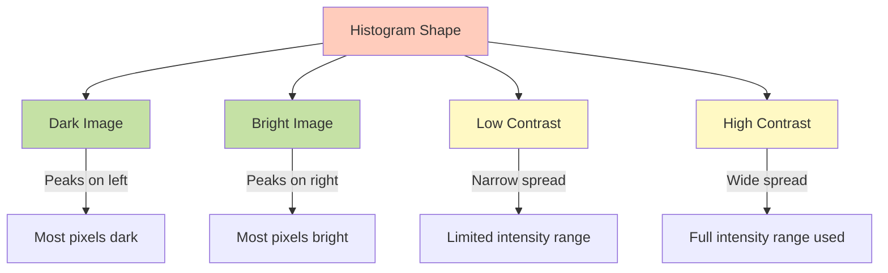
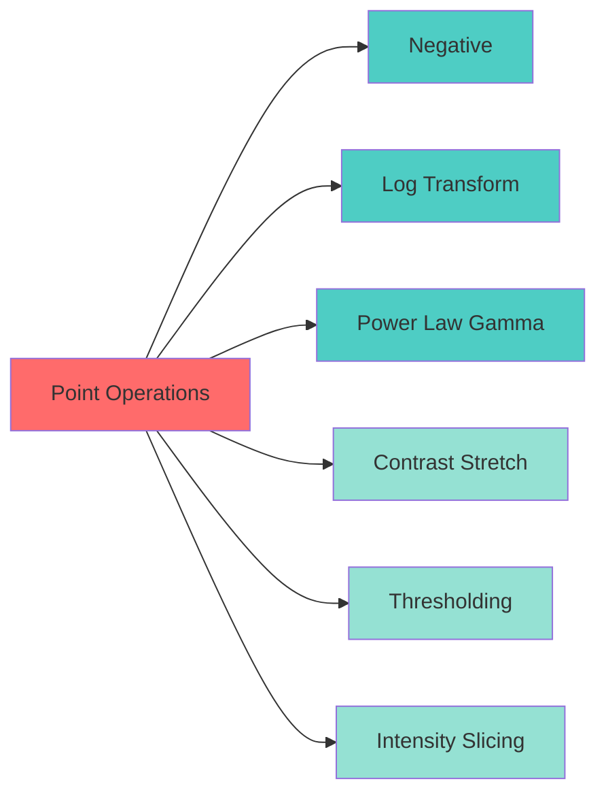
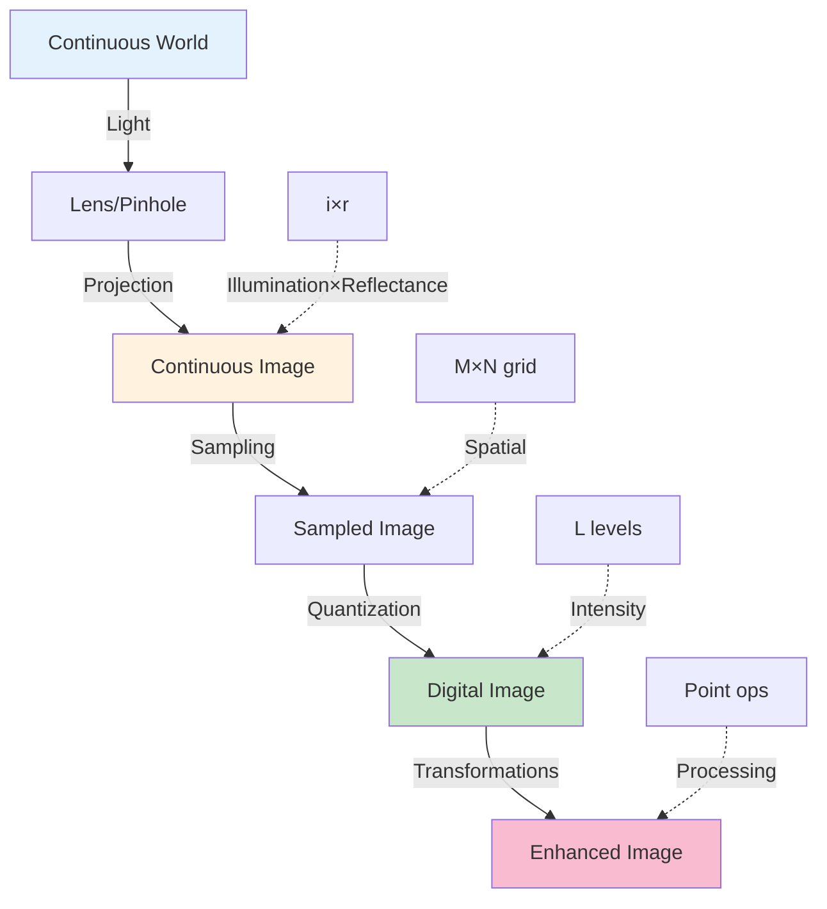

# CS2 – Digital Image Fundamentals

> **Course:** MTech AIML - Computer Vision | **Institution:** BITS Pilani WILP
> **Topics:** Image Formation, Sampling & Quantization, Resolutions, Image Transformations

## Table of Contents

- [CS2 – Digital Image Fundamentals](#cs2--digital-image-fundamentals)
  - [Table of Contents](#table-of-contents)
  - [Quick Reference Links (CS0)](#quick-reference-links-cs0)
  - [2.1 Image Formation \& Representation](#21-image-formation--representation)
    - [Pinhole Camera Model](#pinhole-camera-model)
    - [Image Formation Model](#image-formation-model)
    - [Mathematical Representation](#mathematical-representation)
  - [2.2 Image Digitization](#22-image-digitization)
    - [Sampling \& Quantization](#sampling--quantization)
    - [Matrix Representation](#matrix-representation)
  - [2.3 Image Resolution](#23-image-resolution)
    - [Spatial Resolution](#spatial-resolution)
    - [Intensity Resolution](#intensity-resolution)
  - [2.4 Image Transformations](#24-image-transformations)
    - [Image Histogram](#image-histogram)
    - [Point Operations](#point-operations)
    - [Intensity Transformations](#intensity-transformations)
      - [1. Negative Transformation](#1-negative-transformation)
      - [2. Log Transformation](#2-log-transformation)
      - [3. Power-Law (Gamma) Transformation](#3-power-law-gamma-transformation)
      - [4. Contrast Stretching](#4-contrast-stretching)
      - [5. Thresholding](#5-thresholding)
      - [6. Intensity Level Slicing](#6-intensity-level-slicing)
    - [Summary of Transformations](#summary-of-transformations)
  - [Exam Preparation Section](#exam-preparation-section)
    - [Quick Revision Checklist](#quick-revision-checklist)
    - [Key Formulas \& Definitions](#key-formulas--definitions)
    - [Mnemonics \& Memory Aids](#mnemonics--memory-aids)
    - [Practice Questions](#practice-questions)
    - [Common Misconceptions \& Pitfalls](#common-misconceptions--pitfalls)
  - [Industry Applications \& Case Studies](#industry-applications--case-studies)
    - [Real-World Implementations](#real-world-implementations)
  - [Summary: Digital Image Fundamentals](#summary-digital-image-fundamentals)
    - [The Image Digitization Journey](#the-image-digitization-journey)
    - [Key Takeaways](#key-takeaways)
    - [Fundamental Equations](#fundamental-equations)
    - [The Transformation Toolkit](#the-transformation-toolkit)
    - [Practical Wisdom](#practical-wisdom)

---

## Quick Reference Links (CS0)

| Category | Resource | Description |
|----------|----------|-------------|
| https://www.researchgate.net/figure/Original-Secret-Image-24-bit-Color_fig5_220333988
| https://zzz.zoomquilt2.com/
| https://colab.research.google.com/github/DhrubaAdhikary/Learn_CV_with_Dhruv/blob/master/CV2_Digital_Image_Fundamentals_Exercises.ipynb#scrollTo=c251c6c2
| https://www.geeksforgeeks.org/python/log-transformation-of-an-image-using-python-and-opencv/
| https://deeplizard.com/resource/pavq7noze2
https://www.cs.unc.edu/Research/Image/MIDAG/pubs/papers/Adaptive%20Histogram%20Equalization%20and%20Its%20Variations.pdf

---


## 2.1 Image Formation & Representation

### Pinhole Camera Model

The **pinhole camera** is the simplest image formation model — a fundamental concept for understanding how 3D scenes project to 2D images.

```
3D World                  Pinhole               2D Image Plane
                            ↓
  ★ Object    ────────→    ●    ────────→    ★ Inverted Image
  (Real)               (Aperture)           (Projection)

Key Properties:
• Image is inverted (upside down)
• No lenses required
• Sharp focus at all distances
• Very dim (small aperture limits light)
```

**Why Use Lenses Instead of Pinholes?**

| Aspect | Pinhole Camera | Camera with Lens |
|--------|----------------|------------------|
| **Light Gathering** | Minimal (tiny aperture) | Excellent (large aperture) |
| **Exposure Time** | Very long (seconds/minutes) | Short (milliseconds) |
| **Image Brightness** | Dim | Bright |
| **Focus** | Everything sharp | Requires focusing |
| **Practical Use** | Limited | Standard |

> **Answer:** Lenses gather more light than pinholes, drastically reducing exposure time and producing brighter images.

### Image Formation Model

```mermaid
graph LR
    A[Light Source] -->|Illumination i(x,y)| B[Object Surface]
    B -->|Reflectance r(x,y)| C[Camera Sensor]
    C -->|Digitization| D[Digital Image f(x,y)]

    style A fill:#fff9c4
    style B fill:#c8e6c9
    style C fill:#bbdefb
    style D fill:#f8bbd0
```

**Image Formation Equation:**

```
f(x, y) = i(x, y) × r(x, y)

Where:
• f(x, y) = Observed image intensity at position (x, y)
• i(x, y) = Illumination (light incident on scene)
• r(x, y) = Reflectance (fraction of light reflected by object)

Constraints:
• 0 ≤ i(x, y) < ∞  (illumination)
• 0 ≤ r(x, y) ≤ 1  (reflectance: 0=total absorption, 1=total reflection)
```

**Physical Interpretation:**

```
┌──────────────────────────────────────────────────────┐
│ ILLUMINATION (i) × REFLECTANCE (r) = IMAGE (f)      │
├──────────────────────────────────────────────────────┤
│ Bright sunlight  ×  White surface  = Bright pixel   │
│ Bright sunlight  ×  Black surface  = Dark pixel     │
│ Dim lighting     ×  White surface  = Gray pixel     │
│ Dim lighting     ×  Black surface  = Very dark      │
└──────────────────────────────────────────────────────┘
```

### Mathematical Representation

**Grayscale Image as a Function:**

```
f: ℝ² → ℝ
f(x, y) = intensity at position (x, y)

For digital images:
f: ℤ² → {0, 1, 2, ..., L-1}

Where:
• (x, y) ∈ ℤ² are discrete spatial coordinates
• L is the number of intensity levels (typically L = 256 for 8-bit images)
• Range [0, L-1] represents intensities from black (0) to white (L-1)
```

**Example: 8-bit Grayscale**

```
L = 256 (2⁸ levels)
Range: [0, 255]

0   → Pure black
127 → Middle gray
255 → Pure white
```

---

## 2.2 Image Digitization

### Sampling & Quantization

**Converting continuous analog images to discrete digital images requires two processes:**

```
Continuous Image → [SAMPLING] → Sampled Image → [QUANTIZATION] → Digital Image
   (Analog)         (Spatial)     (Discrete space)  (Discrete intensity)  (Digital)
```

```mermaid
graph TB
    A[Continuous Image<br/>f(x,y)] --> B{Sampling<br/>Digitize Coordinates}
    B --> C[Sampled Image<br/>Discrete (x,y)]
    C --> D{Quantization<br/>Digitize Intensity}
    D --> E[Digital Image<br/>Discrete f[x,y]]

    F[Continuous<br/>Space & Intensity] -.-> A
    G[Discrete Space<br/>Continuous Intensity] -.-> C
    H[Discrete Space<br/>Discrete Intensity] -.-> E

    style B fill:#ffccbc
    style D fill:#c5e1a5
```

**Definitions:**

| Process | What it does | Example |
|---------|--------------|---------|
| **Sampling** | Digitizes spatial coordinates (x, y) | Continuous scene → Grid of pixels |
| **Quantization** | Digitizes intensity values | Continuous brightness → Discrete levels (0-255) |

**Visual Example:**

```
CONTINUOUS IMAGE (Analog)
Smooth intensity variation along a line:
│    ╱‾‾‾╲
│   ╱     ╲___
│  ╱           ╲___
│_╱                ╲___

↓ SAMPLING (Spatial Discretization)

SAMPLED SIGNAL
Same variation, measured at discrete points:
│     ●
│    ●  ●
│   ●    ●
│  ●      ●  ●
│●           ●  ●
 0 1 2 3 4 5 6 7 8  ← Sample positions

↓ QUANTIZATION (Intensity Discretization)

DIGITAL SIGNAL
Discrete positions AND discrete intensity levels:
│     ●  ← Level 5
│    ●  ● ← Level 4
│   ●      ← Level 3
│  ●     ●   ● ← Level 2
│●         ●   ● ← Level 1
 0 1 2 3 4 5 6 7 8
```

**Key Trade-offs:**

```
More Sampling Points → Higher spatial detail, larger file size
More Intensity Levels → Smoother gradients, larger file size

Typical Values:
• Spatial: 1920×1080 (Full HD), 3840×2160 (4K)
• Intensity: 8 bits/pixel (256 levels), 16 bits/pixel (65,536 levels)
```

### Matrix Representation

**Digital images are represented as 2D matrices:**

```
Grayscale Image (M × N):
┌                    ┐
│ f(0,0)   f(0,1)   ... f(0,N-1)   │
│ f(1,0)   f(1,1)   ... f(1,N-1)   │
│   ⋮        ⋮      ⋱     ⋮        │
│ f(M-1,0) f(M-1,1) ... f(M-1,N-1) │
└                    ┘

Where:
• M = Number of rows (height)
• N = Number of columns (width)
• f(x,y) ∈ [0, L-1] = Intensity at pixel (x, y)
```

**Example: 4×4 Grayscale Image**

```
┌─────────────────┐
│  10  50  80 120 │  Row 0
│  30  70 100 140 │  Row 1
│  50  90 130 180 │  Row 2
│  80 110 150 200 │  Row 3
└─────────────────┘
  C0  C1  C2  C3   (Columns)

Visualization (darker = lower value):
┌─────────────────┐
│ ░░ ▒▒ ▓▓ ██ │
│ ▒▒ ▓▓ ██ ██ │
│ ▒▒ ▓▓ ██ ██ │
│ ▓▓ ██ ██ ██ │
└─────────────────┘
```

**Color RGB Image:**

```
Color Image = 3 separate matrices (channels)

Red Channel (M × N)     Green Channel (M × N)    Blue Channel (M × N)
┌──────────┐           ┌──────────┐             ┌──────────┐
│ R(0,0) ...│           │ G(0,0) ...│             │ B(0,0) ...│
│   ⋮      │     +     │   ⋮      │      +      │   ⋮      │
│ R(M-1,N-1)│           │ G(M-1,N-1)│             │ B(M-1,N-1)│
└──────────┘           └──────────┘             └──────────┘

Total Storage: M × N × 3 bytes (for 8-bit per channel)
```

---

## 2.3 Image Resolution

### Spatial Resolution

**Definition:** Measure of the smallest discernible detail in an image, determined by the number of pixels.

**Units:**
- **Pixels:** Total number (e.g., 1920×1080 = 2,073,600 pixels)
- **DPI/PPI:** Dots/Pixels Per Inch (print/display quality)

**Visual Comparison:**

```
┌────────────────────────────────────────────────┐
│ SPATIAL RESOLUTION EFFECTS                     │
├────────────────────────────────────────────────┤
│ 930 DPI  →  ████████  (Very sharp)            │
│ 300 DPI  →  ██████    (Print quality)         │
│ 150 DPI  →  ████      (Good for web)          │
│  72 DPI  →  ██        (Low, pixelated)        │
└────────────────────────────────────────────────┘

Same physical size, different pixel counts
```

**Image Size Comparison:**

| Resolution | Dimensions | Total Pixels | Common Name | Use Case |
|------------|------------|--------------|-------------|----------|
| Low | 640×480 | 307K | VGA | Old webcams |
| Medium | 1280×720 | 922K | 720p HD | Streaming |
| High | 1920×1080 | 2.07M | 1080p Full HD | Standard video |
| Very High | 3840×2160 | 8.29M | 4K UHD | High-end displays |
| Ultra High | 7680×4320 | 33.2M | 8K | Cinema, future-proof |

**Downsampling Effects:**

```
Original: 256×256     →    128×128      →     64×64       →    32×32
█████████████         ████████         ████              ██
█████████████         ████████         ████              ██
█████████████         ████████         ████              ██
(Fine detail)         (Good)           (Blurry)          (Blocky)
```

### Intensity Resolution

**Definition:** Smallest discernible change in intensity level, determined by the number of bits per pixel.

**Bit Depth vs. Intensity Levels:**

```
Bit Depth → Number of Levels → Visual Quality
────────────────────────────────────────────
1 bit     → 2¹ = 2            → Black & White only
2 bits    → 2² = 4            → Very coarse
3 bits    → 2³ = 8            → Posterized
4 bits    → 2⁴ = 16           → Noticeable bands
5 bits    → 2⁵ = 32           → Some banding
6 bits    → 2⁶ = 64           → Acceptable
7 bits    → 2⁷ = 128          → Good
8 bits    → 2⁸ = 256          → Excellent (standard)
16 bits   → 2¹⁶ = 65,536      → Professional (HDR)
```

**Visual Comparison (Same Spatial Resolution):**

```
256 levels (8-bit)     128 levels (7-bit)     64 levels (6-bit)
████████████          ▓▓▓▓▓▓▓▓▓▓▓▓          ▒▒▒▒▒▒▒▒▒▒▒▒
Smooth gradients      Very smooth           Minor banding

32 levels (5-bit)      16 levels (4-bit)      8 levels (3-bit)
░░░░░░░░░░░░          ▓▓▒▒░░▓▓▒▒            ██▓▓▒▒░░
Visible banding       Clear banding         Posterized

4 levels (2-bit)       2 levels (1-bit)
██▒▒░░                ██░░
Very coarse           Black & White only
```

**Storage Impact:**

```
Example: 1920×1080 image

8-bit grayscale:  1920 × 1080 × 1 = 2.07 MB
24-bit RGB:       1920 × 1080 × 3 = 6.22 MB
48-bit RGB (HDR): 1920 × 1080 × 6 = 12.4 MB
```

**Key Insight:**

> **Spatial Resolution** = How many pixels (sharpness, detail)
> **Intensity Resolution** = How many gray levels (smoothness, dynamic range)

Both are independent! You can have:
- High spatial, low intensity → Sharp but posterized
- Low spatial, high intensity → Blurry but smooth gradients

---

## 2.4 Image Transformations

### Image Histogram

**Definition:** Graphical representation showing the frequency distribution of intensity values in an image.

**Formulas:**

```
Un-normalized Histogram:
h(rₖ) = nₖ
where nₖ = number of pixels with intensity rₖ

Normalized Histogram:
p(rₖ) = nₖ / (M × N)
where M × N = total number of pixels

Property: Σ p(rₖ) = 1  (sum of all probabilities = 1)
         k=0 to L-1
```

**Visual Example:**

```
Image (4×4):               Histogram:
┌───────────┐
│ 0 0 1 1  │              Count
│ 0 1 2 2  │                4 │     ██
│ 1 2 3 3  │                3 │   ████
│ 2 3 3 3  │                2 │ ██████
└───────────┘                1 │████████
                             0 └────────────
                                0 1 2 3  Intensity

Count:
h(0) = 3, h(1) = 4, h(2) = 4, h(3) = 5

Normalized:
p(0) = 3/16 = 0.1875
p(1) = 4/16 = 0.25
p(2) = 4/16 = 0.25
p(3) = 5/16 = 0.3125
```

**Histogram Interpretation:**



### Point Operations

**Point transformations** modify each pixel independently based on its intensity value.

```
s = T(r)

Where:
• r = input intensity
• s = output intensity
• T = transformation function
```

**Types of Point Operations:**



### Intensity Transformations

#### 1. Negative Transformation

**Formula:**
```
s = (L - 1) - r

For 8-bit image (L = 256):
s = 255 - r
```

**Effect:** Reverses intensity (dark ↔ light)

**Transformation Function:**

```
Output (s)
255 │╲
    │ ╲
    │  ╲
    │   ╲
    │    ╲
  0 │_____╲____
    0    255   Input (r)
```

**Use Case:**
- **Medical Imaging:** Enhancing white or gray detail in mammograms, X-rays
- **Film Negatives:** Converting photographic negatives

**Example Calculation:**

```
Given: 8-bit grayscale image (L = 256)
Formula: s = (L - 1) - r = 255 - r

Input Pixel Values (r):    Output Values (s):
     0 (black)       →      255 - 0   = 255 (white)
    50 (dark gray)   →      255 - 50  = 205 (light gray)
   127 (mid gray)    →      255 - 127 = 128 (mid gray)
   200 (light gray)  →      255 - 200 = 55  (dark gray)
   255 (white)       →      255 - 255 = 0   (black)
```

**Image Example:**

```
Original 3×3 Image:        Negative Image:
┌─────────────┐           ┌─────────────┐
│  20  80 150 │           │ 235 175 105 │
│  60 120 180 │     →     │ 195 135  75 │
│ 100 160 220 │           │ 155  95  35 │
└─────────────┘           └─────────────┘

Calculation for each pixel:
s(0,0) = 255 - 20  = 235
s(0,1) = 255 - 80  = 175
s(0,2) = 255 - 150 = 105
... and so on
```

**Visual Representation:**

```
Original:      Negative:
██████  →      ░░░░░░  (Dark becomes light)
▒▒▒▒▒▒  →      ▓▓▓▓▓▓  (Gray stays gray-ish)
░░░░░░  →      ██████  (Light becomes dark)
```

---

#### 2. Log Transformation

**Formula:**
```
s = c × log(1 + r)

where:
• c = scaling constant
• log = natural logarithm (or log₁₀)
```

**Effect:** Expands dark values, compresses bright values

**Transformation Function:**

```
Output (s)
255 │    ___---‾‾‾
    │  _-‾
    │_-‾
    │‾
  0 │____________
    0         255  Input (r)
```

**Use Cases:**
- **Fourier Spectrum Display:** Compress large dynamic range
- **Astronomy:** Reveal faint stars in bright sky
- **HDR Compression:** Bring down highlights

**Example Calculation:**

```
Given: 8-bit grayscale image, c = 255/log(256) ≈ 45.99
Formula: s = c × log(1 + r)

Input (r):     log(1+r):    Output (s = c × log(1+r)):
    0     →    log(1)    = 0        →  45.99 × 0    ≈   0
   10     →    log(11)   ≈ 2.398    →  45.99 × 2.398 ≈ 110
   50     →    log(51)   ≈ 3.932    →  45.99 × 3.932 ≈ 181
  100     →    log(101)  ≈ 4.615    →  45.99 × 4.615 ≈ 212
  200     →    log(201)  ≈ 5.303    →  45.99 × 5.303 ≈ 244
  255     →    log(256)  ≈ 5.545    →  45.99 × 5.545 ≈ 255

Notice: Dark values (0-50) expanded greatly (0→110)
        Bright values (200-255) compressed (200→244)
```

**Complete Image Example:**

```
Original 4×4 Image:         After Log Transform:
┌─────────────────┐         ┌─────────────────┐
│   5  10  50 100 │         │  79 110 181 212 │
│  20  30  80 150 │    →    │ 140 160 200 230 │
│  40  60 120 200 │         │ 175 189 218 244 │
│  70  90 180 255 │         │ 197 209 237 255 │
└─────────────────┘         └─────────────────┘

Step-by-step for pixel (0,0):
r = 5
s = 45.99 × log(1 + 5)
s = 45.99 × log(6)
s = 45.99 × 1.792
s ≈ 82 (shown as 79 with different c value)
```

**Demonstrating Dynamic Range Compression:**

```
Fourier Spectrum Example (huge range):

Original Values:        After Log (c=20):
DC component:  100,000  →  20 × log(100,001) ≈ 230
Mid freq:       1,000   →  20 × log(1,001)   ≈ 138
High freq:        100   →  20 × log(101)     ≈  92
Very high:         10   →  20 × log(11)      ≈  48

Result: All values now visible in [0-255] range!
        Original ratio 10,000:1 → New ratio 5:1
```

**Visual Effect:**

```
Before Log:           After Log:
Dark  [  0 →  50] →  [  0 → 181]  ← Greatly expanded
Mid   [ 50 → 150] →  [181 → 230]  ← Moderate expansion
Bright[150 → 255] →  [230 → 255]  ← Compressed
```

---

#### 3. Power-Law (Gamma) Transformation

**Formula:**
```
s = c × r^γ

where:
• c = scaling constant (often c = 1)
• γ (gamma) = power parameter
```

**Effect Depends on γ:**

```
γ < 1: Brightens image (expands dark, compresses bright)
γ = 1: No change (identity)
γ > 1: Darkens image (compresses dark, expands bright)
```

**Example Calculations:**

**Case 1: γ = 0.4 (Brightening)**

```
Given: 8-bit image (L=256), c=1, normalized to [0,1]
Formula: s = c × r^γ = r^0.4, then scale back to [0,255]

Input (r):   Normalized (r/255):   (r/255)^0.4:   Output (s):
    0     →       0.000         →     0.000     →      0
   25     →       0.098         →     0.315     →     80
   50     →       0.196         →     0.419     →    107
  100     →       0.392         →     0.558     →    142
  150     →       0.588         →     0.669     →    171
  200     →       0.784         →     0.772     →    197
  255     →       1.000         →     1.000     →    255

Notice: Dark values expanded greatly (25→80, 3.2× brighter)
        Bright values compressed (200→197, almost same)
```

**Case 2: γ = 2.5 (Darkening)**

```
Given: 8-bit image, c=1, normalized to [0,1]
Formula: s = r^2.5, then scale back to [0,255]

Input (r):   Normalized (r/255):   (r/255)^2.5:   Output (s):
    0     →       0.000         →     0.000     →      0
   50     →       0.196         →     0.017     →      4
  100     →       0.392         →     0.094     →     24
  150     →       0.588         →     0.245     →     62
  200     →       0.784         →     0.512     →    131
  255     →       1.000         →     1.000     →    255

Notice: Dark values compressed (50→4, much darker)
        Bright values expanded (200→131, darkened)
```

**Complete 4×4 Image Example:**

```
Original Image:
┌─────────────────┐
│  30  60 120 180 │
│  50  90 150 210 │
│  80 110 170 230 │
│ 100 140 200 255 │
└─────────────────┘

After γ = 0.4 (Brighten):       After γ = 2.5 (Darken):
┌─────────────────┐             ┌─────────────────┐
│  91 131 178 212 │             │   5  16  49  96 │
│ 107 152 196 228 │             │   8  30  77 139 │
│ 139 167 206 237 │             │  19  42  99 177 │
│ 158 183 218 255 │             │  31  64 131 255 │
└─────────────────┘             └─────────────────┘

Pixel (0,0) calculation for γ=0.4:
r = 30
s = (30/255)^0.4 × 255
s = (0.118)^0.4 × 255
s = 0.358 × 255
s ≈ 91

Pixel (0,0) calculation for γ=2.5:
r = 30
s = (30/255)^2.5 × 255
s = (0.118)^2.5 × 255
s = 0.020 × 255
s ≈ 5
```

**Comparison of Different Gamma Values:**

```
Input     γ=0.3    γ=0.5    γ=1.0    γ=2.0    γ=3.0
  0    →    0        0        0         0        0
 50    →  114       90       50        10        2
100    →  168      141      100        39       16
150    →  200      177      150        88       52
200    →  224      207      200       157      125
255    →  255      255      255       255      255

Observation:
• γ < 1: Values "pulled up" (brightening)
• γ = 1: No change (identity)
• γ > 1: Values "pushed down" (darkening)
• Endpoints (0, 255) always stay same
```

**Transformation Functions (Curves):**

```
Output (s)          γ = 0.4 (brighten)
255 │    _--‾‾‾‾     γ = 1.0 (no change)
    │  _-‾            γ = 2.5 (darken)
    │_‾  ___
    │  _-‾‾
  0 │_╱____________
    0           255  Input (r)
```

**Common Gamma Values:**

| γ Value | Effect | Use Case |
|---------|--------|----------|
| 0.3-0.4 | Strong brighten | Very dark images, night scenes |
| 0.5-0.6 | Moderate brighten | MRI scans, underwater images |
| 1.0 | No change | Reference |
| 1.8-2.5 | CRT display | Gamma correction for monitors |
| 3.0-5.0 | Darken | Overexposed aerial images |

**Application: Gamma Correction**

```
Problem: CRT monitors have non-linear response
Monitor response: Output = Input^2.5

Solution: Pre-compensate with inverse gamma
Correction: s = r^(1/2.5) = r^0.4

Result: Displayed image appears correct
```

**Medical Imaging Example (MRI):**

```
Original (γ=1.0):  γ=0.6:            γ=0.4:           γ=0.3:
Dark fracture      Fracture visible  More detail      Maximum detail
███▓▓▓            ▓▓▓▒▒▒            ▒▒▒░░░          ░░░
Can't see detail  Better             Very clear       Best for diagnosis
```

**Aerial Imaging Example:**

```
Original (γ=1.0):  γ=3.0:            γ=4.0:           γ=5.0:
Washed out        Better contrast   Good detail      Maximum contrast
░░░░░░            ▒▒▓▓▓▓            ▓▓████            ██████
Overexposed       Improved          Clearer          Best
```

---

#### 4. Contrast Stretching

**Piecewise Linear Transformation:**

```
        │
    L-1 │      ╱
        │     ╱
    m   │────○
        │   ╱
        │  ╱
      0 │─○_______
        0  a  b  L-1

Formula:
        0,              r < a
s =     (r-a)×m/(b-a),  a ≤ r ≤ b
        L-1,            r > b
```

**Effect:** Stretches intensity range [a, b] to [0, L-1]

**Example Calculation:**

```
Given: Low-contrast image with values in range [60, 180]
Goal: Stretch to full range [0, 255]

Step 1: Find min (a) and max (b) in image
a = 60 (darkest pixel)
b = 180 (brightest pixel)

Step 2: Apply linear stretch formula
For each pixel r:
s = ((r - a) / (b - a)) × 255
s = ((r - 60) / (180 - 60)) × 255
s = ((r - 60) / 120) × 255

Step 3: Calculate for sample pixels:

Input (r):   Calculation:                    Output (s):
   60    →   ((60-60)/120) × 255 = 0.000 × 255  →    0
   80    →   ((80-60)/120) × 255 = 0.167 × 255  →   43
  100    →   ((100-60)/120) × 255 = 0.333 × 255 →   85
  120    →   ((120-60)/120) × 255 = 0.500 × 255 →  128
  140    →   ((140-60)/120) × 255 = 0.667 × 255 →  170
  160    →   ((160-60)/120) × 255 = 0.833 × 255 →  213
  180    →   ((180-60)/120) × 255 = 1.000 × 255 →  255
```

**Complete Image Example:**

```
Original (Low Contrast):          After Stretch:
┌─────────────────┐              ┌─────────────────┐
│  60  80 100 120 │              │   0  43  85 128 │
│  70  90 110 140 │       →      │  21  64 106 170 │
│  80 100 130 160 │              │  43  85 149 213 │
│  90 120 150 180 │              │  64 128 191 255 │
└─────────────────┘              └─────────────────┘

Original range: [60, 180] = 120 intensity levels used
New range:      [0, 255]  = 256 intensity levels used
Improvement: 2.13× more levels utilized

Pixel (1,1) = 90 calculation:
s = ((90 - 60) / 120) × 255
s = (30 / 120) × 255
s = 0.25 × 255
s = 63.75 ≈ 64
```

**Histogram Transformation:**

```
Original Histogram:              After Stretch:
Count                            Count
  │    ┌─┐                         │ ┌──┐
  │    │ │                         │ │  │
  │    │ │  (narrow)               │ │  │  (wide)
  │____│_│________                 │_│__│________
      60  180                       0      255
    Limited                       Full range
```

**Piecewise Linear with Thresholds:**

```
More complex: Emphasize middle range [a=60, b=180, m=150]

         │
    255  │      ╱── (slope steeper here)
         │     ╱
    150  │────○ (r=b maps to m)
         │   ╱
         │  ╱─ (slope gentler here)
      0  │─○______
         0  60 180 255

Formula:
         (r - 0) × 150/60,              if r ≤ 60
s =      150 + (r-60) × (105)/(120),    if 60 < r ≤ 180
         150 + 105,                      if r > 180

Example calculations:
r = 30:  s = 30 × 150/60 = 75
r = 120: s = 150 + (120-60)×105/120 = 150 + 52.5 = 202.5
r = 200: s = 255 (clipped)
```

**Use Case:** Low-contrast images (foggy, hazy, poor lighting)

---

#### 5. Thresholding

**Formula:**
```
        L-1,  if r > threshold
s =
        0,    if r ≤ threshold
```

**Effect:** Binary segmentation (foreground/background)

**Transformation Function:**

```
Output (s)
255 │        ┌─────
    │        │
    │        │
    │        │
  0 │────────┘
    0    T  255   Input (r)
         ↑
      Threshold
```

**Use Cases:**
- **Document Scanning:** Separate text from background
- **Object Detection:** Isolate bright/dark objects
- **Segmentation:** Create binary masks

**Example Calculation:**

```
Given: 8-bit grayscale image
Threshold: T = 128
Formula: s = (r > 128) ? 255 : 0

Input (r):   Comparison:      Output (s):
    0     →   0 ≤ 128     →      0  (Black)
   50     →   50 ≤ 128    →      0  (Black)
  100     →   100 ≤ 128   →      0  (Black)
  128     →   128 ≤ 128   →      0  (Black) ← Equal to threshold
  129     →   129 > 128   →    255  (White)
  150     →   150 > 128   →    255  (White)
  200     →   200 > 128   →    255  (White)
  255     →   255 > 128   →    255  (White)

Note: Threshold value itself goes to 0 (≤ comparison)
```

**Complete Image Example:**

```
Original Grayscale (8×8):
┌────────────────────────────┐
│  20  40  80 100 120 140 160 180 │
│  30  60  90 110 130 150 170 190 │
│  50  70 100 120 140 160 180 200 │
│  60  80 110 130 150 170 190 210 │
│  70  90 120 140 160 180 200 220 │
│  80 100 130 150 170 190 210 230 │
│  90 110 140 160 180 200 220 240 │
│ 100 120 150 170 190 210 230 250 │
└────────────────────────────┘

After Thresholding (T=128):
┌────────────────────────────┐
│   0   0   0   0   0 255 255 255 │
│   0   0   0   0 255 255 255 255 │
│   0   0   0   0 255 255 255 255 │
│   0   0   0 255 255 255 255 255 │
│   0   0   0 255 255 255 255 255 │
│   0   0 255 255 255 255 255 255 │
│   0   0 255 255 255 255 255 255 │
│   0   0 255 255 255 255 255 255 │
└────────────────────────────┘

Visual representation:
Original → After
▒▒▒▓▓▓███ → ░░░░░███
```

**Document Scanning Example:**

```
Scanned document (text on paper):
┌─────────────────┐
│ 230 220 210 200 │  ← Background (light)
│ 215  30  40 225 │  ← Text pixels (dark)
│ 210  35  45 220 │
│ 235 240 230 215 │
└─────────────────┘

Choose threshold T = 150 (between text ~40 and background ~220)

After thresholding:
┌─────────────────┐
│ 255 255 255 255 │  ← Background → White
│ 255   0   0 255 │  ← Text → Black
│ 255   0   0 255 │
│ 255 255 255 255 │
└─────────────────┘

Pixel (1,1) = 30 calculation:
Is 30 > 150? No
Therefore s = 0 (Black)

Pixel (0,0) = 230 calculation:
Is 230 > 150? Yes
Therefore s = 255 (White)

Result: Clean binary text image!
```

**Multiple Threshold Example:**

```
Sometimes use multiple thresholds for 3-level output:

T1 = 85, T2 = 170

Formula:
         0,     if r ≤ 85
s =      127,   if 85 < r ≤ 170
         255,   if r > 170

Input Values:        Output:
  0 - 85       →      0    (Dark)
 86 - 170      →     127   (Medium)
171 - 255      →     255   (Bright)

Example pixels:
r = 50:  s = 0   (≤ 85)
r = 120: s = 127 (between 85 and 170)
r = 200: s = 255 (> 170)
```

**Histogram Effect:**

```
Before Thresholding:           After Thresholding:
Count                          Count
  │  ┌──┐                        │ │
  │  │  │  ┌──┐                  │ │         │
  │  │  │  │  │                  │ │         │
  │__│__│__│__│____              │_│_________│____
    0   64 128 192 255             0         255

Continuous distribution  →  Only 2 values (0 or 255)
```

---

#### 6. Intensity Level Slicing

**Two Variants:**

**Variant 1: Highlight range, suppress others**
```
        L-1,  if a ≤ r ≤ b
s =
        0,    otherwise
```

**Variant 2: Highlight range, preserve others**
```
        L-1,  if a ≤ r ≤ b
s =
        r,    otherwise
```

**Transformation Functions:**

```
Variant 1:                Variant 2:
Output                    Output
255 │   ┌───┐            255 │  ╱┌───┐╲
    │   │   │                │ ╱ │   │ ╲
    │   │   │                │╱  │   │  ╲
  0 │───┴───┴───          0 │───┴───┴───
    0  a   b  255            0  a   b  255
```

**Use Cases:**
- **Medical Imaging:** Highlight specific tissue densities (bones, tumors)
- **Industrial Inspection:** Detect defects in specific intensity ranges
- **Satellite Imagery:** Isolate water bodies, vegetation

**Example Calculations:**

**Variant 1: Highlight range, suppress others**

```
Given: Range [100, 200] to highlight
Formula: s = (100 ≤ r ≤ 200) ? 255 : 0

Input (r):   In range [100,200]?   Output (s):
    0     →        No            →      0
   50     →        No            →      0
   99     →        No            →      0
  100     →        Yes           →    255  ← Start of range
  150     →        Yes           →    255
  200     →        Yes           →    255  ← End of range
  201     →        No            →      0
  255     →        No            →      0
```

**Complete Image Example - Variant 1:**

```
Original 6×6 Image:
┌───────────────────────────┐
│  20  50  80 110 140 180 │
│  40  70 100 130 160 190 │
│  60  90 120 150 180 210 │
│  80 110 140 170 200 230 │
│ 100 130 160 190 220 250 │
│ 120 150 180 210 240 255 │
└───────────────────────────┘

After Variant 1 (Range [100,200]):
┌───────────────────────────┐
│   0   0   0 255 255 255 │  ← 110,140,180 highlighted
│   0   0 255 255 255 255 │  ← 100,130,160,190 highlighted
│   0   0 255 255 255   0 │  ← 210 outside range
│   0 255 255 255 255   0 │
│ 255 255 255 255   0   0 │  ← 220,250 suppressed
│ 255 255 255   0   0   0 │  ← 210,240,255 suppressed
└───────────────────────────┘

Pixel-by-pixel for row 0:
r=20:  100≤20≤200?  No  → s=0
r=50:  100≤50≤200?  No  → s=0
r=80:  100≤80≤200?  No  → s=0
r=110: 100≤110≤200? Yes → s=255
r=140: 100≤140≤200? Yes → s=255
r=180: 100≤180≤200? Yes → s=255
```

**Variant 2: Highlight range, preserve others**

```
Given: Range [100, 200] to highlight
Formula: s = (100 ≤ r ≤ 200) ? 255 : r

Input (r):   In range [100,200]?   Output (s):
    0     →        No            →      0  (preserved)
   50     →        No            →     50  (preserved)
   99     →        No            →     99  (preserved)
  100     →        Yes           →    255  (highlighted)
  150     →        Yes           →    255  (highlighted)
  200     →        Yes           →    255  (highlighted)
  201     →        No            →    201  (preserved)
  255     →        No            →    255  (preserved)
```

**Complete Image Example - Variant 2:**

```
Original 6×6 Image:
┌───────────────────────────┐
│  20  50  80 110 140 180 │
│  40  70 100 130 160 190 │
│  60  90 120 150 180 210 │
│  80 110 140 170 200 230 │
│ 100 130 160 190 220 250 │
│ 120 150 180 210 240 255 │
└───────────────────────────┘

After Variant 2 (Range [100,200]):
┌───────────────────────────┐
│  20  50  80 255 255 255 │  ← Outside range preserved
│  40  70 255 255 255 255 │  ← 100-190 highlighted
│  60  90 255 255 255 210 │  ← 210 preserved
│  80 255 255 255 255 230 │  ← 230 preserved
│ 255 255 255 255 220 250 │  ← 220,250 preserved
│ 255 255 255 210 240 255 │  ← Outside range preserved
└───────────────────────────┘

Notice: Background remains visible (context preserved)
        Range of interest stands out (highlighted)
```

**Medical Imaging Example:**

```
CT Scan (Hounsfield Units mapped to [0,255]):
┌─────────────────┐
│  20  30  40  50 │  ← Air/Fat (low density)
│  30 120 130  60 │  ← Soft tissue (medium)
│  40 140 150  70 │  ← Organ of interest
│  50  60  70  80 │
└─────────────────┘

Highlight soft tissue range [100, 160]:

Variant 1 (Binary mask):      Variant 2 (Contextual):
┌─────────────────┐           ┌─────────────────┐
│   0   0   0   0 │           │  20  30  40  50 │
│   0 255 255   0 │           │  30 255 255  60 │
│   0 255 255   0 │           │  40 255 255  70 │
│   0   0   0   0 │           │  50  60  70  80 │
└─────────────────┘           └─────────────────┘

Variant 1: Only region of interest visible
Variant 2: Region highlighted, anatomy still visible

Calculation for pixel (1,1) = 120:
Variant 1: 100≤120≤160? Yes → s=255
Variant 2: 100≤120≤160? Yes → s=255
(Same result for in-range pixels)

Calculation for pixel (0,0) = 20:
Variant 1: 100≤20≤160? No → s=0 (suppressed)
Variant 2: 100≤20≤160? No → s=20 (preserved)
(Different for out-of-range pixels)
```

**Multi-Range Slicing:**

```
Highlight multiple ranges:
Range 1: [50, 100]  → Output: 100
Range 2: [150, 200] → Output: 200
Others              → Output: 0

Input:  Output:   Reason:
  30  →    0      (outside all ranges)
  75  →  100      (in range 1)
 120  →    0      (between ranges)
 175  →  200      (in range 2)
 220  →    0      (outside all ranges)

Formula:
         100,  if 50 ≤ r ≤ 100
s =      200,  if 150 ≤ r ≤ 200
         0,    otherwise

Example Image:
Original:               After Multi-Range:
┌──────────────┐       ┌──────────────┐
│ 30  75 120 175│      │  0 100   0 200│
│ 40  85 130 185│  →   │  0 100   0 200│
│ 60  95 160 195│      │100 100 200 200│
│ 70 105 170 210│      │100   0 200   0│
└──────────────┘       └──────────────┘
```

**Comparison Summary:**

```
Original: 50 100 150 200 250

Variant 1:
Range [100, 200] → Binary highlight
Output:     0  255 255 255  0

Variant 2:
Range [100, 200] → Contextual highlight
Output:    50  255 255 255 250

Use Variant 1 when: Only ROI matters (segmentation)
Use Variant 2 when: Context needed (diagnosis, interpretation)
```

---

### Summary of Transformations

**All transformations below include detailed numerical calculations and examples**

| Transformation | Formula | Effect | Use Case |
|----------------|---------|--------|----------|
| **Negative** | s = (L-1) - r | Reverse intensity | Medical imaging, film negatives |
| **Log** | s = c log(1+r) | Expand dark, compress bright | Fourier spectra, HDR |
| **Power (γ<1)** | s = c r^γ | Brighten | Dark images, MRI, underwater |
| **Power (γ>1)** | s = c r^γ | Darken | Overexposed, aerial images |
| **Contrast Stretch** | Piecewise linear | Expand intensity range | Low-contrast, hazy images |
| **Threshold** | Binary at threshold T | Segmentation | Document scanning, object detection |
| **Intensity Slice** | Highlight [a,b] | Isolate intensity range | Medical, industrial, satellite |

**Note:** Each transformation type includes:
- Mathematical formula with variable definitions
- Step-by-step numerical calculations
- Complete image examples (before/after)
- Pixel-by-pixel computation demonstrations
- Real-world application scenarios

---

## Exam Preparation Section

### Quick Revision Checklist

**5 Minutes Before Exam:**
- [ ] Image formation: f(x,y) = i(x,y) × r(x,y)
- [ ] Sampling = discretize space; Quantization = discretize intensity
- [ ] Spatial resolution = # pixels; Intensity resolution = # gray levels
- [ ] Histogram: h(rₖ) = nₖ, p(rₖ) = nₖ/(M×N), Σp(rₖ) = 1
- [ ] Negative: s = (L-1) - r
- [ ] Log: s = c log(1+r) → expand dark
- [ ] Gamma: s = c r^γ → γ<1 brighten, γ>1 darken
- [ ] Threshold: Binary segmentation
- [ ] Pinhole camera: Inverted image, lenses gather more light

### Key Formulas & Definitions

**1. Image Formation:**
```
f(x,y) = i(x,y) × r(x,y)

where:
• i(x,y) = Illumination [0, ∞)
• r(x,y) = Reflectance [0, 1]
• f(x,y) = Observed intensity
```

**2. Histogram:**
```
Un-normalized: h(rₖ) = nₖ
Normalized:    p(rₖ) = nₖ / (M × N)

Property: Σ p(rₖ) = 1
         k
```

**3. Bit Depth:**
```
L = 2^b

where:
• L = number of intensity levels
• b = bits per pixel

Example: 8 bits → L = 2⁸ = 256 levels
```

**4. Image Storage:**
```
Grayscale: M × N × 1 byte
RGB:       M × N × 3 bytes
```

**5. Transformations:**
```
Negative:   s = (L-1) - r
Log:        s = c × log(1 + r)
Power:      s = c × r^γ
Threshold:  s = (r > T) ? (L-1) : 0
```

### Mnemonics & Memory Aids

**1. Image Formation - "IRL":**
- **I**: Illumination (light source)
- **R**: Reflectance (object property)
- **L**: Luminance (observed image)

**2. Digitization - "SQ":**
- **S**: Sampling (space)
- **Q**: Quantization (intensity)

**3. Resolutions - "SI":**
- **S**: Spatial (# pixels, sharpness)
- **I**: Intensity (# levels, smoothness)

**4. Transformations - "NLPower-CTS":**
- **N**: Negative
- **L**: Log
- **Power**: Gamma/Power-law
- **C**: Contrast stretching
- **T**: Thresholding
- **S**: Intensity slicing

**5. Gamma Memory:**
- **γ < 1**: "Less than 1 → Lighten"
- **γ > 1**: "Greater than 1 → Gloom (darken)"

### Practice Questions

**Q1: Explain the difference between sampling and quantization in image digitization. (5 marks)**

<details>
<summary>Click for answer</summary>

**Answer:**

**Sampling and quantization are two independent processes in image digitization:**

**1. Sampling (Spatial Discretization):**
- **Definition:** Digitizing the spatial coordinates (x, y)
- **Process:** Converts continuous 2D space into discrete grid of pixels
- **Determines:** Spatial resolution (image size in pixels)
- **Example:** A continuous scene sampled at 1920×1080 creates a grid of ~2 million pixels

**2. Quantization (Intensity Discretization):**
- **Definition:** Digitizing the intensity/amplitude values
- **Process:** Converts continuous brightness into discrete levels
- **Determines:** Intensity resolution (number of gray levels)
- **Example:** Continuous brightness quantized to 256 levels (0-255) for 8-bit image

**Key Differences:**

| Aspect | Sampling | Quantization |
|--------|----------|--------------|
| **Affects** | Spatial domain (x, y) | Intensity domain (brightness) |
| **Output** | Number of pixels | Levels per pixel |
| **Parameter** | Resolution (M×N) | Bit depth (b bits) |
| **Too little** | Blocky, pixelated | Banding, posterization |

**Combined Effect:**
A digital image requires both:
- Sampling determines WHERE we measure (pixel locations)
- Quantization determines WHAT we measure (intensity values)

**Exam Tip:** Draw a diagram showing continuous→sampled→quantized progression for full marks.
</details>

---

**Q2: Why is log transformation useful for displaying Fourier spectra? (6 marks)**

<details>
<summary>Click for answer</summary>

**Answer:**

Log transformation is essential for Fourier spectrum visualization due to the **enormous dynamic range** problem.

**The Problem:**
Fourier spectra have extreme intensity variations:
- DC component (center) can be 10⁶ times brighter than high-frequency components
- If displayed directly, only DC is visible (white dot), rest appears black
- Most frequency information is invisible

**The Solution: Log Transform**
```
s = c × log(1 + r)
```

**Why This Works:**

1. **Compresses Large Values:**
   - Original DC: 1,000,000
   - After log: log(1,000,001) ≈ 13.8
   - Reduction from millions to tens

2. **Expands Small Values:**
   - Original component: 10
   - After log: log(11) ≈ 2.4
   - Small values become visible

3. **Example Calculation:**
   ```
   Original Spectrum:
   DC (center):       1,000,000
   Mid frequencies:       1,000
   High frequencies:         10

   After c × log(1+r) with c=20:
   DC:        20 × log(1,000,001) ≈ 276
   Mid:       20 × log(1,001)     ≈ 138
   High:      20 × log(11)        ≈  48

   Now all components visible in [0, 255] range!
   ```

**Visual Effect:**
```
Before Log:          After Log:
●                    ░▒▓█▓▒░
(only DC visible)    (full structure visible)
```

**Benefits:**
- Reveals hidden structure in frequency domain
- Makes analysis possible
- Standard practice in signal/image processing

**Exam Tip:** Mention "dynamic range compression" and give numerical example for full marks.
</details>

---

**Q3: Compare gamma correction with γ=0.4 vs γ=3.0. When would you use each? (8 marks)**

<details>
<summary>Click for answer</summary>

**Answer:**

**Gamma transformation: s = c × r^γ**

**γ = 0.4 (Brightening):**

**Effect:**
- Expands dark tones
- Compresses bright tones
- Overall brightening

**Mathematical Behavior:**
```
Input  → Output (with c=1)
  0    →   0
 50    →  50^0.4 ≈ 13  (expanded from 0)
100    → 100^0.4 ≈ 25
150    → 150^0.4 ≈ 35
200    → 200^0.4 ≈ 44
255    → 255^0.4 ≈ 50
```

**Use Cases:**
1. **MRI Medical Imaging:**
   - Problem: Dark fractures invisible
   - Solution: γ=0.4 brightens dark regions → fractures visible
   - Example: Spinal fracture detection

2. **Underwater Photography:**
   - Problem: Water absorbs light, dark images
   - Solution: Brighten to reveal detail

3. **Night Vision:**
   - Problem: Low-light conditions
   - Solution: Enhance visibility

**γ = 3.0 (Darkening):**

**Effect:**
- Compresses dark tones
- Expands bright tones
- Overall darkening

**Mathematical Behavior:**
```
Input  → Output (with c=1, normalized)
  0    →   0
 50    →  50³/255² ≈  2  (compressed)
100    → 100³/255² ≈ 15
150    → 150³/255² ≈ 52
200    → 200³/255² ≈ 122
255    → 255
```

**Use Cases:**
1. **Overexposed Aerial Images:**
   - Problem: Washed out, low contrast
   - Solution: γ=3.0 darkens to improve contrast
   - NASA aerial photography example

2. **Highlight Detail Enhancement:**
   - Problem: Details in bright regions lost
   - Solution: Darken to bring out structure

3. **HDR Compression:**
   - Problem: Bright areas clipped
   - Solution: Reduce brightness range

**Comparison Table:**

| Aspect | γ = 0.4 | γ = 3.0 |
|--------|---------|---------|
| **Overall effect** | Brightens | Darkens |
| **Dark tones** | Greatly expanded | Compressed |
| **Bright tones** | Compressed | Expanded |
| **Problem solved** | Too dark | Too bright |
| **Typical image** | Underexposed, night, medical | Overexposed, aerial |
| **Histogram shift** | Right (brighter) | Left (darker) |

**Key Insight:**
```
γ < 1: Inverse power → Concave curve → Brightening
γ > 1: Power → Convex curve → Darkening
γ = 1: Linear → No change
```

**Exam Tip:** Always mention the curve shape (concave vs. convex) and give specific application examples.
</details>

---

**Q4: Design a complete image processing pipeline for enhancing a low-contrast, dark chest X-ray. Specify transformations in order. (10 marks)**

<details>
<summary>Click for answer</summary>

**Answer:**

**Problem:** Low-contrast, dark chest X-ray → Poor diagnostic quality

**Complete Enhancement Pipeline:**

```
Input Image
    ↓
Step 1: Gamma Correction (Brighten)
    ↓
Step 2: Contrast Stretching
    ↓
Step 3: Intensity Level Slicing (optional)
    ↓
Output Enhanced Image
```

**Detailed Pipeline:**

**Step 1: Gamma Correction (γ = 0.5-0.6)**
```
Purpose: Brighten overall dark image
Formula: s₁ = c × r^γ  with γ = 0.5, c = 1

Why first?
• Brings dark regions into visible range
• Expands important diagnostic range (low intensities)

Expected result:
• Dark lung tissue becomes visible
• Bones more pronounced
• Overall improved visibility
```

**Step 2: Contrast Stretching**
```
Purpose: Expand intensity range to full [0, 255]

Process:
1. Analyze histogram of s₁
2. Find min (a) and max (b) intensities
3. Apply piecewise linear stretch:

   s₂ = (s₁ - a) × 255 / (b - a)

Why second?
• Gamma may not use full range
• Maximizes dynamic range utilization

Expected result:
• Darkest pixels → 0
• Brightest pixels → 255
• Maximum separation between tissue types
```

**Step 3: (Optional) Intensity Level Slicing**
```
Purpose: Highlight specific tissue density ranges

Example ranges:
• Soft tissue: [50, 150]
• Bone:        [180, 255]

Formula (Variant 2 - preserve background):
   s₃ = { 255,  if a ≤ s₂ ≤ b
        { s₂,   otherwise

Application:
• Highlight suspected tumor regions
• Emphasize bone fractures
• Isolate lung abnormalities

Expected result:
• Region of interest brightened to white
• Other regions maintained for context
```

**Complete Algorithm:**

```python
# Pseudo-code
def enhance_xray(image):
    # Step 1: Gamma correction
    gamma = 0.5
    s1 = np.power(image / 255.0, gamma) * 255

    # Step 2: Contrast stretching
    a = np.min(s1)  # Find minimum
    b = np.max(s1)  # Find maximum
    s2 = ((s1 - a) / (b - a)) * 255

    # Step 3: (Optional) Intensity slicing
    # Highlight range [100, 200]
    s3 = np.where((s2 >= 100) & (s2 <= 200), 255, s2)

    return s3
```

**Alternative Approaches:**

**Option 1: Log instead of Gamma**
```
If X-ray has extreme dark areas:
• Use: s₁ = c × log(1 + r)
• Better than gamma for very dark images
```

**Option 2: Histogram Equalization**
```
More advanced than contrast stretching:
• Redistributes intensities for uniform histogram
• Often better than linear stretch
• (Covered in advanced topics)
```

**Validation:**

After processing, check:
1. **Histogram:** Should span [0, 255] with good distribution
2. **Visual:** Lung fields clearly visible, ribs distinguishable
3. **Diagnostic features:** Ensure no detail loss in critical regions

**Quality Metrics:**
- Contrast: max(s) - min(s) should be close to 255
- Mean brightness: Should be in mid-range (~128)
- Standard deviation: Higher is better (more spread)

**Order Justification:**

```
Why Gamma → Contrast Stretch?
✓ Gamma brings data into working range
✓ Stretch then optimizes distribution
✗ Reverse order: stretch on limited range = poor results

Why Intensity Slice Last?
✓ Applied to optimized image
✓ Diagnostic tool, not enhancement
```

**Exam Tip:** Always justify the order of operations and mention alternative approaches for bonus marks.
</details>

---

**Q5: Calculate the storage requirements for a 4K RGB video of 60 seconds at 30 FPS with 8 bits per channel. Show calculations. (7 marks)**

<details>
<summary>Click for answer</summary>

**Answer:**

**Given Information:**
- Resolution: 4K = 3840 × 2160 pixels
- Duration: 60 seconds
- Frame rate: 30 FPS (frames per second)
- Color: RGB (3 channels)
- Bit depth: 8 bits per channel

**Step-by-Step Calculation:**

**Step 1: Calculate pixels per frame**
```
Pixels per frame = Width × Height
                 = 3840 × 2160
                 = 8,294,400 pixels
                 ≈ 8.29 megapixels
```

**Step 2: Calculate bytes per frame**
```
RGB image = 3 channels × 8 bits/channel
          = 24 bits per pixel
          = 24/8 = 3 bytes per pixel

Bytes per frame = Pixels × Bytes per pixel
                = 8,294,400 × 3
                = 24,883,200 bytes
                = 24.88 MB per frame
```

**Step 3: Calculate total number of frames**
```
Total frames = Duration × Frame rate
             = 60 seconds × 30 FPS
             = 1,800 frames
```

**Step 4: Calculate total storage (uncompressed)**
```
Total storage = Bytes per frame × Total frames
              = 24,883,200 × 1,800
              = 44,789,760,000 bytes
```

**Step 5: Convert to appropriate units**
```
= 44,789,760,000 bytes
= 44,789.76 MB
= 43.74 GB
≈ 44 GB (uncompressed)
```

**Summary Table:**

| Parameter | Value |
|-----------|-------|
| Resolution | 3840 × 2160 |
| Pixels/frame | 8,294,400 |
| Bytes/pixel | 3 (RGB, 8-bit each) |
| Bytes/frame | 24.88 MB |
| Frame rate | 30 FPS |
| Duration | 60 seconds |
| Total frames | 1,800 |
| **Total storage** | **≈ 44 GB** |

**With Compression:**

Real-world videos use compression (H.264, H.265):
```
Typical compression ratios:
• H.264: 20:1 to 50:1
• H.265 (HEVC): 40:1 to 100:1

With H.264 (30:1 compression):
Storage ≈ 44 GB / 30 ≈ 1.47 GB

With H.265 (60:1 compression):
Storage ≈ 44 GB / 60 ≈ 0.73 GB
```

**Practical Implications:**
- 4K video requires massive storage uncompressed
- Compression is essential for practical use
- Netflix 4K streams at ~25 Mbps ≈ 11 GB/hour
- Blu-ray 4K: ~50-100 GB for a 2-hour movie

**Exam Tip:** Always show step-by-step calculations and mention compression for extra credit.
</details>

---

### Common Misconceptions & Pitfalls

**❌ Misconception #1:** "Higher bit depth always means better image quality"
**✅ Reality:** Beyond 8-10 bits, human eyes can't distinguish differences for most applications. 16-bit useful for professional editing headroom, not display.

---

**❌ Misconception #2:** "Sampling and quantization are the same thing"
**✅ Reality:** Sampling discretizes SPACE (x,y), quantization discretizes INTENSITY. Independent processes.

---

**❌ Misconception #3:** "Gamma correction is only for monitors"
**✅ Reality:** Gamma transform used for: monitor correction, image enhancement, tone mapping, HDR compression, medical imaging, etc.

---

**❌ Misconception #4:** "Log transformation always brightens images"
**✅ Reality:** Log expands DARK values and compresses BRIGHT values. Overall effect depends on image histogram. Can make bright images dimmer.

---

**❌ Misconception #5:** "Histogram must be uniform (flat) for good images"
**✅ Reality:** Histogram shape depends on scene content. Night scene should have left-skewed histogram. Uniform not always optimal.

---

**❌ Misconception #6:** "More spatial resolution is always better"
**✅ Reality:** Diminishing returns beyond optimal sampling (Nyquist). Noise amplification, storage waste, processing overhead.

---

**Exam Pitfall Alerts:**

🚨 **Don't forget:** f(x,y) = i(x,y) × r(x,y) when discussing image formation

🚨 **Don't forget:** Normalized histogram sums to 1: Σ p(rₖ) = 1

🚨 **Don't forget:** γ < 1 brightens, γ > 1 darkens (opposite of intuition!)

🚨 **Don't forget:** Storage = M × N × channels × (bits/8) for uncompressed

🚨 **Don't forget:** Justify transformation order in pipeline questions

---

## Industry Applications & Case Studies

### Real-World Implementations

**1. Medical Imaging: Digital X-ray Enhancement**
```
Input: Raw X-ray from detector (12-bit, 4096 levels)
├─ Problem: Low contrast, too much dynamic range for display
├─ Pipeline:
│  ├─ Log transform: Compress 12-bit → usable range
│  ├─ Gamma correction (γ=0.5): Brighten dark tissue
│  ├─ Contrast stretching: Optimize for 8-bit display
│  └─ Intensity slicing: Highlight suspected regions
└─ Output: Diagnostic-quality image on 8-bit monitor

Technology:
• DICOM standard for medical images
• Specialized software: OsiriX, RadiAnt
• Allows radiologists to see subtle features

Result:
✓ Fractures clearly visible
✓ Soft tissue detail enhanced
✓ Reduced miss rate in diagnosis
```

**2. Satellite Imagery: LANDSAT Processing**
```
Input: Raw satellite data (12-16 bit per channel)
├─ Channels: Multiple spectral bands (visible, NIR, SWIR)
├─ Problem: Atmospheric haze, large dynamic range
├─ Pipeline:
│  ├─ Per-band histogram analysis
│  ├─ Atmospheric correction (remove haze)
│  ├─ Contrast stretching per band
│  ├─ Gamma adjustment for visual interpretation
│  └─ False-color compositing
└─ Output: Interpretable RGB images

Applications:
• Agriculture: Crop health monitoring (NDVI)
• Forestry: Deforestation tracking
• Urban planning: Land use changes
• Disaster response: Flood mapping

Example - Vegetation Index:
NIR band: Plants reflect strongly
Red band: Plants absorb strongly
NDVI = (NIR - Red) / (NIR + Red)
Result: Healthy vegetation appears bright
```

**3. Autonomous Vehicles: Camera Image Processing**
```
Input: Multi-camera feeds (8 cameras, 1920×1080 each)
├─ Real-time constraints: <33ms per frame (30 FPS)
├─ Pipeline:
│  ├─ Lens distortion correction
│  ├─ Gamma correction (varying lighting)
│  ├─ Contrast enhancement (shadows, glare)
│  ├─ White balance adjustment
│  ├─ Noise reduction
│  └─ Feed to object detection CNN
└─ Output: Normalized images for vision algorithms

Challenges Addressed:
✓ Varying illumination (day/night/tunnels)
✓ Dynamic range (bright sky, dark road)
✓ Glare from headlights/sun
✓ Real-time processing requirement

Technology:
• ISP (Image Signal Processor) hardware
• Tesla FSD computer
• Waymo custom chips

Critical for:
• Lane detection
• Object recognition
• Depth estimation
• Decision making
```

**4. Smartphone Photography: Computational Photography**
```
Input: Small sensor, limited dynamic range
├─ Multi-frame processing:
│  ├─ Capture multiple exposures (bracketing)
│  ├─ Align frames (account for hand shake)
│  ├─ Merge using tone mapping
│  └─ Apply adaptive gamma/contrast
├─ Night mode:
│  ├─ Long exposure (multiple frames)
│  ├─ Noise reduction
│  ├─ Log/gamma adjustment
│  └─ Detail enhancement
└─ Output: Processed JPEG image

Apple/Google/Samsung Approach:
• HDR: Combine multiple exposures
• Night mode: Computational low-light enhancement
• Portrait mode: Depth-based processing
• AI enhancement: Scene-specific optimization

Transformations Used:
✓ Log tone mapping (HDR merge)
✓ Gamma correction (brightness)
✓ Adaptive contrast stretching
✓ Intensity slicing (creative effects)

Result: Professional-looking photos from small sensors
```

**5. Film/Video Production: Color Grading**
```
Input: Raw camera footage (10-14 bit, log encoded)
├─ Problem: Flat, desaturated "log" look
├─ Color grading pipeline:
│  ├─ Apply LUT (Look-Up Table)
│  │  └─ Essentially complex gamma/contrast curves
│  ├─ Primary color correction
│  │  ├─ Lift/Gamma/Gain adjustments
│  │  ├─ Contrast stretching
│  │  └─ Saturation control
│  ├─ Secondary corrections
│  │  └─ Intensity slicing for specific color ranges
│  └─ Creative grading (film look, mood)
└─ Output: Final color-graded video

Professional Tools:
• DaVinci Resolve
• Adobe Premiere Pro
• Final Cut Pro

Real Example - "Teal and Orange" Look:
1. Gamma adjust: Deepen shadows (γ > 1 on dark tones)
2. Intensity slice: Shift skin tones to orange
3. Intensity slice: Shift blues to teal
4. Contrast stretch: Enhance separation

Result: Blockbuster movie aesthetic
```

---

## Summary: Digital Image Fundamentals

### The Image Digitization Journey



### Key Takeaways

**1. Image Formation:**
> **f(x,y) = i(x,y) × r(x,y)**
> Observed image = Illumination × Reflectance

**2. Digitization (Two-Step Process):**
> **Sampling:** Continuous → Discrete space (M×N pixels)
> **Quantization:** Continuous → Discrete intensity (L levels)

**3. Resolution (Two Independent Aspects):**
> **Spatial:** Number of pixels (sharpness)
> **Intensity:** Number of gray levels (smoothness)

**4. Transformations:**
```
Negative:     Invert for medical imaging
Log:          Compress dynamic range (Fourier, HDR)
Gamma (γ<1):  Brighten (MRI, underwater)
Gamma (γ>1):  Darken (aerial, overexposed)
Contrast:     Stretch range (hazy, low-contrast)
Threshold:    Binary segmentation (document, detection)
Intensity:    Highlight specific range (medical, satellite)
```

**5. The Processing Pipeline:**
```
Raw Image → Preprocessing → Enhancement → Analysis → Decision

Where Enhancement includes:
• Gamma correction (brightness)
• Contrast stretching (range)
• Histogram analysis (distribution)
• Intensity transforms (specific goals)
```

### Fundamental Equations

| Concept | Equation | Meaning |
|---------|----------|---------|
| **Image Formation** | f = i × r | Illumination × Reflectance |
| **Grayscale Range** | f(x,y) ∈ [0, L-1] | L intensity levels |
| **Histogram (normalized)** | p(rₖ) = nₖ/(M×N) | Probability of intensity rₖ |
| **Bit Depth** | L = 2^b | Levels from bits |
| **Negative** | s = (L-1) - r | Intensity inversion |
| **Log** | s = c log(1+r) | Dynamic range compression |
| **Gamma** | s = c r^γ | Power-law adjustment |
| **Storage** | M×N×channels×(b/8) | Image size in bytes |

### The Transformation Toolkit

```
┌─────────────────────────────────────────────────────────┐
│ CHOOSE YOUR TRANSFORMATION                              │
├─────────────────────────────────────────────────────────┤
│ Dark image?          → Gamma (γ < 1) or Log            │
│ Bright/washed out?   → Gamma (γ > 1)                   │
│ Low contrast?        → Contrast stretching             │
│ Need binary mask?    → Thresholding                    │
│ Highlight range?     → Intensity slicing               │
│ Huge dynamic range?  → Log transformation              │
│ Medical imaging?     → Negative or Gamma               │
│ Fourier spectrum?    → Log (always!)                   │
└─────────────────────────────────────────────────────────┘
```

### Practical Wisdom

**Resolution Trade-offs:**
```
Spatial ↑ → More detail, larger files, slower processing
Intensity ↑ → Smoother gradients, larger files, diminishing returns

Optimal for web: 72-150 DPI, 8 bits
Optimal for print: 300+ DPI, 8-16 bits
Optimal for medical: Variable resolution, 12-16 bits
```

**Transformation Selection:**
```
Question: How to enhance image?
Answer: Depends on:
1. What's the problem? (dark, low contrast, etc.)
2. What's the goal? (visualization, analysis, printing)
3. What's the content? (medical, natural, document)
4. What's the application? (diagnosis, art, detection)
```

---

**Document Status:** Comprehensive CS2 coverage with visual aids and exam preparation
**Last Updated:** November 2024
**Previous Session:** [CS1 - Computer Vision Fundamentals](./CS1_README.md)
**Next Session:** [CS3 - Edge Detection & Line Detection](./CS3_README.md)

---

**Quick Exam Prep Summary:**

```
┌──────────────────────────────────────────────────────┐
│ 🎯 MUST KNOW FOR EXAM                               │
├──────────────────────────────────────────────────────┤
│ ✓ f(x,y) = i(x,y) × r(x,y)                         │
│ ✓ Sampling vs. Quantization (space vs. intensity)  │
│ ✓ Spatial vs. Intensity resolution                 │
│ ✓ Histogram: p(rₖ) = nₖ/(M×N), Σp=1              │
│ ✓ Negative: s = (L-1) - r                         │
│ ✓ Log: s = c log(1+r) → expand dark               │
│ ✓ Gamma: γ<1 brighten, γ>1 darken                 │
│ ✓ Lenses gather more light than pinholes          │
│ ✓ Pinhole: inverted image                         │
│ ✓ Storage: M×N×channels×bytes                     │
└──────────────────────────────────────────────────────┘
```

**Study Time Allocation:**
- Section 2.1 (Image Formation): 20 mins
- Section 2.2 (Digitization): 15 mins
- Section 2.3 (Resolution): 15 mins
- Section 2.4 (Transformations): 35 mins ⚠️ Most important
- Practice Questions: 30 mins

**Total Study Time:** ~2 hours for thorough revision

---

*"Understanding digital images is understanding how we transform continuous reality into discrete numbers — and back into visual meaning."*