# CS3 – Digital Image Fundamentals: Low Level Vision

> **Course:** MTech AIML - Computer Vision | **Institution:** BITS Pilani WILP
> **Session:** CS3 | **Topics:** Intensity Transformations, Histogram Equalization, Spatial Filtering, Color Spaces

---

## Table of Contents

- [CS3 – Digital Image Fundamentals: Low Level Vision](#cs3--digital-image-fundamentals-low-level-vision)
  - [Table of Contents](#table-of-contents)
  - [Learning Objectives](#learning-objectives)
  - [Quick Reference Links](#quick-reference-links)
  - [Quick Revision Checklist](#quick-revision-checklist)
    - [MUST KNOW FOR EXAM - 15 MINUTE CHECKLIST](#must-know-for-exam---15-minute-checklist)
  - [3.1 Introduction: What is an Image?](#31-introduction-what-is-an-image)
    - [Mathematical Representation](#mathematical-representation)
    - [Image as a Function](#image-as-a-function)
  - [3.2 Basic Intensity Transformations](#32-basic-intensity-transformations)
    - [3.2.1 Negative Transformation](#321-negative-transformation)
    - [3.2.2 Log Transformation](#322-log-transformation)
    - [3.2.3 Power-Law (Gamma) Transformation](#323-power-law-gamma-transformation)
    - [Transformation Comparison](#transformation-comparison)
  - [3.3 Image Histogram](#33-image-histogram)
    - [3.3.1 Histogram Definition](#331-histogram-definition)
    - [3.3.2 Histogram Properties](#332-histogram-properties)
  - [3.4 Histogram Equalization](#34-histogram-equalization)
    - [3.4.1 Theory and Motivation](#341-theory-and-motivation)
    - [3.4.2 Mathematical Foundation (Continuous)](#342-mathematical-foundation-continuous)
    - [3.4.3 Discrete Histogram Equalization Algorithm](#343-discrete-histogram-equalization-algorithm)
    - [3.4.4 Complete Numerical Example](#344-complete-numerical-example)
  - [3.5 Spatial Filtering](#35-spatial-filtering)
    - [3.5.1 Convolution Operation](#351-convolution-operation)
    - [3.5.2 Box Filter (Averaging Filter)](#352-box-filter-averaging-filter)
    - [3.5.3 Gaussian Filter](#353-gaussian-filter)
    - [3.5.4 Median Filter](#354-median-filter)
    - [3.5.5 Filter Comparison](#355-filter-comparison)
  - [3.6 Color Images and Color Spaces](#36-color-images-and-color-spaces)
    - [3.6.1 Color Perception](#361-color-perception)
    - [3.6.2 RGB Color Space](#362-rgb-color-space)
    - [3.6.3 CMY and CMYK Color Spaces](#363-cmy-and-cmyk-color-spaces)
    - [3.6.4 HSI/HSV Color Space](#364-hsihsv-color-space)
    - [3.6.5 YCbCr and Other Color Spaces](#365-ycbcr-and-other-color-spaces)
    - [3.6.6 Color Space Conversions](#366-color-space-conversions)
- [\\end{bmatrix}](#endbmatrix)
    - [3.6.7 When to Use Which Color Space?](#367-when-to-use-which-color-space)
  - [Industry Applications](#industry-applications)
  - [Practice Questions](#practice-questions)
    - [5-Mark Questions](#5-mark-questions)
    - [10-Mark Questions](#10-mark-questions)
    - [15-Mark Questions](#15-mark-questions)
  - [Flashcards for Quick Revision](#flashcards-for-quick-revision)
  - [Common Misconceptions](#common-misconceptions)
  - [Exam Preparation Tips](#exam-preparation-tips)
  - [References](#references)

---

## Learning Objectives

After completing CS3, you should be able to:

- **Understand** image representation as mathematical functions
- **Apply** basic intensity transformations (negative, log, gamma)
- **Compute** image histograms and their properties
- **Implement** histogram equalization algorithm step-by-step
- **Explain** spatial filtering and convolution operations
- **Design** appropriate filters (box, Gaussian, median) for different scenarios
- **Convert** between color spaces (RGB, HSV, CMY, YCbCr)
- **Select** optimal color space for specific applications

---

## Quick Reference Links

- **Previous Session:** [CS2 - Digital Image Fundamentals](./CS2_README.md) - Image Representation, Digitization, Transformations
- **Next Session:** [CS4 - Edge Detection & Line Detection](./CS4_README.md) - Gradient operators, Canny, Hough Transform
- **Related Topics:**
  - CS1: Computer Vision Introduction
  - CS2: Image Formation, Sampling, Quantization

https://distill.pub/2017/feature-visualization/
https://hannibunny.github.io/mlbook/neuralnetworks/convolutionDemos.html
https://deeplizard.com/resource/pavq7noze2
https://www.sciencedirect.com/topics/computer-science/histogram-equalization
https://iopscience.iop.org/article/10.1088/1742-6596/1019/1/012026/pdf
https://www.researchgate.net/publication/258566696_A_Comparative_Study_of_Histogram_Equalization_Based_Image_Enhancement_Techniques_for_Brightness_Preservation_and_Contrast_Enhancement
https://www.cs.unc.edu/Research/Image/MIDAG/pubs/papers/Adaptive%20Histogram%20Equalization%20and%20Its%20Variations.pdf
http://docs.opencv.org/3.4/d4/d1b/tutorial_histogram_equalization.html
https://www.google.com/search?q=box+filter+latest+papers+in+manufacturing+industry&sca_esv=adcc7a3865baaa50&rlz=1C5GCEM_enIN1183IN1183&ei=tesOaaDzJJOq4-EPo_jm4Ac&oq=BOx+FIlter+Latest+Papers+in+man&gs_lp=Egxnd3Mtd2l6LXNlcnAiH0JPeCBGSWx0ZXIgTGF0ZXN0IFBhcGVycyBpbiBtYW4qAggCMgUQIRigATIFECEYoAEyBRAhGKABMgQQIRgVSNY3UN8PWOYfcAR4AJABAJgBsgGgAe8JqgEEMC4xMLgBAcgBAPgBAZgCDaAC7gjCAg4QABiABBiwAxiGAxiKBcICCBAAGLADGO8FwgILEAAYgAQYsAMYogTCAgcQIRigARgKmAMAiAYBkAYIkgcDNC45oAe-IrIHAzAuObgH4gjCBwUzLjguMsgHGQ&sclient=gws-wiz-serp
https://github.com/DhrubaAdhikary/Learn_CV_with_Dhruv/blob/master/CV_3_Digital_Image_Processing_Exercises.ipynb
https://www.cs.umd.edu/~djacobs/CMSC426/Convolution.pdf
https://mycolor.space/?hex=%23845EC2&sub=1
https://zrruziev.medium.com/rgb-vs-bgr-relationships-between-color-depth-pixel-and-bytes-7821fa9c6320

---

## Quick Revision Checklist

### MUST KNOW FOR EXAM - 15 MINUTE CHECKLIST

| Category | Key Points |
|----------|------------|
| **TRANSFORMATIONS** | • Negative: s = (L-1) - r<br/>• Log: s = c·log(1+r) [expands dark regions]<br/>• Gamma: s = c·r^γ [γ<1 brighten, γ>1 darken] |
| **HISTOGRAM EQUALIZATION** | • PDF: p(rₖ) = nₖ/(M×N)<br/>• CDF: sₖ = Σⱼ₌₀ᵏ p(rⱼ)<br/>• Transform: sₖ = (L-1)·CDF(rₖ) |
| **SPATIAL FILTERING** | • Convolution: g(x,y) = Σ Σ w(s,t)·f(x+s,y+t)<br/>• Box Filter: 1/(m×n) all equal weights<br/>• Gaussian: G(x,y) = (1/2πσ²)·e^(-r²/2σ²)<br/>• Larger σ → more blur |
| **COLOR SPACES** | • RGB: Additive, hardware-oriented, 24-bit = 16M colors<br/>• CMY: Subtractive, C=1-R, M=1-G, Y=1-B<br/>• HSV: Perceptual, H=hue, S=saturation, V=value<br/>• YCbCr: Video compression, Y=luma, Cb/Cr=chroma |

**Mnemonic Devices:**
- **NLPower** → Negative, Log, Power-law transformations
- **PDF-CDF-HEQ** → Histogram equalization steps
- **BOX-GAUSS-MED** → Three main filter types
- **RGB-HSV-CMY-Y** → Color space quartet

---

## 3.1 Introduction: What is an Image?

### Mathematical Representation

An image is fundamentally a **grid (matrix) of intensity values**.

```
┌─────────────────────────────────────────────────┐
│  GRAYSCALE IMAGE REPRESENTATION                 │
│                                                 │
│  100  105  110  115  120                        │
│  102  108  112  118  125                        │
│  105  110  115  120  130                        │
│  108  112  118  125  135                        │
│  110  115  120  130  140                        │
│                                                 │
│  Each number = pixel intensity (0-255)          │
└─────────────────────────────────────────────────┘
```

### Image as a Function

**Definition:** A grayscale image can be thought of as a **function** $f$ from $\mathbb{R}^2$ to $\mathbb{R}$:

$$
f: \mathbb{R}^2 \rightarrow \mathbb{R}
$$

$$
f(x, y) = \text{intensity at position } (x, y)
$$

**Key Properties:**
- **Domain:** Spatial coordinates $(x, y)$
- **Range:** Intensity values (typically $[0, L-1]$ where $L=256$ for 8-bit images)
- **Matrix Form:** $M \times N$ array where $M$ = height, $N$ = width

**Visual Representation:**
You're right, the flow was misaligned. Here is the corrected version with the mapping and output steps properly aligned to the `(x=2, y=3)` row.

```
                                        Image as a Function: f : R² → R
-----------------------------------------------------------------------------------------------------------------

    INPUT: Image Plane (R²)                           MAPPING (Function f)                 OUTPUT: Intensity (R)
-----------------------------------------------------------------------------------------------------------------
   y
   ^
 4 | [ 90] [120] [150] [180]                                                               +--------------------+
 3 | [ 60] [ 80] [110] [140]         ----------->     Pick (x=2, y=3)     ----------->     |   Intensity = 110  |
 2 | [ 40] [ 55] [ 70] [ 90]                                 |                             +--------------------+
 1 | [ 20] [ 30] [ 45] [ 60]                                 | f(2, 3)
 0 | [ 10] [ 15] [ 25] [ 35]                                 v
   +---------------------------> x                        f(x, y)
     0     1     2     3
                                                            The function says:
                                                            f(2, 3) = 110
```

---

## 3.2 Basic Intensity Transformations

**Core Concept:** As with any function, we can apply operators to transform an image:

$$
s = T(r)
$$

where:
- $r$ = input intensity (original pixel value)
- $s$ = output intensity (transformed pixel value)
- $T$ = transformation function


### 3.2.1 Negative Transformation

**Formula:**

$$
s = (L - 1) - r
$$

where:
- $r$ = input intensity (original pixel value)
- $s$ = output intensity (transformed pixel value)
- $L$ = number of intensity levels (typically 256 for 8-bit images)

**Effect:** Reverses intensity values - dark becomes bright, bright becomes dark.

**Transformation Curve:**

```
Output (s)
255 │\
    │ \
    │  \
    │   \        ← Linear with slope = -1
128 │    \
    │     \
    │      \
  0 │_______\____
    0  128  255   Input (r)
```

**Example:**
```
Original:  0  → Negative: 255
Original: 100 → Negative: 155
Original: 255 → Negative: 0
```

**Applications:**
1. **Medical Imaging:** Mammography - easier to analyze white masses on dark background
2. **Photography:** Creating negative films
3. **Document Analysis:** Black text on white → White text on black for better visibility

**Visual Example:**
```
┌─────────────────┐        ┌─────────────────┐
│ Original        │   →    │ Negative        │
│                 │        │                 │
│ ████░░░░        │        │ ░░░░████        │
│ ██░░░░░░        │        │ ░░░░░░██        │
│ Dark Mass       │        │ Bright Mass     │
└─────────────────┘        └─────────────────┘
   Mammogram                Enhanced View
```

---

### 3.2.2 Log Transformation

**Formula:**

$$
s = c \cdot \log(1 + r)
$$
$$
c = \frac{L-1}{\log(L)} = \frac{256 - 1}{\log(256)}
$$

where:
- $c$ = scaling constant (often chosen to map max input to max output)
- Natural log or log base 10 can be used
- The "+1" ensures $\log(0)$ is defined
- $r$ = input intensity (original pixel value)
- $s$ = output intensity (transformed pixel value)
- $L$ = number of intensity levels (typically 256 for 8-bit images)

**Effect:** **Expands dark regions** and compresses bright regions (non-linear mapping).

**Transformation Curve:**
```
Output (s)
255 ┼───────────────────────────■
    │                         /
    │                       /   ↗ "Reveals hidden details
224 ┼                     /      in dark regions"
    │                   /
    │                 /
192 ┼               /
    │             /    APPLICATIONS:
    │           /     1. Fourier Spectrum Display
160 ┼         /       2. Medical Imaging (X-rays)
    │       /         3. Astronomical Images
    │     /           4. Dark Image Enhancement
128 ┼   /
    │ /
 96 ┼/
    │           INPUT EXAMPLES:
 64 ┼          ████████████ → Bright, washed-out
    │          ▓▓▓▓▓▓▓▓▓▓▓▓ → Medium bright
    │          ▒▒▒▒▒▒▒▒▒▒▒▒ → Medium dark
 32 ┼          ░░░░░░░░░░░░ → Dark, little detail
    │
  0 ┼─────────■───────────────────▶
    0       128         255    Input (r)

HISTOGRAM EFFECT:
Original: [■■■□□□□□□□□] → Log: [■■■■■■□□□□]
• Dark pixel range (0-64) → Expanded to (0-138)
• Bright pixel range (192-255) → Compressed to (185-198)
• Reveals hidden details in shadows
```

**Why the Logarithm?**
- Human visual system perceives light logarithmically
- Small changes in dark regions are more perceptible
- Large changes in bright regions are less perceptible

**Applications:**
1. **Fourier Spectrum Display:** The Fourier transform has a huge dynamic range (0 to 10^6+). Log transformation makes it visible.
2. **Astronomical Imaging:** Star fields with extreme brightness variations
3. **Dynamic Range Compression:** HDR to standard display conversion

**Numerical Example:**

For $c = 1$ and 8-bit image ($L = 256$):

c = (256 - 1) / log(256) = 45.99

| Input $r$ | Calculation     | Output $s$ |
|-----------|-----------------|------------|
| 0         | 46×log(0 + 1)   | 0          |
| 15        | 46×log(15 + 1)  | 48         |
| 31        | 46×log(31 + 1)  | 60         |
| 63        | 46×log(63 + 1)  | 72         |
| 127       | 46×log(127 + 1) | 84         |
| 255       | 46×log(255 + 1) | 96         |

---

### 3.2.3 Power-Law (Gamma) Transformation

**Formula:**

$$
s = c \cdot r^{\gamma}
$$

where:
- $c$ = scaling constant (usually $c = 1$ for normalized images)
- $\gamma$ (gamma) = controls the shape of the transformation curve
- $s$ = output intensity (transformed pixel value)

**Three Cases:**

```
┌─────────────────────────────────────────────────────────┐
│  γ < 1  →  BRIGHTENING (expands dark, compresses bright)│
│  γ = 1  →  LINEAR (no change, identity transformation)  │
│  γ > 1  →  DARKENING (compresses dark, expands bright)  │
└─────────────────────────────────────────────────────────┘
```

**Transformation Curves:**

```
Output (s)
255 │    ___γ=0.4
    │  _/
    │ / __γ=1.0 (linear)
128 │ |/
    │/│
    │ │ γ=3.0
  0 │_│_________
    0  128  255   Input (r)

    γ=0.4: Curve above diagonal → Brightening
    γ=1.0: Diagonal line → No change
    γ=3.0: Curve below diagonal → Darkening
```

**Step-by-Step Calculation Examples**<br>
**For γ = 0.5:**
```
╔════════════╦══════════════════╦══════════════╦══════════╗
║ Input (r)  ║   Normalized     ║   Apply γ    ║  Output  ║
║            ║     r/255        ║   (r/255)^0.5║  s × 255 ║
╠════════════╬══════════════════╬══════════════╬══════════╣
║     0      ║      0.000       ║    0.000     ║    0     ║
║    64      ║      0.251       ║    0.501     ║   128    ║
║   128      ║      0.502       ║    0.709     ║   181    ║
║   192      ║      0.753       ║    0.868     ║   222    ║
║   255      ║      1.000       ║    1.000     ║   255    ║
╚════════════╩══════════════════╩══════════════╩══════════╝
```
**For γ = 2.0:**
```
╔════════════╦══════════════════╦══════════════╦══════════╗
║ Input (r)  ║   Normalized     ║   Apply γ    ║  Output  ║
║            ║     r/255        ║   (r/255)^2.0║  s × 255 ║
╠════════════╬══════════════════╬══════════════╬══════════╣
║     0      ║      0.000       ║    0.000     ║    0     ║
║    64      ║      0.251       ║    0.063     ║    16    ║
║   128      ║      0.502       ║    0.252     ║    64    ║
║   192      ║      0.753       ║    0.567     ║   144    ║
║   255      ║      1.000       ║    1.000     ║   255    ║
╚════════════╩══════════════════╩══════════════╩══════════╝
```

**Effect on Images:**

| Gamma Value | Effect | Use Case |
|-------------|--------|----------|
| $\gamma = 0.3$ | Strong brightening | Very dark images |
| $\gamma = 0.5$ | Moderate brightening | Underexposed photos |
| $\gamma = 1.0$ | No change | Already well-exposed |
| $\gamma = 2.0$ | Moderate darkening | Overexposed photos |
| $\gamma = 3.0$ | Strong darkening | Washed-out images |

**Critical Application: Gamma Correction**

**Problem:** CRT displays have a **non-linear intensity-to-voltage response**:

$$
I_{display} \propto V^{\gamma_{CRT}}
$$

where $\gamma_{CRT} \approx 1.8$ to $2.5$

**Solution:** Apply **pre-correction** before display:

$$
s = r^{1/\gamma}
$$

This ensures: $I_{display} \propto (r^{1/\gamma})^{\gamma} = r$ (linear response)

| **Application Area**      | **Details**                                                                 | **Gamma Effects**                                 |
|---------------------------|-----------------------------------------------------------------------------|---------------------------------------------------|
| **Medical Imaging (MRI)** | - Fracture detection in spinal images<br>- Enhances subtle bone structures  | γ = 0.6, 0.4, 0.3 → Brightens dark regions        |
| **Aerial Imaging**        | - NASA satellite imagery<br>- Reveals terrain features                      | γ = 3.0, 4.0, 5.0 → Darkens washed-out images     |
| **Display Calibration**   | - Monitor/TV gamma correction<br>- Used in sRGB standard                    | γ ≈ 2.2 → Ensures consistent brightness/color     |


**Numerical Example:**

For $c = 1$, 8-bit normalized to $[0, 1]$:

| Input $r$ | $\gamma=0.4$ | $\gamma=1.0$ | $\gamma=2.5$ |
|-----------|--------------|--------------|--------------|
| 0.0       | 0.000        | 0.000        | 0.000        |
| 0.2       | 0.438        | 0.200        | 0.030        |
| 0.4       | 0.595        | 0.400        | 0.102        |
| 0.6       | 0.712        | 0.600        | 0.243        |
| 0.8       | 0.812        | 0.800        | 0.459        |
| 1.0       | 1.000        | 1.000        | 1.000        |

---

### Transformation Comparison

| Transformation | Formula | Effect | Best For |
|---------------|---------|--------|----------|
| **Negative** | s=(L-1)-r | Reverses intensities | Mammography, Film negatives |
| **Log** | s=c·log(1+r) | Expands dark, Compresses bright | Fourier spectra, Astronomy, HDR imaging |
| **Power-Law (Gamma)** | s=c·r^γ | γ<1: Brighten<br/>γ>1: Darken | Display gamma, Medical MRI, Photo editing |

**Decision Tree:**


---

## 3.3 Image Histogram

### 3.3.1 Histogram Definition

**Definition:** A histogram is a **graphical representation** of the distribution of pixel intensities in an image.

**Mathematical Definition:**

For a grayscale image with intensity levels $r_k$ where $k = 0, 1, 2, \ldots, L-1$:

$$
h(r_k) = n_k
$$

where:
- $r_k$: This is an individual pixel intensity level (or grayscale value).
- $n_k$: number of pixels in the entire image that have the specific intensity value $r_k$
- $h(r_k)$: This represents the histogram function itself. The output, $h(r_k)$, is the value of the histogram at a specific intensity level, $r_k$.
- The height of the histogram bar at a specific intensity level ($r_k$) is simply the total count ($n_k$) of how many pixels in the image have that exact intensity level.

**Normalized Histogram (Probability Density Function - PDF):**

$$
p(r_k) = \frac{n_k}{M \times N}
$$

where:
- $M \times N$ = total number of pixels in the image
- $\sum_{k=0}^{L-1} p(r_k) = 1$ (sum of all probabilities = 1)

**Visual Representation:**

```
Frequency
    ↑
    │     █
    │   █ █ █
    │ █ █ █ █ █
    │ █ █ █ █ █ █
    └──────────────→ Intensity
    0   64  128  192 255

    High bars = Many pixels at that intensity
    Low bars  = Few pixels at that intensity
```

---

### 3.3.2 Histogram Properties

**Histogram Shape and Image Appearance:**

```
┌─────────────────────────────────────────────────────────┐
│  HISTOGRAM SHAPES AND THEIR MEANINGS                    │
├─────────────────────────────────────────────────────────┤
│                                                         │
│  1. DARK IMAGE                                          │
│     █████                                               │
│     █████                           Histogram peaks     │
│     █████ ░░░░                      on the left         │
│     0────64───128──192──255                             │
│                                                         │
│  2. BRIGHT IMAGE                                        │
│                        ░░░░ █████                       │
│                        ░░░░ █████   Histogram peaks     │
│                             █████   on the right        │
│     0────64───128──192──255                             │
│                                                         │
│  3. LOW CONTRAST                                        │
│               ████                                      │
│               ████          Narrow histogram            │
│         ░░░░  ████  ░░░░    concentrated in center      │
│     0────64───128──192──255                             │
│                                                         │
│  4. HIGH CONTRAST                                       │
│     ██              ██                                  │
│     ██              ██      Wide histogram              │
│     ██              ██      spread across range         │
│     0────64───128──192──255                             │
│                                                         │
│  5. WELL-BALANCED                                       │
│       ████                                              │
│     ████████                Uniform distribution        │
│   ██████████████            across intensity range      │
│     0────64───128──192──255                             │
└─────────────────────────────────────────────────────────┘
```

**Key Insights:**
- Histogram shape is **related to image appearance**
- **Narrow histogram** → Low contrast
- **Wide histogram** → High contrast
- **Left-shifted** → Dark image
- **Right-shifted** → Bright image
- **Bimodal** (two peaks) → Object + background (good for thresholding)

---

## 3.4 Histogram Equalization

### 3.4.1 Theory and Motivation

**Problem Statement:**

Often images **poorly use the full range of the gray scale**:
- Histogram is narrow (concentrated in a small range)
- Poor contrast makes details hard to see
- Wasted dynamic range

**Solution:**

Transform the image such that its histogram is **spread out more evenly** across the gray scale.

**Goal:** Achieve a **uniform histogram** (ideally, equal number of pixels at each intensity level).

**Visual Example:**

```
BEFORE EQUALIZATION:               AFTER EQUALIZATION:

Histogram concentrated:            Histogram spread out:
     ████                               ████
     ████                           ████████
     ████                       ████████████
     ████                   ████████████████
0───64──128─192─255        0───64──128─192─255

Poor contrast              →    Better contrast
Details hidden                  Details visible
```

---

### 3.4.2 Mathematical Foundation (Continuous)

**Continuous Transformation Function:**

For a continuous random variable $r$ representing intensity:

$$
s = T(r) = (L-1) \int_0^r p_r(w) \, dw
$$

where:
- $s$ = output intensity
- $r$ = input intensity
- $p_r(r)$ = PDF of input intensities
- $L$ = number of intensity levels (e.g., 256)

**This is the Cumulative Distribution Function (CDF)!**

$$
T(r) = (L-1) \cdot CDF(r)
$$

**Why does this work?**

Using **Leibniz's rule in calculus**, it can be shown that the transformation $s = T(r)$ produces:

$$
p_s(s) = \frac{1}{L-1} \quad \text{(uniform distribution)}
$$

**Proof sketch:**
1. $\frac{ds}{dr} = (L-1) \cdot p_r(r)$ (derivative of CDF)
2. By change of variables: $p_s(s) = p_r(r) \cdot \left|\frac{dr}{ds}\right|$
3. Substituting: $p_s(s) = p_r(r) \cdot \frac{1}{(L-1) \cdot p_r(r)} = \frac{1}{L-1}$ ✓

---

### 3.4.3 Discrete Histogram Equalization Algorithm

**For digital images** (discrete intensities $r_k$, $k = 0, 1, \ldots, L-1$):

**Step-by-Step Algorithm:**

**Histogram Equalization Algorithm**

This algorithm converts the input image's intensity distribution into a more uniform distribution to enhance global contrast.

---
**Input Parameters**
* **Image Size:** $M \times N$ pixels (Total Pixels = $MN$)
* **Intensity Levels:** $L$ (e.g., $L=256$ for 8-bit images)
* **Input Intensity:** $r_k$ (where $k = 0, 1, \dots, L-1$)
---
**1. Compute Histogram (Intensity Counts)**

This step counts the frequency of each intensity level in the image.
* **Formula:**
    $$h(r_k) = n_k$$
---
**2. Compute PDF (Normalized Histogram / Probability)**
The counts are normalized by the total number of pixels to get the probability of occurrence for each intensity.

* **Formula:**
    $$p(r_k) = \frac{n_k}{M \times N}$$
---
**3. Compute CDF (Cumulative Distribution Function)**

The probabilities are summed sequentially to form the transformation function.

* **Formula:**
    $$CDF(r_k) = \sum_{j=0}^{k} p(r_j)$$
---
**4. Scale CDF to Output Range (Transformation Function)**

The CDF values (0 to 1) are scaled to the maximum available output intensity, $L-1$, and rounded to the nearest integer to get the new intensity level $s_k$.

* **Formula:**
    $$s_k = \text{Round}\left[(L - 1) \times CDF(r_k)\right]$$
---
**5. Map Input to Output (Image Transformation)**

Every pixel in the original image is replaced with its corresponding new intensity value, $s_k$.

* **Action:** If a pixel has the old intensity $r_k$, its new intensity is $s_k$.
---
**Output**

* **Result:** The **Equalized Image**, where intensities are more spread out, typically resulting in **higher contrast**.

**Formula Summary:**

$$
p(r_k) = \frac{n_k}{M \times N}
$$

$$
s_k = (L - 1) \sum_{j=0}^{k} p(r_j) = (L - 1) \cdot CDF(r_k)
$$

**Flowchart:**

```mermaid
graph TD
    A[Original Image] --> B[Compute Histogram<br/>nₖ for each k]
    B --> C[Normalize to PDF<br/>p rₖ = nₖ/MN]
    C --> D[Compute CDF<br/>Cumulative sum]
    D --> E[Scale CDF<br/>sₖ = L-1 × CDF rₖ]
    E --> F[Round to Integer<br/>sₖ = round sₖ]
    F --> G[Remap Pixels<br/>rₖ → sₖ]
    G --> H[Equalized Image]

    style A fill:#e1f5ff
    style H fill:#c8e6c9
    style D fill:#fff4e1
```



---

### 3.4.4 Complete Numerical Example

**Problem:** Equalize the following 5×5 image with 8 intensity levels ($L = 8$):

**Original Image:**

```
┌─────────────────┐
│ 4  4  4  4  4   │
│ 3  4  5  4  3   │
│ 3  5  5  5  3   │
│ 3  4  5  4  3   │
│ 4  4  4  4  4   │
└─────────────────┘

Total pixels: M×N = 5×5 = 25
```

**Step 1: Compute Histogram**

Count occurrences of each intensity:

| Intensity $r_k$ | 0 | 1 | 2 | 3 | 4 | 5 | 6 | 7 |
|-----------------|---|---|---|---|---|---|---|---|
| Count $n_k$     | 0 | 0 | 0 | 6 | 14| 5 | 0 | 0 |

**Step 2: Compute PDF**

$$
p(r_k) = \frac{n_k}{25}
$$

| Intensity $r_k$ | 0    | 1    | 2    | 3    | 4    | 5    | 6    | 7    |
|-----------------|------|------|------|------|------|------|------|------|
| $p(r_k)$        | 0.00 | 0.00 | 0.00 | 0.24 | 0.56 | 0.20 | 0.00 | 0.00 |

**Step 3: Compute CDF**

$$
CDF(r_k) = \sum_{j=0}^{k} p(r_j)
$$

| Intensity $r_k$ | 0    | 1    | 2    | 3    | 4    | 5    | 6    | 7    |
|-----------------|------|------|------|------|------|------|------|------|
| $CDF(r_k)$      | 0.00 | 0.00 | 0.00 | 0.24 | 0.80 | 1.00 | 1.00 | 1.00 |

**Step 4: Scale CDF to Output Range**

$$
s_k = (L - 1) \times CDF(r_k) = 7 \times CDF(r_k)
$$

| Intensity $r_k$ | 0    | 1    | 2    | 3    | 4    | 5    | 6    | 7    |
|-----------------|------|------|------|------|------|------|------|------|
| $s_k$ (exact)   | 0.00 | 0.00 | 0.00 | 1.68 | 5.60 | 7.00 | 7.00 | 7.00 |
| $s_k$ (rounded) | 0    | 0    | 0    | **2**| **6**| **7**| 7    | 7    |

**Step 5: Mapping Table**

| Original $r_k$ | New $s_k$ |
|----------------|-----------|
| 3              | 2         |
| 4              | 6         |
| 5              | 7         |

**Step 6: Transform Image**

**Original → Equalized:**

```
┌─────────────────┐      ┌─────────────────┐
│ 4  4  4  4  4   │      │ 6  6  6  6  6   │
│ 3  4  5  4  3   │  →   │ 2  6  7  6  2   │
│ 3  5  5  5  3   │      │ 2  7  7  7  2   │
│ 3  4  5  4  3   │      │ 2  6  7  6  2   │
│ 4  4  4  4  4   │      │ 6  6  6  6  6   │
└─────────────────┘      └─────────────────┘
```

**Verification: New Histogram**

| Intensity $s_k$ | 0 | 1 | 2 | 3 | 4 | 5 | 6  | 7 |
|-----------------|---|---|---|---|---|---|----|---|
| Count           | 0 | 0 | 6 | 0 | 0 | 0 | 14 | 5 |

**Result:** The histogram is now **spread out** across the intensity range (0-7), using levels 2, 6, and 7 instead of the original narrow range of 3-5.

**Visual Comparison:**

```
ORIGINAL HISTOGRAM:          EQUALIZED HISTOGRAM:

Frequency                    Frequency
    │                           │
 14 │    ████                14 │          ████
    │    ████                   │          ████
  6 │ ██ ████                 6 │ ██       ████
    │ ██ ████                   │ ██       ████
  5 │ ██ ████ ██              5 │ ██       ████ ██
    └──────────────             └────────────────────
    0 1 2 3 4 5 6 7            0 1 2 3 4 5 6 7

    Concentrated               Spread across range
    (levels 3,4,5)            (levels 2,6,7)
```

---

## 3.5 Spatial Filtering

**Definition:** Spatial filtering is the process of modifying pixel values based on the values of **neighboring pixels** using a predefined operation.

**Key Concept:** Move a small **window (kernel/mask)** over the image and compute a **weighted sum** of pixel values in the neighborhood.

```
┌───────────────────────────────────────────────────┐
│  SPATIAL FILTERING CONCEPT                        │
│                                                   │
│  Original Image:         Kernel (3×3):           │
│  ┌─────────┐             ┌───────┐               │
│  │ 1 2 3 4 │             │w₀ w₁ w₂│              │
│  │ 5 6 7 8 │             │w₃ w₄ w₅│              │
│  │ 9 0 1 2 │             │w₆ w₇ w₈│              │
│  └─────────┘             └───────┘               │
│                                                   │
│  Place kernel over image, multiply & sum:        │
│                                                   │
│  Output pixel = Σ (kernel × image_region)        │
│                                                   │
│  This process is called CONVOLUTION               │
└───────────────────────────────────────────────────┘
```

---

### 3.5.1 Convolution Operation

**Mathematical Definition:**

For an image $f(x, y)$ and a kernel $w(s, t)$ of size $m \times n$:

$$
g(x, y) = \sum_{s=-a}^{a} \sum_{t=-b}^{b} w(s, t) \cdot f(x + s, y + t)
$$

where:
- $g(x, y)$ = output (filtered) image
- $f(x, y)$ = input image
- $w(s, t)$ = filter kernel (weights)
- $m = 2a + 1$, $n = 2b + 1$ (kernel dimensions, usually odd)

**Visual Step-by-Step Convolution:**

```
Step 1: Position kernel over image region
        ┌─────────┐
Image:  │ 1  2  3 │
        │ 4  5  6 │
        │ 7  8  9 │
        └─────────┘

Kernel: ┌─────────┐
        │ w₀ w₁ w₂│
        │ w₃ w₄ w₅│
        │ w₆ w₇ w₈│
        └─────────┘

Step 2: Element-wise multiplication
        ┌───────────────────┐
        │ 1·w₀  2·w₁  3·w₂ │
        │ 4·w₃  5·w₄  6·w₅ │
        │ 7·w₆  8·w₇  9·w₈ │
        └───────────────────┘

Step 3: Sum all products
        Output = 1·w₀ + 2·w₁ + 3·w₂ + 4·w₃ + 5·w₄
               + 6·w₅ + 7·w₆ + 8·w₇ + 9·w₈

Step 4: Move kernel to next position and repeat
```

**Animation (ASCII):**

```
Iteration 1:          Iteration 2:          Iteration 3:
┌─────────┐          ┌─────────┐          ┌─────────┐
│[1 2 3]4 5│         │ 1[2 3 4]5│         │ 1 2[3 4 5]│
│[4 5 6]7 8│    →    │ 4[5 6 7]8│    →    │ 4 5[6 7 8]│
│[7 8 9]0 1│         │ 7[8 9 0]1│         │ 7 8[9 0 1]│
└─────────┘          └─────────┘          └─────────┘
  ↓                    ↓                    ↓
g(0,0)               g(0,1)               g(0,2)

Kernel slides across entire image (left→right, top→bottom)
```

**Edge Handling Strategies:**

```
┌──────────────────────────────────────────────────────┐
│  HANDLING IMAGE BOUNDARIES                           │
├──────────────────────────────────────────────────────┤
│                                                      │
│  1. ZERO PADDING                                     │
│     Add zeros around image border                    │
│     ┌───────────┐                                    │
│     │ 0 0 0 0 0 │                                    │
│     │ 0 1 2 3 0 │  ← Original image                 │
│     │ 0 4 5 6 0 │                                    │
│     │ 0 0 0 0 0 │                                    │
│     └───────────┘                                    │
│                                                      │
│  2. REPLICATE PADDING                                │
│     Repeat edge pixels                               │
│     ┌───────────┐                                    │
│     │ 1 1 2 3 3 │                                    │
│     │ 1 1 2 3 3 │                                    │
│     │ 4 4 5 6 6 │                                    │
│     │ 4 4 5 6 6 │                                    │
│     └───────────┘                                    │
│                                                      │
│  3. REFLECT PADDING                                  │
│     Mirror image at boundaries                       │
│     ┌───────────┐                                    │
│     │ 5 4 5 6 5 │                                    │
│     │ 2 1 2 3 2 │                                    │
│     │ 5 4 5 6 5 │                                    │
│     │ 2 1 2 3 2 │                                    │
│     └───────────┘                                    │
│                                                      │
│  4. WRAP/CIRCULAR                                    │
│     Treat image as periodic (torus topology)         │
└──────────────────────────────────────────────────────┘
```

---

### 3.5.2 Box Filter (Averaging Filter)

**Definition:** A **box filter** (or averaging filter) replaces each pixel with the **average** of its neighborhood.

**Kernel (3×3 Box Filter):**

$$
w_{3×3} = \frac{1}{9} \begin{bmatrix}
1 & 1 & 1 \\
1 & 1 & 1 \\
1 & 1 & 1
\end{bmatrix}
$$

**General Formula (m×n Box Filter):**

$$
w(s, t) = \frac{1}{m \times n} \quad \text{for all } (s, t)
$$

**Effect:** **Smoothing** (blur) - reduces noise but also reduces detail.

**Different Kernel Sizes:**

```
┌────────────────────────────────────────────────────────┐
│  BOX FILTER SIZES                                      │
├────────────────────────────────────────────────────────┤
│                                                        │
│  3×3 (light blur):      5×5 (medium blur):            │
│                                                        │
│  1/9 × ┌─────┐         1/25 × ┌─────────┐            │
│        │1 1 1│                │1 1 1 1 1│            │
│        │1 1 1│                │1 1 1 1 1│            │
│        │1 1 1│                │1 1 1 1 1│            │
│        └─────┘                │1 1 1 1 1│            │
│                               │1 1 1 1 1│            │
│                               └─────────┘            │
│                                                        │
│  7×7 (strong blur):     21×21 (very strong blur):     │
│  More blur →            Even more blur →              │
│  More computation       Much more computation          │
└────────────────────────────────────────────────────────┘
```

**Visual Effect:**

```
ORIGINAL:               3×3 BOX:              11×11 BOX:

████░░░░                ████░░░░              ███░░░░
██░░░░░░                ██░░░░░░              ██░░░░░
░░░░░░░░                ░░░░░░░░              ░░░░░░░

Sharp edges             Slightly blurred      Very blurred
```

**Applications:**
1. **Noise Reduction:** Averaging reduces random noise (e.g., Gaussian noise)
2. **Downsampling Preparation:** Blur before resizing to avoid aliasing
3. **Background Estimation:** Large kernel averages out small details

**Numerical Example (3×3):**

```
Input Region:           Kernel:               Calculation:
┌─────────┐            ┌─────────┐
│ 100 110 │            │1/9 1/9 1/9│         Output = (1/9) × (100+110+120
│ 105 115 │    ⊗       │1/9 1/9 1/9│                          +105+115+125
│ 110 120 │            │1/9 1/9 1/9│                          +110+120+130)
└─────────┘            └─────────┘
                                              = (1/9) × 1035 = 115

Result: Center pixel = 115 (average of neighborhood)
```

**Problem with Box Filter:**

****Treats all neighbors equally** (uniform weights)
****Not realistic** - closer pixels should have more influence
****Can create blocky artifacts** in some cases

💡 **Solution:** Use **Gaussian filter** instead!

---

### 3.5.3 Gaussian Filter

**Motivation:** Pixels **closer to the center** should have **more influence** than distant pixels.

**Gaussian Function (2D):**

$$
G(x, y) = \frac{1}{2\pi\sigma^2} \exp\left(-\frac{x^2 + y^2}{2\sigma^2}\right)
$$

or in terms of distance $r = \sqrt{x^2 + y^2}$:

$$
G(r) = \frac{1}{2\pi\sigma^2} \exp\left(-\frac{r^2}{2\sigma^2}\right)
$$

where:
- $\sigma$ (sigma) = **standard deviation** (controls spread/width of Gaussian)
- $x, y$ (or $r$) = distance from center of kernel

**Gaussian Bell Curve:**

```
Weight
  ↑
  │      ▄▀▀▀▄         ← σ small (narrow, sharp peak)
  │    ▄▀     ▀▄
  │  ▄▀         ▀▄     ← σ medium
  │▄▀             ▀▄   ← σ large (wide, gradual falloff)
  └─────────────────→ Distance from center
```

**Effect of σ (Sigma):**

| Sigma | Effect | Use Case |
|-------|--------|----------|
| Small σ (0.5-1.0) | Light blur, preserves edges | Slight noise reduction |
| Medium σ (1.0-2.0) | Moderate blur | General smoothing |
| Large σ (3.0+) | Heavy blur | Strong noise reduction, artistic |

**Creating Discrete Gaussian Kernel:**

**Step 1:** Compute distances from center

For a 3×3 kernel:

```
Distance from center (r):
┌─────────────┐
│ √2   1   √2 │  r = √(x² + y²)
│  1   0    1 │
│ √2   1   √2 │
└─────────────┘
```

**Step 2:** Apply Gaussian formula

For $\sigma = 1$, $K = 1$ (normalization constant):

$$
G(x, y) = K \cdot \exp\left(-\frac{x^2 + y^2}{2 \cdot 1^2}\right)
$$

**Example values (before normalization):**

```
┌─────────────────────┐
│ 0.368  0.607  0.368 │
│ 0.607  1.000  0.607 │
│ 0.368  0.607  0.368 │
└─────────────────────┘
```

**Step 3:** Normalize so weights sum to 1

Sum = 4 × 0.368 + 4 × 0.607 + 1.000 = 4.900

Divide all by 4.900:

**Final 3×3 Gaussian Kernel (σ=1):**

$$
w_{Gaussian} = \begin{bmatrix}
0.075 & 0.124 & 0.075 \\
0.124 & 0.204 & 0.124 \\
0.075 & 0.124 & 0.075
\end{bmatrix}
$$

Approximate integer version (multiply by 16):

$$
w_{Gaussian} \approx \frac{1}{16} \begin{bmatrix}
1 & 2 & 1 \\
2 & 4 & 2 \\
1 & 2 & 1
\end{bmatrix}
$$

**Common Gaussian Kernels:**

**3×3 Gaussian (σ ≈ 0.85):**
```
1/16 × ┌─────┐
       │1 2 1│
       │2 4 2│
       │1 2 1│
       └─────┘
```

**5×5 Gaussian (σ ≈ 1.4):**
```
1/273 × ┌──────────┐
        │ 1  4  7  4  1│
        │ 4 16 26 16  4│
        │ 7 26 41 26  7│
        │ 4 16 26 16  4│
        │ 1  4  7  4  1│
        └──────────────┘
```

**Gaussian vs. Box Filter:**

| Property | Box Filter | Gaussian Filter |
|----------|------------|-----------------|
| **Weights** | All equal | Center-weighted |
| **Edge quality** | Blocky | Smooth, natural |
| **Noise removal** | Good | Better |
| **Detail loss** | Higher | Lower |
| **Computation** | Fast | Slightly slower |
| **Separability** | Yes (1D+1D) | Yes (1D+1D) |

**Separability Property (Important for Efficiency!):**

2D Gaussian can be decomposed into **two 1D convolutions**:

$$
G_{2D}(x, y) = G_{1D}(x) \times G_{1D}(y)
$$

**Computational Advantage:**

- **2D convolution:** $O(m^2 \times M \times N)$ operations (for $m \times m$ kernel)
- **Separable (two 1D):** $O(2m \times M \times N)$ operations

**Example for 5×5 kernel on 1000×1000 image:**
- 2D: 25 × 1,000,000 = 25,000,000 operations
- Separable: 2 × 5 × 1,000,000 = 10,000,000 operations
- **2.5× speedup!**

**Applications:**

1. **Astronomy (Hubble Telescope):**
   - Remove noise from deep-space images
   - Preserve faint star details better than box filter

2. **Preprocessing for Edge Detection:**
   - Blur image before edge detection (Canny algorithm)
   - Reduces spurious edges from noise

3. **Portrait Photography:**
   - Skin smoothing (small σ)
   - Bokeh effect simulation (large σ)

4. **Medical Imaging:**
   - CT/MRI denoising
   - Preserves anatomical structures

**Visual Comparison:**

```
ORIGINAL:         BOX 11×11:        GAUSSIAN 11×11 (σ=2):

████████          ████████          ████████
██░░░░██          ███░░░██          ███░░░██
░░░░░░░░          ░░░░░░░░          ░░░░░░░░

Clear             Blurry,           Blurry,
                  blocky            smooth, natural
```

---

### 3.5.4 Median Filter

**Definition:** A **median filter** replaces each pixel with the **median** value of its neighborhood (non-linear filter).

**Algorithm:**
1. Extract neighborhood pixels
2. Sort them in ascending order
3. Take middle value (median)
4. Replace center pixel with median

**Example (3×3 Neighborhood):**

```
Input Region:
┌─────────┐
│ 100 105 │
│ 255 110 │  ← 255 is noise (salt-and-pepper)
│ 108 112 │
└─────────┘

Step 1: Extract values
[100, 105, 110, 108, 112, 115, 120, 255, 118]

Step 2: Sort
[100, 105, 108, 110, 112, 115, 118, 120, 255]
                      ↑
                    median = 112

Step 3: Replace center
Output: 112 (noise removed!)
```

**Key Difference from Box/Gaussian:**

| Filter Type | Operation | Outlier Handling | Example |
|-------------|-----------|------------------|---------|
| **BOX/GAUSSIAN (Linear)** | Weighted average | Outliers affect result | [100, 105, 110, 255] → avg ≈ 142 (affected!) |
| **MEDIAN (Non-linear)** | Middle value after sorting | Outliers ignored | [100, 105, 110, 255] → median = 107.5 (robust!) |

**Applications:**

1. **Salt-and-Pepper Noise Removal:**
   - Random black/white pixels
   - Median filter **perfectly removes** isolated noise pixels
   - Linear filters would blur them

2. **Preserving Edges:**
   - Median doesn't blur edges as much as Gaussian
   - Good for images with sharp features

3. **Document Scanning:**
   - Remove dust/scratches from scanned documents
   - Preserve text sharpness

**Visual Example:**

```
NOISY IMAGE:          BOX FILTER:           MEDIAN FILTER:

████▓▓░░              ████▓░░░              ████░░░░
██▓░░▓██              ███▓▓▓██              ██░░░░██
░░▓░░░░░              ░░▓▓░░░░              ░░░░░░░░

Salt-pepper noise     Noise blurred         Noise removed,
                      Edges blurred         Edges preserved!
```

**Limitations:**
- **Slower than linear filters (requires sorting)
- **Not as effective for Gaussian noise
- **Can remove fine details (thin lines)

---

### 3.5.5 Filter Comparison

**Comprehensive Filter Comparison Table:**

| Filter Type | Operation | Best For | Preserves Edges? | Computation Speed |
|-------------|-----------|----------|------------------|-------------------|
| **Box (Averaging)** | Average (uniform) | Gaussian noise, Quick blur | No (blurs) | Fast - O(1) with SAT |
| **Gaussian** | Weighted average (center-weighted) | Gaussian noise, Pre-process for edges | Somewhat (smoother than box) | Medium-Fast - Separable: O(m) per pixel |
| **Median (Non-linear)** | Median (sorting) | Salt-pepper noise, Impulse noise | Yes (better than linear) | Slow - O(m²log m) per pixel |

**Noise Type → Filter Selection:**


**Performance Characteristics (1000×1000 image):**

| Filter | Kernel Size | Time (approx) | Memory |
|--------|-------------|---------------|--------|
| Box 3×3 | 9 pixels | 5 ms | Low |
| Box 11×11 | 121 pixels | 15 ms | Low |
| Gaussian 3×3 | 9 pixels | 6 ms | Low |
| Gaussian 11×11 | 121 pixels | 20 ms (separable: 10 ms) | Low |
| Median 3×3 | 9 pixels | 50 ms | Low |
| Median 11×11 | 121 pixels | 800 ms | Medium |

**Practical Recommendations:**

```
┌────────────────────────────────────────────────────────────┐
│  FILTER SELECTION GUIDE                                    │
├────────────────────────────────────────────────────────────┤
│                                                            │
│  USE BOX FILTER when:                                      │
│    • Speed is critical                                     │
│    • Image will be downsampled anyway                      │
│    • Quick prototype/experiment                            │
│                                                            │
│  USE GAUSSIAN FILTER when:                                 │
│    • Natural-looking smoothing needed                      │
│    • Preprocessing for edge detection                      │
│    • General-purpose denoising                             │
│    • Photography/artistic applications                     │
│                                                            │
│  USE MEDIAN FILTER when:                                   │
│    • Salt-and-pepper noise present                         │
│    • Edge preservation is critical                         │
│    • Impulse noise removal                                 │
│    • Document/scan cleanup                                 │
└────────────────────────────────────────────────────────────┘
```

---

## 3.6 Color Images and Color Spaces

### 3.6.1 Color Perception

**What is Color?**

Color is an **attribute of objects** (like texture, shape, smoothness) that depends on:

1. **Spectral characteristics of the light source(s)**
   - E.g., sunlight (continuous spectrum)
   - LED (discrete peaks)
   - Relative Spectral Power Distribution (SPD)

2. **Spectral properties of objects (reflectance)**
   - Which wavelengths are absorbed vs. reflected
   - Material composition

3. **Spectral characteristics of the sensors**
   - Human eye: 3 types of cones (S, M, L)
   - Camera: RGB sensors with different response curves

**Human Color Vision:**

```
┌──────────────────────────────────────────────────────┐
│  HUMAN EYE CONE SENSITIVITY                          │
│                                                      │
│  Response                                            │
│      ↑                                               │
│      │     S-cones   M-cones    L-cones             │
│      │      (Blue)   (Green)     (Red)              │
│      │        /\       /\         /\                │
│      │       /  \     /  \       /  \               │
│      │      /    \   /    \     /    \              │
│      │     /      \ /      \   /      \             │
│      │    /        X        \ /        \            │
│      │___/________/_\________X__________\___        │
│      └──────────────────────────────────────→       │
│       400nm  450   500   550   600   650   700nm    │
│       Violet Blue  Green Yellow Orange  Red         │
└──────────────────────────────────────────────────────┘
```

**Primary and Secondary Colors:**

**Primary Colors (Additive):**
- **Red:** 700 nm (CIE standard)
- **Green:** 546.1 nm
- **Blue:** 435.8 nm

**Secondary Colors (mixing primaries):**
- **Cyan** = Green + Blue (no Red)
- **Magenta** = Red + Blue (no Green)
- **Yellow** = Red + Green (no Blue)

```
      Red
       /\
      /  \
     / RG \
    /Yellow\
   /   |    \
  /  White  \
 /_____|_____\
B     GB      G
Blue  Cyan   Green
```

---

### 3.6.2 RGB Color Space

**Definition:** RGB is the **most commonly known color space**:
- Used internally in **every monitor**
- **Additive** color model
- Hardware-oriented (suited for image acquisition and display)

**RGB Color Cube:**

```
       White (1,1,1)
          •
         /|\
        / | \
       /  |  \
      /   |   \
     •————+————• Yellow (1,1,0)
   Blue   |   /
  (0,0,1) |  /
     •\   | /•  Red (1,0,0)
       \  |/
        \ |
         \|
   Black (0,0,0)————• Green (0,1,0)

Magenta=(1,0,1)    Cyan=(0,1,1)
```

**3D Coordinate System:**

$$
\text{Color} = (R, G, B) \quad \text{where } R, G, B \in [0, 1] \text{ (normalized)}
$$

For 8-bit images: $R, G, B \in [0, 255]$

**Total Colors:**

$$
\text{Total colors} = (2^8)^3 = 256^3 = 16,777,216 \text{ colors (24-bit RGB)}
$$

**Representation:**

```
┌────────────────────────────────────────────────────┐
│  RGB IMAGE REPRESENTATION                          │
│                                                    │
│  Grayscale Image:  1 channel (M×N)                │
│  ┌──────────┐                                      │
│  │ I I I I  │                                      │
│  │ I I I I  │  ← Single intensity value per pixel │
│  └──────────┘                                      │
│                                                    │
│  RGB Image:  3 channels (M×N×3)                   │
│  ┌──────────┐  ┌──────────┐  ┌──────────┐        │
│  │ R R R R  │  │ G G G G  │  │ B B B B  │        │
│  │ R R R R  │  │ G G G G  │  │ B B B B  │        │
│  └──────────┘  └──────────┘  └──────────┘        │
│   Red channel  Green channel  Blue channel        │
│                                                    │
│  Each pixel = (R, G, B) triplet                   │
└────────────────────────────────────────────────────┘
```

**Limitations of RGB:**
- Not perceptually uniform (equal distances ≠ equal perceived differences)
- Channels are correlated (changing one affects perceived color significantly)
- Not intuitive for color manipulation (hard to adjust "brightness" alone)

---

### 3.6.3 CMY and CMYK Color Spaces

**CMY: Cyan-Magenta-Yellow**

**Used internally in color printers** (ink-based systems)

**Subtractive Color Model:**
- Starts with white (paper)
- Inks **subtract** (absorb) wavelengths from reflected light

**Relationship to RGB (Complementary):**

$$
C = 1 - R
$$

$$
M = 1 - G
$$

$$
Y = 1 - B
$$

For 8-bit images:

$$
C = 255 - R, \quad M = 255 - G, \quad Y = 255 - B
$$

**CMY vs RGB:**

| Aspect | RGB (Additive) | CMY (Subtractive) |
|--------|----------------|-------------------|
| **Starting point** | Black | White (paper) |
| **Process** | Add light | Add ink (absorb light) |
| **Color mixing** | R + G + B = White | C + M + Y = Black |
| **No color** | No light = Black | No ink = White |
| **Used in** | Monitors/Displays | Printers |

**CMYK: Cyan-Magenta-Yellow-blacK**

**Why add K (black)?**

In theory: $C = M = Y = 1$ (100%) should produce black.

In practice:
- **Inks are not perfect (produce muddy brown, not pure black)
- **Wastes expensive color ink
- **Too much ink can soak paper

**Solution:** Add separate **black (K)** channel.

**CMYK Conversion:**

$$
K = \min(C, M, Y)
$$

$$
C' = C - K
$$

$$
M' = M - K
$$

$$
Y' = Y - K
$$

**Example:**

RGB: $(0, 128, 255)$ → Dark Blue

1. Convert to CMY:
   - $C = 255 - 0 = 255$ (100%)
   - $M = 255 - 128 = 127$ (50%)
   - $Y = 255 - 255 = 0$ (0%)

2. Extract K:
   - $K = \min(255, 127, 0) = 0$

3. Adjust CMY:
   - $C' = 255 - 0 = 255$
   - $M' = 127 - 0 = 127$
   - $Y' = 0 - 0 = 0$

Result: CMYK = (100%, 50%, 0%, 0%)

---

### 3.6.4 HSI/HSV Color Space

**Definition:** HSI (Hue, Saturation, Intensity) or HSV (Hue, Saturation, Value) is a **perceptual color space** suited for:
- Image description and interpretation
- Human-friendly color manipulation
- Decoupling chromatic information (H+S) from intensity (I/V)

**Three Components:**

1. **Hue (H):** The **dominant wavelength** (color type)
   - Angle on color wheel: $0° - 360°$
   - $0° = \text{Red}, 120° = \text{Green}, 240° = \text{Blue}$

2. **Saturation (S):** **Purity** of color (amount of white light mixed in)
   - $S = 0$: Grayscale (no color)
   - $S = 1$: Pure, vivid color

3. **Intensity (I) / Value (V):** **Brightness**
   - $I = 0$ or $V = 0$: Black
   - $I = 1$ or $V = 1$: Bright

**HSV Cone/Cylinder:**

```
       V (Value/Brightness)
       ↑
       │  White
       •
      /│\
     / │ \
    /  │  \    ← Increasing saturation (outward)
   /   │   \
  /    │    \
 •─────+─────•  ← Hue (angle around cone)
  \    │    /
   \   │   /
    \  │  /
     \ │ /
      \│/
       • Black

S=0 (center): Grayscale
S=1 (edge): Pure colors
```

**Color Wheel (Hue):**

```
             0° Red
              │
      315°    │    45° Orange
          \   │   /
      270° ───+─── 90° Yellow-Green
  Magenta/   │   \ Yellow
             │
      225°   │   135°
          \  │  /
      180° ──+── 120° Green
        Cyan │
             │
            Blue
            240°
```

**HSV vs HSI:**

| Property | HSV | HSI |
|----------|-----|-----|
| V/I definition | $V = \max(R, G, B)$ | $I = (R+G+B)/3$ |
| Shape | Cone | Double-cone/Bi-hexcone |
| Use | Computer graphics | Image processing |

**Advantages of HSV/HSI:**

****Intuitive:** Matches human color perception
****Decoupled:** Can adjust brightness without changing color
****Segmentation-friendly:** Easy to select objects by color (fixed H, S range)
****Shadow-invariant:** Objects maintain similar H,S under different lighting (only I/V changes)

**Applications:**

1. **Color-based Object Tracking:**
   - Track yellow ball: $H \in [20°, 40°]$, $S > 0.5$
   - Invariant to shadows/highlights

2. **Skin Detection:**
   - Human skin has narrow Hue range
   - Filter by $H \in [0°, 50°]$ (reddish-orange)

3. **Photo Editing:**
   - Adjust saturation without changing brightness
   - Adjust brightness without changing color

4. **Medical Imaging:**
   - Highlight specific tissue types by hue

---

### 3.6.5 YCbCr and Other Color Spaces

**YCbCr: Luma-Chroma Color Space**

**Used in video compression** (JPEG, MPEG, H.264, H.265)

**Three Components:**

1. **Y (Luma):** **Brightness/luminance**
   - Weighted sum of RGB: $Y \approx 0.299R + 0.587G + 0.114B$
   - Human eye is most sensitive to green, so green has highest weight

2. **Cb (Blue-difference chroma):**
   - $Cb = B - Y$

3. **Cr (Red-difference chroma):**
   - $Cr = R - Y$

**Why YCbCr for Compression?**

****Human visual system** is more sensitive to luminance than chrominance
****Chroma subsampling:** Can reduce Cb, Cr resolution without noticeable quality loss
****Better compression ratio** than RGB

**Chroma Subsampling:**

```
┌───────────────────────────────────────────────────┐
│  CHROMA SUBSAMPLING FORMATS                       │
├───────────────────────────────────────────────────┤
│                                                   │
│  4:4:4 (No subsampling):                          │
│    Y:  ████████                                   │
│    Cb: ████████  Full resolution for all          │
│    Cr: ████████                                   │
│                                                   │
│  4:2:2 (Horizontal subsampling):                  │
│    Y:  ████████                                   │
│    Cb: ████      Half horizontal resolution       │
│    Cr: ████                                       │
│                                                   │
│  4:2:0 (Both directions):                         │
│    Y:  ████████                                   │
│    Cb: ██        Quarter resolution (JPEG, H.264) │
│    Cr: ██                                         │
└───────────────────────────────────────────────────┘
```

**Other Color Spaces:**

**YUV:**
- Used in **PAL** television systems
- Similar to YCbCr

**YIQ:**
- Used in **NTSC** television systems
- I (In-phase), Q (Quadrature) are chroma components

**Lab (L\*a\*b\*):**
- **Device-independent** color space
- **Perceptually uniform:** Euclidean distance ≈ perceived color difference
- L: Lightness, a: Green-Red, b: Blue-Yellow
- Used in color science, quality control

**HSL (Hue, Saturation, Lightness):**
- Similar to HSV but uses Lightness instead of Value
- $L = 0.5 \times (\max + \min)$ instead of $V = \max$

---

### 3.6.6 Color Space Conversions

**RGB → HSV Conversion:**

**Step 1:** Normalize RGB to $[0, 1]$:

$$
R' = \frac{R}{255}, \quad G' = \frac{G}{255}, \quad B' = \frac{B}{255}
$$

**Step 2:** Compute max, min, delta:

$$
V = \max(R', G', B')
$$

$$
\min = \min(R', G', B')
$$

$$
\Delta = V - \min
$$

**Step 3:** Compute Saturation:

$$
S = \begin{cases}
0 & \text{if } V = 0 \\
\frac{\Delta}{V} & \text{otherwise}
\end{cases}
$$

**Step 4:** Compute Hue:

$$
H = \begin{cases}
\text{undefined} & \text{if } \Delta = 0 \\
60° \times \frac{G' - B'}{\Delta} & \text{if } V = R' \\
60° \times \left(2 + \frac{B' - R'}{\Delta}\right) & \text{if } V = G' \\
60° \times \left(4 + \frac{R' - G'}{\Delta}\right) & \text{if } V = B'
\end{cases}
$$

If $H < 0°$, add $360°$.

**RGB → HSI Conversion:**

**Intensity:**

$$
I = \frac{R + G + B}{3}
$$

**Saturation:**

$$
S = 1 - \frac{3}{R + G + B} \times \min(R, G, B)
$$

**Hue:** (Same as HSV)

**RGB → YCbCr Conversion:**

**ITU-R BT.601 standard (for digital video):**

$$
Y = 0.299R + 0.587G + 0.114B
$$

$$
Cb = 128 + 0.564(B - Y)
$$

$$
Cr = 128 + 0.713(R - Y)
$$

Or in matrix form:

$$
\begin{bmatrix}
Y \\
Cb \\
Cr
\end{bmatrix}
=
\begin{bmatrix}
0.299 & 0.587 & 0.114 \\
-0.169 & -0.331 & 0.500 \\
0.500 & -0.419 & -0.081
\end{bmatrix}
\begin{bmatrix}
R \\
G \\
B
\end{bmatrix}
+
\begin{bmatrix}
0 \\
128 \\
128
\end{bmatrix}
$$

**YCbCr → RGB (Inverse):**

$$
R = Y + 1.402(Cr - 128)
$$

$$
G = Y - 0.344(Cb - 128) - 0.714(Cr - 128)
$$

$$
B = Y + 1.772(Cb - 128)
$$

---

### 3.6.7 When to Use Which Color Space?

| Color Space | Use When | Applications |
|-------------|----------|--------------|
| **RGB** | • Displaying images<br/>• Deep learning<br/>• Hardware I/O | • Monitors, cameras<br/>• CNNs (direct input)<br/>• Frame buffers |
| **HSV/HSI** | • Color segmentation<br/>• Shadow removal<br/>• Color enhancement<br/>• Intuitive control | • Object tracking (color)<br/>• Skin detection<br/>• Photo editing<br/>• User interfaces |
| **YCbCr** | • Video compression<br/>• Broadcast TV<br/>• Chroma subsampling | • JPEG, MPEG, H.264<br/>• YouTube, Netflix<br/>• Video streaming |
| **Lab** | • Color correction<br/>• Perceptual metrics<br/>• Device-independent | • Printing industry<br/>• Color quality control<br/>• Photo labs |
| **CMYK** | • Printing<br/>• Ink-based systems | • Professional printing<br/>• Magazines, brochures |

**Decision Tree:**


---

## Industry Applications

| Application Domain | Company/Organization | Problem | Solution/Technique | Result/Impact |
|-------------------|---------------------|---------|-------------------|---------------|
| **Medical Imaging - MRI** | GE Healthcare, Siemens | MRI scans of bone fractures too dark to diagnose | Power-law transformation (γ = 0.3 - 0.6) | Subtle fractures become clearly visible |
| **Medical Imaging - X-ray** | Philips Healthcare | Chest X-rays have poor contrast | Adaptive histogram equalization (CLAHE) | 30% improvement in diagnostic accuracy |
| **Autonomous Vehicles** | Tesla, Waymo | Camera sensor noise, varying lighting | Gaussian filtering for noise reduction, YUV for video processing, Gamma correction for lighting | Real-time object detection under all conditions |
| **Lane Detection** | Autonomous driving systems | Detect yellow/white lanes under shadows | HSV segmentation (hue invariant to lighting), Median filter for rain/dust | Reliable lane tracking in varied conditions |
| **Astronomy** | NASA Hubble Telescope | Vast dynamic range of star brightness, noise in deep-space images | Log transformation for display, Gaussian filter (σ = 1.5) for denoising | Faint galaxies and nebulae become visible |
| **Photography** | Adobe Photoshop/Lightroom | Poor contrast, color adjustments needed | Histogram equalization (auto-enhance), HSV adjustments (saturation/vibrance), Gamma (tone curves) | Professional-quality image enhancement |
| **Animation** | Pixar, Disney | Artistic color control, cinematic look | HSV space for color grading, RGB for final output, Log transforms for HDR | Consistent visual style across scenes |
| **Video Streaming** | YouTube, Netflix | Bandwidth constraints for 4K video | YCbCr 4:2:0 (chroma subsampling saves 50% bandwidth), Gaussian pre-filter | 4K streams at 15-25 Mbps instead of 100+ Mbps |
| **Document Scanning** | Adobe Scan, CamScanner | Text readability, dust/scratches | Adaptive histogram for text enhancement, Median filter for artifact removal, Threshold after equalization | Clean, readable scanned documents |
| **Face Recognition** | Apple Face ID, Security Systems | Lighting variations, noise | Histogram equalization for normalization, Gaussian filter before feature extraction, HSV for skin detection | Robust recognition under varied lighting |

---

## Practice Questions

### 5-Mark Questions

**Q1.** Explain the difference between negative and log transformations. When would you use each? Provide one application example for each.

<details>
<summary><b>Answer</b></summary>

**Negative Transformation:**
- Formula: $s = (L-1) - r$
- Effect: Reverses intensities (dark ↔ bright)
- Linear transformation
- Application: **Mammography** - White masses on dark background are easier to analyze than dark masses on white background

**Log Transformation:**
- Formula: $s = c \cdot \log(1+r)$
- Effect: Expands dark regions, compresses bright regions
- Non-linear transformation
- Application: **Fourier spectrum visualization** - Dynamic range of 0 to 10^6+ is compressed to visible range [0, 255]

**Key Difference:**
- Negative: Simple reversal, preserves contrast
- Log: Changes contrast distribution (non-uniform mapping)

</details>

---

**Q2.** Calculate histogram equalization for the following 4×4 image with 4 intensity levels (L=4):

```
┌─────────┐
│ 0  1  1  0 │
│ 1  2  2  1 │
│ 1  2  2  1 │
│ 0  1  1  0 │
└─────────┘
```

<details>
<summary><b>Answer</b></summary>

**Step 1: Compute Histogram**

| Intensity $r_k$ | 0 | 1 | 2 | 3 |
|-----------------|---|---|---|---|
| Count $n_k$     | 4 | 8 | 4 | 0 |

Total pixels: $M \times N = 16$

**Step 2: Compute PDF**

$$p(r_k) = \frac{n_k}{16}$$

| $r_k$ | 0 | 1 | 2 | 3 |
|-------|---|---|---|---|
| $p(r_k)$ | 0.25 | 0.50 | 0.25 | 0.00 |

**Step 3: Compute CDF**

$$CDF(r_k) = \sum_{j=0}^{k} p(r_j)$$

| $r_k$ | 0 | 1 | 2 | 3 |
|-------|---|---|---|---|
| $CDF(r_k)$ | 0.25 | 0.75 | 1.00 | 1.00 |

**Step 4: Scale to Output Range**

$$s_k = (L-1) \times CDF(r_k) = 3 \times CDF(r_k)$$

| $r_k$ | 0 | 1 | 2 | 3 |
|-------|---|---|---|---|
| $s_k$ (exact) | 0.75 | 2.25 | 3.00 | 3.00 |
| $s_k$ (rounded) | **1** | **2** | **3** | **3** |

**Step 5: Transform Image**

```
Original:       Equalized:
┌─────────┐    ┌─────────┐
│ 0  1  1  0│   │ 1  2  2  1│
│ 1  2  2  1│ → │ 2  3  3  2│
│ 1  2  2  1│   │ 2  3  3  2│
│ 0  1  1  0│   │ 1  2  2  1│
└─────────┘    └─────────┘
```

**Verification:** New histogram uses levels 1, 2, 3 instead of 0, 1, 2 (spread out).

</details>

---

**Q3.** A 3×3 Gaussian kernel with $\sigma = 1$ has the following (unnormalized) values:

```
┌──────────────┐
│ 0.37  0.61  0.37 │
│ 0.61  1.00  0.61 │
│ 0.37  0.61  0.37 │
└──────────────┘
```

(a) Normalize this kernel so its weights sum to 1.
(b) Apply this kernel to the following 3×3 image region (center pixel only):

```
┌──────────┐
│ 100 110 120 │
│ 105 115 125 │
│ 110 120 130 │
└──────────┘
```

<details>
<summary><b>Answer</b></summary>

**(a) Normalization:**

Sum of weights:
$$\text{Sum} = 4(0.37) + 4(0.61) + 1.00 = 1.48 + 2.44 + 1.00 = 4.92$$

Normalized kernel:
$$w_{normalized}(i,j) = \frac{w(i,j)}{4.92}$$

```
┌──────────────────┐
│ 0.075  0.124  0.075 │
│ 0.124  0.203  0.124 │
│ 0.075  0.124  0.075 │
└──────────────────┘
```

**(b) Convolution (center pixel):**

$$
\begin{align}
g(1,1) &= \sum_{s=-1}^{1} \sum_{t=-1}^{1} w(s,t) \cdot f(1+s, 1+t) \\
&= 0.075 \times 100 + 0.124 \times 110 + 0.075 \times 120 \\
&\quad + 0.124 \times 105 + 0.203 \times 115 + 0.124 \times 125 \\
&\quad + 0.075 \times 110 + 0.124 \times 120 + 0.075 \times 130 \\
&= 7.5 + 13.64 + 9.0 + 13.02 + 23.35 + 15.5 + 8.25 + 14.88 + 9.75 \\
&= 114.89 \approx \boxed{115}
\end{align}
$$

**Result:** Center pixel value changes from 115 to 115 (minimal change due to smooth neighborhood).

</details>

---

### 10-Mark Questions

**Q4.** Compare Box filter, Gaussian filter, and Median filter in terms of:
(a) Mathematical operation
(b) Edge preservation
(c) Noise type they handle best
(d) Computational complexity
(e) One application for each

Illustrate with a 3×3 example showing how each filter processes a noisy region.

<details>
<summary><b>Answer</b></summary>

**Comparison Table:**

| Property | Box Filter | Gaussian Filter | Median Filter |
|----------|------------|-----------------|---------------|
| **Operation** | Average (uniform weights) | Weighted average (center-weighted) | Median (sorting) |
| **Formula** | $g = \frac{1}{9}\sum f_i$ | $g = \sum w_i \cdot f_i$ | $g = \text{median}(f_1, ..., f_9)$ |
| **Edge Preservation** | Poor (blurs edges) | Moderate (smoother than box) | Good (preserves sharp edges) |
| **Best for Noise** | Gaussian noise | Gaussian noise | Salt-and-pepper (impulse) noise |
| **Complexity** | $O(1)$ with integral image | $O(m)$ per pixel (separable) | $O(m^2 \log m)$ per pixel |
| **Linear?** | Yes | Yes | No |
| **Application** | Quick blur for downsampling | Pre-processing for edge detection | Document scan cleanup |

**Example: Noisy 3×3 Region**

```
Input (salt-and-pepper noise):
┌──────────┐
│ 100  255  110 │  ← 255 is noise
│ 105  115  125 │
│ 110  0    130 │  ← 0 is noise
└──────────┘
```

**(a) Box Filter:**

$$
g = \frac{1}{9}(100 + 255 + 110 + 105 + 115 + 125 + 110 + 0 + 130) = \frac{1050}{9} = 117
$$

- **Result:** 117 (affected by outliers, blurred)

**(b) Gaussian Filter** (with normalized kernel from Q3):

$$
\begin{align}
g &= 0.075(100) + 0.124(255) + 0.075(110) \\
  &+ 0.124(105) + 0.203(115) + 0.124(125) \\
  &+ 0.075(110) + 0.124(0) + 0.075(130) \\
&= 7.5 + 31.62 + 8.25 + 13.02 + 23.35 + 15.5 + 8.25 + 0 + 9.75 \\
&= 117.24 \approx 117
\end{align}
$$

- **Result:** 117 (still affected by outliers, but less than box due to center-weighting)

**(c) Median Filter:**

Values: [100, 255, 110, 105, 115, 125, 110, 0, 130]
Sorted: [0, 100, 105, 110, 110, 115, 125, 130, 255]
Median (5th position): **115**

- **Result:** 115 (noise completely removed, edges preserved!)

**Conclusion:**

- **Box & Gaussian:** Blur the noise, but don't remove it completely. Edges also blurred.
- **Median:** Effectively removes impulse noise, preserves edges. Best for salt-and-pepper noise.
- **Trade-off:** Median is slower but superior for impulse noise. Gaussian is better for Gaussian noise with smoother results than box.

</details>

---

**Q5.** Given an MRI image that is too dark to diagnose a spinal fracture:

(a) Which transformation would you apply and why?
(b) Derive the formula and explain the parameter selection.
(c) If the image has poor contrast in addition to being dark, propose a two-step enhancement pipeline.
(d) Write pseudocode for the complete pipeline.

<details>
<summary><b>Answer</b></summary>

**(a) Transformation Selection:**

**Power-Law (Gamma) Transformation** with $\gamma < 1$ (brightening).

**Why?**
- MRI images are often dark in bone/fracture regions
- Need to expand the dark intensity range to make subtle details visible
- Power-law with $\gamma < 1$ expands lower intensities while compressing higher ones
- Medical imaging standard: $\gamma = 0.3$ to $0.6$ for MRI enhancement

**(b) Formula Derivation:**

**Power-Law Transformation:**

$$
s = c \cdot r^{\gamma}
$$

where:
- $r$ = input intensity (normalized to [0, 1])
- $s$ = output intensity
- $c$ = scaling constant (usually $c = 1$ for normalized images)
- $\gamma$ = gamma value

**For 8-bit images (0-255):**

$$
s = 255 \times \left(\frac{r}{255}\right)^{\gamma}
$$

**Parameter Selection:**
- **For MRI fracture detection:** $\gamma = 0.4$ to $0.6$
  - $\gamma = 0.6$: Moderate brightening (first pass)
  - $\gamma = 0.4$: Strong brightening (if still too dark)
  - $\gamma = 0.3$: Very strong brightening (last resort)

**Effect on intensities:**

Example with $\gamma = 0.5$ (square root):

| Input $r$ | $r^{0.5}$ | Output $s$ (×255) |
|-----------|-----------|-------------------|
| 25 (dark) | 0.098 → 0.500 | 128 (**5× brighter!**) |
| 64 | 0.251 → 0.707 | 180 |
| 128 | 0.502 → 0.707 | 180 |
| 255 | 1.000 → 1.000 | 255 |

**(c) Two-Step Enhancement Pipeline:**

**Problem:** Image is both dark AND has poor contrast.

**Step 1: Gamma Correction** ($\gamma = 0.5$)
- Brightens overall image
- Brings dark regions into visible range

**Step 2: Histogram Equalization**
- Spreads out intensity distribution
- Improves contrast
- Makes subtle fracture lines more distinguishable

**Why this order?**
1. Gamma first: Brings data into usable range
2. Histogram equalization second: Optimizes contrast distribution
3. Reverse order would waste histogram bins on unused dark range

**Clinical Note:**
- Always preserve original for comparison
- Enhancement is for **visualization only**, not for quantitative measurements
- Radiologist should review both original and enhanced versions
- Parameters may need adjustment based on scanner type and tissue

</details>

---

### 15-Mark Questions

**Q6.** Design a complete image preprocessing pipeline for an autonomous vehicle's camera system. The pipeline should handle:
- Sensor noise from vibrations
- Varying lighting conditions (bright sun to tunnels)
- Color information for lane detection (yellow/white lines)

For each stage:
(a) Identify the problem
(b) Select appropriate technique(s)
(c) Justify your choice
(d) Provide implementation details
(e) Discuss computational considerations for real-time processing

<details>
<summary><b>Answer</b></summary>

**AUTONOMOUS VEHICLE CAMERA PREPROCESSING PIPELINE**

---

**STAGE 1: NOISE REDUCTION**

**(a) Problem:**
- **Gaussian noise** from camera sensor (thermal, electronic)
- **Vibration artifacts** from vehicle movement
- **Compression artifacts** from video encoding
- Real-time requirement: 30-60 FPS

**(b) Technique: Gaussian Filtering**

Formula:
$$G(x,y) = \frac{1}{2\pi\sigma^2} \exp\left(-\frac{x^2 + y^2}{2\sigma^2}\right)$$

**(c) Justification:**
**Effective for Gaussian noise (dominant noise type)
**Separable (2D = 1D horizontal + 1D vertical) → Fast
**Preserves edges better than box filter
**Hardware-accelerated on GPU (CUDA, OpenCL)
**Not Box filter: Too aggressive blurring
**Not Median filter: Too slow for real-time

**(d) Computational Considerations:**
- **Separable Gaussian:** $O(2m \cdot W \cdot H)$ instead of $O(m^2 \cdot W \cdot H)$
- **5×5 kernel:** Good balance (larger = slower, better noise removal)
- **GPU:** Process entire frame in parallel (CUDA: ~2 ms for 1080p)
- **CPU:** SIMD instructions (SSE, AVX) for vectorization

---

**STAGE 2: DYNAMIC RANGE ADJUSTMENT (LIGHTING ADAPTATION)**

**(a) Problem:**
- Sudden lighting changes: Bright sun → Tunnel entrance → Tunnel exit
- Underexposed regions (shadows) hide lane markings
- Overexposed regions (glare) wash out details
- Must adapt in <1 second to avoid accidents

**(b) Technique: Adaptive Histogram Equalization (CLAHE)**

CLAHE = Contrast Limited Adaptive Histogram Equalization

**(c) Justification:**
****Adaptive:** Processes tiles independently (local contrast enhancement)
****Contrast-limited:** Avoids over-amplification of noise
****Handles both under/over-exposure** in same frame
**Faster than full histogram equalization (smaller tiles)
**Not Gamma correction: Doesn't adapt to local conditions
**Not Standard Hist.Eq.: Can over-enhance noise in smooth regions

**(d) Computational Considerations:**
- **Tile-based:** Process 8×8 tiles → Parallelizable
- **Clip Limit:** Prevents over-enhancement → No iterative refinement needed
- **LUT (Look-Up Table):** Pre-compute transformations → $O(1)$ pixel remapping
- **GPU:** CUDA kernels for tile processing (5-10 ms for 1080p)

---

**STAGE 3: COLOR SPACE CONVERSION FOR LANE DETECTION**

**(a) Problem:**
- Lane markings: **Yellow** (left lane, US) or **White** (all lanes)
- Must detect under varying illumination (shadows, headlights at night)
- RGB is sensitive to lighting changes

**(b) Technique: Convert to HSV Color Space**

**(c) Justification:**
****Hue (H)** is invariant to lighting changes (shadows preserve color)
**Easy to define **color ranges** for yellow and white:
   - Yellow: $H \in [15°, 35°]$, $S > 0.4$
   - White: $S < 0.2$, $V > 0.8$
****Saturation (S)** filters out grayscale (road surface)
**Standard in autonomous driving (Tesla, Waymo use HSV for color-based detection)
**Not RGB: Channels highly correlated, shadow-sensitive
**Not YCbCr: Chroma channels harder to interpret for color selection

**(d) Computational Considerations:**
- **RGB→HSV conversion:** $O(W \cdot H)$ with simple formulas → ~1 ms
- **cv2.inRange():** Very fast (optimized C++) → ~0.5 ms
- **Total Stage 3 time:** <2 ms for 1080p frame

---


## Flashcards for Quick Revision

**Card 1:**
- **Front:** What is histogram equalization trying to achieve?
- **Back:** Transform image so histogram is **uniformly distributed** across intensity range → Better contrast

**Card 2:**
- **Front:** Gamma < 1 does what?
- **Back:** **Brightens** image (expands dark regions, compresses bright)

**Card 3:**
- **Front:** Gamma > 1 does what?
- **Back:** **Darkens** image (compresses dark regions, expands bright)

**Card 4:**
- **Front:** Formula for histogram equalization (discrete)?
- **Back:** $s_k = (L-1) \sum_{j=0}^{k} \frac{n_j}{M \times N}$

**Card 5:**
- **Front:** What does log transformation do?
- **Back:** **Expands dark regions**, compresses bright (for high dynamic range)

**Card 6:**
- **Front:** Gaussian filter formula?
- **Back:** $G(x,y) = \frac{1}{2\pi\sigma^2} e^{-\frac{x^2+y^2}{2\sigma^2}}$

**Card 7:**
- **Front:** Larger σ in Gaussian filter means?
- **Back:** **More blur** (wider spread, more smoothing)

**Card 8:**
- **Front:** Box filter vs. Gaussian filter - key difference?
- **Back:** Box: **Uniform weights** | Gaussian: **Center-weighted** (better edge preservation)

**Card 9:**
- **Front:** When to use median filter?
- **Back:** **Salt-and-pepper noise** (impulse noise) - preserves edges, non-linear

**Card 10:**
- **Front:** RGB total colors (24-bit)?
- **Back:** $256^3 = 16,777,216$ colors

**Card 11:**
- **Front:** RGB to CMY conversion?
- **Back:** $C = 1-R, M = 1-G, Y = 1-B$ (complementary, subtractive)

**Card 12:**
- **Front:** HSV stands for?
- **Back:** **H**ue (color), **S**aturation (purity), **V**alue (brightness)

**Card 13:**
- **Front:** Why HSV for object tracking?
- **Back:** **Hue invariant** to lighting changes (shadows don't change H)

**Card 14:**
- **Front:** YCbCr used where?
- **Back:** **Video compression** (JPEG, MPEG, H.264) - chroma subsampling

**Card 15:**
- **Front:** Convolution formula?
- **Back:** $g(x,y) = \sum_s \sum_t w(s,t) \cdot f(x+s, y+t)$

**Card 16:**
- **Front:** Separable filter advantage?
- **Back:** 2D convolution → **two 1D** convolutions ($O(m^2) \rightarrow O(2m)$, **faster**)

**Card 17:**
- **Front:** Negative transformation formula?
- **Back:** $s = (L-1) - r$ (reverses intensities)

**Card 18:**
- **Front:** Power-law transformation formula?
- **Back:** $s = c \cdot r^{\gamma}$

**Card 19:**
- **Front:** CDF in histogram equalization?
- **Back:** $CDF(r_k) = \sum_{j=0}^{k} p(r_j)$ (cumulative distribution)

**Card 20:**
- **Front:** RGB color space - additive or subtractive?
- **Back:** **Additive** (R+G+B = White, used in displays)

---

## Common Misconceptions

**Misconception 1:**
✗ "Histogram equalization always improves image quality."
✓ **Reality:** It can **worsen** already well-exposed images or **over-enhance** noise in smooth regions. Use only when contrast is poor.

---

**Misconception 2:**
✗ "Gamma correction with γ = 1/2.2 is always needed."
✓ **Reality:** γ correction is for **CRT display compensation**. Modern LCD/LED displays are more linear. Only apply if you know the display's gamma curve.

---

**Misconception 3:**
✗ "Larger Gaussian kernel = better noise removal, always."
✓ **Reality:** Yes, but also **more blur** and **slower**. Trade-off between noise reduction and detail preservation. Typically 3×3 to 7×7 is sufficient.

---

**Misconception 4:**
✗ "Median filter is always better than Gaussian for noise."
✓ **Reality:** Median is best for **salt-and-pepper** (impulse) noise. For **Gaussian noise**, Gaussian filter is more effective. Median is also **much slower** (sorting required).

---

**Misconception 5:**
✗ "HSV is better than RGB for all tasks."
✓ **Reality:** HSV is better for **color-based segmentation** and **lighting-invariant** tasks. RGB is better for **deep learning** (CNNs trained on RGB) and **hardware I/O** (displays, cameras).

---

**Misconception 6:**
✗ "Histogram equalization makes all pixels uniformly distributed."
✓ **Reality:** For **discrete** images, perfect uniform distribution is impossible (quantization). It spreads intensities as much as possible, but some bins may still be empty or have multiple pixels.

---

**Misconception 7:**
✗ "Convolution and correlation are the same."
✓ **Reality:** **Convolution** flips the kernel (180°), **correlation** does not. For symmetric kernels (Gaussian, Box), they're equivalent. For asymmetric kernels (Sobel), they differ.

---

**Misconception 8:**
✗ "YCbCr and YUV are identical."
✓ **Reality:** Similar but different. **YCbCr** is digital (scaled for [0,255]), **YUV** is analog (PAL TV). YCbCr used in JPEG/MPEG, YUV in PAL video.

---

**Misconception 9:**
✗ "Log transformation formula: s = log(r)"
✓ **Reality:** Correct formula: $s = c \cdot \log(1 + r)$ — the "+1" is **essential** to avoid $\log(0) = -\infty$.

---

**Misconception 10:**
✗ "Box filter is just a simple average, so it's always fastest."
✓ **Reality:** While simple, **naive implementation** is $O(m^2)$ per pixel. **Integral image** (summed area table) makes it $O(1)$ per pixel, then it's extremely fast!

---

## Exam Preparation Tips

**1. Master the Formulas:**

Create a **formula sheet** and memorize:
- Negative: $s = (L-1) - r$
- Log: $s = c \cdot \log(1+r)$
- Gamma: $s = c \cdot r^{\gamma}$
- Histogram: $p(r_k) = n_k/(M \times N)$
- CDF: $s_k = (L-1) \sum_{j=0}^{k} p(r_j)$
- Gaussian: $G(x,y) = \frac{1}{2\pi\sigma^2} e^{-\frac{x^2+y^2}{2\sigma^2}}$
- Convolution: $g(x,y) = \sum_s \sum_t w(s,t) \cdot f(x+s, y+t)$

**2. Practice Numerical Problems:**

- Do at least **3 histogram equalization** problems by hand (different image sizes)
- Apply **gamma transformation** with different γ values
- Perform **convolution** on 3×3 regions with various kernels

**3. Understand the "Why":**

For each technique, know:
- **What** it does (effect on image)
- **Why** we use it (problem it solves)
- **When** to use it (appropriate scenarios)
- **How** it works (mathematical basis)
- **Where** it's applied (industry examples)

**4. Draw Diagrams:**

Sketch:
- Transformation curves (negative, log, gamma)
- Histogram shapes (before/after equalization)
- Gaussian bell curves (different σ)
- RGB color cube
- HSV cone/cylinder
- Convolution step-by-step

**5. Create Comparison Tables:**

Make tables comparing:
- Box vs. Gaussian vs. Median filters
- RGB vs. HSV vs. YCbCr color spaces
- Different intensity transformations

**6. Use Mnemonics:**

- **NLPower** → Negative, Log, Power-law
- **PDF-CDF-HEQ** → Histogram equalization steps
- **BOX-GAUSS-MED** → Three filter types
- **RGB-HSV-CMY** → Color space trio

**7. Solve Past Papers:**

Look for patterns:
- Histogram equalization (almost always appears)
- Gamma correction (medical imaging application)
- Filter comparison (theory + numerical)
- Color space conversion (formula derivation)

**8. Time Management:**

- **5-mark:** 7-8 minutes (brief, formulaic)
- **10-mark:** 15-17 minutes (detailed, with example)
- **15-mark:** 25-30 minutes (comprehensive, with diagrams)

**9. Common Exam Pitfalls:**

Avoid these mistakes:
- Forgetting "+1" in log transformation
- Not normalizing histogram (sum of PDF should = 1)
- Confusing γ < 1 vs. γ > 1 effects
- Wrong convolution boundary handling
- Mixing up RGB (additive) vs. CMY (subtractive)

**10. Final Revision Checklist (1 day before):**

- Review all formulas (write from memory)
- Solve 1 histogram equalization problem
- Draw transformation curves for γ=0.5, 1.0, 2.0
- Sketch RGB cube and HSV cone
- List applications for each color space
- Convolution example (3×3 kernel on 5×5 image)
- Review industry applications (medical, autonomous, astronomy)
- Sleep well! (Memory consolidation is crucial)

---

## References

**Primary Textbook:**
1. **Gonzalez, R. C., & Woods, R. E.** (2018). *Digital Image Processing* (4th ed.). Pearson.
   - Chapter 3: Intensity Transformations and Spatial Filtering
   - Chapter 6: Color Image Processing

**Lecture Materials:**
2. **Noah Snavely** - *Introduction to Computer Vision*, Cornell Tech
   - Slides adapted for CS3 session

**Additional Reading:**
3. **Szeliski, R.** (2022). *Computer Vision: Algorithms and Applications* (2nd ed.). Springer.
   - Chapter 3: Image Processing

4. **Forsyth, D. A., & Ponce, J.** (2011). *Computer Vision: A Modern Approach* (2nd ed.). Pearson.

**Research Papers:**
5. **Pizer, S. M., et al.** (1987). "Adaptive histogram equalization and its variations." *Computer Vision, Graphics, and Image Processing*, 39(3), 355-368.

6. **Zuiderveld, K.** (1994). "Contrast limited adaptive histogram equalization." *Graphics Gems IV*, 474-485. (CLAHE algorithm)

**Industry Standards:**
7. **ITU-R Recommendation BT.601** - Standard for YCbCr color space in digital video

8. **sRGB IEC 61966-2-1** - Standard RGB color space (gamma ≈ 2.2)

**Online Resources:**
9. **First Principles of Computer Vision** - Shree Nayar (Columbia University)
   - YouTube lecture series on image filtering

10. **Chromatone** - Interactive Color Space Explorer
    - https://chromatone.center/theory/color/models/

---

**Document Status:** Comprehensive CS3 coverage complete with LaTeX equations, visual aids, and exam preparation
**Total Sections:** 6 main sections, 20+ subsections
**Practice Questions:** 15+ with detailed solutions
**Industry Applications:** 10 real-world case studies
**Last Updated:** November 2024
**Previous Session:** [CS2 - Digital Image Fundamentals](./CS2_README.md)
**Next Session:** CS4 - Edge Detection & Line Detection

---

*"Low-level vision transforms raw pixels into meaningful features — the foundation upon which all computer vision is built."*