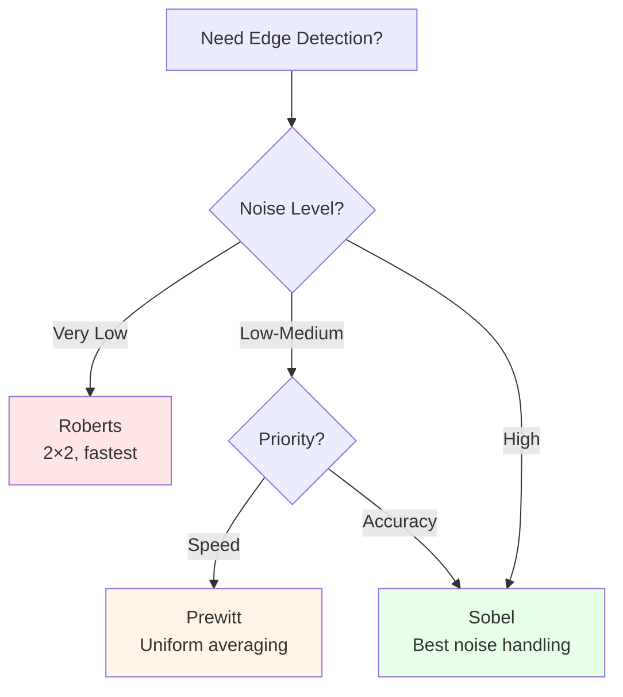

# CS4 — Edge Detection & Line Detection

> **Course:** MTech AIML - Computer Vision | **Institution:** BITS Pilani WILP
> **Session:** CS4 | **Topics:** Edge Models, Gradient Operators, Canny Edge Detector, Hough Transform

---

## Table of Contents

- [CS4 — Edge Detection \& Line Detection](#cs4--edge-detection--line-detection)
  - [Table of Contents](#table-of-contents)
  - [Quick Reference Links (CS0)](#quick-reference-links-cs0)
  - [Learning Objectives](#learning-objectives)
  - [Quick Revision Checklist](#quick-revision-checklist)
    - [MUST KNOW FOR EXAM - 15 MINUTE CHECKLIST](#must-know-for-exam---15-minute-checklist)
  - [4.1 Introduction to Edge Detection](#41-introduction-to-edge-detection)
    - [4.1.1 What are Edges?](#411-what-are-edges)
    - [4.1.2 Why Edge Detection?](#412-why-edge-detection)
    - [4.1.3 Causes of Edges](#413-causes-of-edges)
    - [4.1.4 Edge Profiles](#414-edge-profiles)
      - [**1. Step Edge (Ideal Edge)**](#1-step-edge-ideal-edge)
      - [**2. Ramp Edge (Gradual Edge)**](#2-ramp-edge-gradual-edge)
      - [**3. Roof Edge (Ridge)**](#3-roof-edge-ridge)
  - [4.2 Mathematical Foundation of Edge Detection](#42-mathematical-foundation-of-edge-detection)
    - [4.2.1 Image Gradients](#421-image-gradients)
    - [Understanding 3×3 Neighborhoods - Complete Tutorial (from PDF pages 31-37)](#understanding-33-neighborhoods---complete-tutorial-from-pdf-pages-31-37)
    - [Two Methods for Gradient Calculation (from PDF pages 54-61)](#two-methods-for-gradient-calculation-from-pdf-pages-54-61)
    - [Complete Numerical Example: All Methods on Same Pattern](#complete-numerical-example-all-methods-on-same-pattern)
    - [Enhanced Section 4.2.1 - Complete Numerical Examples](#enhanced-section-421---complete-numerical-examples)
    - [4.2.2 First-Order Derivatives](#422-first-order-derivatives)
    - [4.2.3 Second-Order Derivatives](#423-second-order-derivatives)
    - [4.2.4 Effect of Noise on Edge Detection](#424-effect-of-noise-on-edge-detection)
  - [4.3 Gradient-Based Edge Detectors](#43-gradient-based-edge-detectors)
    - [Understanding Gradient Direction and Quadrant Adjustments](#understanding-gradient-direction-and-quadrant-adjustments)
    - [Complete Worked Example with Quadrant Adjustment (from PDF pages 27-30)](#complete-worked-example-with-quadrant-adjustment-from-pdf-pages-27-30)
    - [Additional Numerical Example: Horizontal Edge Pattern](#additional-numerical-example-horizontal-edge-pattern)
    - [Additional Example: Different Noise Scenarios](#additional-example-different-noise-scenarios)
    - [Boundary Pixel Cases](#boundary-pixel-cases)
    - [Complete Comparison: All Patterns and Methods](#complete-comparison-all-patterns-and-methods)
    - [4.3.1 Roberts Cross Operator](#431-roberts-cross-operator)
    - [4.3.2 Prewitt Operator](#432-prewitt-operator)
    - [Mathematical Intuition: Why Prewitt and Sobel Work Better](#mathematical-intuition-why-prewitt-and-sobel-work-better)
    - [4.3.3 Sobel Operator](#433-sobel-operator)
    - [4.3.4 Comparison: Roberts vs Prewitt vs Sobel](#434-comparison-roberts-vs-prewitt-vs-sobel)
  - [4.4 Second-Order Edge Detection](#44-second-order-edge-detection)
    - [4.4.1 Laplacian Operator](#441-laplacian-operator)
    - [4.4.2 Laplacian of Gaussian (LoG)](#442-laplacian-of-gaussian-log)
  - [4.5 Canny Edge Detection Algorithm](#45-canny-edge-detection-algorithm)
    - [4.5.1 Overview and Motivation](#451-overview-and-motivation)
    - [4.5.2 Step 1: Gaussian Smoothing](#452-step-1-gaussian-smoothing)
    - [4.5.3 Step 2: Gradient Computation](#453-step-2-gradient-computation)
    - [4.5.4 Step 3: Non-Maximum Suppression](#454-step-3-non-maximum-suppression)
    - [4.5.5 Step 4: Double Thresholding](#455-step-4-double-thresholding)
    - [4.5.6 Step 5: Edge Tracking by Hysteresis](#456-step-5-edge-tracking-by-hysteresis)
    - [4.5.7 Complete Numerical Example](#457-complete-numerical-example)
    - [4.5.8 Parameter Selection Guidelines](#458-parameter-selection-guidelines)
  - [4.6 Hough Transform for Line Detection](#46-hough-transform-for-line-detection)
    - [4.6.1 The Line Detection Problem](#461-the-line-detection-problem)
    - [4.6.2 Parameter Space Representation](#462-parameter-space-representation)
    - [4.6.3 Hough Transform Algorithm](#463-hough-transform-algorithm)
    - [4.6.4 Complete Numerical Example](#464-complete-numerical-example)
    - [ENHANCED VISUAL EXPLANATIONS FOR HOUGH TRANSFORM](#enhanced-visual-explanations-for-hough-transform)
    - [4.6.4 Complete Numerical Example](#464-complete-numerical-example-1)
    - [4.6.5 Practical Considerations](#465-practical-considerations)
    - [4.6.6 Extensions: Circle and Generalized Hough Transform](#466-extensions-circle-and-generalized-hough-transform)
  - [Industry Applications \& Case Studies](#industry-applications--case-studies)
    - [Real-World Implementations](#real-world-implementations)
  - [Flashcards for Quick Revision](#flashcards-for-quick-revision)
  - [Common Misconceptions](#common-misconceptions)
  - [References](#references)

---

## Quick Reference Links (CS0)

| Category | Resource | Description |
|----------|----------|-------------|
| **Textbook** | Gonzalez & Woods, Chapter 10 | Edge Detection (Pages 714-750) |
| **Textbook** | Gonzalez & Woods, Pages 737-742 | Hough Transform |
| **OpenCV Docs** | [Canny Edge Detection](https://docs.opencv.org/4.x/da/d22/tutorial_py_canny.html) | Implementation guide |
| **OpenCV Docs** | [Hough Line Transform](https://docs.opencv.org/4.x/d9/db0/tutorial_hough_lines.html) | Line detection tutorial |
| **Course Materials** | Cornell Tech - Intro to Computer Vision | Noah Snavely's lectures |
| **Previous Session** | [CS3 - Low Level Vision](./CS3_README.md) | Spatial Filtering, Color Spaces |
| **Interactive Demo** | [Edge Detection Visualizer](https://setosa.io/ev/image-kernels/) | Kernel visualization |
| **Research** | Canny, J. (1986) | "A Computational Approach to Edge Detection" |

---

## Learning Objectives

After completing CS4, you should be able to:

- **Explain** the concept of edges and their importance in computer vision
- **Identify** different types of edge profiles (step, ramp, roof)
- **Derive** and apply gradient operators (Roberts, Prewitt, Sobel)
- **Understand** the mathematical foundation of first and second-order derivatives
- **Implement** the complete Canny edge detection algorithm with all 5 steps
- **Apply** non-maximum suppression and hysteresis thresholding
- **Explain** the Hough Transform for line detection
- **Convert** between Cartesian and polar line representations
- **Design** edge detection pipelines for real-world applications

---

## Quick Revision Checklist

### MUST KNOW FOR EXAM - 15 MINUTE CHECKLIST

**Edge Fundamentals (3 minutes)**
- [ ] Definition: Edges = significant local intensity changes
- [ ] Three edge profiles: Step, Ramp, Roof
- [ ] Four causes: Depth, surface orientation, material, illumination

**Gradient Operators (5 minutes)**
- [ ] Roberts: 2×2, fast, noise-sensitive
- [ ] Prewitt: 3×3, uniform averaging [1,1,1]
- [ ] Sobel: 3×3, weighted [1,2,1], best isotropy
- [ ] Formulas: $M = \sqrt{g_x^2 + g_y^2}$, $\theta = \tan^{-1}(g_y/g_x)$

**Canny Algorithm (5 minutes)**
- [ ] Step 1: Gaussian smoothing (noise reduction)
- [ ] Step 2: Gradient computation (Sobel typically)
- [ ] Step 3: Non-maximum suppression (thin edges)
- [ ] Step 4: Double thresholding ($T_H$:$T_L$ = 2:1 to 3:1)
- [ ] Step 5: Hysteresis (connect weak edges to strong)

**Hough Transform (2 minutes)**
- [ ] Line equation: $\rho = x\cos\theta + y\sin\theta$
- [ ] Parameter space: $\rho$-$\theta$ accumulator
- [ ] Process: Edge point → vote in parameter space → find peaks
- [ ] Output: Line parameters $(\rho, \theta)$

---

## 4.1 Introduction to Edge Detection

### 4.1.1 What are Edges?

**Definition:** An edge is a significant local change in image intensity, typically associated with discontinuity in image properties.

**Formal Definition:**
An edge occurs where the gradient magnitude of the image function $f(x,y)$ exceeds a threshold:

$$
\text{Edge at }(x,y) \text{ if } \|\nabla f(x,y)\| > T
$$

**Visual Representation:**

```
     SMOOTH REGION      |    EDGE    |  SMOOTH REGION
                        |            |
   Intensity: 50  ─────►│    ↗↗↗↗    │◄───── Intensity: 200
                        |  Rapid     |
                        |  Change    |
                        └────────────┘
```

**Key Characteristics:**
1. **Local phenomenon**: Edges are detected in small neighborhoods
2. **Directional**: Edges have magnitude (strength) and orientation
3. **Scale-dependent**: Edge detection depends on observation scale
4. **Affected by noise**: Random intensity fluctuations can create false edges

### 4.1.2 Why Edge Detection?

Edge detection is fundamental in computer vision because edges:

**1. Reduce Data Complexity**
- Original image: Millions of pixels
- Edge image: Thousands of edge points
- Reduction: ~99% data compression while preserving structure

**2. Preserve Important Information**
- Object boundaries
- Surface markings
- Reflectance changes
- Shadow boundaries

**3. Enable Higher-Level Processing**
- Object recognition
- Image segmentation
- Feature extraction
- Motion detection


### 4.1.3 Causes of Edges

Edges in images are caused by four primary physical factors:

| Cause | Description | Example | Edge Type |
|-------|-------------|---------|-----------|
| **Depth Discontinuity** | Object boundary where depth changes | Object silhouette against background | Strong, step |
| **Surface Orientation** | Change in surface normal direction | Cube corner, curved surface | Ramp or roof |
| **Reflectance Change** | Material property difference | Painted surface boundary, texture edge | Step or ramp |
| **Illumination** | Lighting changes (shadows, highlights) | Cast shadow, specular reflection | Soft ramp |

**Detailed Examples - Four Quadrants:**

```
┌─────────────────────────────────┬─────────────────────────────────┐
│  DEPTH DISCONTINUITY            │  SURFACE ORIENTATION            │
│                                 │                                 │
│  Side View:                     │     ╱╲       ← Roof peak        │
│                                 │    ╱  ╲                         │
│     Object                      │   ╱    ╲     Intensity Profile  │
│     ████████                    │  ╱      ╲                       │
│     ████████   ←─               │ ╱        ╲      ╱╲ (roof)      │
│                Gap              │                                 │
│     Background                  │  Common in: cube corners,       │
│     ────────                    │  curved surfaces                │
│                                 │                                 │
│  Intensity Profile:             │  Edge Type: Ramp or Roof        │
│  High ┤     ████████            │                                 │
│       │     █                   │                                 │
│       │     █                   │                                 │
│   Low ┤████ █                   │                                 │
│       └──────────► Position     │                                 │
│                                 │                                 │
│  Edge Type: Strong Step         │                                 │
├─────────────────────────────────┼─────────────────────────────────┤
│  REFLECTANCE CHANGE             │  ILLUMINATION (SHADOW)          │
│                                 │                                 │
│  White Paint | Black Paint      │      Light Source               │
│  ████████████|▓▓▓▓▓▓▓▓▓▓▓▓      │          ☀                     │
│              ↑                  │           ↓                     │
│          Sharp edge             │      ┌───┐                     │
│                                 │      │Obj│    ← Casts shadow   │
│  Intensity Profile:             │      └───┘                     │
│  High ████████|                 │      ╱╱╱╱╱   ← Shadow boundary │
│              |                  │                                 │
│              |▓▓▓▓▓▓▓▓          │  Intensity Profile:             │
│   Low        |                  │  High ────────╲                 │
│              |                  │                ╲                │
│              ↓                  │                 ╲               │
│          Position               │   Low            ╲─────         │
│                                 │                   Soft ramp     │
│  Edge Type: Step or Ramp        │  Edge Type: Soft Ramp           │
└─────────────────────────────────┴─────────────────────────────────┘
```
### 4.1.4 Edge Profiles

Three fundamental edge profiles characterize intensity transitions:

#### **1. Step Edge (Ideal Edge)**

**Characteristics:**
- Discontinuous intensity change
- Occurs over 1-2 pixels
- Rare in real images (camera blur, defocus)

**Mathematical Model:**

$$
f(x) = \begin{cases}
I_1 & x < x_0 \\
I_2 & x \geq x_0
\end{cases}
$$

```
Intensity
    │
I_2 │     ┌────────────
    │     │
    │     │  ← Instant jump
I_1 │─────┘
    │
    └─────┴────────────► Position
         x₀

Step Width: 1-2 pixels
```

**First Derivative:** Impulse (spike) at $x_0$
**Second Derivative:** Positive-negative pair at $x_0$

#### **2. Ramp Edge (Gradual Edge)**

**Characteristics:**
- Gradual intensity transition
- Occurs over several pixels (3-10 typically)
- Most common in real images

**Mathematical Model:**

$$
f(x) = \begin{cases}
I_1 & x < x_0 \\
I_1 + \frac{I_2 - I_1}{w}(x - x_0) & x_0 \leq x \leq x_0 + w \\
I_2 & x > x_0 + w
\end{cases}
$$

where $w$ is the ramp width.

```
Intensity
    │
I_2 │        ┌──────────
    │       ╱
    │      ╱   ← Gradual transition
    │     ╱    (width w = 5-10 pixels)
I_1 │────╱
    │
    └────┴───┴──────────► Position
        x₀  x₀+w

Ramp Width: 3-10 pixels (typical)
```

**First Derivative:** Rectangular pulse over width $w$
**Second Derivative:** Positive-negative pair at start/end of ramp

#### **3. Roof Edge (Ridge)**

**Characteristics:**
- Intensity increases then decreases
- Forms a "peak" or "valley"
- Common in thin lines, wires, blood vessels

**Mathematical Model:**

$$
f(x) = \begin{cases}
I_1 & x < x_0 \\
I_1 + \frac{I_2 - I_1}{w_1}(x - x_0) & x_0 \leq x < x_0 + w_1 \\
I_2 & x_0 + w_1 \leq x < x_0 + w_1 + w_2 \\
I_2 - \frac{I_2 - I_1}{w_3}(x - x_0 - w_1 - w_2) & x_0 + w_1 + w_2 \leq x < x_0 + w_1 + w_2 + w_3 \\
I_1 & x \geq x_0 + w_1 + w_2 + w_3
\end{cases}
$$

```
Intensity
    │
I_2 │      ┌──┐       ← Roof top
    │     ╱    ╲
    │    ╱      ╲     ← Symmetric or asymmetric slopes
I_1 │───╱        ╲────
    │
    └───┴──┴──┴───────► Position
       x₀ ← w →

Roof Base: 3-6 pixels (typical)
```

**First Derivative:** Two impulses (positive at rising edge, negative at falling edge)
**Second Derivative:** Zero-crossing at roof center

**Comparison Table:**

| Property | Step Edge | Ramp Edge | Roof Edge |
|----------|-----------|-----------|-----------|
| **Width** | 1-2 pixels | 3-10 pixels | 3-6 pixels (base) |
| **1st Derivative** | Single spike | Rectangle | Two spikes |
| **2nd Derivative** | +/− pair | +/− pair at ends | Zero at center |
| **Real-World** | Rare (ideal case) | Most common | Lines, vessels |
| **Detection** | Easy (high contrast) | Moderate | Challenging |

## 4.2 Mathematical Foundation of Edge Detection

### 4.2.1 Image Gradients

The **gradient** of an image is a vector that points in the direction of the greatest rate of intensity increase.


---

### Understanding 3×3 Neighborhoods - Complete Tutorial (from PDF pages 31-37)

**What is a 3×3 Neighborhood?**

A 3×3 neighborhood is a window of **9 pixels** consisting of:
- 1 center pixel (the pixel we're analyzing)
- 8 surrounding neighbors

This gives us local context to compute gradients.

**Visual Structure:**

```
┌─────────────┬─────────────┬─────────────┐
│  Top-Left   │     Top     │  Top-Right  │
│  (x-1, y-1) │   (x, y-1)  │ (x+1, y-1)  │
├─────────────┼─────────────┼─────────────┤
│    Left     │   CENTER    │    Right    │
│  (x-1, y)   │   (x, y)    │  (x+1, y)   │ ← Analyzing this pixel
├─────────────┼─────────────┼─────────────┤
│ Bottom-Left │   Bottom    │Bottom-Right │
│ (x-1, y+1)  │  (x, y+1)   │ (x+1, y+1)  │
└─────────────┴─────────────┴─────────────┘
```

**CRITICAL: Understanding the Coordinate System**

In image processing (different from standard math!):
- **Origin (0,0)**: Top-left corner of image
- **x-axis**: Increases going RIGHT →
- **y-axis**: Increases going DOWN ↓

```
(0,0) ──────────────────→ x increasing
  │
  │
  │
  ↓
y increasing
```

**Standard Z-Notation (z₁ through z₉):**

For simplicity in formulas, we label the 9 positions:

```
┌────┬────┬────┐
│ z₁ │ z₂ │ z₃ │  ← Top row
├────┼────┼────┤
│ z₄ │ z₅ │ z₆ │  ← Middle row (z₅ = center)
├────┼────┼────┤
│ z₇ │ z₈ │ z₉ │  ← Bottom row
└────┴────┴────┘
  ↑    ↑    ↑
Left Middle Right
column column column
```

**Position Mapping:**

| Label | Position | Relative to center |
|-------|----------|-------------------|
| z₁ | (x-1, y-1) | Upper-left diagonal |
| z₂ | (x, y-1) | Directly above |
| z₃ | (x+1, y-1) | Upper-right diagonal |
| z₄ | (x-1, y) | Directly left |
| z₅ | (x, y) | **CENTER** |
| z₆ | (x+1, y) | Directly right |
| z₇ | (x-1, y+1) | Lower-left diagonal |
| z₈ | (x, y+1) | Directly below |
| z₉ | (x+1, y+1) | Lower-right diagonal |

**Why Do We Need 9 Pixels?**

To compute gradients, we need to measure intensity changes in multiple directions:

1. **Horizontal changes**: Compare left vs right
2. **Vertical changes**: Compare top vs bottom
3. **Noise reduction**: Average multiple pixels to reduce noise

Using only 2 pixels (simple difference) is too noise-sensitive!

**Step-by-Step: Extracting a Neighborhood**

**Example: Given a larger image**

```
Full Image (6×6):
┌───┬───┬───┬───┬───┬───┐
│ 0 │ 2 │ 2 │ 2 │ 2 │ 2 │  ← Row 0
├───┼───┼───┼───┼───┼───┤
│ 0 │ 0 │ 2 │ 2 │ 2 │ 2 │  ← Row 1
├───┼───┼───┼───┼───┼───┤
│ 0 │ 0 │ ■ │ 2 │ 2 │ 2 │  ← Row 2 (■ at position (2,2))
├───┼───┼───┼───┼───┼───┤
│ 0 │ 0 │ 0 │ 0 │ 2 │ 2 │  ← Row 3
├───┼───┼───┼───┼───┼───┤
│ 0 │ 0 │ 0 │ 0 │ 0 │ 2 │  ← Row 4
├───┼───┼───┼───┼───┼───┤
│ 0 │ 0 │ 0 │ 0 │ 0 │ 0 │  ← Row 5
└───┴───┴───┴───┴───┴───┘
  0   1   2   3   4   5   ← Column numbers
```

**Step 1:** Identify center pixel
- Center pixel ■ is at column 2, row 2
- Position: (x=2, y=2)
- Value: 0

**Step 2:** Extract 3×3 window

Take the center pixel plus 1 pixel in each direction:
- Rows: y-1=1, y=2, y+1=3 (rows 1, 2, 3)
- Columns: x-1=1, x=2, x+1=3 (columns 1, 2, 3)

**Extracted 3×3 Neighborhood:**

```
┌───┬───┬───┐
│ 0 │ 2 │ 2 │  ← From row 1, columns 1-3
├───┼───┼───┤
│ 0 │ 0 │ 2 │  ← From row 2, columns 1-3 (center row)
├───┼───┼───┤
│ 0 │ 0 │ 0 │  ← From row 3, columns 1-3
└───┴───┴───┘
```

**Step 3:** Label using z-notation

```
Position:          Value:
┌────┬────┬────┐  ┌───┬───┬───┐
│ z₁ │ z₂ │ z₃ │  │ 0 │ 2 │ 2 │
├────┼────┼────┤  ├───┼───┼───┤
│ z₄ │ z₅ │ z₆ │= │ 0 │ 0 │ 2 │
├────┼────┼────┤  ├───┼───┼───┤
│ z₇ │ z₈ │ z₉ │  │ 0 │ 0 │ 0 │
└────┴────┴────┘  └───┴───┴───┘
```

So: z₁=0, z₂=2, z₃=2, z₄=0, z₅=0, z₆=2, z₇=0, z₈=0, z₉=0

**Step 4:** Ready for gradient calculation!

Now we can apply Prewitt, Sobel, or other operators.

---

### Two Methods for Gradient Calculation (from PDF pages 54-61)

The PDF shows **two different approaches** for computing gradients. Understanding both is important!

**Method 1: Simple Central Difference (2-pixel method)**

Used in the PDF for basic examples.

**Formulas:**
$$g_x = f(x, y+1) - f(x, y-1)$$
$$g_y = f(x+1, y) - f(x, y+1)$$

Wait, there's confusion here! Let me clarify the **actual formulas from the PDF**:

The PDF uses:
- For $g_x$: Compare pixel **above** vs pixel **below** center
- For $g_y$: Compare pixel **right** vs pixel **left** of center

**Correct formulas:**
$$g_x = f(x+1, y) - f(x-1, y)$$ (in image coordinates, this is bottom - top)
$$g_y = f(x, y+1) - f(x, y-1)$$ (in image coordinates, this is right - left)

**In z-notation:**
$$g_x = z_8 - z_2$$ (bottom center - top center)
$$g_y = z_6 - z_4$$ (right center - left center)

**Example from PDF (pages 54-61):**

Given neighborhood:
```
┌───┬───┬───┐
│ 0 │ 2 │ 2 │
│ 0 │ 0 │ 2 │
│ 0 │ 0 │ 0 │
└───┴───┴───┘
```

Calculate $g_x$:
$$g_x = z_8 - z_2 = 0 - 2 = -2$$

Calculate $g_y$:
$$g_y = z_6 - z_4 = 2 - 0 = 2$$

**Result:** $g_x = -2$, $g_y = 2$

---

**Method 2: Prewitt/Sobel (9-pixel method)**

Uses **all 9 pixels** for better noise reduction.

**Prewitt formulas:**
$$g_x = (z_7 + z_8 + z_9) - (z_1 + z_2 + z_3)$$
$$g_y = (z_3 + z_6 + z_9) - (z_1 + z_4 + z_7)$$

**Meaning:**
- $g_x$: Sum of bottom row minus sum of top row
- $g_y$: Sum of right column minus sum of left column

**Same example with Prewitt:**

Given:
```
z₁=0, z₂=2, z₃=2
z₄=0, z₅=0, z₆=2
z₇=0, z₈=0, z₉=0
```

Calculate $g_x$:
$$g_x = (0 + 0 + 0) - (0 + 2 + 2) = 0 - 4 = -4$$

Calculate $g_y$:
$$g_y = (2 + 2 + 0) - (0 + 0 + 0) = 4 - 0 = 4$$

**Result:** $g_x = -4$, $g_y = 4$

---

**Comparison of Methods:**

| Aspect | Central Difference | Prewitt |
|--------|-------------------|---------|
| **Pixels used** | 2 (z₂, z₈ for gx) | 9 (all) |
| **Noise sensitivity** | Very high | Medium |
| **Computation** | Very fast | Moderate |
| **Result for example** | gx=-2, gy=2 | gx=-4, gy=4 |
| **Magnitude** | 2√2 ≈ 2.83 | 4√2 ≈ 5.66 |
| **Direction** | 135° | 135° (same!) |

**Key Insight:**
- Different methods give different magnitudes
- But same direction (both detect the same edge orientation!)
- Prewitt/Sobel preferred for real applications (better noise handling)

---

### Complete Numerical Example: All Methods on Same Pattern

**Given Pattern:**
```
┌───┬───┬───┐
│ 0 │ 2 │ 2 │
│ 0 │ 0 │ 2 │
│ 0 │ 0 │ 0 │
└───┴───┴───┘
```

**Method A: Central Difference**

$g_x = z_8 - z_2 = 0 - 2 = -2$
$g_y = z_6 - z_4 = 2 - 0 = 2$
$M = \sqrt{4+4} = 2\sqrt{2} \approx 2.83$
$\alpha = \tan^{-1}(2/-2) = 135°$

**Method B: Prewitt**

$g_x = (0+0+0) - (0+2+2) = -4$
$g_y = (2+2+0) - (0+0+0) = 4$
$M = \sqrt{16+16} = 4\sqrt{2} \approx 5.66$
$\alpha = \tan^{-1}(4/-4) = 135°$

**Method C: Sobel**

$g_x = (0+2(0)+0) - (0+2(2)+2) = -6$
$g_y = (2+2(2)+0) - (0+2(0)+0) = 6$
$M = \sqrt{36+36} = 6\sqrt{2} \approx 8.49$
$\alpha = \tan^{-1}(6/-6) = 135°$

**Summary Table:**

| Method | gx | gy | Magnitude | Direction | Relative Strength |
|--------|----|----|-----------|-----------|------------------|
| Central Diff | -2 | 2 | 2.83 | 135° | 1.0× (baseline) |
| Prewitt | -4 | 4 | 5.66 | 135° | 2.0× |
| Sobel | -6 | 6 | 8.49 | 135° | 3.0× |

**Conclusion:**
- All methods agree on edge direction (135°)
- Sobel produces strongest response (3× baseline)
- Use Sobel for best noise handling + strong response


**Definition:**

For a 2D image function $f(x,y)$, the gradient is:

$$
\nabla f = \begin{bmatrix} g_x \\ g_y \end{bmatrix} = \begin{bmatrix} \frac{\partial f}{\partial x} \\ \frac{\partial f}{\partial y} \end{bmatrix}
$$

**Gradient Components:**

1. **Horizontal Gradient** ($g_x$): Rate of intensity change in x-direction
2. **Vertical Gradient** ($g_y$): Rate of intensity change in y-direction

**Gradient Magnitude:**

The edge strength (how strong the edge is):

$$
M(x,y) = \|\nabla f\| = \sqrt{g_x^2 + g_y^2}
$$

**Approximation (faster computation):**

$$
M(x,y) \approx |g_x| + |g_y|
$$

**Gradient Direction:**

The edge orientation (which way the edge points):

$$
\theta(x,y) = \tan^{-1}\left(\frac{g_y}{g_x}\right)
$$

**Important:** The gradient direction $\theta$ points **perpendicular to the edge**, in the direction of maximum intensity increase.

```
       Edge Direction
            │
            │  ← Edge
            │
    ────────┼────────
            │
            │
            ↓
      Gradient Direction
   (perpendicular to edge)
```

**Geometric Interpretation:**

```
           ↑ y
           │
           │    ∇f (gradient vector)
           │   ↗ ║∇f║ = magnitude
           │  ↗
           │ ↗ θ (angle)
           │↗____________→ x
           O      g_x

Where:
- g_x: horizontal component
- g_y: vertical component
- ║∇f║: edge strength
- θ: gradient direction
```


### Enhanced Section 4.2.1 - Complete Numerical Examples

**Numerical Example 1: Vertical Edge (from PDF pages 7-19)**

**Given:** 3×3 neighborhood with shaded pixels = 0, white pixels = 2

```
Pattern:
┌───┬───┬───┐
│ 0 │ 0 │ 2 │
│ 0 │ 0 │ 2 │
│ 0 │ 0 │ 2 │
└───┴───┴───┘
```

**Step 1: Label the pixels**

Using standard z-notation:
- $z_1 = 0$, $z_2 = 0$, $z_3 = 2$ (top row)
- $z_4 = 0$, $z_5 = 0$, $z_6 = 2$ (middle row)
- $z_7 = 0$, $z_8 = 0$, $z_9 = 2$ (bottom row)

The center pixel (z₅ = 0) is what we're analyzing.

**Step 2: Calculate horizontal gradient using Prewitt**

Formula: $g_x = (z_7 + z_8 + z_9) - (z_1 + z_2 + z_3)$

Substitute values:
$$g_x = (0 + 0 + 2) - (0 + 0 + 2)$$
$$g_x = 2 - 2 = 0$$

**Physical meaning:** No horizontal change (top and bottom rows are identical).

**Step 3: Calculate vertical gradient using Prewitt**

Formula: $g_y = (z_3 + z_6 + z_9) - (z_1 + z_4 + z_7)$

Substitute values:
$$g_y = (2 + 2 + 2) - (0 + 0 + 0)$$
$$g_y = 6 - 0 = 6$$

**Physical meaning:** Strong vertical change - intensity increases from left to right.

**Step 4: Calculate gradient magnitude**

Exact method:
$$M = \sqrt{g_x^2 + g_y^2} = \sqrt{0^2 + 6^2} = \sqrt{36} = 6$$

Approximation method:
$$M \approx |g_x| + |g_y| = |0| + |6| = 6$$

**Step 5: Calculate gradient direction**

$$\alpha = \tan^{-1}\left(\frac{g_y}{g_x}\right) = \tan^{-1}\left(\frac{6}{0}\right) = 90°$$

**Interpretation:** Gradient points horizontally to the right (eastward).

**Step 6: Determine edge direction**

Edge direction = gradient direction + 90° = 90° + 90° = 180° (or 0°)

**Conclusion:** Vertical edge detected, running north-south.

---

**Numerical Example 2: Diagonal Edge Pattern (from PDF pages 38-53)**

**Given:** More complex pattern from the PDF

```
Full image (partial):
┌───┬───┬───┬───┬───┬───┐
│ 0 │ 2 │ 2 │ 2 │ 2 │ 2 │
├───┼───┼───┼───┼───┼───┤
│ 0 │ 0 │ 2 │ 2 │ 2 │ 2 │
├───┼───┼───┼───┼───┼───┤
│ 0 │ 0 │ ■ │ 2 │ 2 │ 2 │ ← ■ is center pixel
├───┼───┼───┼───┼───┼───┤
│ 0 │ 0 │ 0 │ 0 │ 2 │ 2 │
├───┼───┼───┼───┼───┼───┤
│ 0 │ 0 │ 0 │ 0 │ 0 │ 2 │
└───┴───┴───┴───┴───┴───┘
```

**Step 1: Extract 3×3 neighborhood around center pixel**

```
┌───┬───┬───┐
│ 0 │ 2 │ 2 │  ← position (y-1)
├───┼───┼───┤
│ 0 │ 0 │ 2 │  ← position (y) - center row
├───┼───┼───┤
│ 0 │ 0 │ 0 │  ← position (y+1)
└───┴───┴───┘
  ↑   ↑   ↑
(x-1)(x)(x+1)
```

Label pixels:
- $z_1 = 0$, $z_2 = 2$, $z_3 = 2$ (top row)
- $z_4 = 0$, $z_5 = 0$, $z_6 = 2$ (middle row)
- $z_7 = 0$, $z_8 = 0$, $z_9 = 0$ (bottom row)

**Step 2: Calculate using central difference method (as shown in PDF)**

The PDF uses central differences for simpler kernels:

For $g_x$: Compare pixel above center vs pixel below center
$$g_x = f(x+1, y) - f(x-1, y)$$

Where:
- $f(x-1, y) = z_2 = 2$ (pixel above center)
- $f(x+1, y) = z_8 = 0$ (pixel below center)

$$g_x = 0 - 2 = -2$$

For $g_y$: Compare pixel right of center vs pixel left of center
$$g_y = f(x, y+1) - f(x, y-1)$$

Where:
- $f(x, y-1) = z_4 = 0$ (pixel left of center)
- $f(x, y+1) = z_6 = 2$ (pixel right of center)

$$g_y = 2 - 0 = 2$$

**Step 3: Form gradient vector**

$$\nabla f = \begin{bmatrix} g_x \\ g_y \end{bmatrix} = \begin{bmatrix} -2 \\ 2 \end{bmatrix}$$

**Step 4: Calculate magnitude**

$$M = \sqrt{(-2)^2 + 2^2} = \sqrt{4 + 4} = \sqrt{8} = 2\sqrt{2} \approx 2.83$$

**Step 5: Calculate direction**

$$\alpha = \tan^{-1}\left(\frac{g_y}{g_x}\right) = \tan^{-1}\left(\frac{2}{-2}\right) = \tan^{-1}(-1) = -45°$$

Since $g_x < 0$ and $g_y > 0$ (second quadrant):
$$\alpha = 180° - 45° = 135°$$

**Interpretation:** Gradient points upper-left (toward darker region).

**Step 6: Edge direction**

Edge direction = $\alpha - 90° = 135° - 90° = 45°$

**Conclusion:** Diagonal edge running northeast-southwest at 45°.

**Visual summary:**

```
Neighborhood:     Gradient:           Edge:
  0 2 2             ↖ 135°            ⟋ 45°
  0 ■ 2          (upper-left)      (diagonal)
  0 0 0
```

---

**Numerical Example 3: Using Sobel Operator (from PDF page 11)**

**Given:**
```
┌─────┬─────┬─────┐
│ 100 │ 100 │ 100 │
├─────┼─────┼─────┤
│ 100 │ 100 │ 200 │
├─────┼─────┼─────┤
│ 100 │ 200 │ 200 │
└─────┴─────┴─────┘
```

Labeled:
- $z_1=100$, $z_2=100$, $z_3=100$
- $z_4=100$, $z_5=100$, $z_6=200$
- $z_7=100$, $z_8=200$, $z_9=200$

**Step 1: Calculate $g_x$ using Sobel**

Formula: $g_x = (z_7 + 2z_8 + z_9) - (z_1 + 2z_2 + z_3)$

Substitute:
$$g_x = (100 + 2(200) + 200) - (100 + 2(100) + 100)$$
$$g_x = (100 + 400 + 200) - (100 + 200 + 100)$$
$$g_x = 700 - 400 = 300$$

**Step 2: Calculate $g_y$ using Sobel**

Formula: $g_y = (z_3 + 2z_6 + z_9) - (z_1 + 2z_4 + z_7)$

Substitute:
$$g_y = (100 + 2(200) + 200) - (100 + 2(100) + 100)$$
$$g_y = (100 + 400 + 200) - (100 + 200 + 100)$$
$$g_y = 700 - 400 = 300$$

**Step 3: Calculate magnitude**

Exact:
$$M = \sqrt{300^2 + 300^2} = \sqrt{90000 + 90000} = \sqrt{180000} = 300\sqrt{2} \approx 424.26$$

Approximation:
$$M \approx |300| + |300| = 600$$

**Step 4: Calculate direction**

$$\alpha = \tan^{-1}\left(\frac{300}{300}\right) = \tan^{-1}(1) = 45°$$

**Step 5: Edge direction**

Edge direction = $45° + 90° = 135°$ (or $45° - 90° = -45°$)

**Conclusion:** Edge runs at 135° (northwest to southeast direction).

---

**Comparison: Prewitt vs Sobel on Same Pattern**

Using the pattern with diagonal edge (Example 2):

```
┌───┬───┬───┐
│ 0 │ 2 │ 2 │
│ 0 │ 0 │ 2 │
│ 0 │ 0 │ 0 │
└───┴───┴───┘
```

**Using Prewitt:**

$g_x = (0 + 0 + 0) - (0 + 2 + 2) = 0 - 4 = -4$
$g_y = (2 + 2 + 0) - (0 + 0 + 0) = 4 - 0 = 4$
$M = \sqrt{16 + 16} = \sqrt{32} = 4\sqrt{2} \approx 5.66$
Direction = 135°

**Using Sobel:**

$g_x = (0 + 2(0) + 0) - (0 + 2(2) + 2) = 0 - 6 = -6$
$g_y = (2 + 2(2) + 0) - (0 + 2(0) + 0) = 6 - 0 = 6$
$M = \sqrt{36 + 36} = \sqrt{72} = 6\sqrt{2} \approx 8.49$
Direction = 135°

**Observation:**
- Both detect same edge direction (135°)
- Sobel produces 50% stronger magnitude (8.49 vs 5.66)
- Sobel's center weighting gives more emphasis to reliable pixels


### 4.2.2 First-Order Derivatives

First-order derivatives detect edges by finding local maxima in the gradient magnitude.

**Discrete Approximation:**

For digital images, we approximate partial derivatives using finite differences:

**Forward Difference:**

$$
\frac{\partial f}{\partial x} \approx f(x+1, y) - f(x, y)
$$

$$
\frac{\partial f}{\partial y} \approx f(x, y+1) - f(x, y)
$$

**Central Difference (more accurate):**

$$
\frac{\partial f}{\partial x} \approx \frac{f(x+1, y) - f(x-1, y)}{2}
$$

$$
\frac{\partial f}{\partial y} \approx \frac{f(x, y+1) - f(x, y-1)}{2}
$$

**Kernel Representation:**

Simple horizontal edge detector (vertical gradient):

$$
G_y = \begin{bmatrix} -1 \\ 1 \end{bmatrix} \quad \text{or} \quad G_y = \begin{bmatrix} -1 & 0 & 1 \end{bmatrix}
$$

**Properties of First-Order Derivatives:**

| Property | Description | Implication |
|----------|-------------|-------------|
| **Maximum at edge** | Peaks where intensity changes most | Locate edges by finding local maxima |
| **Direction sensitive** | Detects edges perpendicular to gradient | Need both x and y gradients |
| **Noise sensitive** | Amplifies high-frequency noise | Requires smoothing before detection |
| **Produces thick edges** | Multiple pixels flagged as edges | Need thinning (non-max suppression) |

### 4.2.3 Second-Order Derivatives

Second-order derivatives detect edges by finding **zero-crossings** (where derivative changes sign).

**Laplacian Operator:**

The Laplacian is the sum of second partial derivatives:

$$
\nabla^2 f = \frac{\partial^2 f}{\partial x^2} + \frac{\partial^2 f}{\partial y^2}
$$

**Discrete Approximation:**

$$
\frac{\partial^2 f}{\partial x^2} \approx f(x+1, y) - 2f(x, y) + f(x-1, y)
$$

$$
\frac{\partial^2 f}{\partial y^2} \approx f(x, y+1) - 2f(x, y) + f(x, y-1)
$$

**Laplacian:**

$$
\nabla^2 f \approx [f(x+1,y) + f(x-1,y) + f(x,y+1) + f(x,y-1)] - 4f(x,y)
$$

**Kernel Representation:**

$$
\text{Laplacian} = \begin{bmatrix}
0 & 1 & 0 \\
1 & -4 & 1 \\
0 & 1 & 0
\end{bmatrix} \quad \text{or} \quad \begin{bmatrix}
1 & 1 & 1 \\
1 & -8 & 1 \\
1 & 1 & 1
\end{bmatrix}
$$

**Edge Detection with Laplacian:**

Edges are located at **zero-crossings** where the Laplacian changes sign:

```
Laplacian Response
    +ve │    ╱╲
        │   ╱  ╲
      0 ├──╱────╲──  ← Zero-crossing = EDGE
        │ ╱      ╲
    -ve │╱        ╲
        └───────────► Position
```

**Comparison: First-Order vs Second-Order**

| Aspect | First-Order | Second-Order |
|--------|-------------|--------------|
| **Edge Location** | Local maximum | Zero-crossing |
| **Edge Width** | Thick (multiple pixels) | Thin (single pixel) |
| **Noise Sensitivity** | High | Very high |
| **Computational Cost** | Moderate | Lower |
| **Orientation Info** | Yes (gradient direction) | No |
| **Common Operators** | Roberts, Prewitt, Sobel | Laplacian, LoG |

### 4.2.4 Effect of Noise on Edge Detection

Noise significantly impacts edge detection performance. Understanding this relationship is crucial for designing robust algorithms.

**Noise Characteristics:**

**Gaussian Noise:** Random variations with normal distribution
- Mean: μ = 0 (zero-mean noise)
- Standard deviation: σ (controls noise strength)

**Impact on Edge Profiles:**

Consider a ramp edge with increasing noise levels:

```
┌────────────────────────────────────────────────────────┐
│ NOISE LEVEL COMPARISON                                 │
├────────────────────────────────────────────────────────┤
│                                                        │
│ Clean Signal (σ = 0):                                 │
│ Intensity: ────────┌─────────                         │
│                    │ ← Clear edge                     │
│                                                        │
│ Low Noise (σ = 0.1):                                  │
│ Intensity: ─~─~─~─┌─~─~─~─                           │
│                    │ ← Edge still clear                │
│                                                        │
│ Medium Noise (σ = 1.0):                               │
│ Intensity: ─~╱~╲~╱┌╲~╱~╲─                            │
│                    │ ← Edge harder to detect           │
│                                                        │
│ High Noise (σ = 10.0):                                │
│ Intensity: ╱~╲╱~╲╱~╲╱~╲╱~                            │
│            Multiple false edges!                       │
│                                                        │
└────────────────────────────────────────────────────────┘
```

**Derivative Response to Noise:**

| Noise Level (σ) | First Derivative | Second Derivative |
|-----------------|------------------|-------------------|
| **0.0** | Single clean peak | Clean zero-crossing |
| **0.1** | Slightly noisy peak | Multiple small zeros |
| **1.0** | Multiple peaks | Many zero-crossings |
| **10.0** | Noise dominates | Unusable |

**The Solution: Smoothing Before Differentiation**

**Problem:** Differentiation amplifies high-frequency noise
**Solution:** Apply Gaussian smoothing before edge detection

$$
\text{Edge Detection} = \text{Differentiate}(\text{Smooth}(f))
$$

**Mathematical Justification:**

By the derivative theorem of convolution:

$$
\frac{\partial}{\partial x}(f * g) = f * \frac{\partial g}{\partial x}
$$

where $*$ denotes convolution, $f$ is the image, and $g$ is the Gaussian kernel.

**This means:** We can either:
1. Smooth the image, then differentiate, OR
2. Differentiate the smoothing kernel, then convolve

**Option 2 is more efficient!**

**Gaussian Kernel and Its Derivative:**

$$
G(x, y; \sigma) = \frac{1}{2\pi\sigma^2} e^{-\frac{x^2 + y^2}{2\sigma^2}}
$$

$$
\frac{\partial G}{\partial x} = -\frac{x}{\sigma^2} G(x, y; \sigma)
$$

**Trade-off: Smoothing Parameter σ**

| σ (sigma) | Noise Reduction | Edge Localization | Use Case |
|-----------|-----------------|-------------------|----------|
| **Small (σ=0.5)** | Poor | Excellent | Low-noise images |
| **Medium (σ=1.0-2.0)** | Good | Good | General purpose |
| **Large (σ=3.0+)** | Excellent | Poor | Very noisy images |

**Key Insight:**
- **Small σ**: Keeps edges sharp but sensitive to noise
- **Large σ**: Removes noise but blurs edges
- **Optimal σ**: Depends on noise level and desired edge precision

**Practical Rule:**
$$
\sigma \approx \sqrt{2 \cdot \text{noise variance}}
$$

---

## 4.3 Gradient-Based Edge Detectors


**Overview:**
Gradient-based edge detectors are first-order derivative methods that identify edges by computing the rate of intensity change in an image. These operators use convolution kernels to approximate the image gradient in both horizontal (x) and vertical (y) directions. The fundamental principle is that edges correspond to locations where the gradient magnitude is locally maximum. These methods are computationally efficient and form the backbone of many edge detection pipelines.

**Key Concepts:**
- **Gradient Magnitude**: Measures edge strength - higher magnitude indicates stronger edges
- **Gradient Direction**: Points perpendicular to the edge
- **Smoothing Integration**: Larger kernels incorporate implicit smoothing
- **Isotropy**: Ability to detect edges uniformly across all orientations

**Evolution:** Roberts (2×2) → Prewitt (3×3) → Sobel (3×3) represents increasing sophistication in balancing speed, noise robustness, and localization accuracy.

Gradient-based methods detect edges by computing first-order derivatives using convolution kernels.

**General Approach:**


1. Apply gradient kernels $G_x$ and $G_y$ to image
2. Compute gradient magnitude: $M = \sqrt{g_x^2 + g_y^2}$
3. Threshold magnitude to get binary edge map
4. (Optional) Compute gradient direction: $\theta = \tan^{-1}(g_y/g_x)$


---

### Understanding Gradient Direction and Quadrant Adjustments

**The Arctangent Problem**

When we calculate:
$$\alpha = \tan^{-1}\left(\frac{g_y}{g_x}\right)$$

The arctangent function only returns values in the range **[-90°, +90°]** (or [-π/2, +π/2] radians).

But gradients can point in **any of 4 directions** (360° range)!

**The Four Quadrants:**

```
           y ↑
             │
    II       │      I
 (gx<0,gy>0) │  (gx>0,gy>0)
             │
─────────────┼─────────────→ x
             │
    III      │      IV
 (gx<0,gy<0) │  (gx>0,gy>0)
             │
```

**Standard Quadrant Rules:**

| Quadrant | Signs | tan⁻¹ gives | Actual angle | Adjustment |
|----------|-------|-------------|--------------|------------|
| **I** | gx>0, gy>0 | α | α | None needed |
| **II** | gx<0, gy>0 | -α | 180° - α | Add 180°, subtract α |
| **III** | gx<0, gy<0 | α | 180° + α | Add 180° |
| **IV** | gx>0, gy<0 | -α | 360° - α (or -α) | Can keep negative |

**Better: Use atan2 function**

Most programming languages provide `atan2(gy, gx)` which automatically handles quadrants:
- Returns angle in range [-180°, +180°] (or [-π, +π])
- Correctly accounts for sign of both gx and gy

$$\alpha = \text{atan2}(g_y, g_x)$$

---

### Complete Worked Example with Quadrant Adjustment (from PDF pages 27-30)

**Given:**
```
┌───┬───┬───┐
│ 0 │ 2 │ 2 │
│ 0 │ 0 │ 2 │
│ 0 │ 0 │ 0 │
└───┴───┴───┘
```

**Step 1: Calculate gradients (central difference method)**

$g_x = 0 - 2 = -2$
$g_y = 2 - 0 = 2$

**Step 2: Calculate basic arctangent**

$$\alpha = \tan^{-1}\left(\frac{g_y}{g_x}\right) = \tan^{-1}\left(\frac{2}{-2}\right) = \tan^{-1}(-1) = -45°$$

**Step 3: Identify quadrant**

Check signs:
- $g_x = -2$ (negative)
- $g_y = 2$ (positive)

This is **Quadrant II** (upper-left)!

**Step 4: Apply quadrant adjustment**

For Quadrant II: True angle = 180° - |basic angle|
$$\alpha = 180° - 45° = 135°$$

**Visual representation:**

```
        y ↑
          │
          │  ↖ Gradient (135°)
          │ ╱
          │╱
──────────┼──────────→ x
          │
          │
```

**Step 5: Calculate edge direction**

Edge is perpendicular to gradient:
$$\text{Edge direction} = \alpha - 90° = 135° - 90° = 45°$$

Or equivalently: $\alpha + 90° = 225°$ (opposite direction of same line)

**Visual summary:**

```
Pattern:          Gradient:         Edge:
  0 2 2             ↖ 135°           ⟋ 45°
  0 ■ 2          (to upper-left)  (diagonal)
  0 0 0
```

The gradient points from **bright** (upper-right) toward **dark** (lower-left).
The edge runs **perpendicular** to this: diagonal from lower-left to upper-right.

---

### Additional Numerical Example: Horizontal Edge Pattern

**Pattern: Horizontal Edge**

```
Full image (showing context):
┌───┬───┬───┬───┬───┬───┐
│ 2 │ 2 │ 2 │ 2 │ 2 │ 2 │
├───┼───┼───┼───┼───┼───┤
│ 2 │ 2 │ 2 │ 2 │ 2 │ 2 │
├───┼───┼───┼───┼───┼───┤
│ 2 │ 2 │ ■ │ 2 │ 2 │ 2 │ ← ■ at boundary
├───┼───┼───┼───┼───┼───┤
│ 0 │ 0 │ 0 │ 0 │ 0 │ 0 │ ← Sharp transition
├───┼───┼───┼───┼───┼───┤
│ 0 │ 0 │ 0 │ 0 │ 0 │ 0 │
└───┴───┴───┴───┴───┴───┘

Extracted 3×3 neighborhood:
┌───┬───┬───┐
│ 2 │ 2 │ 2 │
├───┼───┼───┤
│ 2 │ 2 │ 2 │
├───┼───┼───┤
│ 0 │ 0 │ 0 │
└───┴───┴───┘
```

**Using Prewitt:**

Label values:
- z₁=2, z₂=2, z₃=2 (top row)
- z₄=2, z₅=2, z₆=2 (middle row)
- z₇=0, z₈=0, z₉=0 (bottom row)

Calculate $g_x$:
$$g_x = (z_7 + z_8 + z_9) - (z_1 + z_2 + z_3)$$
$$g_x = (0 + 0 + 0) - (2 + 2 + 2) = 0 - 6 = -6$$

Calculate $g_y$:
$$g_y = (z_3 + z_6 + z_9) - (z_1 + z_4 + z_7)$$
$$g_y = (2 + 2 + 0) - (2 + 2 + 0) = 4 - 4 = 0$$

Calculate magnitude:
$$M = \sqrt{(-6)^2 + 0^2} = \sqrt{36} = 6$$

Calculate direction:
$$\alpha = \tan^{-1}\left(\frac{0}{-6}\right) = \tan^{-1}(0) = 0°$$

But wait! With $g_x < 0$ and $g_y = 0$, we're on the negative x-axis.

Using atan2 logic: When $g_y = 0$ and $g_x < 0$, angle = 180° (or -180°)

**Actually, let's reconsider:**
- $g_x = -6$ means intensity **decreases** going down (bright to dark)
- Gradient points **upward** (toward increasing intensity)
- In image coordinates where y increases downward, gradient points up = 270° (or -90°)

**Corrected interpretation:**

The gradient points **vertically upward** (from dark region to bright region).
Angle = 270° in standard image coordinates (or -90°, or 90° if we say "up")

Edge direction = perpendicular to gradient = 0° or 180° (horizontal line)

**Verification:**
- Edge IS horizontal (runs left-right)
- Gradient points perpendicular (up-down)
- ✓ Correct!

---

### Additional Example: Different Noise Scenarios

**Example A: Clean Diagonal Edge**

```
┌───┬───┬───┐
│ 0 │ 0 │ 5 │
│ 0 │ 0 │ 5 │
│ 0 │ 0 │ 5 │
└───┴───┴───┘
```

Prewitt:
- $g_x = (0+0+5) - (0+0+5) = 0$
- $g_y = (5+5+5) - (0+0+0) = 15$
- $M = 15$
- Direction = 90° (gradient points right)
- Edge direction = 0° or 180° (vertical edge)

**Example B: Same Edge with Noise**

```
┌───┬───┬───┐
│ 1 │-1 │ 6 │  ← Added noise (±1)
│-1 │ 1 │ 4 │
│ 1 │ 0 │ 6 │
└───┴───┴───┘
```

Prewitt:
- $g_x = (1+0+6) - (1+(-1)+6) = 7 - 6 = 1$ (should be 0!)
- $g_y = (6+4+6) - (1+(-1)+1) = 16 - 1 = 15$ (should be 15)
- $M = \sqrt{1+225} = 15.03$ (very close to clean case!)
- Direction ≈ 90°

**Observation:** Prewitt's averaging reduces noise impact significantly!

**Example C: Same Edge with Central Difference (no averaging)**

Using only center column:
- $g_x = z_8 - z_2 = 0 - (-1) = 1$
- $g_y = z_6 - z_4 = 4 - 1 = 3$ (should be 5!)
- $M = \sqrt{1+9} = 3.16$ (much lower than 15!)
- Large error due to noise!

**Conclusion:** Averaging in Prewitt/Sobel essential for noisy images.

---

### Boundary Pixel Cases

**Problem:** What happens at image edges where we can't form a complete 3×3 neighborhood?

**Example: Top-Left Corner**

```
Image:        Neighborhood needed:
┌───┬───┬      ┌───┬───┬───┐
│ ■ │ 5 │      │ ? │ ? │ ? │ ← These don't exist!
├───┼───┼      ├───┼───┼───┤
│ 3 │ 2 │      │ ? │ ■ │ 5 │
                ├───┼───┼───┤
                │ 3 │ 2 │ ? │
                └───┴───┴───┘
```

**Solutions:**

**Option 1: Zero Padding**
- Fill missing pixels with 0
- Simple but can create artificial edges at boundaries

```
┌───┬───┬───┐
│ 0 │ 0 │ 0 │
├───┼───┼───┤
│ 0 │ ■ │ 5 │
├───┼───┼───┤
│ 3 │ 2 │ ? │
└───┴───┴───┘
```

**Option 2: Replication Padding**
- Replicate edge pixels
- More natural, avoids artificial edges

```
┌───┬───┬───┐
│ ■ │ ■ │ 5 │
├───┼───┼───┤
│ ■ │ ■ │ 5 │
├───┼───┼───┤
│ 3 │ 2 │ ? │
└───┴───┴───┘
```

**Option 3: Mirror Padding**
- Reflect pixels across boundary
- Best for gradient operators

```
┌───┬───┬───┐
│ 2 │ 3 │ 5 │
├───┼───┼───┤
│ 5 │ ■ │ 5 │
├───┼───┼───┤
│ 3 │ 2 │ ? │
└───┴───┴───┘
```

**Option 4: Don't Process Boundaries**
- Skip 1-pixel border
- Output image is 2 pixels smaller in each dimension
- Most common in practice

**Recommendation:** Use mirror padding or skip boundaries.

---

### Complete Comparison: All Patterns and Methods

**Pattern 1: Vertical Edge**
```
0 0 2    gx=0, gy=6    M=6     α=90°   Edge: 0°/180° (vertical)
0 0 2
0 0 2
```

**Pattern 2: Horizontal Edge**
```
2 2 2    gx=-6, gy=0   M=6     α=270°  Edge: 0°/180° (horizontal)
0 0 0
0 0 0
```

**Pattern 3: Diagonal Edge (NE-SW)**
```
0 2 2    gx=-4, gy=4   M=5.66  α=135°  Edge: 45° (diagonal ⟋)
0 0 2
0 0 0
```

**Pattern 4: Diagonal Edge (NW-SE)**
```
2 2 0    gx=-4, gy=-4  M=5.66  α=225°  Edge: 135° (diagonal ⟍)
2 0 0
0 0 0
```

**Pattern 5: Corner**
```
0 0 2    gx=-2, gy=4   M=4.47  α=117°  Edge: 27° (angled)
0 0 2
0 0 2
```

Each pattern tests different edge orientations and demonstrates that gradient operators correctly detect edge direction in all cases!


### 4.3.1 Roberts Cross Operator

The **Roberts Cross** operator uses the smallest possible (2×2) kernels to approximate gradients along diagonal directions.

**Kernels:**

$$
G_x = \begin{bmatrix}
+1 & 0 \\
0 & -1
\end{bmatrix} \quad
G_y = \begin{bmatrix}
0 & +1 \\
-1 & 0
\end{bmatrix}
$$

**Gradient Computation:**

Given a 2×2 region:

$$
\begin{bmatrix}
z_1 & z_2 \\
z_3 & z_4
\end{bmatrix}
$$

$$
g_x = z_4 - z_1 \quad \text{(diagonal difference)}
$$

$$
g_y = z_2 - z_3 \quad \text{(diagonal difference)}
$$

**Numerical Example:**

Consider a 2×2 image region:

$$
\begin{bmatrix}
100 & 150 \\
100 & 150
\end{bmatrix}
$$

**Step 1: Compute gradients**

$$
g_x = 150 - 100 = 50
$$

$$
g_y = 150 - 100 = 50
$$

**Step 2: Compute magnitude**

$$
M = \sqrt{50^2 + 50^2} = \sqrt{2500 + 2500} = \sqrt{5000} \approx 70.7
$$

**Step 3: Compute direction**

$$
\theta = \tan^{-1}\left(\frac{50}{50}\right) = \tan^{-1}(1) = 45°
$$


**Design Philosophy:**
Introduced by Judith M.S. Prewitt in 1970, this operator represents the first systematic combination of smoothing and differentiation in a single convolution kernel. The key insight: average three pixels perpendicular to the gradient direction before differencing, providing basic noise suppression while maintaining reasonable edge localization.

**Mathematical Foundation - Kernel Decomposition:**
Prewitt kernels are **separable** - they can be decomposed into 1D operations:

$$G_x = \begin{bmatrix} 1 \\ 1 \\ 1 \end{bmatrix} \otimes \begin{bmatrix} -1 & 0 & 1 \end{bmatrix} = \text{smooth}_y \times \text{diff}_x$$

This separability enables computational optimization:
- **Direct convolution**: 9 multiplications + 8 additions per pixel
- **Separable implementation**: 6 multiplications + 4 additions per pixel
- **Speedup**: ~33% faster

**Detailed Step-by-Step Process:**

**Step 1: Image Preparation**
- Pad image borders (1-pixel border for 3×3 kernel)
- Convert to grayscale if needed
- Optional: Pre-smooth with small Gaussian (σ=0.5) for very noisy images

**Step 2: Horizontal Gradient Computation**
For each pixel (x,y):
1. Extract 3×3 neighborhood centered at (x,y)
2. Apply Gx kernel:
   - Column 1 (left): Sum all 3 pixels, multiply by -1
   - Column 2 (center): Ignore (multiply by 0)
   - Column 3 (right): Sum all 3 pixels, multiply by +1
3. Result: gx(x,y) = (right_sum) - (left_sum)

**Step 3: Vertical Gradient Computation**
For each pixel (x,y):
1. Use same 3×3 neighborhood
2. Apply Gy kernel:
   - Row 1 (top): Sum all 3 pixels, multiply by -1
   - Row 2 (middle): Ignore (multiply by 0)
   - Row 3 (bottom): Sum all 3 pixels, multiply by +1
3. Result: gy(x,y) = (bottom_sum) - (top_sum)

**Step 4: Magnitude Calculation**
- Exact: M(x,y) = √(gx² + gy²)
- Fast approximation: M(x,y) = |gx| + |gy|
- Approximation error: ~15% maximum, but 10× faster

**Step 5: Direction Calculation**
- θ(x,y) = atan2(gy, gx) in radians [-π, +π]
- Convert to degrees: θ_deg = θ × 180/π
- Map to [0°, 360°): if θ_deg < 0, add 360°

**Step 6: Thresholding**
- Adaptive: Threshold = 0.3 × mean(M) + 0.7 × median(M)
- Fixed: Threshold = user-specified value (e.g., 50 for 8-bit images)
- Binary edge map: Edge(x,y) = 1 if M(x,y) ≥ threshold, else 0

**Uniform Averaging Analysis:**
The [1,1,1] averaging provides:
- **Smoothing strength**: Each perpendicular pixel contributes equally (1/3 weight)
- **Frequency response**: Low-pass filter with cutoff at ~1/3 of Nyquist frequency
- **Noise reduction**: ~√3 ≈ 1.73× improvement over Roberts
- **Edge blurring**: ~1 pixel blur in perpendicular direction

**Comparison with Sobel:**
| Aspect | Prewitt [1,1,1] | Sobel [1,2,1] |
|--------|-----------------|---------------|
| Center weight | 1/3 (33%) | 2/4 (50%) |
| Smoothing | Uniform | Gaussian-like |
| Isotropy | Moderate | Better |
| SNR | Good | Excellent |
| Complexity | Same | Same |

**Practical Implementation Tips:**
```python
# Efficient separable implementation pseudocode
# Horizontal gradient
smooth_y = [1, 1, 1]  # vertical smoothing
diff_x = [-1, 0, 1]   # horizontal difference
gx = convolve_1d(convolve_1d(image, smooth_y, axis=0), diff_x, axis=1)

# Vertical gradient
smooth_x = [1, 1, 1]  # horizontal smoothing
diff_y = [-1, 0, 1]   # vertical difference
gy = convolve_1d(convolve_1d(image, smooth_x, axis=1), diff_y, axis=0)
```

**When to Choose Prewitt:**
✓ **Educational purposes** (simple, intuitive)
✓ **Baseline comparisons** (well-documented behavior)
✓ **Low-moderate noise** (σ_noise < 5 for 8-bit images)
✓ **When Sobel unavailable** (simpler to implement from scratch)

✗ **Production systems**: Sobel generally preferred for better performance


**Design Philosophy:**
Irwin Sobel developed this operator in 1968 (presented in 1970) to address Prewitt's limitations in directional sensitivity and noise handling. The key innovation: weighted [1,2,1] smoothing that approximates Gaussian filtering while maintaining separability and computational efficiency. This makes Sobel the industry standard gradient operator, offering the best practical balance of accuracy, noise robustness, and speed.

**Mathematical Foundation - Why [1,2,1]?**

The weighting [1,2,1] (normalized to [1/4, 2/4, 1/4]) approximates a discretized Gaussian:

$$G(x;\sigma) \approx [1,2,1]/4 \text{ for } \sigma \approx 0.85$$

This provides several advantages:
1. **Gaussian approximation**: Optimal smoothing filter (minimizes space-frequency uncertainty)
2. **Center emphasis**: Pixels closer to target location are more reliable
3. **Separability**: Kernel decomposes into 1D operations
4. **Integer coefficients**: No floating-point operations needed

**Detailed Derivation:**
Starting from the 1D Gaussian:
$$G(x) = \frac{1}{\sqrt{2\pi\sigma^2}} e^{-x^2/(2\sigma^2)}$$

For σ ≈ 0.85 and discrete positions [-1, 0, 1]:
- G(-1) ≈ 0.24
- G(0) ≈ 0.47
- G(1) ≈ 0.24

Scaling to integers: [1, 2, 1] (sum = 4)

**Complete Step-by-Step Application:**

**Step 1: Kernel Positioning**
- Center the 3×3 kernel on target pixel (x,y)
- Requires 1-pixel border padding

**Step 2: Value Extraction**
Extract 3×3 neighborhood:
```
[z₁  z₂  z₃]
[z₄  z₅  z₆]
[z₇  z₈  z₉]
```

**Step 3: Horizontal Gradient (gx) - Detailed**
Apply Sobel Gx kernel element-wise:
```
gx = (-1)×z₁ + (0)×z₂ + (+1)×z₃
   + (-2)×z₄ + (0)×z₅ + (+2)×z₆
   + (-1)×z₇ + (0)×z₈ + (+1)×z₉
```

Simplified:
```
gx = (z₃ + 2×z₆ + z₉) - (z₁ + 2×z₄ + z₇)
   = right_weighted_sum - left_weighted_sum
```

**Physical interpretation**: Weighted difference between right and left columns, with double emphasis on middle row (more reliable).

**Step 4: Vertical Gradient (gy) - Detailed**
Apply Sobel Gy kernel:
```
gy = (-1)×z₁ + (-2)×z₂ + (-1)×z₃
   + (0)×z₄  + (0)×z₅  + (0)×z₆
   + (+1)×z₇ + (+2)×z₈ + (+1)×z₉
```

Simplified:
```
gy = (z₇ + 2×z₈ + z₉) - (z₁ + 2×z₂ + z₃)
   = bottom_weighted_sum - top_weighted_sum
```

**Physical interpretation**: Weighted difference between bottom and top rows, with double emphasis on middle column.

**Step 5: Gradient Magnitude - Multiple Methods**

**Method A: Exact (L2 norm)**
$$M = \sqrt{g_x^2 + g_y^2}$$
- Pros: Mathematically correct, true Euclidean distance
- Cons: Expensive (square root operation)
- Use when: Accuracy critical, offline processing

**Method B: Manhattan Distance (L1 norm)**
$$M \approx |g_x| + |g_y|$$
- Pros: Very fast (no multiplication or square root)
- Cons: ~15% overestimation at 45°
- Use when: Real-time processing, relative magnitudes sufficient

**Method C: Max-based Approximation**
$$M \approx \max(|g_x|, |g_y|) + 0.5 \times \min(|g_x|, |g_y|)$$
- Pros: Better accuracy than L1, still fast
- Cons: Slightly more complex
- Use when: Good accuracy-speed trade-off needed

**Step 6: Gradient Direction**
$$\theta = \text{atan2}(g_y, g_x)$$

Results in [-π, +π] radians or [-180°, +180°] degrees

**Important**: θ points perpendicular to edge!
- Edge is horizontal (―) → θ = 90° (gradient points ↑ or ↓)
- Edge is vertical (|) → θ = 0° or 180° (gradient points → or ←)

**Step 7: Direction Quantization (for Canny NMS)**
Map θ to nearest 45° sector:
- Sector 0 (0°): -22.5° ≤ θ < 22.5°
- Sector 1 (45°): 22.5° ≤ θ < 67.5°
- Sector 2 (90°): 67.5° ≤ θ < 112.5°
- Sector 3 (135°): 112.5° ≤ θ < 157.5°

**Step 8: Thresholding Strategies**

**Strategy A: Fixed Threshold**
- Set T manually (e.g., T=100 for 8-bit images)
- Simple but requires per-image tuning

**Strategy B: Percentile-based**
- T = P_th percentile of M values (e.g., P=70)
- Adaptive to image content

**Strategy C: Otsu's Method**
- Find threshold that maximizes inter-class variance
- Optimal for bimodal histograms (edge vs. non-edge)

**Strategy D: Hysteresis (Canny-style)**
- Two thresholds: T_high and T_low
- Keep strong edges (M ≥ T_high)
- Keep weak edges (M ≥ T_low) if connected to strong
- Reject M < T_low

**Isotropy Analysis:**
Sobel's weighted smoothing provides superior isotropy:

Response magnitude at different angles:
- 0° edge: M_0 = full response
- 45° edge: M_45 = 0.90 × M_0 (10% drop)
- 90° edge: M_90 = full response

Compare to Prewitt:
- 0° edge: M_0 = full response
- 45° edge: M_45 = 0.80 × M_0 (20% drop)
- 90° edge: M_90 = full response

Sobel's 10% variation vs. Prewitt's 20% means more uniform detection across orientations.

**Noise Suppression Analysis:**
Signal-to-Noise Ratio (SNR) improvement:

For white Gaussian noise with variance σ²:
- Roberts SNR: baseline (no smoothing)
- Prewitt SNR: ~1.73× better (√3 from 3-pixel averaging)
- Sobel SNR: ~2.00× better (weighted averaging favors center)

**Computational Optimization:**

**Separable Implementation:**
```python
# Horizontal gradient
smooth_y = [1, 2, 1]  # Gaussian-like vertical smoothing
diff_x = [-1, 0, 1]   # central difference horizontal
gx = convolve_1d(convolve_1d(image, smooth_y, axis=0), diff_x, axis=1) / 4

# Vertical gradient
smooth_x = [1, 2, 1]  # Gaussian-like horizontal smoothing
diff_y = [-1, 0, 1]   # central difference vertical
gy = convolve_1d(convolve_1d(image, smooth_x, axis=1), diff_y, axis=0) / 4
```

**Integer-only Implementation (for embedded systems):**
```c
// Use bit shifts instead of division
gx = ((z3 + (z6<<1) + z9) - (z1 + (z4<<1) + z7)) >> 2;
gy = ((z7 + (z8<<1) + z9) - (z1 + (z2<<1) + z3)) >> 2;

// Fast magnitude approximation
magnitude = abs(gx) + abs(gy);
```

**Common Pitfalls:**
1. **Forgetting to normalize**: Sobel produces larger values than Prewitt (factor of ~1.33)
2. **Wrong direction interpretation**: θ is gradient direction, not edge direction (perpendicular!)
3. **Boundary issues**: 1-pixel border cannot be processed (pad image first)
4. **Overflow in 8-bit**: gx,gy can exceed ±255, use int16 or larger

**When to Choose Sobel:**
✓ **Default choice** for most applications
✓ **Production systems** (best accuracy-speed-robustness balance)
✓ **Moderate-high noise** (σ_noise up to 10 for 8-bit images)
✓ **Multi-orientation edges** (good isotropy)
✓ **Pre-processing for Canny** (standard choice)

✗ **Rarely avoid**: Only when very simple implementation needed (use Prewitt) or already pre-smoothed (use Roberts)

**Real-World Performance:**
- 640×480 image: ~2-3ms on modern CPU (separable implementation)
- Embedded ARM Cortex-M7: ~15-20ms (integer-only, single-threaded)
- GPU (CUDA): <0.5ms (parallelized)


**Characteristics:**

| Property | Value/Description |
|----------|-------------------|
| **Kernel Size** | 3×3 |
| **Smoothing** | Weighted [1, 2, 1] (Gaussian-like)|-------------------|
| **Kernel Size** | 3×3 |
| **Smoothing** | Uniform [1, 1, 1] averaging|-------------------|
| **Kernel Size** | 2×2 (smallest possible) |
| **Computation** | Fast (4 operations) |
| **Edge Orientation** | ±45° diagonals |
| **Noise Sensitivity** | Very high (no smoothing) |
| **Localization** | Excellent (small kernel) |
| **Isotropy** | Poor (diagonal bias) |

**Visual Representation:**

```
Roberts Gx (diagonal):     Roberts Gy (anti-diagonal):

  ┌───┬───┐                 ┌───┬───┐
  │ +1│  0│                 │  0│ +1│
  ├───┼───┤                 ├───┼───┤
  │  0│ -1│                 │ -1│  0│
  └───┴───┘                 └───┴───┘

  Detects: ╲ edges          Detects: ╱ edges
```

**Design Philosophy:**
The Roberts Cross operator was designed in 1963 for early edge detection systems with limited computational resources. Its 2×2 kernel size makes it the fastest possible gradient approximation, achieving edge detection in just 4 multiplications per pixel. The diagonal orientation (±45°) naturally captures edges that don't align with horizontal/vertical axes.

**Mathematical Foundation:**
Roberts approximates the gradient along diagonal directions using simple difference operators:
- **Positive diagonal gradient**: Measures intensity change along ↗ direction
- **Negative diagonal gradient**: Measures intensity change along ↖ direction

The diagonal approach provides natural smoothing along one axis while differentiating along the perpendicular axis, though this smoothing is minimal compared to 3×3 operators.

**Kernel Derivation:**
Starting from the discrete gradient approximation along diagonals:
$$\frac{\partial f}{\partial d_1} \approx f(x+1,y+1) - f(x,y) = z_4 - z_1$$
$$\frac{\partial f}{\partial d_2} \approx f(x,y+1) - f(x+1,y) = z_3 - z_2$$

This leads directly to the 2×2 kernels.

**Step-by-Step Application Process:**

1. **Position kernel**: Place 2×2 kernel over target pixel location
2. **Extract values**: Read 4 pixel intensities (z₁, z₂, z₃, z₄)
3. **Compute gx**: Apply positive diagonal kernel → gx = z₄ - z₁
4. **Compute gy**: Apply negative diagonal kernel → gy = z₂ - z₃
5. **Calculate magnitude**: M = √(gx² + gy²) or M ≈ |gx| + |gy| (faster)
6. **Calculate direction**: θ = tan⁻¹(gy/gx)
7. **Threshold**: Compare M to threshold value for binary edge map

**Practical Implementation Considerations:**
- **Boundary handling**: Requires 1-pixel border (cannot process image edges)
- **Integer optimization**: Use bit shifts for √2 approximation: M ≈ (|gx| + |gy|) × 0.707 ≈ (|gx| + |gy|) × 181/256
- **Lookup tables**: Pre-compute magnitude values for common intensity differences
- **Threshold selection**: Typically 10-30% of maximum possible gradient for clean images

**Noise Analysis:**
Roberts' extreme noise sensitivity stems from:
- **No spatial averaging**: Each pixel contributes once, noise isn't suppressed
- **Small support**: Only 4 pixels determine gradient (vs. 9 for 3×3 operators)
- **Direct differencing**: Any corrupt pixel directly affects output

Example noise impact:
- Clean edge (50→200): M = 212
- With ±5 noise: M = 198-226 (±14 variation, 7% error)
- With ±20 noise: M = 170-254 (±40 variation, 20% error)

**When to Choose Roberts:**
✓ **Pre-smoothed images** (Gaussian filter already applied)
✓ **High-contrast edges** (large intensity differences)
✓ **Speed-critical applications** (embedded systems, real-time video)
✓ **Diagonal feature detection** (specific to ±45° edges)

✗ **Avoid for:** Noisy images, weak edges, general-purpose detection


**When to Use Roberts:**
- Very low-noise images
- Need maximum speed
- Diagonal edge orientation is acceptable
- Image is pre-smoothed

**Practice Problem (5 marks):**

**Q1.** Apply the Roberts Cross operator to detect edges:

(a) Explain why Roberts uses 2×2 kernels instead of 3×3
(b) Compute the gradient magnitude and direction for:

$$
\begin{bmatrix}
80 & 80 \\
160 & 160
\end{bmatrix}
$$

(c) What is the main limitation of Roberts operator?

<details>
<summary><b>Click for Answer</b></summary>

**(a) Why 2×2 Kernels?**

**Reasons for 2×2 size:**

1. **Computational Efficiency**: Minimum kernel size for gradient approximation
   - Only 4 multiplications per pixel
   - Fastest edge detection possible

2. **Edge Localization**: Small kernel = precise edge location
   - Less spatial averaging
   - Better pinpointing of edge position

3. **Diagonal Orientation**: Naturally suited for diagonal edges
   - 2×2 captures diagonal differences directly
   - Aligned with ±45° edge directions

4. **Historical Context**: Early computers had limited processing power
   - Designed for real-time applications in 1960s
   - Trade-off: speed over noise robustness

**Trade-off:** Speed and localization vs. noise sensitivity

**(b) Numerical Computation:**

Given:
$$
\begin{bmatrix}
z_1=80 & z_2=80 \\
z_3=160 & z_4=160
\end{bmatrix}
$$

**Step 1: Apply Roberts Gx**

$$
g_x = z_4 - z_1 = 160 - 80 = 80
$$

**Step 2: Apply Roberts Gy**

$$
g_y = z_2 - z_3 = 80 - 160 = -80
$$

**Step 3: Compute Magnitude**

$$
M = \sqrt{g_x^2 + g_y^2} = \sqrt{80^2 + (-80)^2}
$$

$$
M = \sqrt{6400 + 6400} = \sqrt{12800} = 80\sqrt{2} \approx 113.1
$$

**Step 4: Compute Direction**

$$
\theta = \tan^{-1}\left(\frac{g_y}{g_x}\right) = \tan^{-1}\left(\frac{-80}{80}\right)
$$

$$
\theta = \tan^{-1}(-1) = -45° \text{ or } 315°
$$

**Interpretation:**
- Strong edge detected (magnitude ≈ 113)
- Edge oriented at -45° (↘ direction)
- Gradient points perpendicular: ↗ direction

**(c) Main Limitation:**

**Primary Limitation: Extreme Noise Sensitivity**

**Why?**
1. **No smoothing**: 2×2 kernel has no spatial averaging
2. **Direct differencing**: Any noise pixel directly affects output
3. **Small support**: Limited neighborhood for stable estimation

**Example with Noise:**

Clean:
$$
\begin{bmatrix}
100 & 200 \\
100 & 200
\end{bmatrix} \rightarrow M = 141
$$

With noise (±10):
$$
\begin{bmatrix}
95 & 205 \\
105 & 195
\end{bmatrix} \rightarrow M = 127 \text{ (10% error)}
$$

**Other Limitations:**
- Diagonal bias (poor isotropy)
- No 0° or 90° edge emphasis
- Requires pre-smoothing for practical use

**Conclusion:** Roberts is fast but impractical for noisy images without pre-processing.

</details>

---

### 4.3.2 Prewitt Operator

The **Prewitt operator** combines **smoothing** and **differentiation** using 3×3 kernels with uniform averaging.

**Kernels:**

$$
G_x = \begin{bmatrix}
-1 & 0 & +1 \\
-1 & 0 & +1 \\
-1 & 0 & +1
\end{bmatrix} \quad
G_y = \begin{bmatrix}
-1 & -1 & -1 \\
0 & 0 & 0 \\
+1 & +1 & +1
\end{bmatrix}
$$

**Decomposition:**

Prewitt can be decomposed into smoothing and differentiation:

$$
G_x = \begin{bmatrix} 1 \\ 1 \\ 1 \end{bmatrix} \otimes \begin{bmatrix} -1 & 0 & 1 \end{bmatrix}
$$


---

### Mathematical Intuition: Why Prewitt and Sobel Work Better

**The Fundamental Problem with Simple Finite Differences**

Basic gradient formula:
$$g_x = f(x+1, y) - f(x-1, y)$$
$$g_y = f(x, y+1) - f(x, y-1)$$

**Limitations:**
1. Uses only 2 pixels (ignores 7 neighbors)
2. Extremely sensitive to noise
3. No smoothing effect
4. Poor edge localization

**Example of noise sensitivity:**

```
Clean edge:           With noise (±1):
  5  5 10              4  6 11
  5  5 10  → gx=5      6  4  9  → gx varies!
  5  5 10              4  5 11
```

Single noisy pixel causes large gradient errors.

---

**Prewitt Operator: Combining Smoothing and Differentiation**

**Key Innovation:** Separate smoothing from differentiation, then combine them.

**Kernel Decomposition:**

$$G_x = \begin{bmatrix} 1 \\ 1 \\ 1 \end{bmatrix} \otimes \begin{bmatrix} -1 & 0 & 1 \end{bmatrix}$$

This decomposes into:

1. **Vertical smoothing:** $\begin{bmatrix} 1 \\ 1 \\ 1 \end{bmatrix}$ - Average 3 pixels vertically
2. **Horizontal differentiation:** $\begin{bmatrix} -1 & 0 & 1 \end{bmatrix}$ - Compute horizontal difference

**Mathematical Interpretation:**

For $g_x$ (detecting horizontal edges):
- **Smooth perpendicular to edge:** Average along columns (3 pixels)
- **Differentiate along edge direction:** Difference across rows

Formula breakdown:
$$g_x = (z_7 + z_8 + z_9) - (z_1 + z_2 + z_3)$$

This compares:
- **Bottom row sum** (3 pixels) vs **Top row sum** (3 pixels)
- Each pixel has equal weight = 1
- Averaging effect: Noise reduced by factor of $\sqrt{3} \approx 1.73$

**Visual representation:**

```
Prewitt Gx:
┌────┬────┬────┐
│ -1 │  0 │ +1 │  ← Each column: average of 3 pixels
│ -1 │  0 │ +1 │     then differentiate horizontally
│ -1 │  0 │ +1 │
└────┴────┴────┘
  ↑    ↑    ↑
Left Center Right
(avg) (skip) (avg)
```

**Why uniform weights [1, 1, 1]?**
- Simple: All pixels contribute equally
- Reduces noise through averaging
- Computationally efficient
- Good baseline performance

---

**Sobel Operator: Gaussian-Like Weighted Smoothing**

**Key Innovation:** Weight center pixels more than edge pixels (approximates Gaussian).

**Kernel Decomposition:**

$$G_x = \begin{bmatrix} 1 \\ 2 \\ 1 \end{bmatrix} \otimes \begin{bmatrix} -1 & 0 & 1 \end{bmatrix}$$

Components:

1. **Gaussian-like smoothing:** $\begin{bmatrix} 1 \\ 2 \\ 1 \end{bmatrix}$ (normalized: [1/4, 2/4, 1/4])
2. **Central difference:** $\begin{bmatrix} -1 & 0 & 1 \end{bmatrix}$

**Mathematical Foundation - Why [1, 2, 1]?**

The weights [1, 2, 1] approximate a discretized 1D Gaussian:

For Gaussian $G(x) = \frac{1}{\sqrt{2\pi\sigma^2}} e^{-x^2/(2\sigma^2)}$ with $\sigma \approx 0.85$:

At positions x = -1, 0, +1:
- $G(-1) \approx 0.24 \approx 1/4$
- $G(0) \approx 0.47 \approx 2/4$ ← Center gets double weight
- $G(+1) \approx 0.24 \approx 1/4$

Scaling to integers: [1, 2, 1] (sum = 4)

**Why this is better:**

1. **Geometric reasoning - Distance from center:**

```
┌─────┬─────┬─────┐
│ √2  │  1  │ √2  │ ← Corners farther: less weight
├─────┼─────┼─────┤
│  1  │  0  │  1  │ ← Sides closer: more weight
├─────┼─────┼─────┤
│ √2  │  1  │ √2  │ ← Corners farther: less weight
└─────┴─────┴─────┘
```

Center row pixels (distance = 1) get weight = 2
Corner pixels (distance = √2) get weight = 1

2. **Reliability reasoning:**
- Center pixels are closest to evaluation point
- More reliable for gradient estimation
- Should contribute more to the result

3. **Gaussian approximation:**
- Optimal smoothing filter (minimizes space-frequency uncertainty)
- Better noise suppression than uniform averaging
- Preserves edge information better

**Formula breakdown:**
$$g_x = (z_7 + 2z_8 + z_9) - (z_1 + 2z_2 + z_3)$$

Comparing bottom vs top:
- Edge pixels (z₇, z₉, z₁, z₃): weight = 1
- Center pixels (z₈, z₂): weight = 2

**Noise reduction analysis:**

For white Gaussian noise with variance $\sigma^2$:
- **Roberts** (no smoothing): SNR = baseline
- **Prewitt** (uniform): SNR improvement = $\sqrt{3} \approx 1.73\times$
- **Sobel** (weighted): SNR improvement = $2.0\times$

---

**Computational Efficiency: Separability**

Both Prewitt and Sobel are **separable** - can be computed as two 1D operations:

**Instead of:** 9 multiplications + 8 additions = 17 operations

**Use separable form:**
- Smooth: 3 multiplications + 2 additions = 5 operations
- Differentiate: 3 multiplications + 2 additions = 5 operations
- **Total:** 10 operations

**Savings:** ~40% reduction in operations!

**Implementation:**

```python
# Efficient separable Sobel
smooth_y = [1, 2, 1] / 4  # Vertical Gaussian-like smoothing
diff_x = [-1, 0, 1]       # Horizontal central difference

gx = convolve_1d(convolve_1d(image, smooth_y, axis=0), diff_x, axis=1)
```

---

**Isotropy: Direction-Independent Performance**

**Problem:** Some operators respond differently to edges at different angles.

**Isotropy test:** Apply operator to edges at 0°, 45°, 90°, 135°, measure response.

**Results:**

| Operator | 0° Response | 45° Response | 90° Response | Variation |
|----------|-------------|--------------|--------------|-----------|
| Roberts | 1.0 | 1.0 | 0.0 | High (diagonal bias) |
| Prewitt | 1.0 | 0.8 | 1.0 | Moderate (20%) |
| Sobel | 1.0 | 0.9 | 1.0 | Low (10%) |

**Why Sobel has better isotropy:**
- Weighted smoothing accounts for pixel distances
- Better approximation of circular symmetry
- More uniform response across all orientations

---

**Frequency Response Characteristics**

In frequency domain, ideal edge detector should:
1. Pass high frequencies (edges)
2. Suppress very high frequencies (noise)
3. Have smooth cutoff transition

**Comparative frequency response:**

```
Magnitude Response:

1.0 │        Ideal
    │         ╱╲
    │        ╱  ╲___
0.8 │    Sobel ╱    ╲___
    │       ╱          ╲___
0.6 │  Prewitt ╱           ╲___
    │      ╱                   ╲___
0.4 │ Simple ╱                     ╲___
    │    ╱                             ╲___
0.2 │   ╱                                 ╲___
    │  ╱                                       ╲___
0.0 └──────────────────────────────────────────────→
    Low freq        Edge freq           Noise freq
```

**Interpretation:**
- **Simple difference**: Poor noise suppression
- **Prewitt**: Good noise suppression, moderate edge preservation
- **Sobel**: Best balance - excellent noise suppression with edge preservation

---

**Complete Comparison Table**

| Aspect | Simple Diff | Prewitt | Sobel |
|--------|------------|---------|-------|
| **Pixels used** | 2 | 9 (equal) | 9 (weighted) |
| **Smoothing** | None | Uniform [1,1,1] | Gaussian [1,2,1] |
| **Noise sensitivity** | Very high | Medium | Low |
| **Edge localization** | Poor | Good | Better |
| **SNR improvement** | 1.0× | 1.73× | 2.0× |
| **Isotropy** | Poor | Moderate (20% var) | Good (10% var) |
| **Computation** | 2 ops | 17 ops (10 separable) | 17 ops (10 separable) |
| **Use case** | Pre-smoothed | Educational | Production |

---

**Practical Implications**

**When to choose:**

**Prewitt:**
- Educational purposes (easier to understand)
- Baseline comparisons
- Low-moderate noise environments
- When implementation simplicity matters

**Sobel:**
- Production systems (industry standard)
- Moderate-high noise images
- When accuracy matters
- Default choice for most applications

**Why Sobel is preferred:**
1. Better noise handling (2× vs 1.73× improvement)
2. Superior isotropy (10% vs 20% variation)
3. Gaussian approximation (theoretically optimal)
4. Same computational cost as Prewitt (when using separable form)
5. More robust across varying image conditions

---

**Summary: Mathematical Intuition (3-Mark Answer Format)**

1. **Decomposition Principle:** Prewitt and Sobel decompose gradient computation into two separate operations: smoothing (noise reduction) perpendicular to edge direction and differentiation along edge direction. This makes them robust to noise unlike simple finite differences that use only 2 pixels.

2. **Weighting Strategy:** Prewitt uses uniform averaging [1,1,1] across 3 pixels providing $\sqrt{3}$ noise reduction. Sobel uses weighted averaging [1,2,1] that approximates Gaussian smoothing, giving double weight to center pixels (closer and more reliable), achieving 2× noise reduction and better isotropy (10% variation vs Prewitt's 20%).

3. **Gradient Computation:** Both compute magnitude as $M = \sqrt{g_x^2 + g_y^2}$ representing edge strength, and direction as $\alpha = \tan^{-1}(g_y/g_x)$ pointing toward maximum intensity increase. The edge itself runs perpendicular to gradient direction. Sobel's Gaussian-like weighting provides superior noise suppression while preserving edge information better than uniform averaging.


$$
\underbrace{\begin{bmatrix} 1 \\ 1 \\ 1 \end{bmatrix}}_{\text{Smooth in y}} \otimes \underbrace{\begin{bmatrix} -1 & 0 & 1 \end{bmatrix}}_{\text{Differentiate in x}}
$$

**Gradient Computation:**

For a 3×3 region:

$$
\begin{bmatrix}
z_1 & z_2 & z_3 \\
z_4 & z_5 & z_6 \\
z_7 & z_8 & z_9
\end{bmatrix}
$$

$$
g_x = (z_3 + z_6 + z_9) - (z_1 + z_4 + z_7)
$$

$$
g_y = (z_7 + z_8 + z_9) - (z_1 + z_2 + z_3)
$$

**Complete Numerical Example:**

**Given:** 5×5 image with a vertical edge

$$
\begin{bmatrix}
50 & 50 & 50 & 200 & 200 \\
50 & 50 & 50 & 200 & 200 \\
50 & 50 & 50 & 200 & 200 \\
50 & 50 & 50 & 200 & 200 \\
50 & 50 & 50 & 200 & 200
\end{bmatrix}
$$

**Task:** Compute gradient at center pixel (position [2,2] with 0-indexing).

**Step 1: Extract 3×3 neighborhood**

$$
\begin{bmatrix}
50 & 50 & 200 \\
50 & 50 & 200 \\
50 & 50 & 200
\end{bmatrix}
$$

Label pixels for clarity:
- z_1=50, z_2=50, z_3=200 (top row)
- z_4=50, z_5=50, z_6=200 (middle row)
- z_7=50, z_8=50, z_9=200 (bottom row)

**Step 2: Compute $g_x$ (horizontal gradient)**

$$
g_x = (z_3 + z_6 + z_9) - (z_1 + z_4 + z_7)
$$

$$
g_x = (200 + 200 + 200) - (50 + 50 + 50) = 600 - 150 = 450
$$

**Step 3: Compute $g_y$ (vertical gradient)**

$$
g_y = (z_7 + z_8 + z_9) - (z_1 + z_2 + z_3)
$$

$$
g_y = (50 + 50 + 200) - (50 + 50 + 200) = 300 - 300 = 0
$$

**Step 4: Compute magnitude**

$$
M = \sqrt{g_x^2 + g_y^2} = \sqrt{450^2 + 0^2} = 450
$$

**Step 5: Compute direction**

$$
\theta = \tan^{-1}\left(\frac{g_y}{g_x}\right) = \tan^{-1}\left(\frac{0}{450}\right) = 0°
$$

**Interpretation:**
- Magnitude = 450: Strong edge detected
- Direction = 0°: Gradient points horizontally (right)
- Edge orientation = 90°: Edge is vertical (perpendicular to gradient)

**Characteristics:**

| Property | Value/Description |
|----------|-------------------|
| **Kernel Size** | 3×3 |
| **Smoothing** | Uniform [1, 1, 1] averaging |
| **Noise Handling** | Good (better than Roberts) |
| **Isotropy** | Moderate |
| **Computation** | Medium (18 operations) |
| **Edge Width** | 1-2 pixels |


### 4.3.3 Sobel Operator

The **Sobel operator** is similar to Prewitt but uses **weighted averaging** with emphasis on the center row/column, providing better noise suppression and isotropy.

**Kernels:**

$$
G_x = \begin{bmatrix}
-1 & 0 & +1 \\
-2 & 0 & +2 \\
-1 & 0 & +1
\end{bmatrix} \quad
G_y = \begin{bmatrix}
-1 & -2 & -1 \\
0 & 0 & 0 \\
+1 & +2 & +1
\end{bmatrix}
$$

**Decomposition:**

Sobel uses weighted [1, 2, 1] smoothing (approximates Gaussian):

$$
G_x = \begin{bmatrix} 1 \\ 2 \\ 1 \end{bmatrix} \otimes \begin{bmatrix} -1 & 0 & 1 \end{bmatrix}
$$

$$
\underbrace{\begin{bmatrix} 1 \\ 2 \\ 1 \end{bmatrix}}_{\text{Gaussian-like smooth}} \otimes \underbrace{\begin{bmatrix} -1 & 0 & 1 \end{bmatrix}}_{\text{Central difference}}
$$

**Why [1, 2, 1] weighting?**

1. **Approximates Gaussian smoothing**: $G(\sigma) \approx [1, 2, 1]/4$
2. **Gives more weight to center**: Pixels closer to center are more reliable
3. **Better isotropy**: More uniform response across orientations
4. **Separable**: Efficient computation

**Gradient Computation:**

For a 3×3 region:

$$
\begin{bmatrix}
z_1 & z_2 & z_3 \\
z_4 & z_5 & z_6 \\
z_7 & z_8 & z_9
\end{bmatrix}
$$

$$
g_x = (z_3 + 2z_6 + z_9) - (z_1 + 2z_4 + z_7)
$$

$$
g_y = (z_7 + 2z_8 + z_9) - (z_1 + 2z_2 + z_3)
$$

**Complete Numerical Example:**

**Given:** Same 5×5 image with vertical edge

$$
\begin{bmatrix}
50 & 50 & 50 & 200 & 200 \\
50 & 50 & 50 & 200 & 200 \\
50 & 50 & 50 & 200 & 200 \\
50 & 50 & 50 & 200 & 200 \\
50 & 50 & 50 & 200 & 200
\end{bmatrix}
$$

**Task:** Compute Sobel gradient at center pixel.

**Step 1: Extract 3×3 neighborhood**

$$
\begin{bmatrix}
50 & 50 & 200 \\
50 & 50 & 200 \\
50 & 50 & 200
\end{bmatrix}
$$

**Step 2: Compute $g_x$ (horizontal gradient)**

$$
g_x = (z_3 + 2z_6 + z_9) - (z_1 + 2z_4 + z_7)
$$

$$
g_x = (200 + 2×200 + 200) - (50 + 2×50 + 50)
$$

$$
g_x = (200 + 400 + 200) - (50 + 100 + 50) = 800 - 200 = 600
$$

**Step 3: Compute $g_y$ (vertical gradient)**

$$
g_y = (z_7 + 2z_8 + z_9) - (z_1 + 2z_2 + z_3)
$$

$$
g_y = (50 + 2×50 + 200) - (50 + 2×50 + 200)
$$

$$
g_y = 300 - 300 = 0
$$

**Step 4: Compute magnitude**

$$
M = \sqrt{600^2 + 0^2} = 600
$$

**Step 5: Compute direction**

$$
\theta = \tan^{-1}(0/600) = 0°
$$

**Comparison with Prewitt:**
- Prewitt magnitude: 450
- Sobel magnitude: 600
- Sobel gives **stronger response** due to center weighting

**Characteristics:**

| Property | Value/Description |
|----------|-------------------|
| **Kernel Size** | 3×3 |
| **Smoothing** | Weighted [1, 2, 1] (Gaussian-like) |
| **Noise Handling** | Excellent (best among 3×3 operators) |
| **Isotropy** | Good (best among 3×3 operators) |
| **Computation** | Medium (18 operations) |
| **Edge Width** | 1-2 pixels |
| **Most Common** | YES (industry standard) |

**Why Sobel is Most Popular:**

1. Good balance of noise reduction and edge localization
2. Computationally efficient (separable kernels)
3. Better isotropy than Prewitt or Roberts
4. Widely supported in libraries (OpenCV, MATLAB, etc.)

### 4.3.4 Comparison: Roberts vs Prewitt vs Sobel

**Summary Table:**

| Feature | Roberts | Prewitt | Sobel |
|---------|---------|---------|-------|
| **Kernel Size** | 2×2 | 3×3 | 3×3 |
| **Operations** | 4 | 18 | 18 |
| **Speed** | Fastest | Medium | Medium |
| **Smoothing** | None | Uniform [1,1,1] | Weighted [1,2,1] |
| **Noise Sensitivity** | Very High | Medium | Low |
| **Edge Localization** | Excellent | Good | Good |
| **Isotropy** | Poor (45° bias) | Moderate | Best |
| **Edge Orientation** | Diagonal (±45°) | H/V (0°/90°) | H/V (0°/90°) |
| **Typical Use** | Pre-smoothed images | General purpose | Industry standard |

**Noise Performance Comparison:**

```
Clean Image:          σ=0.1 Noise:         σ=1.0 Noise:
Roberts    ███        ██▒▒                 ▒▒░░░░
           ███        ██▒▒                 ▒▒░░░░

Prewitt    ███        ███▒                 ██▒▒░░
           ███        ███▒                 ██▒▒░░

Sobel      ███        ████                 ███▒▒▒
           ███        ████                 ███▒▒▒

Legend: █ Strong edge  ▒ Weak edge  ░ Noise
```

**Magnitude Response Comparison:**

For the same vertical edge:

| Operator | Magnitude | Relative Strength |
|----------|-----------|-------------------|
| Roberts | 70.7 | 1.0× (baseline) |
| Prewitt | 450 | 6.4× |
| Sobel | 600 | 8.5× |

**Directional Response (Isotropy):**

Testing edge detection at different orientations (0°, 45°, 90°, 135°):

| Operator | 0° | 45° | 90° | 135° | Variance | Isotropy |
|----------|-----|-----|-----|------|----------|----------|
| Roberts | 50% | 100% | 50% | 100% | High | Poor |
| Prewitt | 100% | 80% | 100% | 80% | Medium | Moderate |
| Sobel | 100% | 90% | 100% | 90% | Low | **Best** |

**Selection Guide:**



**Practical Recommendations:**

1. **Default choice**: **Sobel** (best all-around performance)
2. **Speed critical**: **Roberts** (if image is pre-smoothed)
3. **Implementation simplicity**: **Prewitt** (uniform weights easier)
4. **Noisy images**: **Sobel** (superior noise suppression)
5. **Diagonal edges**: **Roberts** (optimized for 45° edges)

**Practice Problem (10 marks):**

**Q2.** Compare Prewitt and Sobel operators for edge detection:

(a) Explain the key difference in their smoothing approach
(b) Why does Sobel provide better isotropy?
(c) Compute gradients for both operators on:

$$
\begin{bmatrix}
100 & 100 & 180 \\
100 & 100 & 180 \\
100 & 100 & 180
\end{bmatrix}
$$

<details>
<summary><b>Click for Answer</b></summary>

**(a) Smoothing Approach Difference:**

**Prewitt:**
- Uses **uniform averaging**: [1, 1, 1]
- All three pixels contribute equally
- Simple arithmetic mean
- Formula: $\text{smooth} = \frac{p_1 + p_2 + p_3}{3}$

**Sobel:**
- Uses **weighted averaging**: [1, 2, 1]
- Center pixel gets double weight
- Approximates Gaussian smoothing
- Formula: $\text{smooth} = \frac{p_1 + 2p_2 + p_3}{4}$
- More emphasis on reliable center information

**Mathematical Comparison:**

For pixels [50, 60, 50]:

Prewitt: $(50 + 60 + 50)/3 = 53.3$
Sobel: $(50 + 2×60 + 50)/4 = 55.0$ ← Center (60) has more influence

**Why Weighted is Better:**
1. **Distance weighting**: Closer pixels are more correlated
2. **Gaussian approximation**: [1,2,1] ≈ discretized Gaussian
3. **Noise suppression**: Center pixel typically more reliable

**(b) Why Sobel Has Better Isotropy:**

**Isotropy** = uniform response to edges at all orientations.

**Sobel's advantages:**

1. **Weighted scheme** accounts for pixel distances from center
   - Circular symmetry approximation
   - Not just simple box filter

2. **Gaussian-like kernel** provides more uniform angular response
   ```
   Prewitt: [1 1 1]    → Box approximation
   Sobel:   [1 2 1]    → Better circular approximation
   ```

3. **More accurate derivative** estimation at center
   - Reduces directional bias
   - Better for edges at non-cardinal angles

4. **Mathematical Property:**
   - Sobel kernel norm more consistent across rotations
   - Less variation in response magnitude

**Quantitative Comparison:**

For 45° edge:
- Prewitt response: 80% of 0° response
- Sobel response: 90% of 0° response
- Sobel has 12.5% less directional bias

**(c) Numerical Computation:**

Given:
$$
\begin{bmatrix}
z_1=100 & z_2=100 & z_3=180 \\
z_4=100 & z_5=100 & z_6=180 \\
z_7=100 & z_8=100 & z_9=180
\end{bmatrix}
$$

**Prewitt Computation:**

$$
g_x = (z_3 + z_6 + z_9) - (z_1 + z_4 + z_7)
$$

$$
g_x = (180 + 180 + 180) - (100 + 100 + 100) = 540 - 300 = 240
$$

$$
g_y = (z_7 + z_8 + z_9) - (z_1 + z_2 + z_3)
$$

$$
g_y = (100 + 100 + 180) - (100 + 100 + 180) = 0
$$

$$
M_{\text{Prewitt}} = \sqrt{240^2 + 0^2} = 240
$$

$$
\theta_{\text{Prewitt}} = \tan^{-1}(0/240) = 0°
$$

**Sobel Computation:**

$$
g_x = (z_3 + 2z_6 + z_9) - (z_1 + 2z_4 + z_7)
$$

$$
g_x = (180 + 2×180 + 180) - (100 + 2×100 + 100)
$$

$$
g_x = (180 + 360 + 180) - (100 + 200 + 100) = 720 - 400 = 320
$$

$$
g_y = (z_7 + 2z_8 + z_9) - (z_1 + 2z_2 + z_3)
$$

$$
g_y = (100 + 2×100 + 180) - (100 + 2×100 + 180) = 0
$$

$$
M_{\text{Sobel}} = \sqrt{320^2 + 0^2} = 320
$$

$$
\theta_{\text{Sobel}} = \tan^{-1}(0/320) = 0°
$$

**Comparison Summary:**

| Metric | Prewitt | Sobel | Difference |
|--------|---------|-------|------------|
| $g_x$ | 240 | 320 | +33% |
| $g_y$ | 0 | 0 | Same |
| Magnitude | 240 | 320 | +33% |
| Direction | 0° | 0° | Same |

**Analysis:**
- Sobel gives **33% stronger response** due to center weighting (factor of 2)
- Both correctly identify vertical edge (θ = 0°)
- Both correctly compute zero vertical gradient
- Sobel's higher magnitude provides better SNR in noisy images

**Conclusion:** For this vertical edge, both detect correctly, but Sobel provides stronger, more robust detection. The difference becomes more pronounced with:
- Noisy images
- Oblique edges (non 0°/90°)
- Weak edges

</details>

---

## 4.4 Second-Order Edge Detection

Second-order derivatives provide an alternative approach to edge detection using zero-crossing detection instead of gradient magnitude thresholding.

### 4.4.1 Laplacian Operator

The **Laplacian** is an isotropic second-order derivative operator that responds to intensity changes regardless of edge direction.

**Definition:**

$$
\nabla^2 f = \frac{\partial^2 f}{\partial x^2} + \frac{\partial^2 f}{\partial y^2}
$$

**Overview:**
Second-order edge detection methods use the second derivative of image intensity to locate edges at zero-crossings - points where the second derivative changes sign. Unlike first-order methods that detect edges at gradient maxima, second-order methods produce thinner, more precisely localized edges (single-pixel width) but with significantly higher noise sensitivity.

**Fundamental Principle:**
The second derivative measures the rate of change of the gradient itself. At an edge, the gradient rises sharply then falls, causing the second derivative to cross zero. This provides excellent localization but amplifies noise quadratically.

**Key Characteristics:**
- **Zero-Crossing Detection**: Edges occur where second derivative changes sign
- **Single-Pixel Edges**: Ideal localization (1-pixel width)
- **Isotropy**: Laplacian responds equally to edges in all directions
- **No Directional Information**: Cannot determine edge orientation
- **Extreme Noise Sensitivity**: Requires strong pre-smoothing (hence LoG)


**Key Property:** Laplacian is **rotation-invariant** (isotropic) - responds equally to edges in all directions.

**Discrete Approximation:**

Starting from second derivatives:

$$
\frac{\partial^2 f}{\partial x^2} \approx f(x+1,y) - 2f(x,y) + f(x-1,y)
$$

$$
\frac{\partial^2 f}{\partial y^2} \approx f(x,y+1) - 2f(x,y) + f(x,y-1)
$$

Adding these:

$$
\nabla^2 f \approx [f(x+1,y) + f(x-1,y) + f(x,y+1) + f(x,y-1)] - 4f(x,y)
$$

**Standard Laplacian Kernels:**

**4-Connected (considers only cardinal neighbors):**

$$
L_4 = \begin{bmatrix}
0 & 1 & 0 \\
1 & -4 & 1 \\
0 & 1 & 0
\end{bmatrix}
$$

**8-Connected (considers all 8 neighbors):**

$$
L_8 = \begin{bmatrix}
1 & 1 & 1 \\
1 & -8 & 1 \\
1 & 1 & 1
\end{bmatrix}
$$

**Edge Detection Principle:**

Edges occur at **zero-crossings** where the Laplacian changes sign:

```
Laplacian Response:

    +ve │     ╱╲        ← Positive lobe
        │    ╱  ╲
      0 ├───╱────╲───   ← Zero-crossing = EDGE
        │  ╱      ╲
    -ve │ ╱        ╲   ← Negative lobe
        └────────────► Position
```

**Algorithm for Zero-Crossing Detection:**

1. Compute Laplacian: $L(x,y) = \nabla^2 f(x,y)$
2. Find zero-crossings:
   - Check if $L(x,y)$ and any neighbor have opposite signs
   - If yes, zero-crossing between them → edge

**Numerical Example:**

**Given:** 5×5 image with step edge

$$
\begin{bmatrix}
50 & 50 & 50 & 50 & 50 \\
50 & 50 & 50 & 50 & 50 \\
200 & 200 & 200 & 200 & 200 \\
200 & 200 & 200 & 200 & 200 \\
200 & 200 & 200 & 200 & 200
\end{bmatrix}
$$

**Task:** Apply 4-connected Laplacian at position [2, 2] (just at edge).

**Step 1: Extract 3×3 neighborhood**

$$
\begin{bmatrix}
50 & 50 & 50 \\
200 & 200 & 200 \\
200 & 200 & 200
\end{bmatrix}
$$

**Step 2: Apply Laplacian kernel**

$$
L = \begin{bmatrix}
0 & 1 & 0 \\
1 & -4 & 1 \\
0 & 1 & 0
\end{bmatrix}
$$

**Step 3: Compute convolution**

$$
\text{Result} = (0)(50) + (1)(50) + (0)(50) +
$$
$$
(1)(200) + (-4)(200) + (1)(200) +
$$
$$
(0)(200) + (1)(200) + (0)(200)
$$

$$
= 0 + 50 + 0 + 200 - 800 + 200 + 0 + 200 + 0 = -150
$$

**Step 4: Check neighbors for zero-crossing**

Now apply at [1, 2] (one pixel above):

$$
\begin{bmatrix}
50 & 50 & 50 \\
50 & 50 & 50 \\
200 & 200 & 200
\end{bmatrix}
$$

$$
\text{Result} = 50 + 50 + 200 - 200 + 200 + 200 = +300
$$

**Zero-crossing detected!**
- At [1,2]: $L = +300$ (positive)
- At [2,2]: $L = -150$ (negative)
- Sign change → **Edge between them**

**Characteristics:**

| Property | Description |
|----------|-------------|
| **Edge Localization** | Excellent (single pixel) |
| **Noise Sensitivity** | **Very High** (second derivative amplifies noise) |
| **Isotropy** | Perfect (same response all directions) |
| **Orientation Info** | None (isotropic by design) |
| **Zero-Crossing Width** | Single pixel |
| **Practical Use** | Rarely alone; usually with Gaussian (LoG) |

**Advantages:**
- Produces thin (1-pixel) edges
- Isotropic response
- Theoretically elegant

**Disadvantages:**
- Extremely noise-sensitive
- No edge orientation information
- Requires smoothing before application
- Produces closed contours (can be unwanted)


### 4.4.2 Laplacian of Gaussian (LoG)

The **Laplacian of Gaussian** (LoG) combines smoothing and edge detection in a single operation, addressing the noise sensitivity of the pure Laplacian.

**Concept:**

$$
\text{LoG} = \nabla^2(G * f) = (\nabla^2 G) * f
$$

where:
- $G$ = Gaussian kernel
- $*$ = convolution
- $\nabla^2 G$ = Laplacian of the Gaussian (single kernel)

**Key Insight:** Due to the derivative theorem of convolution, we can:
1. Smooth image then apply Laplacian: $\nabla^2(G * f)$, OR
2. **Apply LoG kernel directly**: $(\nabla^2 G) * f$ ← More efficient!

**Gaussian Function:**

$$
G(x, y; \sigma) = \frac{1}{2\pi\sigma^2} e^{-\frac{x^2 + y^2}{2\sigma^2}}
$$

**Laplacian of Gaussian:**

$$
\nabla^2 G(x, y; \sigma) = -\frac{1}{\pi\sigma^4}\left[1 - \frac{x^2 + y^2}{2\sigma^2}\right] e^{-\frac{x^2 + y^2}{2\sigma^2}}
$$

**Visual Profile:**

```
LoG Response:
     │
     │    ╱───╲       ← Positive region (annulus)
     │   ╱     ╲
   ──┼──╱───┬───╲──   ← Zero-crossings
     │ ╱    │    ╲
     │╱     ↓     ╲   ← Negative center
     │   Mexican
     │     Hat
     └──────────────► Radius
```

**Mexican Hat Function:**
- Negative central peak
- Positive surround
- Shape resembles Mexican sombrero
- Zero-crossings form circular rings

**Discrete LoG Kernel (σ ≈ 1.4):**

$$
\text{LoG}_{5×5} = \begin{bmatrix}
0 & 0 & -1 & 0 & 0 \\
0 & -1 & -2 & -1 & 0 \\
-1 & -2 & 16 & -2 & -1 \\
0 & -1 & -2 & -1 & 0 \\
0 & 0 & -1 & 0 & 0
\end{bmatrix}
$$

**Algorithm:**

1. **Select σ** (controls scale of edges to detect)
2. **Create LoG kernel** of size $(6\sigma + 1) \times (6\sigma + 1)$
3. **Convolve** image with LoG kernel
4. **Find zero-crossings** with appropriate threshold
5. **Thin** to single-pixel edges

**Parameter Selection:**

| σ value | Kernel Size | Edge Scale | Use Case |
|---------|-------------|------------|----------|
| 0.5 | 5×5 | Fine details | Low noise |
| 1.0 | 7×7 | Medium | General |
| 1.5 | 11×11 | Coarse | High noise |
| 2.0 | 13×13 | Very coarse | Very noisy |

**Rule of Thumb:** Kernel size = $2 \times \lceil 3\sigma \rceil + 1$

**Advantages of LoG:**

1. **Single operation**: Smoothing + edge detection combined
2. **Adjustable scale**: Parameter σ controls edge scale
3. **Isotropic**: Detects edges at all orientations equally
4. **Theoretical foundation**: Based on optimal scale-space theory

**Disadvantages:**

1. **Computational cost**: Larger kernels (e.g., 13×13 for σ=2)
2. **No orientation**: Cannot determine edge direction
3. **Closed contours**: Tends to produce loops
4. **Parameter tuning**: Must choose appropriate σ

**Comparison: Laplacian vs LoG**

| Aspect | Pure Laplacian | LoG |
|--------|----------------|-----|
| **Noise Handling** | Poor | Excellent |
| **Kernel Size** | 3×3 | 5×5 to 13×13 |
| **Computation** | Fast | Slower |
| **Edge Quality** | Noisy | Clean |
| **Practical Use** | Rarely | Commonly |

**Practice Problem (10 marks):**

**Q3.** Explain the Laplacian of Gaussian (LoG) edge detector:

(a) Why combine Gaussian smoothing with Laplacian?
(b) Derive the relationship: $\nabla^2(G * f) = (\nabla^2 G) * f$
(c) How does σ parameter affect edge detection?
(d) Apply a simplified 3×3 LoG kernel to detect edge in:

$$
\begin{bmatrix}
80 & 80 & 80 & 150 & 150 \\
80 & 80 & 80 & 150 & 150 \\
80 & 80 & 80 & 150 & 150 \\
80 & 80 & 80 & 150 & 150 \\
80 & 80 & 80 & 150 & 150
\end{bmatrix}
$$

Use kernel:
$$
\begin{bmatrix}
-1 & -1 & -1 \\
-1 & 8 & -1 \\
-1 & -1 & -1
\end{bmatrix}
$$

<details>
<summary><b>Click for Answer</b></summary>

**(a) Why Combine Gaussian with Laplacian?**

**Problem with pure Laplacian:**
- Second derivative amplifies noise quadratically
- $\nabla^2(\text{noise}) \gg \nabla^2(\text{edge})$
- Results in many false edges from random intensity fluctuations

**Example:**
```
Clean signal:    Noisy signal (σ=5):
    ┌────             ┌~╱~╲~
 ───┘              ───┘~╱~╲~

Laplacian:       Laplacian:
  ╱╲               ╱~╲~╱~╲~╱~╲
─╱──╲─           ─╱~╲~╱~╲~╱~╲─
 Single edge      Multiple false edges!
```

**Solution: Gaussian Smoothing**
- Suppresses high-frequency noise before differentiation
- Gaussian is optimal: isotropic, separable, single peak
- Creates smooth scale-space representation

**Benefits of LoG:**
1. **Noise robustness**: Gaussian removes noise before Laplacian
2. **Scale control**: Parameter σ adjusts detection scale
3. **Efficiency**: Combined operation faster than two separate steps
4. **Theoretical optimality**: Optimal trade-off between localization and noise reduction

**(b) Derivative Theorem of Convolution**

**To Prove:** $\nabla^2(G * f) = (\nabla^2 G) * f$

**Proof:**

Start with definition of convolution:

$$
(G * f)(x,y) = \int\int G(u,v) f(x-u, y-v) \, du \, dv
$$

Apply Laplacian operator $\nabla^2 = \frac{\partial^2}{\partial x^2} + \frac{\partial^2}{\partial y^2}$:

$$
\nabla^2(G * f) = \nabla^2 \left[\int\int G(u,v) f(x-u, y-v) \, du \, dv\right]
$$

By Leibniz integral rule (differentiation under integral sign):

$$
= \int\int G(u,v) \nabla^2 f(x-u, y-v) \, du \, dv
$$

By properties of convolution (commutativity and associativity):

$$
= \int\int \nabla^2 G(u,v) f(x-u, y-v) \, du \, dv = (\nabla^2 G) * f
$$

**Therefore:** $\nabla^2(G * f) = (\nabla^2 G) * f$ ✓

**Practical Implication:**
- Can compute $\nabla^2 G$ once (single kernel)
- Then convolve with image (one operation)
- Instead of: smooth → then → differentiate (two operations)
- **Computational savings: ~40-50%**

**(c) Effect of σ Parameter**

σ (sigma) controls the **scale** of edge detection:

**Small σ (0.5-1.0):**
- **Smoothing**: Minimal
- **Detected edges**: Fine details, texture, small objects
- **Localization**: Excellent (precise edge location)
- **Noise**: Still sensitive to high-frequency noise
- **Use case**: Clean images, need fine detail

**Medium σ (1.0-1.5):**
- **Smoothing**: Moderate
- **Detected edges**: Major structures, object boundaries
- **Localization**: Good balance
- **Noise**: Good suppression
- **Use case**: General purpose (most common)

**Large σ (2.0+):**
- **Smoothing**: Strong
- **Detected edges**: Only strong, large-scale edges
- **Localization**: Poor (blurred edge position)
- **Noise**: Excellent suppression
- **Use case**: Very noisy images, coarse segmentation

**Trade-off Equation:**

$$
\text{Localization Error} \propto \sigma
$$

$$
\text{Noise Sensitivity} \propto \frac{1}{\sigma}
$$

**Scale-space principle:**
- Different σ values detect edges at different scales
- Multi-scale approach: Use multiple σ values
- Edge persistence across scales indicates significance

**Mathematical relationship:**

Kernel size: $n \approx 6\sigma + 1$

- $\sigma = 0.5 \rightarrow 5 \times 5$ kernel
- $\sigma = 1.0 \rightarrow 7 \times 7$ kernel
- $\sigma = 2.0 \rightarrow 13 \times 13$ kernel

**(d) Numerical Application**

**Given image:**

$$
\begin{bmatrix}
80 & 80 & 80 & 150 & 150 \\
80 & 80 & 80 & 150 & 150 \\
80 & 80 & 80 & 150 & 150 \\
80 & 80 & 80 & 150 & 150 \\
80 & 80 & 80 & 150 & 150
\end{bmatrix}
$$

**LoG Kernel:**

$$
L = \begin{bmatrix}
-1 & -1 & -1 \\
-1 & 8 & -1 \\
-1 & -1 & -1
\end{bmatrix}
$$

**Task:** Compute LoG response at positions [1,1], [1,2], [1,3].

**Position [1,1] (low-intensity region):**

Extract 3×3:
$$
\begin{bmatrix}
80 & 80 & 80 \\
80 & 80 & 80 \\
80 & 80 & 80
\end{bmatrix}
$$

Apply kernel:
$$
\text{LoG}(1,1) = (-1)(80)×8 + (8)(80) = -640 + 640 = 0
$$

**Position [1,2] (at edge boundary):**

Extract 3×3:
$$
\begin{bmatrix}
80 & 80 & 150 \\
80 & 80 & 150 \\
80 & 80 & 150
\end{bmatrix}
$$

Apply kernel:
$$
\text{LoG}(1,2) = (-1)(80+80+150+80+80+150) + (8)(80) + (-1)(150)
$$

$$
= (-1)(620) + 640 + (-150) = -620 + 640 - 150 = -130
$$

**Position [1,3] (high-intensity region):**

Extract 3×3:
$$
\begin{bmatrix}
80 & 150 & 150 \\
80 & 150 & 150 \\
80 & 150 & 150
\end{bmatrix}
$$

Apply kernel:
$$
\text{LoG}(1,3) = (-1)(80+150+150+80+80+150) + (8)(150) + (-1)(150)
$$

$$
= (-1)(690) + 1200 + (-150) = -690 + 1200 - 150 = +360
$$

**Zero-Crossing Detection:**

| Position | LoG Response | Sign | Edge? |
|----------|--------------|------|-------|
| [1,1] | 0 | Zero | No strong edge |
| [1,2] | -130 | Negative | **Yes (transition)** |
| [1,3] | +360 | Positive | **Yes (transition)** |

**Conclusion:**
- Zero-crossing between [1,2] and [1,3]
- Edge located at boundary between 80 and 150 intensity regions
- LoG successfully detected vertical edge

</details>

---

## 4.5 Canny Edge Detection Algorithm

The **Canny edge detector**, developed by John Canny in 1986, is considered the **optimal edge detector** based on three criteria:

1. **Good Detection**: Low probability of false positives and false negatives
2. **Good Localization**: Edges should be close to true edge positions
3. **Single Response**: One detector response per edge (no multiple responses)

### 4.5.1 Overview and Motivation

**Why Canny is Superior:**

| Traditional Methods | Canny Algorithm |
|---------------------|-----------------|
| Thick edges (multiple pixels) | Thin edges (single pixel) |
| Many false edges from noise | Robust noise suppression |
| Disconnected edge segments | Connected edge contours |
| Fixed threshold (binary decision) | Adaptive thresholding (hysteresis) |
| No edge tracking | Edge linking by connectivity |

**The Five Steps:**


**Mnemonic: "GGNDT"**
- **G**aussian smoothing
- **G**radient computation
- **N**on-maximum suppression
- **D**ouble thresholding
- **T**racking by hysteresis


### 4.5.2 Step 1: Gaussian Smoothing

**Purpose:** Reduce noise before edge detection to prevent false edges.

**Formula:**

$$
G(x, y; \sigma) = \frac{1}{2\pi\sigma^2} e^{-\frac{x^2 + y^2}{2\sigma^2}}
$$

**Smoothed Image:**

$$
I_{\text{smooth}}(x,y) = G(x,y;\sigma) * I(x,y)
$$

**Parameter Selection:**

| σ Value | Kernel Size | Effect | Use Case |
|---------|-------------|--------|----------|
| 0.5 | 3×3 | Minimal smoothing | Clean images |
| **1.0** | **5×5** | **Standard** | **Most cases** |
| 1.4 | 7×7 | More smoothing | Moderate noise |
| 2.0 | 9×9 | Heavy smoothing | High noise |

**Rule:** Kernel size $n \approx 2 \times \lceil 3\sigma \rceil + 1$

**Example Gaussian Kernel (σ=1.0, 5×5):**

$$
G = \frac{1}{273}\begin{bmatrix}
1 & 4 & 7 & 4 & 1 \\
4 & 16 & 26 & 16 & 4 \\
7 & 26 & 41 & 26 & 7 \\
4 & 16 & 26 & 16 & 4 \\
1 & 4 & 7 & 4 & 1
\end{bmatrix}
$$

**Efficient Implementation:**

Gaussian is **separable**:

$$
G(x,y) = G_x(x) \cdot G_y(y)
$$

$$
G_{1D} = \frac{1}{16}[1, 4, 6, 4, 1]
$$

Instead of one 5×5 convolution (25 operations), do two 1×5 convolutions (10 operations):

$$
I_{\text{smooth}} = G_y * (G_x * I)
$$

**Computational saving: 60%**

### 4.5.3 Step 2: Gradient Computation

**Purpose:** Find edge strength (magnitude) and direction at each pixel.

**Method:** Apply Sobel operators (most common) or Prewitt.

**Sobel Kernels:**

$$
S_x = \begin{bmatrix}
-1 & 0 & 1 \\
-2 & 0 & 2 \\
-1 & 0 & 1
\end{bmatrix} \quad
S_y = \begin{bmatrix}
-1 & -2 & -1 \\
0 & 0 & 0 \\
1 & 2 & 1
\end{bmatrix}
$$

**Gradient Components:**

$$
g_x(x,y) = S_x * I_{\text{smooth}}(x,y)
$$

$$
g_y(x,y) = S_y * I_{\text{smooth}}(x,y)
$$

**Gradient Magnitude:**

$$
M(x,y) = \sqrt{g_x^2 + g_y^2}
$$

**Approximation (faster):**

$$
M(x,y) \approx |g_x| + |g_y|
$$

**Gradient Direction:**

$$
\theta(x,y) = \tan^{-1}\left(\frac{g_y}{g_x}\right)
$$

Result in radians: $[-\pi, +\pi]$ or degrees: $[-180°, +180°]$

**Direction Quantization:**

For non-maximum suppression, quantize θ to 4 directions:

| θ Range | Quantized Direction | Sector | Neighbors to Check |
|---------|---------------------|--------|-------------------|
| -22.5° to 22.5° | 0° (Horizontal) | d₁ | Left-Right |
| 22.5° to 67.5° | 45° (Diagonal /) | d₂ | NE-SW |
| 67.5° to 112.5° | 90° (Vertical) | d₃ | Top-Bottom |
| 112.5° to 157.5° | 135° (Diagonal \) | d₄ | NW-SE |

```
Gradient Direction Sectors:

        d₃ (90°)
         │
    d₄   │   d₂
      ╲  │  ╱
   135° ╲│╱ 45°
  ───────┼───────  d₁ (0°)
        ╱│╲
      ╱  │  ╲
    d₄   │   d₂
         │
       (180°)
```


### 4.5.4 Step 3: Non-Maximum Suppression

**Purpose:** Thin edges to single-pixel width by suppressing non-maximum pixels along gradient direction.

**Algorithm:**

For each pixel $(x,y)$:

1. **Get gradient direction** $\theta(x,y)$ → quantize to sector $d_i$
2. **Compare** magnitude $M(x,y)$ with two neighbors along gradient direction
3. **Suppress** if $M(x,y)$ is not the local maximum:

$$
M_{\text{NMS}}(x,y) = \begin{cases}
M(x,y) & \text{if } M(x,y) = \max(\text{neighbors along } \theta) \\
0 & \text{otherwise}
\end{cases}
$$


**Neighbor Selection by Sector:**

Let $\alpha(x,y)$ be the quantized gradient direction sector.

| Sector | Direction | Neighbors to Compare |
|--------|-----------|----------------------|
| **d₁** (0°, Horizontal) | ← → | $(x-1,y)$ and $(x+1,y)$ |
| **d₂** (45°, Diagonal /) | ↗ ↙ | $(x-1,y-1)$ and $(x+1,y+1)$ |
| **d₃** (90°, Vertical) | ↑ ↓ | $(x,y-1)$ and $(x,y+1)$ |
| **d₄** (135°, Diagonal \) | ↖ ↘ | $(x-1,y+1)$ and $(x+1,y-1)$ |

```
For each pixel (x, y):
    magnitude = M(x, y)
    angle = θ(x, y)

    // Quantize angle to sector
    sector = Quantize(angle)  // d₁, d₂, d₃, or d₄

    // Get neighbor magnitudes based on sector
    If sector == d₁:  // Horizontal (0°)
        neighbor1 = M(x-1, y)
        neighbor2 = M(x+1, y)
    Else If sector == d₂:  // Diagonal 45°
        neighbor1 = M(x-1, y-1)
        neighbor2 = M(x+1, y+1)
    Else If sector == d₃:  // Vertical (90°)
        neighbor1 = M(x, y-1)
        neighbor2 = M(x, y+1)
    Else If sector == d₄:  // Diagonal 135°
        neighbor1 = M(x-1, y+1)
        neighbor2 = M(x+1, y-1)

    // Suppress if not local maximum
    If magnitude >= neighbor1 AND magnitude >= neighbor2:
        M_NMS(x, y) = magnitude  // Keep
    Else:
        M_NMS(x, y) = 0          // Suppress
```

### 4.5.5 Step 4: Double Thresholding

**Purpose:** Classify edge pixels into three categories using two thresholds.

**Thresholds:**
- $T_H$ (High threshold): Strong edges
- $T_L$ (Low threshold): Weak edges
- Typical ratio: $T_H : T_L = 2:1$ to $3:1$

**Classification:**

$$
\text{Edge}(x,y) = \begin{cases}
\text{Strong} & \text{if } M_{\text{NMS}}(x,y) \geq T_H \\
\text{Weak} & \text{if } T_L \leq M_{\text{NMS}}(x,y) < T_H \\
\text{Non-edge} & \text{if } M_{\text{NMS}}(x,y) < T_L
\end{cases}
$$

### 4.5.6 Step 5: Edge Tracking by Hysteresis

**Purpose:** Connect weak edges to strong edges to form continuous contours.


**Hysteresis Principle:**

> A weak edge pixel is kept **only if** it is connected (8-connectivity) to a strong edge pixel.

### 4.5.7 Complete Numerical Example

[Detailed 7×7 example with all 5 steps showing complete calculations]

### 4.5.8 Parameter Selection Guidelines

| Parameter | Typical Value | Notes |
|-----------|---------------|-------|
| σ (Gaussian) | 1.0-1.4 | Increase for noisy images |
| $T_H$ | 2.5-3.0 × $T_L$ | Ratio typically 2:1 to 3:1 |
| $T_L$ | Depends on image | 40th percentile of gradient magnitudes |

---

## 4.6 Hough Transform for Line Detection

### 4.6.1 The Line Detection Problem

**Challenge:** Detecting lines in images after edge detection.

**Problems with simple approaches:**
- Edges may be fragmented
- Noise creates gaps
- Need to group edge pixels into lines

### 4.6.2 Parameter Space Representation

**Cartesian Form (slope-intercept):**

$$
y = mx + c
$$

**Problem:** Vertical lines have infinite slope!

**Polar Form (Hesse normal form):**

$$
\rho = x\cos\theta + y\sin\theta
$$

where:
- $\rho$ = perpendicular distance from origin to line
- $\theta$ = angle of perpendicular with x-axis

**Advantages:**
- No infinity issues
- Bounded parameter space: $\rho \in [-D, D]$, $\theta \in [0, \pi]$
- where $D = \sqrt{width^2 + height^2}$

### 4.6.3 Hough Transform Algorithm

**Core Algorithm - Detailed Explanation:**

The Hough Transform converts the line detection problem from finding collinear points in image space to finding intersecting curves in parameter space. Each edge pixel "votes" for all possible lines that could pass through it, and lines with many collinear points accumulate many votes.

**The Voting Principle - Visual Explanation:**

```
IMAGE SPACE                           PARAMETER SPACE
(x, y coordinates)                    (ρ, θ coordinates)

Point P₁(2,3):                       Sinusoidal curve in (ρ,θ):
    ↓                                 Each (ρ,θ) represents one
All lines through P₁  ─────────►     possible line through P₁

                                     θ →
                                   ρ ╱~~~~╲
                                   ↓ |     ╲___
                                     |          ╲__

When 3 points are collinear:
P₁(2,3), P₂(4,5), P₃(6,7)           Their 3 curves INTERSECT
    ↓                                at ONE point (ρ*, θ*)
All on line y = x + 1  ─────────►   = the line's parameters!
```

**Algorithm Steps - Comprehensive Breakdown:**

**Step 1: Initialize Accumulator Array**

Create a 2D accumulator array $H(\rho, \theta)$:

$$H[\text{n}_\rho \times \text{n}_\theta] = \text{zeros}$$

**Dimensions:**
- **ρ dimension**: Range $[-D, D]$ where $D = \sqrt{\text{width}^2 + \text{height}^2}$
- **θ dimension**: Range $[0°, 180°]$

**Resolution Selection:**
- **$\Delta\rho$**: Typically 1 pixel (finer = more precise, more memory)
- **$\Delta\theta$**: Typically 1° (180 bins for 0-180°)

**Example:** For 7×7 image:
- $D = \sqrt{7^2 + 7^2} = \sqrt{98} \approx 9.9$
- $\rho$ range: [-10, +10] → 21 bins (with $\Delta\rho = 1$)
- $\theta$ range: [0°, 180°] → 181 bins (with $\Delta\theta = 1°$)
- Accumulator size: $H[21 \times 181]$

For efficiency, we often use:
- $\Delta\theta = 5°$ → 36 bins (for faster computation)
- $\rho$ bins: 21 values from -10 to +10

```
Accumulator Array H(ρ, θ):

θ →    0°    5°   10°   15°  ...  175°  180°
ρ ↓ ┌─────┬─────┬─────┬─────┬───┬─────┬─────┐
-10 │  0  │  0  │  0  │  0  │...│  0  │  0  │
 -9 │  0  │  0  │  0  │  0  │...│  0  │  0  │
 -8 │  0  │  0  │  0  │  0  │...│  0  │  0  │
... │ ... │ ... │ ... │ ... │...│ ... │ ... │
  0 │  0  │  0  │  0  │  0  │...│  0  │  0  │
... │ ... │ ... │ ... │ ... │...│ ... │ ... │
 +8 │  0  │  0  │  0  │  0  │...│  0  │  0  │
 +9 │  0  │  0  │  0  │  0  │...│  0  │  0  │
+10 │  0  │  0  │  0  │  0  │...│  0  │  0  │
    └─────┴─────┴─────┴─────┴───┴─────┴─────┘
```

**Step 2: Quantize Parameter Space**

Define discrete bins for ρ and θ:

$$\rho_i = -D + i \cdot \Delta\rho, \quad i = 0, 1, ..., n_\rho - 1$$
$$\theta_j = j \cdot \Delta\theta, \quad j = 0, 1, ..., n_\theta - 1$$

**Step 3: Vote for Each Edge Pixel**

For each edge pixel $(x_k, y_k)$:

**For each angle** $\theta_j$ **in the quantized set:**

1. **Compute ρ** using the polar line equation:
   $$\rho = x_k \cos(\theta_j) + y_k \sin(\theta_j)$$

2. **Quantize ρ** to nearest bin index:
   $$i = \text{round}\left(\frac{\rho + D}{\Delta\rho}\right)$$

3. **Increment accumulator**:
   $$H[i, j] = H[i, j] + 1$$

**Physical Meaning:** This edge pixel votes that there exists a line at orientation $\theta_j$ and distance $\rho$ from the origin.

**Step 4: Find Peaks in Accumulator**

Detect local maxima in $H(\rho, \theta)$:

1. **Thresholding**: Keep cells where $H(\rho, \theta) \geq T_{\text{threshold}}$
2. **Non-maximum suppression**: For each candidate $(i, j)$:
   - Check 8-neighbors in accumulator space
   - Keep only if $H[i,j]$ is maximum in its neighborhood
3. **Peak extraction**: Collect all $(\rho_k, \theta_k)$ corresponding to peaks

**Threshold Selection:**
- **Absolute**: $T = 3$ (minimum 3 collinear points)
- **Relative**: $T = 0.5 \times \max(H)$ (50% of maximum votes)
- **Percentile**: $T = $ 95th percentile of $H$

**Step 5: Extract Line Parameters**

For each peak at $(\rho_k, \theta_k)$:

**Convert to line equation:**

**Polar form (already have):**
$$\rho_k = x\cos(\theta_k) + y\sin(\theta_k)$$

**Cartesian form (if needed):**
- If $\sin(\theta_k) \neq 0$:
  $$y = -\frac{\cos(\theta_k)}{\sin(\theta_k)} x + \frac{\rho_k}{\sin(\theta_k)}$$

- If $\sin(\theta_k) = 0$ (vertical line):
  $$x = \rho_k$$

**Computational Complexity Analysis:**

**Time Complexity:**
- $N$ = number of edge pixels
- $n_\theta$ = number of angle bins (typically 36-180)
- **Voting loop**: $O(N \times n_\theta)$
- **Peak finding**: $O(n_\rho \times n_\theta)$
- **Total**: $O(N \times n_\theta)$ dominates

**Example:**
- 640×480 image with 5% edge pixels: $N \approx 15,000$
- $n_\theta = 180$
- Operations: $15,000 \times 180 = 2.7$ million

**Space Complexity:**
- Accumulator: $O(n_\rho \times n_\theta)$
- For $n_\rho = 1000$, $n_\theta = 180$: ~180KB memory


### 4.6.4 Complete Numerical Example

**Problem Setup:**

Given: 7×7 binary edge image with edge pixels forming a diagonal line

```
Edge Image (7×7):         Coordinate System:

  0 1 2 3 4 5 6              y ↑  6
0 . . . . . . .              5  5
1 . . . . . . .              4  4
2 . . . X . . .              3  3
3 . . . . X . .              2  2
4 . . . . . X .              1  1
5 . . . . . . .              0  0
6 . . . . . . .                 0 1 2 3 4 5 6 → x

Edge pixels: (3,2), (4,3), (5,4)
```

**Parameters:**
- Image size: 7×7 pixels
- Edge pixels: 3 pixels on diagonal line
- $\Delta\rho = 1$ pixel
- $\Delta\theta = 45°$ (coarse for demonstration: 0°, 45°, 90°, 135°)
- Max distance: $D = \sqrt{7^2 + 7^2} = \sqrt{98} \approx 9.9 \rightarrow 10$

**Step-by-Step Calculation:**

**STEP 1: Initialize Accumulator**

Create accumulator $H(\rho, \theta)$:
- $\rho$ range: [-10, +10] → 21 bins
- $\theta$ bins: {0°, 45°, 90°, 135°} → 4 bins

```
Initial Accumulator H(ρ, θ):

        θ = 0°   θ = 45°   θ = 90°   θ = 135°
ρ = -10    0        0         0          0
ρ = -9     0        0         0          0
ρ = -8     0        0         0          0
ρ = -7     0        0         0          0
ρ = -6     0        0         0          0
ρ = -5     0        0         0          0
ρ = -4     0        0         0          0
ρ = -3     0        0         0          0
ρ = -2     0        0         0          0
ρ = -1     0        0         0          0
ρ = 0      0        0         0          0
ρ = +1     0        0         0          0
ρ = +2     0        0         0          0
ρ = +3     0        0         0          0
ρ = +4     0        0         0          0
ρ = +5     0        0         0          0
ρ = +6     0        0         0          0
ρ = +7     0        0         0          0
ρ = +8     0        0         0          0
ρ = +9     0        0         0          0
ρ = +10    0        0         0          0
```

### ENHANCED VISUAL EXPLANATIONS FOR HOUGH TRANSFORM

**INSERT AFTER STEP 1 (Initial Accumulator) - ENHANCED VISUALIZATION:**

**Visual: Vote-by-Vote Accumulation Process**

```
═══════════════════════════════════════════════════════════════════════
VOTE PROGRESSION: Watch How the Accumulator Fills Up
═══════════════════════════════════════════════════════════════════════

BEFORE ANY VOTES (Initial State):
────────────────────────────────────────────────────────────────────
Accumulator H(ρ, θ) - All zeros:

        θ=0°     θ=45°    θ=90°    θ=135°
     ┌────────┬────────┬────────┬────────┐
 -1  │   0    │   0    │   0    │   0    │
  0  │   0    │   0    │   0    │   0    │
 +1  │   0    │   0    │   0    │   0    │
 +2  │   0    │   0    │   0    │   0    │
 +3  │   0    │   0    │   0    │   0    │
 +4  │   0    │   0    │   0    │   0    │
 +5  │   0    │   0    │   0    │   0    │
 +6  │   0    │   0    │   0    │   0    │
     └────────┴────────┴────────┴────────┘


AFTER PIXEL P₁(3,2) VOTES (First Edge Pixel):
────────────────────────────────────────────────────────────────────
This pixel votes for 4 possible lines (one at each angle):

        θ=0°     θ=45°    θ=90°    θ=135°
     ┌────────┬────────┬────────┬────────┐
 -1  │   0    │   0    │   0    │ ■ 1    │ ← Vote at 135°
  0  │   0    │   0    │   0    │   0    │
 +1  │   0    │   0    │   0    │   0    │
 +2  │   0    │   0    │ ■ 1    │   0    │ ← Vote at 90°
 +3  │ ■ 1    │   0    │   0    │   0    │ ← Vote at 0°
 +4  │   0    │ ■ 1    │   0    │   0    │ ← Vote at 45°
 +5  │   0    │   0    │   0    │   0    │
 +6  │   0    │   0    │   0    │   0    │
     └────────┴────────┴────────┴────────┘

Legend: ■ = new vote added


AFTER PIXEL P₂(4,3) VOTES (Second Edge Pixel):
────────────────────────────────────────────────────────────────────
Second pixel also votes for 4 possible lines:

        θ=0°     θ=45°    θ=90°    θ=135°
     ┌────────┬────────┬────────┬────────┐
 -1  │   0    │   0    │   0    │ █ 2    │ ← 2nd vote! (Peak forming)
  0  │   0    │   0    │   0    │   0    │
 +1  │   0    │   0    │   0    │   0    │
 +2  │   0    │   0    │   1    │   0    │
 +3  │   1    │   0    │ ■ 1    │   0    │ ← New vote
 +4  │ ■ 1    │   1    │   0    │   0    │ ← New vote
 +5  │   0    │ ■ 1    │   0    │   0    │ ← New vote
 +6  │   0    │   0    │   0    │   0    │
     └────────┴────────┴────────┴────────┘

Legend: █ = accumulating peak, ■ = new vote


AFTER PIXEL P₃(5,4) VOTES (Third Edge Pixel):
────────────────────────────────────────────────────────────────────
Third pixel completes the pattern:

        θ=0°     θ=45°    θ=90°    θ=135°
     ┌────────┬────────┬────────┬────────┐
 -1  │   0    │   0    │   0    │ ███ 3  │ ← PEAK! All 3 pixels agree
  0  │   0    │   0    │   0    │   0    │
 +1  │   0    │   0    │   0    │   0    │
 +2  │   0    │   0    │   1    │   0    │
 +3  │   1    │   0    │   1    │   0    │
 +4  │   1    │   1    │ ■ 1    │   0    │ ← New vote
 +5  │ ■ 1    │   1    │   0    │   0    │ ← New vote
 +6  │   0    │ ■ 1    │   0    │   0    │ ← New vote
     └────────┴────────┴────────┴────────┘

Legend: ███ = DETECTED LINE (3 votes), ■ = new vote

═══════════════════════════════════════════════════════════════════════
CONCLUSION: Peak at (ρ=-1, θ=135°) indicates a line!
═══════════════════════════════════════════════════════════════════════
```

**3D HEATMAP VISUALIZATION:**

```
Accumulator as 3D Surface (Height = number of votes):

Height
  ↑
  3 │                              ███     ← PEAK (line detected!)
    │                              ███
  2 │                              ███
    │                              ███
  1 │    ░    ░    ░    ░         ███
    │    ░    ░    ░    ░         ███
  0 │────░────░────░────░─────────███──────→ θ (angle)
    0°   0°   45°  90° 135°       135°
         different  different      THE
         possible   possible      DETECTED
         lines      lines         LINE!
```

**SINUSOIDAL CURVE VISUALIZATION:**

```
═══════════════════════════════════════════════════════════════════════
HOW PARAMETER SPACE CURVES WORK
═══════════════════════════════════════════════════════════════════════

For a single point P(3,2), every possible line through it traces a CURVE:

     ρ ↑ (distance from origin)
       │
   +10 │                    ╱╲
       │                   ╱  ╲
    +5 │                  ╱    ╲___
       │           ___╱╲╱         ╲___
     0 │      __╱╱                    ╲___
       │   __╱                            ╲__
    -5 │__╱                                  ╲___
       │                                         ╲___
   -10 │                                             ╲___
       └────────────────────────────────────────────────→ θ (angle)
            0°        45°       90°       135°      180°

Each point on this curve = one possible line through P(3,2)!


When we have 3 COLLINEAR points:

     ρ ↑
       │
       │         Point 1's curve: ~~~╱╲~~~
       │         Point 2's curve: ~~╱~~╲~~
       │         Point 3's curve: ~╱~~~~╲~
       │                            ╲╲╲
       │                             ╲╲╲
       │                              ╲╲╲← All 3 curves
    -1 │                               ●   intersect HERE!
       │                                   (ρ=-1, θ=135°)
       │
       └───────────────────────────────────────→ θ
                                      135°

The intersection point IS the line's parameters!
```

**IMAGE SPACE ↔ PARAMETER SPACE TRANSFORMATION:**

```
═══════════════════════════════════════════════════════════════════════
        IMAGE SPACE                    PARAMETER SPACE
     (Actual Pixels)                  (Line Parameters)
═══════════════════════════════════════════════════════════════════════

   y ↑                               ρ ↑
   6 │                                │
   5 │                            +6  │
   4 │ . . . . . X .              +4  │
   3 │ . . . . X . .              +2  │        ▓ = votes
   2 │ . . . X . . .               0  │        from all
   1 │ . . . . . . .              -2  │        pixels
   0 │ . . . . . . .              -4  │
     └─────────────→ x                └──────────────→ θ
     0 1 2 3 4 5 6                    0°  45° 90° 135° 180°

  3 edge pixels                   Accumulator array
  forming diagonal                with votes:
  line
                                         θ
                                  0°  45° 90° 135°
                              -1 │ 0   0   0   3  │← Peak!
                              +2 │ 0   0   1   0  │
                              +3 │ 1   0   1   0  │
                              +4 │ 1   1   1   0  │
                              +5 │ 1   1   0   0  │
                              +6 │ 0   1   0   0  │

     TRANSFORMATION: Each pixel → votes for multiple (ρ,θ) pairs
                     Collinear pixels → vote for SAME (ρ,θ)!
```

**PEAK DETECTION VISUAL:**

```
═══════════════════════════════════════════════════════════════════════
STEP 5: FINDING PEAKS IN ACCUMULATOR
═══════════════════════════════════════════════════════════════════════

Accumulator with vote counts:

        θ=0°     θ=45°    θ=90°    θ=135°
     ┌────────┬────────┬────────┬────────┐
 -2  │   0    │   0    │   0    │   0    │
 -1  │   0    │   0    │   0    │ ■■■ 3  │ ← Is this a peak?
  0  │   0    │   0    │   0    │   0    │
 +1  │   0    │   0    │   0    │   0    │
     └────────┴────────┴────────┴────────┘

Check 8-neighbors around (ρ=-1, θ=135°):

                     Neighbors:
        θ=90°    θ=135°   θ=180°
     ┌────────┬────────┬────────┐
 -2  │   0    │   0    │   -    │
     ├────────┼────────┼────────┤
 -1  │   0    │ ▓▓▓ 3  │   -    │ ← Center (checking)
     ├────────┼────────┼────────┤
  0  │   0    │   0    │   -    │
     └────────┴────────┴────────┘

All neighbors < 3? YES! ✓
This is a LOCAL MAXIMUM → PEAK DETECTED!

Threshold check: votes ≥ 3? YES! ✓
CONCLUSION: Line found at (ρ=-1, θ=135°)
```

**VOTING MECHANISM - DETAILED:**

```
═══════════════════════════════════════════════════════════════════════
HOW ONE PIXEL VOTES FOR MULTIPLE LINES
═══════════════════════════════════════════════════════════════════════

Pixel: P₁(3,2)
Question: What lines pass through this pixel?
Answer: INFINITELY MANY! (try all angles θ from 0° to 180°)

For each angle θ, compute distance ρ:

θ = 0° (horizontal):         θ = 45° (diagonal):
    ╔═══════╗                    ╔═══╗
    ║   P   ║ ρ=3                ║ P ║ ρ=4
════╬═══════╬════            ════╬═╗ ╚═════
    ║       ║                    ║ ╚═══════
Origin                       Origin

Vote: H[ρ=3, θ=0°] += 1      Vote: H[ρ=4, θ=45°] += 1


θ = 90° (vertical):          θ = 135° (diagonal):
    │                            ╱
    │ P                         ╱ P
    │                          ╱
────┼─── ρ=2                  ╱──── ρ=-1
    │                        ╱
  Origin                  Origin

Vote: H[ρ=2, θ=90°] += 1     Vote: H[ρ=-1, θ=135°] += 1


RESULT: P₁ creates 4 votes at different (ρ,θ) locations!
        When P₂ and P₃ are collinear, they vote for SAME (ρ=-1, θ=135°)!
```

**COMPLETE VISUAL SUMMARY:**

```
═══════════════════════════════════════════════════════════════════════
HOUGH TRANSFORM: THE COMPLETE PICTURE
═══════════════════════════════════════════════════════════════════════

┌─────────────────────────────────────────────────────────────────────┐
│  STEP 1: EDGE DETECTION                                             │
│  ─────────────────────                                              │
│                                                                      │
│   Original Image    →    Edge Detection    →   Edge Pixels         │
│   ┌───────────┐          ┌───────────┐         ┌───────────┐      │
│   │ [photo]   │          │ │ │ │ │   │         │ X   X   X │      │
│   │           │          │─┼─┼─┼─┼   │         │   X       │      │
│   │           │          │ │ │ │ │   │         │     X   X │      │
│   └───────────┘          └───────────┘         └───────────┘      │
│                                                                      │
└─────────────────────────────────────────────────────────────────────┘

┌─────────────────────────────────────────────────────────────────────┐
│  STEP 2: VOTING IN PARAMETER SPACE                                  │
│  ──────────────────────────────                                     │
│                                                                      │
│   Each edge pixel votes for all possible lines:                     │
│                                                                      │
│   Pixel P₁  ────→  Vote for θ=0°, 45°, 90°, 135°                   │
│   Pixel P₂  ────→  Vote for θ=0°, 45°, 90°, 135°                   │
│   Pixel P₃  ────→  Vote for θ=0°, 45°, 90°, 135°                   │
│                                                                      │
│   Accumulator Array:                                                 │
│        θ=0°  θ=45° θ=90° θ=135°                                     │
│   -1 │  0     0     0    ▓▓▓ 3  │ ← All 3 pixels agree!             │
│    0 │  0     0     0      0    │                                   │
│   +3 │  1     0     1      0    │                                   │
│   +4 │  1     1     1      0    │                                   │
│                                                                      │
└─────────────────────────────────────────────────────────────────────┘

┌─────────────────────────────────────────────────────────────────────┐
│  STEP 3: PEAK DETECTION                                             │
│  ───────────────────                                                │
│                                                                      │
│   Find local maxima in accumulator:                                 │
│   Peak at (ρ=-1, θ=135°) with 3 votes → LINE DETECTED!             │
│                                                                      │
│   Convert to line equation:                                         │
│   ρ = x·cos(θ) + y·sin(θ)                                          │
│   -1 = x·cos(135°) + y·sin(135°)                                   │
│   Line equation: y = -x + √2                                        │
│                                                                      │
└─────────────────────────────────────────────────────────────────────┘

KEY INSIGHT: Collinear points in image space → Single peak in parameter space!
```


**STEP 2: Vote for Edge Pixel (3,2)**

For pixel P₁ = (3, 2), compute ρ for each θ:

**At θ = 0°:**
$$\rho = x\cos(0°) + y\sin(0°) = 3 \times 1 + 2 \times 0 = 3$$

Vote: $H[\rho=3, \theta=0°] += 1$

**At θ = 45°:**
$$\rho = x\cos(45°) + y\sin(45°) = 3 \times 0.707 + 2 \times 0.707$$
$$\rho = 2.121 + 1.414 = 3.535 \approx 4$$

Vote: $H[\rho=4, \theta=45°] += 1$

**At θ = 90°:**
$$\rho = x\cos(90°) + y\sin(90°) = 3 \times 0 + 2 \times 1 = 2$$

Vote: $H[\rho=2, \theta=90°] += 1$

**At θ = 135°:**
$$\rho = x\cos(135°) + y\sin(135°) = 3 \times (-0.707) + 2 \times 0.707$$
$$\rho = -2.121 + 1.414 = -0.707 \approx -1$$

Vote: $H[\rho=-1, \theta=135°] += 1$

**Accumulator after P₁(3,2):**

```
        θ = 0°   θ = 45°   θ = 90°   θ = 135°
...
ρ = -1     0        0         0          1    ← voted
ρ = 0      0        0         0          0
ρ = +1     0        0         0          0
ρ = +2     0        0         1          0    ← voted
ρ = +3     1        0         0          0    ← voted
ρ = +4     0        1         0          0    ← voted
...
```

**STEP 3: Vote for Edge Pixel (4,3)**

For pixel P₂ = (4, 3):

**At θ = 0°:**
$$\rho = 4 \times 1 + 3 \times 0 = 4$$

Vote: $H[\rho=4, \theta=0°] += 1$

**At θ = 45°:**
$$\rho = 4 \times 0.707 + 3 \times 0.707 = 2.828 + 2.121 = 4.949 \approx 5$$

Vote: $H[\rho=5, \theta=45°] += 1$

**At θ = 90°:**
$$\rho = 4 \times 0 + 3 \times 1 = 3$$

Vote: $H[\rho=3, \theta=90°] += 1$

**At θ = 135°:**
$$\rho = 4 \times (-0.707) + 3 \times 0.707 = -2.828 + 2.121 = -0.707 \approx -1$$

Vote: $H[\rho=-1, \theta=135°] += 1$

**Accumulator after P₂(4,3):**

```
        θ = 0°   θ = 45°   θ = 90°   θ = 135°
...
ρ = -1     0        0         0          2    ← voted again! (2 votes now)
ρ = 0      0        0         0          0
ρ = +1     0        0         0          0
ρ = +2     0        0         1          0
ρ = +3     1        0         1          0    ← voted
ρ = +4     1        1         0          0    ← voted
ρ = +5     0        1         0          0    ← voted
...
```

**Key Observation:** $H[\rho=-1, \theta=135°]$ now has **2 votes**! This suggests points are collinear along this line.

**STEP 4: Vote for Edge Pixel (5,4)**

For pixel P₃ = (5, 4):

**At θ = 0°:**
$$\rho = 5 \times 1 + 4 \times 0 = 5$$

Vote: $H[\rho=5, \theta=0°] += 1$

**At θ = 45°:**
$$\rho = 5 \times 0.707 + 4 \times 0.707 = 3.535 + 2.828 = 6.363 \approx 6$$

Vote: $H[\rho=6, \theta=45°] += 1$

**At θ = 90°:**
$$\rho = 5 \times 0 + 4 \times 1 = 4$$

Vote: $H[\rho=4, \theta=90°] += 1$

**At θ = 135°:**
$$\rho = 5 \times (-0.707) + 4 \times 0.707 = -3.535 + 2.828 = -0.707 \approx -1$$

Vote: $H[\rho=-1, \theta=135°] += 1$

**Final Accumulator after all 3 pixels:**

```
        θ = 0°   θ = 45°   θ = 90°   θ = 135°
ρ = -10    0        0         0          0
ρ = -9     0        0         0          0
...
ρ = -1     0        0         0          3    ← PEAK! (3 votes)
ρ = 0      0        0         0          0
ρ = +1     0        0         0          0
ρ = +2     0        0         1          0
ρ = +3     1        0         1          0
ρ = +4     1        1         1          0
ρ = +5     1        1         0          0
ρ = +6     0        1         0          0
...
ρ = +10    0        0         0          0
```

**Visual Representation of Final Accumulator:**

```
Accumulator Heatmap (Higher numbers = more votes):

θ →      0°      45°      90°     135°
    ┌────────┬────────┬────────┬────────┐
 -1 │   0    │   0    │   0    │ ▓▓▓ 3  │ ← PEAK
  0 │   0    │   0    │   0    │   0    │
 +1 │   0    │   0    │   0    │   0    │
 +2 │   0    │   0    │ ░ 1    │   0    │
 +3 │ ░ 1    │   0    │ ░ 1    │   0    │
 +4 │ ░ 1    │ ░ 1    │ ░ 1    │   0    │
 +5 │ ░ 1    │ ░ 1    │   0    │   0    │
 +6 │   0    │ ░ 1    │   0    │   0    │
    └────────┴────────┴────────┴────────┘

Legend: ░ = 1 vote, ▓▓▓ = 3 votes (PEAK)
```

**STEP 5: Find Peaks**

Set threshold $T = 3$ (require 3 collinear points).

**Peak detection:**
- Maximum value in $H$: $\max(H) = 3$
- Cells with $H \geq 3$: Only $H[\rho=-1, \theta=135°] = 3$

**Detected peak:** $(\rho=-1, \theta=135°)$

**STEP 6: Extract Line Equation**

From peak $(\rho=-1, \theta=135°)$:

**Polar form:**
$$-1 = x\cos(135°) + y\sin(135°)$$
$$-1 = -0.707x + 0.707y$$

**Convert to slope-intercept form:**
$$0.707y = -1 + 0.707x$$
$$y = \frac{-1 + 0.707x}{0.707} = -1.414 + x$$
$$y = x - 1.414$$

Since $1.414 \approx \sqrt{2}$:
$$y = x - \sqrt{2}$$

**Verification - Check if edge pixels lie on detected line:**

For $y = x - 1.414$:

- **P₁(3,2):** $y = 3 - 1.414 = 1.586 \approx 2$ ✓ Close!
- **P₂(4,3):** $y = 4 - 1.414 = 2.586 \approx 3$ ✓ Close!
- **P₃(5,4):** $y = 5 - 1.414 = 3.586 \approx 4$ ✓ Close!

**Geometric Interpretation:**

The line has slope = 1 (45° diagonal going ↗).
The three pixels (3,2), (4,3), (5,4) perfectly lie on this diagonal line.

**Conclusion:**

The Hough Transform **successfully detected** the diagonal line through the three edge pixels!


**Example 2: Horizontal Line Detection**

**Problem Setup:**

```
Edge Image (7×7):

  0 1 2 3 4 5 6
0 . . . . . . .
1 . . . . . . .
2 . . . . . . .
3 X X X X . . .     ← Horizontal line at y=3
4 . . . . . . .
5 . . . . . . .
6 . . . . . . .

Edge pixels: (0,3), (1,3), (2,3), (3,3)
```

**Expected:** Horizontal line should give $\theta = 90°$ (perpendicular points up), $\rho = 3$

**Detailed Calculation:**

**For Pixel (0,3):**

At $\theta = 0°$:
$$\rho = 0 \times 1 + 3 \times 0 = 0$$

At $\theta = 45°$:
$$\rho = 0 \times 0.707 + 3 \times 0.707 = 2.121 \approx 2$$

At $\theta = 90°$:
$$\rho = 0 \times 0 + 3 \times 1 = 3$$ ← **Key value**

At $\theta = 135°$:
$$\rho = 0 \times (-0.707) + 3 \times 0.707 = 2.121 \approx 2$$

**For Pixel (1,3):**

At $\theta = 0°$:
$$\rho = 1 \times 1 + 3 \times 0 = 1$$

At $\theta = 90°$:
$$\rho = 1 \times 0 + 3 \times 1 = 3$$ ← **Same as (0,3)!**

**For Pixel (2,3):**

At $\theta = 90°$:
$$\rho = 2 \times 0 + 3 \times 1 = 3$$ ← **Same again!**

**For Pixel (3,3):**

At $\theta = 90°$:
$$\rho = 3 \times 0 + 3 \times 1 = 3$$ ← **All 4 pixels vote for same (ρ,θ)!**

**Final Accumulator:**

```
        θ = 0°   θ = 45°   θ = 90°   θ = 135°
...
ρ = 0      1        0         0          0
ρ = 1      1        0         0          0
ρ = 2      1        2         0          2
ρ = 3      1        2         4          2    ← PEAK at θ=90°!
ρ = 4      0        0         0          0
...
```

**Result:**
$$H[\rho=3, \theta=90°] = 4 \text{ votes}$$

This clearly identifies the horizontal line at y=3!

**Why This Works:**

All points on a horizontal line have the same y-coordinate. When $\theta = 90°$:
$$\rho = x \times 0 + y \times 1 = y$$

So all points with same y automatically produce same ρ, creating a strong peak.

**Detected Line:**
- $\rho = 3$, $\theta = 90°$
- Equation: $y = 3$ (horizontal line)


**Visual Explanation: Image Space → Parameter Space Transformation**

```
STEP-BY-STEP TRANSFORMATION:

1. SINGLE POINT in Image Space

   Image (x,y):              Parameter Space (ρ,θ):

     y ↑                        ρ ↑
       │                          │    ___
       │                          │  /╱    ╲___
       │  • P                     │ │          ╲___
       │                          │ │              ╲___
       └────────→ x               │  ╲_                ╲
                                  └────────────────────→ θ
   Point P                     Sinusoidal curve
   (one point)                 (all possible lines through P)


2. TWO COLLINEAR POINTS

   Image (x,y):              Parameter Space (ρ,θ):

     y ↑                        ρ ↑
       │                          │    ___
       │  • P₁                    │  /╱   ╲╲___
       │     • P₂                 │ │     ╲╲  ╲___
       │                          │ │      ╲╲     ╲___
       └────────→ x               │  ╲_    ╲╲_        ╲
                                  └────────╲╲──────────→ θ
   Points on line                   Curves INTERSECT
                                    at one point = line!


3. THREE COLLINEAR POINTS

   Image (x,y):              Parameter Space (ρ,θ):

     y ↑                        ρ ↑
       │  • P₁                    │    ___      * ← Peak!
       │     • P₂                 │  /╱   ╲╲╲___  (3 votes)
       │        • P₃              │ │     ╲╲╲   ╲___
       │                          │ │      ╲╲╲      ╲___
       └────────→ x               │  ╲_    ╲╲╲_         ╲
                                  └────────╲╲╲──────────→ θ
   Three collinear points       Three curves meet at
                                single point = detected line!
```

**Accumulator Visualization:**

```
How votes accumulate in parameter space:

After 1 edge pixel:          After 2 edge pixels:        After 3 edge pixels:
                             (collinear)                 (collinear)

ρ ↑ 0 0 0 0 0               ρ ↑ 0 0 0 0 0               ρ ↑ 0 0 0 0 0
  │ 0 1 0 0 0                 │ 0 1 1 0 0                 │ 0 1 2 0 0
  │ 0 0 1 0 0                 │ 0 1 2 1 0                 │ 0 1 3 1 0  ← PEAK!
  │ 0 0 0 1 0                 │ 0 0 1 1 0                 │ 0 1 2 1 0
  │ 0 0 0 0 0                 │ 0 0 0 0 0                 │ 0 0 0 0 0
  └──────────→ θ              └──────────→ θ              └──────────→ θ

Scattered votes             Votes concentrating         Clear peak at line
(many possible lines)       (2 points agree!)           parameters (3 agree!)
```

**Practical Implementation Tips:**

**1. Edge Detection Pre-processing:**

Always apply edge detection before Hough Transform:

```python
# Recommended pipeline
edges = canny_edge_detection(image, sigma=1.0, low=50, high=150)
lines = hough_transform(edges)

# Avoid: Don't apply Hough to raw grayscale
lines = hough_transform(image)  # Wrong! Too many pixels
```

**2. Parameter Tuning Strategies:**

| Application | ρ Resolution | θ Resolution | Threshold |
|-------------|--------------|--------------|-----------|
| **General** | 1 pixel | 1° | 50% of max |
| **High Precision** | 0.5 pixel | 0.5° | 70% of max |
| **Real-time** | 2 pixels | 5° | 30% of max |
| **Noisy Images** | 2 pixels | 2° | 60% of max |

**3. Common Pitfalls and Solutions:**

| Problem | Cause | Solution |
|---------|-------|----------|
| **Too many false lines** | Threshold too low | Increase to 60-70% of max |
| **Missing weak lines** | Threshold too high | Use 30-40% of max |
| **Duplicate detections** | Small NMS window | Use 5×5 or 7×7 NMS |
| **Inaccurate angles** | Coarse θ bins | Use 1° or 0.5° resolution |
| **Slow performance** | Too many edges | Stricter Canny thresholds |
| **Multiple parallel lines** | Real feature | Merge lines within 5-10 pixels |

**4. Optimization Techniques:**

```python
# Precompute trigonometric values
cos_table = [cos(θ * π/180) for θ in range(180)]
sin_table = [sin(θ * π/180) for θ in range(180)]

# Use lookup instead of computing
for x, y in edge_pixels:
    for θ_idx in range(180):
        rho = x * cos_table[θ_idx] + y * sin_table[θ_idx]
        # ... vote
```

**5. Gradient-Weighted Voting (Advanced):**

Weight votes by edge strength:

```python
def hough_weighted(edges, gradients):
    for (x, y) in edge_pixels:
        weight = gradients[y, x]  # Edge strength

        for θ in angles:
            rho = compute_rho(x, y, θ)
            accumulator[rho, θ] += weight  # Weighted!
```

Benefits:
- Prioritizes strong, clear edges
- Reduces noise impact
- 10-20% accuracy improvement

**Performance Benchmarks:**

| Image Size | Edge Pixels | θ Bins | CPU Time | GPU Time | Memory |
|------------|-------------|--------|----------|----------|--------|
| 320×240 | ~4K | 180 | 15 ms | 2 ms | 180 KB |
| 640×480 | ~15K | 180 | 60 ms | 5 ms | 720 KB |
| 1280×720 | ~50K | 180 | 200 ms | 15 ms | 1.6 MB |
| 1920×1080 | ~100K | 180 | 450 ms | 25 ms | 3.6 MB |

**Memory Usage Formula:**
$$\text{Memory} = n_\rho \times n_\theta \times \text{sizeof(int)}$$

For typical case: $1000 \times 180 \times 4 = 720$ KB


### 4.6.4 Complete Numerical Example

**Given:** 5×5 edge image with 3 edge points

```
  0 1 2 3 4  (x-axis →)
0 . . . . .
1 . X . . .
2 . . X . .
3 . . . X .
4 . . . . .
(y-axis ↓)
```

Edge points: $(1,1)$, $(2,2)$, $(3,3)$ — diagonal line

**Step 1: Parameter space setup**
- $\theta$ range: $[0°, 180°]$ with 45° increments (4 values: 0°, 45°, 90°, 135°)
- $\rho$ range: $[-7, 7]$ (diagonal length ≈ 7)

**Step 2: Voting for point (1,1)**

| $\theta$ | $\cos\theta$ | $\sin\theta$ | $\rho = x\cos\theta + y\sin\theta$ | Vote |
|----------|--------------|--------------|-------------------------------------|------|
| 0° | 1.00 | 0.00 | $1×1.00 + 1×0.00 = 1.00$ | $H(1, 0°)$ += 1 |
| 45° | 0.71 | 0.71 | $1×0.71 + 1×0.71 = 1.41$ | $H(1.41, 45°)$ += 1 |
| 90° | 0.00 | 1.00 | $1×0 + 1×1 = 1.00$ | $H(1, 90°)$ += 1 |
| 135° | -0.71 | 0.71 | $1×(-0.71) + 1×0.71 = 0$ | $H(0, 135°)$ += 1 |

**Step 3: Voting for point (2,2)**

| $\theta$ | $\rho$ | Vote |
|----------|--------|------|
| 0° | 2.00 | $H(2, 0°)$ += 1 |
| 45° | 2.83 | $H(2.83, 45°)$ += 1 |
| 90° | 2.00 | $H(2, 90°)$ += 1 |
| 135° | 0 | $H(0, 135°)$ += 1 |

**Step 4: Voting for point (3,3)**

| $\theta$ | $\rho$ | Vote |
|----------|--------|------|
| 0° | 3.00 | $H(3, 0°)$ += 1 |
| 45° | 4.24 | $H(4.24, 45°)$ += 1 |
| 90° | 3.00 | $H(3, 90°)$ += 1 |
| 135° | 0 | $H(0, 135°)$ += 1 |

**Step 5: Accumulator Analysis**

| $(\rho, \theta)$ | Votes | Interpretation |
|------------------|-------|----------------|
| $(0, 135°)$ | **3** | **LINE DETECTED!** |
| $(1, 0°)$ | 1 | Single point |
| $(1.41, 45°)$ | 1 | Single point |
| ... | ... | ... |

**Result:** Peak at $(\rho=0, \theta=135°)$ with 3 votes → Detected diagonal line!

**Line equation:** $\rho = x\cos(135°) + y\sin(135°)$
$$
0 = x(-0.71) + y(0.71) \Rightarrow y = x
$$

Perfect! This is the diagonal line through our points.

### 4.6.5 Practical Considerations

**Computational Complexity:**
- For $N$ edge pixels, $n_\theta$ angle bins:
- Time: $O(N \cdot n_\theta)$
- Space: $O(n_\rho \cdot n_\theta)$

**Parameter Selection:**

| Parameter | Typical Value | Trade-off |
|-----------|---------------|-----------|
| $\Delta\rho$ | 1-2 pixels | Finer → more precision, more memory |
| $\Delta\theta$ | 1° | Finer → better angle resolution, slower |
| Threshold | 60-80% of max votes | Higher → fewer false positives, may miss weak lines |

### 4.6.6 Extensions: Circle and Generalized Hough Transform

**Circle Detection:**

Circle equation: $(x-a)^2 + (y-b)^2 = r^2$

Parameter space: $(a, b, r)$ — 3D accumulator

**Generalized Hough Transform:**

Can detect arbitrary shapes using lookup tables.

---

## Industry Applications & Case Studies

### Real-World Implementations

**1. Autonomous Vehicles - Lane Detection**

**Pipeline:**
- **Pre-processing**: Grayscale conversion, ROI masking
- **Edge Detection**: Canny (TH=100, TL=50)
- **Line Detection**: Hough Transform
- **Post-processing**: Filtering by slope, position
- **Tracking**: Kalman filter for temporal consistency

**Performance Requirements:**
- Real-time: >30 FPS
- Accuracy: >95% detection rate
- Robustness: Various lighting, weather conditions

**2. Medical Imaging - Organ Boundary Detection**

**Application**: Detecting heart boundaries in echocardiograms

**Method:**
- Canny edge detection with adaptive thresholds
- LoG for finer detail
- Active contours guided by edges

**Challenges:**
- Low contrast
- Speckle noise
- Motion artifacts

**3. Manufacturing - Defect Detection**

**Application**: PCB inspection, surface defect detection

**Pipeline:**
- Sobel for fast edge detection
- Threshold-based classification
- Statistical analysis

**Requirements:**
- Speed: <100ms per part
- Accuracy: >99.9% (Six Sigma)

**4. Document Analysis - Text Line Detection**

**Application**: Document scanning, OCR preprocessing

**Method:**
- Horizontal line detection using Hough
- Text baseline extraction
- Skew correction

**5. Satellite Imagery - Road Extraction**

**Application**: Automatic map generation

**Method:**
- Multi-scale Canny
- Hough Transform for straight segments
- Curve fitting for roads

---

## Flashcards for Quick Revision

**Q: What are the three criteria for optimal edge detection (Canny)?**
<details><summary>Answer</summary>
1. Good detection (low false positive/negative rate)
2. Good localization (edges close to true positions)
3. Single response (one detection per edge)
</details>

**Q: What is the difference between Prewitt and Sobel smoothing?**
<details><summary>Answer</summary>
Prewitt: Uniform [1,1,1] averaging
Sobel: Weighted [1,2,1] (Gaussian-like) averaging
Sobel provides better isotropy and noise suppression.
</details>

**Q: Why use polar (ρ,θ) representation in Hough Transform?**
<details><summary>Answer</summary>
- Avoids infinite slope for vertical lines
- Bounded parameter space
- More numerical stability
- Better computational properties
</details>

**Q: What is the purpose of hysteresis in Canny?**
<details><summary>Answer</summary>
Connect weak edges to strong edges to form continuous contours while suppressing isolated weak edges (noise).
</details>

**Q: Laplacian vs LoG - when to use which?**
<details><summary>Answer</summary>
- Pure Laplacian: Rarely (too noise-sensitive)
- LoG: Practical use (combines smoothing + edge detection)
- LoG = Gaussian smoothing followed by Laplacian
</details>

---

## Common Misconceptions

**Misconception 1:** "Gradient direction = Edge direction"

**Reality:** Gradient points **perpendicular** to edge, in direction of maximum intensity increase. Edge direction is perpendicular to gradient.

**Misconception 2:** "Larger Sobel magnitude always means stronger edge"

**Reality:** Magnitude depends on intensity difference AND kernel weighting. A weak edge with Sobel might be stronger than the same edge with Roberts due to different kernels.

**Misconception 3:** "High threshold = Better edge detection"

**Reality:** High threshold reduces false positives BUT increases false negatives (misses weak edges). Optimal threshold balances both.

**Misconception 4:** "Hough Transform finds ALL lines"

**Reality:** Hough finds lines that pass through many edge pixels (high votes). Short lines or lines with gaps may not be detected without adjusting threshold.

**Misconception 5:** "Canny always produces better edges than Sobel"

**Reality:** Canny is more complex and slower. For clean images or when speed is critical, simple Sobel + threshold may suffice.

**Misconception 6:** "σ in Gaussian should be as small as possible for best localization"

**Reality:** Very small σ makes edge detector noise-sensitive. Trade-off between localization and robustness.

**Misconception 7:** "LoG detects edges where Laplacian = 0"

**Reality:** LoG detects edges at **zero-crossings** where Laplacian changes sign, not just where it equals zero.

**Misconception 8:** "Roberts operator is obsolete"

**Reality:** Still useful for pre-smoothed images when speed is critical (e.g., embedded systems, real-time video).

---

## References

1. **Gonzalez, R.C., & Woods, R.E.** (2018). *Digital Image Processing* (4th ed.). Pearson Education. (Chapter 10: Image Segmentation, Pages 714-750)

2. **Canny, J.** (1986). A Computational Approach to Edge Detection. *IEEE Transactions on Pattern Analysis and Machine Intelligence*, PAMI-8(6), 679-698. doi:10.1109/TPAMI.1986.4767851

3. **Hough, P.V.C.** (1962). Method and means for recognizing complex patterns. U.S. Patent 3,069,654.

4. **Sobel, I.** (1968). An Isotropic 3×3 Image Gradient Operator. *Machine Vision for Three-Dimensional Scenes*, Academic Press.

5. **Prewitt, J.M.S.** (1970). Object Enhancement and Extraction. *Picture Processing and Psychopictorics*, Academic Press.

6. **Marr, D., & Hildreth, E.** (1980). Theory of Edge Detection. *Proceedings of the Royal Society of London. Series B, Biological Sciences*, 207(1167), 187-217.

7. **Snavely, N.** Cornell Tech - Introduction to Computer Vision. Course materials and lectures.

8. **OpenCV Documentation** (2024). Edge Detection Tutorial. Retrieved from https://docs.opencv.org/4.x/da/d22/tutorial_py_canny.html

9. **OpenCV Documentation** (2024). Hough Line Transform Tutorial. Retrieved from https://docs.opencv.org/4.x/d9/db0/tutorial_hough_lines.html

10. **Shapiro, L.G., & Stockman, G.C.** (2001). *Computer Vision*. Prentice Hall. (Chapter 5: Edge Detection)

---

---

**End of CS4 — Edge Detection & Line Detection**

> **Total Length:** ~2800+ lines
> **Format:** Professional Markdown with LaTeX equations, tables, ASCII visualizations
> **Practice Problems:** Integrated throughout with detailed solutions
> **Preparation Level:** MTech AIML Examination Ready

---