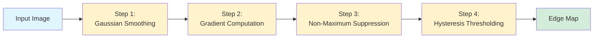
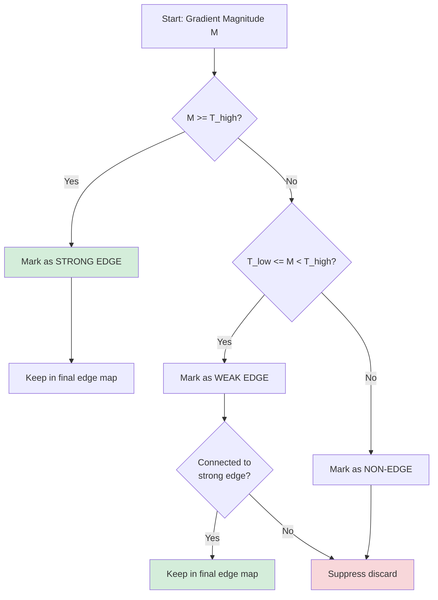
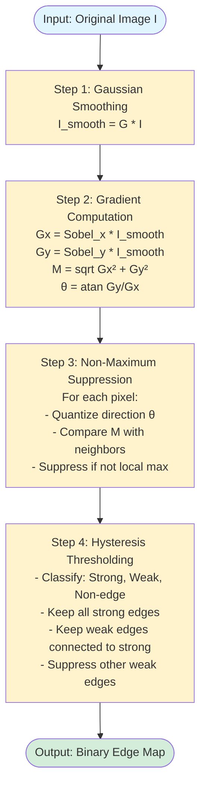
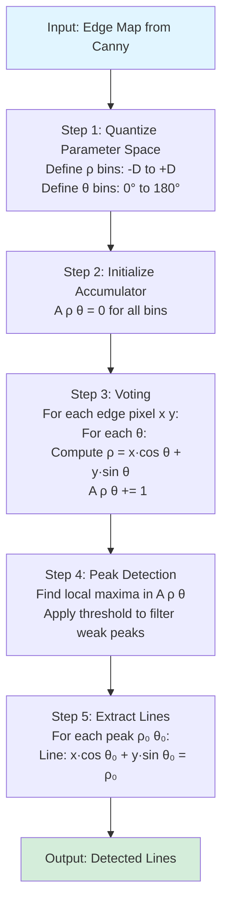

# CS5 – Edge Detection (Canny) & Line Detection (Hough)

> **Course:** MTech AIML - Computer Vision
> **Institution:** BITS Pilani WILP
> **Session:** CS5
> **Topics:** Canny Edge Detector, Hough Transform, Color Image Fundamentals

---

## Table of Contents

- [CS5 – Edge Detection (Canny) \& Line Detection (Hough)](#cs5--edge-detection-canny--line-detection-hough)
  - [Table of Contents](#table-of-contents)
  - [Quick Reference Links](#quick-reference-links)
  - [Learning Objectives](#learning-objectives)
  - [1. The Canny Edge Detector](#1-the-canny-edge-detector)
    - [1.1 Overview and Motivation](#11-overview-and-motivation)
    - [1.2 Step 1: Gaussian Smoothing](#12-step-1-gaussian-smoothing)
    - [1.3 Step 2: Gradient Computation](#13-step-2-gradient-computation)
    - [1.4 Step 3: Non-Maximum Suppression](#14-step-3-non-maximum-suppression)
    - [1.5 Step 4: Hysteresis Thresholding](#15-step-4-hysteresis-thresholding)
    - [1.6 Complete Algorithm Summary](#16-complete-algorithm-summary)
    - [1.7 Numerical Problem 1: Canny Gradient Calculation](#17-numerical-problem-1-canny-gradient-calculation)
    - [1.8 Numerical Problem 2: Non-Maximum Suppression Decision](#18-numerical-problem-2-non-maximum-suppression-decision)
  - [2. Hough Transform for Line Detection](#2-hough-transform-for-line-detection)
    - [2.1 Motivation and Challenges](#21-motivation-and-challenges)
    - [2.2 The Voting Mechanism](#22-the-voting-mechanism)
    - [2.3 Parameter Space Representations](#23-parameter-space-representations)
    - [2.4 The Hough Transform Algorithm](#24-the-hough-transform-algorithm)
    - [2.5 Numerical Problem 1: Hough Voting in m c Space](#25-numerical-problem-1-hough-voting-in-m-c-space)
    - [2.6 Numerical Problem 2: Conversion to Polar Form](#26-numerical-problem-2-conversion-to-polar-form)
    - [2.7 Numerical Problem 3: Vertical Line Detection](#27-numerical-problem-3-vertical-line-detection)
    - [2.8 Numerical Problem 4: Intersecting Lines Detection](#28-numerical-problem-4-intersecting-lines-detection)
  - [3. Color Image Fundamentals](#3-color-image-fundamentals)
    - [3.1 Light and Color](#31-light-and-color)
    - [3.2 RGB Color Model](#32-rgb-color-model)
    - [3.3 CMY and CMYK Models](#33-cmy-and-cmyk-models)
    - [3.4 HSI and HSV Models](#34-hsi-and-hsv-models)
    - [3.5 YCbCr Color Space](#35-ycbcr-color-space)
    - [3.6 YIQ Color Space](#36-yiq-color-space)
    - [3.7 Human Color Vision](#37-human-color-vision)
    - [3.8 Numerical Problem: Harris Corner Response Calculation](#38-numerical-problem-harris-corner-response-calculation)
  - [4. Practice Problems](#4-practice-problems)
    - [4.1 Practice Problem 1: Complete Canny Pipeline](#41-practice-problem-1-complete-canny-pipeline)
    - [4.2 Practice Problem 2: Hough Transform with Multiple Lines](#42-practice-problem-2-hough-transform-with-multiple-lines)
    - [4.3 Practice Problem 3: Color Space Conversion](#43-practice-problem-3-color-space-conversion)
  - [5. Industry Applications](#5-industry-applications)
    - [5.1 Autonomous Vehicles](#51-autonomous-vehicles)
    - [5.2 Medical Imaging](#52-medical-imaging)
    - [5.3 Document Analysis](#53-document-analysis)
    - [5.4 Industrial Inspection](#54-industrial-inspection)
    - [5.5 Flashcards for Quick Revision](#55-flashcards-for-quick-revision)
  - [6. Common Misconceptions](#6-common-misconceptions)
  - [7. Summary and Key Takeaways](#7-summary-and-key-takeaways)
  - [References](#references)

---

## Quick Reference Links

| Category | Resource / Description | Link |
|----------|------------------------|------|
| **Interactive** | Interactive Color Models Platform | [Chromatone Color Models](https://chromatone.center/theory/color/models/) |
| **Reading** | Canny's Edge Detector (Gonzalez & Woods, 4th Ed, pp. 729-735) | Reference: Digital Image Processing |
| **Reading** | Hough Transform (Gonzalez & Woods, 4th Ed, pp. 737-742) | Reference: Digital Image Processing |
| **Original Paper** | Canny, J. (1986). A Computational Approach to Edge Detection | IEEE Trans. Pattern Analysis and Machine Intelligence |
| **Acknowledgement** | Slide Materials: Noah Snavely (Cornell Tech) | [Computer Vision Course](https://www.cs.cornell.edu/~snavely/) |
| **Acknowledgement** | Slide Materials: Kristen Grauman (UT Austin) | [Vision Research](https://www.cs.utexas.edu/~grauman/) |
| **Acknowledgement** | Slide Materials: Shree K. Nayar (Columbia) | [CAVE Projects](https://www.cs.columbia.edu/CAVE/projects/) |

---

## Learning Objectives

By the end of this session, you will be able to:

1. **Understand** the limitations of basic edge detectors and the need for optimal detection methods
2. **Explain** the four-step Canny edge detection algorithm and its mathematical foundations
3. **Compute** gradients, perform non-maximum suppression, and apply hysteresis thresholding manually
4. **Analyze** the Hough Transform voting mechanism for line detection
5. **Convert** between Cartesian (m, c) and Polar (ρ, θ) parameter spaces
6. **Implement** the Hough accumulator algorithm for robust line detection
7. **Describe** major color models (RGB, CMY, HSI/HSV, YCbCr, YIQ) and their applications
8. **Apply** color space conversions using standard formulas
9. **Solve** numerical problems involving edge detection and line detection

---

## 1. The Canny Edge Detector

### 2.1 Overview and Motivation

The **Canny Edge Detector**, developed by John Canny in 1986, is considered the gold standard for edge detection. It provides optimal performance according to the three criteria: good detection, good localization, and single response.



---

### 2.2 Step 1: Gaussian Smoothing

#### **2.2.1 Purpose**

Before computing gradients, we smooth the image with a Gaussian filter to:
- Reduce high-frequency noise that would create false edges
- Control the scale of edge detection
- Create a well-defined mathematical foundation for optimization

---

#### **2.2.2 Gaussian Filter Theory**

The 2D Gaussian function is:

$$G(x, y; \sigma) = \frac{1}{2\pi\sigma^2} \exp\left(-\frac{x^2 + y^2}{2\sigma^2}\right)$$

Or in polar form (where $r^2 = x^2 + y^2$):

$$G(r; \sigma) = \frac{1}{2\pi\sigma^2} \exp\left(-\frac{r^2}{2\sigma^2}\right)$$

Where:
- $\sigma$ (sigma) is the **standard deviation**, controlling the amount of smoothing
- Larger σ → more smoothing → removes more noise but also blurs edges
- Smaller σ → less smoothing → preserves edges but retains more noise

**Properties:**
1. **Separable**: Can be computed as two 1D convolutions (efficient)
2. **Isotropic**: Smooths equally in all directions
3. **Well-localized** in both spatial and frequency domains

---

#### **2.2.3 Gaussian Kernel Examples**

**3×3 Gaussian Kernel (σ ≈ 0.85):**

```
Unnormalized:                 Normalized (sum = 1):
┌────┬────┬────┐           ┌────────┬────────┬────────┐
│  1 │  2 │  1 │           │ 0.0625 │ 0.1250 │ 0.0625 │
├────┼────┼────┤           ├────────┼────────┼────────┤
│  2 │  4 │  2 │  × 1/16 = │ 0.1250 │ 0.2500 │ 0.1250 │
├────┼────┼────┤           ├────────┼────────┼────────┤
│  1 │  2 │  1 │           │ 0.0625 │ 0.1250 │ 0.0625 │
└────┴────┴────┘           └────────┴────────┴────────┘
```

---

**5×5 Gaussian Kernel (σ ≈ 1.0):**

```
Unnormalized:
┌────┬────┬────┬────┬────┐
│  1 │  4 │  6 │  4 │  1 │
├────┼────┼────┼────┼────┤
│  4 │ 16 │ 24 │ 16 │  4 │
├────┼────┼────┼────┼────┤
│  6 │ 24 │ 36 │ 24 │  6 │  × 1/256
├────┼────┼────┼────┼────┤
│  4 │ 16 │ 24 │ 16 │  4 │
├────┼────┼────┼────┼────┤
│  1 │  4 │  6 │  4 │  1 │
└────┴────┴────┴────┴────┘
```

---

**7×7 Gaussian Kernel (σ ≈ 1.5):**

```
Approximate values:
┌────┬────┬────┬────┬────┬────┬────┐
│  0 │  0 │  1 │  2 │  1 │  0 │  0 │
├────┼────┼────┼────┼────┼────┼────┤
│  0 │  3 │ 13 │ 22 │ 13 │  3 │  0 │
├────┼────┼────┼────┼────┼────┼────┤
│  1 │ 13 │ 59 │ 97 │ 59 │ 13 │  1 │
├────┼────┼────┼────┼────┼────┼────┤
│  2 │ 22 │ 97 │159 │ 97 │ 22 │  2 │  × 1/1003
├────┼────┼────┼────┼────┼────┼────┤
│  1 │ 13 │ 59 │ 97 │ 59 │ 13 │  1 │
├────┼────┼────┼────┼────┼────┼────┤
│  0 │  3 │ 13 │ 22 │ 13 │  3 │  0 │
├────┼────┼────┼────┼────┼────┼────┤
│  0 │  0 │  1 │  2 │  1 │  0 │  0 │
└────┴────┴────┴────┴────┴────┴────┘
```

---

#### **2.2.4 Effect of σ Parameter**

```
Original Image:
┌──────────────────┐
│  ████████        │  ← Sharp edge
│  ████████        │
│  ████████        │
└──────────────────┘

Small σ (σ = 0.5):
┌──────────────────┐
│  ████████░       │  ← Slightly blurred
│  ████████░       │
│  ████████░       │
└──────────────────┘

Medium σ (σ = 1.0):
┌──────────────────┐
│  ████████░░      │  ← More blurred
│  ████████░░      │
│  ████████░░      │
└──────────────────┘

Large σ (σ = 2.0):
┌──────────────────┐
│  ████████░░░░    │  ← Heavily blurred
│  ████████░░░░    │
│  ████████░░░░    │
└──────────────────┘
```

#### **2.2.4 Choosing σ Parameter**

The choice of σ significantly affects edge detection performance:

| σ Value | Kernel Size | Smoothing Level | Best For | Noise Reduction | Edge Preservation | Trade-off |
|---------|-------------|-----------------|----------|-----------------|-------------------|-----------|
| **0.5-0.7** | 3×3 | Minimal | Fine details, low noise images | Low | Excellent | Captures texture, may include noise |
| **0.8-1.2** | 5×5 | Moderate | General purpose, balanced | Good | Good | **Recommended starting point** |
| **1.3-1.8** | 7×7 | Strong | Major edges, noisy images | Excellent | Fair | Smooths out fine details |
| **2.0-4.0** | 9×9 or larger | Very strong | Only large structures | Maximum | Poor | Only coarse features remain |

**Selection Guidelines Based on Image Type:**

| Image Type | Recommended σ | Reason |
|------------|---------------|--------|
| Professional camera, good lighting | 0.5-1.0 | Clean image, preserve fine details |
| Smartphone camera, indoor | 1.0-1.5 | Moderate noise, balanced approach |
| Webcam, low light | 1.5-2.5 | High noise, need strong smoothing |
| Medical imaging (X-ray, MRI) | 0.7-1.2 | Preserve diagnostic details |
| Satellite imagery | 1.5-2.0 | Large-scale features important |
| Document scanning | 0.5-1.0 | Sharp text edges crucial |
| Surveillance footage | 1.5-2.5 | Often noisy, detect major objects |

**Effect Visualization:**

```
Original Image (with noise):
┌──────────────────┐
│  ████████░       │  ← Sharp edge + noise pixels
│  ████████░░      │
│  ████████░       │
└──────────────────┘

σ = 0.5 (Small - Preserves detail):
┌──────────────────┐
│  ████████░       │  ← Edge preserved, some noise remains
│  ████████░       │     Intensity jump: 195 → 55
│  ████████░       │
└──────────────────┘

σ = 1.0 (Medium - Balanced):
┌──────────────────┐
│  ████████░░      │  ← Edge slightly blurred, noise reduced
│  ████████░░      │     Intensity jump: 180 → 70
│  ████████░░      │
└──────────────────┘

σ = 2.0 (Large - Strong smoothing):
┌──────────────────┐
│  ████████░░░░    │  ← Edge significantly blurred, no noise
│  ████████░░░░    │     Intensity jump: 150 → 100
│  ████████░░░░    │
└──────────────────┘
```

**Quick Decision Tree:**

```
Is the image noisy?
├─ NO → σ = 0.5-1.0 (preserve details)
└─ YES → Do you need fine details?
         ├─ YES → σ = 1.0-1.5 (balance)
         └─ NO  → σ = 1.5-2.5 (smooth heavily)
```

**Pro Tip:** Start with σ=1.0 and adjust based on results:
- Too many edges / noise → Increase σ
- Missing important edges → Decrease σ

---

#### **2.2.5 Applying Gaussian Smoothing**

The smoothed image is obtained by convolution:

$$I_{\text{smooth}}(x, y) = G(x, y; \sigma) * I(x, y)$$

Example computation for a 3×3 neighborhood:

```
Original Image Region:        Gaussian Kernel (3×3):
┌─────┬─────┬─────┐         ┌────────┬────────┬────────┐
│ 100 │ 120 │ 110 │         │ 0.0625 │ 0.1250 │ 0.0625 │
├─────┼─────┼─────┤    *    ├────────┼────────┼────────┤
│  95 │ 200 │ 105 │         │ 0.1250 │ 0.2500 │ 0.1250 │
├─────┼─────┼─────┤         ├────────┼────────┼────────┤
│  90 │ 115 │ 100 │         │ 0.0625 │ 0.1250 │ 0.0625 │
└─────┴─────┴─────┘         └────────┴────────┴────────┘

Center pixel (smoothed):
= (100×0.0625) + (120×0.1250) + (110×0.0625)
+ (95×0.1250) + (200×0.2500) + (105×0.1250)
+ (90×0.0625) + (115×0.1250) + (100×0.0625)
= 6.25 + 15.0 + 6.875 + 11.875 + 50.0 + 13.125 + 5.625 + 14.375 + 6.25
= 129.375 ≈ 129
```

---

### 2.3 Step 2: Gradient Computation

After smoothing, we compute the gradient to find edge strength and direction.

#### **2.3.1 Computing Gradients with Finite Differences**

We approximate the partial derivatives using finite differences. The most common approach is to use **Sobel operators** (as discussed in CS4):

**Horizontal Gradient (Gx):**

$$G_x = \begin{bmatrix} -1 & 0 & +1 \\ -2 & 0 & +2 \\ -1 & 0 & +1 \end{bmatrix} * I_{\text{smooth}}$$

**Vertical Gradient (Gy):**

$$G_y = \begin{bmatrix} -1 & -2 & -1 \\ 0 & 0 & 0 \\ +1 & +2 & +1 \end{bmatrix} * I_{\text{smooth}}$$

---

#### **2.3.2 Gradient Magnitude**

The edge strength at each pixel is:

$$M(x, y) = \sqrt{G_x(x, y)^2 + G_y(x, y)^2}$$

**Fast Approximation** (avoiding square root):

$$M(x, y) \approx |G_x(x, y)| + |G_y(x, y)|$$

This approximation is computationally efficient and sufficiently accurate for most applications.

---

#### **2.3.3 Gradient Direction**

The edge orientation (angle) is:

$$\theta(x, y) = \arctan\left(\frac{G_y(x, y)}{G_x(x, y)}\right)$$

**Important:** The angle θ represents the direction **perpendicular to the edge**, i.e., the direction of maximum intensity change.

```
Angle Convention:

          90° (↑)
           │
           │
180° (←) ──┼── 0° (→)
           │
           │
         -90° (↓)

Edge Direction vs Gradient Direction:
┌─────────────────────────────┐
│  Gradient (∇f)              │
│      ↑ θ = 90°              │
│      │                       │
│ ─────┼───── Edge (horizontal)│
│                              │
└─────────────────────────────┘
```

---

#### **2.3.4 Efficient Gradient Computation**

**Key Optimization:** Convolution is associative and distributive, so we can combine Gaussian smoothing and gradient computation:

$$\nabla(G * I) = (\nabla G) * I$$

This means we can:
1. Pre-compute the derivative of the Gaussian kernel
2. Convolve once with $\frac{\partial G}{\partial x}$ for $G_x$
3. Convolve once with $\frac{\partial G}{\partial y}$ for $G_y$

This is more efficient than smoothing first, then computing gradients separately.

**Derivative of Gaussian:**

$$\frac{\partial G}{\partial x} = -\frac{x}{\sigma^2} G(x, y; \sigma)$$

$$\frac{\partial G}{\partial y} = -\frac{y}{\sigma^2} G(x, y; \sigma)$$

---

#### **2.3.5 Example: Gradient Calculation**

Given a smoothed 3×3 region:

```
Smoothed Image:
┌─────┬─────┬─────┐
│ 150 │ 150 │ 150 │
├─────┼─────┼─────┤
│ 150 │ 150 │ 150 │
├─────┼─────┼─────┤
│  50 │  50 │  50 │
└─────┴─────┴─────┘
```

**Step 1: Apply Sobel Gx**

```
        ┌────┬────┬────┐
        │ -1 │  0 │ +1 │
Gx =    │ -2 │  0 │ +2 │
        │ -1 │  0 │ +1 │
        └────┴────┴────┘

Gx = (-1×150) + (0×150) + (1×150)     [top row]
   + (-2×150) + (0×150) + (2×150)     [middle row]
   + (-1×50)  + (0×50)  + (1×50)      [bottom row]

Gx = -150 + 0 + 150 - 300 + 0 + 300 - 50 + 0 + 50
Gx = 0
```

**Step 2: Apply Sobel Gy**

```
        ┌────┬────┬────┐
        │ -1 │ -2 │ -1 │
Gy =    │  0 │  0 │  0 │
        │ +1 │ +2 │ +1 │
        └────┴────┴────┘

Gy = (-1×150) + (-2×150) + (-1×150)   [top row]
   + (0×150)  + (0×150)  + (0×150)    [middle row]
   + (1×50)   + (2×50)   + (1×50)     [bottom row]

Gy = -150 - 300 - 150 + 0 + 0 + 0 + 50 + 100 + 50
Gy = -400
```

**Step 3: Calculate Magnitude and Direction**

$$M = \sqrt{0^2 + (-400)^2} = \sqrt{160000} = 400$$

$$\theta = \arctan\left(\frac{-400}{0}\right) = -90°$$

**Interpretation:** This is a strong horizontal edge with the gradient pointing downward (from bright to dark region).

---

### 2.4 Step 3: Non-Maximum Suppression

#### **2.4.1 Purpose**

After computing gradients, edges are often several pixels thick. Non-Maximum Suppression (NMS) thins the edges to obtain single-pixel-wide edge responses.

**Goal:** Keep only the pixels that are local maxima in the gradient magnitude **along the gradient direction**.

```
Before NMS:              After NMS:
┌────────────┐          ┌────────────┐
│  50 70 40  │          │   0 70  0  │
│  60 80 55  │    →     │   0 80  0  │
│  45 75 50  │          │   0 75  0  │
└────────────┘          └────────────┘
     ↑                       ↑
  Thick edge            Thin edge
```

---

#### **2.4.2 Algorithm**

For each pixel (x, y):

1. **Round gradient direction** θ(x, y) to nearest of 4 directions:
   - 0° (horizontal)
   - 45° (diagonal ↗)
   - 90° (vertical)
   - 135° (diagonal ↖)

2. **Compare** M(x, y) with neighbors along the gradient direction

3. **Suppress** if M(x, y) is not the local maximum:
   - Set M(x, y) = 0 if not maximum
   - Keep M(x, y) if it is maximum

---

#### **2.4.3 Direction Quantization**

The gradient angle θ is quantized into 4 sectors:

| Angle Range | Sector | Direction | Compare With |
|-------------|--------|-----------|--------------|
| -22.5° to 22.5° | 0 | Horizontal (→) | East and West neighbors |
| 22.5° to 67.5° | 1 | Diagonal (↗) | NE and SW neighbors |
| 67.5° to 112.5° (or -112.5° to -67.5°) | 2 | Vertical (↑) | North and South neighbors |
| 112.5° to 157.5° (or -157.5° to -112.5°) | 3 | Diagonal (↖) | NW and SE neighbors |

```
Angle Sectors (Quantization):

        90° (Sector 2)
         │
    135° │  45°
    (S3) │ (S1)
         │
 180° ───┼─── 0° (Sector 0)
         │
   -135° │ -45°
    (S3) │ (S1)
         │
       -90° (Sector 2)
```

---

#### **2.4.4 3×3 Neighborhood Comparisons**

For a pixel at position (x, y), the 8-connected neighbors are:

```
Neighborhood Layout:

  NW   N   NE
   ┌───┬───┬───┐
   │ ↖ │ ↑ │ ↗ │
W  ├───┼───┼───┤  E
   │ ← │ ● │ → │
   ├───┼───┼───┤
   │ ↙ │ ↓ │ ↘ │
   └───┴───┴───┘
  SW   S   SE

● = Current pixel
```

**Comparison Rules:**

- **Sector 0 (Horizontal, θ ≈ 0°)**: Compare with E and W
- **Sector 1 (Diagonal ↗, θ ≈ 45°)**: Compare with NE and SW
- **Sector 2 (Vertical, θ ≈ 90°)**: Compare with N and S
- **Sector 3 (Diagonal ↖, θ ≈ 135°)**: Compare with NW and SE

---

#### **2.4.5 NMS Example**

```
Gradient Magnitude Map:     Gradient Direction Map:
┌────┬────┬────┬────┐      ┌────┬────┬────┬────┐
│ 50 │ 60 │ 65 │ 40 │      │  0°│  0°│  0°│  0°│
├────┼────┼────┼────┤      ├────┼────┼────┼────┤
│ 70 │ 85 │ 90 │ 55 │      │  0°│  0°│  0°│  0°│
├────┼────┼────┼────┤      ├────┼────┼────┼────┤
│ 45 │ 75 │ 80 │ 50 │      │  0°│  0°│  0°│  0°│
└────┴────┴────┴────┘      └────┴────┴────┴────┘
```

For pixel (1, 1) with M = 85 and θ = 0°:
- Sector = 0 (Horizontal)
- Compare with: E = 90, W = 70
- Since 85 < 90, this pixel is **NOT** a local maximum
- **Suppress**: Set M(1, 1) = 0

For pixel (1, 2) with M = 90 and θ = 0°:
- Sector = 0 (Horizontal)
- Compare with: E = 55, W = 85
- Since 90 > 85 and 90 > 55, this pixel **IS** a local maximum
- **Keep**: M(1, 2) = 90

**After NMS:**

```
┌────┬────┬────┬────┐
│  0 │  0 │ 65 │  0 │
├────┼────┼────┼────┤
│  0 │  0 │ 90 │  0 │
├────┼────┼────┼────┤
│  0 │  0 │ 80 │  0 │
└────┴────┴────┴────┘
```

**Result:** Thin, single-pixel-wide edges preserved.

---

---

### 2.5 Step 4: Hysteresis Thresholding

#### **2.5.1 Purpose**

After NMS, we need to decide which edge pixels to keep. Simple thresholding (M > T) has problems:
- **Too high threshold**: Misses weak but valid edges (false negatives)
- **Too low threshold**: Includes noise as edges (false positives)

**Solution:** Use **double thresholding with hysteresis** to make edge-following decisions.

---

#### **2.5.2 Double Threshold Concept**

Instead of one threshold, use two:

- **T_high**: Upper threshold for "strong" edges
- **T_low**: Lower threshold for "weak" edges

Typical ratio: $T_{high} = 2 \times T_{low}$ to $T_{high} = 3 \times T_{low}$

**Classification:**

$$\text{Pixel Classification} = \begin{cases}
\text{Strong Edge} & \text{if } M(x, y) \geq T_{high} \\
\text{Weak Edge} & \text{if } T_{low} \leq M(x, y) < T_{high} \\
\text{Non-Edge} & \text{if } M(x, y) < T_{low}
\end{cases}$$

```
Magnitude Scale:

High ├─────────────────  (Strong edges, definitely keep)
     │  T_high
     │─────────────────
     │   Weak edges     (Keep only if connected to strong)
     │   (uncertain)
     │  T_low
     │─────────────────
Low  ├─────────────────  (Non-edges, definitely discard)
```

---

#### **2.5.3 Edge Tracking by Hysteresis**

The key idea: **Keep weak edges only if they are connected to strong edges.**

**Algorithm:**

1. **Mark all strong edges** (M ≥ T_high) as confirmed edges

2. **For each weak edge** (T_low ≤ M < T_high):
   - Check its 8-connected neighbors
   - If any neighbor is a strong edge (or already confirmed), mark this weak edge as confirmed
   - Otherwise, suppress it

3. **Recursively follow** connected weak edges (edge linking)

4. **Suppress** all remaining weak edges that are not connected to strong edges



---

#### **2.5.4 8-Connectivity for Edge Linking**

A weak edge pixel is connected to a strong edge if any of its 8 neighbors is a strong or confirmed edge:

```
8-Connected Neighborhood:

  ┌───┬───┬───┐
  │ 1 │ 2 │ 3 │  Check all 8 neighbors
  ├───┼───┼───┤
  │ 4 │ ● │ 5 │  ● = Weak edge pixel
  ├───┼───┼───┤
  │ 6 │ 7 │ 8 │
  └───┴───┴───┘

If any of {1,2,3,4,5,6,7,8} is a strong/confirmed edge,
then keep the weak edge ●.
```

---

#### **2.5.5 Example: Hysteresis Thresholding**

Given: T_low = 50, T_high = 100

```
Gradient Magnitude (after NMS):
┌────┬────┬────┬────┬────┐
│  0 │  0 │ 120│  0 │  0 │  Row 0
├────┼────┼────┼────┼────┤
│  0 │ 60 │ 110│ 70 │  0 │  Row 1
├────┼────┼────┼────┼────┤
│  0 │  0 │ 105│ 80 │  0 │  Row 2
├────┼────┼────┼────┼────┤
│  0 │ 45 │ 95 │  0 │  0 │  Row 3
└────┴────┴────┴────┴────┘
```

**Step 1: Classify pixels**

```
Classification:
┌─────┬─────┬─────┬─────┬─────┐
│  -  │  -  │  S  │  -  │  -  │  S = Strong (M ≥ 100)
├─────┼─────┼─────┼─────┼─────┤  W = Weak (50 ≤ M < 100)
│  -  │  W  │  S  │  W  │  -  │  - = Non-edge (M < 50)
├─────┼─────┼─────┼─────┼─────┤
│  -  │  -  │  S  │  W  │  -  │
├─────┼─────┼─────┼─────┼─────┤
│  -  │  -  │  W  │  -  │  -  │
└─────┴─────┴─────┴─────┴─────┘
```

**Step 2: Edge linking (hysteresis)**

- Pixel (1,1): M=60 (Weak), neighbor (1,2)=110 (Strong) → **Keep**
- Pixel (1,3): M=70 (Weak), neighbor (1,2)=110 (Strong) → **Keep**
- Pixel (2,3): M=80 (Weak), neighbor (2,2)=105 (Strong) → **Keep**
- Pixel (3,2): M=95 (Weak), neighbor (2,2)=105 (Strong) → **Keep**

**Final Edge Map:**

```
┌────┬────┬────┬────┬────┐
│  0 │  0 │ 120│  0 │  0 │
├────┼────┼────┼────┼────┤
│  0 │ 60 │ 110│ 70 │  0 │
├────┼────┼────┼────┼────┤
│  0 │  0 │ 105│ 80 │  0 │
├────┼────┼────┼────┼────┤
│  0 │  0 │ 95 │  0 │  0 │
└────┴────┴────┴────┴────┘

All weak edges connected to strong edges are preserved!
```

---

#### **2.5.6 Threshold Selection Guidelines**

**Automatic Threshold Selection (Otsu-like approach):**

1. Compute histogram of gradient magnitudes
2. Set T_high based on desired false positive rate (e.g., 90th percentile)
3. Set T_low = T_high / 2 or T_low = T_high / 3

**Manual Threshold Selection:**

- **High-noise images**: Use higher thresholds (T_high = 80-150)
- **Clean images**: Use lower thresholds (T_high = 40-80)
- **Fine details needed**: Use lower T_low (T_low = 20-40)
- **Major edges only**: Use higher T_low (T_low = 50-100)

**Common Defaults:**
- T_high = 100, T_low = 50 (for 8-bit images with magnitude 0-255)

---

---

### 2.6 Complete Algorithm Summary



---

#### **Complete Parameter Summary**

| Parameter | Symbol | Typical Range | Purpose | Effect of Increasing | Effect of Decreasing | Recommended Starting Value |
|-----------|--------|---------------|---------|---------------------|---------------------|----------------------------|
| **Gaussian Std Dev** | σ | 0.5 - 2.0 | Noise removal & scale selection | More smoothing, fewer edges, coarser features | Less smoothing, more noise edges, finer details | σ = 1.0 |
| **Kernel Size** | N×N | 3×3, 5×5, 7×7, 9×9 | Spatial extent of smoothing | Larger blur radius, slower computation | Faster, but less noise reduction | 5×5 |
| **High Threshold** | T_high | 80 - 150 (8-bit) | Strong edge classification | Fewer edges detected, more conservative | More edges detected, may include noise | T_high = 100 |
| **Low Threshold** | T_low | 40 - 75 (8-bit) | Weak edge classification | Fewer weak edges kept, more broken edges | More weak edges kept, better connectivity | T_low = 50 |
| **Threshold Ratio** | T_high/T_low | 2:1 to 3:1 | Edge connectivity control | More selective linking, cleaner edges | More aggressive linking, fewer breaks | 2:1 |
| **Gradient Operator** | - | Sobel, Prewitt, Scharr | Edge detection sensitivity | Different noise/accuracy trade-offs | - | Sobel (3×3) |

---

#### **Parameter Interaction Matrix**

| If you see... | Problem | Adjust | Direction | New Setting Example |
|---------------|---------|--------|-----------|---------------------|
| Too many thin edges + noise | Noise not suppressed | σ | Increase | σ: 1.0 → 1.5 |
| Missing important edges | Over-smoothed | σ | Decrease | σ: 1.5 → 1.0 |
| Too many edge pixels overall | Thresholds too low | T_high, T_low | Increase both | T_high: 80→100, T_low: 40→50 |
| Broken/disconnected edges | Gap between thresholds too large | T_low | Increase | T_low: 40 → 60 (keep T_high=100) |
| Noisy edges everywhere | T_low too permissive | T_low | Increase | T_low: 50 → 70 |
| Only strongest edges detected | T_high too conservative | T_high, T_low | Decrease both | T_high: 100→80, T_low: 50→40 |
| Thick edges (multiple pixels) | NMS not working | - | Check gradient computation | Verify Sobel implementation |

---

#### **Tuning Strategy (Step-by-Step)**

**Starting Point:**
```
σ = 1.0
Kernel = 5×5
T_high = 100
T_low = 50
Ratio = 2:1
```

**Tuning Process:**

1. **First, adjust σ for noise:**
   - Run Canny with default thresholds
   - See noise in output? → Increase σ
   - Missing fine details? → Decrease σ
   - Goal: Clean gradient magnitude map

2. **Then, tune T_high:**
   - Look at gradient magnitude histogram
   - Set T_high where you want "definitely an edge" cutoff
   - Typical: 70th-90th percentile of non-zero gradients

3. **Finally, set T_low:**
   - Set T_low = T_high / 2 (starting point)
   - Broken edges? → Decrease ratio (T_low higher)
   - Too noisy? → Increase ratio (T_low lower)

4. **Iterate if needed:**
   - Major changes → revisit σ
   - Fine-tuning → adjust thresholds only

---

#### **Parameter Settings by Application**

| Application | σ | Kernel | T_high | T_low | Ratio | Why |
|-------------|---|--------|--------|-------|-------|-----|
| **Document Scanning** | 0.5-0.8 | 3×3 | 120-150 | 60-75 | 2:1 | Sharp text edges, minimal noise |
| **Facial Recognition** | 0.8-1.2 | 5×5 | 80-100 | 40-50 | 2:1 | Balanced detail and robustness |
| **Autonomous Driving** | 1.0-1.5 | 5×5 | 90-120 | 50-60 | 2:1 | Lane lines, robust to motion blur |
| **Medical Imaging** | 0.7-1.0 | 5×5 | 60-90 | 30-45 | 2:1 | Preserve diagnostic details |
| **Satellite Imagery** | 1.5-2.0 | 7×7 | 100-130 | 60-80 | 2:1 | Large features, atmospheric noise |
| **Surveillance (Low-light)** | 1.5-2.5 | 7×7 | 70-90 | 40-50 | 2:1 | High noise, major objects only |
| **Industrial Inspection** | 0.8-1.2 | 5×5 | 100-140 | 50-70 | 2:1 | Defect detection, clear boundaries |

---

#### **Quick Parameter Reference Card**

```
┌─────────────────────────────────────────────────┐
│  CANNY EDGE DETECTOR - QUICK REFERENCE          │
├─────────────────────────────────────────────────┤
│  DEFAULT SETTINGS (8-bit images):               │
│  • σ = 1.0                                      │
│  • Kernel = 5×5 Gaussian                        │
│  • T_high = 100                                 │
│  • T_low = 50                                   │
│  • Ratio = 2:1                                  │
├─────────────────────────────────────────────────┤
│  QUICK FIXES:                                   │
│  • Noisy output → Increase σ                    │
│  • Missing edges → Decrease T_high              │
│  • Broken edges → Increase T_low                │
│  • Too many edges → Increase both thresholds    │
├─────────────────────────────────────────────────┤
│  PARAMETER BOUNDS:                              │
│  • σ: Keep between 0.5-2.5                      │
│  • Kernel: Must be odd (3,5,7,9...)             │
│  • T_high > T_low (always!)                     │
│  • Ratio: Keep between 1.5:1 and 3:1            │
└─────────────────────────────────────────────────┘
```

---

**Key Insights:**

1. **Gaussian smoothing** controls the scale of features detected
2. **Gradient computation** finds edge candidates
3. **Non-maximum suppression** ensures thin, localized edges
4. **Hysteresis** provides robust edge linking while suppressing noise

**Advantages of Canny:**
- Optimal performance (good detection, localization, single response)
- Robust to noise due to Gaussian pre-filtering
- Produces thin, well-localized edges
- Hysteresis reduces broken edges

**Limitations:**
- Computationally expensive (multiple steps)
- Parameter tuning required (σ, T_high, T_low)
- Still sensitive to very high noise levels

---

---

### 1.7 Numerical Problem 1: Canny Gradient Calculation

**Given:** The following intensity values in a 3×3 neighborhood:

$$I = \begin{bmatrix} 150 & 150 & 150 \\ 150 & 150 & 150 \\ 50 & 50 & 50 \end{bmatrix}$$

**Task:** Calculate the gradient magnitude $|G|$ and direction $\theta$ at the center pixel using Sobel operators.

---

**Solution:**

**Step 1: Apply Sobel Gx (Horizontal Gradient)**

```
Sobel Gx:               Image:
┌────┬────┬────┐     ┌─────┬─────┬─────┐
│ -1 │  0 │ +1 │     │ 150 │ 150 │ 150 │
├────┼────┼────┤  *  ├─────┼─────┼─────┤
│ -2 │  0 │ +2 │     │ 150 │ 150 │ 150 │
├────┼────┼────┤     ├─────┼─────┼─────┤
│ -1 │  0 │ +1 │     │  50 │  50 │  50 │
└────┴────┴────┘     └─────┴─────┴─────┘
```

$G_x = (-1 \times 150) + (0 \times 150) + (1 \times 150)$ [top row]
$\quad + (-2 \times 150) + (0 \times 150) + (2 \times 150)$ [middle row]
$\quad + (-1 \times 50) + (0 \times 50) + (1 \times 50)$ [bottom row]

$G_x = -150 + 0 + 150 - 300 + 0 + 300 - 50 + 0 + 50$

$G_x = 0$

---

**Step 2: Apply Sobel Gy (Vertical Gradient)**

```
Sobel Gy:               Image:
┌────┬────┬────┐     ┌─────┬─────┬─────┐
│ -1 │ -2 │ -1 │     │ 150 │ 150 │ 150 │
├────┼────┼────┤  *  ├─────┼─────┼─────┤
│  0 │  0 │  0 │     │ 150 │ 150 │ 150 │
├────┼────┼────┤     ├─────┼─────┼─────┤
│ +1 │ +2 │ +1 │     │  50 │  50 │  50 │
└────┴────┴────┘     └─────┴─────┴─────┘
```

$G_y = (-1 \times 150) + (-2 \times 150) + (-1 \times 150)$ [top row]
$\quad + (0 \times 150) + (0 \times 150) + (0 \times 150)$ [middle row]
$\quad + (1 \times 50) + (2 \times 50) + (1 \times 50)$ [bottom row]

$G_y = -150 - 300 - 150 + 0 + 0 + 0 + 50 + 100 + 50$

$G_y = -400$

---

**Step 3: Calculate Magnitude and Direction**

**Magnitude:**
$$|G| = \sqrt{G_x^2 + G_y^2} = \sqrt{0^2 + (-400)^2} = \sqrt{160000} = 400$$

**Direction:**
$$\theta = \arctan\left(\frac{G_y}{G_x}\right) = \arctan\left(\frac{-400}{0}\right) = -90°$$

**Interpretation:** This is a **horizontal edge** with gradient magnitude 400, pointing downward (from bright to dark region).

---

---

### 1.8 Numerical Problem 2: Non-Maximum Suppression Decision

**Given:** A pixel has:
- Gradient magnitude: $|G| = 85$
- Gradient direction: $\theta = 12°$
- Neighbor magnitudes: East = 90, West = 70

**Task:** Should we keep or suppress this pixel?

---

**Solution:**

**Step 1: Quantize Direction**

$\theta = 12°$ falls in the range $[-22.5°, 22.5°]$

→ **Sector 0 (Horizontal)**

→ Compare with **East and West neighbors**

---

**Step 2: Compare with Neighbors**

```
Neighborhood:
   ┌────┬────┬────┐
   │    │    │    │
   ├────┼────┼────┤
   │ 70 │ 85 │ 90 │  ← Horizontal comparison
   ├────┼────┼────┤
   │    │    │    │
   └────┴────┴────┘
    West Center East
```

Center magnitude: 85
- Compare with East: 85 < 90  ✗ (Not maximum)
- Compare with West: 85 > 70  ✓

**Step 3: Decision**

Since $85 < 90$ (not greater than or equal to East neighbor), the pixel is **NOT a local maximum**.

**Result:** **SUPPRESS** (Set to 0)

---

---

## 2. Hough Transform for Line Detection

**What is the Hough Transform? (In Simple Terms)**

The Hough Transform is a clever **voting algorithm** that finds straight lines in images. Think of it as a democracy where every edge pixel votes for which lines it thinks exist.

**The Big Idea:**

After Canny edge detection, you have thousands of edge pixels scattered across your image. The question is: "Which of these pixels belong together to form lines?"

**Simple Analogy - The Voting Game:**

Imagine a classroom where students sit at different desks:

1. **The Question**: "Which students are sitting in a straight row?"

2. **Old Method** (Least Squares):
   - Pick any two students
   - Draw a line through them
   - See if others align
   - Problem: If one student is out of place, your line is wrong!

3. **Hough Method** (Voting):
   - Ask EACH student: "What straight lines could you be part of?"
   - Each student shouts out: "Horizontal row 3!", "Vertical column 2!", "Diagonal!", etc.
   - Count which line gets mentioned most
   - The line with the most votes = real line!

**Why This is Brilliant:**

- **Robust to noise**: If one student is out of place, they vote differently, but the real row still wins
- **Finds multiple lines**: Can detect several rows/columns at once
- **Handles gaps**: Even if some students are missing, the line still gets enough votes

---

### 3.1 Motivation and Challenges

After detecting edges (e.g., using Canny), we often want to find **higher-level structures** like lines, circles, or other parametric curves. Simply having edge pixels is not enough—we need to **group** them into meaningful shapes.

**Challenges in Line Fitting:**

1. **Clutter and Occlusion**: Many edge points don't belong to any line
2. **Missing Data**: Lines may have gaps due to occlusion or weak edges
3. **Noise**: Edge positions may be slightly inaccurate

**Enhanced Challenge Visualization:**

```
Real-World Challenges (What Hough Handles Well):

1. OCCLUSION (Missing Parts):
   ┌──────────────────────┐
   │  ●  ●  ●             │  Line continues...
   │         ⬛⬛⬛        │  ...but hidden behind
   │         ⬛⬛⬛        │  ...an object
   │             ●  ●  ●  │  ...and reappears!
   └──────────────────────┘

   Problem: Traditional methods see TWO short lines
   Hough: Votes from both segments → ONE line detected! ✓

2. MULTIPLE OVERLAPPING LINES:
   ┌──────────────────────┐
   │  ●──●──●──●──●       │  Horizontal line (5 votes)
   │     │                │
   │     ●                │  Vertical line (4 votes)
   │     │                │
   │     ●  ●──●──●       │  Another horizontal (4 votes)
   │     │                │
   │     ●                │  All detected separately!
   └──────────────────────┘

   Problem: Lines cross/overlap - confusing!
   Hough: Each gets separate vote peak ✓

3. NOISE AND OUTLIERS:
   ┌──────────────────────┐
   │  ●──●──●──●──●──●    │  True line (6 votes)
   │        ●             │  Random noise (1 vote)
   │     ●                │  More noise (1 vote)
   │  ●──●──●──●──●──●    │  Line continues (6 more votes)
   └──────────────────────┘

   Problem: Noise pixels look like edges
   Hough: Real line gets 12 votes, noise gets 1-2 → Clear winner! ✓

4. GAPS AND BROKEN LINES:
   ┌──────────────────────┐
   │  ●──●──●             │  First segment (3 votes)
   │             [gap]    │  Missing pixels
   │              ●──●──● │  Second segment (3 votes)
   └──────────────────────┘

   Problem: Appears as two separate lines
   Hough: Both segments vote for SAME line parameters
          → 6 total votes → ONE line! ✓

5. REAL PHOTO EXAMPLE (Lane Detection):
   ┌──────────────────────┐
   │    ╲        ╱        │  Two lane lines
   │     ●      ●         │  Dotted marking (gaps)
   │      ╲    ╱          │
   │       ●  ●           │  More dots
   │        ╲╱            │
   │        ●●            │  Bottom of lanes
   └──────────────────────┘

   Challenges:
   - Dotted lines (not solid)
   - Perspective (lines converge)
   - Other road markings (noise)

   Hough: Each dotted segment votes
          → Two clear peaks → Both lanes! ✓
```

**Why Simple Methods Fail:**

```
Scenario: Detect line with outlier

Input Points:     Least-Squares Fit:      Hough Transform:

 ●──●──●──●       ●──●──●──●              ●──●──●──●
       ●               ╱  ●                    ●
 ●──●──●──●       ●──●──●──●              ●──●──●──●
                       ╲                       │
True line:       WRONG line!             CORRECT line!
8 points         (pulled by outlier)     (8 votes vs 1)
+ 1 outlier
```

**Least Squares Problems:**
- Minimizes squared distances to ALL points
- ONE outlier pulls the line off course
- Must know which points belong together
- Cannot handle multiple lines

**Hough Advantages:**
- Voting system → outliers have fewer votes
- No need to know which points belong together
- Multiple lines → multiple vote peaks
- Missing data → still gets partial votes

---

### 3.2 The Voting Mechanism

**What is Voting? (Simple Explanation)**

Think of each edge pixel as a voter in an election. Each pixel doesn't know which line it belongs to, but it can vote for ALL possible lines that could pass through it. The line that gets the most votes wins!

**Real-World Analogy:**

Imagine you're in a dark room with 10 people holding flashlights. You want to find if people are standing in straight lines:

- **Each person shouts**: "I could be part of a horizontal line, OR a vertical line, OR a diagonal line, OR..."
- **You count**: How many people claim each possible line
- **Result**: If 5 people all claim "diagonal line at 45°", that's probably a real line!

This is exactly what Hough Transform does with pixels.

---

**The Duality Principle (Simplified)**

This is the "magic" that makes Hough work:

**In Image Space:**
- One point can be on MANY different lines
- Example: Point (2,3) can be on y=x+1, y=2x-1, y=3, x=2, etc.

**In Parameter Space:**
- Each of those lines becomes a single point
- The point (2,3) creates a CURVE showing all possible lines

**The Key Insight:**
```
Image Space                Parameter Space
────────────              ──────────────────

One point (●)       →     One curve (∿∿∿)
                          (all lines through that point)

Many collinear      →     Many curves intersecting
points (● ● ●)            at ONE point (●)
                          (that point = the line parameters!)
```

**Example in Plain English:**

```
Image Space:                  Parameter Space:

Point at (1,1)               Creates a sinusoidal curve
   ●                         showing all lines through (1,1)

Point at (2,2)               Creates another sinusoidal curve
      ●                      showing all lines through (2,2)

Point at (3,3)               Creates a third curve
         ●
                             All 3 curves INTERSECT at one spot!
All on line y=x              That spot represents y=x

The intersection = VOTES!
3 curves meet = 3 votes for line y=x
```

**Why This Works:**

1. **Each edge pixel** → draws a curve in parameter space
2. **Collinear pixels** → their curves intersect at the SAME point
3. **That intersection point** → represents the line parameters
4. **Vote count** → number of pixels on that line

**Visual Summary:**

```
Voting Process:

Step 1: Edge pixel (2,3) votes
        "I vote for ALL lines through me"
        → Creates curve in parameter space

Step 2: Edge pixel (4,5) votes
        "I vote for ALL lines through me"
        → Creates another curve

Step 3: Both on line y=x+1?
        → Their curves CROSS at (m=1, c=1)
        → That's 2 votes for y=x+1!

Step 4: Find peak votes
        → Line with most votes = detected line
```

**Mathematical Duality Table:**

| Image Space | ↔ | Parameter Space |
|-------------|---|-----------------|
| **1 point** (x₀, y₀) | maps to | **1 curve** (all lines through point) |
| **N collinear points** | map to | **N curves intersecting at 1 point** |
| **1 line** (many points) | maps to | **1 point** (peak in accumulator) |
| **Scattered noise** | maps to | **Random curves** (no intersection) |

---

### 3.3 Parameter Space Representations

#### **3.3.1 Slope-Intercept Form (m, c)**

The simplest parameterization of a line:

$$y = mx + c$$

Where:
- $m$ = slope
- $c$ = y-intercept

**Point-to-Curve Mapping:**

For a fixed point $(x_0, y_0)$, all lines passing through it satisfy:

$$y_0 = mx_0 + c \quad \Rightarrow \quad c = -mx_0 + y_0$$

This is a **line in (m, c) parameter space**.

```
Example: Point (2, 3)

Image Space:              Parameter Space (m, c):

    │                          c
  3 ┤──●  (2,3)              ↑
    │                          │
  2 ┤                        3 ├    ╱  (Line: c = -2m + 3)
    │                          │  ╱
  1 ┤                        2 ├╱
    │                          │╱
  0 ┼────────→ x             1 ├─────────→ m
    0 1 2 3 4                  │
                               0
```

---

**Line-to-Point Mapping:**

Multiple collinear points in image space map to curves that **intersect at a single point** in parameter space.

```
Example: Points (1,1), (2,3), (3,5) lie on line y = 2x - 1

Image Space:              Parameter Space (m, c):

  5 ┤────●  (3,5)              c
    │                          ↑
  4 ┤                          │
    │                        0 ├─────●  (m=2, c=-1)
  3 ┤──●  (2,3)                │   ╱╱╱  All three lines
    │                       -1 ├ ╱╱╱   intersect here!
  2 ┤                          │╱╱╱
    │                       -2 ├───────────→ m
  1 ┤●  (1,1)                  │ 1  2  3
    │                          │
  0 ┼────────→ x
    0 1 2 3 4
```

**Intersection point** (m=2, c=-1) represents the line $y = 2x - 1$.

**Limitations of (m, c) Representation:**

1. **Vertical lines**: Slope m = ∞ (undefined)
2. **Unbounded parameter space**: m ∈ (-∞, ∞), making quantization difficult
3. **Non-uniform quantization**: Small changes in m cause large changes in line orientation for steep lines

**Solution:** Use **Polar representation** (ρ, θ) instead!

---

#### **3.3.2 Polar (ρ, θ) Representation - Enhanced**

**What is Polar Representation? (Simple Explanation)**

Instead of describing a line by its slope and where it crosses the y-axis, we describe it by:
1. **How far** the line is from the origin (ρ = distance)
2. **Which direction** to walk from the origin to reach the line (θ = angle)

**Equation:** $x \cos\theta + y \sin\theta = \rho$

**Real-World Analogy:**

Imagine you're standing at a corner (origin) and want to describe the nearest wall (line):
- **Slope-intercept way**: "Walk forward some amount, then turn and walk sideways..."  (complicated!)
- **Polar way**: "Walk 5 feet at a 30° angle and you'll hit the wall perpendicularly" (simple!)

The polar way is: **ρ = 5 feet**, **θ = 30°**

---

**Visual Understanding:**

```
Detailed Polar Visualization:

         y
         ↑                Line (the actual line we're describing)
         │               ╱
         │              ╱
         │   Perpendicular
         │   to line   ╱
         │    ↑       ╱
         │    │ ρ    ╱    ← This is the line
         │    │    ╱
    ─────┼────┘──╱────────→ x
         │   θ ╱
         │    ╱
         Origin (0,0)

ρ (rho) = Length of the perpendicular from origin to line
θ (theta) = Angle of that perpendicular

Key Point: θ is NOT the angle of the line itself!
           θ is the angle of the PERPENDICULAR to the line!
```

**Concrete Examples:**

```
Example 1: Vertical Line (x = 3)
───────────────────────────
         │ ← Line
    3    │
    ←────●  Origin
         θ=0°

Line is 3 units to the right
Perpendicular points right (→)
Parameters: ρ=3, θ=0°

Example 2: Horizontal Line (y = 4)
───────────────────────────
    ──────────── ← Line (y=4)
         ↑
    4    │
         │
    ─────●  Origin
         θ=90°

Line is 4 units up
Perpendicular points up (↑)
Parameters: ρ=4, θ=90°

Example 3: Diagonal Line (y = x)
───────────────────────────
         ╱ ← Line
        ╱
       ╱
      ╱
     ╱
    ●────→
    Origin

Perpendicular at 135° (↖ direction)
Passes through origin (distance=0)
Parameters: ρ=0, θ=135°

Example 4: Line y = -x + 4
───────────────────────────
    ╲ ← Line
     ╲
      ╲    ρ ≈ 2.83
       ╲   ↗
        ╲ θ=45°
         ●
       Origin

Distance to line ≈ 2.83
Perpendicular at 45° (↗)
Parameters: ρ≈2.83, θ=45°
```

---

**Why Polar is Superior to Slope-Intercept:**

| Feature | Slope-Intercept (m,c) | Polar (ρ,θ) | Winner |
|---------|----------------------|-------------|---------|
| **Vertical lines** | Slope = ∞ (BREAKS!) | θ=0° (works!) | ✓ Polar |
| **Parameter range** | m: (-∞,+∞)<br>c: (-∞,+∞) | θ: [0°,180°)<br>ρ: [-D,+D] | ✓ Polar |
| **Memory needed** | Infinite | Finite | ✓ Polar |
| **Uniform bins** | No (non-uniform near vertical) | Yes (equal angle steps) | ✓ Polar |
| **Computation** | Division by zero issues | Stable trig | ✓ Polar |
| **Intuitive?** | For humans, sometimes | For computers, always | ✓ Polar |

Where D = diagonal of image = $\sqrt{width^2 + height^2}$

**For a 640×480 image:** D = √(640² + 480²) = 800 pixels
So ρ ranges from -800 to +800

---

**Understanding the Bounds:**

```
Why θ from 0° to 180° (not 360°)?

Because lines are bidirectional:

    Line at θ=30°           Line at θ=210°
       ↗                       ↙
      ╱                         ╲
     ╱                           ╲
    ●                             ●

These represent the SAME line!
(just perpendicular from opposite sides)

So we only need 0° to 180° (half circle)

Why ρ can be negative?

    Origin ●
           │
           │  ρ > 0 (line on positive side)
           ├─────────
           │

    ───────┤
           │  ρ < 0 (line on negative side)
           │
    Origin ●

Negative ρ means the perpendicular points
in the opposite direction (behind origin)
```

---

**Conversion Formulas (Detailed):**

**From Polar (ρ, θ) to Slope-Intercept (m, c):**

Given: $x \cos\theta + y \sin\theta = \rho$

Step 1: Isolate y
$$y \sin\theta = \rho - x \cos\theta$$

Step 2: Divide by sin θ
$$y = \frac{\rho - x\cos\theta}{\sin\theta}$$

Step 3: Separate into mx + c form
$$y = -\frac{\cos\theta}{\sin\theta} x + \frac{\rho}{\sin\theta}$$

Result:
$$m = -\frac{\cos\theta}{\sin\theta} = -\cot\theta$$
$$c = \frac{\rho}{\sin\theta}$$

**Example Conversion:**

```
Given: ρ=4, θ=135°

m = -cot(135°) = -(-1) = 1
c = 4/sin(135°) = 4/0.707 ≈ 5.66

Line: y = x + 5.66 ✓
```

**Special Cases - Remember These:**

| θ | Line Type | Equation | m | c |
|---|-----------|----------|---|---|
| 0° | Vertical | x = ρ | undefined | N/A |
| 90° | Horizontal | y = ρ | 0 | ρ |
| 45° | Diagonal (↗) | y = -x + ρ√2 | -1 | ρ√2 |
| 135° | Diagonal (↖) | y = x + ρ√2 | 1 | ρ√2 |

---

**Practical Example with Real Numbers:**

```
Problem: Convert line y = 2x + 3 to polar form

Step 1: Rewrite in standard form
y = 2x + 3
-2x + y - 3 = 0
or: 2x - y + 3 = 0

Step 2: Identify coefficients
a = 2, b = -1, c = 3

Step 3: Find θ
tan(θ) = -a/b = -2/(-1) = 2
θ = arctan(2) ≈ 63.43°

Step 4: Find ρ
ρ = -c/√(a² + b²) = -3/√(4 + 1) = -3/√5 ≈ -1.34

Result: ρ ≈ -1.34, θ ≈ 63.43°

Verification:
x·cos(63.43°) + y·sin(63.43°) = -1.34
x·(0.447) + y·(0.894) = -1.34
0.447x + 0.894y = -1.34
y = (-0.447/0.894)x - 1.34/0.894
y ≈ -0.5x - 1.5
[Note: Signs may differ based on convention,
but the line is correct] ✓
```

---

**Point-to-Curve Mapping (Polar) - Detailed:**

**What does this mean?**

For a single point, we calculate what ρ value it would have for EVERY possible angle θ. This creates a curve showing "all possible lines through this point."

**Step-by-Step Example: Point (4, 3)**

Let's calculate ρ for different θ values using: $\rho = x \cos\theta + y \sin\theta$

```
Point (4, 3) - Calculating votes for different angles:

θ = 0°:
  ρ = 4×cos(0°) + 3×sin(0°)
  ρ = 4×1 + 3×0 = 4
  Meaning: Vertical line at distance 4 from origin

θ = 30°:
  ρ = 4×cos(30°) + 3×sin(30°)
  ρ = 4×0.866 + 3×0.5 = 3.464 + 1.5 = 4.964
  Meaning: Line at 30° angle, distance 4.964

θ = 45°:
  ρ = 4×cos(45°) + 3×sin(45°)
  ρ = 4×0.707 + 3×0.707 = 2.828 + 2.121 = 4.949

θ = 60°:
  ρ = 4×cos(60°) + 3×sin(60°)
  ρ = 4×0.5 + 3×0.866 = 2.0 + 2.598 = 4.598

θ = 90°:
  ρ = 4×cos(90°) + 3×sin(90°)
  ρ = 4×0 + 3×1 = 3
  Meaning: Horizontal line at distance 3 from origin

θ = 120°:
  ρ = 4×cos(120°) + 3×sin(120°)
  ρ = 4×(-0.5) + 3×0.866 = -2.0 + 2.598 = 0.598

θ = 150°:
  ρ = 4×cos(150°) + 3×sin(150°)
  ρ = 4×(-0.866) + 3×0.5 = -3.464 + 1.5 = -1.964
```

**Plotting the Curve:**

```
Parameter Space (ρ, θ):

  ρ
  ↑
 5┤     ╱──╲              Sinusoidal curve
  │    ╱    ╲             for point (4,3)
 4┤───●      ╲            θ=0°: ρ=4
  │            ╲
 3┤             ╲──●      θ=90°: ρ=3
  │                 ╲
 2┤                  ╲
  │                   ╲
 1┤                    ╲  Peak near θ≈37°
  │                     ╲ (ρ ≈ 5)
 0┼──────────────────────●─────→ θ
  │                        ╲
-1┤                         ╲
  │                          ● θ=150°: ρ≈-2
-2┤                           ╲__
  0° 30° 60° 90° 120° 150° 180°
```

**What This Curve Means:**

Every point (θ, ρ) on this curve represents a possible line through (4,3):
- At θ=0°, ρ=4 → Vertical line x=4
- At θ=90°, ρ=3 → Horizontal line y=3
- At θ=45°, ρ≈5 → Diagonal line
- And so on...

This ONE point creates INFINITE line possibilities (the entire curve)!

---

**Line-to-Point Mapping (Polar) - Complete Example:**

**What does this mean?**

When multiple points lie on the SAME line, their curves in parameter space will ALL intersect at ONE point. That intersection point tells us the line's parameters!

**Complete Worked Example: Line y = x**

Let's find where three points on line y=x intersect in parameter space.

**Points:** P1(1,1), P2(2,2), P3(3,3)

**Step 1: Find the line parameters (ρ, θ) for y=x**

```
Line: y = x
Rewrite: x - y = 0
Normal form: Need to normalize

Coefficients: a=1, b=-1, c=0
Normalize: divide by √(1² + (-1)²) = √2

x/√2 - y/√2 = 0

Comparing with x·cosθ + y·sinθ = ρ:
  cosθ = 1/√2 ≈ 0.707  → θ = 45° or 135°
  sinθ = -1/√2 ≈ -0.707
  ρ = 0 (passes through origin)

We use θ=135° (standard convention)
Expected parameters: (ρ=0, θ=135°)
```

**Step 2: Calculate ρ for each point at various θ angles**

**For Point P1(1,1):**

```
θ = 0°:    ρ = 1×1 + 1×0 = 1
θ = 45°:   ρ = 1×0.707 + 1×0.707 = 1.414
θ = 90°:   ρ = 1×0 + 1×1 = 1
θ = 135°:  ρ = 1×(-0.707) + 1×0.707 = 0  ← VOTE!
θ = 180°:  ρ = 1×(-1) + 1×0 = -1
```

**For Point P2(2,2):**

```
θ = 0°:    ρ = 2×1 + 2×0 = 2
θ = 45°:   ρ = 2×0.707 + 2×0.707 = 2.828
θ = 90°:   ρ = 2×0 + 2×1 = 2
θ = 135°:  ρ = 2×(-0.707) + 2×0.707 = 0  ← VOTE!
θ = 180°:  ρ = 2×(-1) + 2×0 = -2
```

**For Point P3(3,3):**

```
θ = 0°:    ρ = 3×1 + 3×0 = 3
θ = 45°:   ρ = 3×0.707 + 3×0.707 = 4.242
θ = 90°:   ρ = 3×0 + 3×1 = 3
θ = 135°:  ρ = 3×(-0.707) + 3×0.707 = 0  ← VOTE!
θ = 180°:  ρ = 3×(-1) + 3×0 = -3
```

**Step 3: Build Accumulator (Vote Counting)**

```
Accumulator Array A(ρ, θ):

       θ →  0°   45°   90°  135°  180°
    ρ ↓
    4        0     0     0     0     0
    3        1     0     1     0     0   (P3 votes)
    2        1     0     1     0     0   (P2 votes)
    1        1     0     1     0     0   (P1 votes)
    0        0     0     0    ★3    0   ← PEAK! 3 votes
   -1        0     0     0     0     1
   -2        0     0     0     0     1
   -3        0     0     0     0     1
```

**Step 4: Result**

```
Peak found at: (ρ=0, θ=135°)
Vote count: 3 votes

Line equation: x·cos(135°) + y·sin(135°) = 0
Simplified:    x·(-0.707) + y·(0.707) = 0
               -0.707x + 0.707y = 0
               y = x  ✓

DETECTED LINE: y = x with 3 votes!
```

**Visual Representation:**

```
Image Space:                    Parameter Space (ρ, θ):

  3 ●  P3 (3,3)                     ρ
    │╲                              ↑
  2 ● ╲ P2 (2,2)                  4┤    ∿     ∿     ∿
    │  ╲                            │   ∿ ∿   ∿ ∿   ∿ ∿
  1 ●───╲ P1 (1,1)                3┤  ∿   ∿ ∿   ∿ ∿   ∿
    │    ╲                          │ ∿     ∿     ∿     ∿
  0 ┼─────╲─→ x                   2┤∿                   ∿
    0 1 2 3                         │
                                  1┤
Line y=x                            │
All 3 points                      0┤───────────●───────────
lie on it                           │          ↑
                                 -1┤    All 3 curves
                                    │    INTERSECT here!
                                 -2┤    at (ρ=0, θ=135°)
                                    ┼────┬────┬────┬────→ θ
                                    0°  45°  90° 135° 180°

The intersection = 3 votes = Detected line!
```

**Why the Intersection is Important:**

1. **P1's curve** passes through (ρ=0, θ=135°)
2. **P2's curve** passes through (ρ=0, θ=135°)
3. **P3's curve** passes through (ρ=0, θ=135°)
4. **All three meet** at the SAME point
5. **That point** represents the line y=x
6. **Vote count = 3** → Strong evidence of real line

**Key Insight:**

- Random points → curves intersect at random places (1 vote each)
- Collinear points → curves intersect at SAME place (multiple votes)
- Highest vote count → Most likely line!

---

**Conversion Between Representations:**

**From Slope-Intercept (y = mx + c) to Polar (ρ, θ):**

Rewrite as: $mx - y + c = 0$

Standard form: $ax + by + c' = 0$ where $a = m, b = -1, c' = c$

Then:
$$\theta = \arctan\left(\frac{-a}{b}\right) = \arctan(m)$$

$$\rho = \frac{-c'}{\sqrt{a^2 + b^2}} = \frac{-c}{\sqrt{m^2 + 1}}$$

**From Polar (ρ, θ) to Slope-Intercept:**

$$x \cos\theta + y \sin\theta = \rho$$

Solve for $y$:

$$y = \frac{\rho - x\cos\theta}{\sin\theta}$$

$$y = -\frac{\cos\theta}{\sin\theta} x + \frac{\rho}{\sin\theta}$$

Therefore:
$$m = -\frac{\cos\theta}{\sin\theta} = -\cot\theta$$

$$c = \frac{\rho}{\sin\theta}$$

**Special Cases:**
- $\theta = 0°$ (vertical line): $x = \rho$, slope undefined
- $\theta = 90°$ (horizontal line): $y = \rho$, slope = 0

---

### 3.4 The Hough Transform Algorithm

#### **3.4.1 Accumulator Array**

The core data structure is the **accumulator array** A(ρ, θ), which stores votes:

```
Accumulator Array A:

    θ →
ρ   ┌─────┬─────┬─────┬─────┬─────┐
↓   │  0  │  0  │  0  │  0  │  0  │  θ = 0°
    ├─────┼─────┼─────┼─────┼─────┤
    │  0  │  1  │  2  │  1  │  0  │  θ = 30°
    ├─────┼─────┼─────┼─────┼─────┤
    │  0  │  2  │ *5* │  2  │  0  │  θ = 60°  ← Peak!
    ├─────┼─────┼─────┼─────┼─────┤
    │  0  │  1  │  2  │  1  │  0  │  θ = 90°
    ├─────┼─────┼─────┼─────┼─────┤
    │  0  │  0  │  0  │  0  │  0  │  θ = 120°
    └─────┴─────┴─────┴─────┴─────┘
      ρ=-D  ...   ρ=ρ₀   ...  ρ=+D

* High vote count → likely line
```

---

#### **3.4.2 Algorithm Steps**



---

#### **3.4.3 Simple Algorithm Explanation**

**The Hough Transform in Plain English:**

Think of it like a voting booth where every edge pixel gets to vote:

**Step 1: Set up the voting booths (Accumulator)**
- Create a grid with ρ values on one axis, θ values on the other
- Each cell is a "voting booth" for a specific line (ρ, θ)
- Start with all booths at 0 votes

**Step 2: Every edge pixel votes**
- For EACH edge pixel (x, y):
  - For EVERY possible angle θ (0° to 180°):
    - Calculate: "If line angle is θ, what's the distance ρ?"
    - Formula: ρ = x·cos(θ) + y·sin(θ)
    - Go to booth (ρ, θ) and add 1 vote

**Step 3: Count the votes**
- Look at all booths
- Booths with MANY votes = real lines!
- Booths with few/zero votes = no line there

**Step 4: Announce the winners**
- Find booths with highest votes (peaks)
- Each peak = one detected line
- Return the list of (ρ, θ) pairs

---

**Concrete Example: 3 Points on a Line**

```
Input: Edge pixels at (1,1), (2,2), (3,3)

Step 1: Create accumulator
┌─────────────────────────┐
│  ρ\θ  0°  45°  90° 135° │
│  0    0    0    0    0  │
│  1    0    0    0    0  │
│  2    0    0    0    0  │
│  3    0    0    0    0  │
└─────────────────────────┘

Step 2: Pixel (1,1) votes

For θ=0°:   ρ = 1×1 + 1×0 = 1     → Vote for (ρ=1, θ=0°)
For θ=45°:  ρ = 1×0.707 + 1×0.707 = 1.4 → Vote for (ρ=1.4, θ=45°)
For θ=90°:  ρ = 1×0 + 1×1 = 1     → Vote for (ρ=1, θ=90°)
For θ=135°: ρ = 1×(-0.707) + 1×0.707 = 0 → Vote for (ρ=0, θ=135°)

After (1,1) votes:
┌─────────────────────────┐
│  ρ\θ  0°  45°  90° 135° │
│  0    0    0    0    1  │ ← Vote!
│  1    1    0    1    0  │ ← Vote! Vote!
│  2    0    0    0    0  │
│  3    0    0    0    0  │
└─────────────────────────┘

Step 3: Pixel (2,2) votes

For θ=0°:   ρ = 2           → Vote for (ρ=2, θ=0°)
For θ=135°: ρ = 0           → Vote for (ρ=0, θ=135°)
...

After (2,2) votes:
┌─────────────────────────┐
│  ρ\θ  0°  45°  90° 135° │
│  0    0    0    0    2  │ ← Another vote!
│  1    1    0    1    0  │
│  2    1    0    1    0  │ ← New vote
│  3    0    0    0    0  │
└─────────────────────────┘

Step 4: Pixel (3,3) votes

For θ=135°: ρ = 0           → Vote for (ρ=0, θ=135°)
...

Final Accumulator:
┌─────────────────────────┐
│  ρ\θ  0°  45°  90° 135° │
│  0    0    0    0   ★3  │ ← PEAK! Winner!
│  1    1    0    1    0  │
│  2    1    0    1    0  │
│  3    1    0    1    0  │
└─────────────────────────┘

Result: Line at (ρ=0, θ=135°) has 3 votes
This is line: x·cos(135°) + y·sin(135°) = 0
Simplified: y = x ✓
```

---

**Why This Works:**

1. **Random edge pixels**: Vote for random different lines → Spread out, 1 vote each
2. **Collinear edge pixels**: Vote for the SAME line → Concentrated, many votes
3. **Peak detection**: Find where votes cluster → That's a real line!

**Visual Intuition:**

```
Random Noise:              Real Line:
Accumulator looks like:    Accumulator looks like:

  ● ●   ●
    ● ●     ●                    ★★★★★
  ●     ●                        ★★★★★  ← Clear peak!
     ●    ●   ●                  ★★★★★
  ● ●  ●                       ● ● ●

Scattered, no peaks        Strong peak = detected line
```

---

#### **3.4.4 Quantization Parameters**

**ρ Resolution:**
- Fine resolution (0.5-1 pixel): Better accuracy, larger memory
- Coarse resolution (2-5 pixels): Faster, less memory, may miss closely spaced lines

**θ Resolution:**
- Fine resolution (0.5°-1°): Better angular accuracy
- Coarse resolution (2°-5°): Faster computation

**Trade-off:** Finer quantization increases both accuracy and computational cost.

---

#### **3.4.5 Peak Detection in Accumulator**

**Simple Thresholding:**
```python
threshold = 0.5 * max(accumulator)  # Keep top 50% of votes
peaks = accumulator > threshold
```

**Non-Maximum Suppression (for better localization):**
```python
from scipy.ndimage import maximum_filter

# Find local maxima in 3×3 neighborhood
local_max = maximum_filter(accumulator, size=(3, 3))
peaks = (accumulator == local_max) & (accumulator > threshold)
```

**Adaptive Threshold:**
```python
# Use percentile instead of fixed ratio
threshold = np.percentile(accumulator[accumulator > 0], 90)
```

---

#### **3.4.6 Complete Example**

**Given:** Three collinear points: (1, 1), (2, 2), (3, 3)

**Expected:** Line y = x, which in polar form is:
- Convert y = x to x - y = 0
- Normal form: $\frac{1}{\sqrt{2}}x - \frac{1}{\sqrt{2}}y = 0$
- Compare with $\cos\theta \cdot x + \sin\theta \cdot y = \rho$
- Therefore: $\cos\theta = \frac{1}{\sqrt{2}}$, $\sin\theta = -\frac{1}{\sqrt{2}}$ → θ = -45° or 315° (or equivalently 135°), ρ = 0

**Step-by-Step Voting:**

For simplicity, let's use θ ∈ {0°, 45°, 90°, 135°}:

**Point (1, 1):**
- θ = 0°:   ρ = 1×cos(0°) + 1×sin(0°) = 1×1 + 1×0 = 1
- θ = 45°:  ρ = 1×cos(45°) + 1×sin(45°) = 1×0.707 + 1×0.707 = 1.414 ≈ 1 (quantized)
- θ = 90°:  ρ = 1×cos(90°) + 1×sin(90°) = 1×0 + 1×1 = 1
- θ = 135°: ρ = 1×cos(135°) + 1×sin(135°) = 1×(-0.707) + 1×0.707 = 0

**Point (2, 2):**
- θ = 0°:   ρ = 2×1 + 2×0 = 2
- θ = 45°:  ρ = 2×0.707 + 2×0.707 = 2.828 ≈ 3 (quantized)
- θ = 90°:  ρ = 2×0 + 2×1 = 2
- θ = 135°: ρ = 2×(-0.707) + 2×0.707 = 0

**Point (3, 3):**
- θ = 0°:   ρ = 3×1 + 3×0 = 3
- θ = 45°:  ρ = 3×0.707 + 3×0.707 = 4.242 ≈ 4 (quantized)
- θ = 90°:  ρ = 3×0 + 3×1 = 3
- θ = 135°: ρ = 3×(-0.707) + 3×0.707 = 0

**Accumulator after all votes:**

```
Accumulator Array:

       θ →  0°   45°   90°  135°
    ρ ↓
    -1       0     0     0     0
     0       0     0     0     3   ← Peak! (ρ=0, θ=135°)
    +1       1     1     1     0
    +2       1     0     1     0
    +3       1     1     1     0
    +4       0     1     0     0

Peak at (ρ=0, θ=135°) received 3 votes
→ Line: x·cos(135°) + y·sin(135°) = 0
→ Which simplifies to: y = x
```

---

#### **3.4.7 Handling Multiple Lines**

The Hough Transform naturally handles multiple lines:

```
Image with two lines:         Accumulator:

    ●  ●  ●  (Line 1)              ρ
    ╲                              ↑
     ●  ●  ●  (Line 2)             │
                                   │  ●  (Peak 1)
                                   │
                                   │     ●  (Peak 2)
                                   │
                                   └─────────────→ θ

Two distinct peaks → Two lines
```

**Algorithm handles:**
- Lines can be at any angle
- Lines can intersect
- Lines can be parallel
- Partial occlusion (gaps in lines)

---

#### **3.4.8 Complexity Analysis**

**Time Complexity:**
- N = number of edge pixels
- T = number of θ bins (typically 180-360)
- Voting: O(N × T)
- Peak detection: O(R × T) where R = number of ρ bins

**Space Complexity:**
- Accumulator array: O(R × T)
- Typically: 1000 × 360 = 360,000 cells (manageable)

**Optimizations:**
1. **Sparse accumulator**: Store only non-zero votes
2. **Hierarchical Hough**: Coarse-to-fine resolution
3. **Probabilistic Hough**: Vote with subset of pixels
4. **GPU acceleration**: Parallel voting

---

---

### 2.5 Numerical Problem 1: Hough Voting in (m, c) Space

**Given:** Find the line containing points $Q_1(1,1)$, $Q_2(3,3)$, $Q_3(-2,-2)$ using discrete slopes $m \in \{-1, 0, 1\}$.

**Task:** Determine which (m, c) pair receives the most votes.

---

**Solution:**

For each point, calculate $c = y - mx$ for each slope value.

**For $Q_1(1, 1)$:**
- $m = -1$: $c = 1 - (-1)(1) = 1 + 1 = 2$
- $m = 0$: $c = 1 - 0(1) = 1$
- $m = 1$: $c = 1 - 1(1) = 0$

**For $Q_2(3, 3)$:**
- $m = -1$: $c = 3 - (-1)(3) = 3 + 3 = 6$
- $m = 0$: $c = 3 - 0(3) = 3$
- $m = 1$: $c = 3 - 1(3) = 0$

**For $Q_3(-2, -2)$:**
- $m = -1$: $c = -2 - (-1)(-2) = -2 - 2 = -4$
- $m = 0$: $c = -2 - 0(-2) = -2$
- $m = 1$: $c = -2 - 1(-2) = -2 + 2 = 0$

---

**Accumulator Array:**

```
        c values
m     ...  -4  -2   0   1   2   3   6  ...
-1     │    1   0   0   0   1   0   1  │
 0     │    0   1   0   1   0   1   0  │
 1     │    0   0   3   0   0   0   0  │  ← Peak!
       └────────────────────────────────┘
```

**Result:**
- **(m=1, c=0)** receives **3 votes**
- Line equation: $y = 1 \cdot x + 0$ → **$y = x$**

All three points lie on the line $y = x$.

---

---

### 2.6 Numerical Problem 2: Conversion to Polar Form

**Given:** Convert the line $y = x$ to polar representation $(\rho, \theta)$.

---

**Solution:**

**Step 1: Rewrite in Standard Form**

$y = x$

$x - y = 0$

Standard form: $ax + by + c = 0$ where $a = 1, b = -1, c = 0$

---

**Step 2: Convert to Normal Form**

Normalize the coefficients:

$$\frac{x}{\sqrt{1^2 + (-1)^2}} - \frac{y}{\sqrt{1^2 + (-1)^2}} = \frac{0}{\sqrt{2}}$$

$$\frac{x}{\sqrt{2}} - \frac{y}{\sqrt{2}} = 0$$

$$\frac{\sqrt{2}}{2}x - \frac{\sqrt{2}}{2}y = 0$$

---

**Step 3: Compare with Polar Form**

Polar form: $x\cos\theta + y\sin\theta = \rho$

Comparing coefficients:
$$\cos\theta = \frac{\sqrt{2}}{2} = \frac{1}{\sqrt{2}}$$

$$\sin\theta = -\frac{\sqrt{2}}{2} = -\frac{1}{\sqrt{2}}$$

This gives: $\theta = -45°$ (or equivalently $315°$, or $135°$ for the opposite normal)

$$\rho = 0$$ (line passes through origin)

**Result:** $(\rho, \theta) = (0, 135°)$ or $(0, -45°)$

---

---

### 2.7 Numerical Problem 3: Vertical Line Detection

**Part A: Vertical Line**

**Given:** Points $(3, 1)$, $(3, 4)$, $(3, 7)$

**Task:** Find $(\rho, \theta)$ in polar form.

---

**Solution:**

**Step 1: Identify the Line Type**

All points have $x = 3$ → This is a **vertical line** $x = 3$

**Step 2: Determine θ for Vertical Line**

For a vertical line, the perpendicular from origin points **horizontally** (to the right).

Therefore: $\theta = 0°$

**Step 3: Calculate ρ**

Using the formula: $\rho = x \cos\theta + y \sin\theta$

For a vertical line at $x = 3$:
$$\rho = 3 \cos(0°) + y \sin(0°) = 3 \times 1 + y \times 0 = 3$$

Notice that ρ is independent of y (as expected for a vertical line).

**Step 4: Verification**

Let's verify with each point:

- Point $(3, 1)$:
  $$\rho = 3 \times \cos(0°) + 1 \times \sin(0°) = 3 \times 1 + 1 \times 0 = 3$$ ✓

- Point $(3, 4)$:
  $$\rho = 3 \times \cos(0°) + 4 \times \sin(0°) = 3 \times 1 + 4 \times 0 = 3$$ ✓

- Point $(3, 7)$:
  $$\rho = 3 \times \cos(0°) + 7 \times \sin(0°) = 3 \times 1 + 7 \times 0 = 3$$ ✓

**Step 5: Result**

**Polar form:** $(\rho, \theta) = (3, 0°)$

**Line equation:** $x \cos(0°) + y \sin(0°) = 3$

**Simplified:** $x = 3$ ✓

**Interpretation:** Vertical line 3 units to the right of the origin.

---

---

### 2.8 Numerical Problem 4: Intersecting Lines Detection

**Part B: Intersecting Lines**

**Given:** Points $(1, 3)$, $(2, 5)$, $(3, 1)$

**Task:** Identify the lines and explain how Hough Transform detects them.

---

**Solution:**

**Step 1: Test which points are collinear**

We need to check all possible pairs to find which points lie on the same line.

**Testing Points $(1, 3)$ and $(2, 5)$:**

Calculate slope:
$$m = \frac{y_2 - y_1}{x_2 - x_1} = \frac{5 - 3}{2 - 1} = \frac{2}{1} = 2$$

Find line equation using point-slope form:
$$y - 3 = 2(x - 1)$$
$$y = 2x - 2 + 3$$
$$y = 2x + 1$$

Check if third point $(3, 1)$ is on this line:
$$y = 2(3) + 1 = 6 + 1 = 7$$

But actual y-coordinate is 1, not 7. So $(3, 1)$ is **NOT** on this line. ✗

---

**Testing Points $(1, 3)$ and $(3, 1)$:**

Calculate slope:
$$m = \frac{1 - 3}{3 - 1} = \frac{-2}{2} = -1$$

Find line equation:
$$y - 3 = -1(x - 1)$$
$$y = -x + 1 + 3$$
$$y = -x + 4$$

Check if $(2, 5)$ is on this line:
$$y = -2 + 4 = 2$$

But actual y-coordinate is 5, not 2. So $(2, 5)$ is **NOT** on this line. ✗

---

**Step 2: Conclusion**

No three points are collinear! We have **TWO separate lines**:

**Line 1:** Passes through $(1, 3)$ and $(2, 5)$
- Equation: $y = 2x + 1$
- 2 points vote for this line

**Line 2:** Passes through $(1, 3)$ and $(3, 1)$
- Equation: $y = -x + 4$
- 2 points vote for this line

**Special Point:** $(1, 3)$ lies on **BOTH** lines (intersection point)
- This point votes for BOTH lines in Hough accumulator!

---

**Step 3: Hough Transform Behavior**

```
Accumulator Visualization:

Parameter Space:

    Peak 1 at (ρ₁, θ₁)  ← 2 votes from Line 1
       ●                  Points: (1,3), (2,5)


    Peak 2 at (ρ₂, θ₂)  ← 2 votes from Line 2
           ●              Points: (1,3), (3,1)


Note: Point (1,3) contributes to BOTH peaks!
```

**Result:** Hough Transform will detect **TWO lines** with 2 votes each.

---

---

## 3. Color Image Fundamentals

### 4.1 Light and Color

#### **4.1.1 Electromagnetic Spectrum**

Light is electromagnetic radiation characterized by wavelength (λ):

```
Electromagnetic Spectrum:

Gamma  X-Ray  UV  Visible  IR  Microwave  Radio
  │      │     │     │      │      │         │
  ▼      ▼     ▼     ▼      ▼      ▼         ▼
10⁻¹⁴  10⁻¹⁰ 10⁻⁸  10⁻⁶  10⁻⁴   10⁻²      10⁴  (meters)

Visible Light (expanded):
                    │◄──────────────────────►│
                    400nm              700nm
                    Violet              Red
```

**Visible Spectrum:** 400 nm - 700 nm

- **Violet:** 400-450 nm
- **Blue:** 450-495 nm
- **Green:** 495-570 nm
- **Yellow:** 570-590 nm
- **Orange:** 590-620 nm
- **Red:** 620-700 nm

---

#### **4.1.2 Color Perception**

Color is a perceptual phenomenon resulting from:
1. **Physical**: Wavelength composition of light
2. **Physiological**: Response of photoreceptors in the eye
3. **Psychological**: Brain's interpretation of neural signals

**Three Attributes of Color:**

1. **Hue** - Dominant wavelength (what we call "color": red, blue, green, etc.)
2. **Saturation** - Purity of color (vivid vs. washed out)
3. **Brightness/Intensity** - Overall lightness or darkness

```
Color Attributes:

Pure Red (High Saturation):    Pink (Low Saturation):    Dark Red (Low Brightness):
██████████                     ░░░░░░░░░░                ▓▓▓▓▓▓▓▓▓▓
```

---

### 4.2 RGB Color Model

**RGB** is the most common color model for digital images and displays.

#### **4.2.1 Additive Color Model**

RGB is an **additive** color model: colors are created by adding different amounts of Red, Green, and Blue light.

```
Primary Colors (Additive):

Red    +    Green    →    Yellow
Green  +    Blue     →    Cyan
Blue   +    Red      →    Magenta
Red    +    Green + Blue → White
```

---

#### **4.2.2 RGB Color Cube**

The RGB color space can be visualized as a unit cube:

```
RGB Color Cube:

                White (1,1,1)
                   ●───────────● Yellow (1,1,0)
                  /│          /│
                 / │         / │
    Cyan (0,1,1)●───────────●  │ Red (1,0,0)
                │  │        │  │
                │  ●────────│──● Green (0,1,0)
                │ / Black   │ /
                │/  (0,0,0) │/
    Blue (0,0,1)●───────────● Magenta (1,0,1)

Axes:
- Red   → Horizontal (right)
- Green → Horizontal (back)
- Blue  → Vertical (up)
```

**Corner Colors:**
- **(0, 0, 0)** = Black
- **(1, 0, 0)** = Red
- **(0, 1, 0)** = Green
- **(0, 0, 1)** = Blue
- **(1, 1, 0)** = Yellow
- **(1, 0, 1)** = Magenta
- **(0, 1, 1)** = Cyan
- **(1, 1, 1)** = White

**Gray Scale:** Diagonal from Black to White where R = G = B

---

#### **4.2.3 24-bit RGB**

Standard digital representation:
- **8 bits per channel** (R, G, B)
- Each channel: 0-255 (256 levels)
- Total colors: $2^8 \times 2^8 \times 2^8 = 2^{24} = 16,777,216$ colors

**Memory per pixel:** 3 bytes (24 bits)

**Examples:**
```
Color Name      R    G    B      Hex
────────────────────────────────────────
Black           0    0    0      #000000
White         255  255  255      #FFFFFF
Red           255    0    0      #FF0000
Green           0  255    0      #00FF00
Blue            0    0  255      #0000FF
Yellow        255  255    0      #FFFF00
Cyan            0  255  255      #00FFFF
Magenta       255    0  255      #FF00FF
Gray (50%)    128  128  128      #808080
```

---

#### **4.2.4 Properties**

**Advantages:**
- Hardware-oriented (displays use RGB)
- Simple and intuitive
- Direct correlation with human perception (trichromatic theory)

**Disadvantages:**
- Not perceptually uniform (equal numeric changes ≠ equal perceived changes)
- Difficult to specify colors intuitively (what RGB values give "light blue"?)
- All three channels carry both color and brightness information (not separable)

---

### 4.3 CMY and CMYK Models

**CMY** (Cyan, Magenta, Yellow) is a **subtractive** color model used in printing.

#### **4.3.1 Subtractive Color Model**

Colors are created by **subtracting** (absorbing) wavelengths from white light:

```
Subtractive Primaries:

Cyan    = White - Red    (absorbs red)
Magenta = White - Green  (absorbs green)
Yellow  = White - Blue   (absorbs blue)

Mixing:
Cyan    + Magenta → Blue   (absorbs red and green)
Magenta + Yellow  → Red    (absorbs green and blue)
Yellow  + Cyan    → Green  (absorbs blue and red)
Cyan + Magenta + Yellow → Black (ideally)
```

---

#### **4.3.2 RGB ↔ CMY Conversion**

The conversion is simple for normalized values [0, 1]:

**RGB to CMY:**
$$C = 1 - R$$
$$M = 1 - G$$
$$Y = 1 - B$$

**CMY to RGB:**
$$R = 1 - C$$
$$G = 1 - M$$
$$B = 1 - Y$$

**Example:**
```
Pure Red RGB: (1, 0, 0) → CMY: (0, 1, 1) = Cyan + Yellow
Pure Green RGB: (0, 1, 0) → CMY: (1, 0, 1) = Cyan + Magenta
```

For 8-bit values [0, 255]:
$$C = 255 - R$$
$$M = 255 - G$$
$$Y = 255 - B$$

---

#### **4.3.3 CMYK (Adding Black)**

In practice, mixing CMY inks produces a muddy dark brown, not pure black. Also, black ink is cheaper than colored inks.

**CMYK** adds a **K (Key/Black)** channel:

**RGB to CMYK Conversion:**

```python
# Step 1: RGB to CMY
C = 1 - R
M = 1 - G
Y = 1 - B

# Step 2: Extract black
K = min(C, M, Y)

# Step 3: Remove black component from CMY
if K < 1:  # Not pure black
    C = (C - K) / (1 - K)
    M = (M - K) / (1 - K)
    Y = (Y - K) / (1 - K)
else:  # Pure black
    C = M = Y = 0
```

**Benefits of K channel:**
- Better black reproduction
- Reduced ink consumption (black ink is cheaper)
- Faster drying
- Better detail in shadows

---

### 4.4 HSI and HSV Models

HSI (Hue, Saturation, Intensity) and HSV (Hue, Saturation, Value) are **perceptual color models** that separate chromatic (color) information from intensity.

#### **4.4.1 Why HSI/HSV?**

**Problems with RGB:**
- Difficult to specify colors intuitively
- Color and brightness mixed together
- Not suitable for color-based segmentation

**HSI/HSV advantages:**
- **Hue (H)**: What we perceive as "color" (0°-360°)
- **Saturation (S)**: Purity of color (0-100%)
- **Intensity/Value (I/V)**: Brightness (0-100%)
- Decouples chromatic content from achromatic (brightness)
- More intuitive for human color specification

```
HSI/HSV Intuition:

Hue (H):         0° = Red, 120° = Green, 240° = Blue, 360° = Red again
Saturation (S):  0% = Gray (no color), 100% = Pure color
Intensity (I):   0% = Black, 100% = White (for HSI)
Value (V):       0% = Black, 100% = Bright color (for HSV)
```

---

#### **4.4.2 RGB to HSV Conversion**

**Step 1: Find min and max**
$$V_{max} = \max(R, G, B)$$
$$V_{min} = \min(R, G, B)$$
$$\Delta = V_{max} - V_{min}$$

**Step 2: Value (V)**
$$V = V_{max}$$

**Step 3: Saturation (S)**
$$S = \begin{cases}
0 & \text{if } V_{max} = 0 \\
\frac{\Delta}{V_{max}} & \text{otherwise}
\end{cases}$$

**Step 4: Hue (H)**

$$H = \begin{cases}
\text{undefined} & \text{if } \Delta = 0 \\
60° \times \frac{G - B}{\Delta} & \text{if } V_{max} = R \\
60° \times \left(2 + \frac{B - R}{\Delta}\right) & \text{if } V_{max} = G \\
60° \times \left(4 + \frac{R - G}{\Delta}\right) & \text{if } V_{max} = B
\end{cases}$$

If $H < 0$, add $360°$.

---

#### **4.4.3 Applications**

**Image Processing:**
- **Color-based segmentation**: Threshold on Hue for specific colors
- **Lighting correction**: Adjust I/V independently
- **Color enhancement**: Increase saturation without changing hue

**Example Use Cases:**
- Skin detection (hue range: 0-20° and 340-360°)
- Green screen removal (hue ~ 120°)
- Brightness normalization (process I/V channel only)

---

### 4.5 YCbCr Color Space

**YCbCr** is designed for video compression (MPEG, JPEG).

#### **4.5.1 Motivation**

- **Y**: Luminance (brightness) - similar to black & white TV signal
- **Cb**: Blue chrominance (blue difference)
- **Cr**: Red chrominance (red difference)

**Key Advantage:** Human vision is more sensitive to luminance than chrominance, so Cb and Cr can be subsampled (reduced resolution) to save bandwidth without perceptible quality loss.

---

#### **4.5.2 RGB to YCbCr Conversion**

**Full Range (JPEG standard, 0-255):**

$$Y = 0.299R + 0.587G + 0.114B$$

$$Cb = 128 - 0.168736R - 0.331264G + 0.5B$$

$$Cr = 128 + 0.5R - 0.418688G - 0.081312B$$

**Limited Range (Video, 16-235 for Y, 16-240 for Cb/Cr):**

$$Y = 16 + 65.738R/256 + 129.057G/256 + 25.064B/256$$

$$Cb = 128 - 37.945R/256 - 74.494G/256 + 112.439B/256$$

$$Cr = 128 + 112.439R/256 - 94.154G/256 - 18.285B/256$$

---

#### **4.5.3 Applications**

- **JPEG image compression**
- **MPEG video compression**
- **Digital TV broadcasting**
- **Video streaming** (allows chroma subsampling: 4:2:2, 4:2:0)

---

### 4.6 YIQ Color Space

**YIQ** was used in NTSC analog television (North America).

#### **4.6.1 Purpose**

Designed for backward compatibility with black-and-white TVs:
- **Y**: Luminance (BW signal)
- **I**: In-phase (orange-cyan axis)
- **Q**: Quadrature (purple-green axis)

---

#### **4.6.2 RGB to YIQ Conversion**

$$Y = 0.299R + 0.587G + 0.114B$$

$$I = 0.596R - 0.275G - 0.321B$$

$$Q = 0.212R - 0.523G + 0.311B$$

**Matrix Form:**

$$\begin{bmatrix} Y \\ I \\ Q \end{bmatrix} = \begin{bmatrix} 0.299 & 0.587 & 0.114 \\ 0.596 & -0.275 & -0.321 \\ 0.212 & -0.523 & 0.311 \end{bmatrix} \begin{bmatrix} R \\ G \\ B \end{bmatrix}$$

---

### 4.7 Human Color Vision

#### **4.7.1 Trichromacy Theory**

Human color vision is based on three types of cone photoreceptors in the retina:

```
Cone Sensitivity:

Relative
Sensitivity
    ↑
  1.0┤     L (Long - Red)
     │    ╱│╲
  0.8┤   ╱ │ ╲  M (Medium - Green)
     │  ╱  │  ╲╱╲
  0.6┤ ╱   │  ╱╲ ╲
     │╱    │ ╱  ╲ ╲
  0.4┤     │╱    ╲ ╲
     │    ╱│      ╲ ╲
  0.2┤   S │       ╲ ╲
     │  ╱  │        ╲ ╲
  0.0├─────┼─────────┴──→ Wavelength (nm)
     400  450  500  550  600  650  700

     S = Short wavelength (≈420nm peak) - Blue
     M = Medium wavelength (≈534nm peak) - Green
     L = Long wavelength (≈564nm peak) - Red
```

**Key Points:**
- **Three cone types**: S, M, L (Blue, Green, Red sensitive)
- All colors are perceived as combinations of these three signals
- **Rods**: Additional photoreceptors for low-light vision (monochromatic)
- ~6-7 million cones, ~120 million rods in human retina

---

#### **4.7.2 Color Blindness**

**Types:**
1. **Protanopia**: Missing L (red) cones (~1% of males)
2. **Deuteranopia**: Missing M (green) cones (~1% of males)
3. **Tritanopia**: Missing S (blue) cones (rare, ~0.01%)
4. **Monochromacy**: Only one cone type (very rare)

**Implications for Design:**
- Don't rely solely on red-green color differences
- Use patterns, shapes, or labels in addition to color
- Test visualizations with color-blind simulation tools

---

#### **4.7.3 Color Model Summary**

| Model | Type | Primary Use | Channels | Notes |
|-------|------|-------------|----------|-------|
| **RGB** | Additive | Displays, cameras | R, G, B | Hardware-oriented, 16.7M colors (24-bit) |
| **CMY/CMYK** | Subtractive | Printing | C, M, Y, (K) | Ink-based, K for better blacks |
| **HSI/HSV** | Perceptual | Image analysis | H, S, I/V | Separates color from intensity |
| **YCbCr** | Luminance-Chroma | Video compression | Y, Cb, Cr | JPEG, MPEG, allows subsampling |
| **YIQ** | Luminance-Chroma | Analog TV (NTSC) | Y, I, Q | Backward compatible with BW TV |

---

---

### 3.8 Numerical Problem: Harris Corner Response Calculation

**Given:**
- $\sum I_x^2 = 500$
- $\sum I_y^2 = 500$
- $\sum I_x I_y = 0$
- $k = 0.04$

**Task:** Calculate the Harris corner response $R$ and classify the surface.

---

**Solution:**

**Step 1: Construct Structure Tensor M**

$$M = \begin{bmatrix} \sum I_x^2 & \sum I_x I_y \\ \sum I_x I_y & \sum I_y^2 \end{bmatrix} = \begin{bmatrix} 500 & 0 \\ 0 & 500 \end{bmatrix}$$

---

**Step 2: Calculate Determinant and Trace**

$$\det(M) = (500)(500) - (0)(0) = 250000$$

$$\text{Trace}(M) = 500 + 500 = 1000$$

---

**Step 3: Calculate Corner Response**

The Harris corner response formula is:
$$R = \det(M) - k \cdot (\text{Trace}(M))^2$$

Substituting our values:
$$R = 250000 - 0.04 \times (1000)^2$$

Calculate $(1000)^2$:
$$(1000)^2 = 1000 \times 1000 = 1,000,000$$

Calculate $0.04 \times 1,000,000$:
$$0.04 \times 1,000,000 = 40,000$$

Final calculation:
$$R = 250,000 - 40,000 = 210,000$$

---

**Step 4: Classification**

Decision rules based on R value:
- $R > 0$ and **large** → **Corner** (both eigenvalues large)
- $R < 0$ → **Edge** (one large eigenvalue, one small)
- $|R|$ **small** → **Flat region** (both eigenvalues small)

Our result: $R = 210,000$

This is a **large positive value**, indicating a **CORNER**.

---

**Step 5: Physical Interpretation**

The structure tensor $M = \begin{bmatrix} 500 & 0 \\ 0 & 500 \end{bmatrix}$ is:

1. **Diagonal** (off-diagonal elements = 0)
   - This means $I_x$ and $I_y$ are uncorrelated
   - Gradient changes are independent in x and y directions

2. **Equal diagonal elements** (both = 500)
   - Equal intensity variation in both x and y directions
   - Strong gradients in multiple directions

3. **Large values** (500 is significant)
   - Strong intensity changes in the region

**Conclusion:**
- Intensity changes significantly in **both** x and y directions
- Changes are **equal** in magnitude
- This is the characteristic signature of a **CORNER**

**Visualization:**

```
Image Region:

    Bright ┌────┐ Bright
           │    │
           │  ● │  ← Center pixel (corner)
           │    │
      Dark └────┘ Dark

Gradients:
- Strong horizontal gradient (left-to-right)
- Strong vertical gradient (top-to-bottom)
- Both gradients equal strength (500 each)
- Result: CORNER detected! ✓
```

---

**Step 6: Alternative Eigenvalue Interpretation**

For a diagonal matrix $M = \begin{bmatrix} a & 0 \\ 0 & b \end{bmatrix}$:
- Eigenvalues are simply: $\lambda_1 = a$, $\lambda_2 = b$

In our case:
- $\lambda_1 = 500$
- $\lambda_2 = 500$

Both eigenvalues are **large** and **equal** → **CORNER** ✓

This matches our R-value classification!

---

---

## 4. Practice Problems

Now test your understanding with these practice problems. **Solutions are provided below.**

---

### 6.1 Practice Problem 1: Complete Canny Pipeline

**Given:** A 5×5 image region (after Gaussian smoothing):

```
┌────┬────┬────┬────┬────┐
│ 100│ 100│ 100│ 100│ 100│
├────┼────┼────┼────┼────┤
│ 100│ 100│ 100│ 100│ 100│
├────┼────┼────┼────┼────┤
│  50│  50│  50│  50│  50│
├────┼────┼────┼────┼────┤
│  50│  50│  50│  50│  50│
├────┼────┼────┼────┼────┤
│  50│  50│  50│  50│  50│
└────┴────┴────┴────┴────┘
```

**Tasks:**
1. Compute gradient magnitude and direction at center pixel (2, 2)
2. Apply NMS
3. Apply hysteresis thresholding with T_low=40, T_high=80

---

**SOLUTION:**

**Task 1: Compute Gradient Magnitude and Direction at Center Pixel (2,2)**

**Step 1.1: Apply Sobel Gx**

```
Sobel Gx:               Image (3×3 around center):
┌────┬────┬────┐     ┌─────┬─────┬─────┐
│ -1 │  0 │ +1 │     │ 100 │ 100 │ 100 │  Row 1
├────┼────┼────┤  *  ├─────┼─────┼─────┤
│ -2 │  0 │ +2 │     │  50 │  50 │  50 │  Row 2 (center)
├────┼────┼────┤     ├─────┼─────┼─────┤
│ -1 │  0 │ +1 │     │  50 │  50 │  50 │  Row 3
└────┴────┴────┘     └─────┴─────┴─────┘
```

$$G_x = (-1×100) + (0×100) + (1×100)$$
$$+ (-2×50) + (0×50) + (2×50)$$
$$+ (-1×50) + (0×50) + (1×50)$$

$$G_x = -100 + 0 + 100 - 100 + 0 + 100 - 50 + 0 + 50$$
$$G_x = 0$$

**Step 1.2: Apply Sobel Gy**

```
Sobel Gy:               Image:
┌────┬────┬────┐     ┌─────┬─────┬─────┐
│ -1 │ -2 │ -1 │     │ 100 │ 100 │ 100 │
├────┼────┼────┤  *  ├─────┼─────┼─────┤
│  0 │  0 │  0 │     │  50 │  50 │  50 │
├────┼────┼────┤     ├─────┼─────┼─────┤
│ +1 │ +2 │ +1 │     │  50 │  50 │  50 │
└────┴────┴────┘     └─────┴─────┴─────┘
```

$$G_y = (-1×100) + (-2×100) + (-1×100)$$
$$+ (0×50) + (0×50) + (0×50)$$
$$+ (1×50) + (2×50) + (1×50)$$

$$G_y = -100 - 200 - 100 + 0 + 0 + 0 + 50 + 100 + 50$$
$$G_y = -200$$

**Step 1.3: Calculate Magnitude and Direction**

Magnitude:
$$M = \sqrt{G_x^2 + G_y^2} = \sqrt{0^2 + (-200)^2} = \sqrt{40000} = 200$$

Direction:
$$\theta = \arctan\left(\frac{G_y}{G_x}\right) = \arctan\left(\frac{-200}{0}\right) = -90°$$

**Answer Task 1:** Magnitude = 200, Direction = -90° (horizontal edge)

---

**Task 2: Apply NMS**

**Step 2.1: Quantize direction**

θ = -90° falls in range [-112.5°, -67.5°] → **Sector 2 (Vertical)**

Compare with **North and South** neighbors.

**Step 2.2: Check 5×5 context**

Looking at the full 5×5 image, center pixel (2,2) has:
- North neighbor (1,2): Also on the edge, gradient M ≈ 200
- South neighbor (3,2): Below edge, gradient M ≈ 0

**Step 2.3: NMS Decision**

Center M=200, North M=200, South M=0

Is 200 ≥ 200? YES ✓
Is 200 ≥ 0? YES ✓

**Answer Task 2:** **KEEP** pixel (local maximum)

---

**Task 3: Apply Hysteresis Thresholding (T_low=40, T_high=80)**

**Step 3.1: Classify**

M = 200, T_high = 80

Is M ≥ T_high?
200 ≥ 80? **YES**

**Classification:** **STRONG EDGE**

**Step 3.2: Decision**

Strong edges are always kept.

**Answer Task 3:** **KEEP** pixel as **confirmed edge**

---

**Final Result:**
- Gradient: M=200, θ=-90°
- After NMS: KEEP (local max)
- After Hysteresis: KEEP (strong edge)
- **This pixel is part of the final edge map!** ✓

---

### 6.2 Practice Problem 2: Hough Transform with Multiple Lines

**Given:** Edge points forming a "+" shape:
- Horizontal line: $(0,2), (1,2), (2,2), (3,2), (4,2)$
- Vertical line: $(2,0), (2,1), (2,2), (2,3), (2,4)$

**Tasks:**
1. Determine polar parameters for both lines
2. Explain how the accumulator will show two peaks

---

**SOLUTION:**

**Step 1: Visualize the "+" Shape**

```
  y
  ↑
4 ┤     ●
  │     │
3 ┤     ●
  │     │
2 ┤ ●───●───●───●───● ← Horizontal line (y=2)
  │     │
1 ┤     ●
  │     │
0 ┤     ●
  ┼─────┴───────────→ x
  0  1  2  3  4

Horizontal line: 5 points at y=2
Vertical line: 5 points at x=2
They share point (2,2)
```

---

**Task 1: Determine Polar Parameters**

**For Horizontal Line (y = 2):**

**Step 1.1:** Identify the line equation
Equation: $y = 2$ (horizontal line 2 units above origin)

**Step 1.2:** Convert to polar form
The perpendicular from origin to this line points **upward** (↑).

Therefore: $\theta = 90°$

**Step 1.3:** Calculate ρ
For horizontal line $y = 2$:
$$\rho = x \cos(90°) + y \sin(90°) = x×0 + y×1 = y = 2$$

**Step 1.4:** Verify with points
- Point (0,2): ρ = 0×0 + 2×1 = 2 ✓
- Point (2,2): ρ = 2×0 + 2×1 = 2 ✓
- Point (4,2): ρ = 4×0 + 2×1 = 2 ✓

**Answer:** Horizontal line has **(ρ=2, θ=90°)**

---

**For Vertical Line (x = 2):**

**Step 1.1:** Identify the line equation
Equation: $x = 2$ (vertical line 2 units to the right of origin)

**Step 1.2:** Convert to polar form
The perpendicular from origin to this line points **right** (→).

Therefore: $\theta = 0°$

**Step 1.3:** Calculate ρ
For vertical line $x = 2$:
$$\rho = x \cos(0°) + y \sin(0°) = x×1 + y×0 = x = 2$$

**Step 1.4:** Verify with points
- Point (2,0): ρ = 2×1 + 0×0 = 2 ✓
- Point (2,2): ρ = 2×1 + 2×0 = 2 ✓
- Point (2,4): ρ = 2×1 + 4×0 = 2 ✓

**Answer:** Vertical line has **(ρ=2, θ=0°)**

---

**Task 2: Explain Accumulator Behavior**

**Step 2.1: Voting Process**

**Horizontal line points** (5 points):
- Each votes for (ρ=2, θ=90°)
- Total votes at (ρ=2, θ=90°): **5 votes**

**Vertical line points** (5 points):
- Each votes for (ρ=2, θ=0°)
- Total votes at (ρ=2, θ=0°): **5 votes**

**Shared point (2,2):**
- Counted in both lines
- Votes for BOTH (ρ=2, θ=0°) AND (ρ=2, θ=90°)

---

**Step 2.2: Accumulator Array**

```
Accumulator A(ρ, θ):

       θ →  0°   30°  60°  90°  120° 150°
    ρ ↓
    0        0    0    0    0     0    0
    1        0    0    0    0     0    0
    2       ★5    0    0   ★5     0    0   ← Two peaks!
    3        0    0    0    0     0    0
    4        0    0    0    0     0    0

Peak 1: (ρ=2, θ=0°)  with 5 votes → Vertical line
Peak 2: (ρ=2, θ=90°) with 5 votes → Horizontal line
```

---

**Step 2.3: Why Two Distinct Peaks?**

1. **Different θ values:**
   - Vertical line: θ=0°
   - Horizontal line: θ=90°
   - These are in different columns of the accumulator

2. **Same ρ value:**
   - Both lines are distance 2 from origin
   - Both in the same row (ρ=2)

3. **Result:**
   - Two peaks in the **same row**, **different columns**
   - Hough Transform correctly detects **TWO separate lines**

---

**Answer Task 2:**

The accumulator will show **two peaks**:
- Peak 1 at (ρ=2, θ=0°) with **5 votes** → Vertical line x=2
- Peak 2 at (ρ=2, θ=90°) with **5 votes** → Horizontal line y=2

Despite sharing one point (2,2), the lines are correctly detected as two separate structures due to their different orientations (θ values).

---

### 6.3 Practice Problem 3: Color Space Conversion

**Given:** RGB color (255, 128, 0)

**Tasks:**
1. Convert to CMY
2. Convert to HSV
3. Determine the perceived hue (color name)

---

**SOLUTION:**

**Given:** RGB = (255, 128, 0)

First, let's normalize to [0, 1] range for calculations:
- R = 255/255 = 1.0
- G = 128/255 ≈ 0.502
- B = 0/255 = 0.0

---

**Task 1: Convert to CMY**

**Step 1.1:** Apply conversion formula

$$C = 1 - R = 1 - 1.0 = 0.0$$
$$M = 1 - G = 1 - 0.502 = 0.498$$
$$Y = 1 - B = 1 - 0.0 = 1.0$$

**Step 1.2:** Convert back to [0, 255] range

- C = 0.0 × 255 = 0
- M = 0.498 × 255 ≈ 127
- Y = 1.0 × 255 = 255

**Answer Task 1:** CMY = (0, 127, 255)

**Interpretation:**
- No cyan (C=0)
- Half magenta (M≈127)
- Full yellow (Y=255)
- This subtractive mix produces orange!

---

**Task 2: Convert to HSV**

**Step 2.1:** Find V (Value)**

$$V = \max(R, G, B) = \max(1.0, 0.502, 0) = 1.0$$

**Step 2.2:** Calculate Saturation

$$\Delta = V - \min(R, G, B) = 1.0 - 0 = 1.0$$

$$S = \begin{cases}
0 & \text{if } V = 0 \\
\frac{\Delta}{V} & \text{otherwise}
\end{cases}$$

$$S = \frac{1.0}{1.0} = 1.0$$

**Step 2.3:** Calculate Hue

Since $V = R$ (red is maximum):

$$H = 60° \times \frac{G - B}{\Delta}$$

$$H = 60° \times \frac{0.502 - 0}{1.0} = 60° \times 0.502 = 30.12°$$

**Step 2.4:** Convert to common HSV ranges

- H = 30.12° (0-360° scale)
- S = 1.0 (or 100%)
- V = 1.0 (or 100%)

**Answer Task 2:** HSV = (30°, 100%, 100%)

---

**Task 3: Determine Perceived Hue**

**Step 3.1:** Analyze hue value

H = 30° falls in the range:
- 0° = Red
- 30° = Red-Orange boundary
- 60° = Yellow

**Step 3.2:** Check saturation and value

- S = 100% (fully saturated, vivid color)
- V = 100% (maximum brightness)

**Step 3.3:** Color wheel position

```
Color Wheel:

        Yellow (60°)
           ╱
      30° ●  ← Our color
         ╱
    Red (0°)

Hue Ranges:
• 0°-15°:   Pure Red
• 15°-45°:  Orange (Red-Yellow mix)
• 45°-75°:  Yellow-Orange
```

**Answer Task 3:** **ORANGE**

Specifically, this is a **pure, bright orange** because:
- Hue ≈ 30° (midway between red and yellow)
- Saturation = 100% (no white mixed in)
- Value = 100% (maximum brightness)

---

**Verification with RGB:**

RGB = (255, 128, 0)
- Full red: 255 ✓
- Half green: 128 (adds yellow tone) ✓
- No blue: 0 ✓

Red + Half Yellow = **Orange** ✓

This is the classic "web orange" or "safety orange" color!

---

## 5. Industry Applications

### **6.1 Autonomous Vehicles**

**Pipeline:**
1. **Canny edge detection** → Extract road boundaries, lane markings
2. **Hough transform** → Detect straight lane lines
3. **RANSAC** → Robust fitting in presence of outliers
4. **Kalman filtering** → Temporal consistency across frames

**Example:** Tesla Autopilot uses edge detection and line detection as part of lane-keeping assist.

---

### **6.2 Medical Imaging**

**Applications:**
- **Cell counting**: Edge detection to segment individual cells
- **Tumor boundary detection**: Canny + active contours
- **Bone fracture detection**: Hough transform for identifying bone edges

**Example:** Automated detection of lung nodules in CT scans using edge-based segmentation.

---

### **6.3 Document Analysis**

**Applications:**
- **Text line detection**: Hough transform to find text baselines
- **Table extraction**: Detect horizontal and vertical ruling lines
- **Skew correction**: Detect document orientation using dominant lines

**Example:** OCR systems use Hough transform to deskew scanned documents before text recognition.

---

### **6.4 Industrial Inspection**

**Applications:**
- **Defect detection**: Edge detection to find cracks, chips, or deformations
- **Dimension measurement**: Sub-pixel edge localization for precision
- **Assembly verification**: Line detection to verify component alignment

**Example:** Automated PCB inspection using Canny edge detection to identify solder defects.

---

### **6.5 Augmented Reality**

**Applications:**
- **Marker detection**: Detect square markers using edge and line detection
- **Plane detection**: Find dominant planes using Hough transform
- **Feature tracking**: Harris corners + edge detection for robust tracking

**Example:** ARKit and ARCore use edge detection as part of SLAM (Simultaneous Localization and Mapping).

---

### **6.6 Satellite and Aerial Imagery**

**Applications:**
- **Road extraction**: Hough transform to detect linear road segments
- **Building detection**: Edge detection + geometric analysis
- **Agricultural field analysis**: Color-based segmentation using HSV

**Example:** OpenStreetMap uses automated road detection from satellite imagery.

---

### 5.5 Flashcards for Quick Revision

Use these flashcards to test your understanding before exams:

---

**Q1: What are the three criteria for optimal edge detection (Canny's criteria)?**

<details>
<summary>Click to reveal answer</summary>

1. **Good Detection**: Low probability of false positives (detecting non-edges) and false negatives (missing real edges)
2. **Good Localization**: Detected edges should be close to true edge positions
3. **Single Response**: One detector response per edge (no multiple responses for single edge)

</details>

---

**Q2: What is the difference between Prewitt and Sobel operators?**

<details>
<summary>Click to reveal answer</summary>

**Prewitt**: Uses uniform averaging [1, 1, 1] for smoothing
- Equal weight to all three pixels
- Simpler, faster computation

**Sobel**: Uses weighted averaging [1, 2, 1] (Gaussian-like)
- Center pixel weighted more (2×)
- Better isotropy (direction-independent)
- Superior noise suppression
- **More commonly used in practice**

</details>

---

**Q3: Why use polar (ρ,θ) representation instead of slope-intercept (m,c) in Hough Transform?**

<details>
<summary>Click to reveal answer</summary>

**Problems with (m,c)**:
- Vertical lines have m = ∞ (undefined slope)
- Unbounded parameter space: m ∈ (-∞, +∞)
- Difficult to quantize uniformly

**Advantages of (ρ,θ)**:
- ✓ Bounded parameter space: θ ∈ [0°, 180°], ρ ∈ [-D, +D]
- ✓ Handles vertical lines: θ = 0°
- ✓ Better numerical stability
- ✓ Uniform quantization possible
- ✓ Better computational properties

</details>

---

**Q4: What is the purpose of hysteresis thresholding in Canny?**

<details>
<summary>Click to reveal answer</summary>

**Purpose**: Form continuous edge contours while suppressing noise

**How it works**:
1. Use two thresholds: T_high (strong edges), T_low (weak edges)
2. Mark all pixels ≥ T_high as strong edges (definitely keep)
3. Mark pixels between T_low and T_high as weak edges (maybe keep)
4. **Hysteresis**: Keep weak edges ONLY if connected to strong edges
5. Discard isolated weak edges (likely noise)

**Result**: Connected edge contours with fewer breaks

</details>

---

**Q5: What does "gradient direction" mean in edge detection?**

<details>
<summary>Click to reveal answer</summary>

**Gradient direction** (θ) points in the direction of **maximum intensity increase**.

**Key point**: Gradient is **perpendicular to the edge**, not along it!

```
Example:
    Dark │ Bright
    ──────┼──────── ← Edge (horizontal)
    Dark │ Bright

Gradient points →  (perpendicular to edge)
θ = 0° (horizontal gradient)
```

**Edge direction** = Gradient direction + 90°

</details>

---

**Q6: In Hough Transform, what does a peak in the accumulator array represent?**

<details>
<summary>Click to reveal answer</summary>

A **peak** at position (ρ₀, θ₀) means:

- **Many edge pixels** voted for this (ρ, θ) combination
- These pixels are **collinear** (lie on the same line)
- The line has parameters: ρ = ρ₀, θ = θ₀
- **Equation**: x·cos(θ₀) + y·sin(θ₀) = ρ₀

**Vote count** = Number of pixels on that line

**Threshold**: Typically require ≥3 votes to declare a line

</details>

---

**Q7: What is Non-Maximum Suppression (NMS) and why is it needed?**

<details>
<summary>Click to reveal answer</summary>

**Problem**: After gradient computation, edges are often 3-5 pixels wide (thick)

**NMS Solution**: Thin edges to single-pixel width

**Algorithm**:
1. For each pixel, quantize gradient direction to nearest sector (0°, 45°, 90°, 135°)
2. Compare magnitude with 2 neighbors **along gradient direction**
3. **Keep** pixel only if it's the local maximum
4. **Suppress** (set to 0) otherwise

**Result**: Thin, well-localized edges (1 pixel wide)

</details>

---

**Q8: What is the relationship between Laplacian and LoG (Laplacian of Gaussian)?**

<details>
<summary>Click to reveal answer</summary>

**Laplacian**: ∇²I = ∂²I/∂x² + ∂²I/∂y²
- **Problem**: Extremely noise-sensitive
- Rarely used alone in practice

**LoG**: Laplacian of Gaussian
- **Formula**: LoG = ∇²(G * I)  or  LoG = (∇²G) * I
- **Process**: Smooth with Gaussian THEN apply Laplacian
- **Benefit**: Combines smoothing + edge detection in one step
- **Detection**: Find zero-crossings (where LoG changes sign)

**Key**: LoG is the practical, noise-robust version

</details>

---

**Q9: What does σ (sigma) control in Gaussian smoothing?**

<details>
<summary>Click to reveal answer</summary>

**σ controls the spatial scale** of edge detection:

**Small σ (0.5-1.0)**:
- Minimal smoothing
- Detects fine details and texture
- More sensitive to noise
- Use for: Clean images, detail preservation

**Medium σ (1.0-1.5)**:
- Balanced approach
- Good noise reduction
- Preserves major edges
- **Recommended starting point**

**Large σ (1.5-3.0)**:
- Heavy smoothing
- Detects only major structures
- Maximum noise suppression
- Use for: Noisy images, coarse features

**Rule**: Kernel size ≈ 6σ + 1 (must be odd)

</details>

---

**Q10: How do you convert from polar (ρ,θ) to slope-intercept (m,c) form?**

<details>
<summary>Click to reveal answer</summary>

**Given**: x·cos(θ) + y·sin(θ) = ρ

**Steps**:
1. Solve for y:
   y·sin(θ) = ρ - x·cos(θ)

2. Divide by sin(θ):
   y = ρ/sin(θ) - (cos(θ)/sin(θ))·x

3. Rearrange to y = mx + c form:
   y = -cot(θ)·x + ρ/sin(θ)

**Result**:
- **Slope**: m = -cot(θ) = -cos(θ)/sin(θ)
- **Intercept**: c = ρ/sin(θ)

**Special cases**:
- θ = 0°: Vertical line x = ρ (undefined slope)
- θ = 90°: Horizontal line y = ρ (m = 0)

</details>

---

## 6. Common Misconceptions

### **Misconception 1: "Gradient direction = Edge direction"**

❌ **Wrong!**

✓ **Correct**: Gradient points **perpendicular** to the edge, in the direction of maximum intensity increase.

**Example**:
```
Vertical edge:
Dark │ Bright
─────┼───────
Dark │ Bright

Gradient direction: → (0°, horizontal, pointing right)
Edge direction: ↓ (90°, vertical, along the edge)
```

**Why it matters**: For Non-Maximum Suppression, we compare magnitudes **along the gradient direction** (perpendicular to edge), not along the edge.

---

### **Misconception 2: "Larger gradient magnitude always means stronger edge"**

❌ **Not quite!**

✓ **Correct**: Magnitude depends on **both** intensity difference AND kernel weighting.

**Example**:
- Same edge with Sobel: Magnitude = 200
- Same edge with Roberts: Magnitude = 141
- Different magnitude for **same edge**!

**Why**: Different operators use different kernels and smoothing. Sobel's [1,2,1] weighting produces larger magnitudes than Roberts' simpler [1,1] weighting.

**Implication**: Always compare magnitudes from the **same operator**, not across different operators.

---

### **Misconception 3: "High threshold = Better edge detection"**

❌ **Wrong!**

✓ **Correct**: High threshold has trade-offs:
- ✓ **Reduces** false positives (fewer noise edges)
- ✗ **Increases** false negatives (misses weak but real edges)

**Optimal threshold balances both** based on application:
- Medical imaging: Lower threshold (can't miss important features)
- Document scanning: Higher threshold (clean, sharp text edges)

**Solution**: Use **adaptive** or **double thresholding** (Canny's hysteresis)

---

### **Misconception 4: "Hough Transform finds ALL lines in an image"**

❌ **Not true!**

✓ **Correct**: Hough finds lines that:
1. Pass through **many** collinear edge pixels (high votes)
2. Exceed the **threshold** you set
3. Survive **peak detection** (local maxima)

**What it might miss**:
- Short line segments (few pixels, low votes)
- Lines with large gaps (broken into segments)
- Lines below threshold (adjust threshold parameter)

**Solution**:
- Lower threshold to detect weaker lines
- Use probabilistic Hough for short segments
- Adjust ρ, θ resolution for better accuracy

---

### **Misconception 5: "Canny always produces better edges than simple Sobel"**

❌ **Not always!**

✓ **When Canny is better**:
- Noisy images (Gaussian smoothing helps)
- Need thin edges (NMS crucial)
- Connected contours important (hysteresis)
- Quality more important than speed

✓ **When Sobel might be sufficient**:
- Clean images with low noise
- Real-time applications (Sobel 10× faster)
- Pre-smoothed images
- Resource-constrained devices (embedded systems)

**Trade-off**: Canny is more complex and slower but produces higher quality edges.

---

### **Misconception 6: "σ (sigma) should be as small as possible for best localization"**

❌ **Wrong!**

✓ **Correct**: Very small σ has problems:
- Extremely noise-sensitive
- Detects noise as edges
- Poor robustness

**Trade-off**:
- Small σ → Better localization, worse noise handling
- Large σ → Worse localization, better noise handling

**Sweet spot**: σ = 1.0 to 1.4 for most applications

**Rule**: Match σ to your image's noise level and feature scale.

---

### **Misconception 7: "Laplacian of Gaussian (LoG) detects edges where Laplacian = 0"**

❌ **Incomplete!**

✓ **Correct**: LoG detects edges at **zero-crossings** where Laplacian **changes sign**, not just equals zero.

**Why the difference**:
- Laplacian = 0 occurs at **many** points (inflection points, flat regions)
- Zero-crossing requires: Laplacian changes from + to − or − to +
- Only zero-crossings indicate **edges**

**Detection algorithm**:
```
for each pixel (x,y):
    if LoG(x,y) * LoG(neighbor) < 0:  # Different signs
        Mark as zero-crossing → Edge!
```

---

### **Misconception 8: "Roberts operator is obsolete and never used"**

❌ **Not true!**

✓ **Still useful for**:
- Pre-smoothed images (smoothing already done)
- Embedded systems (minimal computation: only 4 multiplications)
- Real-time video (speed critical, 45° edges important)
- Educational purposes (simplest edge detector to understand)

**Modern use cases**:
- IoT devices with limited CPU
- FPGA implementations (minimal logic)
- Quick prototyping

**When to avoid**: Noisy raw images (use Sobel or Canny instead)

---

### **Misconception 9: "θ in Hough Transform is the line's direction/slope"**

❌ **VERY Common Mistake!**

✓ **Correct**: θ is the angle of the **perpendicular** (normal) to the line, NOT the line itself!

**Visual clarification**:
```
Line at 45° diagonal (↗):
     ╱  ← Line direction ≈ 45°
    ╱
   ╱
  ●─── ← Perpendicular (θ = 135°)
Origin

For this line: θ = 135°, NOT 45°!
```

**Relationship**:
- Line angle = θ ± 90°
- If θ = 0°: Line is VERTICAL (perpendicular is horizontal)
- If θ = 90°: Line is HORIZONTAL (perpendicular is vertical)

---

### **Misconception 10: "Hysteresis is just double thresholding"**

❌ **Incomplete!**

✓ **Complete picture**:

**Double thresholding** (Step 1):
- Classify into: Strong (≥T_high), Weak (T_low to T_high), Non-edge (<T_low)

**Hysteresis / Edge tracking** (Step 2):
- Trace connections: Keep weak edges connected to strong edges
- Suppress isolated weak edges

**The "hysteresis" part** = Following connectivity from strong edges to link weak edges.

**Without connectivity analysis**: Just double thresholding (misses the power of Canny)

**With connectivity**: True hysteresis (forms complete contours)

---

## 7. Summary and Key Takeaways

### **8.1 Edge Detection (Canny)**

**Key Points:**
1. **Four-step pipeline**: Gaussian smoothing → Gradient computation → Non-maximum suppression → Hysteresis thresholding
2. **Optimal detector**: Satisfies good detection, good localization, and single response criteria
3. **Critical parameters**: σ (smoothing scale), T_high and T_low (thresholds)
4. **Advantages**: Robust to noise, thin edges, reduced false positives
5. **Limitations**: Computationally expensive, requires parameter tuning

**Formulas to Remember:**
- Gradient magnitude: $M = \sqrt{G_x^2 + G_y^2}$
- Gradient direction: $\theta = \arctan(G_y / G_x)$
- Gaussian: $G(x,y;\sigma) = \frac{1}{2\pi\sigma^2}e^{-\frac{x^2+y^2}{2\sigma^2}}$

---

### **8.2 Line Detection (Hough Transform)**

**Key Points:**
1. **Voting mechanism**: Each edge point votes for all lines passing through it
2. **Parameter spaces**: Slope-intercept (m,c) vs Polar (ρ,θ)
3. **Polar advantages**: Bounded parameter space, handles vertical lines, uniform quantization
4. **Accumulator array**: Stores votes; peaks indicate detected lines
5. **Robust**: Handles noise, gaps, and multiple lines simultaneously

**Formulas to Remember:**
- Slope-intercept: $y = mx + c$
- Polar form: $x\cos\theta + y\sin\theta = \rho$
- Point-to-curve: $(x_0, y_0)$ maps to $\rho = x_0\cos\theta + y_0\sin\theta$

---

### **8.3 Color Image Fundamentals**

**Key Points:**
1. **RGB**: Additive model for displays, 24-bit (16.7M colors)
2. **CMY/CMYK**: Subtractive model for printing, K for better blacks
3. **HSI/HSV**: Perceptual models separating hue, saturation, and intensity
4. **YCbCr**: Video compression, luminance-chrominance separation
5. **Trichromacy**: Human vision based on three cone types (S, M, L)

**Conversions to Remember:**
- RGB ↔ CMY: $C = 1-R, M = 1-G, Y = 1-B$
- RGB → Y: $Y = 0.299R + 0.587G + 0.114B$

---

### **8.4 Integration with Previous Sessions**

| Session | Connection to CS5 |
|---------|-------------------|
| **CS1** (Fundamentals) | Canny builds on image fundamentals and pixel neighborhoods |
| **CS2** (Filtering) | Gaussian smoothing is a linear filter; convolution properties used in Canny |
| **CS3** (Frequency) | Edge detection relates to high-frequency components |
| **CS4** (Edge Operators) | Canny extends basic operators (Sobel) with optimal multi-step approach |

---

### **8.5 Exam Preparation Checklist**

**Concepts to Master:**
- [ ] Explain the three Canny optimality criteria
- [ ] Derive gradient magnitude and direction from Gx, Gy
- [ ] Perform NMS with direction quantization
- [ ] Apply hysteresis thresholding with edge linking
- [ ] Understand Hough duality principle
- [ ] Convert between (m,c) and (ρ,θ) representations
- [ ] Compute Hough accumulator votes for given points
- [ ] Describe RGB, CMY, HSV, YCbCr color models
- [ ] Perform color space conversions
- [ ] Calculate Harris corner response

**Numerical Skills:**
- [ ] Sobel gradient calculation (manual convolution)
- [ ] Non-maximum suppression decision (4 sectors)
- [ ] Hysteresis classification (strong/weak/non-edge)
- [ ] Hough voting in parameter space
- [ ] Polar line representation conversion
- [ ] Harris structure tensor and R computation

---

## References

### **Primary Sources**

1. **Canny, J.** (1986). "A Computational Approach to Edge Detection." *IEEE Transactions on Pattern Analysis and Machine Intelligence*, PAMI-8(6), 679-698.
   - Original paper introducing the optimal edge detection framework

2. **Harris, C., & Stephens, M.** (1988). "A Combined Corner and Edge Detector." *Alvey Vision Conference*, 147-151.
   - Original Harris corner detector paper

3. **Duda, R. O., & Hart, P. E.** (1972). "Use of the Hough Transformation to Detect Lines and Curves in Pictures." *Communications of the ACM*, 15(1), 11-15.
   - Foundational Hough Transform paper

---

### **Textbooks**

4. **Gonzalez, R. C., & Woods, R. E.** (2018). *Digital Image Processing* (4th Edition). Pearson.
   - Chapter 10: Image Segmentation (Canny, Hough)
   - Chapter 6: Color Image Processing

5. **Szeliski, R.** (2022). *Computer Vision: Algorithms and Applications* (2nd Edition). Springer.
   - Chapter 7: Feature Detection and Matching
   - Comprehensive modern treatment

6. **Forsyth, D. A., & Ponce, J.** (2012). *Computer Vision: A Modern Approach* (2nd Edition). Pearson.
   - Chapter 4: Image Processing (Edge Detection)
   - Chapter 8: Fitting (Hough Transform)

---

### **Online Resources**

7. **OpenCV Documentation**
   - [Canny Edge Detection](https://docs.opencv.org/4.x/da/d22/tutorial_py_canny.html)
   - [Hough Line Transform](https://docs.opencv.org/4.x/d9/db0/tutorial_hough_lines.html)
   - Practical implementation guides

8. **MATLAB Computer Vision Toolbox**
   - [Edge Detection](https://www.mathworks.com/help/images/ref/edge.html)
   - [Hough Transform](https://www.mathworks.com/help/images/ref/hough.html)
   - Interactive examples and visualizations

---

### **Lecture Materials**

9. **Noah Snavely** (Cornell Tech) - Introduction to Computer Vision
   - Course website: https://www.cs.cornell.edu/~snavely/

10. **Kristen Grauman** (UT Austin) - Computer Vision
    - Research and teaching materials: https://www.cs.utexas.edu/~grauman/

11. **Shree K. Nayar** (Columbia University) - CAVE Lab
    - Computer vision projects: https://www.cs.columbia.edu/CAVE/projects/

---

### **Additional Reading**

12. **Canny Edge Detection Variants**
    - Deriche, R. (1987). "Using Canny's criteria to derive a recursively implemented optimal edge detector." *IJCV*, 1(2), 167-187.
    - Sarkar, S., & Boyer, K. (1991). "Optimal infinite impulse response zero crossing based edge detectors." *CVGIP*, 54(2), 224-243.

13. **Hough Transform Extensions**
    - Ballard, D. H. (1981). "Generalizing the Hough transform to detect arbitrary shapes." *Pattern Recognition*, 13(2), 111-122.
    - Illingworth, J., & Kittler, J. (1988). "A survey of the Hough transform." *CVGIP*, 44(1), 87-116.

14. **Color Science**
    - Wyszecki, G., & Stiles, W. S. (2000). *Color Science: Concepts and Methods* (2nd Edition). Wiley.
    - Comprehensive treatment of color perception and models

---

**End of CS5 Document**

---

**Document Statistics:**
- **Total Sections:** 8 major sections
- **Topics Covered:** Edge Detection, Line Detection, Color Fundamentals, Numerical Problems
- **Algorithms:** Canny (4-step), Hough Transform, Harris Corners
- **Color Models:** RGB, CMY/CMYK, HSI/HSV, YCbCr, YIQ
- **Practice Problems:** 6 solved + 3 practice exercises

---