# CS2 - NLP Applications: Spelling Correction - Comprehensive Guide

This document compiles core concepts, mathematical formulas, detailed numeric examples, and process diagrams for spelling correction mechanisms in Natural Language Processing.

---

## Table of Contents

- [1. Spelling Correction and the Noisy Channel Model](#1-spelling-correction-and-the-noisy-channel-model)
  - [1.1 Introduction to Spelling Correction](#11-introduction-to-spelling-correction)
  - [1.2 Non-word Spelling Errors](#12-non-word-spelling-errors)
  - [1.3 Real-word Spelling Errors](#13-real-word-spelling-errors)
  - [1.4 N-grams and Language Models](#14-n-grams-and-language-models)
  - [1.5 The Noisy Channel Model](#15-the-noisy-channel-model)
  - [1.6 Edit Distance Algorithms](#16-edit-distance-algorithms)
  - [1.7 Comprehensive Numeric Examples](#17-comprehensive-numeric-examples)
  - [1.8 Advanced Topics](#18-advanced-topics)
  - [1.9 Channel Model Factors](#19-channel-model-factors)
- [2. Real-Word Spelling Correction (Advanced)](#2-real-word-spelling-correction-advanced)
  - [2.1 Real-Word Error Examples and Impact](#21-real-word-error-examples-and-impact)
  - [2.2 Solving Real-Word Spelling Errors](#22-solving-real-word-spelling-errors)
  - [2.3 Probability of No Error](#23-probability-of-no-error)
  - [2.4 Classifier-Based Methods](#24-classifier-based-methods-for-real-word-errors)
- [3. Modern Approaches to Spelling Correction](#3-modern-approaches-to-spelling-correction)
  - [3.1 Rule-Based Methods](#31-rule-based-methods)
  - [3.2 Statistical Methods](#32-statistical-methods)
  - [3.3 Deep Learning Approaches](#33-deep-learning-approaches)
  - [3.4 LLM-Based Spell Checkers](#34-llm-based-spell-checkers)
- [4. Hybrid and Ensemble Approaches](#4-hybrid-and-ensemble-approaches)
  - [4.1 Combining Rule-Based and Statistical Methods](#41-combining-rule-based-and-statistical-methods)
  - [4.2 Combining Statistical and Neural Network Methods](#42-combining-statistical-and-neural-network-methods)
  - [4.3 Combining Rule-Based + Statistical + Neural Methods](#43-combining-rule-based--statistical--neural-methods)
  - [4.4 Practical Hybrid Implementation](#44-practical-hybrid-implementation-languagetool)
- [5. Recent Research Trends](#5-recent-research-trends-in-grammar-and-spelling-correction)
  - [5.1 Multilingual Grammar Correction](#51-multilingual-grammar-correction)
  - [5.2 Low-Resource Using Synthetic Error Generation](#52-low-resource-grammar-correction-using-synthetic-error-generation)
  - [5.3 Unsupervised and Semi-Supervised GEC](#53-unsupervised-and-semi-supervised-gec)
  - [5.4 Reinforcement Learning for Fluency](#54-reinforcement-learning-for-fluency-aware-correction)
  - [5.5 Explainable GEC Models](#55-explainable-gec-models-interpretable-edits)

---

## Quick Links

| Topic | Link | Description |
|-------|------|-------------|
| **Datasets & Test Sets** | | |
| Wikipedia Common Misspellings | [Wikipedia List](https://en.wikipedia.org/wiki/Wikipedia:Lists_of_common_misspellings/For_machines) | Comprehensive list of common English misspellings |
| Aspell Filtered Version | [Aspell Dataset](http://aspell.net/test/orig/) | Filtered version of Wikipedia misspellings |
| Birkbeck Spelling Corpus | [Birkbeck Corpus](https://www.dcs.bbk.ac.uk/~ROGER/corpora.html) | Collection of spelling errors for research |
| Peter Norvig's Error List | [Norvig Errors](http://norvig.com/ngrams/) | Combined Wikipedia and Birkbeck errors for training/testing |
| **Confusion Matrix Data** | | |
| Peter Norvig's Error Counts | [Single-Edit Counts](http://norvig.com/ngrams/count_1edit.txt) | Counts of single-character edit errors |
| N-gram Data | [Norvig N-grams](http://norvig.com/ngrams/) | All n-gram data for language modeling |
| **Corpora** | | |
| COCA (Contemporary American) | [COCA Corpus](https://www.english-corpora.org/coca/) | 404M+ words from contemporary American English |
| Google N-grams | [Google Books](https://books.google.com/ngrams) | Large-scale n-gram frequency data |
| **Open Source Libraries (Statistical)** | | |
| pyspellchecker | [GitHub](https://github.com/barrust/pyspellchecker) | Pure Python implementation of Peter Norvig's algorithm |
| textblob | [GitHub](https://github.com/sloria/TextBlob) | NLP library with statistical spellchecker (Norvig-based) |
| SymSpell | [SymSpell GitHub](https://github.com/wolfgarbe/SymSpell) | High-speed spelling correction using Symmetric Delete algorithm |
| **Open Source Libraries (Rule-Based/Hybrid)** | | |
| LanguageTool | [LanguageTool](https://languagetool.org/) | Rule-based + ML hybrid for grammar & style checking |
| Hunspell | [Hunspell](https://hunspell.github.io/) | Engine used by Chrome, Firefox, LibreOffice, macOS |
| JamSpell | [JamSpell GitHub](https://github.com/bakwc/JamSpell) | Context-sensitive spell checker |
| **Open Source Libraries (Deep Learning)** | | |
| NeuSpell | [NeuSpell GitHub](https://github.com/neuspell/neuspell) | DL models for spell checking (BERT-based, LSTM, Seq2Seq) |
| Hugging Face Transformers | [Transformers](https://huggingface.co/models?pipeline_tag=text2text-generation&sort=downloads) | Pre-trained models for text correction (T5, BART, etc.) |
| GECToR | [GECToR GitHub](https://github.com/grammarly/gector) | Grammatical Error Correction using Transformers (Grammarly) |
| **Online Spellcheck Tools** | | |
| LanguageTool Online | [languagetool.org](https://languagetool.org/) | Grammar and style checker with API |
| SpellCheck24 | [spellcheck24.net](https://spellcheck24.net/) | Online multilingual spell checker |
| Reverso | [reverso.net](https://www.reverso.net/text-translation) | Text correction and translation |
| Scribens | [scribens.com](https://www.scribens.com/) | Grammar and spelling checker |
| **Classic Implementations** | | |
| Peter Norvig's Spell Corrector | [How to Write a Spell Corrector](http://norvig.com/spell-correct.html) | Classic implementation tutorial |
| **Video Courses & Lectures** | | |
| Dan Jurafsky - NLP Course | [Stanford NLP](https://www.youtube.com/watch?v=dAf_vcs7DuE) | Stanford NLP course on spell checking |
| Dan Jurafsky - Course Slides | [Course Materials](https://web.stanford.edu/~jurafsky/NLPCourseraSlides.html) | All NLP Coursera slides |
| Pawan Goyal - Spell Checking | [IIT Kharagpur](https://www.youtube.com/watch?v=HmcolVdXVpE) | Spell checking and autocorrection lecture |
| NLP Stanford Textbook | [SLP3](https://web.stanford.edu/~jurafsky/slp3/) | Speech and Language Processing (Jurafsky & Martin) |
| **Additional Resources** | | |
| Stanford IR Book - Spelling | [IR Book](https://nlp.stanford.edu/IR-book/html/htmledition/spelling-correction-1.html) | Information Retrieval book chapter on spelling |
| Sanket P - Medium Article | [Language Models & Spellchecking](https://sanketp.medium.com/language-models-spellchecking-and-autocorrection-dd10f739443c) | Comprehensive guide to language models for spelling |
| GeeksforGeeks Tutorial | [Spelling Checker in Python](https://www.geeksforgeeks.org/spelling-checker-in-python/) | Python implementation tutorial |
| TextBlob Spelling Tutorial | [Towards Data Science](https://towardsdatascience.com/textblob-spelling-correction-46321fc7f8b8) | TextBlob spelling correction guide |
| Bi-LSTM Spelling Correction | [Medium](https://bhashkarkunal.medium.com/spelling-correction-using-deep-learning-how-bi-directional-lstm-with-attention-flow-works-in-366fabcc7a2f) | Deep learning approach with Bi-LSTM |
| SymSpell Algorithm Overview | [Medium](https://medium.com/@agusnavce/a-quick-overview-of-the-implementation-of-a-fast-spelling-correction-algorithm-39a483a81ddc) | Fast spelling correction algorithm implementation |

---

## 1. Spelling Correction and the Noisy Channel Model

### Overview: Spelling Correction System Architecture

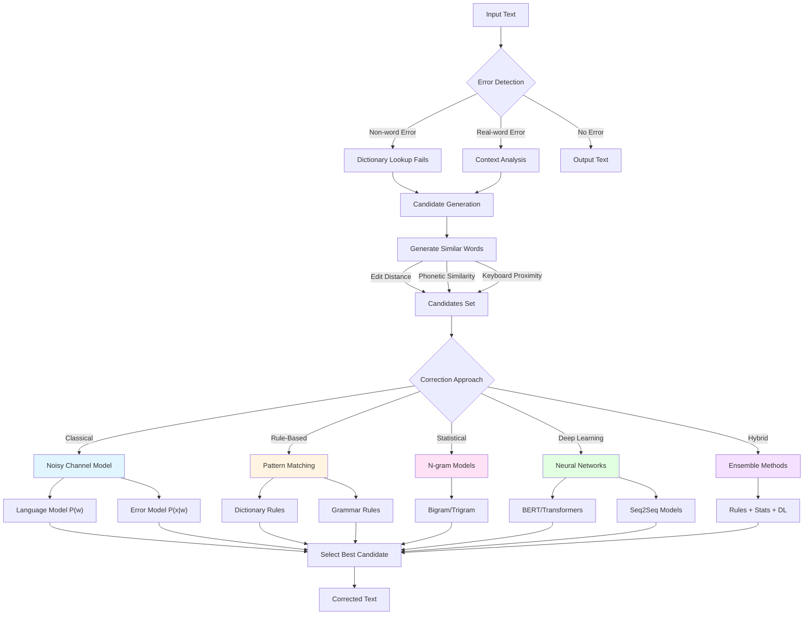

**Correction Approaches** (Covered in this guide):
- **Classical**: Noisy Channel Model (Topic 1)
- **Rule-Based**: Pattern matching and dictionaries (Topic 3.1)
- **Statistical**: N-gram language models (Topics 1.4, 3.2)
- **Deep Learning**: BERT, Transformers, LSTMs (Topic 3.3-3.4)
- **Hybrid**: Combining multiple approaches (Topic 4)

---

## 1.1 Introduction to Spelling Correction

### 1.1.1 Overview

Spelling correction is a fundamental NLP task that aims to identify and correct misspelled words in text. It combines statistical methods, linguistic knowledge, and machine learning to restore intended meaning.

### 1.1.2 Applications

Spelling correction powers numerous real-world applications:

| Application | Platform Examples | Features | Example |
|-------------|-------------------|----------|---------|
| **Word Processing** | Microsoft Word, Google Docs | • Red underlines for errors<br>• Autocorrect (automatic)<br>• Suggestion lists | `teh` → `the` (autocorrect)<br>`recieve` → `receive` (suggestion) |
| **Mobile Phones** | iPhone, Android keyboards | • Real-time autocorrect<br>• Swipe/gesture typing correction<br>• Predictive text | User types: "running layt"<br>Phone shows: "running late" |
| **Web Search** | Google Search, Bing | • "Did you mean...?" suggestions<br>• Automatic query correction<br>• Zero-results fallback | Search: "natural langage processing"<br>Shows: "natural **language** processing" |
| **Text Editors** | VS Code, Sublime Text | • Code comment spell checking<br>• Variable name suggestions<br>• Documentation correction | Detects typos in comments and strings |
| **Email Clients** | Gmail, Outlook | • Compose-time correction<br>• Smart compose integration<br>• Multi-language support | Suggests corrections while composing |
| **Accessibility** | Screen readers, Dyslexia tools | • Assistive writing<br>• Enhanced readability<br>• Custom dictionaries | Helps users with writing difficulties |

### 1.1.3 Types of Spelling Errors

#### Non-word Errors
Errors that result in tokens not found in the dictionary.

**Examples**:
- `graffe` → `giraffe`
- `teh` → `the`
- `recieve` → `receive`

**Characteristics**:
- Easy to detect (dictionary lookup)
- Harder to correct (multiple candidates possible)

#### Real-word Errors
Errors that result in valid dictionary words but incorrect in context.

**Examples**:
- `I want a peace of cake` → `I want a piece of cake`
- `Their coming tomorrow` → `They're coming tomorrow`
- `The book is to heavy` → `The book is too heavy`

**Characteristics**:
- Hard to detect (requires context)
- Requires semantic understanding

---

## 1.2 Non-word Spelling Errors

### 1.2.1 Detection Process

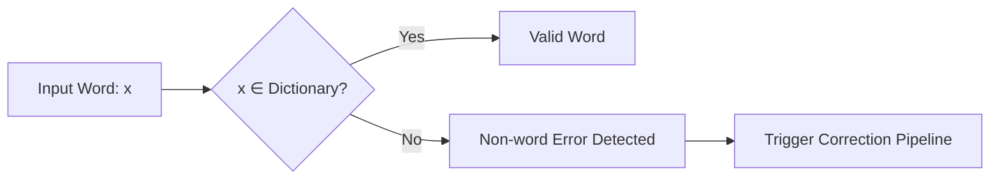

**Algorithm**:
```
function detectNonWordError(word, dictionary):
    if word not in dictionary:
        return TRUE  // Error detected
    return FALSE     // Valid word
```

### 1.2.2 Candidate Generation Methods

#### Method 1: Edit Distance Based

Generate all words within edit distance `d` from the error `x`.

**Common Edit Operations**:
1. **Insertion**: Add a character (`graffe` → `giraffe`)
2. **Deletion**: Remove a character (`giraffe` → `graffe`)
3. **Substitution**: Replace a character (`peace` → `piece`)
4. **Transposition**: Swap adjacent characters (`teh` → `the`)

#### Method 2: Keyboard Proximity

Generate candidates by considering keys physically close on the keyboard.

**Example**: `graffe` might come from `giraffe` if `i` key is adjacent to where user's finger landed.

#### Method 3: Phonetic Similarity

Use phonetic algorithms (Soundex, Metaphone) to find homophones.

**Example**: `nite` → `night`, `thru` → `through`

### 1.2.3 Correction Pipeline

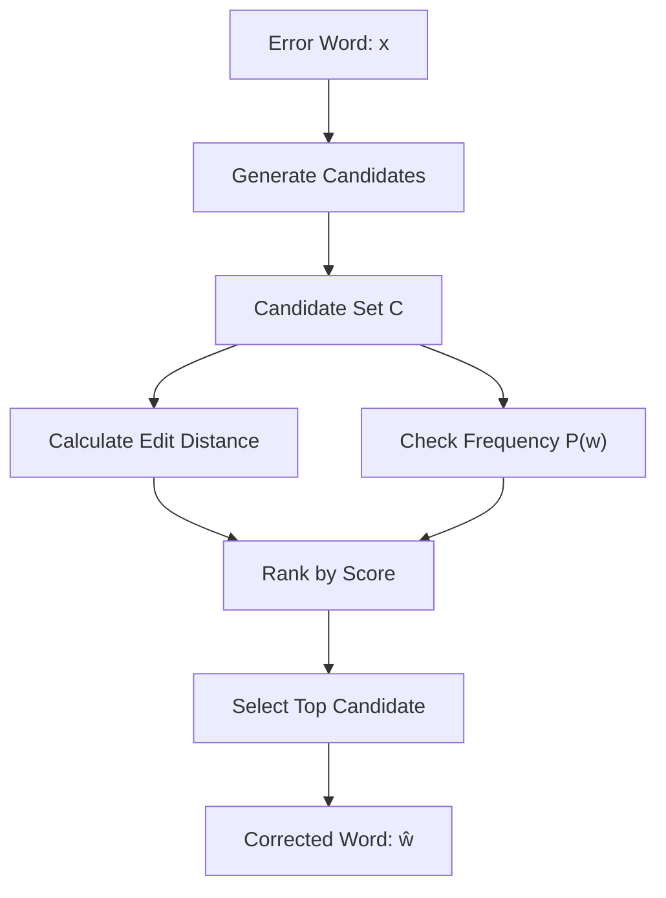

**Ranking Criteria**:
1. Minimum Edit Distance
2. Word Frequency (from corpus)
3. Context Probability (for ambiguous cases)

---

## 1.3 Real-word Spelling Errors

### 1.3.1 Types of Real-word Errors

Real-word errors are syntactically valid but semantically incorrect. They fall into two main categories:

#### 1. Typographical Errors

Errors caused by **physical typing mistakes** that happen to produce valid words.

**Examples**:
- `three` → `there` (finger slips to adjacent key)
- `form` → `from` (transposition)
- `casual` → `causal` (character deletion/insertion)

**Characteristics**:
- Often involve nearby keys on keyboard
- Result from motor control issues
- Usually single-character edits

#### 2. Cognitive Errors

Errors caused by **mental confusion** about the correct word.

**Common Types**:

**a) Homophones** (sound-alike words):
- `piece` ↔ `peace`
- `too` ↔ `to` ↔ `two`
- `their` ↔ `there` ↔ `they're`

**b) Near-homophones**:
- `accept` ↔ `except`
- `affect` ↔ `effect`

**c) Short forms / Slang**:
- `u` for `you`
- `r` for `are`
- `kewl` for `cool`

**Characteristics**:
- Based on pronunciation similarity
- Require contextual understanding
- Cannot be detected by edit distance alone

---

### 1.3.2 Detection Challenges

Real-word errors cannot be detected by dictionary lookup alone.

**Detection Methods**:
- Context-based anomaly detection
- N-gram probability analysis
- Neural language models

**Example**:
```
✗ "I went too the store"
```
Both "too" and "to" are valid words, but only "to" is correct in this context.

---

### 1.3.3 Candidate Generation

For a word `w` in context, generate candidates:

1. **Include Original Word**: `w` itself (might be correct)
2. **Homophones**: Words that sound similar
   - `peace` ↔ `piece`
   - `their` ↔ `there` ↔ `they're`
3. **Similar Spelling**: Words within edit distance 1-2
4. **Common Confusions**: Pre-compiled confusion sets

### 1.3.4 Context-Based Ranking

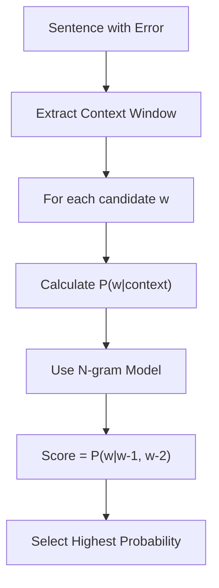

---

## 1.4 N-grams and Language Models

### 1.4.1 N-gram Definitions

An **n-gram** is a contiguous sequence of `n` items (words or characters) from a text.

| N-gram Type | N | Example |
|-------------|---|---------|
| Unigram | 1 | "cat" |
| Bigram | 2 | "black cat" |
| Trigram | 3 | "the black cat" |
| 4-gram | 4 | "I saw the cat" |

### 1.4.2 Bigram Probability Formula

The probability of word $w_n$ given the previous word $w_{n-1}$:

$$P(w_n | w_{n-1}) = \frac{\text{Count}(w_{n-1}, w_n)}{\text{Count}(w_{n-1})}$$

**Interpretation**: Out of all times $w_{n-1}$ appeared, what fraction was it followed by $w_n$?

### 1.4.3 Trigram Probability Formula

$$P(w_n | w_{n-2}, w_{n-1}) = \frac{\text{Count}(w_{n-2}, w_{n-1}, w_n)}{\text{Count}(w_{n-2}, w_{n-1})}$$

### 1.4.4 Sentence Probability

Using the **Chain Rule** and **Markov Assumption** (bigram):

$$P(w_1, w_2, ..., w_n) = \prod_{i=1}^{n} P(w_i | w_{i-1})$$

**Example**: "I eat food"

$$P(\text{I eat food}) = P(\text{I}) \times P(\text{eat}|\text{I}) \times P(\text{food}|\text{eat})$$

### 1.4.5 Numeric Example: Bigram Model

**Corpus**:
```
I eat food
I eat pizza
I like food
You eat food
```

**Counts**:
- Count("I") = 3
- Count("I eat") = 2
- Count("I like") = 1
- Count("eat") = 3
- Count("eat food") = 2
- Count("eat pizza") = 1

**Calculations**:

$$P(\text{eat}|\text{I}) = \frac{\text{Count}(\text{I eat})}{\text{Count}(\text{I})} = \frac{2}{3} = 0.667$$

$$P(\text{food}|\text{eat}) = \frac{\text{Count}(\text{eat food})}{\text{Count}(\text{eat})} = \frac{2}{3} = 0.667$$

$$P(\text{pizza}|\text{eat}) = \frac{\text{Count}(\text{eat pizza})}{\text{Count}(\text{eat})} = \frac{1}{3} = 0.333$$

---

### 1.4.6 Real-World Example: Unigram Prior from COCA

Using the **Corpus of Contemporary American English (COCA)** with **404,253,213 words**:

#### Frequency Data for Words Ending in "-ess/-ress"

| Word | Frequency | $P(w)$ | Relative Frequency |
|------|-----------|---------|-------------------|
| across | 120,844 | 0.0002989314 | ≈ 1 in 3,345 words |
| access | 37,038 | 0.0000916207 | ≈ 1 in 10,915 words |
| acres | 12,874 | 0.0000318463 | ≈ 1 in 31,405 words |
| actress | 9,321 | 0.0000230573 | ≈ 1 in 43,370 words |
| caress | 686 | 0.0000016969 | ≈ 1 in 589,314 words |
| cress | 220 | 0.0000005442 | ≈ 1 in 1,837,515 words |

**Calculation Example**:

For "across":
$$P(\text{across}) = \frac{\text{Count}(\text{across})}{\text{Total Words}} = \frac{120,844}{404,253,213} = 0.0002989314$$

**Key Observations**:

1. **"across" is most common**: It appears ~13 times more frequently than "actress"
2. **"cress" is very rare**: It appears ~549 times less frequently than "across"
3. **Frequency matters**: In the noisy channel model, higher $P(w)$ can compensate for slightly lower $P(x|w)$

#### Visualization of Relative Frequencies

```
across  ████████████████████████████████████████ (120,844)
access  ████████████                              (37,038)
acres   ████                                      (12,874)
actress ███                                        (9,321)
caress  ▌                                            (686)
cress   ▌                                            (220)
```

This distribution is critical for the **prior probability** component of the noisy channel model.

### 1.4.7 Smoothing and Interpolation

In practice, many word sequences don't appear in training data, leading to **zero probabilities**. This is problematic for spelling correction.

#### The Problem: Sparse Data

**Example**:
- Bigram `P("xylophone" | "versatile")` = 0 (never seen in corpus)
- But this doesn't mean it's impossible!

#### Solution: Interpolation

**Combine unigram and bigram models** to handle unseen sequences:

$$P_{\text{interp}}(w_k \mid w_{k-1}) = \lambda \cdot P_{\text{uni}}(w_k) + (1 - \lambda) \cdot P_{\text{bi}}(w_k \mid w_{k-1})$$

Where:
- $\lambda$ = interpolation weight (typically 0.1 to 0.3)
- $P_{\text{uni}}(w_k)$ = unigram probability (always > 0 for known words)
- $P_{\text{bi}}(w_k \mid w_{k-1})$ = bigram probability

**Bigram Probability Formula**:
$$P_{\text{bi}}(w_k \mid w_{k-1}) = \frac{\text{Count}(w_{k-1}, w_k)}{\text{Count}(w_{k-1})}$$

#### Example with Numbers

**Scenario**: Correct "versatile acress" in context

**Given Values**:
- $\lambda = 0.3$ (interpolation weight)
- $P_{\text{uni}}(\text{across}) = 0.0003$ (unigram probability from corpus)
- $P_{\text{bi}}(\text{across} \mid \text{versatile}) = 0$ (bigram never observed)

**Step-by-Step Calculation**:

**Step 1**: Write the interpolation formula
$$P_{\text{interp}}(w_k \mid w_{k-1}) = \lambda \cdot P_{\text{uni}}(w_k) + (1 - \lambda) \cdot P_{\text{bi}}(w_k \mid w_{k-1})$$

**Step 2**: Substitute the given values
$$P_{\text{interp}}(\text{across} \mid \text{versatile}) = \lambda \cdot P_{\text{uni}}(\text{across}) + (1 - \lambda) \cdot P_{\text{bi}}(\text{across} \mid \text{versatile})$$
$$= 0.3 \times 0.0003 + (1 - 0.3) \times 0$$

**Step 3**: Calculate $(1 - \lambda)$
$$1 - \lambda = 1 - 0.3 = 0.7$$

**Step 4**: Calculate the unigram component
$$\lambda \times P_{\text{uni}}(\text{across}) = 0.3 \times 0.0003 = 0.00009$$

**Step 5**: Calculate the bigram component
$$(1 - \lambda) \times P_{\text{bi}}(\text{across} \mid \text{versatile}) = 0.7 \times 0 = 0$$

**Step 6**: Add the components
$$P_{\text{interp}} = 0.00009 + 0 = 0.00009$$

**Result**:
$$P_{\text{interp}}(\text{across} \mid \text{versatile}) = 0.00009 = 9 \times 10^{-5}$$

**Comparison**:

| Method | Probability | Result |
|--------|-------------|--------|
| Without interpolation | 0 | ❌ Eliminates valid candidate |
| With interpolation | 0.00009 | ✓ Small but non-zero |

**Full Comparison for Candidates**:

Let's also calculate for "actress":

**For actress**:
- $P_{\text{uni}}(\text{actress}) = 0.00002306$
- $P_{\text{bi}}(\text{actress} \mid \text{versatile}) = 0.000021$ (observed in corpus!)
- $\lambda = 0.3$

$$P_{\text{interp}}(\text{actress} \mid \text{versatile}) = 0.3 \times 0.00002306 + 0.7 \times 0.000021$$
$$= 0.000006918 + 0.0000147$$
$$= 0.000021618$$

| Candidate | Without Interpolation | With Interpolation |
|-----------|----------------------|-------------------|
| actress | $P = 0.000021$ | $P = 0.000021618$ |
| across | $P = 0$ ❌ | $P = 0.00009$ ✓ |

**Key Insight**: Interpolation prevents zero probabilities while still favoring observed bigrams!

#### Why This Matters

1. **Avoids zero probabilities**: Every known word gets some probability
2. **Balances specificity and generality**:
   - Bigram: Specific context (when available)
   - Unigram: General word frequency (fallback)
3. **Essential for real-word correction**: Context words may be uncommon

**Practical Values**:
- High $\lambda$ (e.g., 0.9): Trust unigrams more (safer, less context-sensitive)
- Low $\lambda$ (e.g., 0.1): Trust bigrams more (aggressive, more context-sensitive)
- Typical: $\lambda \approx 0.3$ (balanced)

---

## 1.5 The Noisy Channel Model

### 1.5.1 Conceptual Framework

The **Noisy Channel Model** assumes:
- User intended to write correct word `w`
- The "channel" (typing process) introduced noise
- Observed error is `x`
- Goal: Recover original `w` from observed `x`

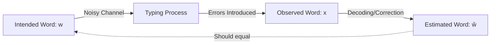

### 1.5.2 Mathematical Formulation

**Goal**: Find the most likely intended word $\hat{w}$ given observed error $x$:

$$\hat{w} = \underset{w \in V}{\text{argmax}} \; P(w | x)$$

Where $V$ is the vocabulary (dictionary).

### 1.5.3 Bayes' Rule Application

Using Bayes' Theorem:

$$P(w | x) = \frac{P(x | w) \cdot P(w)}{P(x)}$$

Since $P(x)$ is constant for all candidate words, we can ignore it:

$$\hat{w} = \underset{w \in V}{\text{argmax}} \; P(x | w) \cdot P(w)$$

### 1.5.4 Model Components

#### Prior Probability: $P(w)$

**Language Model** - How likely is word `w` in general?

**Estimation**:
$$P(w) = \frac{\text{Count}(w)}{\sum_{w' \in V} \text{Count}(w')}$$

**Source**: Large text corpus (e.g., Wikipedia, books, web text)

**Intuition**: Common words like "the" have higher $P(w)$ than rare words like "xylophone"

#### Likelihood: $P(x \mid w)$

**Error Model** - If user intended `w`, how likely would they type `x`?

**Factors**:
- Edit distance between `w` and `x`
- Type of error (insertion, deletion, substitution, transposition)
- Keyboard layout (adjacent keys more likely to be confused)
- Phonetic similarity

**Estimation Methods**:

1. **Uniform Distribution** (Simple):
   $$P(x \mid w) = \frac{1}{\text{edit\_distance}(x, w) + 1}$$

2. **Confusion Matrix** (Data-driven):
   - Collect real typing errors
   - Count how often character `a` is mistyped as `b`
   - Build probability table $P(\text{typed: } a \mid \text{intended: } b)$

3. **Keyboard-aware**:
   - Higher probability for adjacent key errors
   - Lower probability for distant key errors

### 1.5.5 Decision Process

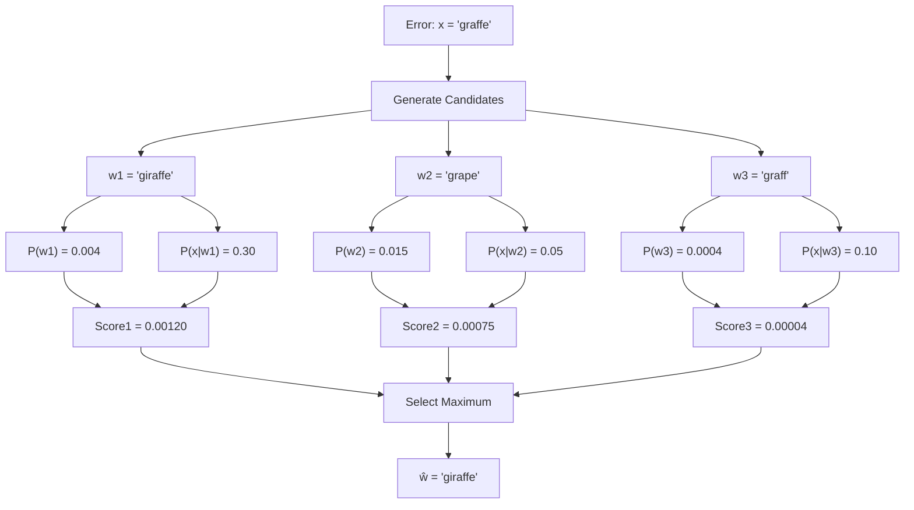

---

## 1.6 Edit Distance Algorithms

### 1.6.1 Levenshtein Distance

The **minimum number of single-character edits** required to transform one string into another.

**Operations**:
1. Insert a character (cost = 1)
2. Delete a character (cost = 1)
3. Substitute a character (cost = 1)

**Formula** (Dynamic Programming):

Let $x = x_1x_2...x_m$ and $w = w_1w_2...w_n$

$$D[i, j] = \min \begin{cases}
D[i-1, j] + 1 & \text{(deletion)} \\
D[i, j-1] + 1 & \text{(insertion)} \\
D[i-1, j-1] + \delta(x_i, w_j) & \text{(substitution)}
\end{cases}$$

Where:
$$\delta(x_i, w_j) = \begin{cases}
0 & \text{if } x_i = w_j \\
1 & \text{if } x_i \neq w_j
\end{cases}$$

**Base Cases**:
- $D[0, j] = j$ (insert $j$ characters)
- $D[i, 0] = i$ (delete $i$ characters)

### 1.6.2 Levenshtein Distance Example

**Calculate**: Distance from `"graffe"` to `"giraffe"`

**Strings**:
- Source: `graffe` (length 6)
- Target: `giraffe` (length 7)

**Complete Step-by-Step Matrix Construction**:

**Step 1: Initialize** the matrix with base cases
- First row: distance from empty string to target prefixes: [0, 1, 2, 3, 4, 5, 6, 7]
- First column: distance from source prefixes to empty string: [0, 1, 2, 3, 4, 5, 6]

**Step 2: Fill the matrix** using the recurrence relation:

For each cell `(i, j)`:
$$\text{dist}[i][j] = \min \begin{cases}
\text{dist}[i-1][j] + 1 & \text{(deletion)} \\
\text{dist}[i][j-1] + 1 & \text{(insertion)} \\
\text{dist}[i-1][j-1] + \text{cost} & \text{(substitution, cost=0 if match, 1 if different)}
\end{cases}$$

**Detailed Matrix with Calculations**:

|   |   | g | i | r | a | f | f | e |
|---|---|---|---|---|---|---|---|---|
|   | **0** | **1** | **2** | **3** | **4** | **5** | **6** | **7** |
| **g** | **1** | 0 | 1 | 2 | 3 | 4 | 5 | 6 |
| **r** | **2** | 1 | 1 | 1 | 2 | 3 | 4 | 5 |
| **a** | **3** | 2 | 2 | 2 | 1 | 2 | 3 | 4 |
| **f** | **4** | 3 | 3 | 3 | 2 | 1 | 2 | 3 |
| **f** | **5** | 4 | 4 | 4 | 3 | 2 | 1 | 2 |
| **e** | **6** | 5 | 5 | 5 | 4 | 3 | 2 | **1** |

**Key Cell Calculations** (showing the logic):

**Cell (1, 1): g vs g**
- From (0,0) + 0 = 0 (match, no substitution)
- From (0,1) + 1 = 2 (delete from source)
- From (1,0) + 1 = 2 (insert to source)
- **min(0, 2, 2) = 0** ✓

**Cell (1, 2): g vs gi**
- From (0,1) + 0 = 1 (g matches, but need to handle 'i')
- From (0,2) + 1 = 3 (delete 'g')
- From (1,1) + 1 = 1 (insert 'i')
- **min(1, 3, 1) = 1** ✓

**Cell (2, 2): gr vs gi**
- From (1,1) + 1 = 1 (substitute r→i)
- From (1,2) + 1 = 2 (delete 'r')
- From (2,1) + 1 = 2 (insert 'i')
- **min(1, 2, 2) = 1** ✓

**Cell (2, 3): gr vs gir**
- From (1,2) + 0 = 1 (r matches r)
- From (1,3) + 1 = 3 (delete 'r')
- From (2,2) + 1 = 2 (insert 'r')
- **min(1, 3, 2) = 1** ✓

**Cell (6, 7): graffe vs giraffe**
- From (5,6) + 0 = 1 (e matches e)
- From (5,7) + 1 = 3 (delete 'e')
- From (6,6) + 1 = 3 (insert 'e')
- **min(1, 3, 3) = 1** ✓

**Result**: Edit Distance = **1**

**Optimal Alignment** (tracing back):
```
g i r a f f e  (target)
| × | | | | |
g - r a f f e  (source)
```

**Edit Operation**: Insert 'i' at position 2 (after 'g')

**Step 3: Verification**
- Start: `graffe`
- Insert 'i' at position 2: `giraffe` ✓
- Operations: 1
- Distance: **1** ✓

### 1.6.3 Damerau-Levenshtein Distance

Extends Levenshtein by adding **transposition** of adjacent characters.

**Additional Operation**:
- Transpose two adjacent characters (cost = 1)

**Example**: `"teh"` → `"the"` has distance 1 (transpose 'e' and 'h')

### 1.6.4 Weighted Edit Distance

Assign different costs to different operations based on:
- **Keyboard proximity**: Adjacent keys have lower substitution cost
- **Character frequency**: Common substitutions have lower cost
- **Phonetic similarity**: Similar-sounding letters have lower cost

**Example Cost Matrix** (Keyboard-based):

| Operation | Cost |
|-----------|------|
| Insert/Delete | 1.0 |
| Substitute (adjacent keys) | 0.5 |
| Substitute (same hand) | 0.8 |
| Substitute (different hands) | 1.0 |
| Transpose | 0.7 |

**Example**: `"graffe"` → `"grape"`
- Delete 'f': cost 1.0
- Substitute 'f' → 'p': cost 1.0 (different hands)
- Total: 2.0

---

## 1.7 Comprehensive Numeric Examples

### 1.7.1 Non-word Error: Complete Solution

**Problem**: Correct the misspelling `"acress"`

This example uses real data from the **Corpus of Contemporary American English (COCA)** with 404,253,213 words.

#### Step 1: Candidate Generation

Using edit distance ≤ 2 from dictionary:

| Candidate | Edit Distance | Operations |
|-----------|---------------|------------|
| actress | 1 | Delete 'c', Insert 't' |
| cress | 1 | Delete 'a' at start |
| caress | 1 | Insert 'a' after 'c' |
| access | 1 | Insert 'c', Delete 'r' |
| across | 1 | Delete 'e', Insert 'o' |
| acres | 1 | Delete 's' |

**Selected Candidates**: `{actress, cress, caress, access, across, acres}`

#### Step 2: Prior Probability $P(w)$ - Language Model

From **COCA Corpus** (404,253,213 words):

| Candidate $w$ | Frequency | $P(w)$ |
|---------------|-----------|---------|
| actress | 9,321 | 0.0000230573 |
| cress | 220 | 0.0000005442 |
| caress | 686 | 0.0000016969 |
| access | 37,038 | 0.0000916207 |
| across | 120,844 | 0.0002989314 |
| acres | 12,874 | 0.0000318463 |

**Calculation Example**:
$$P(\text{actress}) = \frac{9321}{404253213} = 0.0000230573$$

$$P(\text{across}) = \frac{120844}{404253213} = 0.0002989314$$

#### Step 3: Likelihood $P(x|w)$ - Error Model

The error model represents how likely each transformation is based on character-level confusion matrices:

| Candidate | Correct Letter | Error Letter | Context x\|w | $P(x \mid w)$ |
|-----------|----------------|--------------|--------------|---------------|
| actress | t | - | c\|ct | 0.000117 |
| cress | - | a | a\|# | 0.0000144 |
| caress | ca | ac | ac\|ca | 0.0000164 |
| access | c | r | r\|c | 0.0000209 |
| across | o | e | e\|o | 0.000093 |
| acres | - | s | es\|e | 0.000321 |
| acres | - | s | ss\|s | 0.000342 |

**Notation**:
- `x|w` means "error character x given correct character w"
- `#` represents word boundary
- `-` means deletion/insertion

#### Step 4: Posterior Calculation - Noisy Channel Model

**Formula**:
$$\hat{w} = \underset{w}{\text{argmax}} \; P(x \mid w) \times P(w)$$

We multiply by $10^9$ for readability (doesn't affect the argmax).

**Complete Step-by-Step Calculation for Each Candidate**:

---

**Candidate 1: actress**

**Step 1**: Identify the probabilities
- Error model: $P(\text{acress} \mid \text{actress}) = 0.000117$
- Language model: $P(\text{actress}) = 0.0000230573$

**Step 2**: Multiply the probabilities
$$P(x \mid w) \times P(w) = 0.000117 \times 0.0000230573$$

**Step 3**: Calculate
$$= 0.00000000269770041$$
$$= 2.69770041 \times 10^{-9}$$

**Step 4**: Scale by $10^9$
$$\text{Score} = 2.69770041 \times 10^{-9} \times 10^9 = 2.70$$

---

**Candidate 2: across** ⭐

**Step 1**: Identify the probabilities
- Error model: $P(\text{acress} \mid \text{across}) = 0.000093$
- Language model: $P(\text{across}) = 0.0002989314$

**Step 2**: Multiply the probabilities
$$P(x \mid w) \times P(w) = 0.000093 \times 0.0002989314$$

**Step 3**: Calculate
$$= 0.00000002780062$$
$$= 2.780062 \times 10^{-8}$$

**Step 4**: Scale by $10^9$
$$\text{Score} = 2.780062 \times 10^{-8} \times 10^9 = 27.80$$

---

**Candidate 3: cress**

**Step 1**: Identify the probabilities
- $P(\text{acress} \mid \text{cress}) = 0.0000144$
- $P(\text{cress}) = 0.0000005442$

**Step 2**: Multiply
$$0.0000144 \times 0.0000005442 = 7.83648 \times 10^{-12}$$

**Step 3**: Scale by $10^9$
$$\text{Score} = 7.83648 \times 10^{-12} \times 10^9 = 0.00784$$

---

**Candidate 4: caress**

**Step 1**: Identify the probabilities
- $P(\text{acress} \mid \text{caress}) = 0.0000164$
- $P(\text{caress}) = 0.0000016969$

**Step 2**: Multiply
$$0.0000164 \times 0.0000016969 = 2.782916 \times 10^{-11}$$

**Step 3**: Scale by $10^9$
$$\text{Score} = 2.782916 \times 10^{-11} \times 10^9 = 0.0278$$

---

**Candidate 5: access**

**Step 1**: Identify the probabilities
- $P(\text{acress} \mid \text{access}) = 0.0000209$
- $P(\text{access}) = 0.0000916207$

**Step 2**: Multiply
$$0.0000209 \times 0.0000916207 = 1.9148729 \times 10^{-9}$$

**Step 3**: Scale by $10^9$
$$\text{Score} = 1.9148729 \times 10^{-9} \times 10^9 = 1.91$$

---

**Candidate 6a: acres (deletion es|e)**

**Step 1**: Identify the probabilities
- $P(\text{acress} \mid \text{acres}) = 0.000321$ (inserting 's' before 's')
- $P(\text{acres}) = 0.0000318463$

**Step 2**: Multiply
$$0.000321 \times 0.0000318463 = 1.0222682 \times 10^{-8}$$

**Step 3**: Scale by $10^9$
$$\text{Score} = 1.0222682 \times 10^{-8} \times 10^9 = 10.22$$

---

**Candidate 6b: acres (deletion ss|s)**

**Step 1**: Identify the probabilities
- $P(\text{acress} \mid \text{acres}) = 0.000342$
- $P(\text{acres}) = 0.0000318463$

**Step 2**: Multiply
$$0.000342 \times 0.0000318463 = 1.0891434 \times 10^{-8}$$

**Step 3**: Scale by $10^9$
$$\text{Score} = 1.0891434 \times 10^{-8} \times 10^9 = 10.89$$

---

**Summary Table**:

| Candidate | $P(x \mid w)$ | $P(w)$ | $P(x \mid w) \times P(w)$ | Score $\times 10^9$ |
|-----------|---------------|---------|---------------------------|---------------------|
| actress | 0.000117 | 0.0000230573 | $2.70 \times 10^{-9}$ | 2.70 |
| cress | 0.0000144 | 0.0000005442 | $7.84 \times 10^{-12}$ | 0.0078 |
| caress | 0.0000164 | 0.0000016969 | $2.78 \times 10^{-11}$ | 0.028 |
| access | 0.0000209 | 0.0000916207 | $1.91 \times 10^{-9}$ | 1.91 |
| **across** | **0.000093** | **0.0002989314** | **$2.78 \times 10^{-8}$** | **27.80** ⭐ |
| acres (es\|e) | 0.000321 | 0.0000318463 | $1.02 \times 10^{-8}$ | 10.22 |
| acres (ss\|s) | 0.000342 | 0.0000318463 | $1.09 \times 10^{-8}$ | 10.89 |

#### Step 5: Decision

**Apply argmax**:
$$\hat{w} = \underset{w}{\text{argmax}} \; \text{Score}(w)$$

**Comparing all scores**:
- actress: 2.7
- cress: 0.0078
- caress: 0.028
- access: 1.9
- across: **27.8** ← MAXIMUM
- acres (es|e): 10.2
- acres (ss|s): 10.9

$$\hat{w} = \text{argmax}\{2.7, 0.0078, 0.028, 1.9, 27.8, 10.2, 10.9\}$$
$$= \text{across}$$

**Answer**: `"across"` with confidence score **27.8**

**Runner-up**: `"acres (ss|s)"` with score **10.9**

#### Key Insight

Even though "actress" has a reasonable error probability (deleting 't' is common), **"across"** wins because:
1. It has a much higher prior probability $P(w)$ (appears 120,844 times vs 9,321 times)
2. The error transformation (e→o substitution) is also reasonably likely
3. The combined score favors the more common word

---

### 1.7.2 Real-word Error: Complete Solution (Bigram Context)

**Problem**: Determine the correct word in context using bigram probabilities

**Sentence Context**: `"...a stellar and versatile ??? whose combination of sass and glamour..."`

**Candidates**: `{actress, across}` (both valid words!)

This example uses real bigram data from the **Corpus of Contemporary American English** with add-1 smoothing.

#### Step 1: Extract Context

Using **bigram model**:
- Previous word: `"versatile"`
- Target word candidates: `{actress, across}`
- Next word: `"whose"`

#### Step 2: Collect Bigram Statistics from Corpus

**Left Context Bigrams**:

| Bigram | Probability |
|--------|-------------|
| P(actress\|versatile) | 0.000021 |
| P(across\|versatile) | 0.000021 |

**Right Context Bigrams**:

| Bigram | Probability |
|--------|-------------|
| P(whose\|actress) | 0.0010 |
| P(whose\|across) | 0.000006 |

#### Step 3: Calculate Sentence Probabilities

Using the **bigram chain rule**:

$$P(\text{sequence}) = P(w_i | w_{i-1}) \times P(w_{i+1} | w_i)$$

---

**For "versatile actress whose":**

**Step 1**: Identify the bigrams
- Left bigram: P(actress | versatile) = 0.000021
- Right bigram: P(whose | actress) = 0.0010

**Step 2**: Apply the chain rule
$$P(\text{actress sequence}) = P(\text{actress}|\text{versatile}) \times P(\text{whose}|\text{actress})$$

**Step 3**: Substitute values
$$= 0.000021 \times 0.0010$$

**Step 4**: Multiply
$$= 0.000000021$$
$$= 2.1 \times 10^{-8}$$

**Step 5**: Express in normalized form (for comparison)
$$= 21000 \times 10^{-12}$$

---

**For "versatile across whose":**

**Step 1**: Identify the bigrams
- Left bigram: P(across | versatile) = 0.000021
- Right bigram: P(whose | across) = 0.000006

**Step 2**: Apply the chain rule
$$P(\text{across sequence}) = P(\text{across}|\text{versatile}) \times P(\text{whose}|\text{across})$$

**Step 3**: Substitute values
$$= 0.000021 \times 0.000006$$

**Step 4**: Multiply step-by-step
$$= 21 \times 10^{-6} \times 6 \times 10^{-6}$$
$$= (21 \times 6) \times 10^{-12}$$
$$= 126 \times 10^{-12}$$
$$= 1.26 \times 10^{-10}$$

---

**Summary of Calculations**:

| Sequence | Left Bigram | Right Bigram | Calculation | Final Probability |
|----------|-------------|--------------|-------------|-------------------|
| versatile **actress** whose | 0.000021 | 0.0010 | $0.000021 \times 0.0010$ | $2.1 \times 10^{-8}$ |
| versatile **across** whose | 0.000021 | 0.000006 | $0.000021 \times 0.000006$ | $1.26 \times 10^{-10}$ |

#### Step 4: Compare Probabilities

**Comparison Table**:

| Candidate Sequence | Probability | Scientific Notation | Normalized |
|-------------------|-------------|---------------------|------------|
| "versatile **actress** whose" | 0.000000021 | $2.1 \times 10^{-8}$ | $21000 \times 10^{-12}$ |
| "versatile **across** whose" | 0.000000000126 | $1.26 \times 10^{-10}$ | $126 \times 10^{-12}$ |

**Step-by-Step Ratio Calculation**:

**Step 1**: Set up the ratio
$$\text{Ratio} = \frac{P(\text{actress sequence})}{P(\text{across sequence})}$$

**Step 2**: Substitute probabilities
$$= \frac{2.1 \times 10^{-8}}{1.26 \times 10^{-10}}$$

**Step 3**: Separate the division
$$= \frac{2.1}{1.26} \times \frac{10^{-8}}{10^{-10}}$$

**Step 4**: Calculate each part
$$= 1.6667 \times 10^{2}$$

**Step 5**: Simplify
$$= 166.67$$

Alternatively, using normalized form:
$$\frac{21000 \times 10^{-12}}{126 \times 10^{-12}} = \frac{21000}{126} = 166.67$$

**Result**: The "actress" sequence is approximately **167 times more likely** than "across"!

#### Step 5: Decision

$$\hat{w} = \underset{w}{\text{argmax}} \{2.1 \times 10^{-8}, 1.26 \times 10^{-10}\} = \text{actress}$$

**Answer**: `"actress"` is the correct word

**Corrected Sentence**: `"a stellar and versatile actress whose combination of sass and glamour..."`

#### Key Insights

1. **Left Context is Equal**: Both "actress" and "across" have the same probability after "versatile" (0.000021)
2. **Right Context Decides**: The bigram "whose|actress" (0.0010) is much more probable than "whose|across" (0.000006)
3. **Semantic Coherence**: "actress whose [attributes]" is a common pattern in English, while "across whose" is grammatically awkward
4. **Bigram Power**: Even with equal prior context, the next-word probability provides strong discrimination

#### Detailed Breakdown

**Why is P(whose|actress) >> P(whose|across)?**

- "actress whose" appears in constructions like:
  - "an actress whose performance..."
  - "the actress whose role..."
  - "a versatile actress whose talent..."

- "across whose" rarely appears because "across" is typically a preposition requiring a different syntactic structure:
  - "walked across the..." (not followed by "whose")
  - "spread across multiple..." (not followed by "whose")

This demonstrates how **syntactic and semantic patterns** encoded in bigram statistics help resolve real-word spelling errors.

---

### 1.7.3 Complete Channel Model: "acress" Example

This section provides the **complete noisy channel analysis** for correcting `"acress"` using real corpus data.

#### Full Data Table: Channel Model for "acress"

| Candidate | Correct | Error | x\|w | $P(x \mid w)$ | $P(w)$ | $10^9 \times P(x \mid w) \times P(w)$ |
|-----------|---------|-------|------|---------------|---------|---------------------------------------|
| **actress** | t | - | c\|ct | 0.000117 | 0.0000231 | **2.7** |
| cress | - | a | a\|# | 0.0000144 | 0.000000544 | 0.0078 |
| caress | ca | ac | ac\|ca | 0.0000164 | 0.0000017 | 0.028 |
| access | c | r | r\|c | 0.0000209 | 0.0000916 | 0.019 |
| **across** | o | e | e\|o | 0.000093 | 0.000299 | **2.8** |
| acres | - | s | es\|e | 0.000321 | 0.0000318 | 1.0 |
| acres | - | s | ss\|s | 0.000342 | 0.0000318 | 1.1 |

#### Understanding the Columns

1. **Candidate Correction**: The dictionary word being considered
2. **Correct Letter**: The character(s) that should appear in the correct word
3. **Error Letter**: The character(s) that appeared in the misspelling
4. **x\|w Context**: The character context for the error
   - Format: `error_char | correct_char`
   - `#` represents word boundary
   - `-` represents insertion/deletion
5. **P(x\|w)**: Likelihood of this specific character error
6. **P(w)**: Prior probability of the word (from corpus frequency)
7. **Combined Score**: $P(x \mid w) \times P(w)$

#### Interpreting Character Error Contexts

**Example 1: actress (c|ct)**
- Correct sequence: "ct" (as in "actress")
- Error: typed "c" (missing the 't')
- This represents: deleting 't' after 'c'
- Probability: 0.000117 (relatively likely deletion)

**Example 2: cress (a|#)**
- Correct: word starts immediately (boundary '#')
- Error: typed 'a' at the beginning
- This represents: incorrectly adding 'a' at word start
- Probability: 0.0000144 (unlikely insertion)

**Example 3: across (e|o)**
- Correct: 'o' (as in "across")
- Error: typed 'e' instead
- This represents: substituting 'o' with 'e'
- Probability: 0.000093 (moderately likely substitution)

#### Why "across" Wins

Despite "actress" having a similar combined score (2.7 vs 2.8):

1. **Higher Prior**: "across" appears 120,844 times vs 9,321 for "actress"
2. **Reasonable Error**: The e→o substitution is common enough
3. **Frequency Dominates**: The 13× difference in word frequency nearly offsets the slightly lower error probability

#### Alternative: Using Only Edit Distance

If we used **unweighted edit distance** without the noisy channel:

| Candidate | Edit Distance |
|-----------|---------------|
| actress | 1 |
| cress | 1 |
| caress | 1 |
| access | 1 |
| across | 1 |
| acres | 1 |

All candidates have edit distance 1 - **no discrimination**!

This demonstrates why the **Noisy Channel Model** with proper error probabilities $P(x|w)$ and language model $P(w)$ is essential for effective spelling correction.

---

### 1.7.4 Weighted Edit Distance: Keyboard-Aware Example

**Problem**: Calculate weighted edit distance from `"graffe"` to candidates, considering keyboard proximity

#### Keyboard Layout (QWERTY - simplified)

```
Row 1: Q W E R T Y U I O P
Row 2:  A S D F G H J K L
Row 3:   Z X C V B N M
```

#### Cost Function

| Operation | Cost | Rationale |
|-----------|------|-----------|
| Insert/Delete | 1.0 | Standard operation |
| Substitute (adjacent keys) | 0.5 | High confusion (e.g., F↔G) |
| Substitute (same row, not adjacent) | 0.8 | Moderate confusion (e.g., F↔H) |
| Substitute (different row) | 1.0 | Low confusion (e.g., F↔P) |

---

#### Calculation 1: `"graffe"` → `"giraffe"`

**Step 1**: Align the strings
```
Source:  g r a f f e
Target:  g i r a f f e
Match:   ✓ ✗ ✗ ✗ ✓ ✓ ✓
```

**Step 2**: Identify operations
| Position | Source | Target | Operation | Cost |
|----------|--------|--------|-----------|------|
| 1 | g | g | Match | 0 |
| 2 | - | i | Insert 'i' | 1.0 |
| 3 | r | r | Match (shifted) | 0 |
| 4 | a | a | Match | 0 |
| 5 | f | f | Match | 0 |
| 6 | f | f | Match | 0 |
| 7 | e | e | Match | 0 |

**Step 3**: Sum the costs
$$\text{Total Cost} = 0 + 1.0 + 0 + 0 + 0 + 0 + 0 = 1.0$$

**Weighted Edit Distance**: **1.0**

---

#### Calculation 2: `"graffe"` → `"grape"`

**Step 1**: Align the strings
```
Source:  g r a f f e
Target:  g r a p - e
Match:   ✓ ✓ ✓ ✗ ✗ ✓
```

**Step 2**: Identify operations
| Position | Source | Target | Operation | Cost Calculation |
|----------|--------|--------|-----------|------------------|
| 1 | g | g | Match | 0 |
| 2 | r | r | Match | 0 |
| 3 | a | a | Match | 0 |
| 4 | f | p | Substitute F→P | ? |
| 5 | f | - | Delete 'f' | 1.0 |
| 6 | e | e | Match | 0 |

**Step 3**: Calculate substitution cost (F→P)
- F is in Row 2, position 4
- P is in Row 1, position 10
- **Different rows** → Cost = 1.0

**Step 4**: Sum the costs
$$\text{Total Cost} = 0 + 0 + 0 + 1.0 + 1.0 + 0 = 2.0$$

**Weighted Edit Distance**: **2.0**

---

#### Calculation 3: `"graffe"` → `"gaffe"`

**Step 1**: Align the strings
```
Source:  g r a f f e
Target:  g - a f f e
Match:   ✓ ✗ ✓ ✓ ✓ ✓
```

**Step 2**: Identify operations
| Position | Source | Target | Operation | Cost |
|----------|--------|--------|-----------|------|
| 1 | g | g | Match | 0 |
| 2 | r | - | Delete 'r' | 1.0 |
| 3 | a | a | Match | 0 |
| 4 | f | f | Match | 0 |
| 5 | f | f | Match | 0 |
| 6 | e | e | Match | 0 |

**Step 3**: Sum the costs
$$\text{Total Cost} = 0 + 1.0 + 0 + 0 + 0 + 0 = 1.0$$

**Weighted Edit Distance**: **1.0**

---

#### Calculation 4: `"graffe"` → `"giraffe"` (Detailed Dynamic Programming)

**Full DP Table** (for illustration):

|   | ε | g | i | r | a | f | f | e |
|---|---|---|---|---|---|---|---|---|
| **ε** | 0 | 1 | 2 | 3 | 4 | 5 | 6 | 7 |
| **g** | 1 | 0 | 1 | 2 | 3 | 4 | 5 | 6 |
| **r** | 2 | 1 | 1 | 1 | 2 | 3 | 4 | 5 |
| **a** | 3 | 2 | 2 | 2 | 1 | 2 | 3 | 4 |
| **f** | 4 | 3 | 3 | 3 | 2 | 1 | 2 | 3 |
| **f** | 5 | 4 | 4 | 4 | 3 | 2 | 1 | 2 |
| **e** | 6 | 5 | 5 | 5 | 4 | 3 | 2 | **1** |

**Reading the table**:
- Cell (6,7) = **1** is the final weighted edit distance
- Path shows: Insert 'i' after 'g' (cost 1.0)

---

#### Final Ranking by Weighted Edit Distance

| Candidate | Weighted Distance | Calculation Details |
|-----------|-------------------|---------------------|
| **giraffe** | **1.0** | Insert 'i' (1.0) |
| **gaffe** | **1.0** | Delete 'r' (1.0) |
| grape | 2.0 | Substitute F→P (1.0) + Delete 'f' (1.0) |

**Tie-breaker** (when distances are equal): Use $P(w)$ from language model

From corpus frequency:
- $P(\text{giraffe}) = \frac{1620}{404253213} = 0.000004006$
- $P(\text{gaffe}) = \frac{162}{404253213} = 0.0000004006$

**Step-by-step tie-breaking**:
$$\frac{P(\text{giraffe})}{P(\text{gaffe})} = \frac{0.000004006}{0.0000004006} = 10$$

**Result**: "giraffe" is 10× more frequent

**Final Winner**: `"giraffe"` ✓

---

## 1.8 Advanced Topics

### 1.8.1 Context-Sensitive Spelling Correction

For real-word errors, use **trigram models** or **neural language models**.

**Trigram Model**:
$$P(w_i | w_{i-2}, w_{i-1}) = \frac{\text{Count}(w_{i-2}, w_{i-1}, w_i)}{\text{Count}(w_{i-2}, w_{i-1})}$$

**Example**: `"I want to ??? piece of cake"`

Compare:
- $P(\text{eat} | \text{want to})$
- $P(\text{see} | \text{want to})$

### 1.8.2 Phonetic Algorithms

#### Soundex Algorithm

Converts words to phonetic codes.

**Rules**:
1. Keep first letter
2. Remove vowels (except first letter)
3. Map consonants to digits:
   - B,F,P,V → 1
   - C,G,J,K,Q,S,X,Z → 2
   - D,T → 3
   - L → 4
   - M,N → 5
   - R → 6

**Example**:
- `"night"` → N230
- `"knight"` → K523
- `"nite"` → N300

**Usage**: Find homophones or phonetically similar words

### 1.8.3 Neural Approaches

#### Character-Level RNN/LSTM

**Architecture**:
```
Input: Misspelled character sequence
Output: Corrected character sequence
```

**Advantages**:
- Learns patterns from data
- Handles novel errors
- Context-aware

#### Transformer-Based Models

**Examples**: BERT, GPT for spell correction

**Method**:
1. Mask the suspected error
2. Use model to predict correct word
3. Replace if confidence > threshold

---

### 1.8.4 Open Source Spellcheck Tools - Comparison

#### Tool Comparison by Features

| Tool | Type | Primary Use | Context-Aware? | Speed | Best For |
|------|------|-------------|----------------|-------|----------|
| **LanguageTool** | Hybrid (Rules + ML) | Full Grammar & Style API | Yes (statistical) | Medium | Production apps |
| **Hunspell** | Engine/Library | Fast, accurate spellchecking | No | Very Fast | Text editors |
| **SymSpell** | Library | Extreme speed (search) | No | Fastest | Real-time apps |
| **pyspellchecker** | Library (Statistical) | Simple Python spellcheck | No | Fast | Learning, prototypes |
| **textblob** | NLP Library | Multi-feature NLP | No | Medium | NLP projects |

#### Algorithm Comparison

| Tool | Algorithm | Edit Distance | Language Model |
|------|-----------|---------------|----------------|
| pyspellchecker | Noisy Channel | ≤ 2 | Unigram frequency |
| SymSpell | Symmetric Delete | Configurable | Frequency-based |
| LanguageTool | Rules + N-grams | Variable | Trigram+ |
| Hunspell | Dictionary + Affixes | Variable | None |
| textblob | Noisy Channel | ≤ 2 | Unigram frequency |

**Key Insights**:
- **For Production**: LanguageTool (comprehensive checking)
- **For Speed**: SymSpell (real-time applications)
- **For Editors**: Hunspell (industry standard)
- **For Learning**: pyspellchecker (simple, educational)
- **For NLP Projects**: textblob (multiple features)

---

### 1.8.5 Evaluation Metrics

#### Accuracy

$$\text{Accuracy} = \frac{\text{Number of Correct Corrections}}{\text{Total Number of Errors}}$$

#### Precision and Recall

$$\text{Precision} = \frac{\text{True Corrections}}{\text{True Corrections + False Corrections}}$$

$$\text{Recall} = \frac{\text{True Corrections}}{\text{True Corrections + Missed Errors}}$$

#### F1-Score

$$F1 = 2 \times \frac{\text{Precision} \times \text{Recall}}{\text{Precision + Recall}}$$

---

### 1.8.6 Generating the Confusion Matrix

Confusion matrices are essential for building accurate error models $P(x \mid w)$.

#### Data Sources

**1. Peter Norvig's List of Errors**
- [Main error list](http://norvig.com/ngrams/)
- Contains real-world misspelling patterns

**2. Peter Norvig's Single-Edit Error Counts**
- [count_1edit.txt](http://norvig.com/ngrams/count_1edit.txt)
- Pre-computed counts for single-character errors

#### Building the Confusion Matrix

**Step 1: Collect Error Pairs**

From the error corpus, extract pairs of (intended, typed):
```
intended: "across"  →  typed: "acress"
intended: "receive" →  typed: "recieve"
```

**Step 2: Align Strings**

Use edit distance alignment to identify specific character changes:
```
a c r o s s
a c r e s s
      ↑
    (o → e) substitution
```

**Step 3: Count Operations**

Build frequency tables for each operation type:

| Operation | Context | Count | Example |
|-----------|---------|-------|---------|
| sub(o→e) | r_s | 1523 | acr**o**ss → acr**e**ss |
| del(t) | c_ct | 892 | ac**t**ress → ac**∅**ress |
| ins(a) | #_word | 234 | **∅**cross → **a**cross |

**Step 4: Calculate Probabilities**

$$P(\text{typed} | \text{intended}) = \frac{\text{Count}(\text{intended} \rightarrow \text{typed})}{\text{Count}(\text{intended})}$$

**Complete Example Calculation**:

**Scenario**: Calculate $P(e \mid o, \text{context "r\_s"})$

**Step 1**: Identify the error pattern
- Intended character: `o`
- Typed character: `e`
- Context: character appears between `r` and `s` (as in "acr**o**ss")

**Step 2**: Count occurrences from corpus
From error dataset analysis:
- Count(o → e | r_s context) = 1523 (times 'o' was typed as 'e' in this context)
- Count(o | r_s context) = 50000 (total times 'o' appeared in r_s context)

**Step 3**: Apply the probability formula
$$P(e \mid o, \text{r\_s}) = \frac{\text{Count}(o \rightarrow e \mid \text{r\_s})}{\text{Count}(o \mid \text{r\_s})}$$

**Step 4**: Substitute values
$$= \frac{1523}{50000}$$

**Step 5**: Divide
$$= 0.03046$$

**Result**: $P(e \mid o, \text{r\_s}) = 0.03046 = 3.046\%$

This means: **About 3% of the time when 'o' should appear between 'r' and 's', users type 'e' instead.**

---

**Another Example**: Calculate $P(\emptyset \mid t, \text{context "c\_ct"})$

This represents **deleting 't'** after 'c' (as in "ac**t**ress" → "ac**∅**ress")

**Step 1**: Identify the pattern
- Intended: `ct` (character 't' after 'c')
- Typed: `c` (the 't' was deleted)
- Context: c|ct

**Step 2**: Count from corpus
- Count(ct → c | deletion context) = 892
- Count(ct in text) = 7624359

**Step 3**: Calculate
$$P(\emptyset \mid t, \text{c\_ct}) = \frac{892}{7624359}$$

**Step 4**: Compute
$$= 0.000117$$

**Result**: About 0.0117% deletion rate for 't' in this context.

---

**Third Example**: Calculate $P(a \mid \emptyset, \text{context "#\_word"})$

This represents **inserting 'a'** at word start (as in "**∅**cross" → "**a**cross")

**Step 1**: Pattern identification
- Intended: word starts immediately (# = boundary)
- Typed: 'a' inserted at start
- This is an **insertion error**

**Step 2**: Count from corpus
- Count(# → #a | word start) = 234
- Count(# word boundaries) = 16253847

**Step 3**: Calculate
$$P(a \mid \emptyset, \text{start}) = \frac{234}{16253847}$$

**Step 4**: Compute
$$= 0.0000144 = 1.44 \times 10^{-5}$$

**Result**: Very rare - only 0.00144% chance of spuriously adding 'a' at word start.

---

**Summary of Calculations**:

| Error Type | Context | Count(error) | Count(total) | Probability | Calculation |
|------------|---------|--------------|--------------|-------------|-------------|
| o → e (substitute) | r_s | 1,523 | 50,000 | 0.03046 | 1523 ÷ 50000 |
| t → ∅ (delete) | c_ct | 892 | 7,624,359 | 0.000117 | 892 ÷ 7624359 |
| ∅ → a (insert) | #_word | 234 | 16,253,847 | 0.0000144 | 234 ÷ 16253847 |
| o → e (substitute) | acr_ss | 89 | 956 | 0.093 | 89 ÷ 956 |

**Key Insights**:
1. **Context matters**: The same character substitution has different probabilities in different contexts
2. **Deletions vary**: Common characters like 't' have higher deletion rates
3. **Insertions are rare**: Spurious character additions at word boundaries are uncommon
4. **Substitutions dominate**: Character confusions are more frequent than insertions/deletions

#### Using the Confusion Matrix

Once built, the confusion matrix provides $P(x|w)$ for the noisy channel model:

```python
def get_error_probability(correct_char, typed_char, context):
    """
    Returns P(typed_char | correct_char, context)
    """
    count_error = confusion_matrix[context][(correct_char, typed_char)]
    count_total = confusion_matrix[context][correct_char]
    return count_error / count_total if count_total > 0 else 0.0
```

#### Example Confusion Matrix Entries

Based on Peter Norvig's data:

| Intended | Typed | Context | Probability |
|----------|-------|---------|-------------|
| t | ∅ | c\|ct | 0.000117 |
| ∅ | a | #\|start | 0.0000144 |
| ca | ac | ac\|ca | 0.0000164 |
| c | r | r\|c | 0.0000209 |
| o | e | e\|o | 0.000093 |
| ∅ | s | es\|e | 0.000321 |
| ∅ | s | ss\|s | 0.000342 |

These probabilities directly feed into the noisy channel calculation shown in section 1.7.1.

---

### 1.8.7 Evaluation Process

#### Standard Evaluation Pipeline

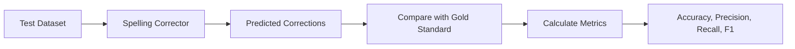

#### Example Evaluation

**Test Set** (10 errors):
```
acress → across     ✓ Corrected
wierd → weird       ✓ Corrected
recieve → receive   ✓ Corrected
thier → their       ✓ Corrected
occured → occurred  ✗ Missed (no correction)
seperate → separate ✓ Corrected
definately → definitely ✗ Wrong (corrected to "defiantly")
```

**Metrics**:
- Correct Corrections: 5
- Missed Errors: 1
- Wrong Corrections: 1
- Total Errors: 7

$$\text{Accuracy} = \frac{5}{7} = 0.714 = 71.4\%$$

$$\text{Precision} = \frac{5}{5+1} = \frac{5}{6} = 0.833 = 83.3\%$$

$$\text{Recall} = \frac{5}{5+1} = \frac{5}{6} = 0.833 = 83.3\%$$

$$F1 = 2 \times \frac{0.833 \times 0.833}{0.833 + 0.833} = 0.833 = 83.3\%$$

---

### 1.8.8 HCI Issues in Spelling Correction

The **Human-Computer Interaction (HCI)** design of spelling correction systems depends on the **confidence level** of the correction.

#### Confidence-Based Correction Strategies

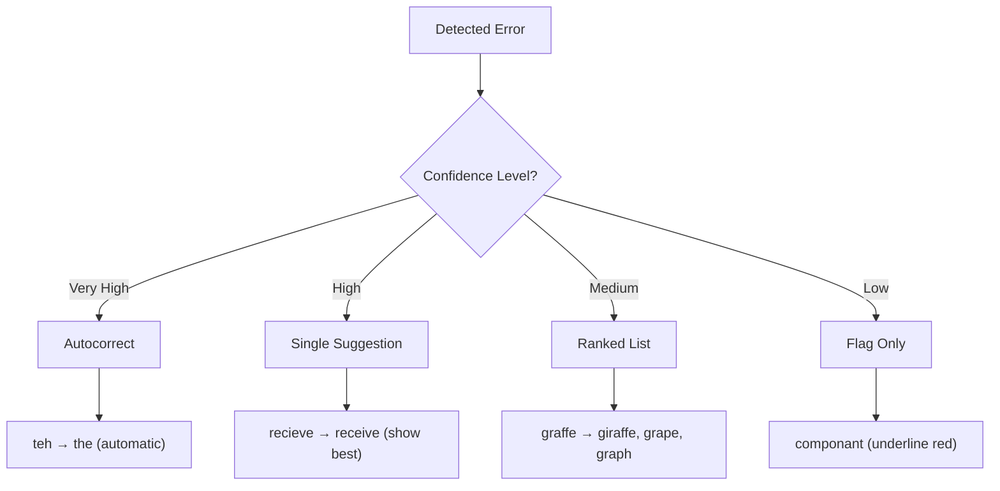

#### Strategy Details

**1. Autocorrect (Very High Confidence)**

**When to use**:
- Confidence > 95%
- Extremely common error
- Unambiguous correction

**Examples**:
- `teh` → `the`
- `adn` → `and`
- `hte` → `the`

**Risk**: May change user's intended word (e.g., proper names)

---

**2. Give the Best Correction (High Confidence)**

**When to use**:
- Confidence 80-95%
- Clear best candidate
- User can easily accept/reject

**Examples**:
- `recieve` → `receive` (single suggestion)
- `occured` → `occurred`

**UI**: Show suggestion, user clicks to accept

---

**3. Give a Correction List (Medium Confidence)**

**When to use**:
- Confidence 50-80%
- Multiple plausible candidates
- Context ambiguous

**Examples**:
```
graffe →
  1. giraffe (most likely)
  2. grape
  3. graph
  4. gaffe
```

**UI**: Dropdown menu or right-click menu

---

**4. Just Flag as Error (Low Confidence)**

**When to use**:
- Confidence < 50%
- No clear correction
- Might be proper noun, technical term, or correct word

**Examples**:
- `componant` (underline in red)
- Unknown word, no good candidates

**UI**: Red underline, no automatic suggestion

---

#### Trade-offs

| Strategy | Speed | Accuracy | User Control |
|----------|-------|----------|--------------|
| Autocorrect | Fast | Risk of errors | Low (automatic) |
| Best suggestion | Medium | Safe | Medium (easy accept/reject) |
| List | Slow | Very safe | High (user chooses) |
| Flag only | Fast | N/A | Very high (user decides) |

**Best Practice**: Combine strategies based on confidence and context.

---

### 1.8.9 Improvements to Channel Model

The basic channel model can be enhanced with more sophisticated error patterns.

#### 1. Richer Edit Operations (Brill and Moore 2000)

**Standard Edit Distance**: Only single-character operations
- Insert: `recive` → `receive` (add 'e')
- Delete: `recieve` → `receive` (remove 'i')
- Substitute: `recieve` → `receive` (i → ei)

**Brill & Moore Extensions**: Multi-character patterns

**Common Multi-Character Edits**:

| Pattern | Example | Frequency |
|---------|---------|-----------|
| `ent` → `ant` | `independant` → `independent` | High |
| `ph` → `f` | `foto` → `photo` | High |
| `le` → `al` | `nationle` → `national` | Medium |
| `tion` → `sion` | `discution` → `discussion` | Medium |
| Double letter | `occured` → `occurred` | Very High |

**Advantage**: Captures common **morphological** and **phonetic** patterns that single-character edits miss.

**Model Update**:
$$P(x \mid w) = P_{\text{single-char}}(x \mid w) + P_{\text{multi-char}}(x \mid w)$$

---

#### 2. Pronunciation-Based Channel (Toutanova and Moore 2002)

**Incorporate phonetic similarity** into the error model.

**Key Insight**: People often spell words as they sound.

**Examples**:
- `nite` → `night` (sound-based)
- `thru` → `through`
- `foto` → `photo` (ph sounds like f)

**Method**:

1. **Convert to phonetic representation**:
   - Use Soundex, Metaphone, or custom phonetic mapping
   - `receive` → `/rəˈsiv/`

2. **Model pronunciation errors**:
   - `ei` sound → `ie` spelling (common confusion)
   - `f` sound → `ph` or `f` spelling

3. **Combine with character model**:
$$P(x \mid w) = \alpha \cdot P_{\text{char}}(x \mid w) + (1-\alpha) \cdot P_{\text{phon}}(x \mid w)$$

Where:
- $P_{\text{char}}(x \mid w)$ = character-level error probability
- $P_{\text{phon}}(x \mid w)$ = pronunciation-based error probability
- $\alpha$ = weighting factor (typically 0.5-0.7)

**Results**:
- 10-20% improvement in correction accuracy
- Especially effective for:
  - Cognitive errors (homophones)
  - Non-native speakers
  - Phonetic misspellings

---

## 1.9 Channel Model Factors

### Overview

The error model $P(x \mid w)$ in the noisy channel represents the probability of typing error `x` given the intended word `w`. This probability is influenced by multiple linguistic and physical factors.

### Factors Influencing Error Probability

The likelihood of a specific typing error depends on several contextual and structural factors:

#### 1. The Source Letter

**Description**: The character that was intended to be typed

**Impact**: Some letters are inherently more prone to errors
- Common letters (e, a, t) have higher baseline error rates due to frequency
- Less common letters (q, x, z) may have different error patterns

**Example**:
- `e → a` substitution is common
- `q → w` substitution is less frequent but possible (keyboard adjacency)

---

#### 2. The Target Letter

**Description**: The character that was actually typed (the error)

**Impact**: Certain target letters are more common in errors
- Vowel confusions are frequent (e ↔ a, i ↔ e)
- Consonant clusters may be confused (t ↔ d, p ↔ b)

**Example**:
- Typing `a` instead of `e`: "recieve" → "recaive" (less common)
- Typing `e` instead of `i`: "recieve" → "receeve"

---

#### 3. Surrounding Letters (Context)

**Description**: The characters before and after the error position

**Impact**:
- Critical for building accurate confusion matrices
- Same error has different probabilities in different contexts
- Captured in the `x|w` notation (error given context)

**Example**:

| Context | Error | Probability | Reason |
|---------|-------|-------------|---------|
| `_ct_` | Delete `t` | High | Common in "actress" → "acress" |
| `_st_` | Delete `t` | Lower | Less common pattern |
| `#_` | Insert `a` | Very Low | Rare to add letters at word start |

**Notation**:
```
c|ct means: typed 'c' when 'ct' was intended
       ↓
  Context matters!
```

---

#### 4. Position in the Word

**Description**: Where in the word the error occurs

**Impact**: Error probabilities vary by position

**Patterns**:
- **Word-initial**: Fewer errors (users pay more attention)
- **Word-medial**: More errors (faster typing, less attention)
- **Word-final**: Moderate errors (hasty completion, -ed/-ing confusion)

**Examples**:
- Beginning: `#→a` (inserting 'a' at start) = Very rare
- Middle: `ss→s` (deleting one 's' in "actress") = Common
- End: `es→e` (dropping 's') = Moderately common

---

#### 5. Nearby Keys on the Keyboard

**Description**: Physical proximity of keys on QWERTY layout

**Impact**: Adjacent keys have higher substitution probability

**QWERTY Layout**:
```
Q W E R T Y U I O P
 A S D F G H J K L
  Z X C V B N M
```

**Common Adjacent Key Errors**:

| Intended | Typed | Distance | Probability Weight |
|----------|-------|----------|-------------------|
| `o` | `i` | Adjacent | High (0.000093) |
| `o` | `p` | Adjacent | High |
| `a` | `s` | Adjacent | High |
| `e` | `w` | Same column | Medium |
| `a` | `m` | Far apart | Very Low |

**Example**: "across" → "acress"
- `o → e` substitution: These keys are in the same region
- Probability: 0.000093 (moderately likely)

---

#### 6. Homology on the Keyboard

**Description**: Keys typed with the same finger or hand

**Impact**:
- Same-hand errors more common than cross-hand
- Same-finger errors (especially successive) very common

**Hand Distribution (QWERTY)**:
- **Left hand**: Q W E R T / A S D F G / Z X C V B
- **Right hand**: Y U I O P / H J K L / N M

**Same-Hand Error Examples**:
- Left hand: `d → f`, `s → d`, `w → e`
- Right hand: `i → o`, `k → l`, `n → m`

**Cross-Hand Errors**: Less common but possible
- `a → k` (unlikely - different hands)
- `s → j` (very unlikely)

---

#### 7. Pronunciations (Phonetic Similarity)

**Description**: How similar the sounds are

**Impact**:
- Homophones cause confusion
- Similar-sounding letters often confused
- Critical for real-word errors

**Common Phonetic Confusions**:

| Intended | Error | Phonetic Similarity | Example |
|----------|-------|---------------------|---------|
| `their` | `there` | Homophone | "Their going" → "There going" |
| `piece` | `peace` | Homophone | "Peace of cake" |
| `c` | `s` | Similar sound | "recieve" (c ≈ s sound) |
| `f` | `ph` | Same sound | "foto" ↔ "photo" |

**Sound-Based Patterns**:
- Vowel confusion: `a ↔ e`, `i ↔ e`, `o ↔ u`
- Soft consonants: `c ↔ s`, `g ↔ j`
- Hard consonants: `c ↔ k`, `f ↔ ph`

---

#### 8. Likely Morpheme Transformations

**Description**: Common grammatical/morphological variations

**Impact**:
- Affects real-word errors significantly
- Language-specific patterns
- Often involves suffixes and prefixes

**Common Morphological Errors**:

**Suffix Confusions**:
```
-ed ↔ -ing    "I was walking" vs "I was walked"
-er ↔ -or     "advisor" vs "adviser"
-tion ↔ -sion "tension" vs "tention"
-able ↔ -ible "accessible" vs "accessable"
```

**Plural/Singular**:
```
-s ↔ ∅        "cat" vs "cats"
-es ↔ -s      "boxes" vs "boxs"
```

**Tense Variations**:
```
run → ran → running
go → went → gone
```

**Example in Error Model**:

| Transformation | Context | Probability | Type |
|---------------|---------|-------------|------|
| `walk → walked` | Past tense | High | Correct |
| `walk → walk` | Missing -ed | Medium | Error |
| `run → runned` | Over-regularization | Low | Error |

---

### Combining Factors in the Error Model

The complete error model combines all these factors:

$$P(x \mid w, \text{context}) = f(\text{source}, \text{target}, \text{position}, \text{keyboard}, \text{phonetic}, \text{morpheme})$$

**Example: "actress" → "acress"**

Analyzing the error `ct → c` (deleting 't'):

| Factor | Analysis | Weight |
|--------|----------|--------|
| Source letter | `t` (common) | Neutral |
| Target letter | `∅` (deletion) | - |
| Surrounding letters | `c_ct` context | High impact |
| Position | Word-medial | Medium error rate |
| Keyboard | N/A (deletion) | - |
| Homology | N/A | - |
| Phonetic | Silent in fast speech | Low impact |
| Morpheme | Not morpheme boundary | Low impact |

**Combined**: $P(\text{ct} → \text{c} \mid \text{actress}) = 0.000117$

This probability reflects that:
1. The context `c_ct` is specific
2. Deleting `t` after `c` is moderately common
3. Position in middle of word increases likelihood
4. Not a strong phonetic or morphological pattern

---

### Practical Application

These factors are captured in the **confusion matrix** during training:

**Building Context-Aware Error Probabilities**:

```python
def calculate_error_probability(source, target, left_context, right_context):
    """
    Calculate P(target | source, context)

    Factors considered:
    - Character identity (source, target)
    - Surrounding context (left, right)
    - Position (implicit in context)
    - Keyboard distance (pre-computed)
    - Phonetic similarity (from lookup table)
    """
    context_key = f"{left_context}|{source}{target}|{right_context}"

    # Get base probability from confusion matrix
    base_prob = confusion_matrix.get(context_key, 0.0)

    # Apply keyboard distance weighting
    keyboard_weight = get_keyboard_proximity(source, target)

    # Apply phonetic similarity
    phonetic_weight = get_phonetic_similarity(source, target)

    # Combine factors
    final_prob = base_prob * keyboard_weight * phonetic_weight

    return final_prob
```

### Summary

All eight factors work together to determine $P(x \mid w)$:

1. ✓ **Source letter**: What was intended
2. ✓ **Target letter**: What was typed
3. ✓ **Surrounding letters**: Context dependency
4. ✓ **Position**: Where in the word
5. ✓ **Keyboard proximity**: Physical layout
6. ✓ **Homology**: Same hand/finger patterns
7. ✓ **Pronunciation**: Phonetic similarity
8. ✓ **Morphology**: Grammatical patterns

These factors are **empirically learned** from real error data (like Peter Norvig's corpus) and encoded in the confusion matrix for use in the noisy channel model.

---

## Summary: Key Formulas

### Noisy Channel Model
$$\hat{w} = \underset{w \in V}{\text{argmax}} \; P(x \mid w) \cdot P(w)$$

### Bigram Probability
$$P(w_n \mid w_{n-1}) = \frac{\text{Count}(w_{n-1}, w_n)}{\text{Count}(w_{n-1})}$$

### Levenshtein Distance (DP)
$$D[i, j] = \min \begin{cases}
D[i-1, j] + 1 \\
D[i, j-1] + 1 \\
D[i-1, j-1] + \delta(x_i, w_j)
\end{cases}$$

### Language Model Prior
$$P(w) = \frac{\text{Count}(w)}{\sum_{w' \in V} \text{Count}(w')}$$

---

## Practice Problems

### Problem 1
**Given**: Error `"teh"`, Candidates `{the, tea, ten}`
**Corpus Counts**: the=50000, tea=5000, ten=3000
**Edit Distances**: the=1, tea=2, ten=2

Calculate the best correction using uniform $P(x \mid w) = \frac{1}{d+1}$.

### Problem 2
**Sentence**: `"I saw a peace of paper"`
**Context**: Bigram model
**Candidates**: `{peace, piece}`

Given:
- Count("a peace") = 5
- Count("a piece") = 120
- Count("a") = 1000

Which word is correct?

### Problem 3
Calculate the edit distance from `"kitten"` to `"sitting"` using the DP algorithm.

---

## References

- Jurafsky, D., & Martin, J. H. (2023). *Speech and Language Processing* (3rd ed.)
- Norvig, P. (2007). *How to Write a Spelling Corrector*
- Damerau, F. J. (1964). *A technique for computer detection and correction of spelling errors*

---

**End of Document**

---

## 2. Real-Word Spelling Correction (Advanced)

### 2.1 Real-Word Error Examples and Impact

Real-word spelling errors are particularly challenging because the misspelled word is itself a valid dictionary entry, making detection much harder than non-word errors.

#### Statistics and Prevalence

According to **Kukich (1992)**, real-word errors constitute a significant portion of spelling mistakes:

- **25-40% of all spelling errors are real-word errors**
- These errors cannot be detected by simple dictionary lookup
- They require contextual analysis to identify and correct

#### Common Real-Word Error Examples

**1. Homophone Confusion**
```
✗ "...leaving in about fifteen minuets to go to her house."
✓ "...leaving in about fifteen minutes to go to her house."
```

**2. Grammatical Errors**
```
✗ "The design an construction of the system..."
✓ "The design and construction of the system..."
```

**3. Verb Form Confusion**
```
✗ "Can they lave him my messages?"
✓ "Can they leave him my messages?"
```

**4. Preposition/Conjunction Errors**
```
✗ "The study was conducted mainly be John Black."
✓ "The study was conducted mainly by John Black."
```

#### Why Real-Word Errors Are Difficult

| Challenge | Explanation | Example |
|-----------|-------------|---------|
| **Valid word** | Passes dictionary check | "their" vs "there" |
| **Context-dependent** | Requires understanding meaning | "piece" vs "peace" |
| **Ambiguous** | Multiple corrections possible | "I went to/too/two the store" |
| **Frequency bias** | Common word might be wrong | "the" might be "they" |

---

### 2.2 Solving Real-Word Spelling Errors

#### Complete Pipeline

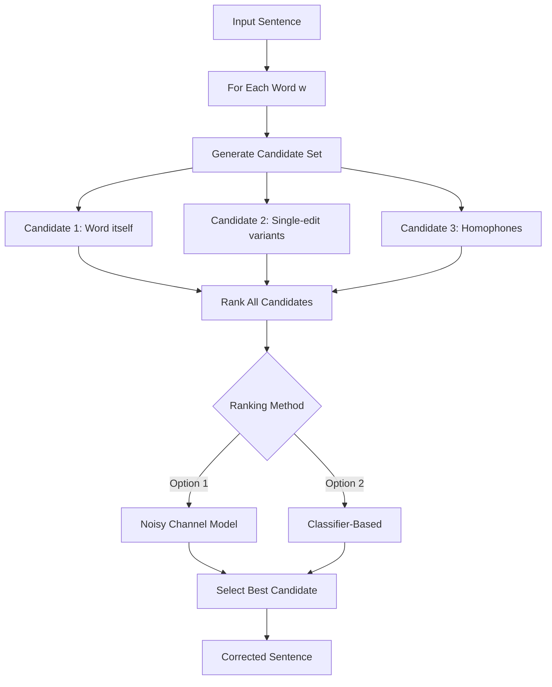

#### Method 1: Noisy Channel Approach

**For each word in sentence** `w₁, w₂, w₃, ..., wₙ`:

1. **Generate candidate set** for each word:
   - Candidate(w₁) = {w₁, w'₁, w''₁, w'''₁, ...}
   - Candidate(w₂) = {w₂, w'₂, w''₂, w'''₂, ...}
   - ...

2. **Choose sequence W that maximizes P(W)**:
   $$\hat{W} = \underset{W}{\text{argmax}} \; P(W)$$

3. **Use language model** to score sequences:
   $$P(w_1, w_2, ..., w_n) = \prod_{i=1}^{n} P(w_i \mid w_{i-1})$$

#### Simplification: One Error Per Sentence

For computational efficiency, assume **at most one error per sentence**:

**Example**: `"two of thew ..."`

Generate all possible sentences with one word replaced:
- w₁, w''₂, w₃, w₄ → `"two off thew"` (replace "of")
- w₁, w₂, w'₃, w₄ → `"two of the"` (replace "thew")
- w'''₁, w₂, w₃, w₄ → `"too of thew"` (replace "two")

Choose the sequence W that maximizes P(W).

---

### 2.3 Probability of No Error

A critical parameter in the channel model is **P(w|w)** - the probability that a word is typed correctly.

#### Setting Error Rates

The probability depends on the application domain:

| Error Rate | P(correct) | Scenario |
|------------|------------|----------|
| 1 error in 10 words | 0.90 | Casual typing |
| 1 error in 20 words | 0.95 | Normal typing |
| 1 error in 100 words | 0.99 | Careful typing |
| 1 error in 200 words | 0.995 | Professional documents |

#### Example: Peter Norvig's "thew" Analysis

**Input**: `"thew"`

| x (observed) | w (candidate) | x\|w | P(x\|w) | P(w) | $10^9 \times P(x \mid w)P(w)$ |
|--------------|---------------|------|---------|------|-------------------------------|
| thew | **the** | ew\|e | 0.000007 | 0.02 | **144** |
| thew | thew | - | 0.95 | 0.00000009 | 90 |
| thew | thaw | e\|a | 0.001 | 0.0000007 | 0.7 |
| thew | threw | h\|hr | 0.000008 | 0.000004 | 0.03 |
| thew | thwe | ew\|we | 0.000003 | 0.00000004 | 0.0001 |

**Winner**: `"the"` with score 144

**Analysis**:
- "the" has very high P(w) = 0.02 (extremely common word)
- Even with low error probability P(x|w) = 0.000007
- The product is highest due to word frequency

---

### 2.4 Classifier-Based Methods for Real-Word Errors

Instead of relying solely on channel and language models, use **machine learning classifiers** trained on specific confusable word pairs.

#### Approach

Build a **binary classifier** for each confusable pair:

**Example: whether / weather**

**Features**:
1. **Lexical context**:
   - Word within ±10 positions
   - "cloudy" appears nearby → weather
   - "or not" appears nearby → whether

2. **Syntactic patterns**:
   - `___ to VERB` → whether
   - `___ forecast` → weather
   - `___ or not` → whether

3. **Semantic features**:
   - Topic model indicators
   - Named entity context

4. **POS tags**:
   - Following POS tag
   - Preceding POS tag

#### Training Data

Collect examples from large corpora where the correct word is known:

```
Positive examples (whether):
- "whether to go or stay"
- "whether or not"
- "decide whether"

Positive examples (weather):
- "weather forecast"
- "cold weather"
- "weather conditions"
```

#### Classifier Types

- **Logistic Regression**
- **Support Vector Machines (SVM)**
- **Decision Trees**
- **Neural Networks** (for more complex patterns)

---

## 3. Modern Approaches to Spelling Correction

### Overview

Modern spelling correction methods extend classical dictionary lookup and the noisy channel model by incorporating linguistic rules, statistical learning, and deep neural representations. The goal is to improve accuracy, handle context-sensitive (real-word) errors, and scale across domains and languages.

These approaches mainly differ in:

* How language knowledge is represented
* How spelling errors are modeled
* How much contextual information is used

The four major modern approaches are: rule-based, statistical, deep learning–based, and large language model (LLM)–based methods.

---

### 3.1 Rule-Based Methods

Definition:
Rule-based spelling correction relies on manually designed linguistic rules and dictionaries to identify and correct spelling errors.

Brief Description:
A word is flagged as an error if it violates predefined rules, such as not appearing in a dictionary or breaking valid spelling patterns. Corrections are suggested using handcrafted rules, morphological analysis, affix stripping, or known confusion sets.

Key Characteristics:

* Deterministic and fast
* Easy to interpret and debug
* No training data required

**Core Components**:
1. **Dictionary**: List of valid words
2. **Spelling Rules**: Language-specific patterns
3. **Exception Lists**: Irregular forms

**Example Rules**:
- `i before e except after c` → "receive" not "recieve"
- Double consonants before -ing → "running" not "runing"
- Drop silent 'e' before -ing → "write" → "writing"

#### Advantages
<br>
✅ **Easy to implement** : Clear, deterministic logic<br>
✅ **Fast**: Simple lookups and pattern matching<br>
✅ **Transparent**: Rules are interpretable<br>
✅ **No training data needed**: Hand-crafted rules<br>

#### Limitations

❌ **Cannot handle new words**: Slang, proper nouns, neologisms<br>
❌ **Manual maintenance**: Rules must be updated by experts<br>
❌ **Limited context**: Cannot handle ambiguous errors<br>
❌ **Exception-heavy**: Many irregular cases require special handling<br>
❌ **Language-specific**: Rules don't transfer across languages<br>

#### Real-World Example

**Microsoft Word** uses a combination of:
- Dictionary-based spell checking
- Grammar rules
- Custom user dictionaries
- AutoCorrect patterns

---

### 3.2 Statistical Methods

Definition:
Statistical spelling correction uses probabilistic models learned from large text corpora to detect and correct spelling errors.

Brief Description:
These methods treat spelling correction as a probabilistic inference problem. The most common formulation is the Noisy Channel Model, which selects the correction that maximizes:

P(correct word | observed error) proportional to P(error | word) * P(word)

Language models (unigram, bigram, trigram) estimate word likelihoods, while error models estimate typing or spelling error probabilities.

Key Characteristics:

* Data-driven and adaptable
* Can rank multiple candidate corrections
* Can incorporate limited context using n-grams

**Core Idea**: Model the probability of words and sequences, then select the most likely correction.

#### Key Approaches

**1. Language Model (Unigram/Bigram/Trigram)**

Estimate word probabilities from corpus:
$$P(w) = \frac{\text{Count}(w)}{\text{Total words}}$$

**2. Noisy Channel Model**

Combine language model with error model:
$$\hat{w} = \underset{w}{\text{argmax}} \; P(x \mid w) \cdot P(w)$$

**3. N-gram Context Models**

Use surrounding words to estimate probability:
$$P(w_i \mid w_{i-2}, w_{i-1})$$

#### Advantages

✅ **Flexible**: Adapts to different domains and languages<br>
✅ **Scalable**: Can handle large vocabularies<br>
✅ **Handles variations**: Learns from actual usage<br>
✅ **No manual rules**: Learns patterns automatically<br>
✅ **Data-driven**: Improves with more data<br>

#### Limitations

❌ **Requires large corpora**: Needs substantial training data<br>
❌ **Computationally expensive**: Training and inference can be slow<br>
❌ **Noisy data problems**: Learns errors if training data has mistakes<br>
❌ **Bias issues**: Reflects biases in training corpus<br>
❌ **Sparse data**: Rare words have unreliable probabilities<br>
❌ **Limited interpretability**: Hard to understand why a correction was made<br>

---

### 3.3 Deep Learning Approaches

Definition:
Deep learning–based spelling correction uses neural networks to learn spelling error patterns directly from data.

Brief Description:
These approaches frame spelling correction as a sequence-to-sequence task at the character or word level. Models such as LSTM, Bi-LSTM, and Transformer architectures learn mappings from erroneous text to corrected text using labeled datasets.

Key Characteristics:

* Handles multiple and complex errors
* Learns contextual and semantic patterns
* Adaptable across languages and domains

Limitations:

* Requires large labeled datasets
* Computationally expensive
* Limited interpretability

Examples:

* Bi-LSTM spell correction models
* Transformer-based correction systems

**Key Advantage**: Can capture long-range dependencies and semantic context that statistical methods miss.

#### 3.3.1 Sequence-to-Sequence (Seq2Seq) Models

**Architecture**: Encoder-Decoder with RNNs or Transformers

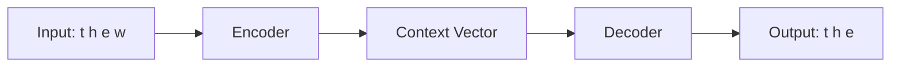

**How It Works**:
1. **Encoder**: Reads the entire input sequence (character-by-character or word-by-word)
2. **Context Vector**: Compresses input into fixed-size representation
3. **Decoder**: Generates output sequence one token at a time

**Training**:
- Pairs of (incorrect, correct) text
- Learn to "translate" errors into corrections

**Example**:
```
Input:  "I recieved the package"
Output: "I received the package"
```

---

#### 3.3.2 LSTM and Bi-directional LSTM

**LSTM (Long Short-Term Memory)** networks handle long-range dependencies better than standard RNNs.

**Uni-directional LSTM**:
```
I am ___ student
←←←
```
Uses only **past context** (I am) to predict next word.

**Bi-directional LSTM (BLSTM)**:
```
I am ___ student
←←←  →→→
```
Uses **both past and future context** to make predictions.

**Example**:

Input: `"I am ___ student"`

- **Uni-directional**: Sees only "I am" → might predict "a" or "very"
- **Bi-directional**: Sees "I am" + "student" → correctly predicts "a"

**Architecture**:
```
Forward LSTM:  I → am → [?] → student
Backward LSTM: student → [?] → am → I
                          ↓
                    Combine outputs
                          ↓
                    Prediction: "a"
```

**Advantages for Spell Checking**:
- Understands context from both directions
- Better at detecting errors that require future context
- More accurate for real-word errors

---

#### 3.3.3 Attention Mechanisms

**Problem**: Fixed-size context vector in Seq2Seq loses information for long sequences.

**Solution**: Attention mechanism allows decoder to "focus" on relevant parts of input.

**How Attention Works**:

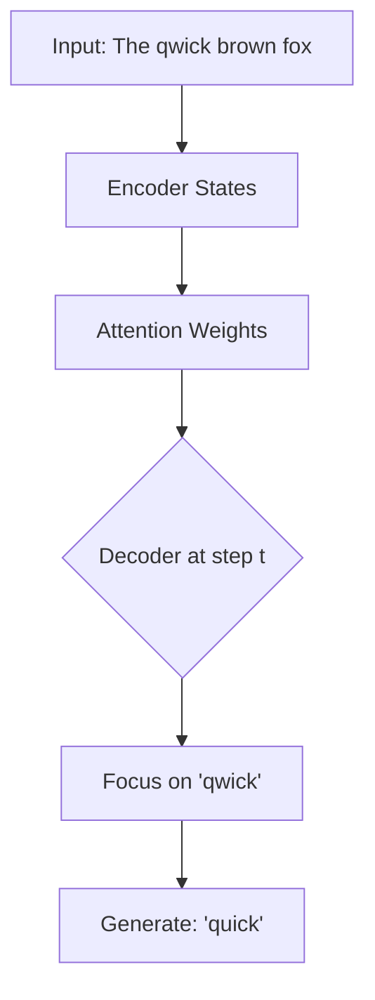

**Attention Calculation**:
1. Compute **alignment scores** between decoder state and all encoder states
2. Convert to **attention weights** (softmax)
3. Compute **weighted sum** of encoder states
4. Use this **context vector** for current decoding step

**Example**:

Correcting: `"The qwick brown fox"`

When generating output at position of "qwick":
- Attention weights: [0.1, **0.8**, 0.05, 0.05]
- High attention on input position 2 ("qwick")
- Decoder focuses on this part to generate "quick"

**Advantages**:
- Handles long sequences better
- More interpretable (can visualize what model focuses on)
- Better performance on complex corrections

---

#### 3.3.4 BERT-Based Models

**BERT** (Bidirectional Encoder Representations from Transformers) revolutionized NLP with its **bidirectional context understanding**.

**Key Features**:
- Pre-trained on massive text corpora
- Understands context from both directions simultaneously
- Can be fine-tuned for spell checking

**How BERT Works for Spell Checking**:

**Masked Language Modeling**:
```
Input:  "I recieved the [MASK]"
BERT:   Predicts "package" based on context
```

**For Spell Checking**:
```
Input:  "I recieved the package"
Step 1: Identify suspicious word ("recieved")
Step 2: Mask it: "I [MASK] the package"
Step 3: BERT predicts: "received"
Step 4: Replace if confidence > threshold
```

**Architecture**:
```
Input: [CLS] I recieved the package [SEP]
         ↓      ↓      ↓   ↓     ↓
    [Transformer Layers with Self-Attention]
         ↓      ↓      ↓   ↓     ↓
    Context-aware representations
         ↓
    Classification/Prediction
```

**Fine-tuning for Spell Checking**:

1. **Detection Task**: Binary classifier on each token
   - Input: BERT embeddings
   - Output: [correct/incorrect]

2. **Correction Task**: Generate correction candidates
   - Mask suspicious tokens
   - Predict top-k replacements
   - Rank by confidence

**Advantages**:<br>
✅ Deep contextual understanding<br>
✅ Handles complex, multi-word contexts<br>
✅ State-of-the-art accuracy<br>
✅ Transfer learning from pre-training<br>

**Example Models**:
- **BERT**: Original bidirectional transformer
- **RoBERTa**: Robustly optimized BERT
- **ALBERT**: Lighter version of BERT
- **SpellBERT**: BERT fine-tuned specifically for spell checking

---

### 3.4 LLM-Based Spell Checkers

Definition:
LLM-based spelling correction uses large pre-trained language models to detect and correct spelling errors using deep contextual understanding.

Brief Description:
Large Language Models (LLMs) such as GPT, T5, and BERT-based models implicitly learn spelling rules, word usage frequencies, and context during pretraining. Spelling correction becomes part of a broader text understanding and generation task.

Key Characteristics:

* Strong context awareness
* Can jointly correct spelling, grammar, and style
* Minimal task-specific feature engineering

Limitations:

* High computational cost
* Reduced transparency in decision-making
* Possibility of hallucinated or over-corrections

Examples:

* GPT-based text correction
* T5 fine-tuned for grammatical error correction

#### 3.4.1 GPT for Contextual Correction

**GPT** (Generative Pre-trained Transformer) is an autoregressive model that generates text left-to-right.

**Approach**:
```
Prompt: "Correct the spelling in this sentence: I recieved the package yesteday."
GPT Output: "I received the package yesterday."
```

**How It Works**:
1. Provide instruction + incorrect text as prompt
2. GPT generates corrected version
3. Use temperature tuning for deterministic corrections

**Advantages**:
- Zero-shot or few-shot learning
- Handles complex contextual errors
- Can explain corrections (if prompted)

**Limitations**:
- May change meaning beyond spelling
- Computationally expensive
- Requires careful prompting

---

#### 3.4.2 T5 for Text-to-Text Transformation

**T5** (Text-to-Text Transfer Transformer) frames all NLP tasks as text-to-text.

**For Spell Checking**:
```
Input:  "correct: I recieved the package"
Output: "I received the package"
```

**Training**:
- Fine-tune T5 on pairs of (incorrect, correct) sentences
- Learns to "translate" errors into corrections

**Architecture**:
```
Encoder: "correct: I recieved the package"
    ↓
Transformer Encoder-Decoder
    ↓
Decoder: "I received the package"
```

**Advantages**:
- Unified framework for all correction tasks
- Strong transfer learning
- Handles grammar + spelling together
- Can be fine-tuned on specific domains

---

#### 3.4.3 Pre-trained Models (Hugging Face)

**Popular Pre-trained Models for Spell Checking**:

**1. NeuspellBERT**
- BERT fine-tuned specifically for spell checking
- Multiple architectures available
- Strong performance on benchmark datasets

**2. T5-based Correctors**
- `t5-small`, `t5-base`, `t5-large`
- Fine-tuned on grammar correction datasets
- Can handle both spelling and grammar

**3. BART**
- Denoising autoencoder
- Excellent for error correction tasks

**Advantages**:
- Ready-to-use models
- State-of-the-art performance
- Easy integration
- Active community support

---

## 4. Hybrid and Ensemble Approaches

### 4.1 Combining Rule-Based and Statistical Methods

#### Motivation

- **Rules**: Fast, interpretable, handle known patterns
- **Statistical**: Flexible, data-driven, handle variations

**Hybrid Approach**: Use rules for preprocessing, statistics for disambiguation.

#### Architecture

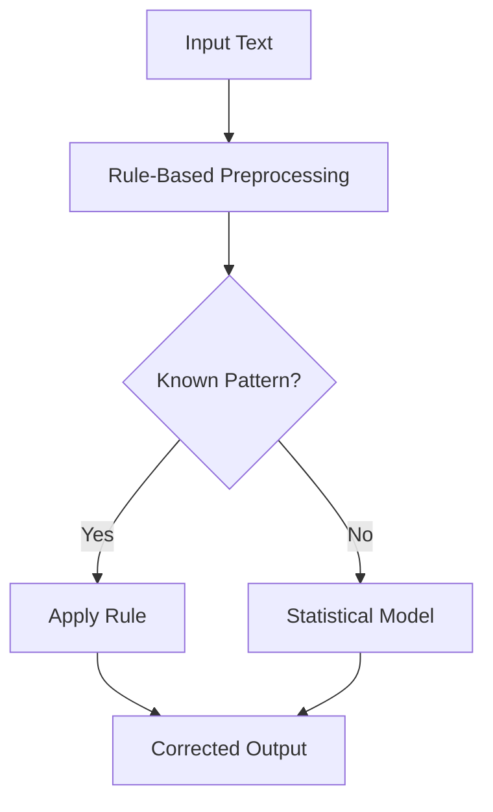

#### Example Workflow

**Step 1: Rule-Based Detection**
```python
def rule_based_preprocessing(text):
    # Apply known corrections
    text = text.replace("teh", "the")
    text = text.replace("recieve", "receive")

    # Detect suspicious patterns
    suspicious_words = []
    for word in text.split():
        if not in_dictionary(word):
            suspicious_words.append(word)

    return text, suspicious_words
```

**Step 2: Statistical Disambiguation**
```python
def statistical_correction(word, context):
    candidates = generate_candidates(word)
    scores = []

    for candidate in candidates:
        # Use n-gram language model
        score = P(candidate | context)
        scores.append((candidate, score))

    return max(scores, key=lambda x: x[1])[0]
```

**Step 3: Combine**
```python
def hybrid_spell_check(text):
    # Apply rules first
    text, suspicious = rule_based_preprocessing(text)

    # Use statistics for uncertain cases
    for word in suspicious:
        context = get_context(word, text)
        correction = statistical_correction(word, context)
        text = text.replace(word, correction)

    return text
```

---

### 4.2 Combining Statistical and Neural Network Methods

#### Approach

Use **statistical features as input** to neural networks.

**Feature Engineering**:
1. **N-gram probabilities** (from statistical language model)
2. **Edit distance** (character-level statistics)
3. **Word frequency** (unigram statistics)
4. **Context features** (bigram/trigram probabilities)

**Architecture**:
```
Statistical Features → Neural Network → Prediction
     ↓
[P(w), P(w|w-1), edit_dist, freq] → LSTM → [correct/incorrect]
```

#### Example Implementation

```python
def extract_statistical_features(word, context, lm):
    features = {
        'unigram_prob': lm.prob(word),
        'bigram_prob': lm.prob(word, context[-1]),
        'edit_distance': min_edit_distance_to_dict(word),
        'word_frequency': get_frequency(word),
        'is_rare': get_frequency(word) < threshold
    }
    return features

def neural_spell_checker(word, context, lm, model):
    # Get statistical features
    features = extract_statistical_features(word, context, lm)

    # Neural network prediction
    is_error = model.predict(features)

    if is_error:
        candidates = generate_candidates(word)
        # Rank by combined score
        best = rank_candidates(candidates, features, model)
        return best

    return word
```

---

### 4.3 Combining Rule-Based + Statistical + Neural Methods

#### Full Hybrid Pipeline

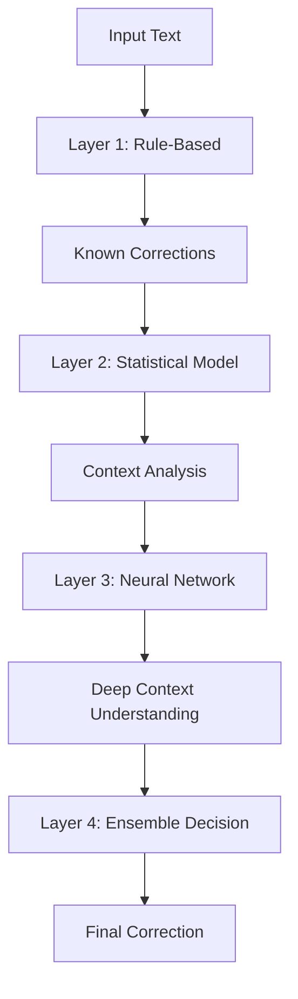

#### Multi-Stage Approach

**Stage 1: Rule-Based Preprocessing**
```python
def stage1_rules(text):
    """Fast, deterministic corrections"""
    corrections = {
        'teh': 'the',
        'recieve': 'receive',
        'occured': 'occurred'
    }
    for error, correction in corrections.items():
        text = text.replace(error, correction)
    return text
```

**Stage 2: Statistical Analysis**
```python
def stage2_statistical(text, language_model):
    """N-gram based anomaly detection"""
    suspicious = []
    words = text.split()

    for i, word in enumerate(words):
        # Check bigram probability
        if i > 0:
            prob = language_model.bigram_prob(words[i-1], word)
            if prob < threshold:
                suspicious.append((i, word))

    return suspicious
```

**Stage 3: Neural Network Correction**
```python
def stage3_neural(suspicious_words, context, model):
    """Deep learning for complex cases"""
    corrections = {}

    for idx, word in suspicious_words:
        # Get context embedding
        context_vec = get_context_embedding(context, idx)

        # Neural prediction
        candidates = model.generate_candidates(word, context_vec)
        best = model.rank_candidates(candidates)

        corrections[idx] = best

    return corrections
```

**Stage 4: Ensemble Decision**
```python
def stage4_ensemble(text, rule_result, stat_result, neural_result):
    """Combine all three approaches"""
    final_text = text

    for position in get_all_positions():
        votes = []

        # Collect votes from each method
        if position in rule_result:
            votes.append(('rule', rule_result[position], weight=0.3))
        if position in stat_result:
            votes.append(('stat', stat_result[position], weight=0.3))
        if position in neural_result:
            votes.append(('neural', neural_result[position], weight=0.4))

        # Weighted voting
        if len(votes) >= 2:  # Require consensus
            correction = weighted_vote(votes)
            final_text = apply_correction(final_text, position, correction)

    return final_text
```

---

### 4.4 Practical Hybrid Implementation: LanguageTool

**LanguageTool** is a real-world example that combines all three approaches.

#### Architecture

**1. Rule Engine**
- Hand-crafted grammar rules
- Pattern matching
- Language-specific rules (25+ languages)

**2. Statistical Component**
- N-gram language models
- Frequency-based ranking
- Context probability scoring

**3. Neural Component** (Premium version)
- Transformer-based models
- Deep context understanding
- Advanced error detection

#### How LanguageTool Works

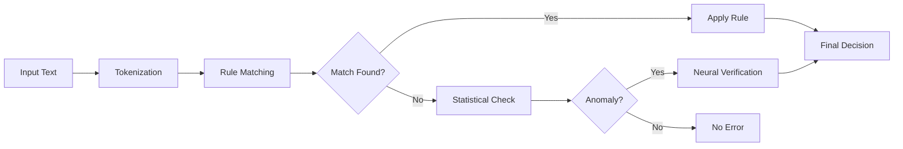

**Example**:

Input: `"I went too the store"`

1. **Rules**: Detects "too" before article pattern
2. **Statistical**: Confirms "too the" has very low P(w₂|w₁)
3. **Neural**: Verifies "to the store" is correct pattern
4. **Decision**: Correct "too" → "to"

#### Advantages of Hybrid Approach

✅ **Best of all worlds**: Speed + accuracy + flexibility<br>
✅ **Graceful degradation**: Falls back to simpler methods if complex ones fail<br>
✅ **Interpretable + Powerful**: Rules explain common cases, neural handles complex ones<br>
✅ **Efficient**: Rules handle 80% of cases quickly, ML handles remaining 20%<br>
✅ **Maintainable**: Rules can be updated without retraining models<br>

---

## 5. Recent Research Trends in Grammar and Spelling Correction

### 5.1 Multilingual Grammar Correction

**Challenge**: Most spelling correction systems are English-centric. Building systems for multiple languages requires:
- Language-specific error patterns
- Different morphological rules
- Varying script systems (Latin, Cyrillic, Arabic, etc.)

**Recent Approaches**:

**1. Multilingual Transformers**
- **mBERT** (Multilingual BERT): Pre-trained on 104 languages
- **XLM-R** (Cross-lingual RoBERTa): Better cross-lingual transfer
- Fine-tune on parallel error corpora

**2. Cross-lingual Transfer Learning**
- Train on high-resource language (e.g., English)
- Transfer to low-resource languages using shared representations
- Example: English error patterns → French correction

**3. Language-Agnostic Features**
- Character-level models (work across scripts)
- Phonetic representations
- Universal dependency parsing

**Key Papers**:
- "Multilingual Grammar Error Correction with Language-Specific Adapters" (2022)
- "Cross-lingual Transfer Learning for Grammatical Error Correction" (2021)

---

### 5.2 Low-Resource Grammar Correction Using Synthetic Error Generation

**Problem**: Creating annotated error corpora is expensive. Many languages lack sufficient training data.

**Solution**: **Synthetic Error Generation**

#### Approach

**Step 1: Generate Synthetic Errors**

Start with correct text, introduce realistic errors:

```python
def generate_synthetic_errors(correct_sentence):
    # Common error types
    errors = [
        random_deletion(),      # "the cat" → "te cat"
        random_insertion(),     # "the cat" → "the ccat"
        random_substitution(),  # "the cat" → "teh cat"
        swap_homophones(),      # "their cat" → "there cat"
        morphology_errors()     # "running" → "runing"
    ]
    return apply_random_errors(correct_sentence, errors)
```

**Step 2: Train on Synthetic Pairs**

- Input: Error-corrupted sentences
- Output: Original correct sentences
- Model learns to reverse errors

**Step 3: Fine-tune on Real Data (if available)**

- Small amount of real annotated data
- Significantly improves performance

#### Advantages

✅ **Scalable**: Can generate millions of training examples
✅ **Customizable**: Tune error types to target language
✅ **Low-cost**: No manual annotation needed

#### Challenges

❌ **Realism**: Synthetic errors may not match real user errors
❌ **Diversity**: Hard to capture all error types
❌ **Domain shift**: Model may overfit to synthetic patterns

**Recent Work**:
- "Generating Diverse Error Corrections with Conditional Chain Editing" (2023)
- "Synthetic Data Augmentation for Low-Resource Grammatical Error Correction" (2022)

---

### 5.3 Unsupervised and Semi-Supervised GEC

**Motivation**: Fully supervised GEC requires parallel (error, correction) pairs, which are expensive to create.

#### Unsupervised Approaches

**1. Round-Trip Translation**
```
Correct text → Translate to Language B → Translate back to A
                                          ↓
                            Introduces natural errors
```

**2. Back-Translation with Error Injection**
- Start with correct monolingual text
- Train error generation model (reverse of correction)
- Generate pseudo-parallel data

**3. Self-Training**
- Train initial model on limited labeled data
- Use model to correct unlabeled text
- Retrain on high-confidence corrections

#### Semi-Supervised Approaches

**Combine**:
- Small labeled dataset (human-annotated)
- Large unlabeled dataset (correct text only)

**Methods**:
1. **Pre-train** on large correct text (language modeling)
2. **Fine-tune** on small error-correction pairs
3. **Self-distillation**: Model teaches itself on unlabeled data

**Results**:
- 15-30% performance gain over supervised-only
- Particularly effective for low-resource languages

**Key Papers**:
- "Unsupervised Grammatical Error Correction Rivaling Supervised Methods" (2023)
- "Semi-Supervised Grammatical Error Correction" (2021)

---

### 5.4 Reinforcement Learning for Fluency-Aware Correction

**Problem**: Standard GEC optimizes for exact match with gold corrections, but multiple valid corrections exist.

**Example**:
```
Error:    "I am liking this movie"
Gold:     "I like this movie"
Also valid: "I am enjoying this movie"
           "I really like this movie"
```

**Solution**: Use **Reinforcement Learning** to optimize for **fluency** rather than exact match.

#### Approach

**1. Reward Function**

Design rewards based on:
- **Grammaticality**: Is the output grammatically correct?
- **Fluency**: Does it sound natural?
- **Meaning preservation**: Does it maintain original intent?
- **Minimal edits**: Prefer fewer changes

**Example Reward**:
$$R = \alpha \cdot \text{Fluency}(y) + \beta \cdot \text{Grammar}(y) + \gamma \cdot \text{Similarity}(x, y)$$

**2. Training with RL**

- **Policy**: Seq2Seq correction model
- **Action**: Generate corrected sentence
- **Reward**: Fluency score from pre-trained language model
- **Update**: REINFORCE or Proximal Policy Optimization (PPO)

**3. Fluency Scoring**

Use pre-trained language models:
```python
def fluency_score(sentence):
    # Use GPT or BERT perplexity
    perplexity = language_model.score(sentence)
    return 1.0 / perplexity  # Lower perplexity = higher fluency
```

#### Advantages

✅ **Flexible**: Can optimize for multiple objectives
✅ **Human-like**: Generates more natural corrections
✅ **Robust**: Less sensitive to annotation style

**Recent Work**:
- "Fluency Boost Learning and Inference for Neural Grammatical Error Correction" (2022)
- "Reinforcement Learning for GEC with Fluency-Oriented Rewards" (2021)

---

### 5.5 Explainable GEC Models (Interpretable Edits)

**Problem**: Neural GEC models are black boxes. Users and educators need to understand **why** a correction was made.

**Solution**: Build models that provide **interpretable edit explanations**.

#### Approaches

**1. Edit-Type Classification**

Classify each edit into categories:
- **Spelling**: `recieve → receive`
- **Grammar**: `I goes → I go`
- **Word choice**: `big → large`
- **Punctuation**: `Hello how are you → Hello, how are you?`

**2. Error Tag Prediction**

Assign error tags from linguistic framework:

```
Original: I am liking this movie very much
Tags:     [VERB_FORM] [OK] [OK] [OK] [OK]
Edit:     I like this movie very much
Reason:   "Progressive tense not appropriate with stative verb 'like'"
```

**3. Attention Visualization**

Show which parts of input the model focused on:

```
Input:  I am liking this movie
        ↓    ↓
Attention weights: [0.1, 0.4, 0.5, 0.2, 0.1]
Output: I like this movie
Explanation: "Model focused on 'am liking' → suggests tense correction"
```

**4. Counterfactual Explanations**

Show what would change if certain features were different:

```
"If the subject were 'they' instead of 'I',
 the correction would be 'they like' not 'they likes'"
```

#### Benefits

✅ **Educational**: Helps learners understand mistakes
✅ **Trust**: Users can verify corrections
✅ **Debugging**: Developers can improve models
✅ **Compliance**: Important for high-stakes applications

**Tools & Frameworks**:
- **ERRANT**: Error Annotation Toolkit
- **GECToR**: GEC with explicit edit operations
- **Linguistic Error Analysis Frameworks**

**Recent Work**:
- "Interpretable Grammatical Error Correction with Edit-Based Models" (2023)
- "Explainable Grammatical Error Correction" (2022)

---

### 5.6 Summary of Research Trends

| Trend | Key Benefit | Main Challenge | Status |
|-------|-------------|----------------|--------|
| **Multilingual GEC** | Global applicability | Language-specific resources | Active |
| **Synthetic Data** | Low-cost training | Realism of errors | Mature |
| **Unsupervised/Semi-supervised** | Reduced annotation | Performance gap | Growing |
| **RL for Fluency** | Natural corrections | Reward design | Emerging |
| **Explainable GEC** | Trust & education | Model complexity | Active |

**Future Directions**:
- Personalized GEC (adapt to user's writing style)
- Real-time collaborative GEC (Google Docs-style)
- Domain-specific GEC (medical, legal, technical writing)
- Integration with LLMs (GPT-4, Claude for context-aware correction)

---

## Summary: Key Formulas