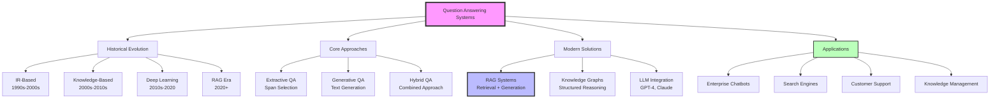
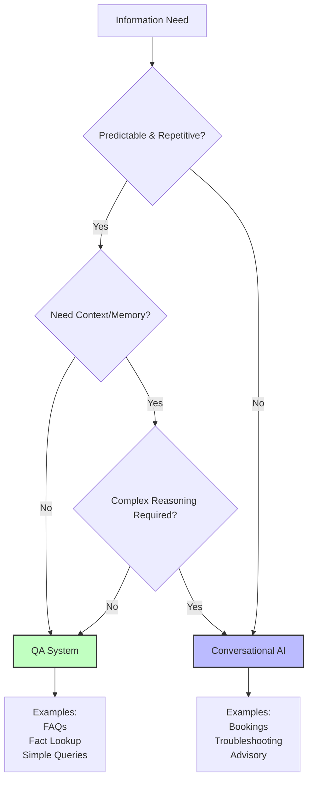
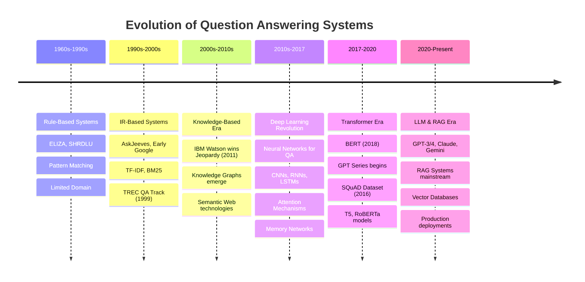
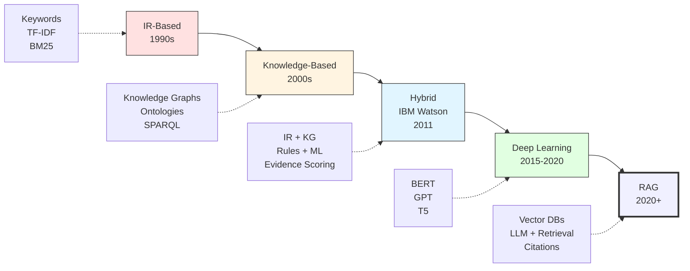
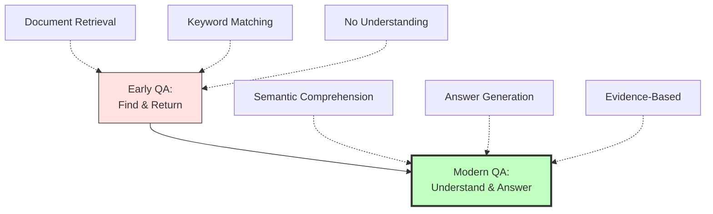
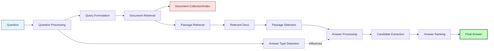
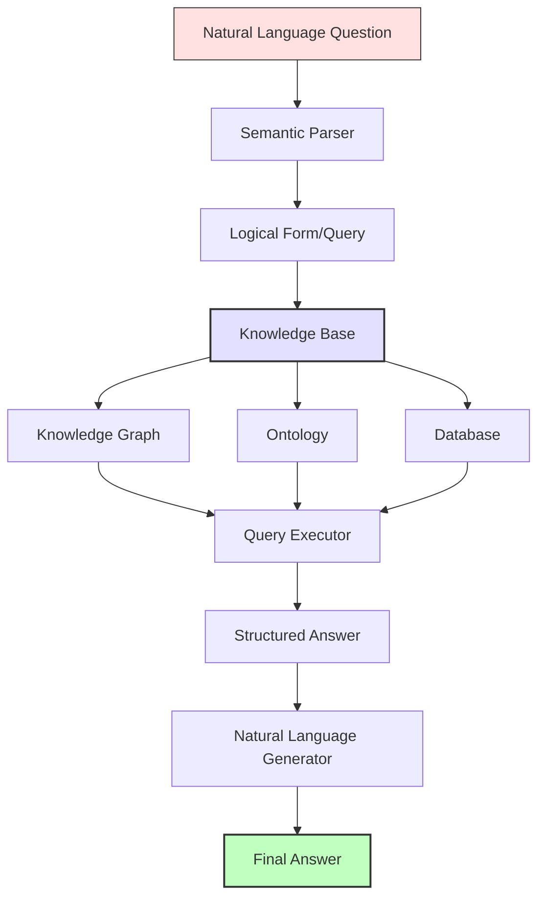
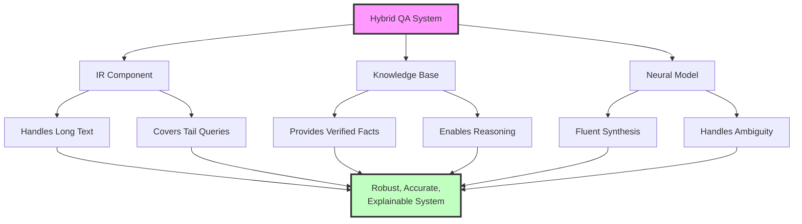

# Question Answering Systems - Comprehensive Study Guide

## Table of Contents

### 1. [Introduction to Question Answering](#1-introduction-to-question-answering)
- [1.1 Definition and Core Concepts](#11-definition-and-core-concepts)
- [1.2 Types of Questions](#12-types-of-questions)
- [1.3 Business Value](#13-business-value)
- [1.4 QA vs Conversational AI](#14-qa-vs-conversational-ai)
- [1.5 When to Use Each Approach](#15-when-to-use-each-approach)

### 2. [Evolution and Journey of QA Systems](#2-evolution-and-journey-of-qa-systems)
- [2.1 Historical Timeline](#21-historical-timeline)
- [2.2 Evolution Path](#22-evolution-path)
- [2.3 Key Milestones](#23-key-milestones)
- [2.4 Paradigm Shifts](#24-paradigm-shifts)

### 3. [IR-Based Question Answering](#3-ir-based-question-answering)
- [3.1 System Architecture](#31-system-architecture)
- [3.2 Complete Pipeline](#32-complete-pipeline)
- [3.3 Question Processing Components](#33-question-processing-components)
- [3.4 Passage Retrieval Methods](#34-passage-retrieval-methods)
- [3.5 Answer Extraction Techniques](#35-answer-extraction-techniques)
- [3.6 Limitations](#36-limitations)

### 4. [Knowledge-Based and Hybrid Approaches](#4-knowledge-based-and-hybrid-approaches)
- [4.1 Knowledge-Based QA Architecture](#41-knowledge-based-qa-architecture)
- [4.2 Knowledge Graph Structure](#42-knowledge-graph-structure)
- [4.3 Semantic Representation](#43-semantic-representation)
- [4.4 Hybrid QA: IBM Watson Case Study](#44-hybrid-qa-ibm-watson-case-study)
- [4.5 Hybrid Approach Components](#45-hybrid-approach-components)
- [4.6 Knowledge Sources](#46-knowledge-sources)
- [4.7 Advantages of Hybrid Approach](#47-advantages-of-hybrid-approach)

### 5. [Deep Learning Approaches - Extractive QA](#5-deep-learning-approaches---extractive-qa)
- [5.1 Extractive QA Concept](#51-extractive-qa-concept)
- [5.2 Stanford Attentive Reader Architecture](#52-stanford-attentive-reader-architecture)
- [5.3 BERT for Question Answering](#53-bert-for-question-answering)
- [5.4 Training Process](#54-training-process)
- [5.5 Feature Engineering](#55-feature-engineering)
- [5.6 Popular Datasets](#56-popular-datasets)
- [5.7 SQuAD Dataset Example](#57-squad-dataset-example)
- [5.8 Pros and Cons](#58-pros-and-cons)

### 6. [Generative QA and Large Language Models](#6-generative-qa-and-large-language-models)
- [6.1 Generative QA Concept](#61-generative-qa-concept)
- [6.2 T5 for QA](#62-t5-for-qa)
- [6.3 Generative QA Example](#63-generative-qa-example)
- [6.4 Advantages](#64-advantages)
- [6.5 The Problem: Hallucinations & Stale Data](#65-the-problem-hallucinations--stale-data)
- [6.6 Real Hallucination Examples](#66-real-hallucination-examples)
- [6.7 Why Hallucinations Occur](#67-why-hallucinations-occur)

### 7. [Retrieval-Augmented Generation (RAG)](#7-retrieval-augmented-generation-rag)
- [7.1 RAG: The Solution](#71-rag-the-solution)
- [7.2 RAG Pipeline Architecture](#72-rag-pipeline-architecture)
- [7.3 RAG Tech Stack](#73-rag-tech-stack)
- [7.4 Vector Databases Explained](#74-vector-databases-explained)
- [7.5 RAG vs Pure LLM Comparison](#75-rag-vs-pure-llm-comparison)
- [7.6 RAG Prompt Template Example](#76-rag-prompt-template-example)
- [7.7 Advanced RAG Techniques](#77-advanced-rag-techniques)

### 8. [Open-Domain and Knowledge Graph QA](#8-open-domain-and-knowledge-graph-qa)
- [8.1 Open-Domain QA](#81-open-domain-qa)
- [8.2 Knowledge Graph QA (KGQA)](#82-knowledge-graph-qa-kgqa)
- [8.3 KGQA Process](#83-kgqa-process)
- [8.4 KG-Enhanced RAG Architecture](#84-kg-enhanced-rag-architecture)
- [8.5 Multi-Hop Reasoning Example](#85-multi-hop-reasoning-example)

### 9. [Evaluation Metrics and Comparison](#9-evaluation-metrics-and-comparison)
- [9.1 Core Evaluation Metrics](#91-core-evaluation-metrics)
- [9.2 Extractive QA Metrics](#92-extractive-qa-metrics)
- [9.3 Generative QA Metrics](#93-generative-qa-metrics)
- [9.4 Comprehensive Metrics Table](#94-comprehensive-metrics-table)
- [9.5 Comparison of QA Approaches](#95-comparison-of-qa-approaches)
- [9.6 QA Approaches and Applications](#96-qa-approaches-and-applications)

### 10. [Real-World Applications and Case Studies](#10-real-world-applications-and-case-studies)
- [10.1 Case Study: AskHR Enterprise Chatbot](#101-case-study-askhr-enterprise-chatbot)
- [10.2 Commercial QA Examples](#102-commercial-qa-examples)
- [10.3 Industry-Specific Applications](#103-industry-specific-applications)
- [10.4 Real-World Success Metrics](#104-real-world-success-metrics)
- [10.5 Implementation Best Practices](#105-implementation-best-practices)

---

## Overview



---

## Quick Links

| Category | Resource | Description |
|----------|----------|-------------|
| **Textbooks** | Speech & Language Processing (Jurafsky & Martin) | Chapter 25: Question Answering |
| **Research** | [ACL Anthology](https://aclanthology.org/) | Latest QA research papers |
| **Datasets** | [Papers with Code](https://paperswithcode.com/task/question-answering) | QA datasets and benchmarks |
| **Tutorials** | [YouTube QA Tutorials](https://www.youtube.com/watch?v=NcqfHa0_YmU) | Video explanations |
| **Tools** | [HuggingFace Models](https://huggingface.co/models?pipeline_tag=question-answering) | Pre-trained QA models |
| **Frameworks** | LangChain, LlamaIndex | RAG implementation tools |

---

## 1. Introduction to Question Answering

### 1.1 Definition and Core Concepts

**Question Answering (QA)** is a specialized field within Natural Language Processing that focuses on building systems capable of automatically answering questions posed by humans in natural language.

**Primary Goal**: Move beyond simple keyword-based search to provide direct, accurate, and concise answers to user queries.

**Core Principle**: Transform the user's information need expressed as a natural language question into a precise answer, rather than returning a list of potentially relevant documents.

```
┌─────────────────────────────────────────────────────────┐
│                    QA System                            │
│                                                         │
│  INPUT:  "What temperature to bake bread?"              │
│                         ↓                               │
│           ┌──────────────────────┐                      │
│           │   NLP Processing     │                      │
│           │   • Parse question   │                      │
│           │   • Extract intent   │                      │
│           │   • Identify focus   │                      │
│           └──────────────────────┘                      │
│                         ↓                               │
│           ┌──────────────────────┐                      │
│           │  Knowledge Retrieval │                      │
│           │  • Find sources      │                      │
│           │  • Extract info      │                      │
│           └──────────────────────┘                      │
│                         ↓                               │
│  OUTPUT: "350°F (175°C)"                                │
└─────────────────────────────────────────────────────────┘
```

### 1.2 Types of Questions

| Question Type | Description | Example | Answer Type | Complexity |
|---------------|-------------|---------|-------------|------------|
| **Factoid** | Simple fact-based questions seeking specific information | "Who wrote the Universal Declaration of Human Rights?" | Single entity/fact | Low |
| **List** | Questions requiring multiple related answers | "What are the names of Odin's ravens?" | Multiple entities | Medium |
| **Definition** | "What is X" questions seeking explanations | "What is the abbreviation for limited partnership?" | Description | Low |
| **Yes/No** | Boolean questions requiring confirmation | "Is the Eiffel Tower in Paris?" | Boolean | Low |
| **Causal** | "Why" questions seeking reasons | "Why did Rome fall?" | Explanation | High |
| **Complex/Narrative** | Multi-faceted questions requiring synthesis | "What do scholars think about Jefferson's position on dealing with pirates?" | Synthesized response | Very High |

### 1.3 Business Value

| Application Area | Business Impact | ROI Metric | Example Use Case |
|------------------|-----------------|------------|------------------|
| **Customer Support** | 80% automation of repetitive queries | 60-70% cost reduction | 24/7 FAQ automation, ticket deflection |
| **Enterprise Knowledge Management** | Instant access to institutional knowledge | 50% reduction in info search time | HR policy chatbot, technical documentation |
| **Data Analysis** | Natural language interface to analytics | 40% faster insights | Executive dashboards with NL queries |
| **User Experience** | Improved satisfaction and engagement | 30% increase in user satisfaction | Voice assistants (Siri, Alexa, Google) |
| **Healthcare** | Rapid medical information retrieval | 45% faster diagnosis support | Symptom checkers, drug interaction queries |
| **Education** | Personalized learning assistance | 35% improvement in learning outcomes | Intelligent tutoring systems, homework help |
| **Legal** | Faster case law research | 70% reduction in research time | Contract analysis, precedent finding |

### 1.4 QA vs Conversational AI

| Feature | Question Answering (QA) | Conversational AI |
|---------|-------------------------|-------------------|
| **Core Goal** | Answer a single question accurately | Hold multi-turn dialogue with context |
| **Interaction Scope** | Transactional (one-shot) | Relational and goal-oriented |
| **Context Management** | Stateless (no memory between queries) | Stateful (maintains conversation history) |
| **Complexity** | Simple, focused task | Complex, multi-step interactions |
| **Implementation Cost** | Lower (simpler architecture) | Higher (requires dialogue management) |
| **Response Time** | Fast (single inference) | Variable (depends on dialogue depth) |
| **Error Recovery** | Limited (restarts with new question) | Robust (can clarify, backtrack) |
| **Use Case Fit** | FAQs, fact lookup, simple queries | Bookings, troubleshooting, negotiations |

**Example Comparison:**

**QA System:**
```
User: "What is the capital of France?"
Bot: "Paris."
[End of interaction - no context retained]
```

**Conversational AI:**
```
User: "I need to book a flight."
Bot: "Sure, where are you flying to?"
User: "Paris."
Bot: "Great choice! When would you like to depart for Paris?"
User: "Next Monday."
Bot: "Okay, and when will you return?"
[Continues with context-aware dialogue...]
```

### 1.5 When to Use Each Approach

| Use QA System When: | Use Conversational AI When: |
|---------------------|------------------------------|
| Questions are predictable and repetitive | Multi-turn conversations are needed |
| Answers must be fixed, controlled, and verified | Questions require reasoning or explanation |
| Very fast responses are required | Context-dependent follow-ups are expected |
| High accuracy is critical; hallucinations are risky | Handling unclear or ambiguous questions |
| Single-turn interactions suffice | Working with complex, unstructured tasks |
| Information comes from databases or structured docs | Tasks go beyond QA (recommendations, planning) |
| Low implementation and maintenance cost is priority | User experience benefits from natural dialogue |

**Decision Framework:**



---

## 2. Evolution and Journey of QA Systems

### 2.1 Historical Timeline



### 2.2 Evolution Path



**Key Characteristics by Era:**

| Era | Technology | Strengths | Limitations | Representative System |
|-----|------------|-----------|-------------|----------------------|
| **Rule-Based (1960s-90s)** | Pattern matching, templates | Predictable, controllable | Brittle, limited coverage | ELIZA, SHRDLU |
| **IR-Based (1990s-2000s)** | TF-IDF, BM25, keyword matching | Scalable, fast | No understanding, document-level | AskJeeves, early Google |
| **Knowledge-Based (2000s-10s)** | Knowledge graphs, ontologies, SPARQL | Precise, verifiable facts | Limited to structured data | Google Knowledge Graph, Wolfram Alpha |
| **Hybrid (2010s)** | IR + KG + ML classifiers | Robust, multi-evidence | Complex engineering | IBM Watson (Jeopardy) |
| **Deep Learning (2015-20)** | Neural networks, BERT, attention | End-to-end learning, semantic understanding | Requires large datasets | BiDAF, DrQA, BERT-based models |
| **RAG (2020+)** | LLMs + vector databases | Flexible, current data, citable | Higher latency, complexity | GPT-4 + Pinecone, Claude + retrieval |

### 2.3 Key Milestones

| Year | Milestone | Significance | Impact |
|------|-----------|--------------|---------|
| **1999** | TREC QA Track launched | First large-scale QA evaluation | Standardized benchmarks, research focus |
| **2011** | IBM Watson wins Jeopardy | Demonstrated hybrid QA at scale | Proved commercial viability of advanced QA |
| **2016** | SQuAD dataset released | 100K+ reading comprehension Q&A pairs | Catalyzed neural QA research |
| **2017** | Transformer architecture ("Attention is All You Need") | Self-attention mechanism | Foundation for BERT, GPT, and all modern LLMs |
| **2018** | BERT published | Bidirectional contextual embeddings | State-of-the-art on 11 NLP tasks including QA |
| **2019** | GPT-2 released | Large-scale generative model (1.5B params) | Showed potential of generative QA |
| **2020** | RAG paper published (Lewis et al.) | Combined retrieval with generation | Industry standard for production QA |
| **2022** | ChatGPT launched | Conversational LLM for masses | Mainstream adoption of LLM-based QA |
| **2024** | Advanced RAG + KG integration | Knowledge graphs enhance LLM accuracy | Current state-of-the-art for enterprise |

### 2.4 Paradigm Shifts

**Generation 1: Pattern Matching (1960s-1990s)**
```
Approach: Rule-based templates
Example: "If question contains 'who' → look for PERSON entity"
Limitation: Rigid, breaks on variations
```

**Generation 2: Statistical IR (1990s-2000s)**
```
Approach: TF-IDF, BM25 scoring
Example: Retrieve documents by keyword match, rank by relevance
Limitation: No semantic understanding, returns documents not answers
```

**Generation 3: Knowledge-Based (2000s-2010s)**
```
Approach: Query knowledge graphs with SPARQL
Example: "Who is CEO of Apple?" → Query: SELECT ?ceo WHERE {Apple hasCEO ?ceo}
Limitation: Limited to structured data, incomplete coverage
```

**Generation 4: Neural/Deep Learning (2015-2020)**
```
Approach: End-to-end neural models
Example: BERT reads passage + question → predicts answer span
Limitation: Requires large training data, answer must be in text
```

**Generation 5: LLMs + Retrieval (2020+)**
```
Approach: RAG - Retrieve context documents + Generate answer with LLM
Example: Search vector DB for relevant docs → LLM synthesizes answer with citations
Advantage: Best of both worlds - grounded + flexible
```

**The Fundamental Shift:**



---

## 3. IR-Based Question Answering

### 3.1 System Architecture



**Architecture Overview:**

IR-based QA systems follow a pipeline approach with three main stages:

1. **Question Processing**: Analyze the question to understand what type of answer is expected
2. **Passage Retrieval**: Find relevant text passages from a large document collection
3. **Answer Processing**: Extract and rank candidate answers from retrieved passages

### 3.2 Complete Pipeline

```
┌────────────────────────────────────────────────────────────────┐
│                    IR-Based Factoid QA System                  │
├────────────────────────────────────────────────────────────────┤
│                                                                │
│  ┌──────────┐                                                  │
│  │ Question │  "Where is Apple Computer based?"                │
│  └────┬─────┘                                                  │
│       │                                                        │
│       ▼                                                        │
│  ┌─────────────────────┐                                       │
│  │ Question Processing │                                       │
│  ├─────────────────────┤                                       │
│  │ • POS Tagging       │  Tokenize, tag parts of speech        │
│  │ • NER               │  Identify named entities              │
│  │ • Focus Detection   │  Focus: "Apple Computer"              │
│  │ • Type Detection    │  Expected Answer: LOCATION            │
│  └────────┬────────────┘                                       │
│           │                                                    │
│           ▼                                                    │
│  ┌─────────────────────┐                                       │
│  │ Query Formulation   │                                       │
│  ├─────────────────────┤                                       │
│  │ Keywords: Apple     │  Extract important terms              │
│  │ Computer, based,    │  Expand with synonyms                 │
│  │ headquarters        │  Weight by importance                 │
│  └────────┬────────────┘                                       │
│           │                                                    │
│           ▼                                                    │
│  ┌──────────────────────┐                                      │
│  │ Document Retrieval   │                                      │
│  ├──────────────────────┤                                      │
│  │ Index: Inverted      │  Efficient keyword lookup            │
│  │ Ranking: TF-IDF/BM25 │  Score by relevance                  │
│  │ Top-N: 100 docs      │  Return most relevant                │
│  └────────┬─────────────┘                                      │
│           │                                                    │
│           ▼                                                    │
│  ┌──────────────────────┐                                      │
│  │ Passage Retrieval    │                                      │
│  ├──────────────────────┤                                      │
│  │ • Chunk documents    │  Break into smaller units            │
│  │ • Score passages     │  Re-rank by finer criteria           │
│  │ • Rank by relevance  │  Top passages contain answer         │
│  └────────┬─────────────┘                                      │
│           │                                                    │
│           ▼                                                    │
│  ┌──────────────────────┐                                      │
│  │ Answer Processing    │                                      │
│  ├──────────────────────┤                                      │
│  │ • Extract candidates │  Candidates: "Cupertino",            │
│  │ • Type matching      │  "California", "Silicon Valley"      │
│  │ • Rank candidates    │  Match against expected type         │
│  └────────┬─────────────┘                                      │
│           │                                                    │
│           ▼                                                    │
│  ┌──────────────────────┐                                      │
│  │   Final Answer       │                                      │
│  └──────────────────────┘                                      │
│  "Cupertino, California"                                       │
│                                                                │
└────────────────────────────────────────────────────────────────┘
```

### 3.3 Question Processing Components

**Answer Type Detection Hierarchy:**

| Question Word | Expected Answer Type | NER Tag | Example |
|---------------|---------------------|---------|---------|
| Who | PERSON | PER | "Who wrote Hamlet?" → PERSON (Shakespeare) |
| When | TIME/DATE | TIME | "When was Python created?" → DATE (1991) |
| Where | LOCATION | LOC | "Where is MIT?" → LOCATION (Cambridge, MA) |
| How much/many | NUMBER/QUANTITY | NUM | "How many calories in an apple?" → NUMBER (~95) |
| What | Various (context-dependent) | Varies | "What is Python?" → DEFINITION |
| Why | REASON/EXPLANATION | Complex | "Why did Rome fall?" → EXPLANATION |
| How | MANNER/METHOD | Complex | "How do birds fly?" → PROCESS |

**Question Processing Steps:**

1. **Tokenization & POS Tagging**
   ```
   Question: "Where is Apple Computer based?"
   Tokens: ["Where", "is", "Apple", "Computer", "based", "?"]
   POS: [WRB, VBZ, NNP, NNP, VBN, .]
   ```

2. **Named Entity Recognition**
   ```
   Entities: [("Apple Computer", ORG)]
   ```

3. **Focus Detection**
   ```
   Focus: "Apple Computer" (what the question is about)
   ```

4. **Answer Type Classification**
   ```
   Question word: "Where"
   Expected type: LOCATION
   LAT (Lexical Answer Type): headquarters, office, location
   ```

### 3.4 Passage Retrieval Methods

| Method | Description | Advantages | Disadvantages |
|--------|-------------|------------|---------------|
| **Sliding Window** | Fixed-size overlapping chunks | Simple, preserves context | May split answers |
| **Sentence Ranking** | Score each sentence independently | Fine-grained control | Loses surrounding context |
| **Named Entity Density** | Favor passages with relevant entity types | Targeted for factoid QA | Misses implicit answers |
| **Semantic Similarity** | Use embeddings to match question-passage | Catches paraphrases | Computationally expensive |

**Method 1: Sliding Window**
```
Document: [Sent1][Sent2][Sent3][Sent4][Sent5]

Window 1: [Sent1][Sent2][Sent3]
Window 2:        [Sent2][Sent3][Sent4]
Window 3:               [Sent3][Sent4][Sent5]

Score each window, return top-k
```

**Method 2: Sentence Ranking**
```
Score each sentence independently:
Sent1: 0.3
Sent2: 0.7
Sent3: 0.9  ← Top
Sent4: 0.5
Sent5: 0.2
```

**Method 3: Named Entity Density**
```
Question: "Where is Apple based?" → Expected: LOCATION

Passage A: "Apple Inc. is based in Cupertino, California, USA."
Entities: 3 LOC (Cupertino, California, USA) → High score

Passage B: "Apple makes iPhones and computers."
Entities: 0 LOC → Low score
```

### 3.5 Answer Extraction Techniques

**Pattern-Based Extraction:**
```
Pattern: <PERSON> "wrote" <WORK>
Question: "Who wrote Hamlet?"
Text: "William Shakespeare wrote Hamlet in 1600."
Extraction: "William Shakespeare"

Pattern: <LOCATION> "is the capital of" <LOCATION>
Question: "What is the capital of France?"
Text: "Paris is the capital of France."
Extraction: "Paris"
```

**Feature-Based Ranking:**

Candidate answers are scored using multiple features:

| Feature | Weight | Description | Example Score |
|---------|--------|-------------|---------------|
| Keyword Overlap | 0.25 | % of query terms in candidate's sentence | 0.8 (4/5 words match) |
| Named Entity Type Match | 0.30 | Does entity type match expected answer type? | 1.0 (LOCATION matches) |
| Distance from Question Focus | 0.15 | Proximity to the main topic of question | 0.9 (same sentence) |
| Question Word Match | 0.10 | Presence of question-related terms | 0.6 (contains "based") |
| Passage Relevance Score | 0.20 | Overall score of containing passage | 0.85 |

**Scoring Example:**
```
Question: "Where is Apple Computer based?"
Expected Type: LOCATION

Candidate 1: "Cupertino, California"
- Keyword overlap: 0.7 × 0.25 = 0.175
- Type match: 1.0 × 0.30 = 0.300
- Distance from focus: 1.0 × 0.15 = 0.150
- Question word match: 0.8 × 0.10 = 0.080
- Passage score: 0.9 × 0.20 = 0.180
Total: 0.885

Candidate 2: "Silicon Valley"
- Keyword overlap: 0.5 × 0.25 = 0.125
- Type match: 1.0 × 0.30 = 0.300
- Distance from focus: 0.6 × 0.15 = 0.090
- Question word match: 0.5 × 0.10 = 0.050
- Passage score: 0.7 × 0.20 = 0.140
Total: 0.705

Winner: Candidate 1
```

### 3.6 Limitations

| Limitation | Description | Example Failure |
|------------|-------------|-----------------|
| **No Deep Understanding** | Relies on surface patterns and keyword matching | Q: "What do scholars think about Jefferson's position on pirates?"<br/>System finds passages with "Jefferson" + "pirates" but cannot synthesize scholarly opinions |
| **Poor Complex Reasoning** | Cannot answer "why" or causal questions well | Q: "Why did Rome fall?"<br/>System returns passages mentioning "Rome" and "fall" but cannot explain causality |
| **Context Limited** | Misses implicit information and background knowledge | Q: "Is he still president?"<br/>System doesn't know who "he" refers to |
| **Ambiguity Issues** | Struggles with polysemous words and multiple meanings | Q: "Where is Apple based?"<br/>May confuse Apple Inc. with apple (fruit) |
| **No Answer Synthesis** | Cannot combine information from multiple passages | Q: "Who is taller, Eiffel Tower or Statue of Liberty?"<br/>Can find heights separately but cannot compare |
| **Extraction Boundary Errors** | May extract incomplete or incorrect spans | Extracts "California" instead of "Cupertino, California" |

**Examples of Failures:**

```
Example 1: Complex Reasoning
Q: "What do scholars think about Jefferson's position on pirates?"
IR Approach: Finds passages with "Jefferson" + "pirates"
Problem: Cannot synthesize multiple scholarly opinions; no reasoning

Example 2: Causal Questions
Q: "Why did Rome fall?"
IR Approach: Returns passages containing "Rome" and "fall"
Problem: No ability to extract or explain causal relationships

Example 3: Comparison
Q: "Who is taller, Eiffel Tower or Statue of Liberty?"
IR Approach: Finds separate heights (324m and 93m)
Problem: Cannot perform comparison or arithmetic

Example 4: Implicit Knowledge
Q: "What is the capital of the country where the Eiffel Tower is located?"
IR Approach: Struggles to chain reasoning
Problem: Requires multi-step inference (Eiffel Tower → France → Paris)
```

**Summary:**

IR-based QA systems were a significant advancement over keyword search, but they fundamentally lacked:
- Semantic understanding
- Reasoning capabilities
- Ability to synthesize information
- Handling of implicit context

These limitations led to the development of more sophisticated approaches: knowledge-based systems, deep learning models, and eventually RAG.

---

## 4. Knowledge-Based and Hybrid Approaches

### 4.1 Knowledge-Based QA Architecture



**Core Components:**

| Component | Function | Technology | Example |
|-----------|----------|------------|---------|
| **Semantic Parser** | Converts NL question to formal query | Seq2seq models, grammar-based | "Who directed Inception?" → SPARQL query |
| **Knowledge Base** | Stores structured facts and relationships | Knowledge graphs, RDF triples | DBpedia, Wikidata, Freebase |
| **Query Executor** | Executes formal queries against KB | SPARQL, SQL, custom query engines | Returns matching entities/relations |
| **Answer Generator** | Converts structured results to NL | Template-based, neural NLG | Triples → "Christopher Nolan directed Inception" |

### 4.2 Knowledge Graph Structure

**Example: Movies Domain**

```
Knowledge Graph Representation:

        [Person: Christopher Nolan]
                │
                │ directed
                ▼
         [Movie: Inception]
                │
    ┌───────────┼───────────┐
    │           │           │
 starred_in  genre      released
    │           │           │
    ▼           ▼           ▼
[Person:    [Genre:    [Date:
Leonardo     Sci-Fi]    2010]
DiCaprio]

RDF Triples Representation:
(Christopher_Nolan, directed, Inception)
(Inception, genre, Sci-Fi)
(Inception, released, 2010)
(Leonardo_DiCaprio, starred_in, Inception)
```

**Query Example:**
```
Question: "Who directed Inception?"

SPARQL Query:
SELECT ?director WHERE {
    ?movie rdfs:label "Inception" .
    ?director dbo:directed ?movie .
}

Result: Christopher_Nolan

Natural Language Answer: "Christopher Nolan directed Inception."
```

### 4.3 Semantic Representation

**Question → Formal Query Transformation:**

| Natural Language | Semantic Parse | Knowledge Query | Answer |
|------------------|----------------|-----------------|---------|
| "Who is the CEO of Apple?" | CEO_OF(Apple, ?x) | `SELECT ?x WHERE { :Apple :hasCEO ?x }` | Tim Cook |
| "When was Python created?" | CREATION_DATE(Python, ?x) | `SELECT ?x WHERE { :Python :createdIn ?x }` | 1991 |
| "What movies did Nolan direct?" | DIRECTED_BY(?x, Nolan) | `SELECT ?x WHERE { ?x :directedBy :Nolan }` | Inception, Interstellar, The Dark Knight, ... |
| "How tall is the Eiffel Tower?" | HEIGHT_OF(Eiffel_Tower, ?x) | `SELECT ?x WHERE { :Eiffel_Tower :height ?x }` | 330 meters |

**Semantic Parsing Process:**

```
1. Question Analysis:
   "Who directed Inception?"
   ↓
2. Entity Linking:
   "Inception" → KB_Entity:Inception (movie)
   ↓
3. Relation Extraction:
   "directed" → KB_Relation:directed
   ↓
4. Query Construction:
   SELECT ?director WHERE {
       ?director :directed :Inception
   }
   ↓
5. Query Execution → Christopher_Nolan
   ↓
6. Answer Generation:
   "Christopher Nolan directed Inception."
```

### 4.4 Hybrid QA: IBM Watson Case Study

```
┌──────────────────────────────────────────────────────────────┐
│                  IBM Watson Architecture                     │
│                     (Jeopardy! 2011)                         │
├──────────────────────────────────────────────────────────────┤
│                                                              │
│  Question: "WILLIAM WILKINSON'S ACCOUNT OF WALLACHIA         │
│             INSPIRED THIS AUTHOR'S MOST FAMOUS NOVEL"        │
│                                                              │
│  ┌─────────────────────────┐                                 │
│  │  (1) Question Analysis  │                                 │
│  ├─────────────────────────┤                                 │
│  │ • Focus: "author"       │                                 │
│  │ • LAT: Book/Author      │                                 │
│  │ • Clue: "Wallachia"     │                                 │
│  │ • Relations: "inspired" │                                 │
│  └───────┬─────────────────┘                                 │
│          │                                                   │
│          ▼                                                   │
│  ┌──────────────────────────────────────────┐                │
│  │  (2) Candidate Answer Generation         │                │
│  ├──────────────────────────────────────────┤                │
│  │ From Unstructured Text:                  │                │
│  │  • "Bram Stoker" (Document Search)       │                │
│  │  • "Dracula author" (Passage Retrieval)  │                │
│  │  • IR ranking via TF-IDF/BM25            │                │
│  │                                          │                │
│  │ From Structured Data:                    │                │
│  │  • DBpedia: Bram_Stoker → wrote:Dracula  │                │
│  │  • Freebase: Wallachia → Vampire_lore    │                │
│  │  • YAGO: Dracula → inspired_by:Wallachia │                │
│  └───────┬──────────────────────────────────┘                │
│          │                                                   │
│          ▼                                                   │
│  ┌──────────────────────────────────────────┐                │
│  │  (3) Candidate Answer Scoring            │                │
│  ├──────────────────────────────────────────┤                │
│  │ Evidence Aggregation:                    │                │
│  │  • Text sources: 0.85 confidence         │                │
│  │  • Time/Space reasoning: 0.75            │                │
│  │  • Knowledge graph: 0.90                 │                │
│  │  • Type matching: 0.95 (PERSON matches)  │                │
│  │  • Multiple independent pipelines        │                │
│  │                                          │                │
│  │ Machine Learning Ensemble:               │                │
│  │  • Logistic regression over features     │                │
│  │  • Final Score: 0.88                     │                │
│  └───────┬──────────────────────────────────┘                │
│          │                                                   │
│          ▼                                                   │
│  ┌──────────────────────────────────────────┐                │
│  │  (4) Answer & Confidence                 │                │
│  ├──────────────────────────────────────────┤                │
│  │  Answer: "Bram Stoker"                   │                │
│  │  Confidence: 88% (above wagering thresh) │                │
│  │  Evidence Trail: [Doc X, KB Y, ...]      │                │
│  └──────────────────────────────────────────┘                │
│                                                              │
└──────────────────────────────────────────────────────────────┘
```

**Watson's Key Innovations:**

1. **Massively Parallel Processing**: Ran 100+ algorithms simultaneously
2. **Evidence Scoring**: Combined signals from multiple sources
3. **Confidence Estimation**: Determined when to "buzz in" on Jeopardy
4. **Multi-Strategy Retrieval**: Text + structured data + reasoning

### 4.5 Hybrid Approach Components

| Component | Role | Input | Output | Technology |
|-----------|------|-------|--------|------------|
| **IR-based Retriever** | Find relevant unstructured text | Question | Ranked passages | TF-IDF, BM25, neural retrievers |
| **Knowledge Graph** | Provide verified facts from structured sources | Entity, relation | RDF triples, facts | SPARQL, graph databases |
| **Neural Model (LLM)** | Read retrieved info, reason, generate answer | Question + context | Fluent answer | BERT, GPT, T5 |
| **Answer Ranker** | Score candidates using multiple evidence sources | Candidate list | Ranked answers | Logistic regression, neural rankers |
| **Confidence Estimator** | Estimate reliability of final answer | Answer + evidence | Confidence score | Calibrated classifiers |

### 4.6 Knowledge Sources

| Source Type | Examples | Structure | Use Case | Coverage |
|-------------|----------|-----------|----------|----------|
| **Ontologies** | WordNet, YAGO, Schema.org | Hierarchical concepts, relations | Semantic relationships, reasoning | General domain knowledge |
| **Knowledge Graphs** | DBpedia, Wikidata, Freebase | Entities, properties, relations (triples) | Factoid QA, entity linking | Millions of entities |
| **Databases** | GeoNames, IMDb, MusicBrainz | Tables, structured schema | Domain-specific queries | Specialized domains |
| **Web Tables** | Wikipedia Infoboxes, HTML tables | Semi-structured key-value pairs | Extract structured facts from web | Billions of tables |
| **Text Corpus** | Wikipedia, news, books | Unstructured text | General knowledge, long-form answers | Massive coverage |

**Example Integration:**

```
Question: "Who founded Google and when?"

1. Knowledge Graph (Wikidata):
   Google → founded_by → Larry_Page, Sergey_Brin
   Google → inception → 1998

2. IR from Wikipedia:
   Passage: "Google was founded in 1998 by Larry Page and
   Sergey Brin while they were Ph.D. students at Stanford."

3. Hybrid Synthesis:
   - KG confirms: founders (Larry Page, Sergey Brin), year (1998)
   - Text adds: they were Ph.D. students at Stanford

   Final Answer: "Google was founded by Larry Page and Sergey Brin
   in 1998 while they were Ph.D. students at Stanford University."
```

### 4.7 Advantages of Hybrid Approach

**Hybrid = IR + Knowledge Base + Neural Model**

| Advantage | Description | Example |
|-----------|-------------|---------|
| **Accuracy** | Multiple evidence sources increase confidence | Watson used 100+ algorithms voting on answers |
| **Coverage** | Handles both structured and unstructured data | Can answer from KG facts or free text |
| **Reasoning** | Can perform logical inferences | Multi-hop: Inception → Nolan → British-American |
| **Explainability** | Provides evidence trail | Shows which KB facts or passages support answer |
| **Robustness** | Fallback mechanisms when one approach fails | If KG has no info, fall back to text retrieval |
| **Precision** | Structured data provides high-confidence facts | KG: "Paris is capital of France" (verified) |

**Example: Multi-Source Answer**

```
Q: "Who founded Google and when?"

IR Component:
Finds passages mentioning Google's founding
Confidence: 0.75

Knowledge Graph:
Provides structured data: (Google, founder, Larry_Page)
                         (Google, founder, Sergey_Brin)
                         (Google, inception, 1998)
Confidence: 0.95

Neural Model:
Synthesizes natural language answer from both sources
Confidence: 0.90

Final Answer:
"Google was founded by Larry Page and Sergey Brin in 1998."
Overall Confidence: 0.92 (weighted combination)
Evidence: [KB: Wikidata Q95, Doc: Wikipedia:Google]
```

**Strengths Summary:**



**When to Use Hybrid Approach:**

- **Enterprise QA**: Where both accuracy and coverage are critical
- **High-stakes domains**: Medical, legal, financial QA
- **Multi-hop questions**: Require chaining facts from different sources
- **Explainability required**: Need to show evidence for answers
- **Complex reasoning**: Temporal, spatial, or logical inference needed

---