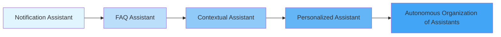
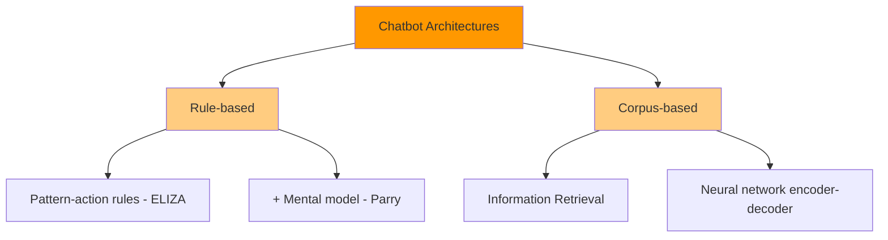
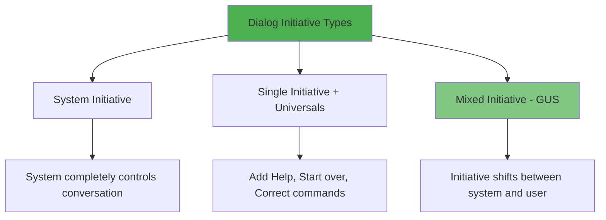
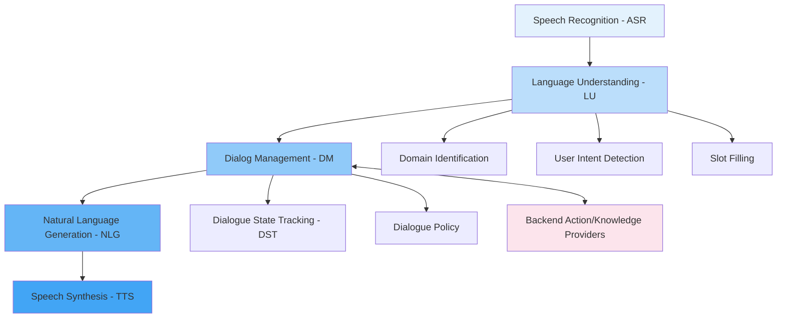
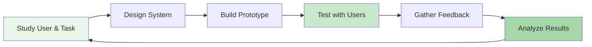

# Dialogue Systems and Chatbots - Comprehensive Study Guide

**Course:** Natural Language Processing Applications
**Institution:** BITS Pilani, Pilani Campus
**Instructor:** Dr. Chetana Gavankar, Ph.D (IIT Bombay-Monash University Australia)
**Session:** 5 - Dialogue Systems and Chatbots

---

## Table of Contents

### 1. [Introduction to Conversational AI](#1-introduction-to-conversational-ai)
   - 1.1 [Evolution of AI Assistants](#11-evolution-of-ai-assistants)
   - 1.2 [Conversational AI Approaches](#12-conversational-ai-approaches)
   - 1.3 [QA vs Conversational AI](#13-qa-vs-conversational-ai)
   - 1.4 [Types of Conversational Agents](#14-types-of-conversational-agents)

### 2. [Properties of Human Conversation](#2-properties-of-human-conversation)
   - 2.1 [Conversation Characteristics](#21-conversation-characteristics)
   - 2.2 [Speech Acts and Dialog Acts](#22-speech-acts-and-dialog-acts)
   - 2.3 [Challenges in Dialog Systems](#23-challenges-in-dialog-systems)
   - 2.4 [Context and Coreference](#24-context-and-coreference)

### 3. [Chatbots](#3-chatbots)
   - 3.1 [Chatbot Architectures](#31-chatbot-architectures)
   - 3.2 [Rule-Based Chatbots](#32-rule-based-chatbots)
   - 3.3 [IR-Based Chatbots](#33-ir-based-chatbots)
   - 3.4 [Neural Chatbots](#34-neural-chatbots)
   - 3.5 [Chatbots: Pros and Cons](#35-chatbots-pros-and-cons)

### 4. [Frame-Based Dialog Agents](#4-frame-based-dialog-agents)
   - 4.1 [Introduction to Frame-Based Systems](#41-introduction-to-frame-based-systems)
   - 4.2 [Frame Structure and Slots](#42-frame-structure-and-slots)
   - 4.3 [Dialog Initiative Types](#43-dialog-initiative-types)
   - 4.4 [GUS Architecture (1977)](#44-gus-architecture-1977)

### 5. [The Dialogue-State Architecture](#5-the-dialogue-state-architecture)
   - 5.1 [Architecture Overview](#51-architecture-overview)
   - 5.2 [Natural Language Understanding (NLU)](#52-natural-language-understanding-nlu)
   - 5.3 [Dialog Management (DM)](#53-dialog-management-dm)
   - 5.4 [Natural Language Generation (NLG)](#54-natural-language-generation-nlg)

### 6. [Natural Language Understanding](#6-natural-language-understanding)
   - 6.1 [Domain Classification](#61-domain-classification)
   - 6.2 [Intent Determination](#62-intent-determination)
   - 6.3 [Slot Filling](#63-slot-filling)
   - 6.4 [Machine Learning for Slot Filling](#64-machine-learning-for-slot-filling)
   - 6.5 [IOB/BIO Tagging](#65-iobbio-tagging)

### 7. [Dialog Management](#7-dialog-management)
   - 7.1 [Dialog State Tracking](#71-dialog-state-tracking)
   - 7.2 [Dialog Policy](#72-dialog-policy)
   - 7.3 [Siri's Condition-Action Rules](#73-siris-condition-action-rules)

### 8. [Evaluating Dialogue Systems](#8-evaluating-dialogue-systems)
   - 8.1 [NLU Component Evaluation](#81-nlu-component-evaluation)
   - 8.2 [Dialog Manager Evaluation](#82-dialog-manager-evaluation)
   - 8.3 [Slot Error Rate Examples](#83-slot-error-rate-examples)

### 9. [Dialogue System Design](#9-dialogue-system-design)
   - 9.1 [User-Centered Design Principles](#91-user-centered-design-principles)
   - 9.2 [Design Iteration Process](#92-design-iteration-process)

### 10. [Ethical Issues](#10-ethical-issues)
   - 10.1 [Bias in Training Data](#101-bias-in-training-data)
   - 10.2 [Microsoft Tay Case Study](#102-microsoft-tay-case-study)
   - 10.3 [Dataset Bias](#103-dataset-bias)
   - 10.4 [Gender Stereotypes](#104-gender-stereotypes)
   - 10.5 [Privacy Concerns](#105-privacy-concerns)

### 11. [Modern Approaches](#11-modern-approaches)
   - 11.1 [Comparison of Approaches](#111-comparison-of-approaches)
   - 11.2 [LLM-Based Systems](#112-llm-based-systems)
   - 11.3 [Agentic AI](#113-agentic-ai)
   - 11.4 [Component-wise Stack Comparison](#114-component-wise-stack-comparison)
   - 11.5 [Transfer Learning vs Fine-Tuning](#115-transfer-learning-vs-fine-tuning)

### 12. [Quick Reference Tables](#12-quick-reference-tables)

### 13. [Resources and References](#13-resources-and-references)

---

## 1. Introduction to Conversational AI

### 1.1 Evolution of AI Assistants

The evolution of AI assistants follows a progressive path:



**Progression Details:**

1. **Notification Assistant**: Basic notifications and alerts
2. **FAQ Assistant**: Answers frequently asked questions
3. **Contextual Assistant**: Understands context from conversation
4. **Personalized Assistant**: Knows users in detail, tailors responses to individual situations
5. **Autonomous Organization of Assistants**: Group of AI assistants that know every customer personally and run large parts of company operations (lead generation, marketing, sales, HR, finance)

### 1.2 Conversational AI Approaches

| Approach | Short Summary | Real-World Applications |
|----------|---------------|------------------------|
| **Rule-Based** | Fixed rules, decision trees, predictable responses | IVR phone menus, Banking/telecom FAQ bots, HR onboarding flows, Simple customer support chat |
| **IR-Based** | Retrieves best match from knowledge base using keywords or vector search | Enterprise FAQ search, E-commerce support, Airline & telecom chatbots, Government info portals |
| **Deep Learning (Pre-LLM)** | Seq2Seq / early Transformer models that generate basic responses | Smart reply suggestions, Domain-specific assistants, Simple virtual assistants |
| **LLM-Based** | Large pretrained models with reasoning, context understanding, and generative ability | Advanced chatbots, Coding assistants, Legal/medical Q&A (supervised), Enterprise RAG systems |
| **Agentic AI** | LLM + tools + memory → autonomous task execution and multi-step planning | Travel booking agents, Financial analysis bots, Customer service copilots, DevOps/coding agents, Workflow automation |

### 1.3 QA vs Conversational AI

| Aspect | Question Answering (QA) | Conversational AI |
|--------|------------------------|-------------------|
| **Definition** | A system that answers specific user questions | A system that engages in multi-turn dialogue with users |
| **Scope** | Narrow: Answering questions (often factual) | Broad: Dialogue, intent detection, emotion, context, etc. |
| **Example Task** | "What is the capital of France?" → "Paris" | "I'm planning a trip." → "Great! Where are you going?" |

### 1.4 Types of Conversational Agents

**AKA Dialog Agents:**

1. **Phone-based Personal Assistants**
   - SIRI (Apple)
   - Alexa (Amazon)
   - Cortana (Microsoft)
   - Google Assistant

2. **Specialized Applications**
   - Talking to your car
   - Pay bills
   - Sales, Marketing, Insurance
   - Clinical uses for mental health
   - Nurse bots
   - Dr. Bot
   - Lawyer bots
   - Chatting for fun (Mr. FriendBot)

---

## 2. Properties of Human Conversation

### 2.1 Conversation Characteristics

**Dialogue is a sequence of turns:**

```
C1: I need to travel in May.
A1: And, what day in May did you want to travel?
C2: OK uh I need to be there for a meeting that's from the 12th to the 15th.
A2: And you're flying into what city?
C3: Seattle.
```

### 2.2 Speech Acts and Dialog Acts

Conversations consist of different types of speech acts:

| Type | Description | Examples |
|------|-------------|----------|
| **Constatives** | Informing or stating facts | Answering, claiming, confirming, denying, disagreeing, stating |
| **Directives** | Requesting actions from others | Advising, asking, forbidding, inviting, ordering, requesting |
| **Commissives** | Committing to future actions | Promising, planning, vowing, betting, opposing |
| **Acknowledgments** | Social acts | Apologizing, greeting, thanking, accepting an acknowledgment |

### 2.3 Challenges in Dialog Systems

#### Grounding
Acknowledging that the hearer has understood the speaker

#### Dialog Structure
**Adjacency Pairs:** Composed of a first pair part and a second pair part
- QUESTIONS set up expectation for ANSWER
- PROPOSALS followed by ACCEPTANCE (or REJECTION)
- COMPLIMENTS often give rise to DOWNPLAYERS
  - Example: "Nice jacket!" → "Oh, this old thing?"

#### Clarification/Correction Questions
Can form a sub-dialogue between a REQUEST and a RESPONSE

**Example:**
```
User: What do you have going to UNKNOWN WORD on the 5th?
System: Let's see, going where on the 5th?
```

#### Inference
Users don't always directly answer questions:

```
A1: And, what day in May did you want to travel?
C2: OK uh I need to be there for a meeting that's from the 12th to the 15th.
```
Notice: Client mentions a meeting rather than directly answering the date question.

### 2.4 Context and Coreference

**Coreference** helps resolve ambiguities in virtual assistants:

**Example:**
```
U: "Book a table at Il Fornaio at 7:00 with my mom"
U: "Also send her an email reminder"
```
"her" refers to "my mom" from the previous utterance

**Clarification Questions:**
```
U: "Chicago pizza"
S: "Did you mean pizza restaurants in Chicago or Chicago-style pizza?"
```

---

## 3. Chatbots

### 3.1 Chatbot Architectures



**Two Classes of Systems:**
1. **Chatbots** - Sometimes for fun, originally designed as testbed for clinical therapy
2. **Task-oriented Dialog agents** - SIRI, interfaces to cars/robots, booking flights or restaurants

### 3.2 Rule-Based Chatbots

#### ELIZA (Weizenbaum, 1966)

**Example Dialogue:**
```
User: Men are all alike.
ELIZA: IN WHAT WAY

User: They're always bugging us about something or other.
ELIZA: CAN YOU THINK OF A SPECIFIC EXAMPLE

User: Well, my boyfriend made me come here.
ELIZA: YOUR BOYFRIEND MADE YOU COME HERE

User: He says I'm depressed much of the time.
ELIZA: I AM SORRY TO HEAR YOU ARE DEPRESSED

...

User: You are like my father in some ways.
ELIZA: WHAT RESEMBLANCE DO YOU SEE

User: You are not very aggressive but I think you don't want me to notice that.
ELIZA: WHAT MAKES YOU THINK I AM NOT AGGRESSIVE

User: You don't argue with me.
ELIZA: WHY DO YOU THINK I DON'T ARGUE WITH YOU

User: You are afraid of me.
ELIZA: DOES IT PLEASE YOU TO BELIEVE I'M AFRAID OF YOU

User: My father is afraid of everybody.
ELIZA: WHAT ELSE COMES TO MIND WHEN YOU THINK OF YOUR FATHER

User: Bullies.
ELIZA: DOES THAT HAVE ANYTHING TO DO WITH THE FACT THAT YOUR BOYFRIEND MADE YOU COME HERE
```

**Conceptualization Mapping:**

Each sentence is mapped into a conceptualization:
- A predication on a conceptual object
- A predication on a relation between two objects
- A predication on an attribute

**Example - Multiple ways to ask about work:**
```
What is your work?
What sort of work do you do?
Where do you work?
What do you do for a living?
What is your job?
Do you have a job?
What is your occupation?

All map to: (your work?)
```

**Complex Pattern/Transform Rules:**
- Different predicates (fear, afraid of)
- Ordering: "You are afraid of me" = "I frighten you"

#### Woebot - Modern Rule-Based Example

**Purpose:** Chatbot for delivering Cognitive Behavior Therapy via brief daily conversations

**Architecture:** Little decision tree of language and menu responses

**Sample Interactions:**
- "What's going on in your world right now?"
- "How are you feeling?"
- In response to endorsed loneliness: "I'm so sorry you're feeling lonely. I guess we all feel a little lonely sometimes"

**Research Findings:**
- 2-week experiment showed reduction in depression
- Did not show reduction in anxiety
- **Citation:** Fitzpatrick, Darcy, Vierhile, 2017. "Delivering Cognitive Behavior Therapy to Young Adults with Symptoms of Depression and Anxiety Using a Fully Automated Conversational Agent (Woebot): A Randomized Controlled Trial." JMIR Ment Health 4:2.

#### NLTK Chatbot Module

**Components:**
- **Chat class:** Contains all the logic used by the chatbot
- **Reflections:** Dictionary containing input values and corresponding output values (optional)

### 3.3 IR-Based Chatbots

**Core Idea:** Mine conversations of human chats or human-machine chats

**Data Sources:**
- Microblogs: Twitter or Weibo
- Movie dialogs
- Wikipedia text

**Examples:**
- Cleverbot (Carpenter 2017) - http://www.cleverbot.com
- Microsoft Tay
- COBOT chatbot (Isbell et al., 2000)
  - Used sentences from: Unabomber Manifesto, articles on alien abduction, scripts of "The Big Lebowski" and "Planet of the Apes"

#### Two IR-Based Architectures

**Architecture 1: Return the response to the most similar turn**
1. Take user's turn (q) and find a (tf-idf) similar turn t in corpus C
   ```
   q = "do you like Doctor Who"
   t' = "do you like Doctor Strangelove"
   ```
2. Grab whatever the response was to t
   ```
   Response: "Yes, so funny"
   ```

**Architecture 2: Return the most similar turn**
```
User: "do you like Doctor Who"
System: "Do you like Doctor Strangelove"
```

#### Cleverbot Conversation Example

```
User: Do you like Doctor Who?
Cleverbot: Yes, so funny
User: What's your favorite show?
Cleverbot: I don't have one
User: What's your name?
Cleverbot: Jason I already told you.
User: No your real name.
Cleverbot: Stephanie IS my real name.
User: I thought it was Jason?
Cleverbot: How did you come to that conclusion.
User: Because you said so.
Cleverbot: I have to do my homework.
```

**Additional Features:**
- Can use user features or prior turns
- Can use non-dialogue text

### 3.4 Neural Chatbots

**Core Concept:** Response generation as task of transducing from user's prior turn to system's turn

**Training Data:**
- Movie dialogue databases
- Twitter conversations

**Architecture:** Deep neural network mapping from user1 turn to user2 response

**Technology:** Adversarial neural networks use generative models
- Generate new data with same statistics as training set
- Example: GAN trained on photographs can generate new photographs that look superficially authentic

**Sample Output Issue:**
```
User: [Some question]
System: Oh I've never seen that! How long does it take you guys to learn the drill?
User: Like 2 weeks ago!!
```
(Shows issues with coherence)

### 3.5 Chatbots: Pros and Cons

#### Pros
- Fun to interact with
- Applications to counseling
- Good for narrow, scriptable applications

#### Cons
- They don't really understand
- Rule-based chatbots are precise but expensive to build
- IR-based or neural network chatbots can only mirror training data
- **Garbage-in, Garbage-out** problem

**The Future:** Combining chatbots with frame-based agents

---

## 4. Frame-Based Dialog Agents

### 4.1 Introduction to Frame-Based Systems

**Also called:** "Task-based dialog agents"

**Based on:** Domain ontology - a knowledge structure representing user intentions

**Components:**
- One or more frames
- Each frame is a collection of slots
- Each slot has a value

### 4.2 Frame Structure and Slots

**Example: Airline Travel Frame**

| Slot | Type | Question |
|------|------|----------|
| ORIGIN | city | What city are you leaving from? |
| DEST | city | Where are you going? |
| DEP_DATE | date | What day would you like to leave? |
| DEP_TIME | time | What time would you like to leave? |
| AIRLINE | line | What is your preferred airline? |

#### Complex Slot Types

**DATE Type Structure:**
```
DATE:
  - MONTH_NAME
  - DAY (1-31)
  - YEAR
  - WEEKDAY (member of days)
```

### 4.3 Dialog Initiative Types



#### System Initiative

**Definition:** System completely controls the conversation

**Control Structure:**


**Advantages (+):**
- Simple to build
- User always knows what they can say next
- System always knows what user can say next
  - Known words: Better performance from ASR (Automatic Speech Recognition)
  - Known topic: Better performance from NLU (Natural Language Understanding)
- OK for VERY simple tasks (entering credit card, login name and password)

**Disadvantages (-):**
- Too limited
- Real dialogue involves give and take
- Users might want to say something not directly answering the question

**Problems with System Initiative:**

Users might want to answer multiple questions at once:
```
"Hi, I'd like to fly from Seattle Tuesday morning"
"I want a flight from Milwaukee to Orlando one way leaving after 5 p.m. on Wednesday"
```

#### Single Initiative + Universals

**Improvement:** Give users more flexibility by adding universal commands

**Universal Commands (available in any state):**
- Help
- Start over
- Correct

**Limitation:** Still doesn't allow user much flexibility

#### Mixed Initiative (GUS Architecture)

**Definition:** The conversational initiative shifts between system and user

**Key Features:**
- System asks questions of user
- System fills any slots that user specifies
- When frame is filled, do database query
- If user answers 3 questions at once, system fills 3 slots and doesn't ask those questions again

**Advantages:**
- More natural conversation flow
- Efficient information gathering
- Flexible user interaction

### 4.4 GUS Architecture (1977)

**GUS:** Genial (friendly) Understander System

**Historical Significance:**
- Published in Artificial Intelligence Journal, 1977
- **Still the industrial state of the art**
- Many task-based bots use GUS architecture

**Reference:** https://nlp.stanford.edu/acvogel/gus.pdf

#### GUS 1977 Example Dialogue

```
GUS: Hello. My name is GUS. I can help you plan a simple trip by air.
     Where do you want to go?

Client: I want to go to San Diego on May 28

GUS: What time do you want to leave?

Client: I must be in San Diego before 10 am

GUS: Would you like P.S.A. flight 102 that arrives at 9.15 am?

Client: What is the next flight?

GUS: Air California flight 310 that leaves at 8.30am and arrives at 10.00am

Client: I'll take the first one

GUS: In what name should I make a reservation, please?

Client: Dan Bobrow

GUS: I have confirmed the following flight: P.S.A. flight 102 on Wednesday
     May 28 from San Jose to San Diego that leaves at 7.30 am and arrives
     at 9.15 am.
```

**Key Observations:**
- Mixed initiative: User provides multiple pieces of information at once
- System doesn't re-ask for information already provided
- Natural conversation flow
- Confirmation at end

---

## 5. The Dialogue-State Architecture

### 5.1 Architecture Overview

**Complete Task-Oriented Dialogue System Architecture:**



### 5.2 Natural Language Understanding (NLU)

**Three Main Tasks:**

1. **Domain Classification**
   - Asking weather?
   - Booking a flight?
   - Programming alarm clock?

2. **Intent Determination**
   - Find a Movie
   - Show Flight
   - Remove Calendar Appointment

3. **Slot Filling**
   - Extract the actual slots and fillers

### 5.3 Dialog Management (DM)

**Two Components:**

1. **Dialogue State Tracking (DST)**
   - Maintains current state of conversation
   - Handles errors and confidence scores
   - Tracks multiple hypotheses when ASR uncertain

2. **Dialogue Policy**
   - Determines agent actions based on state
   - Decides what to say or do next

### 5.4 Natural Language Generation (NLG)

**Goal:** Generate natural language or GUI given selected dialogue action

**Approaches:**
- Template-based responses
- Can vary between text and GUI outputs

**Example:**
```
Action: Inform(location="Taipei 101")
Text Output: "The nearest one is at Taipei 101"
GUI Output: Display map with location marker
```

---

## 6. Natural Language Understanding

### 6.1 Domain Classification

**Task:** Identify which domain the user's query belongs to

**Examples:**
- Weather domain
- Flight booking domain
- Alarm clock domain

### 6.2 Intent Determination

**Task:** Identify what the user wants to do

**Examples:**
- Find a Movie
- Show Flight
- Remove Calendar Appointment

### 6.3 Slot Filling

**Task:** Extract specific information pieces from user utterance

**Example 1: Flight Booking**
```
Input: "Show me morning flights from Boston to SF on Tuesday"

Output:
- DOMAIN: AIR-TRAVEL
- INTENT: SHOW-FLIGHTS
- ORIGIN-CITY: Boston
- DEST-CITY: San Francisco
- ORIGIN-DATE: Tuesday
- ORIGIN-TIME: morning
```

**Example 2: Alarm Clock**
```
Input: "Wake me tomorrow at six"

Output:
- DOMAIN: ALARM
- INTENT: SET-ALARM
- DATE: tomorrow
- TIME: six (6:00)
```

### 6.4 Machine Learning for Slot Filling

#### Rule-Based Approach

**Method:** Write regular expressions or grammar rules

**Example:**
```regex
Wake me (up) | set (the|an) alarm | get me up
```

**Process:**
1. Write pattern matching rules
2. Do text normalization
3. Extract slot values

#### Machine Learning Approach

**Use:** 1-of-N classifier (naive bayes, logistic regression, neural network)

**Three Separate Tasks:**

**Task 1: Domain and Intent Classification**
```
Input: "I want to fly to San Francisco on Monday afternoon please"
Features: word N-grams

Output:
- Domain: AIRLINE
- Intent: SHOWFLIGHT
```

**Task 2: Slot Presence Detection**
```
Input: "I want to fly to San Francisco on Monday afternoon please"
Features: word N-grams, gazetteers (lists of cities)

Output: Destination-City (slot present)
```

**Task 3: Slot Filler Extraction**
```
Input: "I want to fly to San Francisco on Monday afternoon please"
Features: word N-grams, gazetteers (lists of cities)

Output: San Francisco
```

**Requirements:** Lots of labeled training data

### 6.5 IOB/BIO Tagging

**More Sophisticated Algorithm for Slot Filling**

**Tag Types:**
- **B** - Beginning of slot
- **I** - Inside slot
- **O** - Outside any slot

**Formula:** 2n + 1 tags, where n is the number of slots

**Example Tags:**
- B-DESTINATION
- I-DESTINATION
- B-DEPART_TIME
- I-DEPART_TIME
- O (outside)

**Tagging Example:**
```
Sentence: "I want to fly to San Francisco on Monday afternoon please"

Tagging:
O   O    O  O   O  B-DEST I-DEST    O  B-DTIME  I-DTIME    O
I want to fly to San    Francisco on Monday  afternoon please
```

---

## 7. Dialog Management

### 7.1 Dialog State Tracking

**Purpose:** Maintain current state of dialogue

**Key Features:**
- Requires hand-crafted states
- Handles errors and confidence scores
- Tracks multiple hypotheses

**Example: Restaurant Finding**

**States tracked:**
- Location (where is the restaurant)
- Rating (quality rating)
- Type (cuisine type)

**Handling Uncertainty:**
```
ASR Output (uncertain): "taiwanese" vs "thai"
System Response: "Did you want Taiwanese food?"
(Confirm hypothesis with highest confidence)
```

**State Evolution:**
```
Initial State: {location: ?, rating: ?, type: ?}
After user input: {location: "Taipei 101", rating: ?, type: "taiwanese"}
```

### 7.2 Dialog Policy

**Purpose:** Determine agent actions based on current state

**Agent Action Types:**

| Action | Example | Purpose |
|--------|---------|---------|
| Inform(location="Taipei 101") | "The nearest one is at Taipei 101" | Provide information |
| Request(location) | "Where is your home?" | Ask for missing information |
| Confirm(type="taiwanese") | "Did you want Taiwanese food?" | Verify uncertain information |

**Decision Process:**
1. Examine current dialog state
2. Check what information is missing or uncertain
3. Select appropriate action (inform, request, or confirm)
4. Execute action through NLG

### 7.3 Siri's Condition-Action Rules

**Architecture:** Uses GUS architecture with Condition-Action Rules

**Active Ontology:** Relational network of concepts

**Data Structures Example - Meeting:**
- A date and time
- A location
- A topic
- A list of attendees

**Rule Sets for Date Concept:**
```
Input: "Monday at 2pm"
Process: Turn string into date object
Output: date(DAY, MONTH, YEAR, HOURS, MINUTES)
```

**Meeting Concept Rule Example:**
```
Rule: IF meeting object exists AND location is missing
      THEN ask for location
```

**Rule Structure:**
- **Condition:** Facts that must be true
- **Action:** What to do when condition is met

**Process:**
1. User input is processed
2. Facts added to store
3. Rule conditions are evaluated
4. Relevant actions executed

**Ontology Relationships:**
- has-a (required attributes)
- may-have-a (optional attributes)

---

## 8. Evaluating Dialogue Systems

### 8.1 NLU Component Evaluation

#### Metric 1: Slot Error Rate

**Formula:**
```
Slot Error Rate = (# of inserted/deleted/substituted slots) / (# of total reference slots)
```

**Importance:** Most important metric since slot tagging contributes maximum to dialog system quality

#### Metric 2: Intent Accuracy

**Definition:** Percentage of correctly identified intents

**Calculation:**
```
Intent Accuracy = (# of correctly identified intents) / (# of total test cases)
```

### 8.2 Dialog Manager Evaluation

#### Metric 1: State Tracking Accuracy

**Measures:** How accurately the system maintains dialog state across turns

#### Metric 2: Task Success (End-to-End Evaluation)

**Measures:** Whether the system successfully completed the user's task

**Example:** Was the correct meeting added to the calendar?

### 8.3 Slot Error Rate Examples

**Example 1:**
```
User Input: "Make an appointment with Chris at 10:30 in Gates 104"

System Output:
PERSON: Chris       ✓ (Correct)
TIME: 11:30 a.m.    ✗ (Should be 10:30)
ROOM: Gates 104     ✓ (Correct)

Slot Error Rate: 1/3 = 0.333

Task Success: At end, was the correct meeting added to the calendar?
Answer: No (wrong time)
```

**Analysis:**
- Correctly identified 2 out of 3 slots
- One substitution error (10:30 → 11:30)
- Task would fail due to wrong meeting time

---

## 9. Dialogue System Design

### 9.1 User-Centered Design Principles

**Two Core Principles:**

1. **Study the user and task**
   - Understand user needs
   - Analyze task requirements
   - Identify user pain points
   - Research user behavior patterns

2. **Iteratively test the design on users**
   - Build prototypes
   - Test with real users
   - Gather feedback
   - Refine and improve
   - Repeat the cycle

### 9.2 Design Iteration Process



**Iterative Cycle:**
1. Study users and their tasks
2. Design dialogue flows
3. Build working prototypes
4. Test with real users
5. Collect feedback and metrics
6. Analyze what works and what doesn't
7. Refine design based on insights
8. Return to step 2

---

## 10. Ethical Issues

### 10.1 Bias in Training Data

**Core Problem:** Machine learning systems replicate biases that occurred in the training data

**Impact:**
- Discriminatory outputs
- Reinforcement of stereotypes
- Unfair treatment of certain groups
- Perpetuation of societal biases

### 10.2 Microsoft Tay Case Study

**Timeline:**
- **Launched:** March 2016 on Twitter
- **Taken offline:** 16 hours later

**What Happened:**
- Started posting racial slurs
- Shared conspiracy theories
- Made personal attacks
- Learned from user interactions

**Reference:** Neff and Nagy, 2016

**Key Lesson:** Systems that learn from user interactions can quickly adopt harmful behaviors if not properly monitored and controlled

### 10.3 Dataset Bias

**Research:** Henderson et al. (2017) examined standard datasets

**Datasets Examined:**
- Twitter conversations
- Reddit discussions
- Movie dialogues

**Findings:**
- Examples of hate speech found
- Offensive language present
- Bias in original training data
- Bias in output of chatbots trained on the data

**Implication:** Need careful curation and filtering of training data

### 10.4 Gender Stereotypes

**Problem:** Dialog agents overwhelmingly given female names

**Impact:** Perpetuates female servant stereotype

**Reference:** Paolino, 2017

**Broader Context:**
- Most virtual assistants have female voices
- Reinforces gender roles
- Contributes to societal stereotypes
- Need for more diverse representation

**Fairness in Machine Learning:** Growing field addressing these issues

### 10.5 Privacy Concerns

**Historical Context:** Privacy issues noticed since Weizenbaum's time

**Key Concerns:**

**Scenario 1: Unintended Recording**
```
User: "Computer, turn on the lights"
[User answers phone]
User: "Hi, yes, my password is..."
[System records everything]
```

**Risk:** Agents may record sensitive data unintentionally

**Scenario 2: Training Data**
- Recorded conversations may be used to train seq2seq models
- Personal information becomes part of training corpus
- Privacy implications for user data

**Best Practices Needed:**
- Clear privacy policies
- User consent for data usage
- Secure data storage
- Data anonymization
- Transparent data practices

---

## 11. Modern Approaches

### 11.1 Comparison of Approaches

**Detailed Comparison Table:**

| Approach | Architecture | Pros | Cons | Best Used For / Applications |
|----------|-------------|------|------|------------------------------|
| **1. Rule-Based** | Decision trees, flowcharts | - Easy to implement<br>- Predictable behavior | - Hard-coded<br>- Not scalable<br>- Poor with ambiguity | - Simple FAQs<br>- IVR systems<br>- Basic customer