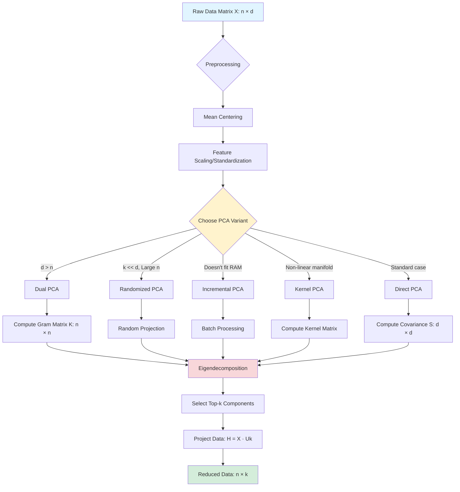
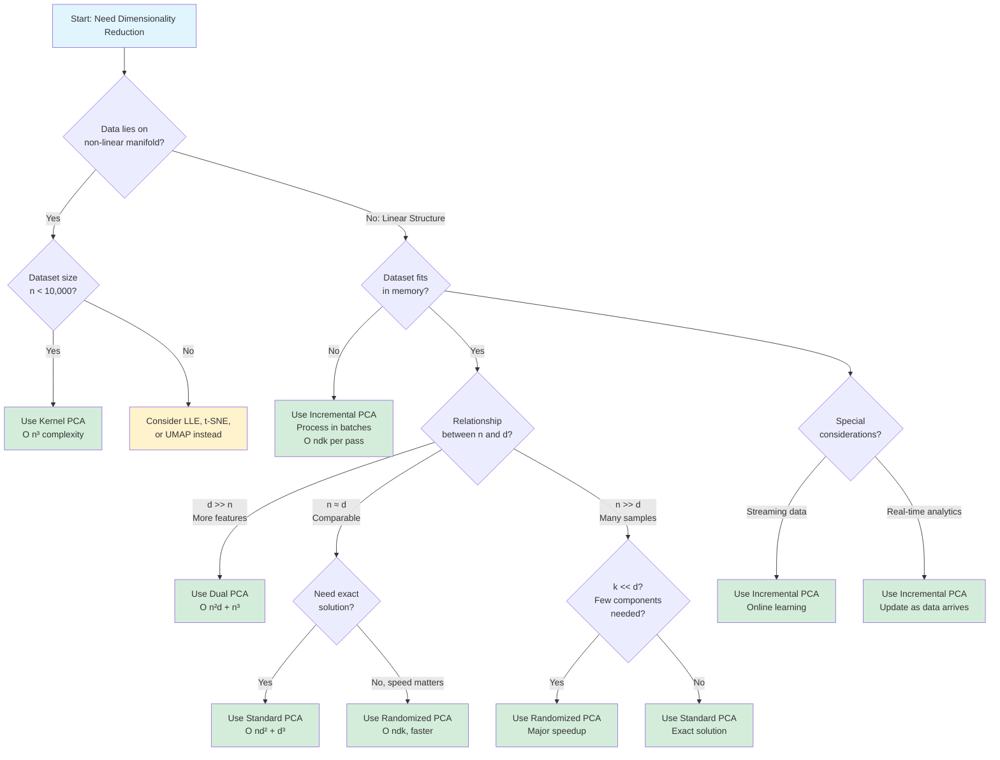
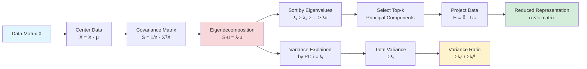
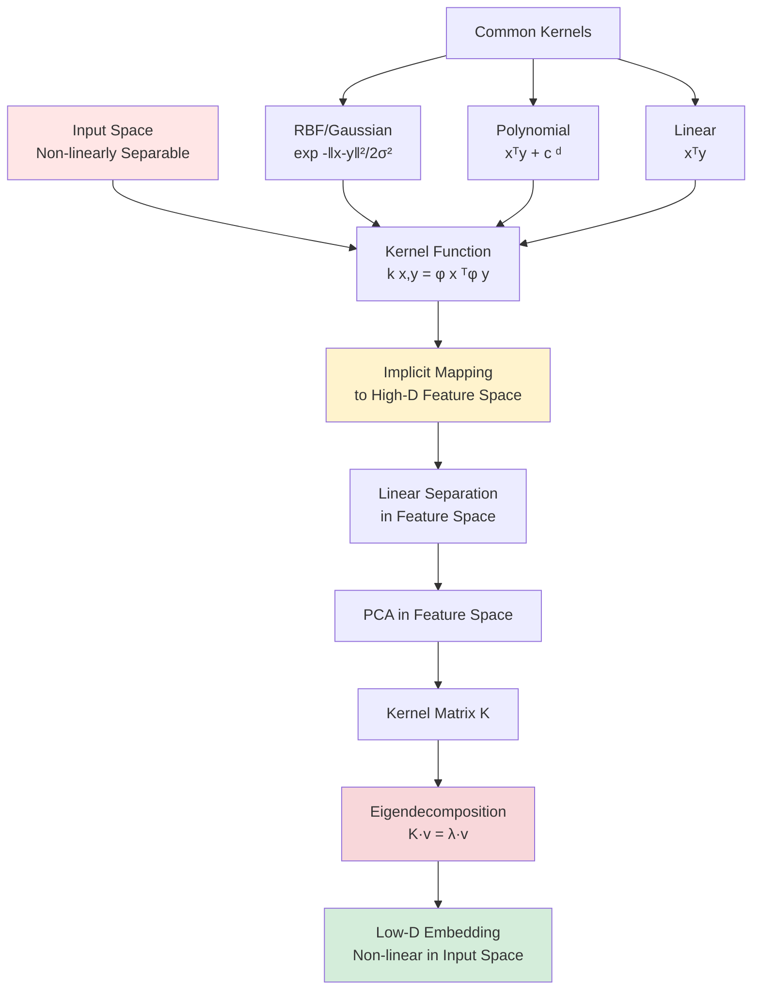
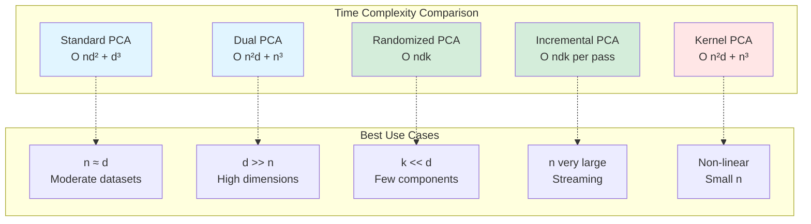
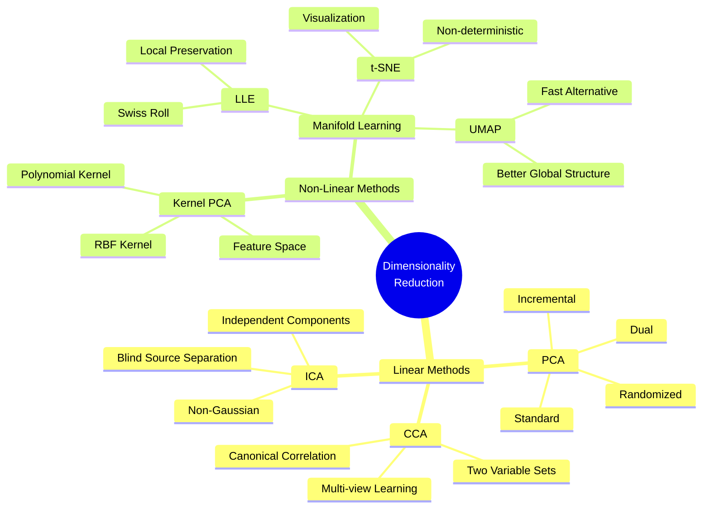
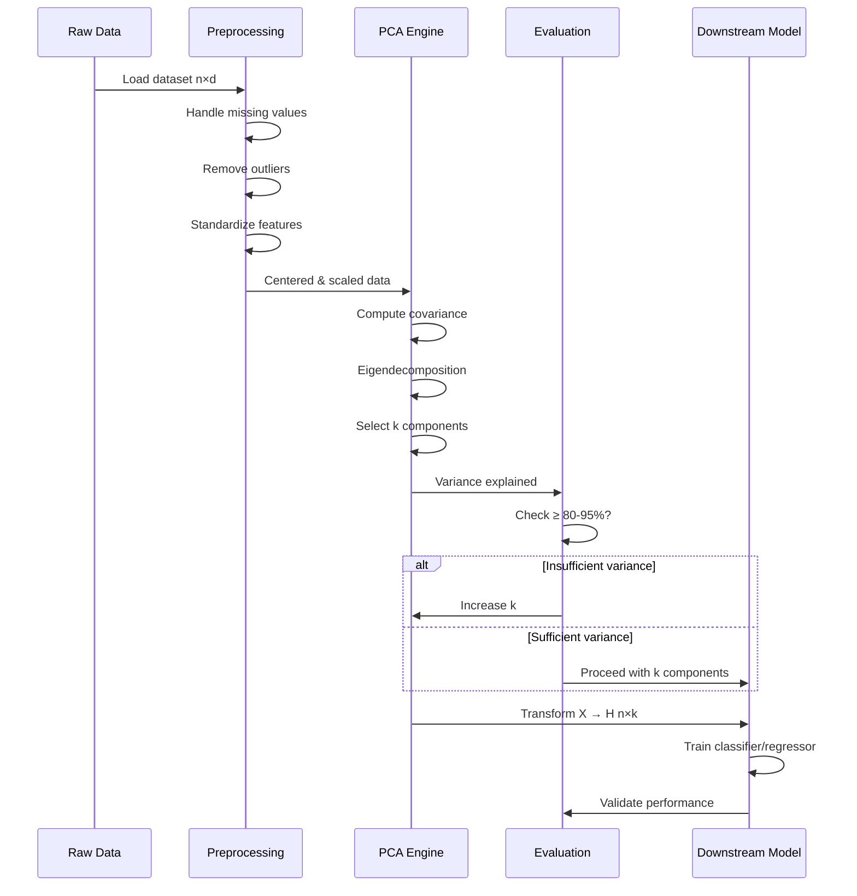
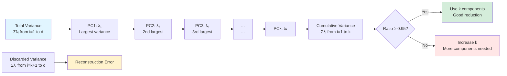

# CS2 - PCA and Its Variants

---

## Table of Contents

- [CS2 - PCA and Its Variants](#cs2---pca-and-its-variants)
  - [Table of Contents](#table-of-contents)
  - [Quick Links \& References](#quick-links--references)
  - [Visualizations \& Diagrams](#visualizations--diagrams)
    - [PCA Workflow Diagram](#pca-workflow-diagram)
    - [PCA Variants Decision Tree](#pca-variants-decision-tree)
    - [PCA Mathematical Foundation](#pca-mathematical-foundation)
    - [Kernel PCA Concept](#kernel-pca-concept)
    - [Complexity Comparison Visualization](#complexity-comparison-visualization)
    - [Dimensionality Reduction Techniques Landscape](#dimensionality-reduction-techniques-landscape)
    - [PCA Application Pipeline](#pca-application-pipeline)
    - [Variance Explained Concept](#variance-explained-concept)
  - [1. Introduction to Factor Analysis](#1-introduction-to-factor-analysis)
    - [1.1 Motivation \& Applications](#11-motivation--applications)
      - [Why Do We Need Factor Analysis?](#why-do-we-need-factor-analysis)
      - [Real-World Scenarios](#real-world-scenarios)
    - [1.2 Latent Factors vs Observed Variables](#12-latent-factors-vs-observed-variables)
    - [1.3 Dimensionality Reduction Objectives](#13-dimensionality-reduction-objectives)
  - [2. Principal Component Analysis (PCA)](#2-principal-component-analysis-pca)
    - [2.1 Mathematical Foundation](#21-mathematical-foundation)
      - [2.1.1 Covariance and Variance](#211-covariance-and-variance)
      - [2.1.2 Variance Maximization Objective](#212-variance-maximization-objective)
      - [2.1.3 Eigenvalue Decomposition](#213-eigenvalue-decomposition)
    - [2.2 Direct PCA Formulation](#22-direct-pca-formulation)
    - [2.3 Dual PCA Formulation](#23-dual-pca-formulation)
    - [2.4 Geometric Interpretation](#24-geometric-interpretation)
    - [2.5 Information Loss \& Reconstruction](#25-information-loss--reconstruction)
    - [2.6 PCA Algorithm \& Pseudocode](#26-pca-algorithm--pseudocode)
  - [3. PCA Variants: Detailed Analysis](#3-pca-variants-detailed-analysis)
    - [3.1 Standard PCA](#31-standard-pca)
    - [3.2 Randomized PCA](#32-randomized-pca)
    - [3.3 Incremental PCA](#33-incremental-pca)
    - [3.4 Kernel PCA](#34-kernel-pca)
  - [4. Comprehensive Comparison of PCA Variants](#4-comprehensive-comparison-of-pca-variants)
    - [4.1 Quick Reference Comparison Table](#41-quick-reference-comparison-table)
    - [4.2 Mathematical Formulation Comparison](#42-mathematical-formulation-comparison)
    - [4.3 Computational Complexity Analysis](#43-computational-complexity-analysis)
      - [Detailed Breakdown](#detailed-breakdown)
      - [Scalability Comparison](#scalability-comparison)
    - [4.4 Strengths \& Weaknesses Matrix](#44-strengths--weaknesses-matrix)
      - [Standard PCA](#standard-pca)
      - [Randomized PCA](#randomized-pca)
      - [Incremental PCA](#incremental-pca)
      - [Kernel PCA](#kernel-pca)
    - [4.5 Use-Case Decision Framework](#45-use-case-decision-framework)
      - [Decision Tree](#decision-tree)
      - [Scenario-Based Recommendations](#scenario-based-recommendations)
    - [4.6 Practical Guidelines \& Selection Criteria](#46-practical-guidelines--selection-criteria)
      - [Quantitative Selection Rules](#quantitative-selection-rules)
      - [Hyperparameter Tuning](#hyperparameter-tuning)
  - [5. Related Techniques](#5-related-techniques)
    - [5.1 Independent Component Analysis (ICA)](#51-independent-component-analysis-ica)
    - [5.2 Canonical Correlation Analysis (CCA)](#52-canonical-correlation-analysis-cca)
    - [5.3 Locally Linear Embeddings (LLE)](#53-locally-linear-embeddings-lle)
    - [5.4 t-SNE](#54-t-sne)
  - [6. Exam Preparation](#6-exam-preparation)
    - [6.1 Formula Sheet](#61-formula-sheet)
    - [6.2 Practice Questions](#62-practice-questions)
    - [6.3 Derivation Examples](#63-derivation-examples)
    - [6.4 Common Mistakes \& Pitfalls](#64-common-mistakes--pitfalls)
  - [7. Key Takeaways \& Summary](#7-key-takeaways--summary)
    - [Core Concepts](#core-concepts)
    - [Best Practices Checklist](#best-practices-checklist)
    - [Exam Strategy](#exam-strategy)
    - [Decision Tree Summary](#decision-tree-summary)

---

## Quick Links & References

| Resource Type | Description | Reference/Link |
|--------------|-------------|----------------|
| **Primary Textbook** | Hands-On Machine Learning with Scikit-Learn, Keras, and TensorFlow | Chapter 8 |
| **Sklearn Documentation** | PCA Implementation | `sklearn.decomposition.PCA` |
| **Sklearn Documentation** | Kernel PCA | `sklearn.decomposition.KernelPCA` |
| **Sklearn Documentation** | Incremental PCA | `sklearn.decomposition.IncrementalPCA` |
| **Research Paper** | Randomized PCA Algorithm | Halko et al. (2011) |
| **Research Paper** | Kernel PCA | Schölkopf et al. (1998) |
| **Concept** | Manifold Learning | Non-linear dimensionality reduction |
| **Technique** | Kernel Trick | Feature space mapping without explicit computation |
| **Application** | Face Recognition | Eigenfaces method |
| **Application** | Image Compression | Lossy compression using PCA |

---

## Visualizations & Diagrams

### PCA Workflow Diagram



### PCA Variants Decision Tree



### PCA Mathematical Foundation



### Kernel PCA Concept



### Complexity Comparison Visualization



### Dimensionality Reduction Techniques Landscape



### PCA Application Pipeline



### Variance Explained Concept



---

## 1. Introduction to Factor Analysis

### 1.1 Motivation & Applications

**Factor Analysis** or **Component Analysis** aims to discover a new set of factors/dimensions/axes to represent, describe, or evaluate data more effectively.

#### Why Do We Need Factor Analysis?

**[✓] Key Objectives:**
* More effective reasoning and insights
* Better data visualization
* Noise reduction in data
* Dimensionality reduction (smaller set of factors)
* Better representation without losing much information
* More effective downstream analyses: classification, clustering, pattern recognition

#### Real-World Scenarios

**Scenario 1: Unobservable Phenomena**
```
Psychology: ego, personality, intelligence
→ Cannot be directly measured
→ Need to identify underlying latent factors from observable data
```

**Scenario 2: High-Dimensional Data**
```
Problem: Too many observations and dimensions
- Difficult to reason about or gain insights
- Hard to visualize
- Contains excessive noise
- Requires reduction to smaller factor set

Solution: Factor Analysis
→ Combine observed variables into meaningful factors
→ Physical meaning may be obscure but insights are clearer
```

**Scenario 3: Hidden Relationships**
```
Example: Text Search
- "beautiful car" and "gorgeous automobile" are closely related
- "driver" and "automobile" are also related
- But does your search engine know this?

Factor Analysis discovers these hidden relationships
→ Reduces noise and errors in results
→ Enables semantic understanding
```

### 1.2 Latent Factors vs Observed Variables

**Observed Variables:**
* Direct measurements from data
* High-dimensional (e.g., pixel values, word frequencies)
* May contain redundancy and noise
* Original representation

**Latent Factors:**
* Derived combinations of observed variables
* Lower-dimensional representation
* Capture underlying structure
* May lack direct physical interpretation but provide better insights

**Mathematical Relationship:**

$$\mathbf{x} = \sum_{i=1}^{k} a_i \mathbf{s}_i$$

where:
- $\mathbf{x}$ = observed data vector
- $\mathbf{s}_i$ = latent factors (basis coefficients)
- $a_i$ = basis vectors
- $k$ = number of factors (typically $k \ll d$, where $d$ is original dimensionality)

### 1.3 Dimensionality Reduction Objectives

**Primary Goals:**

1. **Variance Preservation**
   - Retain maximum information
   - Minimize reconstruction error
   - Preserve data structure

2. **Computational Efficiency**
   - Faster training and inference
   - Reduced memory requirements
   - Better scalability

3. **Improved Model Performance**
   - Remove multicollinearity
   - Reduce overfitting
   - Better generalization

4. **Interpretability** (where possible)
   - Understand key factors
   - Explain variations in data
   - Domain-specific insights

---

## 2. Principal Component Analysis (PCA)

**Definition:** PCA is an exploratory technique used to reduce the dimensionality of datasets to 2D or 3D while preserving maximum variance.

### 2.1 Mathematical Foundation

#### 2.1.1 Covariance and Variance

**Variance** measures the spread of data points around their mean in one dimension:

$$\text{Var}(X) = \frac{1}{n} \sum_{i=1}^{n} (x_i - \bar{x})^2$$

**Covariance** measures how two dimensions vary together:

$$\text{Cov}(X, Y) = \frac{1}{n} \sum_{i=1}^{n} (x_i - \bar{x})(y_i - \bar{y})$$

**Interpretation:**
* **Positive Covariance:** Both dimensions increase/decrease together
* **Negative Covariance:** One increases while the other decreases
* **Zero Covariance:** No linear relationship

**Covariance Matrix** for $d$-dimensional data:

$$\mathbf{S} = \frac{1}{n} \sum_{i=1}^{n} (\mathbf{x}_i - \bar{\mathbf{x}})(\mathbf{x}_i - \bar{\mathbf{x}})^T$$

**Properties:**
* Symmetric: $\mathbf{S} = \mathbf{S}^T$
* Positive semi-definite: $\mathbf{x}^T \mathbf{S} \mathbf{x} \geq 0$ for all $\mathbf{x}$
* Size: $d \times d$ for $d$-dimensional data

#### 2.1.2 Variance Maximization Objective

**PCA Goal:** Find directions (principal components) that maximize variance in the projected data.

**First Principal Component:**

$$\mathbf{w}_1 = \arg\max_{\|\mathbf{w}\|=1} \mathbf{w}^T \mathbf{S} \mathbf{w}$$

**Intuition:**
- Find unit vector $\mathbf{w}$ that, when data is projected onto it, has maximum variance
- This direction captures the most information about the data

#### 2.1.3 Eigenvalue Decomposition

**Key Insight:** The solution to PCA's optimization problem comes from eigendecomposition of the covariance matrix.

**Lagrangian Formulation:**

$$\mathcal{L}(\mathbf{w}, \lambda) = \mathbf{w}^T \mathbf{S} \mathbf{w} - \lambda (\mathbf{w}^T \mathbf{w} - 1)$$

Taking the derivative and setting to zero:

$$\frac{\partial \mathcal{L}}{\partial \mathbf{w}} = 2\mathbf{S}\mathbf{w} - 2\lambda\mathbf{w} = 0$$

$$\mathbf{S}\mathbf{w} = \lambda\mathbf{w}$$

**Solution:** $\mathbf{w}$ is an eigenvector of $\mathbf{S}$ with eigenvalue $\lambda$!

**Variance along this direction:**

$$\mathbf{w}^T \mathbf{S} \mathbf{w} = \mathbf{w}^T (\lambda \mathbf{w}) = \lambda$$

**Therefore:** To maximize variance, choose eigenvector with largest eigenvalue.

### 2.2 Direct PCA Formulation

**Step-by-Step Algorithm:**

**Input:** Data matrix $\mathbf{X} \in \mathbb{R}^{n \times d}$ ($n$ samples, $d$ features)

**Step 1: Mean Centering**

$$\tilde{\mathbf{X}} = \mathbf{X} - \mathbf{1}_n \bar{\mathbf{x}}^T$$

**Step 2: Compute Covariance Matrix**

$$\mathbf{S} = \frac{1}{n} \tilde{\mathbf{X}}^T \tilde{\mathbf{X}} \in \mathbb{R}^{d \times d}$$

**Step 3: Eigenvalue Decomposition**

$$\mathbf{S} \mathbf{u}_i = \lambda_i \mathbf{u}_i, \quad i = 1, 2, \ldots, d$$

Sort eigenvalues: $\lambda_1 \geq \lambda_2 \geq \cdots \geq \lambda_d \geq 0$

**Step 4: Select Top-k Components**

$$\mathbf{U}_k = [\mathbf{u}_1 | \mathbf{u}_2 | \cdots | \mathbf{u}_k] \in \mathbb{R}^{d \times k}$$

**Step 5: Project Data**

$$\mathbf{H} = \tilde{\mathbf{X}} \mathbf{U}_k \in \mathbb{R}^{n \times k}$$

**Complexity Analysis:**
- Covariance computation: $O(nd^2)$
- Eigendecomposition: $O(d^3)$
- **Total: $O(nd^2 + d^3)$**
- **Best when:** $n \gg d$ (many samples, few features)

### 2.3 Dual PCA Formulation

When $n < d$ (more features than samples), **Dual PCA** is more efficient.

**Key Idea:** Instead of $\mathbf{S} = \frac{1}{n}\tilde{\mathbf{X}}^T \tilde{\mathbf{X}}$ (size $d \times d$), use Gram matrix $\mathbf{K} = \frac{1}{n}\tilde{\mathbf{X}} \tilde{\mathbf{X}}^T$ (size $n \times n$).

**Mathematical Relationship:**

If $\mathbf{v}$ is an eigenvector of $\mathbf{K}$:

$$\mathbf{K} \mathbf{v} = \lambda \mathbf{v}$$

Then $\mathbf{u} = \tilde{\mathbf{X}}^T \mathbf{v}$ is an eigenvector of $\mathbf{S}$ with the same eigenvalue.

**Dual PCA Algorithm:**

**Step 2: Compute Gram Matrix**

$$\mathbf{K} = \frac{1}{n} \tilde{\mathbf{X}} \tilde{\mathbf{X}}^T \in \mathbb{R}^{n \times n}$$

**Step 3: Eigenvalue Decomposition of Gram Matrix**

$$\mathbf{K} \mathbf{v}_i = \lambda_i \mathbf{v}_i$$

**Step 4: Recover Principal Components**

$$\mathbf{u}_i = \frac{1}{\sqrt{n\lambda_i}} \tilde{\mathbf{X}}^T \mathbf{v}_i$$

**Complexity:** $O(n^2 d + n^3)$ - **Best when:** $d \gg n$

### 2.4 Geometric Interpretation

**PCA as Rotation + Projection:**

1. **Rotation:** PCA finds a new coordinate system (principal axes) aligned with directions of maximum variance
2. **Projection:** Data is projected onto top-k principal axes
3. **Result:** Data lies primarily along fewer dimensions

**Key Properties:**
* Principal components are **orthogonal** (perpendicular to each other)
* First PC captures **maximum variance**
* Each subsequent PC captures **maximum remaining variance**
* PCs are **uncorrelated** in transformed space

### 2.5 Information Loss & Reconstruction

**Variance Explained:**

$$\text{Variance Explained} = \frac{\sum_{i=1}^{k} \lambda_i}{\sum_{i=1}^{d} \lambda_i}$$

**Reconstruction Error:**

$$\text{Error} = \frac{1}{n} \sum_{i=k+1}^{d} \lambda_i$$

**Rule of Thumb:**
* Retain components explaining ≥ 80-95% of total variance

### 2.6 PCA Algorithm & Pseudocode

```python
ALGORITHM: Principal Component Analysis

INPUT:  X (n × d), k (number of components)
OUTPUT: U_k (d × k), H (n × k), explained_variance

PROCEDURE:
  1. Center: X_centered = X - mean(X)
  2. Covariance: S = (1/n) * X_centered.T @ X_centered
  3. Eigendecomp: eigenvalues, eigenvectors = eig(S)
  4. Sort by eigenvalues (descending)
  5. Select top-k: U_k = eigenvectors[:, :k]
  6. Project: H = X_centered @ U_k
  7. Explained variance = sum(eigenvalues[:k]) / sum(eigenvalues)

  RETURN U_k, H, explained_variance
```

---

## 3. PCA Variants: Detailed Analysis

### 3.1 Standard PCA

**Already covered in Section 2.2 (Direct PCA)**

**Summary:**
* **Method:** Eigendecomposition of covariance matrix
* **Best for:** Moderate-sized datasets where $n$ and $d$ are comparable
* **Advantages:** Exact solution, well-understood, stable
* **Limitations:** Computational cost for very large datasets

### 3.2 Randomized PCA

**Motivation:** Standard PCA has $O(nd^2 + d^3)$ complexity, prohibitive for very large datasets or when we only need top-k components.

**Key Idea:** Use randomized algorithms to approximate top-k principal components much faster.

**Algorithm Overview:**

1. Generate random matrix $\Omega \in \mathbb{R}^{d \times (k+p)}$ (p = oversampling parameter, typically 5-10)
2. Compute $\mathbf{Y} = \tilde{\mathbf{X}} \Omega$
3. QR decomposition: $\mathbf{Y} = \mathbf{Q} \mathbf{R}$
4. Compute $\mathbf{B} = \mathbf{Q}^T \tilde{\mathbf{X}}$
5. SVD of small matrix: $\mathbf{B} = \tilde{\mathbf{U}} \Sigma \mathbf{V}^T$
6. Recover PCs: $\mathbf{U}_k = \mathbf{Q} \tilde{\mathbf{U}}[:, :k]$

**Complexity:** $O(nd \cdot k)$ - **Massive speedup when $k \ll \min(n, d)$**

**When to Use:**
* Very large datasets ($n > 10^6$ or $d > 10^4$)
* Only need top-k components where $k < 100$
* Willing to accept small approximation error

**Trade-offs:**
* ✓ Much faster than exact PCA
* ✓ Lower memory requirements
* × Approximate solution (not exact)
* × Non-deterministic

### 3.3 Incremental PCA

**Motivation:** Standard PCA requires entire dataset in memory. For datasets too large to fit in RAM or streaming data, we need an online/incremental approach.

**Key Idea:** Process data in mini-batches and incrementally update principal components.

**How It Works:**

1. **Divide Data into Batches:** $\mathbf{X}_1, \mathbf{X}_2, \ldots, \mathbf{X}_m$
2. **Partial Fit on Each Batch:** Update components incrementally
3. **Final Transformation:** Use final components to transform data

**Complexity:**
* **Time per batch:** $O(b \cdot d \cdot k)$ where $b$ is batch size
* **Total time:** $O(n \cdot d \cdot k)$
* **Space:** $O(b \cdot d)$ (only one batch in memory)

**Advantages:**
* ✓ Memory efficient - processes data in chunks
* ✓ Suitable for streaming data
* ✓ Scalable to arbitrarily large datasets
* ✓ Online learning capability

**Limitations:**
* × Approximate results
* × Convergence depends on batch order
* × Computational overhead from repeated updates

**Use Cases:**
* Real-time analytics
* Streaming data processing
* Very large datasets (doesn't fit in RAM)
* Online learning scenarios

### 3.4 Kernel PCA

**Motivation:** Standard PCA is **linear** - it fails when data lies on a **non-linear manifold**.

**Example:** Swiss roll (3D spiral) - Linear PCA projects onto 2D plane, losing intrinsic structure.

**Key Idea:** Map data to high-dimensional feature space using $\phi(\cdot)$, then perform PCA there.

**The Kernel Trick:**

Instead of computing $\phi(\mathbf{x})$ explicitly, use kernel function:

$$k(\mathbf{x}_i, \mathbf{x}_j) = \phi(\mathbf{x}_i)^T \phi(\mathbf{x}_j)$$

**Kernel PCA Algorithm:**

**Step 1: Compute Kernel Matrix**

$$\mathbf{K}_{ij} = k(\mathbf{x}_i, \mathbf{x}_j), \quad \mathbf{K} \in \mathbb{R}^{n \times n}$$

**Step 2: Center the Kernel Matrix**

$$\tilde{\mathbf{K}} = \mathbf{K} - \mathbf{1}_n \mathbf{K} - \mathbf{K} \mathbf{1}_n + \mathbf{1}_n \mathbf{K} \mathbf{1}_n$$

**Step 3: Eigendecomposition**

$$\tilde{\mathbf{K}} \mathbf{v}_i = \lambda_i \mathbf{v}_i$$

**Common Kernels:**

1. **RBF (Gaussian)**:
   $$k(\mathbf{x}, \mathbf{y}) = \exp\left(-\frac{\|\mathbf{x} - \mathbf{y}\|^2}{2\sigma^2}\right)$$

2. **Polynomial**:
   $$k(\mathbf{x}, \mathbf{y}) = (\mathbf{x}^T \mathbf{y} + c)^d$$

**When to Use:**

✓ **Use when:**
* Data has non-linear structure
* Standard PCA fails to separate classes
* Need to capture non-linear relationships

× **Don't use when:**
* Data is linearly separable
* Dataset is extremely large ($O(n^3)$ complexity)
* Interpretability is critical

**Complexity:**
* **Time:** $O(n^3)$
* **Space:** $O(n^2)$
* **Much more expensive** than linear PCA!

---

## 4. Comprehensive Comparison of PCA Variants

### 4.1 Quick Reference Comparison Table

| **Criterion** | **Standard PCA** | **Randomized PCA** | **Incremental PCA** | **Kernel PCA** |
|---------------|------------------|-------------------|---------------------|----------------|
| **Time Complexity** | $O(nd^2 + d^3)$ | $O(ndk)$ | $O(ndk)$ | $O(n^3)$ |
| **Space Complexity** | $O(nd + d^2)$ | $O(nk)$ | $O(bd)$ | $O(n^2)$ |
| **Exact/Approximate** | Exact | Approximate | Approximate | Exact |
| **Deterministic** | Yes | No | Yes | Yes |
| **Linear/Non-linear** | Linear | Linear | Linear | Non-linear |
| **Online Learning** | No | No | Yes | No |
| **Best Dataset Size** | $n, d < 10^4$ | $n, d > 10^6$ | $n$ very large | $n < 10^4$ |
| **Interpretability** | High | High | High | Low |
| **Handles Streaming** | No | No | Yes | No |
| **Memory Efficiency** | Moderate | High | Very High | Low |
| **Accuracy** | Exact | High | Moderate | Exact |
| **Manifold Preservation** | No | No | No | Yes |

### 4.2 Mathematical Formulation Comparison

| **PCA Variant** | **Key Equation** | **What It Computes** |
|-----------------|------------------|----------------------|
| **Standard PCA** | $\mathbf{S} = \frac{1}{n}\tilde{\mathbf{X}}^T\tilde{\mathbf{X}}$ <br> $\mathbf{S}\mathbf{u} = \lambda\mathbf{u}$ | Eigenvectors of covariance ($d \times d$) |
| **Dual PCA** | $\mathbf{K} = \frac{1}{n}\tilde{\mathbf{X}}\tilde{\mathbf{X}}^T$ <br> $\mathbf{K}\mathbf{v} = \lambda\mathbf{v}$ | Eigenvectors of Gram matrix ($n \times n$) |
| **Randomized PCA** | $\mathbf{Y} = \tilde{\mathbf{X}}\Omega$ <br> SVD$(\mathbf{Q}^T\tilde{\mathbf{X}})$ | Approximate top-k via random projection |
| **Incremental PCA** | $\mathbf{S}^{(t)} = \alpha\mathbf{S}^{(t-1)} + (1-\alpha)\mathbf{S}_{\text{batch}}$ | Iterative covariance update |
| **Kernel PCA** | $\tilde{\mathbf{K}}_{ij} = k(\mathbf{x}_i, \mathbf{x}_j)$ <br> $\tilde{\mathbf{K}}\mathbf{v} = \lambda\mathbf{v}$ | Eigenvectors of kernel matrix |

### 4.3 Computational Complexity Analysis

#### Detailed Breakdown

**Standard PCA:**

| Operation | Complexity | Notes |
|-----------|-----------|-------|
| Mean computation | $O(nd)$ | Single pass through data |
| Centering data | $O(nd)$ | Subtract mean |
| Covariance matrix | $O(nd^2)$ | $\tilde{\mathbf{X}}^T\tilde{\mathbf{X}}$ |
| Eigendecomposition | $O(d^3)$ | Dominant when $d$ large |
| **Total** | **$O(nd^2 + d^3)$** | **Bottleneck: eigendecomp** |

**Dual PCA:**

| Operation | Complexity | Notes |
|-----------|-----------|-------|
| Gram matrix | $O(n^2d)$ | $\tilde{\mathbf{X}}\tilde{\mathbf{X}}^T$ |
| Eigendecomposition | $O(n^3)$ | $n \times n$ matrix |
| Recover components | $O(ndk)$ | $\mathbf{u}_i = \tilde{\mathbf{X}}^T\mathbf{v}_i$ |
| **Total** | **$O(n^2d + n^3)$** | **Better when $d \gg n$** |

**Randomized PCA:**

| Operation | Complexity | Notes |
|-----------|-----------|-------|
| Random projection | $O(ndk)$ | $\mathbf{Y} = \tilde{\mathbf{X}}\Omega$ |
| QR decomposition | $O(nk^2)$ | Orthogonalize |
| SVD of small matrix | $O(k^2d)$ | $(k \times d)$ matrix |
| **Total** | **$O(ndk)$** | **Massive speedup when $k \ll d$** |

**Incremental PCA:**

| Operation | Complexity | Notes |
|-----------|-----------|-------|
| Per-batch update | $O(bdk)$ | Batch size $b$ |
| Total (m batches) | $O(ndk)$ | $m = n/b$ |
| **Total** | **$O(ndk)$** | **Better memory** |

**Kernel PCA:**

| Operation | Complexity | Notes |
|-----------|-----------|-------|
| Kernel matrix | $O(n^2d)$ | All pairwise kernels |
| Eigendecomposition | $O(n^3)$ | $n \times n$ matrix |
| **Total** | **$O(n^2d + n^3)$** | **Very expensive** |

#### Scalability Comparison

```
Dataset Size vs. Preferred Method:

n < 1,000, d < 100:
    → Standard PCA (exact, fast enough)

n > 100,000, d < 1,000:
    → Randomized PCA (if k << d)
    → Incremental PCA (if memory-constrained)

d > 10,000, n < 10,000:
    → Dual PCA
    → Randomized PCA (if k << d)

n > 1,000,000 (doesn't fit RAM):
    → Incremental PCA (only option)

Non-linear manifold, n < 5,000:
    → Kernel PCA

Non-linear manifold, n > 5,000:
    → Consider LLE, t-SNE, UMAP instead
```

### 4.4 Strengths & Weaknesses Matrix

#### Standard PCA

**Strengths [✓]:**
* Exact solution (no approximation)
* Deterministic (same result every run)
* Well-studied and understood
* Efficient for moderate datasets
* Clear variance interpretation
* Stable and robust

**Weaknesses [×]:**
* $O(d^3)$ prohibitive for high dimensions
* Requires entire dataset in memory
* Cannot handle streaming data
* Only linear relationships
* Sensitive to outliers
* Scaling required

#### Randomized PCA

**Strengths [✓]:**
* **Much faster:** $O(ndk)$ vs $O(nd^2 + d^3)$
* Memory efficient
* Scalable to very large datasets
* Controllable approximation quality
* Excellent when $k \ll \min(n,d)$

**Weaknesses [×]:**
* Approximate solution
* Non-deterministic
* Requires choosing oversampling $p$
* Less accurate than exact PCA
* Still linear assumptions

#### Incremental PCA

**Strengths [✓]:**
* **Extremely memory efficient**
* Handles arbitrarily large datasets
* **Online/streaming** data support
* Can update as new data arrives
* Scalable to distributed systems

**Weaknesses [×]:**
* Approximate solution
* May need **multiple passes**
* Computational overhead from updates
* Less accurate than batch PCA
* Order-dependent
* No global optimum guarantee

#### Kernel PCA

**Strengths [✓]:**
* **Captures non-linear relationships**
* Separates non-linearly separable classes
* Exact in (infinite-dimensional) feature space
* Flexible via kernel choice
* Can "unroll" complex manifolds

**Weaknesses [×]:**
* **Very expensive:** $O(n^3)$ time, $O(n^2)$ space
* Not scalable to large datasets
* Difficult to interpret
* Requires hyperparameter tuning
* No online learning
* Kernel matrix must fit in memory

### 4.5 Use-Case Decision Framework

#### Decision Tree

```
START
│
├─ Non-linear manifold?
│  ├─ YES → n < 10,000?
│  │         ├─ YES → KERNEL PCA
│  │         └─ NO  → LLE/t-SNE/UMAP
│  │
│  └─ NO (Linear)
│     │
│     ├─ Fits in memory?
│     │  ├─ NO → INCREMENTAL PCA
│     │  │
│     │  └─ YES → n vs d?
│     │           │
│     │           ├─ n ≈ d → Need exact?
│     │           │  ├─ YES → STANDARD PCA
│     │           │  └─ NO  → RANDOMIZED PCA
│     │           │
│     │           ├─ d >> n → DUAL PCA
│     │           │
│     │           └─ n >> d → k << d?
│     │              ├─ YES → RANDOMIZED PCA
│     │              └─ NO  → STANDARD PCA
```

#### Scenario-Based Recommendations

**Scenario 1: Image Classification (MNIST-like)**
```
Dataset: 60,000 images × 784 pixels
Goal: Reduce to 50 components

Recommendation: RANDOMIZED PCA
Reason: k << d (50 << 784)
        Much faster approximation acceptable
```

**Scenario 2: Genomics (Gene Expression)**
```
Dataset: 500 patients × 20,000 genes
Goal: Reduce to 100 components

Recommendation: DUAL PCA or RANDOMIZED PCA
Reason: d >> n (20,000 >> 500)
        Dual PCA: O(500³) better than O(20k³)
```

**Scenario 3: Real-Time Sensor Network**
```
Dataset: Streaming from 1000 sensors
Goal: Continuous dimensionality reduction

Recommendation: INCREMENTAL PCA
Reason: Data arrives continuously
        Cannot store entire history
        Only viable option
```

**Scenario 4: Face Recognition (Non-linear)**
```
Dataset: 5,000 face images
Goal: Capture pose/lighting variations

Recommendation: KERNEL PCA (RBF kernel)
Reason: Pose/lighting create non-linear manifold
        n=5,000 manageable
```

### 4.6 Practical Guidelines & Selection Criteria

#### Quantitative Selection Rules

| **Criterion** | **Threshold** | **Recommended Variant** |
|---------------|---------------|-------------------------|
| $k/d < 0.1$ | Need few components | **Randomized PCA** |
| $n \cdot d > 10^9$ | Doesn't fit RAM | **Incremental PCA** |
| $d/n > 5$ | More features than samples | **Dual PCA** |
| $n < 10^4$ AND non-linear | Small non-linear | **Kernel PCA** |
| $n > 10^6$ AND $k < 100$ | Large, few components | **Randomized PCA** |
| Streaming data | Real-time | **Incremental PCA** |

#### Hyperparameter Tuning

**Randomized PCA:**
```python
# Oversampling parameter
p = min(k + 10, d - k)  # Typically 5-10

# Quality check
explained_variance_ratio >= 0.95  # Close to exact PCA
```

**Incremental PCA:**
```python
# Batch size
batch_size = min(
    available_memory_MB / (d * 8 / 1024),  # Memory
    sqrt(n),                                # Statistical
    1000                                    # Practical max
)
```

**Kernel PCA:**
```python
# RBF kernel: σ selection
sigma_candidates = [0.1, 1.0, 10.0] * median_pairwise_distance

# Use cross-validation for:
# - Kernel type (RBF, polynomial)
# - Hyperparameters (σ, degree)
# - Number of components k
```

---

## 5. Related Techniques

### 5.1 Independent Component Analysis (ICA)

**Key Difference from PCA:** PCA finds **uncorrelated** components, ICA finds **statistically independent** components.

| **PCA** | **ICA** |
|---------|---------|
| Maximizes variance | Maximizes independence |
| Orthogonal components | Non-orthogonal |
| Second-order statistics | Higher-order statistics |
| Gaussian assumption | Non-Gaussian required |

**Applications:**
* Blind source separation (cocktail party problem)
* Medical signal processing (EEG, fMRI)
* Image denoising
* Feature extraction (Factorial Faces vs Eigenfaces)

### 5.2 Canonical Correlation Analysis (CCA)

**Purpose:** Maximize **linear correlation** between **two multivariate variables**.

**Example:** Find correlations between image features and text descriptions.

**Mathematical Formulation:**

Find $\mathbf{w}_x$ and $\mathbf{w}_y$ that maximize:

$$\rho = \frac{\text{Cov}(\mathbf{X}\mathbf{w}_x, \mathbf{Y}\mathbf{w}_y)}{\sqrt{\text{Var}(\mathbf{X}\mathbf{w}_x)} \sqrt{\text{Var}(\mathbf{Y}\mathbf{w}_y)}}$$

**Kernel CCA:** Extends to non-linear relationships.

**Applications:**
* Cross-modal retrieval (image ↔ text)
* Speaker recognition (audio + lip movement)
* Multi-view learning

### 5.3 Locally Linear Embeddings (LLE)

**Type:** Non-linear dimensionality reduction / manifold learning

**Key Idea:** Preserve **local neighborhood structure**.

**Algorithm:**
1. Find k-nearest neighbors for each point
2. Compute reconstruction weights from neighbors
3. Find low-dimensional embedding preserving same weights

**When to Use:**
* Non-linear manifolds (Swiss roll)
* When PCA fails to capture structure
* Need to "unroll" twisted manifolds

**Limitations:**
* Computationally expensive
* Sensitive to noise
* No out-of-sample extension

### 5.4 t-SNE

**Full Name:** t-Distributed Stochastic Neighbor Embedding

**Purpose:** **Visualize** high-dimensional data in 2D/3D.

**Key Idea:**
1. Model pairwise similarities in high-D using Gaussian
2. Model similarities in low-D using t-distribution
3. Minimize divergence between distributions

**Advantages:**
* Excellent for visualization
* Preserves local structure
* Reveals clusters

**Disadvantages:**
* Very slow ($O(n^2)$ per iteration)
* Non-deterministic
* Hyperparameter sensitive (perplexity)
* **Not for downstream tasks** (only visualization)

**Modern Alternative:** UMAP (faster, better global structure)

---

## 6. Exam Preparation

### 6.1 Formula Sheet

**Core PCA:**

$$\mathbf{S} = \frac{1}{n} \tilde{\mathbf{X}}^T \tilde{\mathbf{X}}$$

$$\mathbf{S}\mathbf{w} = \lambda\mathbf{w}$$

$$\text{Variance Explained} = \frac{\sum_{i=1}^{k} \lambda_i}{\sum_{i=1}^{d} \lambda_i}$$

$$\text{Reconstruction Error} = \sum_{j=k+1}^{d} \lambda_j$$

**Dual PCA:**

$$\mathbf{K} = \frac{1}{n} \tilde{\mathbf{X}} \tilde{\mathbf{X}}^T$$

$$\mathbf{u}_i = \frac{1}{\sqrt{n\lambda_i}} \tilde{\mathbf{X}}^T \mathbf{v}_i$$

**Kernel PCA:**

$$k(\mathbf{x}, \mathbf{y}) = \exp\left(-\frac{\|\mathbf{x} - \mathbf{y}\|^2}{2\sigma^2}\right)$$ (RBF)

$$k(\mathbf{x}, \mathbf{y}) = (\mathbf{x}^T \mathbf{y} + c)^d$$ (Polynomial)

### 6.2 Practice Questions

**Q1 [Theory]:** Why are principal components orthogonal?

**Answer:** Eigenvectors of symmetric matrices (covariance) corresponding to distinct eigenvalues are orthogonal.

**Q2 [Theory]:** When would you use Dual PCA?

**Answer:** When $d \gg n$ (more features than samples). Complexity $O(n^3)$ vs $O(d^3)$.

**Q3 [Application]:** You have 1M images (64×64 pixels), reduce to 100 dimensions. Which variant?

**Answer:** **Randomized PCA**.
- $k \ll d$ (100 << 4096)
- Complexity: $O(ndk)$ vs $O(nd^2 + d^3)$
- Speedup: ~25,000×

**Q4 [Derivation]:** Derive first PC using Lagrangian.

**Answer:**
$$\mathcal{L} = \mathbf{w}^T \mathbf{S} \mathbf{w} - \lambda(\mathbf{w}^T\mathbf{w} - 1)$$

$$\frac{\partial\mathcal{L}}{\partial\mathbf{w}} = 2\mathbf{S}\mathbf{w} - 2\lambda\mathbf{w} = 0$$

$$\mathbf{S}\mathbf{w} = \lambda\mathbf{w}$$

Choose eigenvector with largest eigenvalue.

### 6.3 Derivation Examples

**Example: Reconstruction Error = Sum of Discarded Eigenvalues**

Error in eigenvector basis:

$$\tilde{\mathbf{x}}_i - (\hat{\mathbf{x}}_i - \bar{\mathbf{x}}) = \sum_{j=k+1}^{d} \alpha_{ij}\mathbf{u}_j$$

Squared error (using orthonormality):

$$\|\mathbf{x}_i - \hat{\mathbf{x}}_i\|^2 = \sum_{j=k+1}^{d} \alpha_{ij}^2$$

Total error:

$$E = \sum_{j=k+1}^{d} \frac{1}{n}\sum_{i=1}^{n}\alpha_{ij}^2 = \sum_{j=k+1}^{d} \lambda_j$$

### 6.4 Common Mistakes & Pitfalls

**Mistake 1: Not Centering Data**

```python
# WRONG
pca.fit(X)

# CORRECT
X_centered = StandardScaler(with_std=False).fit_transform(X)
pca.fit(X_centered)
```

**Mistake 2: Not Scaling Features**

Different units → features with larger magnitudes dominate.

```python
# CORRECT
X_scaled = StandardScaler().fit_transform(X)
pca.fit(X_scaled)
```

**Mistake 3: Kernel PCA on Large Datasets**

$O(n^3)$ → use Nystroem approximation or sample subset.

**Mistake 4: Choosing k Arbitrarily**

Use elbow method or retain 80-95% variance.

```python
pca = PCA(n_components=0.95)  # Auto-select k
```

**Mistake 5: Incremental PCA with Wrong Batch Size**

```python
# CORRECT
batch_size = max(int(np.sqrt(n)), d * 5)
batch_size = min(batch_size, 5000)
```

---

## 7. Key Takeaways & Summary

### Core Concepts

**[✓] PCA Fundamentals:**
* Finds directions of maximum variance
* PCs = eigenvectors of covariance matrix
* Eigenvalues = variance explained
* Orthogonal, uncorrelated components
* Linear dimensionality reduction

**[✓] Complexity Summary:**

| Variant | Complexity | Best For |
|---------|-----------|----------|
| Standard | $O(nd^2 + d^3)$ | $n \approx d$ |
| Randomized | $O(ndk)$ | $k \ll d$ |
| Incremental | $O(ndk)$ | Streaming/large |
| Kernel | $O(n^3)$ | Non-linear, small $n$ |

### Best Practices Checklist

**[ ] Preprocessing:**
* Center data (subtract mean)
* Scale if different units
* Check for outliers
* Handle missing values

**[ ] Choosing k:**
* Elbow method on scree plot
* Retain 80-95% variance
* Cross-validation

**[ ] Variant Selection:**
* $k \ll d$ → Randomized PCA
* Streaming → Incremental PCA
* $d \gg n$ → Dual PCA
* Non-linear → Kernel PCA (if $n$ small)

### Exam Strategy

**High-Yield Topics:**
1. Lagrangian optimization ★★★
2. PCA variants comparison ★★★
3. Reconstruction error formula ★★★
4. When to use each variant ★★★

**Must Memorize:**
* $\mathbf{S}\mathbf{w} = \lambda\mathbf{w}$
* Variance explained formula
* Reconstruction error = sum of discarded eigenvalues

### Decision Tree Summary

```
Non-linear? → Kernel PCA (if n<10k) or LLE/t-SNE
Fits in RAM?
  NO → Incremental PCA
  YES → k<<d?
    YES → Randomized PCA
    NO → d>>n?
      YES → Dual PCA
      NO → Standard PCA
```

---

**End of CS2 - PCA and Its Variants**

*Advanced Deep Learning (ZG513)*
*BITS Pilani, Pilani Campus*

---