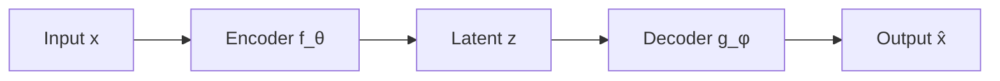

# CS9 - Variational Auto Encoders (VAE) - Enhanced with Lecture Notes

**Course**: Advanced Deep Learning (AIMLCZG513)
**Instructor**: Prof. Sugata Ghosal
**Institution**: BITS Pilani
**Semester**: S1-25
**Lecture Date**: December 28, 2025

---

## Table of Contents

- [CS9 - Variational Auto Encoders (VAE) - Enhanced with Lecture Notes](#cs9---variational-auto-encoders-vae---enhanced-with-lecture-notes)
  - [Table of Contents](#table-of-contents)
  - [References \& Resources](#references--resources)
    - [Primary Papers](#primary-papers)
    - [Tutorial Resources](#tutorial-resources)
    - [Course Materials](#course-materials)
  - [1. Introduction \& Motivation](#1-introduction--motivation)
    - [1.1 VAE as a Continuation of Autoencoders](#11-vae-as-a-continuation-of-autoencoders)
      - [Review: Types of Autoencoders](#review-types-of-autoencoders)
      - [Standard AE Problems Recap](#standard-ae-problems-recap)
    - [1.2 VAE vs Other Generative Models](#12-vae-vs-other-generative-models)
      - [Detailed Comparison Table](#detailed-comparison-table)
    - [1.3 Loss of Semantics in Standard AE](#13-loss-of-semantics-in-standard-ae)
      - [What Are Semantics?](#what-are-semantics)
      - [Faces Example from Lecture](#faces-example-from-lecture)
    - [1.4 Irregular Latent Space](#14-irregular-latent-space)
    - [1.5 Problems with Standard Autoencoders](#15-problems-with-standard-autoencoders)
  - [2. Understanding Latent Dimensions](#2-understanding-latent-dimensions)
    - [2.1 Conceptual Examples](#21-conceptual-examples)
      - [Example 1: Objects (Dog, Bird, Car, Airplane)](#example-1-objects-dog-bird-car-airplane)
      - [Example 2: Human Faces](#example-2-human-faces)
    - [2.2 Latent Space Interpretation](#22-latent-space-interpretation)
    - [2.3 Semantic Manipulation](#23-semantic-manipulation)
  - [3. Mathematical Foundations](#3-mathematical-foundations)
    - [3.1 Entropy](#31-entropy)
    - [3.2 Cross-Entropy](#32-cross-entropy)
    - [3.3 KL Divergence](#33-kl-divergence)
    - [3.4 Properties of KL Divergence](#34-properties-of-kl-divergence)
      - [Property 1: Non-Negativity](#property-1-non-negativity)
      - [Property 2: Asymmetry](#property-2-asymmetry)
      - [Property 3: Invariance Under Transformations](#property-3-invariance-under-transformations)
      - [Property 4: Decomposition for Independent Variables](#property-4-decomposition-for-independent-variables)
      - [KL Divergence for Gaussians (crucial for VAE):](#kl-divergence-for-gaussians-crucial-for-vae)
  - [4. Variational Regularization](#4-variational-regularization)
    - [4.1 What is Regularization](#41-what-is-regularization)
    - [4.2 Why Variational Regularization?](#42-why-variational-regularization)
      - [Comparison with Other Regularizers](#comparison-with-other-regularizers)
    - [4.3 Regular and Structured Latent Space](#43-regular-and-structured-latent-space)
    - [4.4 Comparison with Other Regularizers](#44-comparison-with-other-regularizers)
  - [5. Variational Autoencoder Framework](#5-variational-autoencoder-framework)
    - [5.1 Probabilistic Formulation](#51-probabilistic-formulation)
    - [5.2 Generative Model](#52-generative-model)
    - [5.3 The Intractability Problem](#53-the-intractability-problem)
    - [5.4 Variational Inference](#54-variational-inference)
  - [6. ELBO (Evidence Lower Bound)](#6-elbo-evidence-lower-bound)
    - [6.1 Derivation of ELBO](#61-derivation-of-elbo)
    - [6.2 ELBO Components](#62-elbo-components)
    - [6.3 VAE Loss Function](#63-vae-loss-function)
    - [6.4 Reparameterization Trick](#64-reparameterization-trick)
  - [7. Training VAEs](#7-training-vaes)
    - [7.1 Architecture Overview](#71-architecture-overview)
    - [7.2 Forward Pass](#72-forward-pass)
    - [7.3 Practical Considerations](#73-practical-considerations)
  - [8. Why VAE Fixes AE Problems](#8-why-vae-fixes-ae-problems)
    - [8.1 Eliminating Holes](#81-eliminating-holes)
    - [8.2 Preserving Semantics](#82-preserving-semantics)
    - [8.3 Enabling Generation](#83-enabling-generation)
  - [9. Advanced VAE Variants](#9-advanced-vae-variants)
    - [9.1 β-VAE](#91-β-vae)
    - [9.2 Vector Quantized VAE (VQ-VAE)](#92-vector-quantized-vae-vq-vae)
    - [9.3 VQ-VAE-2](#93-vq-vae-2)
    - [9.4 NVAE](#94-nvae)
  - [10. Implementation Challenges](#10-implementation-challenges)
    - [10.1 Posterior Collapse](#101-posterior-collapse)
    - [10.2 Decoder Distribution Choices](#102-decoder-distribution-choices)
    - [10.3 Training Dynamics](#103-training-dynamics)
  - [11. Applications](#11-applications)
    - [11.1 Image Generation](#111-image-generation)
    - [11.2 Voice Style Transfer](#112-voice-style-transfer)
    - [11.3 Music Generation](#113-music-generation)
  - [12. Key Exam Takeaways](#12-key-exam-takeaways)
    - [Core Concepts Summary](#core-concepts-summary)
    - [Problem-Solving Patterns](#problem-solving-patterns)
    - [Quick Reference Formulas](#quick-reference-formulas)
  - [13. References \& Resources](#13-references--resources)
    - [Primary Papers](#primary-papers-1)
    - [Tutorial Resources (from Professor)](#tutorial-resources-from-professor)
  - [Additional Lecture Insights](#additional-lecture-insights)
    - [Professor's Emphasis Points](#professors-emphasis-points)
  - [Next Lecture Preview](#next-lecture-preview)

---

## References & Resources

### Primary Papers

| # | Paper Title | Authors | Year | Key Contribution | Link |
|---|------------|---------|------|------------------|------|
| 1 | Auto-Encoding Variational Bayes | Kingma & Welling | 2014 | Original VAE paper, ELBO derivation, reparameterization trick | [arXiv:1312.6114](https://arxiv.org/abs/1312.6114) |
| 2 | Semi-Supervised Learning with Deep Generative Models | Kingma et al. | 2014 | Conditional VAE (CVAE), semi-supervised learning | [arXiv:1406.5298](https://arxiv.org/abs/1406.5298) |
| 3 | beta-VAE: Learning Basic Visual Concepts with a Constrained Variational Framework | Higgins et al. | 2017 | Disentangled representations, interpretable factors | [OpenReview](https://openreview.net/forum?id=Sy2fzU9gl) |
| 4 | Neural Discrete Representation Learning | van den Oord et al. | 2017 | VQ-VAE, discrete latent representations | [arXiv:1711.00937](https://arxiv.org/abs/1711.00937) |
| 5 | Generating Diverse High-Fidelity Images with VQ-VAE-2 | Razavi et al. | 2019 | Hierarchical VQ-VAE, high-resolution synthesis | [arXiv:1906.00446](https://arxiv.org/abs/1906.00446) |
| 6 | NVAE: A Deep Hierarchical Variational Autoencoder | Vahdat & Kautz | 2020 | Scalable VAE architecture, residual cells | [arXiv:2007.03898](https://arxiv.org/abs/2007.03898) |
| 7 | Jukebox: A Generative Model for Music | Dhariwal et al. | 2020 | Music generation, multi-scale VQ-VAE | [arXiv:2005.00341](https://arxiv.org/abs/2005.00341) |

### Tutorial Resources

| # | Resource Title | Description | Author/Source | Link |
|---|---------------|-------------|---------------|------|
| 1 | Understanding Variational Autoencoders | Intuitive explanation with visualizations | TowardsDataScience | [Link](https://towardsdatascience.com/understanding-variational-autoencoders-vaes-f70510919f73) |
| 2 | What is a Variational Autoencoder? | Mathematical tutorial with detailed derivations | Jaan Altosaar | [Link](https://jaan.io/what-is-variational-autoencoder-vae-tutorial/) |
| 3 | Intuitively Understanding Variational Autoencoders | Step-by-step intuition building | TowardsDataScience | [Link](https://towardsdatascience.com/intuitively-understanding-variational-autoencoders-1bfe67eb5daf) |
| 4 | Variational Autoencoders Tutorial | Comprehensive guide with examples | Jeremy Jordan | [Link](https://www.jeremyjordan.me/variational-autoencoders/) |
| 5 | Tutorial on Variational Autoencoders | Academic tutorial paper | Carl Doersch | [arXiv:1606.05908](https://arxiv.org/abs/1606.05908) |

### Course Materials

| Item | Details |
|------|---------|
| **Course** | Advanced Deep Learning (AIMLCZG513) |
| **Instructor** | Dr. Sugata Ghosal |
| **Institution** | BITS Pilani, Pilani Campus |
| **Semester** | S1-25 (2025) |
| **Slides Based On** | Stanford CS231n (Fei-Fei Li, Justin Johnson, Serena Yeung) |

---

## 1. Introduction & Motivation

### 1.1 VAE as a Continuation of Autoencoders

**Professor's Context**: Variational Autoencoders build upon the foundation of standard autoencoders discussed in previous sessions, but with a fundamentally different goal.

#### Review: Types of Autoencoders

| Type | Hidden Layer Size | Regularization | Purpose |
|------|------------------|----------------|---------|
| **Undercomplete AE** | < Input dimension | Dimensionality constraint | Compression, feature learning |
| **Overcomplete AE** | ≥ Input dimension | Required (L1/L2, sparse, denoising) | Feature learning without trivial copy |
| **Variational AE** | Any size | Variational (KL divergence) | **Generative modeling** |

**Key Insight from Lecture**:
> "The other autoencoder's task mainly was to create representation of the original data. VAE's goal is different - it's about creating NEW data that is semantically similar to training data, yet novel."

#### Standard AE Problems Recap

**Overcomplete AE without regularization**:
- Number of hidden nodes ≥ number of inputs
- Simply copies input to representation space
- Creates representations with **no useful information** about hidden patterns
- Doesn't capture semantic structure

**Solution approaches discussed before VAE**:
1. **L1/L2 regularization**: Penalizes large weights
2. **Sparse autoencoders**: Each hidden node reacts to small fraction of inputs
3. **Denoising autoencoders**: Learns to reconstruct from corrupted input

**VAE's Different Approach**:
- Introduces **variational regularizer**
- Goal: Create **regular and structured latent space**
- Enables **sampling** for generation

---

### 1.2 VAE vs Other Generative Models

**Professor's Comparison**: "VAE can be considered as an alternative method to other models like autoregressive models, flow models and things like that."

#### Detailed Comparison Table

| Aspect | VAE | Autoregressive Models | Flow Models |
|--------|-----|----------------------|-------------|
| **Latent Dimension** | << Data dimension (compressed) | Not applicable | = Data dimension (bijective) |
| **Generation Speed** | **Parallel** (all pixels at once) | **Sequential** (pixel-by-pixel) | Parallel |
| **Sampling** | Sample z from prior, decode | Sample sequentially with conditioning | Invert normalizing flow |
| **Advantages** | Compact latent, fast generation | High quality, exact likelihood | Exact likelihood, invertible |
| **Disadvantages** | Blurry samples (early versions) | Slow sequential generation | Complex architecture |

**Key Value Propositions from Lecture**:

1. **vs Flow Models**:
   - VAE: Latent space dimension **much smaller** than original data
   - Flow: Latent space dimension **same** as original data
   - VAE provides **more condensed representation**
2. **vs Autoregressive Models**:
   - Autoregressive: Sequential generation (slow)
   - VAE: **Parallel generation** (fast)
   - "Data are generated one at a time in autoregressive, making the generation process sequential"

3. **Initial Limitations**:
   - Early VAEs: Lower quality/resolution than autoregressive models
   - "But in subsequent versions... additional techniques have been developed to improve quality"

**Professor's Summary**:
> "VAE is one of the models for Generative AI which has created lots of buzz today."

---

### 1.3 Loss of Semantics in Standard AE

**Lecture Explanation**: "Variational autoencoders have the inherent characteristics of preserving the semantics of the data. That particular characteristic puts it apart from other types of autoencoders."

#### What Are Semantics?

**Definition**: Semantics = meaningful factors of variation that we care about

**Conceptual Example from Lecture**: Dogs, Birds, Cars, Airplanes

Let's understand with Professor's example:

```
Data: Dog, Bird, Car, Airplane
Feature vectors: [Many dimensions - could be # of pixels in images]
```

**Single Latent Dimension Example**:

```
Dimension 1: "Liveliness"

Living ←------------------------→ Lifeless
   Dog, Bird                  Car, Airplane

This captures only ONE semantic concept: whether object is alive
```

**Two Latent Dimensions Example**:

```
Dimension 1: Living vs Lifeless (horizontal axis)
Dimension 2: Can Fly vs Cannot Fly (vertical axis)

         Can Fly
            ↑
            |
   Bird     |     Airplane
   (living, |     (lifeless,
    can fly)|      can fly)
────────────┼────────────────→ Lifeless
   Dog      |     Car
   (living, |     (lifeless,
   cannot   |     cannot
    fly)    |      fly)
            |
       Cannot Fly
```

**Professor's Insight**:
> "If you keep adding more dimensions, you can possibly capture more characteristics, more inherent characteristics of this type of data."

#### Faces Example from Lecture

**Multiple Latent Dimensions for Faces**:

| Latent Axis | Variation Captured |
|-------------|-------------------|
| Axis 1 | Male ←→ Female |
| Axis 2 | Smiling ←→ Neutral ←→ Sad |
| Axis 3 | Pale skin ←→ Dark skin |
| Axis 4 | Short hair ←→ Long hair |
| ... | ... |

**Professor's Key Point**:
> "Variational autoencoders try to discover these latent dimensions from the original training data."

---

### 1.4 Irregular Latent Space

**What Makes Latent Space "Irregular"?**

From lecture: Standard autoencoders create latent spaces with problems:

1. **Isolated clusters**: Training points group in disconnected regions
2. **Large gaps/holes**: Empty regions with no training points
3. **No global structure**: No meaningful geometry

**Why This Happens**:

$$
\min_{\theta,\phi} \sum_{i=1}^N \|x_i - g_\phi(f_\theta(x_i))\|^2
$$

where:
- $N$ = number of training samples
- $x_i$ = $i$-th training sample
- $\theta$ = encoder parameters (weights and biases)
- $\phi$ = decoder parameters (weights and biases)
- $\min_{\theta,\phi}$ = minimize over all possible parameter values

Standard AE objective:
1. Only cares about **reconstruction**
2. Doesn't care about **organization** of latent space
3. No constraint on relationships between latent points

**Consequence**: Cannot interpolate or sample meaningfully

### 1.5 Problems with Standard Autoencoders

Standard autoencoders (AE) are unsupervised learning models designed for dimensionality reduction and feature learning.

**Architecture**:



**Mathematical Formulation**:

$$
\begin{aligned}
\text{Encoder:} \quad & z = f_\theta(x) \\
\text{Decoder:} \quad & \hat{x} = g_\phi(z) \\
\text{Objective:} \quad & \mathcal{L}_{AE} = \|x - \hat{x}\|^2 = \|x - g_\phi(f_\theta(x))\|^2
\end{aligned}
$$

where:
- $x$ = input data (e.g., image, vector)
- $z$ = latent representation (compressed encoding)
- $\hat{x}$ = reconstructed output
- $f_\theta$ = encoder function with parameters $\theta$
- $g_\phi$ = decoder function with parameters $\phi$
- $\mathcal{L}_{AE}$ = autoencoder loss (mean squared error)
- $\|\cdot\|^2$ = squared Euclidean norm (L2 norm)

**Key Limitations**:

| Problem | Description | Consequence |
|---------|-------------|-------------|
| No latent structure constraint | Any encoding enabling reconstruction is valid | Arbitrary, meaningless latent organization |
| Arbitrary latent organization | Latent dimensions can mix unrelated concepts | Loss of interpretability |
| No sampling capability | Cannot generate new samples from latent space | No generative modeling |
| No semantic meaning | Distance in latent space does not equal semantic similarity | Interpolation fails |

**Mathematical Insight**:

$$
\forall f, g \text{ such that } g(f(x)) = x, \quad f \text{ is considered valid}
$$

This means infinitely many valid encoders exist, most producing meaningless latent representations.

---

## 2. Understanding Latent Dimensions

### 2.1 Conceptual Examples

**Professor's Teaching Approach**: Used vivid examples to build intuition

#### Example 1: Objects (Dog, Bird, Car, Airplane)

**1D Latent Space** - "Liveliness":
```
Original Features: Could be as many as total pixels in image

Mapped to 1D:
─────●────────●─────────────────●──────────●────→
    Dog      Bird              Car      Airplane
  (living)  (living)        (lifeless) (lifeless)
```

**Limitation**: Only captures one concept

**2D Latent Space** - "Liveliness" + "Can Fly":

```
         Can Fly
            ↑
            |  Bird (●)         Airplane (●)
            |  Living,          Lifeless,
            |  Can Fly          Can Fly
            |
────────────┼──────────────────────────────────→ Lifeless
  Living ←  |
            |  Dog (●)          Car (●)
            |  Living,          Lifeless,
            |  Cannot Fly       Cannot Fly
            ↓
       Cannot Fly
```

**What the positions mean**:
- **Dog**: Left side (living), bottom (cannot fly)
- **Bird**: Left side (living), top (can fly)
- **Car**: Right side (lifeless), bottom (cannot fly)
- **Airplane**: Right side (lifeless), top (can fly)

#### Example 2: Human Faces

**Multiple Semantic Axes**:

| Axis | Negative Direction | Zero/Center | Positive Direction |
|------|-------------------|-------------|-------------------|
| Gender | Female | Neutral | Male |
| Expression | Sad | Neutral | Smiling |
| Skin Tone | Pale | Medium | Dark |
| Hair Length | Short | Medium | Long |
| Age | Young | Middle-aged | Old |

**Lecture Quote**:
> "Different latent dimensions can be associated with different characteristics of the objects, training objects."

---

### 2.2 Latent Space Interpretation

**How VAE Discovers Latent Dimensions**:

From lecture: "Variational autoencoders try to discover these latent dimensions from the original training data."

**Process**:
1. Training data contains implicit semantic structure
2. VAE encoder learns to map data to latent space
3. Each latent dimension tends to capture independent factor of variation
4. Not manually specified - **learned automatically**

**Key Property**: Diagonal prior on z ⇒ independent latent variables

```
p(z) = N(0, I)  [diagonal covariance]

Means:
- Each z_i is independent
- Changes in z_i affect one semantic factor
- Disentangled representation
```

---

### 2.3 Semantic Manipulation

**Powerful Capability from Lecture**:

**Scenario**: You have a smiling face image

**Steps**:
1. Encode image to latent vector: z_smiling
2. Identify "smile axis" in latent space
3. Modify z along that axis: z_sad = z_smiling - δ * smile_direction
4. Decode z_sad to generate sad version of same face

**Professor's Example**:
> "Suppose you have a face here which is smiling in nature. Now if you modify this particular latent value along the smiling axis from here to somewhat over here, this new latent vector will represent the sad version of the original smiling face."

**Mathematical Representation**:

```
Original: x_smiling
Encode: z_smiling = Encode(x_smiling)
Modify: z_sad = z_smiling + Δz_expression
Decode: x_sad = Decode(z_sad)

Result: Same person, different expression!
```

**This Enables**:
- **Interpolation**: Smooth transitions between faces
- **Attribute editing**: Change one feature, keep others
- **Style transfer**: Apply characteristics from one image to another
- **Data augmentation**: Generate variations of training data

---

## 3. Mathematical Foundations

### 3.1 Entropy

**Definition**: Entropy measures the **average information content** or **uncertainty** in a probability distribution.

**Formula**:
$$
H(p) = -\sum_x p(x) \log p(x) = \mathbb{E}_{x \sim p}[-\log p(x)]
$$

**where:**
- $H(p)$ = entropy of distribution $p$
- $x$ = random variable (takes discrete values)
- $p(x)$ = probability of outcome $x$
- $\log$ = logarithm (typically base 2 for bits, natural log for nats)
- $\sum_x$ = sum over all possible values of $x$
- $\mathbb{E}_p[\cdot]$ = expectation with respect to distribution $p$
- $-\log p(x)$ = information content of outcome $x$ (in bits or nats)

**Properties**:
- Measures **disorder/uncertainty**
- Zero for **pure systems** (deterministic)
- Maximum for uniform distribution

**Intuition**:
- High entropy = high uncertainty = hard to predict
- Low entropy = low uncertainty = easy to predict

---

### 3.2 Cross-Entropy

**Formula**:
$$
H(p, q) = -\sum_x p(x) \log q(x) = \mathbb{E}_{x \sim p}[-\log q(x)]
$$

**Interpretation**:
- Average information content when using distribution q to encode data from distribution p
- Measures how well q approximates p

---

### 3.3 KL Divergence

**Formula**:
$$
D_{KL}(p \| q) = \sum_x p(x) \log \frac{p(x)}{q(x)} = H(p,q) - H(p)
$$

**Alternative Form**:
$$
D_{KL}(p \| q) = \mathbb{E}_{x \sim p}\left[\log \frac{p(x)}{q(x)}\right]
$$

**Interpretation**:
- Measures **information lost** when approximating p with q
- "Distance" between distributions (not a true metric)
- Difference between cross-entropy and entropy

---

### 3.4 Properties of KL Divergence

#### Property 1: Non-Negativity

$$
D_{KL}(p\|q) \geq 0
$$

Equality holds if and only if $p = q$ almost everywhere.

**Proof** (using Jensen's inequality):

**Step 1**: Start with KL definition

$$
D_{KL}(p\|q) = \mathbb{E}_p\left[\log\frac{p}{q}\right]
$$

**Step 2**: Rewrite as negative log

$$
D_{KL}(p\|q) = -\mathbb{E}_p\left[\log\frac{q}{p}\right]
$$

where we used: $\log\frac{p}{q} = -\log\frac{q}{p}$

**Step 3**: Apply Jensen's inequality

Since $\log$ is a concave function, Jensen's inequality states:

$$
\mathbb{E}[\log f(x)] \leq \log \mathbb{E}[f(x)]
$$

Therefore:

$$
\mathbb{E}_p\left[\log\frac{q}{p}\right] \leq \log \mathbb{E}_p\left[\frac{q}{p}\right]
$$

**Step 4**: Compute the expectation

$$
\mathbb{E}_p\left[\frac{q}{p}\right] = \int p(x) \cdot \frac{q(x)}{p(x)} \, dx = \int q(x) \, dx = 1
$$

where:
- $\int q(x) \, dx = 1$ because $q$ is a probability distribution

**Step 5**: Substitute back

$$
\mathbb{E}_p\left[\log\frac{q}{p}\right] \leq \log(1) = 0
$$

**Step 6**: Apply negation

$$
-\mathbb{E}_p\left[\log\frac{q}{p}\right] \geq 0
$$

**Step 7**: Conclude

$$
D_{KL}(p\|q) = -\mathbb{E}_p\left[\log\frac{q}{p}\right] \geq 0
$$

**Equality condition**: $D_{KL}(p\|q) = 0$ if and only if $\frac{q(x)}{p(x)} = 1$ for all $x$ where $p(x) > 0$, which means $p = q$ almost everywhere.

#### Property 2: Asymmetry

$$
D_{KL}(p\|q) \neq D_{KL}(q\|p) \quad \text{(in general)}
$$

**Important Consequence**: KL divergence is NOT a metric (not a distance function).

**Numerical Example**:

$$
\begin{aligned}
p &= \mathcal{N}(0, 1) \quad \text{(standard normal)} \\
q &= \mathcal{N}(0, 2) \quad \text{(wider normal)} \\
\\
D_{KL}(p\|q) &\approx 0.443 \\
D_{KL}(q\|p) &\approx 0.693 \\
\\
\text{Clearly: } & D_{KL}(p\|q) \neq D_{KL}(q\|p)
\end{aligned}
$$

**Why Asymmetry Matters**:

| Direction | Optimization Behavior |
|-----------|----------------------|
| $D_{KL}(p\|q)$ | Penalizes $q$ for missing mass where $p$ has mass (mode-seeking) |
| $D_{KL}(q\|p)$ | Penalizes $q$ for having mass where $p$ doesn't (mean-seeking) |

#### Property 3: Invariance Under Transformations

Under invertible transformations $y = f(x)$ with $f$ invertible:

$$
D_{KL}(p_x\|q_x) = D_{KL}(p_y\|q_y)
$$

#### Property 4: Decomposition for Independent Variables

For independent variables:

$$
\begin{aligned}
\text{If } p(x,y) &= p(x)p(y) \\
\text{and } q(x,y) &= q(x)q(y) \\
\\
\text{Then: } D_{KL}(p\|q) &= D_{KL}(p_x\|q_x) + D_{KL}(p_y\|q_y)
\end{aligned}
$$

**Relation to Cross-Entropy**:

$$
\begin{aligned}
H(p, q) &= H(p) + D_{KL}(p\|q) \\
D_{KL}(p\|q) &= H(p, q) - H(p)
\end{aligned}
$$

#### KL Divergence for Gaussians (crucial for VAE):

For univariate Gaussians:

$$
\begin{aligned}
p &= \mathcal{N}(\mu_1, \sigma_1^2) \\
q &= \mathcal{N}(\mu_2, \sigma_2^2)
\end{aligned}
$$

The KL divergence is:

$$
D_{KL}(p\|q) = \log\frac{\sigma_2}{\sigma_1} + \frac{\sigma_1^2 + (\mu_1 - \mu_2)^2}{2\sigma_2^2} - \frac{1}{2}
$$

where:
- $\mu_1, \mu_2$ = means of distributions $p$ and $q$
- $\sigma_1^2, \sigma_2^2$ = variances of distributions $p$ and $q$
- $\log\frac{\sigma_2}{\sigma_1}$ = difference in log standard deviations
- $\frac{\sigma_1^2}{2\sigma_2^2}$ = variance mismatch term
- $\frac{(\mu_1 - \mu_2)^2}{2\sigma_2^2}$ = mean mismatch term (squared distance weighted by variance)

**Special case** (comparing to standard normal, used in VAE):

$$
\begin{aligned}
p &= \mathcal{N}(\mu, \sigma^2) \\
q &= \mathcal{N}(0, 1)
\end{aligned}
$$

Then:

$$
D_{KL}(p\|q) = \frac{1}{2}\left(\mu^2 + \sigma^2 - \log \sigma^2 - 1\right)
$$

**Derivation Step-by-Step** (for single dimension):

**Step 1**: Write Gaussian densities

$$
\begin{aligned}
\mathcal{N}(z; \mu, \sigma^2) &= \frac{1}{\sqrt{2\pi\sigma^2}} \exp\left(-\frac{(z-\mu)^2}{2\sigma^2}\right) \\
\mathcal{N}(z; 0, 1) &= \frac{1}{\sqrt{2\pi}} \exp\left(-\frac{z^2}{2}\right)
\end{aligned}
$$

where:
- $z$ = random variable
- First equation: Gaussian with mean $\mu$ and variance $\sigma^2$
- Second equation: Standard normal (mean 0, variance 1)

**Step 2**: Compute log-ratio

$$
\begin{aligned}
\log\frac{\mathcal{N}(z; \mu, \sigma^2)}{\mathcal{N}(z; 0, 1)} &= \log\left[\frac{1}{\sqrt{2\pi\sigma^2}} \exp\left(-\frac{(z-\mu)^2}{2\sigma^2}\right)\right] - \log\left[\frac{1}{\sqrt{2\pi}} \exp\left(-\frac{z^2}{2}\right)\right] \\
&= -\frac{1}{2}\log(2\pi\sigma^2) - \frac{(z-\mu)^2}{2\sigma^2} + \frac{1}{2}\log(2\pi) + \frac{z^2}{2}
\end{aligned}
$$

**Step 3**: Simplify (cancel $2\pi$ terms)

$$
= -\frac{1}{2}\log\sigma^2 - \frac{(z-\mu)^2}{2\sigma^2} + \frac{z^2}{2}
$$

where:
- $\log(2\pi\sigma^2) - \log(2\pi) = \log\sigma^2$

**Step 4**: Take expectation with respect to $p = \mathcal{N}(\mu, \sigma^2)$

$$
D_{KL}(p\|q) = \mathbb{E}_{z \sim p}\left[-\frac{1}{2}\log\sigma^2 - \frac{(z-\mu)^2}{2\sigma^2} + \frac{z^2}{2}\right]
$$

where $\mathbb{E}_{z \sim p}[\cdot]$ means expectation when $z$ is drawn from $\mathcal{N}(\mu, \sigma^2)$

**Step 5**: Evaluate each term separately

**Term 1**: $\mathbb{E}\left[-\frac{1}{2}\log\sigma^2\right] = -\frac{1}{2}\log\sigma^2$
- (constant, doesn't depend on $z$)

**Term 2**: $\mathbb{E}\left[-\frac{(z-\mu)^2}{2\sigma^2}\right] = -\frac{1}{2\sigma^2}\mathbb{E}[(z-\mu)^2] = -\frac{1}{2\sigma^2} \cdot \sigma^2 = -\frac{1}{2}$
- Because $\mathbb{E}[(z-\mu)^2] = \text{Var}(z) = \sigma^2$ by definition of variance

**Term 3**: $\mathbb{E}\left[\frac{z^2}{2}\right] = \frac{1}{2}\mathbb{E}[z^2] = \frac{1}{2}(\mu^2 + \sigma^2)$
- Because $\mathbb{E}[z^2] = \mathbb{E}[z]^2 + \text{Var}(z) = \mu^2 + \sigma^2$
- (Second moment = mean squared + variance)

**Step 6**: Combine all three terms

$$
\begin{aligned}
D_{KL}(p\|q) &= -\frac{1}{2}\log\sigma^2 - \frac{1}{2} + \frac{1}{2}(\mu^2 + \sigma^2) \\
&= -\frac{1}{2}\log\sigma^2 - \frac{1}{2} + \frac{1}{2}\mu^2 + \frac{1}{2}\sigma^2
\end{aligned}
$$

**Step 7**: Rearrange to final form

$$
D_{KL}(p\|q) = \frac{1}{2}(\mu^2 + \sigma^2 - \log\sigma^2 - 1)
$$

**Multivariate case** (diagonal covariance):

For $d$-dimensional case with diagonal covariance:

$$
D_{KL}\left(\mathcal{N}(\boldsymbol{\mu},\text{diag}(\boldsymbol{\sigma}^2))\|\mathcal{N}(\mathbf{0},\mathbf{I})\right) = \frac{1}{2}\sum_{i=1}^d\left(\mu_i^2 + \sigma_i^2 - \log \sigma_i^2 - 1\right)
$$

where:
- $\boldsymbol{\mu} = (\mu_1, \ldots, \mu_d)$ = mean vector (column vector in $\mathbb{R}^d$)
- $\boldsymbol{\sigma}^2 = (\sigma_1^2, \ldots, \sigma_d^2)$ = variance vector
- $\text{diag}(\boldsymbol{\sigma}^2)$ = diagonal covariance matrix with $\sigma_i^2$ on diagonal
- $\mathbf{I}$ = $d \times d$ identity matrix
- $d$ = dimensionality of latent space
- Sum over all $d$ dimensions (each dimension contributes independently due to diagonal covariance)

This last formula is **directly used in VAE loss computation**.

Univariate:
$$
\boxed{D_{KL}(\mathcal{N}(\mu,\sigma^2) \| \mathcal{N}(0,1)) = \frac{1}{2}\left(\mu^2 + \sigma^2 - \log \sigma^2 - 1\right)}
$$

Multivariate (diagonal covariance):
$$
\boxed{D_{KL}(\mathcal{N}(\boldsymbol{\mu},\boldsymbol{\sigma}^2) \| \mathcal{N}(\mathbf{0},\mathbf{I})) = \frac{1}{2}\sum_{i=1}^d\left(\mu_i^2 + \sigma_i^2 - \log \sigma_i^2 - 1\right)}
$$

**Exam Note from Lecture**: Professor mentioned DKL problems will "very likely" appear in exams!

---

## 4. Variational Regularization

### 4.1 What is Regularization

**General Definition**:

Regularization adds constraints beyond the primary objective to control model behavior.

**General Form**:

$$
\mathcal{L}_{\text{total}} = \mathcal{L}_{\text{primary}} + \lambda \cdot \mathcal{R}(\text{model})
$$

where:
- $\mathcal{L}_{\text{total}}$ = total loss function to minimize
- $\mathcal{L}_{\text{primary}}$ = primary objective (e.g., reconstruction error, classification loss)
- $\mathcal{R}(\text{model})$ = regularization term (penalty on model complexity or structure)
- $\lambda$ = regularization coefficient (controls trade-off between primary objective and regularization)
  - $\lambda = 0$: no regularization (only optimize primary objective)
  - $\lambda \to \infty$: strong regularization (may ignore primary objective)
  - $\lambda$ optimal: balance between fitting data and regularization

**Purpose Table**:

| Purpose | Description |
|---------|-------------|
| Prevent overfitting | Reduce gap between training and test performance |
| Impose desired properties | Enforce structure, sparsity, smoothness |
| Improve generalization | Better performance on unseen data |
| Control complexity | Limit model capacity |


### 4.2 Why Variational Regularization?

**Professor's Explanation**:
> "Purpose of this variational regularizer is something different than what we discussed for sparse regularizers."

#### Comparison with Other Regularizers

| Regularizer Type | Goal | Mechanism |
|------------------|------|-----------|
| **L1/L2** | Prevent overfitting | Penalize large weights |
| **Sparse** | Selective activation | Each hidden node reacts to small fraction of inputs |
| **Denoising** | Robust features | Learn to reconstruct from corrupted input |
| **Variational** | **Structured latent space** | **Constrain latent distribution** |

**Key Difference from Lecture**:
> "Sparse regularizers ensure that each of the hidden encoder nodes actually react to a very small fraction of the inputs. In variational regularization, the goal is to introduce some type of constraints on the encoded space."

---

### 4.3 Regular and Structured Latent Space

**What Does "Regular and Structured" Mean?**

From lecture: "Those constraints enable us to create regular and structured latent space."

**Professor's Definition**:
> "At a high level, you can consider this type of constraints to ensure that if two points are close in latent space, then once you decode those two points which are close in latent space, they will also generate data in the final data space which are similar to each other."

**Mathematical Property**:
$$
d_{latent}(z_1, z_2) \text{ small} \implies d_{data}(x_1, x_2) \text{ small}
$$

where:
- $x_1 = \text{Decode}(z_1)$
- $x_2 = \text{Decode}(z_2)$

**Benefits**:
1. **Interpolation**: Smooth transitions between points
2. **Sampling**: Can sample anywhere and get valid data
3. **Semantics**: Nearby points have similar meaning
4. **Completeness**: No "holes" or invalid regions

---

### 4.4 Comparison with Other Regularizers

**Standard Regularizers** (L1, L2):
- Act on **weights** θ, φ
- Prevent overfitting to training data
- Don't constrain latent space structure

**Variational Regularizer** (KL divergence):
- Acts on **latent variables** z
- Constrains latent space geometry
- Enables generative modeling

**From Lecture**:
> "If you are able to create latent space that is structured and regular in nature, then you can sample from that latent space and you can send the sample values through the decoder to create data which is semantically similar to your training data yet different from all the data points."

This is the **key innovation** that makes VAE a generative model!

---

## 5. Variational Autoencoder Framework

### 5.1 Probabilistic Formulation

**Key Insight**: VAE treats data generation as a probabilistic process

**Generative Story**:
1. Sample latent code: $z \sim p(z)$
2. Generate data: $x \sim p_\theta(x|z)$

**Components**:

| Component | Symbol | Description | Implementation |
|-----------|--------|-------------|----------------|
| **Prior** | $p(z)$ | Latent variable distribution | $\mathcal{N}(0, I)$ (Gaussian) |
| **Decoder** | $p_\theta(x\|z)$ | Generative model | Neural network |
| **Encoder** | $q_\phi(z\|x)$ | Inference/recognition model | Neural network |
| **True Posterior** | $p_\theta(z\|x)$ | Intractable! | Approximated by $q_\phi$ |

**Architecture Diagram**:
```
Training (Inference):
x → [Encoder NN] → μ, σ² → Sample z ~ N(μ,σ²) → [Decoder NN] → x̂

Generation:
Sample z ~ N(0,I) → [Decoder NN] → x (new data)
```

---

### 5.2 Generative Model

**Choose simple prior**: $p(z) = \mathcal{N}(0, I)$

**Why Gaussian?**
- Mathematically tractable
- Reasonable for many latent attributes
- Easy to sample from
- KL divergence has closed form

**Decoder**: $p_\theta(x|z)$ is complex (generates images)
- Implemented as neural network
- Parameters: θ (weights, biases)
- Outputs parameters of distribution over x

**Common choices**:
- Images: Bernoulli or Gaussian likelihood
- Continuous data: Gaussian likelihood
- Discrete data: Categorical/Bernoulli

---

### 5.3 The Intractability Problem

**Goal**: Maximize likelihood of training data

$$
\max_\theta \prod_{i=1}^N p_\theta(x_i) = \max_\theta \sum_{i=1}^N \log p_\theta(x_i)
$$

**Data Likelihood**:
$$
p_\theta(x) = \int p(z) p_\theta(x|z) dz
$$

**Problem**: This integral is **intractable**!

**Why intractable?**

Component breakdown:
- ✅ $p(z) = \mathcal{N}(0,I)$ - simple, can compute
- ✅ $p_\theta(x|z)$ - decoder neural network, can compute
- ❌ $\int ... dz$ - **cannot compute** for every z!

**Also intractable**: Posterior $p_\theta(z|x)$

$$
p_\theta(z|x) = \frac{p_\theta(x|z)p(z)}{p_\theta(x)} = \frac{p_\theta(x|z)p(z)}{\int p_\theta(x|z)p(z)dz}
$$

Denominator requires the same intractable integral!

**Solution**: Variational inference

---

### 5.4 Variational Inference

**Idea**:
- Define encoder network $q_\phi(z|x)$ to approximate $p_\theta(z|x)$
- Derive tractable lower bound on $\log p_\theta(x)$
- Optimize the lower bound instead

**Encoder Network**:
- Inputs: data x
- Outputs: Parameters of $q_\phi(z|x)$
- For Gaussian: outputs $\mu_\phi(x), \sigma_\phi(x)$
- Then: $q_\phi(z|x) = \mathcal{N}(\mu_\phi(x), \sigma_\phi^2(x))$

**Decoder Network**:
- Inputs: latent z
- Outputs: Parameters of $p_\theta(x|z)$
- For Gaussian: outputs $\mu_\theta(z), \sigma_\theta(z)$
- Then: $p_\theta(x|z) = \mathcal{N}(\mu_\theta(z), \sigma_\theta^2(z))$

**Both networks are probabilistic!**

---

## 6. ELBO (Evidence Lower Bound)

### 6.1 Derivation of ELBO

**Start with log data likelihood**:

$$
\log p_\theta(x)
$$

**Step 1**: Introduce encoder $q_\phi(z|x)$

$$
\log p_\theta(x) = \log p_\theta(x) \int q_\phi(z|x) dz
$$

(Since $\int q_\phi(z|x) dz = 1$)

**Step 2**: Move log inside expectation

$$
= \mathbb{E}_{q_\phi(z|x)}[\log p_\theta(x)]
$$

**Step 3**: Use Bayes rule $p_\theta(x) = \frac{p_\theta(x,z)}{p_\theta(z|x)}$

$$
= \mathbb{E}_{q_\phi(z|x)}\left[\log \frac{p_\theta(x,z)}{p_\theta(z|x)}\right]
$$

**Step 4**: Multiply by $\frac{q_\phi(z|x)}{q_\phi(z|x)} = 1$

$$
= \mathbb{E}_{q_\phi(z|x)}\left[\log \frac{p_\theta(x,z)}{q_\phi(z|x)} \cdot \frac{q_\phi(z|x)}{p_\theta(z|x)}\right]
$$

**Step 5**: Split the logarithm

$$
= \mathbb{E}_{q_\phi(z|x)}\left[\log \frac{p_\theta(x,z)}{q_\phi(z|x)}\right] + \mathbb{E}_{q_\phi(z|x)}\left[\log \frac{q_\phi(z|x)}{p_\theta(z|x)}\right]
$$

**Step 6**: Recognize ELBO and KL divergence

$$
\boxed{\log p_\theta(x) = \underbrace{\mathbb{E}_{q_\phi(z|x)}\left[\log \frac{p_\theta(x,z)}{q_\phi(z|x)}\right]}_{\text{ELBO}} + \underbrace{D_{KL}(q_\phi(z|x) \| p_\theta(z|x))}_{\geq 0}}
$$

**Key Insights**:
- ELBO ≤ log p(x) (since KL ≥ 0)
- Maximizing ELBO ⇒ maximizing lower bound on likelihood
- KL term can't be computed, but ELBO can!

---

### 6.2 ELBO Components

**Expand ELBO**:

$$
\text{ELBO} = \mathbb{E}_{q_\phi(z|x)}\left[\log \frac{p_\theta(x,z)}{q_\phi(z|x)}\right]
$$

Use $p_\theta(x,z) = p_\theta(x|z)p(z)$:

$$
= \mathbb{E}_{q_\phi(z|x)}\left[\log \frac{p_\theta(x|z)p(z)}{q_\phi(z|x)}\right]
$$

$$
= \mathbb{E}_{q_\phi(z|x)}[\log p_\theta(x|z)] + \mathbb{E}_{q_\phi(z|x)}\left[\log \frac{p(z)}{q_\phi(z|x)}\right]
$$

$$
\boxed{\text{ELBO} = \mathbb{E}_{q_\phi(z|x)}[\log p_\theta(x|z)] - D_{KL}(q_\phi(z|x) \| p(z))}
$$

**Two Components**:

1. **Reconstruction Term**: $\mathbb{E}_{q_\phi(z|x)}[\log p_\theta(x|z)]$
   - How well decoder reconstructs input
   - Computed through sampling and decoder network
   - Differentiable via reparameterization trick

2. **KL Regularization**: $D_{KL}(q_\phi(z|x) \| p(z))$
   - How close encoder distribution is to prior
   - **Has closed-form solution** for Gaussians!
   - Makes approximate posterior close to prior

**Component Breakdown**:

| Component | Formula | Interpretation |
|-----------|---------|----------------|
| **Reconstruction** | $\mathbb{E}_{q_\phi(z\|x)} [\log p_\theta(x\|z)]$ | How well decoder reconstructs input |
| **KL Regularization** | $D_{KL}(q_\phi(z\|x) \| p(z))$ | How different posterior is from prior |

**Component 1: Reconstruction Term**

$$
\mathbb{E}_{q_\phi(z|x)} [\log p_\theta(x|z)]
$$

**Interpretation**:
- Expected log-likelihood of reconstructing $x$ given sampled $z$
- Measures how well decoder reconstructs input
- Forces encoder-decoder to preserve information

**Computation Process**:

| Step | Action |
|------|--------|
| 1. Sample | $z \sim q_\phi(z\|x) = \mathcal{N}(\mu_\phi(x), \sigma^2_\phi(x))$ |
| 2. Decode | $\hat{x} = \text{decoder}_\theta(z)$ |
| 3. Evaluate | $\log p_\theta(x\|z)$ |

**For Different Decoder Types**:

| Data Type | Decoder Distribution | Log-likelihood |
|-----------|---------------------|----------------|
| Continuous | $p_\theta(x\|z) = \mathcal{N}(x; \mu_\theta(z), \sigma^2I)$ | $\log p_\theta(x\|z) \propto -\frac{1}{2\sigma^2}\|x - \mu_\theta(z)\|^2$ |
| Binary | $p_\theta(x\|z) = \text{Bernoulli}(x; p_\theta(z))$ | $\log p_\theta(x\|z) = \sum_i [x_i \log p_i + (1-x_i) \log(1-p_i)]$ |

**Practical Form** (Gaussian assumption):

$$
\mathbb{E}_{q}[\log p_\theta(x|z)] \approx -\|x - \text{decoder}_\theta(z)\|^2
$$

---

**Component 2: KL Regularization Term**

$$
D_{KL}(q_\phi(z|x) \| p(z))
$$

**Interpretation**:
- How different is approximate posterior from prior
- Regularizes latent space to match prior
- Prevents "cheating" by encoder

**Why Necessary?**

Without KL term:

| Scenario | What Could Happen |
|----------|-------------------|
| Encoder | Could use $z = x$ (identity mapping) |
| Decoder | Could use $\hat{x} = z$ (identity mapping) |
| Result | Perfect reconstruction, useless latent space! |

KL term forces:

$$
q_\phi(z|x) \approx \mathcal{N}(0, I)
$$

- Encoder must compress into standard normal
- Latent space has structure
- Enables sampling from prior

**Closed-Form for Gaussians**:

Given:

$$
\begin{aligned}
q_\phi(z|x) &= \mathcal{N}(\mu, \sigma^2) \quad \text{(diagonal covariance)} \\
p(z) &= \mathcal{N}(0, I)
\end{aligned}
$$

The KL divergence is:

$$
\boxed{D_{KL}(q\|p) = \frac{1}{2} \sum_{i=1}^d \left(\mu_i^2 + \sigma_i^2 - \log \sigma_i^2 - 1\right)}
$$

This is **directly computable** - no sampling needed!

**Derivation** (for single dimension):

$$
\begin{aligned}
D_{KL}(\mathcal{N}(\mu,\sigma^2) \| \mathcal{N}(0,1)) &= \int \mathcal{N}(z; \mu, \sigma^2) \log \frac{\mathcal{N}(z; \mu, \sigma^2)}{\mathcal{N}(z; 0, 1)} \, dz \\
&= \frac{1}{2}\left[\log\frac{1}{\sigma^2} + \sigma^2 + \mu^2 - 1\right] \\
&= \frac{1}{2}\left[\sigma^2 + \mu^2 - \log \sigma^2 - 1\right]
\end{aligned}
$$

For multivariate case (diagonal), sum over all dimensions.

**Component Breakdown**:

| Component | Formula | Interpretation |
|-----------|---------|----------------|
| **Reconstruction** | $\mathbb{E}_{q_\phi(z\|x)} [\log p_\theta(x\|z)]$ | How well decoder reconstructs input |
| **KL Regularization** | $D_{KL}(q_\phi(z\|x) \| p(z))$ | How different posterior is from prior |

**Component 1: Reconstruction Term**

$$
\mathbb{E}_{q_\phi(z|x)} [\log p_\theta(x|z)]
$$

**Interpretation**:
- Expected log-likelihood of reconstructing $x$ given sampled $z$
- Measures how well decoder reconstructs input
- Forces encoder-decoder to preserve information

**Computation Process**:

| Step | Action |
|------|--------|
| 1. Sample | $z \sim q_\phi(z\|x) = \mathcal{N}(\mu_\phi(x), \sigma^2_\phi(x))$ |
| 2. Decode | $\hat{x} = \text{decoder}_\theta(z)$ |
| 3. Evaluate | $\log p_\theta(x\|z)$ |

**For Different Decoder Types**:

| Data Type | Decoder Distribution | Log-likelihood |
|-----------|---------------------|----------------|
| Continuous | $p_\theta(x\|z) = \mathcal{N}(x; \mu_\theta(z), \sigma^2I)$ | $\log p_\theta(x\|z) \propto -\frac{1}{2\sigma^2}\|x - \mu_\theta(z)\|^2$ |
| Binary | $p_\theta(x\|z) = \text{Bernoulli}(x; p_\theta(z))$ | $\log p_\theta(x\|z) = \sum_i [x_i \log p_i + (1-x_i) \log(1-p_i)]$ |

**Practical Form** (Gaussian assumption):

$$
\mathbb{E}_{q}[\log p_\theta(x|z)] \approx -\|x - \text{decoder}_\theta(z)\|^2
$$

---

**Component 2: KL Regularization Term**

$$
D_{KL}(q_\phi(z|x) \| p(z))
$$

**Interpretation**:
- How different is approximate posterior from prior
- Regularizes latent space to match prior
- Prevents "cheating" by encoder

**Why Necessary?**

Without KL term:

| Scenario | What Could Happen |
|----------|-------------------|
| Encoder | Could use $z = x$ (identity mapping) |
| Decoder | Could use $\hat{x} = z$ (identity mapping) |
| Result | Perfect reconstruction, useless latent space! |

KL term forces:

$$
q_\phi(z|x) \approx \mathcal{N}(0, I)
$$

- Encoder must compress into standard normal
- Latent space has structure
- Enables sampling from prior

**Closed-Form for Gaussians**:

Given:

$$
\begin{aligned}
q_\phi(z|x) &= \mathcal{N}(\mu, \sigma^2) \quad \text{(diagonal covariance)} \\
p(z) &= \mathcal{N}(0, I)
\end{aligned}
$$

The KL divergence is:

$$
\boxed{D_{KL}(q\|p) = \frac{1}{2} \sum_{i=1}^d \left(\mu_i^2 + \sigma_i^2 - \log \sigma_i^2 - 1\right)}
$$

This is **directly computable** - no sampling needed!

**Derivation** (for single dimension):

$$
\begin{aligned}
D_{KL}(\mathcal{N}(\mu,\sigma^2) \| \mathcal{N}(0,1)) &= \int \mathcal{N}(z; \mu, \sigma^2) \log \frac{\mathcal{N}(z; \mu, \sigma^2)}{\mathcal{N}(z; 0, 1)} \, dz \\
&= \frac{1}{2}\left[\log\frac{1}{\sigma^2} + \sigma^2 + \mu^2 - 1\right] \\
&= \frac{1}{2}\left[\sigma^2 + \mu^2 - \log \sigma^2 - 1\right]
\end{aligned}
$$

For multivariate case (diagonal), sum over all dimensions.


---

### 6.3 VAE Loss Function

**Maximize ELBO** = **Minimize negative ELBO**:

$$
\boxed{\mathcal{L}_{\text{VAE}} = -\mathbb{E}_{q_\phi(z|x)}[\log p_\theta(x|z)] + D_{KL}(q_\phi(z|x) \| p(z))}
$$

**Interpretation**:

$$
\mathcal{L}_{\text{VAE}} = \underbrace{\text{Reconstruction Loss}}_{\text{Make } x \approx \hat{x}} + \underbrace{\text{KL Regularization}}_{\text{Make } q_\phi \approx p}
$$

**Practical Implementation**:

For Gaussian distributions:

**Encoder**: $q_\phi(z|x) = \mathcal{N}(\mu_\phi(x), \sigma_\phi^2(x))$
**Prior**: $p(z) = \mathcal{N}(0, I)$
**Decoder**: $p_\theta(x|z) = \mathcal{N}(\mu_\theta(z), \sigma_\theta^2(z))$ or Bernoulli

**KL term** (closed-form!):
$$
D_{KL}(q_\phi(z|x) \| p(z)) = \frac{1}{2}\sum_{i=1}^d\left(\mu_i^2 + \sigma_i^2 - \log \sigma_i^2 - 1\right)
$$

**Reconstruction term** (Monte Carlo estimate):
$$
\mathbb{E}_{q_\phi(z|x)}[\log p_\theta(x|z)] \approx \log p_\theta(x|z), \quad z \sim q_\phi(z|x)
$$

For binary images (Bernoulli):
$$
\log p_\theta(x|z) = \sum_i [x_i \log \hat{x}_i + (1-x_i)\log(1-\hat{x}_i)]
$$

For continuous (Gaussian, often simplified):
$$
\log p_\theta(x|z) \propto -\|x - \mu_\theta(z)\|^2
$$

---

### 6.4 Reparameterization Trick

**Problem**: Cannot backpropagate through sampling operation

**Original**:
```
μ, σ ← Encoder(x)
z ← Sample from N(μ, σ²)     ← NOT differentiable!
x̂ ← Decoder(z)
```

Gradients can't flow through the stochastic sampling!

**Solution**: Reparameterize sampling

**Reparameterization**:
$$
\boxed{z = \mu + \sigma \odot \epsilon, \quad \epsilon \sim \mathcal{N}(0, I)}
$$

where $\odot$ is element-wise multiplication.

**New Process**:
```
μ, σ ← Encoder(x)
ε ← Sample from N(0, I)      ← Randomness separated!
z ← μ + σ ⊙ ε                 ← Deterministic transformation
x̂ ← Decoder(z)               ← Fully differentiable!
```

**Why this works**:
- Randomness is in ε (fixed, doesn't depend on parameters)
- z is **deterministic function** of μ, σ, ε
- Can backpropagate through μ and σ

**Implementation**:
```python
# Encoder outputs
mu, log_var = encoder(x)
std = torch.exp(0.5 * log_var)

# Reparameterization
eps = torch.randn_like(std)
z = mu + std * eps  # Differentiable w.r.t. mu and std!

# Decoder
x_recon = decoder(z)
```

**Statistical equivalence**:
$$
z = \mu + \sigma \odot \epsilon \sim \mathcal{N}(\mu, \sigma^2)
$$

This maintains the correct distribution while enabling gradient flow!

---

## 7. Training VAEs

### 7.1 Architecture Overview

**Complete VAE Architecture**:

```
INPUT IMAGE x
      ↓
┌─────────────────┐
│  ENCODER NET    │
│  (parameters φ) │
│                 │
│  Conv layers    │
│  + FC layers    │
└─────────────────┘
      ↓
   μ(x), σ²(x)
      ↓
   ε ~ N(0,I)
      ↓
z = μ + σ ⊙ ε      ← REPARAMETERIZATION
      ↓
┌─────────────────┐
│  DECODER NET    │
│  (parameters θ) │
│                 │
│  FC layers      │
│  + Deconv       │
└─────────────────┘
      ↓
RECONSTRUCTED x̂
```

**Network Details**:

**Encoder** (Recognition/Inference Network):
- Input: x (e.g., 28×28 image = 784 dims)
- Architecture: Convolutional + Fully Connected
- Outputs: μ ∈ ℝ^d, log σ² ∈ ℝ^d (diagonal Gaussian)
- Parameters: φ

**Latent Space**:
- Dimension: d << input dimension (e.g., d=20)
- Distribution: q_φ(z|x) = N(μ_φ(x), diag(σ²_φ(x)))

**Decoder** (Generation Network):
- Input: z ∈ ℝ^d
- Architecture: Fully Connected + Deconvolutional
- Outputs: Reconstruction x̂ ∈ ℝ^784
- Parameters: θ

---

### 7.2 Forward Pass

**Step-by-Step Training Process**:

**For each minibatch of data**:

1. **Encode**:
   ```
   Input: x_batch [batch_size × 784]
   ↓
   μ, log_σ² = Encoder_φ(x)
   [batch_size × d], [batch_size × d]
   ```

2. **Sample** (with reparameterization):
   ```
   ε ~ N(0, I) [batch_size × d]
   ↓
   σ = exp(0.5 × log_σ²)
   z = μ + σ ⊙ ε [batch_size × d]
   ```

3. **Decode**:
   ```
   z [batch_size × d]
   ↓
   x̂ = Decoder_θ(z) [batch_size × 784]
   ```

4. **Compute Loss**:
   ```
   Reconstruction: -log p_θ(x|z) ≈ ||x - x̂||²
   ↓
   KL: 0.5 × Σ(μ² + σ² - log σ² - 1)
   ↓
   Loss = Reconstruction + KL
   ```

5. **Backpropagate**:
   ```
   Compute ∂Loss/∂φ and ∂Loss/∂θ
   Update φ and θ with optimizer (Adam, etc.)
   ```

---

### 7.3 Practical Considerations

**Hyperparameters**:

| Parameter | Typical Value | Purpose |
|-----------|---------------|---------|
| Latent dimension (d) | 10-100 | Compression level |
| Batch size | 32-128 | Stable gradients |
| Learning rate | 1e-3 to 1e-4 | Adam optimizer |
| β (for β-VAE) | 1 (standard) to 10 | KL weight |

**Common Issues and Solutions**:

**1. Posterior Collapse**
- **Problem**: Decoder ignores z, KL → 0
- **Solution**:
  - KL annealing (gradually increase β from 0 to 1)
  - Free bits (enforce minimum KL per dimension)
  - Weaken decoder

**2. Blurry Reconstructions**
- **Problem**: Gaussian decoder over-smooths
- **Solution**:
  - More expressive decoder
  - Perceptual loss
  - GAN-like discriminator

**3. Training Instability**
- **Problem**: KL and reconstruction fight
- **Solution**:
  - Warmup schedule for KL term
  - Separate learning rates for encoder/decoder
  - Gradient clipping

**Training Tips**:
- Start with β < 1, anneal to 1
- Monitor both KL and reconstruction separately
- Visualize latent traversals during training
- Check latent space utilization

---

## 8. Why VAE Fixes AE Problems

### 8.1 Eliminating Holes

**Standard AE Problem**:

Encoder outputs deterministic points:
$$
z_i = f_\theta(x_i)
$$

Aggregate distribution:
$$
q(z) = \frac{1}{N}\sum_{i=1}^N \delta(z - z_i)
$$

- Support has measure zero in ℝ^d
- Most of latent space is empty (**holes**)
- Cannot interpolate between training points

**Visual**:
```
Standard AE Latent Space:
  ●     ●          ●    ●  ← Isolated training points
     [huge empty space]
  ●                   ●
Cannot sample here! ↑
```

**VAE Solution**:

**Prior** $p(z) = \mathcal{N}(0, I)$ has **full support** (non-zero everywhere)

**KL Regularization**: $D_{KL}(q_\phi(z|x) \| p(z))$ forces $q_\phi(z|x) \approx p(z)$

Therefore:
$$
q(z) = \int q_\phi(z|x) p_{data}(x) dx \approx p(z)
$$

- Aggregate distribution fills entire space
- **No holes** - can sample anywhere
- Continuous, structured latent space

**Visual**:
```
VAE Latent Space:
  ⊙     ⊙          ⊙    ⊙  ← Gaussian clouds
   ░░░░░░░░░░░░░░░░░░░░
  ⊙░░░░░░░░░░░░░░░░░░⊙
Can sample here! ↑ (valid data)
```

---

### 8.2 Preserving Semantics

**What VAE Guarantees**:

$$
d_{latent}(z_1, z_2) \text{ small} \implies d_{data}(Decode(z_1), Decode(z_2)) \text{ small}
$$

**Why?** Two mechanisms:

**1. KL Regularization**:
- Forces each $q_\phi(z|x)$ to be close to $\mathcal{N}(0,I)$
- Prevents isolated clusters
- Ensures overlap between different x

**2. Reconstruction Loss**:
- Decoder must map nearby z to nearby x
- Preserves local geometry

**Result**: **Smooth latent space**

**Example - Faces**:

```
Latent Space:
   Smiling Region
   ┌────────────┐
   │  ●    ●    │  Each ● is a face
   │    ●    ●  │  Nearby ● have similar expressions
   │  ●    ●    │
   └────────────┘
   Neutral Region
   ┌────────────┐
   │  ○    ○    │
   │    ○    ○  │  Smooth transition from ● to ○
   │  ○    ○    │
   └────────────┘
```

**Interpolation** works:
```python
z1 = encode(smiling_face)
z2 = encode(neutral_face)

# Generate intermediate expressions
for α in [0, 0.25, 0.5, 0.75, 1.0]:
    z_interp = α * z1 + (1-α) * z2
    face = decode(z_interp)
    # Smooth transition: smile → neutral
```

**From Lecture**:
> "If two points are close in latent space, then once you decode those two points... they will also generate data in the final data space which are similar to each other."

---

### 8.3 Enabling Generation

**VAE Generation Process**:

**Training**: Learn $p_\theta(x|z)$ and $q_\phi(z|x)$

**Generation**:
1. Sample $z \sim p(z) = \mathcal{N}(0, I)$
2. Decode $x = \text{Decode}_\theta(z)$

**Why This Works**:

Because training forced:
- $q_\phi(z|x) \approx p(z)$ for all training x
- Aggregate $q(z) \approx p(z)$
- Decoder learned to map z-space to data-space

Therefore:
- **Any z from prior** maps to valid data
- Can generate infinitely many new samples
- All semantically similar to training data

**Comparison**:

| Model | Can Generate? | How? |
|-------|---------------|------|
| Standard AE | ❌ No | Latent space has holes |
| VAE | ✅ Yes | Sample from prior, decode |
| GAN | ✅ Yes | Sample noise, generate |
| Flow | ✅ Yes | Sample, invert flow |

**Data Manifold Exploration**:

Can explore latent space systematically:

**2D Latent Example**:
```
Generate grid of z values:
   z₂
    ↑
    │ ■ ■ ■ ■ ■
    │ ■ ■ ■ ■ ■  Each ■ = decode(z)
    │ ■ ■ ■ ■ ■  Systematic variation
    │ ■ ■ ■ ■ ■
    └──────────→ z₁
```

Results in faces with:
- z₁ varies → smile intensity changes
- z₂ varies → head pose changes

**From Lecture**:
> "You can sample from that latent space and send the sample values through the decoder to create data which is semantically similar to your training data yet different from all the data points."

This is **the core value** of VAE!

---

## 9. Advanced VAE Variants

### 9.1 β-VAE

**Motivation**: Encourage disentangled representations

**Modified Objective**:
$$
\mathcal{L}_{\beta\text{-VAE}} = -\mathbb{E}_{q_\phi(z|x)}[\log p_\theta(x|z)] + \beta \cdot D_{KL}(q_\phi(z|x) \| p(z))
$$

where β ≥ 1 (standard VAE has β = 1)

**Effect of β**:

| β Value | Reconstruction | Disentanglement | Use Case |
|---------|----------------|-----------------|----------|
| β = 1 | Good | Moderate | Standard VAE |
| β > 1 (e.g., 4) | Worse | **Excellent** | Learning interpretable factors |
| β < 1 | Better | Poor | High-quality reconstruction |

**Capacity Constraint**:
- Larger β → tighter information bottleneck
- Forces model to use latent dimensions efficiently
- Each dimension captures independent factor

**Disentangled Representations**:

**Latent Traversals** show interpretability:

For 3D object dataset:
- Dimension 1: Azimuth (rotation angle)
- Dimension 2: Elevation (viewing angle)
- Dimension 3: Lighting intensity

**Each dimension varies independently!**

**Applications**:
- Controllable generation
- Fair machine learning (remove sensitive attributes)
- Scientific discovery (find causal factors)

---

### 9.2 Vector Quantized VAE (VQ-VAE)

**From Lecture**: "VQVAE is particularly important when your latent space is discrete in nature."

**Motivation**:
- Continuous latents don't make sense for discrete data
- Speech, text, music have discrete structure
- Avoid posterior collapse

**Key Idea**: Discretize latent space with **codebook**

**Architecture**:

```
Encoder → Continuous z_e(x) → Quantize → Discrete z → Decoder
                                   ↓
                              Codebook e
                          [K vectors in ℝ^D]
```

**Quantization**:

Codebook: $e \in \mathbb{R}^{K \times D}$
- K = codebook size (e.g., 512)
- D = embedding dimension

Encoder output: $z_e(x) \in \mathbb{R}^D$

**Nearest Neighbor**:
$$
z = e_k, \quad k = \arg\min_j \|z_e(x) - e_j\|_2
$$

**Posterior** (deterministic):
$$
q(z=k|x) = \begin{cases}
1 & \text{if } k = \arg\min_j \|z_e(x) - e_j\| \\
0 & \text{otherwise}
\end{cases}
$$

**Loss Function**:

$$
\mathcal{L} = \underbrace{\|x - \hat{x}\|^2}_{\text{reconstruction}} + \underbrace{\|sg[z_e(x)] - e\|^2}_{\text{codebook}} + \underbrace{\beta\|z_e(x) - sg[e]\|^2}_{\text{commitment}}
$$

where:
- sg[] = stop gradient
- Codebook term: moves embeddings toward encoder outputs
- Commitment term: keeps encoder committed to embeddings

**Straight-Through Estimator**:
- Forward: $z = e_k$ (discrete)
- Backward: Copy gradients from decoder to encoder
- Makes discrete operation differentiable

**Benefits**:
- No posterior collapse (discrete space)
- Better for discrete modalities
- Compact representation

**Applications from Slides**:
- Speech synthesis (VCTK dataset)
- Image generation (ImageNet)
- Music generation
- Unsupervised phoneme learning (49.3% accuracy!)

---

### 9.3 VQ-VAE-2

**Hierarchical VQ-VAE**:

Multiple scales of quantization:

```
256×256 image
     ↓
┌──────────────┐
│ Encoder Top  │ → 64×64 latent map (coarse features)
└──────────────┘
     ↓
┌──────────────┐
│Encoder Bottom│ → 32×32 latent map (fine details)
└──────────────┘
     ↓
┌──────────────┐
│   Decoder    │ ← Uses both latent maps
└──────────────┘
     ↓
256×256 reconstruction
```

**Multi-Scale Architecture**:
- Top level: Global structure, object identity
- Middle level: Object parts, spatial layout
- Bottom level: Fine textures, edges

**Compression Ratios**:
- 256×256 RGB image ≈ 196,608 values
- 64×64 discrete codes ≈ 4,096 codes (48× compression)
- 32×32 discrete codes ≈ 1,024 codes (192× compression)

**Prior Learning**:
- Use PixelCNN to model discrete latent distribution
- Can generate new samples from learned prior

**Results**:
- High-fidelity image generation
- Comparable to GANs in quality
- More stable training than VAE-1

---

### 9.4 NVAE

**Nouveau VAE**: Deep hierarchical VAE

**Innovations**:
1. **Residual cells**: Better gradient flow
2. **Batch normalization**: Stable training
3. **Spectral regularization**: Prevent exploding gradients
4. **Multi-scale architecture**: Capture features at different resolutions

**Achieves**:
- SOTA likelihood on image datasets
- High-quality samples
- Scalable to large images

---

## 10. Implementation Challenges

### 10.1 Posterior Collapse

**Problem**: Decoder ignores latent code z

**Symptoms**:
- KL term → 0
- Encoder outputs prior $q_\phi(z|x) \approx \mathcal{N}(0,I)$ for all x
- z contains no information
- Decoder acts as unconditional model

**Why It Happens**:

If decoder is too powerful:
- Can generate good samples without z
- Minimizing KL → 0 reduces loss
- No incentive to use z

**Solutions from Lecture**:

**1. KL Annealing**:
$$
\mathcal{L} = \text{Reconstruction} + \beta(t) \cdot \text{KL}
$$

where $\beta(t)$ increases from 0 to 1 during training.

**2. Free Bits**:
Enforce minimum KL per dimension:
$$
D_{KL}^{(i)} = \max(\lambda, D_{KL}(q_\phi(z_i|x) \| p(z_i)))
$$

**3. Weaken Decoder**:
- Dropout in autoregressive conditioning
- Limited receptive field for PixelCNN decoder
- Reduce decoder capacity

**4. δ-VAE** (minimum bit rate):
$$
D_{KL}(q_\phi(z|x) \| p(z)) \geq \delta
$$

---

### 10.2 Decoder Distribution Choices

**Trade-off**:

| Decoder Complexity | KL Usage | Sample Quality | Latent Info |
|-------------------|----------|----------------|-------------|
| Simple (e.g., Gaussian) | High | Moderate | High |
| Complex (e.g., PixelCNN) | Low (collapse risk) | High | Low |

**Lecture Insight**:
> "Having information in z incurs VLB penalty of KL(q||p) which is usually non-zero."

**Powerful Decoder Problem**:
- If $p_\theta(x|z) = p_{data}(x)$ (perfect decoder)
- Then $q_\phi(z|x)$ would be set to $p(z)$
- z has no information!

**Solutions**:
- Balance decoder power
- Use regularization to encourage z usage
- Multi-scale architectures

---

### 10.3 Training Dynamics

**Issues**:

**1. Changing Training Dynamics**:
- Add dropout in conditioning
- KL warmup
- More updates to q(z|x)

**2. Constant Bit Rate**:
$$
D_{KL}(q_\phi(z|x) \| p(z)) = c
$$
Enforces fixed information usage.

**3. Variational Dequantization**:
- For discrete data (images with pixel values 0-255)
- Add learned noise $q(u|x)$ instead of uniform noise
- Better gradient signal

**From Slides**:

**Uniform Dequantization**:
$$
u \sim \text{Uniform}[0,1]
$$

**Variational Dequantization**:
$$
u \sim q_\nu(u|x)
$$
where ν are learned parameters.

Improves NLL on CIFAR-10!

---

## 11. Applications

### 11.1 Image Generation

**Face Generation**:
- FFHQ dataset: 1024×1024 faces
- VQ-VAE-2 produces photorealistic samples
- Comparable to StyleGAN

**ImageNet**:
- VQ-VAE samples show object coherence
- Multiple objects, complex scenes
- BigGAN comparison

**Quality Metrics**:
- Inception Score (IS)
- Fréchet Inception Distance (FID)
- Precision and Recall

---

### 11.2 Voice Style Transfer

**VQ-VAE for Speech**:

**Architecture**:
- 512-dimensional latents for VCTK
- Captures speaker-independent phonetic content

**Process**:
1. Encode source speech → discrete codes
2. Codes represent phonetic content
3. Decode with target speaker characteristics

**Results**:
- Transfer prosody and style
- Maintain phonetic content
- High intelligibility

---

### 11.3 Music Generation

**Jukebox (VQ-VAE-2 for Music)**:

**Multi-Resolution**:
- Top: Genre, artist style
- Middle: Melody, harmony
- Bottom: Timbre, rhythm

**Capabilities**:
- Generate 1+ minute songs
- Multiple instruments
- Coherent structure

**From Slides**: Three separate VQ-VAE models with different temporal resolutions.

---

## 12. Key Exam Takeaways

### Core Concepts Summary

**1. VAE Goal**:
- Generate **new data** semantically similar to training data
- Different from standard AE (which just creates representations)

**From Lecture**:
> "The goal is to create new data that is semantically similar to training data, yet novel with respect to all training data."

**2. Variational Regularization**:
- Creates **regular and structured** latent space
- Ensures nearby latent points → similar data points
- Different from sparse/denoising regularization

**From Lecture**:
> "Constraints ensure that if two points are close in latent space, they will generate data in final data space which are similar to each other."

**3. VAE vs Other Generative Models**:

**vs Flow Models**:
- VAE: Compressed latent space (d << data_dim)
- Flow: Same dimension (bijective)

**vs Autoregressive**:
- VAE: Parallel generation (fast)
- Autoregressive: Sequential (slow)

**4. KL Divergence Critical Properties**:

$$
D_{KL}(p \| q) \geq 0, \quad D_{KL}(p \| q) = 0 \iff p = q
$$

$$
D_{KL}(p \| q) \neq D_{KL}(q \| p) \text{ (asymmetric!)}
$$

**Gaussian KL** (memorize this!):
$$
\boxed{D_{KL}(\mathcal{N}(\mu,\sigma^2) \| \mathcal{N}(0,1)) = \frac{1}{2}(\mu^2 + \sigma^2 - \log \sigma^2 - 1)}
$$

**5. ELBO Derivation**:

$$
\log p_\theta(x) = \text{ELBO} + D_{KL}(q_\phi(z|x) \| p_\theta(z|x))
$$

$$
\text{ELBO} = \mathbb{E}_{q_\phi}[\log p_\theta(x|z)] - D_{KL}(q_\phi(z|x) \| p(z))
$$

**6. Reparameterization Trick**:

$$
z = \mu + \sigma \odot \epsilon, \quad \epsilon \sim \mathcal{N}(0,I)
$$

Makes sampling differentiable!

**7. Why VAE Fixes AE**:

| Problem | Standard AE | VAE |
|---------|-------------|-----|
| Holes | Deterministic points | Gaussian clouds overlap |
| Semantics | Arbitrary organization | KL forces structure |
| Generation | Cannot sample | Sample from prior |

**8. VQ-VAE Key Idea**:
- Discrete latent space (codebook)
- Good for discrete modalities (speech, text)
- No posterior collapse

**Exam Focus from Lecture**:
> "DKL solutions and DKL problems will very likely come in exams."

**Homework Mentioned**:
> "Calculate KL divergence between normal Gaussian distribution and Gaussian with mean 6 and standard deviation 4."

---

### Problem-Solving Patterns

**Type 1: Why does VAE eliminate holes?**

**Answer Framework**:
1. Standard AE: $z_i = f(x_i)$ (deterministic points)
2. Aggregate: $q(z) = \frac{1}{N}\sum_i \delta(z-z_i)$ (measure zero)
3. VAE: $q_\phi(z|x) = \mathcal{N}(\mu,\sigma^2)$ (full support)
4. KL regularization: forces $q \approx p = \mathcal{N}(0,I)$
5. Result: No holes, continuous space

**Type 2: Compute KL divergence**

**Pattern**:
Given $q = \mathcal{N}(\mu,\sigma^2)$ and $p = \mathcal{N}(0,1)$:

$$
D_{KL}(q \| p) = \frac{1}{2}(\mu^2 + \sigma^2 - \log \sigma^2 - 1)
$$

**Example**: $\mu=6, \sigma=4$

$$
D_{KL} = \frac{1}{2}(36 + 16 - \log 16 - 1) = \frac{1}{2}(51 - 2.77) = 24.11
$$

**Type 3: What is posterior collapse?**

**Answer Template**:
- **Definition**: Decoder ignores z, generates unconditionally
- **Symptom**: KL → 0, $q(z|x) \approx p(z)$ for all x
- **Cause**: Decoder too powerful, doesn't need z
- **Fix**: KL annealing, free bits, weaken decoder

**Type 4: ELBO components**

**Two parts**:
1. **Reconstruction**: $\mathbb{E}_{q}[\log p_\theta(x|z)]$ - decoder quality
2. **Regularization**: $-D_{KL}(q_\phi(z|x) \| p(z))$ - latent structure

**Interpretation**:
- Maximize reconstruction likelihood
- Make encoder output close to prior

---

### Quick Reference Formulas

**Entropy**:
$$
H(p) = -\sum_x p(x) \log p(x)
$$

**Cross-Entropy**:
$$
H(p,q) = -\sum_x p(x) \log q(x)
$$

**KL Divergence**:
$$
D_{KL}(p \| q) = H(p,q) - H(p) = \sum_x p(x) \log \frac{p(x)}{q(x)}
$$

**Gaussian KL** (univariate):
$$
D_{KL}(\mathcal{N}(\mu,\sigma^2) \| \mathcal{N}(0,1)) = \frac{1}{2}(\mu^2 + \sigma^2 - \log \sigma^2 - 1)
$$

**Gaussian KL** (multivariate diagonal):
$$
D_{KL}(\mathcal{N}(\boldsymbol{\mu},\text{diag}(\boldsymbol{\sigma}^2)) \| \mathcal{N}(\mathbf{0},\mathbf{I})) = \frac{1}{2}\sum_{i=1}^d(\mu_i^2 + \sigma_i^2 - \log \sigma_i^2 - 1)
$$

**VAE Loss**:
$$
\mathcal{L} = -\mathbb{E}_{q_\phi(z|x)}[\log p_\theta(x|z)] + D_{KL}(q_\phi(z|x) \| p(z))
$$

**Reparameterization**:
$$
z = \mu_\phi(x) + \sigma_\phi(x) \odot \epsilon, \quad \epsilon \sim \mathcal{N}(0,I)
$$

**ELBO**:
$$
\log p_\theta(x) \geq \mathbb{E}_{q_\phi}[\log p_\theta(x|z)] - D_{KL}(q_\phi(z|x) \| p(z))
$$

**β-VAE**:
$$
\mathcal{L}_{\beta} = -\mathbb{E}_{q}[\log p_\theta(x|z)] + \beta \cdot D_{KL}(q_\phi(z|x) \| p(z))
$$

---

## 13. References & Resources

### Primary Papers

| # | Paper | Authors | Year | Contribution |
|---|-------|---------|------|--------------|
| 1 | Auto-Encoding Variational Bayes | Kingma & Welling | 2014 | Original VAE, ELBO, reparameterization |
| 2 | β-VAE | Higgins et al. | 2017 | Disentangled representations |
| 3 | Neural Discrete Representation Learning | van den Oord et al. | 2017 | VQ-VAE |
| 4 | VQ-VAE-2 | Razavi et al. | 2019 | Hierarchical VQ-VAE |
| 5 | NVAE | Vahdat & Kautz | 2020 | Deep hierarchical VAE |
| 6 | Jukebox | Dhariwal et al. | 2020 | Music generation |

### Tutorial Resources (from Professor)

| Resource | Description |
|----------|-------------|
| TowardsDataScience | Understanding VAEs with visualizations |
| Jaan Altosaar | Mathematical tutorial with derivations |
| Jeremy Jordan | Comprehensive guide with examples |
| Course slides | Based on Stanford CS231n |

**Professor's Note**:
> "They're all nicely written blogs... key techniques are same but level of details different... some more application oriented, some more theory oriented."

---

## Additional Lecture Insights

### Professor's Emphasis Points

**1. On Latent Dimensions**:
> "Different latent dimensions can be associated with different characteristics... variational autoencoders try to discover these latent dimensions from the original training data."

**2. On Semantic Manipulation**:
> "If you modify the latent value along the smiling axis, this new latent vector will represent the sad version of the original smiling face."

**3. On VAE's Value**:
> "If you are able to create latent space that is structured and regular, then you can sample from that latent space... to create data which is semantically similar to your training data yet different."

**4. On Exam Preparation**:
- DKL calculations will appear
- Practice: KL divergence between $\mathcal{N}(0,1)$ and $\mathcal{N}(\mu,\sigma^2)$
- Understand ELBO derivation
- Know why VAE fixes AE problems

---

## Next Lecture Preview

**From Professor**:
> "In next class we'll talk about VQ-VAE, VQ-VAE 2 for first 10-15 minutes and then we'll start talking about GANs."

**VQ-VAE Focus**:
- Discrete latent spaces
- Vector quantization
- Applications to speech and images

**Then Moving to GANs**:
- Different approach to generation
- Adversarial training
- Comparison with VAE