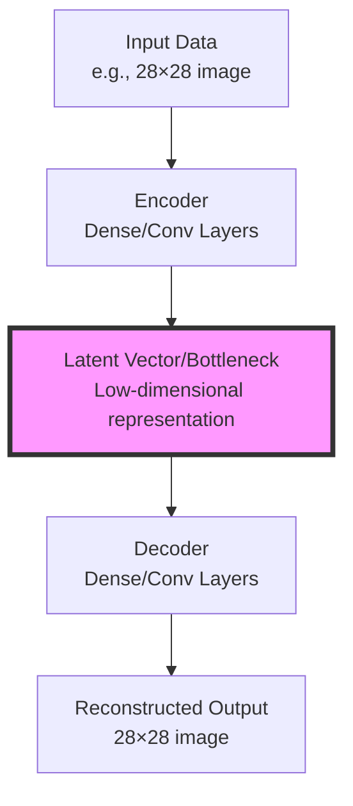

# Advanced Deep Learning - Webinars

## Table of Contents
- [Advanced Deep Learning - Webinars](#advanced-deep-learning---webinars)
  - [Table of Contents](#table-of-contents)
  - [1. Auto Encoders](#1-auto-encoders)
    - [1.1 Introduction to Auto Encoders](#11-introduction-to-auto-encoders)
      - [1.1.1 What is an Autoencoder?](#111-what-is-an-autoencoder)
      - [1.1.2 Core Architecture](#112-core-architecture)
        - [Architecture Flow Diagram](#architecture-flow-diagram)
        - [What is Latent Space?](#what-is-latent-space)
        - [Mathematical Formulation](#mathematical-formulation)
      - [1.1.3 Training Objective](#113-training-objective)
        - [Loss Function](#loss-function)
        - [Training Process](#training-process)
      - [1.1.4 Applications](#114-applications)
        - [Primary Applications](#primary-applications)
      - [Anomaly Detection Mechanism](#anomaly-detection-mechanism)
        - [Comparison with Traditional Methods](#comparison-with-traditional-methods)
      - [1.1.5 Types of Autoencoders](#115-types-of-autoencoders)
        - [Classification of Autoencoder Types](#classification-of-autoencoder-types)
    - [Summary](#summary)

---

## 1. Auto Encoders

### 1.1 Introduction to Auto Encoders

#### 1.1.1 What is an Autoencoder?

An autoencoder is a type of neural network designed to learn efficient data representations in an unsupervised manner. The fundamental principle is to learn a compressed (encoded) representation of the input data and then reconstruct the original input from this compressed form.

**Key Concept**: Autoencoders learn identity mapping through compression:

$$\text{output} \approx \text{input}$$

The network architecture consists of two primary components:

| Component | Function | Transformation |
|-----------|----------|----------------|
| **Encoder** | Compresses input into latent representation | $$\mathbf{z} = f(\mathbf{x})$$ |
| **Decoder** | Reconstructs input from latent representation | $$\hat{\mathbf{x}} = g(\mathbf{z})$$ |

where:
- $$\mathbf{x}$$ = input data
- $$\mathbf{z}$$ = latent representation (bottleneck)
- $$\hat{\mathbf{x}}$$ = reconstructed output
- $$f(\cdot)$$ = encoder function
- $$g(\cdot)$$ = decoder function

**Analogy**: Think of an autoencoder as a data compression system, similar to ZIP compression for files, but learned automatically by the neural network rather than using predefined algorithms.

---

#### 1.1.2 Core Architecture

##### Architecture Flow Diagram

The **latent space** or **bottleneck** is the compressed representation that captures the most important features of the input data.

##### What is Latent Space?

The **latent space** (also called the bottleneck or code layer) is the low-dimensional representation learned by the encoder. It serves as a compressed encoding of the input data, capturing only the most essential features needed for reconstruction.

**Key Properties of Latent Space:**

1. **Dimensionality Reduction**: The latent space has significantly fewer dimensions than the input space (e.g., 32 dimensions vs 784 pixels).

2. **Feature Compression**: It acts as an information bottleneck, forcing the network to learn the most salient features of the data while discarding redundant information.

3. **Learned Representation**: Unlike manual feature engineering, the latent representation is automatically learned from data through the training process.

4. **Semantic Meaning**: In well-trained autoencoders, nearby points in latent space often correspond to similar inputs, and the dimensions can capture meaningful variations in the data.

**Example**: For MNIST digit images (28×28 = 784 pixels), a latent space of 32 dimensions might encode features like:
- Digit identity (which number it represents)
- Writing style variations
- Rotation and scale
- Stroke thickness

**Mathematical Representation:**

For input $$\mathbf{x} \in \mathbb{R}^{784}$$, the latent representation is:

$$\mathbf{z} = f(\mathbf{x}) \in \mathbb{R}^{32}$$

The latent vector $$\mathbf{z}$$ contains 32 real numbers that encode all information necessary to reconstruct the original 784-dimensional input.

**Visualization Concept**: If the latent space is 2D or 3D, we can visualize how different inputs are organized in this space, revealing the structure and relationships learned by the autoencoder.

##### Mathematical Formulation

The complete autoencoder mapping can be expressed as:

$$\hat{\mathbf{x}} = g(f(\mathbf{x}))$$

For a simple autoencoder with one hidden layer:

**Encoder:**
$$\mathbf{z} = \sigma_1(\mathbf{W}_1\mathbf{x} + \mathbf{b}_1)$$

**Decoder:**
$$\hat{\mathbf{x}} = \sigma_2(\mathbf{W}_2\mathbf{z} + \mathbf{b}_2)$$

**Where:**
- $$\mathbf{W}_1, \mathbf{W}_2$$ are weight matrices
- $$\mathbf{b}_1, \mathbf{b}_2$$ are bias vectors
- $$\sigma_1, \sigma_2$$ are activation functions

---

#### 1.1.3 Training Objective

##### Loss Function

The autoencoder is trained to minimize the reconstruction error between the input and output. Common loss functions include:

**1. Mean Squared Error (MSE)** - for continuous data:

$$\mathcal{L}_{MSE} = \frac{1}{n}\sum_{i=1}^{n}(\mathbf{x}_i - \hat{\mathbf{x}}_i)^2$$

**2. Binary Cross-Entropy** - for binary or normalized [0,1] images:

$$\mathcal{L}_{BCE} = -\frac{1}{n}\sum_{i=1}^{n}[\mathbf{x}_i \log(\hat{\mathbf{x}}_i) + (1-\mathbf{x}_i)\log(1-\hat{\mathbf{x}}_i)]$$

**Where:**
- $$n$$ is the number of features/pixels
- $$\mathbf{x}_i$$ is the actual input value
- $$\hat{\mathbf{x}}_i$$ is the reconstructed output value

##### Training Process

| Step | Action | Goal |
|------|--------|------|
| 1 | Forward pass through encoder | Generate latent representation $$\mathbf{z}$$ |
| 2 | Forward pass through decoder | Reconstruct input as $$\hat{\mathbf{x}}$$ |
| 3 | Calculate reconstruction loss | Measure $$\mathcal{L}(\mathbf{x}, \hat{\mathbf{x}})$$ |
| 4 | Backpropagation | Update weights $$\mathbf{W}_1, \mathbf{W}_2, \mathbf{b}_1, \mathbf{b}_2$$ |
| 5 | Iterate | Minimize reconstruction error |

The optimization objective is:

$$\min_{\theta} \mathcal{L}(\mathbf{x}, g(f(\mathbf{x}; \theta_e); \theta_d))$$

where $$\theta = \{\theta_e, \theta_d\}$$ represents all encoder and decoder parameters.

---

#### 1.1.4 Applications

Autoencoders have diverse applications across various domains:

##### Primary Applications

| Application | Description | Use Case Example |
|-------------|-------------|------------------|
| **Dimensionality Reduction** | Learn non-linear compressed representations | Alternative to PCA, feature extraction |
| **Denoising** | Remove noise from corrupted data | Image restoration, signal cleaning |
| **Anomaly Detection** | Identify outliers through reconstruction error | Fraud detection, manufacturing defects |
| **Image Compression** | Store data efficiently using latent vectors | Lossy compression, bandwidth optimization |
| **Data Generation** | Generate new samples (VAE) | Synthetic data creation, data augmentation |
| **Feature Learning** | Unsupervised pre-training | Transfer learning, representation learning |

#### Anomaly Detection Mechanism

For anomaly detection, the reconstruction error serves as an anomaly score:

$$\text{Anomaly Score} = ||\mathbf{x} - \hat{\mathbf{x}}||^2$$

**Principle**: Normal data has low reconstruction error, while anomalous data has high reconstruction error because the autoencoder was trained primarily on normal patterns.

##### Comparison with Traditional Methods

| Aspect | PCA | Autoencoder |
|--------|-----|-------------|
| Linearity | Linear transformations only | Non-linear transformations possible |
| Learning | Analytical solution | Iterative optimization |
| Flexibility | Fixed basis | Learned representations |
| Complexity | Simple, fast | More complex, slower |
| Expressiveness | Limited | High (deep networks) |

---

#### 1.1.5 Types of Autoencoders

Different variants of autoencoders have been developed for specific purposes:

##### Classification of Autoencoder Types

| Type | Key Feature | Primary Use | Architecture Modification |
|------|-------------|-------------|---------------------------|
| **Basic/Vanilla Autoencoder** | Standard encoder-decoder | General compression | Fully connected layers |
| **Denoising Autoencoder (DAE)** | Trained on corrupted inputs | Noise removal | Corruption process added to input |
| **Sparse Autoencoder** | Sparsity constraint on hidden units | Feature learning | Sparsity penalty in loss function |
| **Convolutional Autoencoder** | Uses Conv layers | Image processing | Conv2D and Conv2DTranspose layers |
| **Variational Autoencoder (VAE)** | Probabilistic latent space | Generative modeling | Latent space sampling with KL divergence |
| **Contractive Autoencoder** | Penalty on Jacobian | Robust representations | Frobenius norm of Jacobian added to loss |

---

### Summary

Autoencoders are powerful neural network architectures that learn compressed representations of data through an encoder-decoder structure. The key insight is learning identity mapping through a bottleneck, forcing the network to extract meaningful features. With variants designed for specific tasks (denoising, generation, sparse coding), autoencoders serve as fundamental building blocks in unsupervised learning and generative modeling.

**Core Principle**:
$$\text{Compress} \rightarrow \text{Bottleneck} \rightarrow \text{Reconstruct}$$

The reconstruction quality and the learned latent representations make autoencoders valuable tools for dimensionality reduction, anomaly detection, and as preprocessing steps for downstream tasks.