# MLOps Course - CS1: Introduction to MLOps

**Course**: MTech AI/ML - BITS Pilani WILP
**Author**: Amit Kumar
**Institution**: BITS Pilani
**Enhanced with**: Practical examples, real-world analogies, and exam-focused content

---

## Table of Contents

### CS1 - 1.1: MLOps Introduction - Three Levels of ML Software
- [1.1.1 Overview](#111-overview)
- [1.1.2 Three Main Assets](#112-three-main-assets)
- [1.1.3 Level 1: Data Engineering](#113-level-1-data-engineering)
- [1.1.4 Level 2: Model Engineering](#114-level-2-model-engineering)
- [1.1.5 Level 3: Model Deployment (Code Engineering)](#115-level-3-model-deployment-code-engineering)
- [1.1.6 Key Concepts](#116-key-concepts)
- [1.1.7 Best Practices](#117-best-practices)

### CS1 - 1.2: Machine Learning Lifecycle
- [1.2.1 Lifecycle Overview](#121-lifecycle-overview)
- [1.2.2 Phase 1: Business Goal Identification](#122-phase-1-business-goal-identification)
- [1.2.3 Phase 2: ML Problem Framing](#123-phase-2-ml-problem-framing)
- [1.2.4 Phase 3: Data Processing](#124-phase-3-data-processing)
- [1.2.5 Phase 4: Model Development](#125-phase-4-model-development)
- [1.2.6 Phase 5: Model Deployment](#126-phase-5-model-deployment)
- [1.2.7 Phase 6: Model Monitoring](#127-phase-6-model-monitoring)
- [1.2.8 Supporting Components](#128-supporting-components)

### CS1 - 1.3: ML System Architecture
- [1.3.1 Architecture Overview](#131-architecture-overview)
- [1.3.2 Entry Points](#132-entry-points)
- [1.3.3 System Components](#133-system-components)

---

# CS1 - 1.1: MLOps Introduction - Three Levels of ML Software

## 1.1.1 Overview

**Goal of Machine Learning Projects**: Build a statistical model by using collected data and applying machine learning algorithms.

**Current Challenge**: While ML/AI is being rapidly adopted across industries, building successful ML-based software projects remains difficult.

### The Three Essential Technical Methodologies

| Level | Methodology | Description |
|-------|------------|-------------|
| **Level 1** | Data Engineering | Data acquisition and data preparation |
| **Level 2** | Model Engineering | ML model training and serving |
| **Level 3** | Code Engineering | Integrating ML model into the final product |

---

## 1.1.2 Three Main Assets

Every ML-based software system must manage three core assets:

```
┌──────────┐
│   Data   │ ◄─── Raw inputs, features, labels
└──────────┘

┌──────────┐
│  Model   │ ◄─── Trained algorithms, parameters
└──────────┘

┌──────────┐
│   Code   │ ◄─── Implementation, pipelines
└──────────┘
```

**💡 Key Insight**: Unlike traditional software where code is king, ML systems have THREE equally important assets that must work in harmony!

---

## 1.1.3 Level 1: Data Engineering

### Definition
The initial step in any data science workflow to **acquire and prepare data** for analysis.

**🎯 Real-World Analogy**: Think of data engineering as running a quality control factory. Raw materials (data) come in from various suppliers, often damaged or incomplete. Your job? Turn that mess into pristine, ready-to-use inputs for your ML models—just like a chef inspecting and preparing ingredients before cooking!

### Key Characteristics
- Data integrated from **various resources** with **different formats**
- **Most expensive** phase (resources and time)
- **Critical activity** to prevent error propagation

### Data Engineering Pipeline Operations


| Operation | Purpose | Key Activities |
|-----------|---------|----------------|
| **Data Ingestion** | Collect data using various frameworks | Spark, HDFS, CSV; Synthetic data generation |
| **Data Exploration** | Profile data content and structure | Generate metadata (max, min, avg) |
| **Data Validation** | Error detection | Check missing values, duplicates, schema, outliers |
| **Data Wrangling** | Re-format and correct errors | Imputation, deduplication, transformation |
| **Data Labeling** | Assign categories to data points | Manual/automated annotation for supervised learning |
| **Data Splitting** | Divide data for ML development | Train (60-80%), Validate (10-20%), Test (10-20%) |

### Data Quality Checklist

#### From Data Vendors/Providers:
- ✓ Missing values
- ✓ Duplicates
- ✓ Schema validation
- ✓ Outlier detection

#### Clean Data Processing:
- ETL pipelines
- Format transformation (ZIP, XML → Data Lake)

### Detailed Operation Explanations

#### 1. Data Ingestion
**Real-World Analogy**: Ordering ingredients from multiple suppliers. Some arrive in damaged boxes, some are mislabeled, and some are missing entirely. You need to organize everything before cooking!

#### 2. Data Exploration (EDA)

**Output Metrics Example:**
```python
{
  "feature_name": "customer_age",
  "min": 18,
  "max": 95,
  "avg": 42.5,
  "missing_count": 127,
  "data_type": "integer"
}
```

**Real-World Analogy**: Like a chef inspecting ingredients before cooking—checking freshness, quantity, and quality. You wouldn't start cooking without knowing what you have!

#### 3. Data Validation

**Example Validation Rules:**
```
✓ Age must be between 0 and 120
✓ Email must contain '@' symbol
✓ Date format must be YYYY-MM-DD
✓ Product_ID must exist in product catalog
✓ Credit_Score range: 300-850
✓ Transaction_Amount > 0
```

**Real-World Analogy**: Airport security for your data. Every record goes through scanners to detect anomalies before boarding the "Model Training Flight."

#### 4. Data Wrangling (Cleaning)

**Missing Values Imputation:**
```
Strategy Options:
├── Mean/Median/Mode (for numerical data)
├── Forward/Backward Fill (for time series)
├── Model-based prediction
└── Domain-specific rules
```

**Practical Example:**
```
Problem: 8% of "Annual_Income" values are missing

Solution Strategy:
├── Option A: Median Imputation (simple, fast)
│   → Use median if data is skewed
├── Option B: Model-based Imputation (more accurate)
│   → Train ML model to predict income from
│      other features (location, age, education)
└── Option C: Create "missing" indicator feature
    → Add binary flag: Income_Missing (0/1)
    → Preserve information that data was missing
```

**Real-World Analogy**: Like editing a manuscript. You fix typos, fill in missing words, remove duplicate paragraphs, and ensure consistency—all before sending to the publisher!

#### 5. Data Labeling

**Example:**
```
Email Text: "Congratulations! You've won $1M..."
Label: SPAM ✓

Image: [Photo of airport tarmac with aircraft]
Task: Draw bounding boxes
Labels: [Boeing ✓, Airbus ✓]
```

**Real-World Analogy**: Creating answer keys for an exam. The model studies from these labeled examples to learn patterns.

#### 6. Data Splitting ✂️

**What's Happening?**
Dividing the cleaned, labeled dataset into separate subsets for different stages of the machine learning workflow.

**The Three-Way Split:**
```
Complete Dataset (100%)
         ↓
    ┌────┴────┐
    │ SPLIT   │
    └────┬────┘
         ↓
    ┌────────────────────────────────┐
    │                                │
Training Set    Validation Set    Test Set
   (70%)           (15%)          (15%)
     ↓               ↓               ↓
  Model          Hyperparameter    Final
  Learning         Tuning        Evaluation
```

**Purpose of Each Split:**

| Split | Purpose | When Used | Key Point |
|:------|:--------|:----------|:----------|
| **Training Set** | Teach the model patterns | During model training | Model "sees" and learns from this data |
| **Validation Set** | Tune hyperparameters | During model optimization | Used to prevent overfitting, adjust parameters |
| **Test Set** | Final performance check | After training complete | **Never seen by model** - unbiased evaluation |

**Common Split Ratios:**
```
Standard Split:
├── 70% Training, 15% Validation, 15% Test
├── 80% Training, 10% Validation, 10% Test (for larger datasets)
└── 60% Training, 20% Validation, 20% Test (for smaller datasets)

Special Cases:
├── Time Series: Chronological split (past → future)
├── Cross-Validation: K-fold splitting for robust evaluation
└── Stratified Split: Maintains class distribution across splits
```

**Why It Matters:**
- **Prevents Data Leakage**: Test data must remain unseen to get honest performance metrics
- **Enables Fair Comparison**: All models evaluated on same test set
- **Validates Generalization**: Model must perform well on data it hasn't seen

**Example:**
```
Original Dataset: 10,000 customer records (labeled)
                     ↓
After Splitting:
├── Training:   7,000 records (model learns patterns)
├── Validation: 1,500 records (tune hyperparameters)
└── Test:       1,500 records (final acceptance test)

⚠️  Critical Rule: Test set is locked away until final evaluation!
```

**Real-World Analogy**: Like preparing for an exam. You study from textbooks (training set), practice with sample questions (validation set), and take the final exam with completely new questions (test set) to prove you truly learned the concepts.

---

## 1.1.4 Level 2: Model Engineering

### Definition
The **core of the ML workflow** - executing machine learning algorithms to obtain an ML model.

**🎯 Real-World Analogy**: If Data Engineering is about preparing ingredients, Model Engineering is about perfecting the recipe. Your goal? Create an intelligent function that learns patterns from data and makes accurate predictions.

### Model Engineering Pipeline

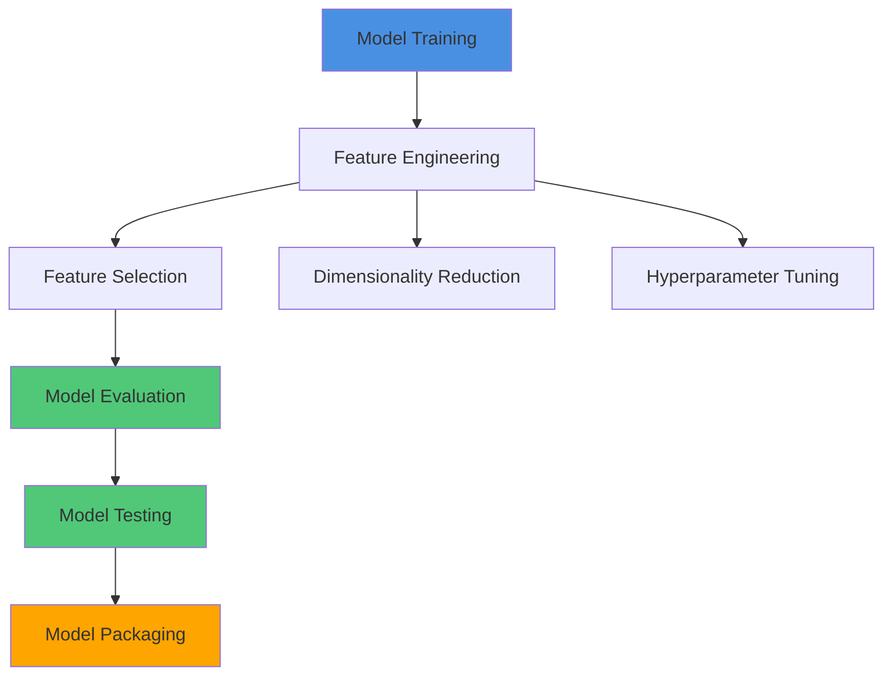

### 1. Model Training Components

| Component | Description | Key Activities |
|-----------|-------------|----------------|
| **Feature Engineering** | Create and transform features | Extract, select, transform variables |
| **Feature Selection** | Identify predictive features | Correlation analysis, remove redundant features (>60% correlation) |
| **Dimensionality Reduction** | Reduce feature space | PCA, reduce from 400 to 50 important features |
| **Hyperparameter Tuning** | Optimize model parameters | Grid search, random search, Bayesian optimization |

### 2. Feature Selection Strategy

**The Core Problem:**
- Models are picky eaters—they only understand **fixed-size arrays of numbers**
- More features ≠ Better performance (often the opposite!)
- The art is selecting the RIGHT features, not ALL features

**Why It Matters:**
```
Scenario A: 400 features
├── Many are redundant (highly correlated)
├── Some are irrelevant to prediction
├── Model is slow, complex, prone to overfitting
└── Result: Poor performance, high computational cost

Scenario B: 50 carefully selected features
├── Each feature provides unique information
├── Model trains faster
├── Better generalization
└── Result: Higher accuracy, lower cost ✓
```

**Key Technique: Correlation Analysis**

**The Rule:**
```python
if Corr(Feature_A, Feature_B) >= 0.60:  # Threshold (commonly 60-80%)
    drop_one_feature()  # Keep the more informative one
```

**Practical Example:**
```
Feature Set:
├── Daily_Temp_Celsius = 25°C
├── Daily_Temp_Fahrenheit = 77°F  ← Redundant! (Corr = 1.0)
└── Humidity = 65%

Action: Drop either Celsius or Fahrenheit
Result: 3 features → 2 features (no information loss!)

Real-World Analogy: If you're predicting movie success, having both
"Opening Weekend Box Office" and "First 3-Day Revenue" is redundant
—they're measuring the same thing!
```

**Feature Selection Process:**
```
Step 1: Analyze correlation between features
         ↓
Step 2: Remove highly correlated features (threshold: 60%+)
         ↓
Step 3: Select independent features with new information
         ↓
Step 4: Ensure 20%+ new information in training data
```

### 3. Dimensionality Reduction

**The Scale Problem:**
```
Original: 1 Billion rows × 400 features = 400 Billion data points
                                         ↓
Reduced:  1 Billion rows × 50 features  = 50 Billion data points

Result: 87.5% reduction in data size!
        ↓
Benefits:
├── Faster training (10x or more)
├── Lower memory requirements
├── Reduced risk of overfitting
└── Often improves model performance
```

**Common Techniques:**
- **PCA (Principal Component Analysis)**: Find the most important directions in data
- **Feature Extraction**: Create new, more informative features
- **Autoencoder**: Neural network-based compression

**Image Example:**
```
Raw Image: 1000×1000 pixels = 1,000,000 input values
                              ↓
Resize:    224×224 pixels   = 50,176 input values (95% smaller!)
                              ↓
Or Extract: 512 learned features (99.95% smaller!)

The model still "sees" the important patterns!
```

**Real-World Analogy**: Like creating a movie trailer. You compress a 2-hour film into 2 minutes while preserving the key story elements that help predict if you'll enjoy it.

### 4. Model Selection Example

**Problem**: Credit Card Fraud Detection

| Scenario | Data Condition | Solution |
|----------|---------------|----------|
| Imbalanced Data | 85,000 non-fraud<br>15,000 fraud | **Option 1**: Balance data → Logistic Regression<br>**Option 2**: Use Ensemble Models (RF, XGBoost) |

### 5. Model Evaluation & Testing

#### Model Evaluation: Validation Before Production

**What's Happening?**
Validating the trained model against the **validation set** to ensure it meets the original objectives and performance requirements before serving in production.

**Why It Matters:**
- Catches overfitting early (model memorizes training data)
- Allows hyperparameter tuning without touching test set
- Ensures model generalizes to unseen data
- Provides checkpoint before expensive deployment

**Key Evaluation Metrics:**

**Classification Tasks:**
```
Metrics to Track:
├── Accuracy: Overall correctness (TP+TN)/(Total)
├── Precision: Of predicted positives, how many are correct?
├── Recall: Of actual positives, how many did we catch?
├── F1-Score: Harmonic mean of precision and recall
└── AUC-ROC: Trade-off between true/false positive rates
```

**Regression Tasks:**
```
Metrics to Track:
├── MAE (Mean Absolute Error): Average magnitude of errors
├── RMSE (Root Mean Squared Error): Penalizes large errors
├── R² Score: Proportion of variance explained
└── MAPE (Mean Absolute Percentage Error): Percentage-based error
```

**The Evaluation Loop:**
```
┌─────────────────────────────────────┐
│   ITERATIVE EVALUATION CYCLE        │
├─────────────────────────────────────┤
│                                     │
│  1. Train model on Training Set     │
│           ↓                         │
│  2. Evaluate on Validation Set      │
│           ↓                         │
│  3. Check metrics vs. objectives    │
│           ↓                         │
│  4. Adjust hyperparameters          │
│           ↓                         │
│  5. Repeat until satisfied          │
│                                     │
└─────────────────────────────────────┘

Goal: Find optimal configuration before final test
```

**Example Validation Process:**
```
Model: Customer Churn Prediction
Original Objective: 85% accuracy, 80% recall

Iteration 1: Learning Rate = 0.01
  Validation Results: 78% accuracy, 65% recall ✗ (Too low)

Iteration 2: Learning Rate = 0.001, More epochs
  Validation Results: 83% accuracy, 75% recall ✗ (Getting closer)

Iteration 3: Add regularization, feature engineering
  Validation Results: 87% accuracy, 82% recall ✓ (Meets objectives!)

Decision: Proceed to Model Testing phase
```

**Real-World Analogy**: Like rehearsing for a theater performance. You practice in front of a small audience (validation set) to get feedback and make adjustments before the opening night (test set).

#### Model Testing: The Final Acceptance Test

**What's Happening?**
Performing the final **"Model Acceptance Test"** using the hold-back **test dataset** that the model has never seen during training or validation.

**Critical Rules:**
```
⚠️  THE TEST SET IS SACRED ⚠️

✗ NEVER use test data during training
✗ NEVER tune hyperparameters based on test results
✗ NEVER run multiple experiments on test set
✓ ONLY use test set ONCE for final evaluation
```

**The Testing Protocol:**

```
┌──────────────────────────────────────────┐
│     FINAL MODEL ACCEPTANCE TEST          │
├──────────────────────────────────────────┤
│                                          │
│  1. Lock the trained model (no changes)  │
│  2. Load the untouched test dataset      │
│  3. Generate predictions                 │
│  4. Calculate performance metrics        │
│  5. Compare against success criteria     │
│  6. Make GO/NO-GO decision               │
│                                          │
└──────────────────────────────────────────┘
```

**Decision Framework:**

| Test Result | Validation Result | Decision | Action |
|:------------|:------------------|:---------|:-------|
| ✓ Pass | ✓ Pass | **DEPLOY** | Model is production-ready |
| ✗ Fail | ✓ Pass | **STOP** | Model overfit to validation set |
| ✗ Fail | ✗ Fail | **RETRAIN** | Model needs fundamental improvements |
| ✓ Pass | ✗ Fail | **INVESTIGATE** | Unusual - check data quality |

**Example Test Report:**
```
═══════════════════════════════════════════
       MODEL ACCEPTANCE TEST REPORT
═══════════════════════════════════════════

Model: Fraud Detection System
Test Date: 2024-11-15
Test Dataset: 15,000 transactions (never seen)

━━━━━━━━━━━━━━━━━━━━━━━━━━━━━━━━━━━━━━━━
PERFORMANCE METRICS
━━━━━━━━━━━━━━━━━━━━━━━━━━━━━━━━━━━━━━━━

Metric              | Target  | Achieved | Status
--------------------|---------|----------|--------
Accuracy            | ≥ 95%   | 96.2%    | ✓ PASS
Precision           | ≥ 90%   | 92.1%    | ✓ PASS
Recall (Fraud)      | ≥ 85%   | 88.4%    | ✓ PASS
F1-Score            | ≥ 87%   | 90.1%    | ✓ PASS
False Positive Rate | < 5%    | 3.8%     | ✓ PASS

━━━━━━━━━━━━━━━━━━━━━━━━━━━━━━━━━━━━━━━━
BUSINESS IMPACT ANALYSIS
━━━━━━━━━━━━━━━━━━━━━━━━━━━━━━━━━━━━━━━━

Estimated fraud caught:      88.4% (up from 60% manual)
False alarms per day:        ~38 (acceptable for review team)
Projected annual savings:    $2.4M

━━━━━━━━━━━━━━━━━━━━━━━━━━━━━━━━━━━━━━━━
FINAL DECISION
━━━━━━━━━━━━━━━━━━━━━━━━━━━━━━━━━━━━━━━━

✓ MODEL APPROVED FOR PRODUCTION DEPLOYMENT

Next Step: Model Packaging & Integration
═══════════════════════════════════════════
```

**Real-World Analogy**: Like the final dress rehearsal before opening night. Everything is locked in, and this is the last chance to verify the show is ready for the audience. No more changes allowed after this point!

### 6. Model Packaging

**What's Happening?**
Exporting the final, tested ML model into a standardized format that can be consumed by business applications and production systems.

**Why Packaging Matters:**
- Models trained in Python/R need to run in Java/.NET/Mobile apps
- Standardized formats ensure interoperability
- Enables version control and model registry
- Facilitates A/B testing and rollback capabilities

**Common Model Packaging Formats:**

| Format | Full Name | Best For | File Type |
|:-------|:----------|:---------|:----------|
| **PMML** | Predictive Model Markup Language | Traditional ML (trees, regressions) | `.pmml` (XML) |
| **ONNX** | Open Neural Network Exchange | Deep learning, cross-platform | `.onnx` (binary) |
| **PFA** | Portable Format for Analytics | Statistical models, streaming | `.pfa` (JSON) |
| **SavedModel** | TensorFlow SavedModel | TensorFlow models | Directory |
| **Pickle/Joblib** | Python serialization | Python-only deployments | `.pkl`, `.joblib` |

**The Packaging Process:**

```
┌────────────────────────────────────────────┐
│         MODEL PACKAGING WORKFLOW           │
├────────────────────────────────────────────┤
│                                            │
│  Trained Model (in memory)                 │
│         ↓                                  │
│  ┌──────────────────┐                      │
│  │ 1. SERIALIZE     │ Convert to standard  │
│  │    MODEL         │ format (ONNX/PMML)   │
│  └────────┬─────────┘                      │
│           ↓                                │
│  ┌──────────────────┐                      │
│  │ 2. INCLUDE       │ Feature preprocessing │
│  │    METADATA      │ Model version, metrics│
│  └────────┬─────────┘                      │
│           ↓                                │
│  ┌──────────────────┐                      │
│  │ 3. CREATE MODEL  │ Package dependencies, │
│  │    ARTIFACTS     │ config files          │
│  └────────┬─────────┘                      │
│           ↓                                │
│  ┌──────────────────┐                      │
│  │ 4. REGISTER IN   │ Central model registry│
│  │    REPOSITORY    │ with version control  │
│  └────────┬─────────┘                      │
│           ↓                                │
│  📦 Deployment-Ready Package               │
│                                            │
└────────────────────────────────────────────┘
```

**What's Included in the Package:**

```
model_package/
│
├── model.onnx                    # Serialized model
├── model_metadata.json           # Version, metrics, dates
│   ├── model_version: "2.1.0"
│   ├── training_date: "2024-11-15"
│   ├── test_accuracy: 96.2%
│   └── framework: "scikit-learn 1.3"
│
├── feature_config.json           # Feature definitions
│   ├── feature_names: [...]
│   ├── feature_types: [...]
│   └── preprocessing_steps: [...]
│
├── requirements.txt              # Dependencies
├── model_card.md                # Documentation
└── deployment_guide.md          # Integration instructions
```

**Real-World Analogy**: Like packaging a gourmet meal for delivery. The chef (data scientist) has perfected the recipe and cooked it (trained the model). Now it needs to be properly packaged with instructions (metadata), ingredients list (dependencies), and heating guidelines (deployment guide) so it can be delivered and enjoyed anywhere!

### Model Learning Process

During training, the model learns:
- ✓ Hidden patterns in data
- ✓ Mapping function: Input → Target
- ✓ Feature relationships

---

## 1.1.5 Level 3: Model Deployment (Code Engineering)

### Definition
Integrating the ML model into existing software as part of a business application (mobile/desktop).

### Deployment Workflow

```
Model → QA Testing → Production → UAT → Deployed
         (Unit Tests)              (User Acceptance)
```

### Model Deployment Pipeline Operations

#### 1. Model Serving

**Requirements**:
- Feature vectors for predictions
- API endpoints for inference requests
- Scalable infrastructure

#### 2. Model Performance Monitoring

| Metric | Formula/Description | Purpose |
|--------|---------------------|---------|
| **Time Complexity** | Inference latency, processing time per request | Performance optimization |
| **Failure Rate** | (Number of failures / Total runs) | Reliability tracking |
| **Data Drift** | Changes in input data distribution | Detect distribution shift |
| **Performance Drop** | Decline in prediction accuracy | Model degradation alert |

#### Monitoring Triggers

**A. Scheduled Jobs**
```
Example Schedule:
10:00 AM ─── Run Pipeline 1-5
04:00 PM ─── Run Pipeline 6-10
10:00 PM ─── Run Pipeline 11-20
```

**B. Event-Based Triggers**
- Business team actions
- Data provider updates
- Ground truth data availability
- User actions → Data lake folder creation

#### 3. Model Performance Logging

**Logged Information**:
- Request timestamp
- Input features
- Prediction output
- Model version
- Response time

### Real-World Deployment Example

**AI/ML System Operating Hours**: 7 AM to 10 PM

| Component | Details |
|-----------|---------|
| **Scheduled Pipelines** | 20 pipelines, 3 runs/day |
| **Event Triggers** | ~5 per day |
| **Example Flow** | 7:00 AM: Forecasting runs<br>10:00 AM: Dashboard updated<br>11:00 AM: Stakeholders review |

### Failure Handling Process

```
1. Identify: Start time and end time
       ↓
2. Diagnose: Root cause (data/endpoint issues)
       ↓
3. Fix: Code or configuration bugs
       ↓
4. Rerun: Execute pipeline
       ↓
5. Verify: Confirm output correctness
```

---

## 1.1.6 Key Concepts

### Explainable AI and Interpretability

#### Model Promotion Requirements
- Data scientists/MLOps explain models to stakeholders
- Non-technical explanations required
- Feature selection justification
- Ground truth validation
- Human-in-the-loop considerations

#### Interpretability vs Performance Trade-off

```
High Interpretability ◄───────────────► High Performance
Low Performance                          Low Interpretability

Examples:
Linear Models          Decision Trees          Neural Networks
(White Box)           (Gray Box)               (Black Box)
```

**The Fundamental Dilemma:**
```
↑ Model Complexity = ↑ Performance + ↓ Interpretability
↓ Model Complexity = ↓ Performance + ↑ Interpretability

You cannot maximize both simultaneously!
```

#### Stakeholder-Specific Explanation Needs

Different audiences need different explanations:

| Stakeholder | Needs | XAI Approach |
|:------------|:------|:-------------|
| **Business Executive** | "Which factors drove this decision?" | Feature importance rankings |
| **Compliance Officer** | "Can we legally justify this?" | Audit trail, threshold rules |
| **End Customer** | "Why was I rejected?" | Simple, actionable reasons |
| **Data Scientist** | "Is the model learning correctly?" | Error analysis, validation curves |

#### Black Box vs White Box Models

**Neural Networks (Black Box) Example:**

**What Makes Them "Black Boxes"?**
```
Input Layer (e.g., 50 features)
    ↓
Hidden Layer 1 (e.g., 128 neurons)
    ↓ [millions of learned parameters]
Hidden Layer 2 (e.g., 64 neurons)
    ↓ [complex non-linear transformations]
Hidden Layer 3 (e.g., 32 neurons)
    ↓
Output Layer (e.g., 1 prediction)

Question: Which input feature caused this prediction?
Answer: 🤷 It's complicated! (entangled across millions of weights)
```

**The Challenge:**
- **High Accuracy**: 95%+ on complex tasks (image recognition, NLP)
- **Zero Transparency**: Cannot easily explain WHY a specific prediction was made
- **Stakeholder Problem**: "The AI says reject this loan application... but why?"

**Linear Regression (White Box) Example:**

**What Makes It Interpretable?**
```python
Prediction = β₀ + β₁×Age + β₂×Income + β₃×CreditScore

Example:
LoanAmount = 10,000 + 500×Age + 0.3×Income + 100×CreditScore
                     ↑          ↑               ↑
                   Clear!    Crystal!      Obvious!

"Each year of age adds $500 to loan eligibility"
"Each dollar of income adds $0.30"
"Each credit score point adds $100"
```

**The Trade-off:**
- **High Interpretability**: Anyone can understand the model
- **Limited Power**: Assumes linear relationships (often too simplistic)
- **Lower Accuracy**: May miss complex patterns (e.g., 75% vs 95% accuracy)

#### Decision Framework for Model Selection

**When to Choose Interpretable Models:**
- ✅ Regulated industries (finance, healthcare, legal)
- ✅ High-stakes decisions affecting people's lives
- ✅ Need to explain to non-technical stakeholders
- ✅ Trust is more important than marginal accuracy gains
- ✅ Compliance requirements mandate explainability

**When to Choose Black Box Models:**
- ✅ Accuracy is paramount (medical diagnosis, fraud detection)
- ✅ Low-stakes applications (product recommendations)
- ✅ Clear business value from extra 5-10% accuracy
- ✅ Can invest in XAI tools for post-hoc explanations
- ✅ Internal use with technical users

**Real-World Requirements:**
```
High-Stakes Decisions (Healthcare, Finance, Legal):
├── MUST have explanations
├── MUST be auditable
├── MUST comply with regulations (GDPR, Fair Lending)
└── Black boxes are often NOT acceptable

Low-Stakes Decisions (Movie recommendations, Ad targeting):
├── Explanations nice to have
├── Performance is priority
└── Black boxes are acceptable
```

### Machine Learning Engineering Components

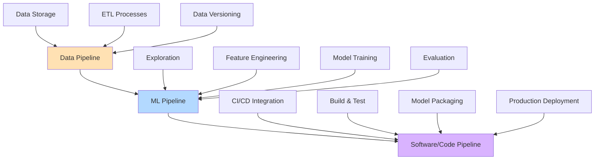

---

## 1.1.7 Best Practices

### Data Engineering Best Practices

| # | Practice | Benefit |
|---|----------|---------|
| 1 | Always validate data quality before training | Prevents garbage in, garbage out |
| 2 | Document data transformations | Ensures reproducibility |
| 3 | Version your datasets | Tracks changes over time |
| 4 | Implement automated validation checks | Early error detection |
| 5 | Monitor data drift in production | Maintains model accuracy |

### Model Engineering Best Practices

| # | Practice | Benefit |
|---|----------|---------|
| 1 | Select models appropriate for data | Better performance (e.g., ensemble for imbalanced data) |
| 2 | Perform thorough feature engineering | Improves model accuracy |
| 3 | Use cross-validation | Ensures model robustness |
| 4 | Track experiments and versions | Reproducibility and comparison |
| 5 | Balance interpretability with performance | Meets business requirements |

### Deployment Best Practices

| # | Practice | Benefit |
|---|----------|---------|
| 1 | Implement comprehensive monitoring from day one | Early issue detection |
| 2 | Set up scheduled and event-based triggers | Flexibility in operations |
| 3 | Log all predictions | Future analysis and debugging |
| 4 | Plan for model retraining | Maintains performance over time |
| 5 | Conduct thorough UAT before production | Reduces deployment risks |
| 6 | Maintain model documentation | Stakeholder alignment |

### Pipeline Management Best Practices

1. **Use CI/CD pipelines** for automation
2. **Implement error handling** and retry mechanisms
3. **Set up alerts** for pipeline failures
4. **Monitor resource utilization** (time, compute, memory)
5. **Version control** all code and configurations

---

## Complete ML Workflow Summary

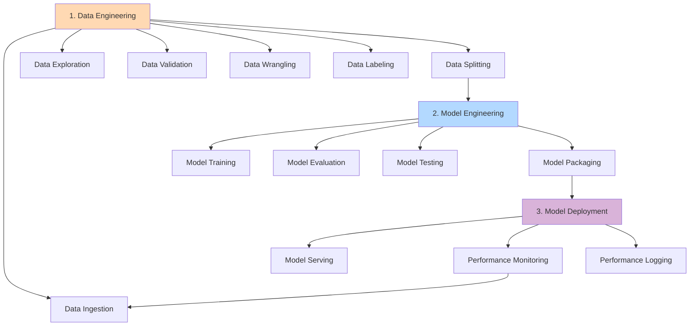

### Feedback Loop

The ML workflow is **iterative**:
- Monitoring feedback → Data collection
- Performance metrics → Model retraining
- Data drift detection → Pipeline updates
- Stakeholder feedback → Feature selection

---

# CS1 - 1.2: Machine Learning Lifecycle

## 1.2.1 Lifecycle Overview

### Definition
A **cyclic iterative process** with instructions and best practices to use across defined phases while developing an ML workload, adding clarity and structure for project success.

### Six Phases of ML Lifecycle


### Lifecycle Phases Summary

| Phase | Key Focus | Main Activities |
|-------|-----------|----------------|
| **1. Business Goal** | Problem identification | Define success criteria, measure business value |
| **2. ML Problem Framing** | Convert to ML problem | Define inputs, outputs, metrics to optimize |
| **3. Data Processing** | Prepare data | Collection, preprocessing, feature engineering |
| **4. Model Development** | Build & train model | Training, tuning, evaluation |
| **5. Deployment** | Production release | Inference, predictions |
| **6. Monitoring** | Performance tracking | Early detection, mitigation |

### Key Characteristics

✓ **Non-Sequential**: Phases are not necessarily sequential
✓ **Feedback Loops**: Can interrupt the cycle across lifecycle phases
✓ **Iterative**: Continuous improvement based on monitoring

---

## 1.2.2 Phase 1: Business Goal Identification

### Importance
**The most important phase**, particularly challenging when considering ML solutions because ML is constantly evolving technology.

### Core Requirements

| Requirement | Description |
|-------------|-------------|
| **Clear Problem Definition** | Understanding the problem and business value to be gained |
| **Measurable Value** | Ability to measure against specific objectives and success criteria |
| **Achievable Target** | Target should be achievable with clear path to production |
| **Stakeholder Alignment** | Involve all relevant stakeholders from the beginning |

### Steps in Business Goal Phase

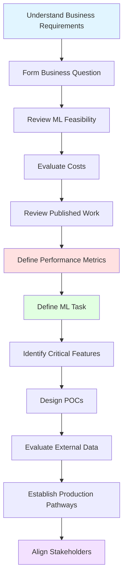

#### Detailed Steps

| Step | Activity | Purpose |
|------|----------|---------|
| 1 | Understand business requirements | Establish foundation |
| 2 | Form a business question | Define problem scope |
| 3 | Review ML feasibility & data requirements | Assess viability |
| 4 | Evaluate costs | Data acquisition, training, inference, wrong predictions |
| 5 | Review proven/published work | Learn from similar domains |
| 6 | Determine key performance metrics | Including acceptable errors |
| 7 | Define ML task | Based on business question |
| 8 | Identify critical features | Must-have features |
| 9 | Design small, focused POCs | Validate assumptions |
| 10 | Evaluate external data sources | Assess if they improve performance |
| 11 | Establish pathways to production | Plan deployment strategy |
| 12 | Consider new business processes | Resulting from implementation |
| 13 | Align relevant stakeholders | Ensure buy-in and support |

---

## 1.2.3 Phase 2: ML Problem Framing

### Definition
Business problem is **framed as a machine learning problem**, defining what is observed and what should be predicted (label/target variable).

### Core Activity
**Determining what to predict and how performance/error metrics must be optimized** is the key step in this phase.

### Steps in ML Problem Framing

| Step | Activity | Description |
|------|----------|-------------|
| 1 | **Define Success Criteria** | What constitutes successful project outcome |
| 2 | **Establish Performance Metric** | Observable and quantifiable (e.g., accuracy) |
| 3 | **Stakeholder Agreement** | Ensure understanding of defined metrics |
| 4 | **Formulate ML Question** | Define inputs, desired outputs, metric to optimize |
| 5 | **Evaluate ML Appropriateness** | Determine if ML is the right approach |
| 6 | **Consider Simple Solutions** | Some problems don't need ML - simple rules may suffice |
| 7 | **Assess Data Sufficiency** | Verify sufficient data exists for ML solution |
| 8 | **Create Data Strategy** | Data sourcing and annotation objectives |
| 9 | **Start Simple** | Begin with simple, interpretable model for easier debugging |

### Decision Framework

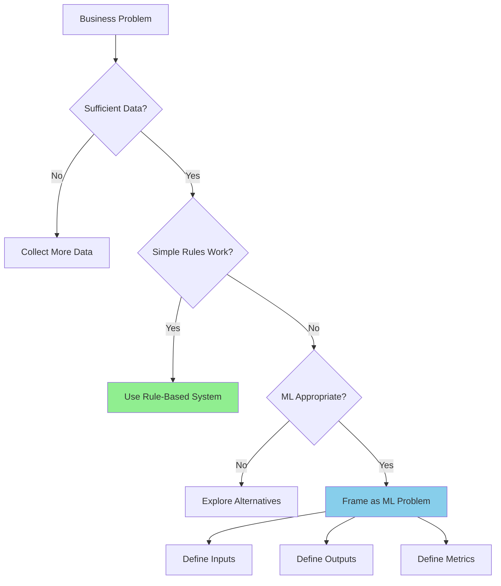

### Key Considerations

| Consideration | Question to Ask |
|---------------|-----------------|
| **ML Necessity** | Is ML really needed, or can rules solve it? |
| **Data Availability** | Do we have sufficient data? |
| **Performance Metrics** | What metrics align with business goals? |
| **Model Interpretability** | Do stakeholders need to understand predictions? |
| **Resource Requirements** | What are training/inference costs? |

---

## 1.2.4 Phase 3: Data Processing

### Overview
Training an accurate ML model requires data processing to convert data into a usable format.

### Data Functions in ML

| Function | Description |
|----------|-------------|
| **Define Goal** | Output representation and input-output relationships |
| **Train Algorithm** | Associate inputs to outputs |
| **Measure Performance** | Evaluate if performance target was met |
| **Build Baselines** | Monitor production model performance |

### Data Processing Components

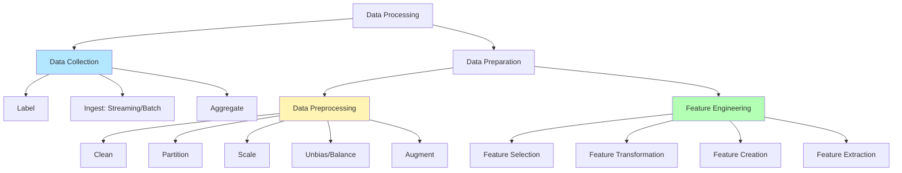

### 3.4.1 Data Collection

#### Activities

| Activity | Description | Details |
|----------|-------------|---------|
| **Label** | Assign data to categories | Data with known target answers; manual or automated labeling |
| **Ingest** | Capture and store data | Real-time (streaming) or historical (batch) |
| **Aggregate** | Combine multiple sources | Time-series, events, sensors, IoT, social networks |

#### Data Technologies Stack

```
┌─────────────────────────────────────────┐
│         DATA SOURCES                    │
│  Time-Series │ Events │ Sensors │ IoT   │
└─────────────────────────────────────────┘
              ↓
┌─────────────────────────────────────────┐
│       DATA INGESTION                    │
│  Batch Processing │ Stream Analytics    │
└─────────────────────────────────────────┘
              ↓
┌─────────────────────────────────────────┐
│       DATA TECHNOLOGIES                 │
│  ETL Pipeline │ Data Lake │ Data Catalog│
│  Database │ Data Warehouse              │
└─────────────────────────────────────────┘
```

### 3.4.2 Data Preparation

#### Key Principle
**ML models are only as good as the data used to train them**

#### Components Overview

| Component | Purpose |
|-----------|---------|
| **Data Preprocessing** | Put data into right shape and quality |
| **Feature Engineering** | Select and transform variables for predictive modeling |
| **Data Wrangling** | Interactive data preparation during analysis |
| **Exploratory Data Analysis (EDA)** | Understand data, sanity checks, validate quality |
| **Data Visualization** | Identify patterns not evident in tables |

#### Data Preprocessing Operations

| Operation | Strategies | Key Activities |
|-----------|-----------|----------------|
| **Clean** | Replace, Impute, Remove | • Remove outliers and duplicates<br>• Replace inaccurate/irrelevant data<br>• Correct missing data using imputation |
| **Partition** | Train, Validate, Test | • Prevent overfitting<br>• Avoid data leakage<br>• Remove duplicates before splitting |
| **Scale** | Normalize, Standardize | • Ensure features on similar scale<br>• Help algorithms (K-Means, KNN, PCA)<br>• Standardization handles outliers better |
| **Unbias/Balance** | Detection & Mitigation | • Detect imbalances across groups<br>• Mitigate bias from data/algorithm<br>• Ensure fair predictions |
| **Augment** | Synthesize New Data | • Increase data artificially<br>• Help regularize<br>• Reduce overfitting |

#### Data Leakage Prevention

```
❌ WRONG: Split → Remove Duplicates
✓ CORRECT: Remove Duplicates → Split

Data leakage occurs when test dataset information
leaks into training data, causing overoptimistic results.
```

### 3.4.3 Feature Engineering

#### Definition
Process to **select and transform variables** when creating a predictive model.

#### Components

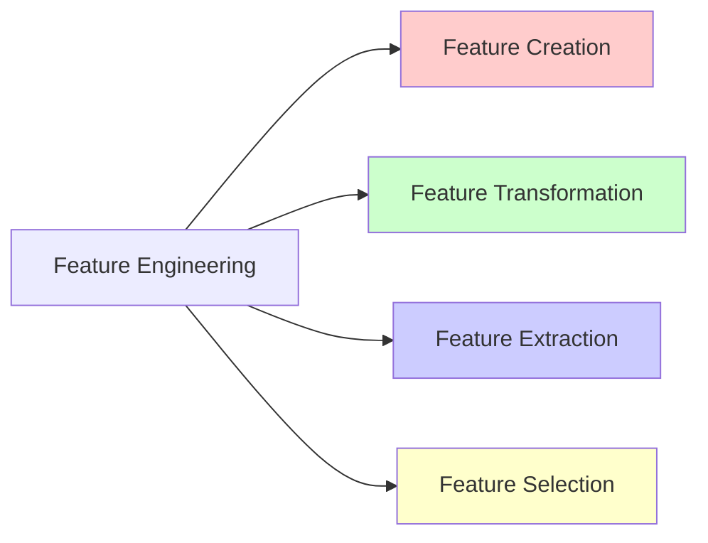

| Component | Description | Techniques |
|-----------|-------------|------------|
| **Feature Creation** | Create new features from existing data | One-hot encoding, binning, splitting, calculated features |
| **Feature Transformation** | Manage missing/invalid features | Cartesian products, non-linear transformations, domain-specific features |
| **Feature Extraction** | Reduce data to be processed | PCA, ICA, LDA (dimensionality reduction) |
| **Feature Selection** | Select relevant subset | Feature importance scores, correlation matrix |

#### Feature Engineering Notes

✓ **Deep Learning**: Feature engineering is automated as part of algorithm learning
✓ **Traditional ML**: Manual feature engineering is critical
✓ **Goal**: Minimize error rate while maintaining relevant features

---

## 1.2.5 Phase 4: Model Development

### Overview
Select a machine learning algorithm appropriate for the problem and train the ML model.

### Model Development Workflow

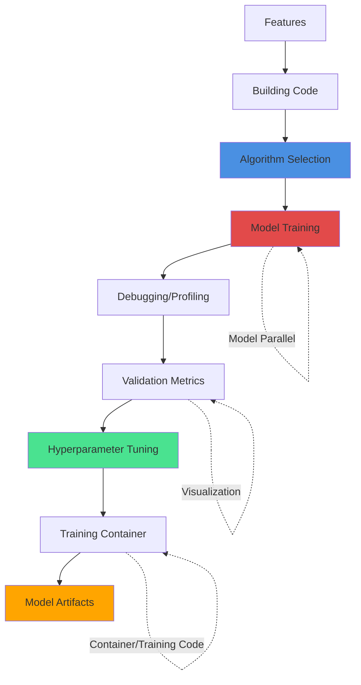

### 4.1 Model Training Activities

#### Features Selection
Features selected as part of data processing after bias strategy is implemented.

#### Building Code

| Aspect | Description |
|--------|-------------|
| **Purpose** | Build algorithm and supporting code |
| **Requirements** | Version control support |
| **Integration** | CI/CD pipeline for continuous build, test, and integration |

#### Algorithm Selection

**Evaluation Factors**:
- ✓ Accuracy
- ✓ Explainability
- ✓ Training/prediction time
- ✓ Memory requirements

**Process**: Run many experiments with parameter tunings across available options

#### Model Training - Distributed Approaches

| Approach | Description | Use Case |
|----------|-------------|----------|
| **Data Parallelism** | Split training set into mini-batches across nodes | Large datasets |
| **Model Parallelism** | Split model across multiple devices/nodes | Large models |

### 4.2 Training Support Activities

#### Debugging/Profiling

**Common Problems**:
- System bottlenecks
- Overfitting
- Saturated activation functions
- Vanishing gradients

**Solution**: Debugger provides visibility through monitoring, recording, and analyzing training state at periodic intervals.

#### Validation Metrics

| Metric Type | Purpose | Examples |
|-------------|---------|----------|
| **Loss Metrics** | Measure error | MSE, Cross-entropy |
| **Performance Metrics** | Assess predictions | Accuracy, Precision, Recall, F1-score |
| **Custom Metrics** | Business-specific | Depends on problem and technique |

#### Hyperparameter Tuning

**Definition**: Process of choosing optimal hyperparameters for a learning algorithm.

**Common Hyperparameters**:
- Learning rate
- Number of epochs
- Hidden layers
- Hidden units
- Activation functions

**Methods**:
- Grid search
- Random search
- Bayesian optimization

#### Training Code Container

**Purpose**: Create container images with:
- Training code
- Entire dependency stack
- Environment configuration

**Benefit**: Enable training and deployment quickly and reliably at any scale.

#### Model Artifacts

**Contents**:
- Trained parameters
- Model definition (how to compute inferences)
- Metadata

**Purpose**: Output that results from training a model for deployment.

#### Visualization

**Use**: Exploring and understanding data during:
- Metrics validation
- Debugging
- Profiling
- Hyperparameter tuning

### 4.3 Pre-Production Pipelines

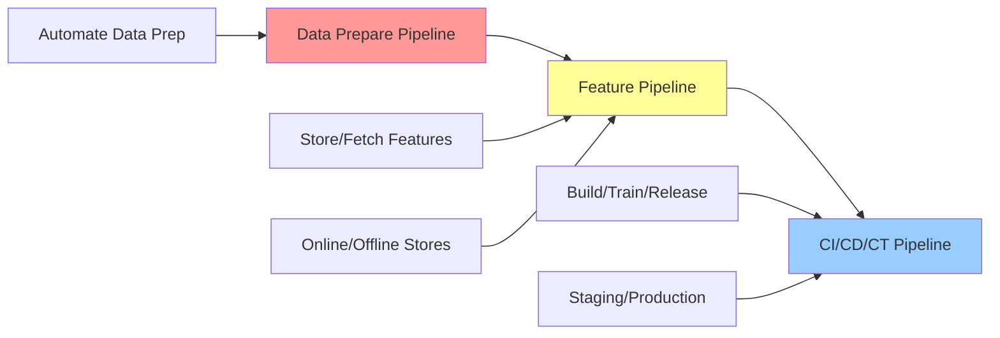

| Pipeline | Purpose | Components |
|----------|---------|------------|
| **Data Prepare** | Automate data preparation tasks | Collection, preprocessing, feature engineering |
| **Feature Pipeline** | Automate feature management | Storing, fetching, copying features (online/offline stores) |
| **CI/CD/CT** | Automate build, train, release | Continuous Integration, Deployment, Training |

### 4.4 Model Evaluation

#### Offline Evaluation

**Method**: Trained model evaluated with holdout dataset

**Requirements**:
- ✓ Never used for training or validation
- ✓ Only used for evaluating final model errors
- ✓ Holdout data annotations must have high accuracy
- ✓ Allocate resources to verify holdout data accuracy

#### Evaluation Process

```
1. Generate multiple models using different methods
         ↓
2. Evaluate effectiveness of each model
         ↓
3. For multiclass: determine error rates per class
         ↓
4. Fine-tune data, algorithm, or both based on results
         ↓
5. Repeat until performance targets met
```

#### Performance Evaluation Pipeline

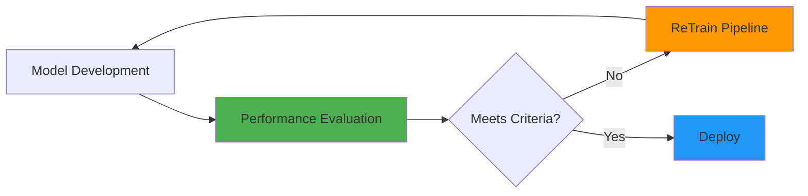

---

## 1.2.6 Phase 5: Model Deployment

### Overview
After model is trained, tuned, evaluated, and validated, deploy into production for predictions and inferences.

### Deployment Architecture

```
┌─────────────────┐
│  Feature Store  │ ───── Fetch Features ────►
└─────────────────┘                           │
                                              ▼
┌─────────────────┐                    ┌──────────────┐
│ Model Registry  │ ─── Fetch Artifacts ───►│  Endpoint  │
└─────────────────┘                    │  Production  │
                                       └──────────────┘
┌─────────────────┐                           │
│   Container     │ ── Inference Code ────────┘
│   Repository    │
└─────────────────┘
```

### 5.1 Deployment Strategies

| Strategy | Description | Use Case |
|----------|-------------|----------|
| **Blue/Green** | Two identical production environments; switch traffic after testing green | Zero downtime deployments |
| **Canary** | Deploy to small user group first, gradually roll out | Risk mitigation |
| **A/B Testing** | Direct defined portion of traffic to new model | Compare model performance (days/weeks) |
| **Shadow** | New version runs alongside old; old version serves production | Testing without risk |

### 5.2 Deployment Components

#### Inference Pipeline

**Purpose**: Automate inference workflow

**Activities**:
- Capture prepared data
- Perform predictions
- Post-process results
- Support real-time or batch inferences

#### Scheduler Pipeline

**Purpose**: Ensure model represents latest data patterns

**Activities**:
- Schedule re-training at business-defined intervals
- Minimize risk of data and concept drift
- Activate data prepare, CI/CD/CT, and feature pipelines

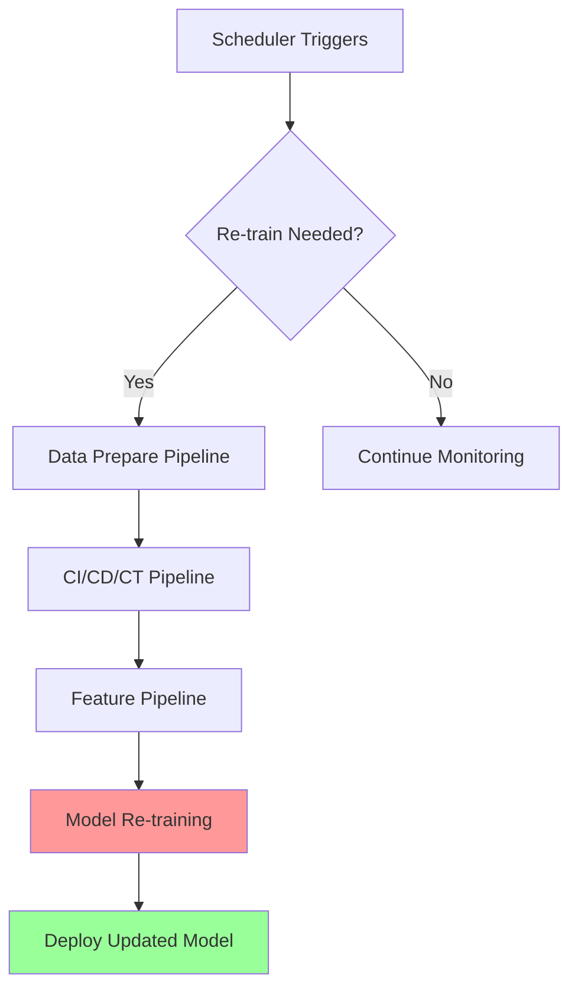

### 5.3 Inference Types

```
┌─────────────────────────────────────────────┐
│           ONLINE FEATURE STORE              │
│  (Low-latency retrieval for real-time)      │
└─────────────────────────────────────────────┘
              ↓
┌─────────────────────────────────────────────┐
│       REAL-TIME INFERENCE PIPELINE          │
│  • Online pipeline                          │
│  • Copy to offline                          │
│  • Fetch features                           │
└─────────────────────────────────────────────┘

┌─────────────────────────────────────────────┐
│          OFFLINE FEATURE STORE              │
│  (Historical data for training/batch)       │
└─────────────────────────────────────────────┘
              ↓
┌─────────────────────────────────────────────┐
│        BATCH INFERENCE PIPELINE             │
│  • Process large volumes                    │
│  • Scheduled execution                      │
│  • Fetch features                           │
└─────────────────────────────────────────────┘
```

### 5.4 Manual Governance Process

**Purpose**: Ensure model is fully tested and evaluated before production release

**Gates**:
1. Code review
2. Model performance validation
3. Stakeholder approval
4. Security assessment
5. UAT completion

---

## 1.2.7 Phase 6: Model Monitoring

### Overview
Ensure model maintains desired performance level through early detection and mitigation.

### Monitoring System Requirements

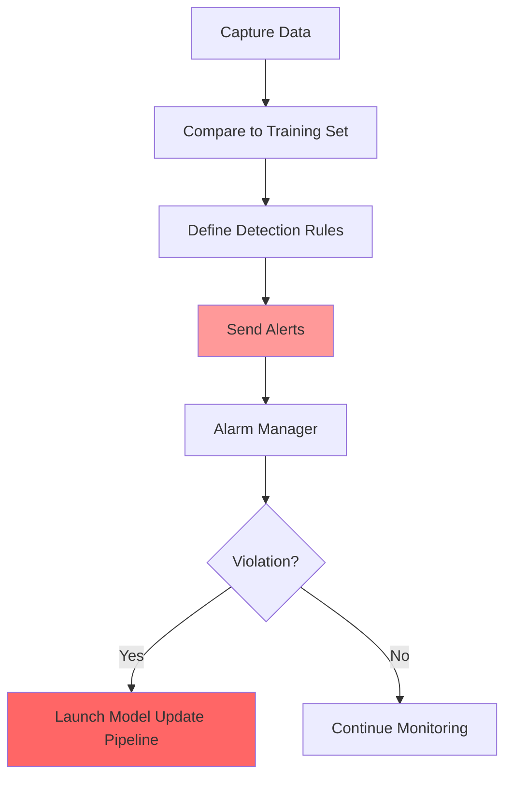

### 6.1 Monitoring Triggers

| Trigger Type | Description | Frequency |
|-------------|-------------|-----------|
| **Scheduled** | Defined time intervals | e.g., Daily, weekly |
| **Event-Based** | Initiated by system events | When data arrives, threshold breached |
| **Human Intervention** | Manual trigger | Ad-hoc analysis |

### 6.2 Issues Detected

| Issue | Description | Impact |
|-------|-------------|--------|
| **Data Quality** | Inconsistent, missing, or corrupt data | Prediction errors |
| **Model Quality** | Performance degradation | Accuracy drop |
| **Bias Drift** | Changes in prediction fairness across groups | Unfair outcomes |
| **Feature Attribution Drift** | Changes in feature importance | Model instability |

### 6.3 Key Monitoring Components

#### Model Explainability

**Purpose**: Evaluate model soundness and prediction trustworthiness

**Activities**:
- Generate feature importance
- Explain individual predictions
- Validate model decisions

#### Drift Detection

##### Data Drift

**Definition**: Significant changes to data distribution compared to training data

**Example**:
```
Training Data: Age range 25-45
Production Data: Age range 18-65
→ Data drift detected!
```

##### Concept Drift

**Definition**: Properties of target variables change

**Example**:
```
Model trained: "Premium customer" = spending >$1000/month
Reality changed: Due to inflation, >$1500/month is now premium
→ Concept drift detected!
```

**Impact**: Any drift results in model performance degradation

#### Model Update Pipeline

**Trigger**: Alarm manager identifies violations

**Process**:
1. Receive alert from monitoring
2. Launch model update pipeline
3. Activate data prepare pipeline
4. Activate CI/CD/CT pipeline
5. Activate feature pipelines
6. Re-train model
7. Deploy updated model

### 6.4 Complete Monitoring Flow

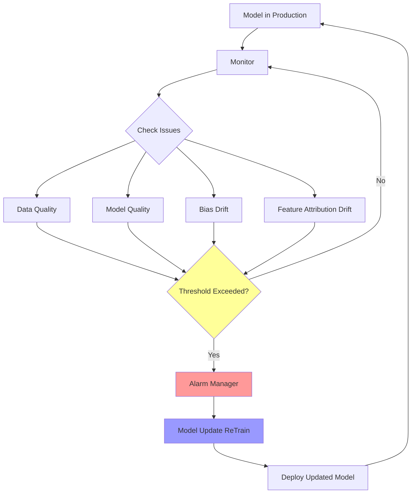

---

## 1.2.8 Supporting Components

### Feature Store (Online/Offline)

#### Purpose
Reduce duplication and rerun of feature engineering code across teams and projects.

| Store Type | Characteristics | Use Case |
|------------|----------------|----------|
| **Online Store** | Low-latency retrieval | Real-time inference |
| **Offline Store** | Historical feature values | Training and batch scoring |

```
┌────────────────────────────────────────────┐
│         FEATURE STORE BENEFITS             │
├────────────────────────────────────────────┤
│  ✓ Centralized feature management          │
│  ✓ Feature reusability across projects     │
│  ✓ Consistent feature computation          │
│  ✓ Reduced engineering duplication         │
│  ✓ Feature versioning and lineage          │
└────────────────────────────────────────────┘
```

### Model Registry

#### Purpose
Repository for storing ML model artifacts and related metadata.

#### Contents

| Component | Description |
|-----------|-------------|
| **Model Artifacts** | Trained model files |
| **Data Metadata** | Training data references, versions |
| **Code Metadata** | Training code, configurations |
| **Model Metadata** | Hyperparameters, metrics, evaluation results |

#### Benefits
- ✓ Version control for ML models
- ✓ Enable lineage tracking
- ✓ Facilitate model comparison
- ✓ Support model governance

### Feedback Loops

#### Performance Feedback Loop

**Purpose**: Automate model performance evaluation

**Flow**:
```
Model Development → Evaluate → Performance Issues?
                                    ↓ Yes
                        Data Processing ← Re-evaluate
```

**Activities**:
- Continuous performance monitoring
- Automated evaluation tasks
- Feedback to data processing phase

#### Model Drift Feedback Loop

**Purpose**: Automate model update/re-training

**Flow**:
```
Production Deployment → Monitor → Drift Detected?
                                      ↓ Yes
                        Data Processing ← Re-train
```

**Activities**:
- Drift detection
- Automated re-training initiation
- Update deployment

### Alarm Manager

#### Purpose
Receive alerts from monitoring system and execute actions.

#### Process


| Step | Activity |
|------|----------|
| 1 | Receive alerts from monitoring |
| 2 | Evaluate alert severity |
| 3 | Publish notifications to service bus |
| 4 | Deliver alerts to target applications |
| 5 | Trigger model update re-training pipeline |

### Scheduler

#### Purpose
Initiate re-training at business-defined intervals.

#### Types

| Schedule Type | Example | Use Case |
|--------------|---------|----------|
| **Fixed Interval** | Every 7 days | Regular model refresh |
| **Cron-based** | Every Monday 2 AM | Specific timing needs |
| **Dynamic** | When data volume > threshold | Data-driven |

### Lineage Tracker

#### Purpose
Enable reproducible machine learning experiences.

#### Capabilities

**1. Point-in-Time Recreation**
- Reflect versions of all resources
- Recreate ML environment at specific time
- Restore exact model configuration

**2. Tracked Components**

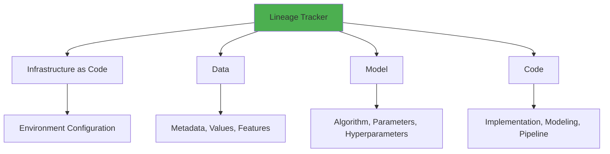

| Component | Tracked Elements |
|-----------|-----------------|
| **Infrastructure** | IaC changes, environment drift |
| **Data** | Metadata, values, features, schemas |
| **Model** | Algorithm, features, parameters, hyperparameters |
| **Code** | Implementation, modeling, pipeline code |

**3. Version Control Integration**

```
┌────────────────────────────────────────────┐
│     LINEAGE TRACKER - VERSION CONTROL      │
├────────────────────────────────────────────┤
│                                            │
│  Infrastructure → Version Control Repo     │
│  Data Schema    → Database/Config File     │
│  Code           → Git Repository           │
│  Features       → Feature Store Versions   │
│  Model          → Model Registry           │
│  Containers     → Container Registry       │
│                                            │
└────────────────────────────────────────────┘
```

**4. Working Mechanism**

```
1. Collect references through ML lifecycle iterations
         ↓
2. Alternative algorithms and features evaluated as experiments
         ↓
3. Store complete lineage information
         ↓
4. Enable recreation of specific point-in-time release
```

#### Infrastructure as Code (IaC)

**Benefits**:
- Automate resource provisioning
- Eliminate configuration drift
- Increase deployment speed
- Ensure reproducibility

**Tracked Elements**:
- Compute resources
- Storage configurations
- Network settings
- Application services

---

## Complete ML Lifecycle Architecture

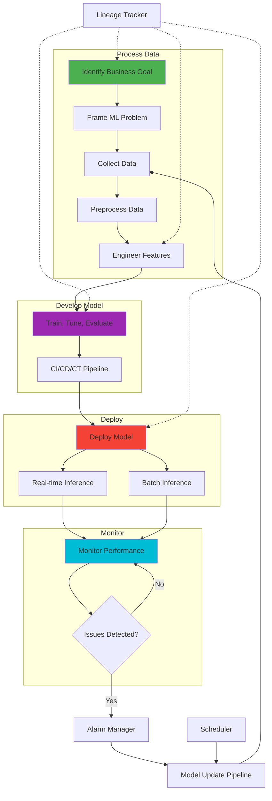

---

## Key Takeaways

### ML Lifecycle vs Three Levels

| Aspect | Three Levels (CS1-1.1) | ML Lifecycle (CS1-1.2) |
|--------|----------------------|----------------------|
| **Focus** | Technical implementation layers | End-to-end process phases |
| **Structure** | Data → Model → Deployment | Iterative cycle with feedback |
| **Emphasis** | Engineering best practices | Project management & governance |
| **Scope** | Technical activities | Business + Technical activities |

### Integration Points

```
Business Goal (Lifecycle) ──────► Problem Definition (Three Levels)
       ↓                                    ↓
ML Problem Framing ──────────► Data Requirements
       ↓                                    ↓
Data Processing ──────────────► Level 1: Data Engineering
       ↓                                    ↓
Model Development ─────────────► Level 2: Model Engineering
       ↓                                    ↓
Deployment ────────────────────► Level 3: Code Engineering
       ↓                                    ↓
Monitoring ────────────────────► Feedback to All Levels
```

### Critical Success Factors

1. **Alignment**: Business goals aligned with technical capabilities
2. **Iteration**: Embrace feedback loops and continuous improvement
3. **Automation**: Implement CI/CD/CT pipelines early
4. **Monitoring**: Set up comprehensive monitoring from day one
5. **Documentation**: Maintain lineage and reproducibility
6. **Governance**: Ensure stakeholder alignment throughout

---

# CS1 - 1.3: ML System Architecture

## 1.3.1 Architecture Overview

### Definition
Client-server architecture of a **supervised learning system** for real-world ML applications.

**Source**: Adapted from "Architecture of a real-world Machine Learning system" by Louis Dorard

### Core Architecture Diagram

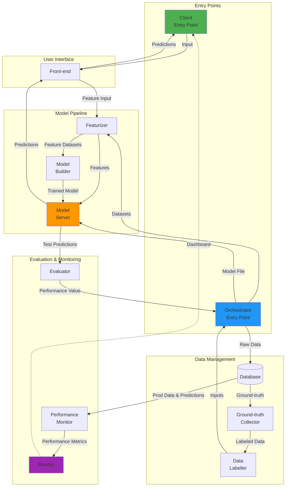

### System Architecture Components

| Component Type | Components | Purpose |
|----------------|-----------|---------|
| **Entry Points** | Client, Orchestrator | User interface and workflow management |
| **Data Layer** | Ground-truth Collector, Data Labeller, Database | Data acquisition and preparation |
| **Feature Engineering** | Featurizer | Feature extraction and transformation |
| **Model Layer** | Model Builder, Model Server | Model training and serving |
| **Quality Assurance** | Evaluator, Performance Monitor, Monitor | Evaluation and monitoring |
| **Application Layer** | Front-end | Domain logic and API gateway |

---

## 1.3.2 Entry Points

### Two Main Entry Points

```
┌──────────────────────────────────────────────────────────┐
│                    ENTRY POINTS                          │
├──────────────────────────────────────────────────────────┤
│                                                          │
│  ┌────────────────┐              ┌────────────────┐     │
│  │     CLIENT     │              │  ORCHESTRATOR  │     │
│  │  (End User)    │              │  (Scheduler)   │     │
│  └────────────────┘              └────────────────┘     │
│         │                                 │             │
│         │ Request Predictions             │ Create/     │
│         │                                 │ Update      │
│         ▼                                 │ Models      │
│    [Front-end]                           ▼             │
│         │                          [Model Builder]     │
│         ▼                                              │
│    [Model Server API]                                  │
│                                                        │
└──────────────────────────────────────────────────────────┘
```

### 1. Client (Entry Point)

| Aspect | Description |
|--------|-------------|
| **Purpose** | Application used by end-user who benefits from ML system |
| **Example** | Smartphone app for dinner delivery (e.g., Uber Eats) |
| **Function** | Submit inputs and receive predictions |
| **Integration** | Connects via front-end to model server API |

### 2. Orchestrator (Entry Point)

| Aspect | Description |
|--------|-------------|
| **Purpose** | Program that creates/updates models |
| **Trigger Methods** | • Scheduler (periodic updates, e.g., weekly)<br>• API call (part of CI/CD pipeline)<br>• Manual invocation |
| **Core Responsibility** | Evaluate models on secret test dataset |
| **Workflow** | Test predictions → Evaluator → Model approval → Model server |
| **Decision Making** | If model is "good enough", pass to server for API availability |

### Integration Pattern

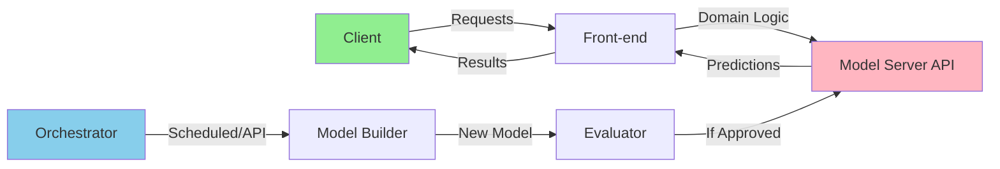

**Key Decision**: API can be:
- **Direct**: Exposed directly to client software
- **Indirect**: Routed through front-end with domain-specific logic (recommended)

---

## 1.3.3 System Components

### Component Overview Table

| # | Component | Primary Function | Interacts With |
|---|-----------|------------------|----------------|
| 1 | Ground-truth Collector | Acquire actual outcomes for predictions | Database, Monitor |
| 2 | Data Labeller | Manual/automated data annotation | Ground-truth Collector, Database |
| 3 | Evaluator | Compute performance metrics | Orchestrator, Test data |
| 4 | Performance Monitor | Track metrics over time on production data | Database, Evaluator, Dashboard |
| 5 | Featurizer | Extract and compute features from raw data | Database, Model Builder/Server |
| 6 | Orchestrator | Coordinate entire model building workflow | All components |
| 7 | Model Builder | Train and optimize ML models | Featurizer, Evaluator |
| 8 | Model Server | Serve predictions via API | Featurizer, Front-end |
| 9 | Front-end | Domain logic and API gateway | Client, Model Server |

---

### Component 1: Ground-truth Collector

#### Purpose
Continuously acquire new data for the machine to learn from in real-world settings.

#### Ground-truth Data Definition

```
Ground-truth = What you want ML models to predict

Examples:
┌────────────────────────────────────────┐
│ • Sale price of real estate property   │
│ • Customer churn (event)               │
│ • Spam label on messages               │
│ • Actual delivery time (ETD)           │
│ • Customer renewal decision            │
└────────────────────────────────────────┘
```

#### Data Collection Scenarios

| Scenario | Wait Period | Example |
|----------|-------------|---------|
| **Property Sale** | Until sold | Real estate prediction |
| **Customer Churn** | Subscription period | Renewal/cancellation event |
| **Email Classification** | User interaction time | Spam/ham classification |
| **Delivery Time** | Order completion | ETD vs actual delivery time |

#### User Feedback Loop

```mermaid
graph LR
    A[User] -->|Receives Prediction| B[Prediction Result]
    B -->|Incorrect?| C[Feedback Button]
    C -->|Report Error| D[Ground-truth Collector]
    D -->|Store| E[(Database)]

    style C fill:#ff9999
    style D fill:#99ccff
```

**Implementation**: Microservice to receive and store user feedback on prediction errors.

---

### Component 2: Data Labeller

#### Purpose
Create ground-truth data manually when:
- Plenty of input data available
- Associated ground-truth doesn't exist yet
- Automated labeling not feasible

#### Use Cases

```
┌──────────────────────────────────────────────┐
│         MANUAL LABELING REQUIRED             │
├──────────────────────────────────────────────┤
│                                              │
│  • Spam detector training                    │
│  • Object detection from images              │
│  • Sentiment analysis                        │
│  • Named entity recognition                  │
│  • Image classification                      │
│                                              │
└──────────────────────────────────────────────┘
```

#### Tools & Services

| Type | Examples | Purpose |
|------|----------|---------|
| **Open-Source Tools** | Label Studio | Self-hosted data annotation |
| **Cloud Services** | • Google Data Labeling Service<br>• Figure Eight (Appen) | Outsource labeling tasks |
| **Custom Solutions** | Web apps | Domain-specific labeling interfaces |

#### Example: Object Detection

```
Input: Image of airport tarmac
Task: Draw bounding boxes around aircraft
Labels: [Boeing, Airbus, ...]

┌────────────────────────────────┐
│  Image Preview                 │
│  ┌──────────────────────────┐  │
│  │  ✈  [Airbus] ✓          │  │
│  │      ✈ [Boeing] ✓       │  │
│  └──────────────────────────┘  │
│  [Save] [Next] [Skip]          │
└────────────────────────────────┘
```

---

### Component 3: Evaluator

#### Purpose
Define and compute how to evaluate the ML system before building any models.

#### Evaluation Framework

```mermaid
graph TD
    A[Define Evaluation] --> B[Choose Metrics]
    B --> C[Prediction Accuracy Metrics]
    B --> D[Impact Metrics]
    B --> E[System Metrics]

    C --> F[Accuracy, Precision, Recall, F1]
    D --> G[Short-term & Long-term Impact]
    E --> H[Lag, Throughput]

    style B fill:#4CAF50
    style C fill:#2196F3
    style D fill:#FF9800
    style E fill:#9C27B0
```

#### Two Key Objectives

| Objective | Description | Method |
|-----------|-------------|--------|
| **Compare Models** | Determine which model performs best | Rank by validation metrics |
| **Safety Check** | Decide if safe to integrate into application | Test against thresholds |

#### Evaluation Process

```
1. Receive test predictions from model builder
         ↓
2. Access test set ground truth (kept secret)
         ↓
3. Compute prediction errors
         ↓
4. Aggregate errors into performance metrics
         ↓
5. Return performance value to orchestrator
```

#### Evaluation Metrics Categories

| Category | Metrics | Use Case |
|----------|---------|----------|
| **Classification** | Accuracy, Precision, Recall, F1-score, AUC-ROC | Binary/multiclass problems |
| **Regression** | MAE, MSE, RMSE, R² | Continuous predictions |
| **Ranking** | NDCG, MAP, MRR | Recommendation systems |
| **Business** | Revenue impact, User engagement | ROI evaluation |

---

### Component 4: Performance Monitor

#### Purpose
Monitor model performance on production data over time to ensure continued positive impact.

#### Architecture

```
┌──────────────────────────────────────────────────────┐
│           PERFORMANCE MONITORING FLOW                │
├──────────────────────────────────────────────────────┤
│                                                      │
│  Production Inputs ──┐                              │
│  Ground Truths ──────┼──► Database ──► Program      │
│  Predictions ────────┘         │           │        │
│                                │           ▼        │
│                                │      Calls         │
│                                │      Evaluator     │
│                                │           │        │
│                                │           ▼        │
│                                │      Updates       │
│                                │      Dashboard     │
│                                │           │        │
│                                ▼           ▼        │
│                          [Time Series Visualization] │
│                                                      │
└──────────────────────────────────────────────────────┘
```

#### Monitoring Components

| Component | Function |
|-----------|----------|
| **Database** | Store production inputs, ground truths, predictions |
| **Monitor Program** | Read database, call evaluator periodically |
| **Dashboard** | Visualize performance metrics over time |
| **Data Visualization** | Show production data distributions |
| **Drift Detection** | Monitor distribution changes and anomalies |

#### Dashboard Widgets

```
┌─────────────────────────────────────────────────────┐
│              PERFORMANCE DASHBOARD                  │
├─────────────────────────────────────────────────────┤
│                                                     │
│  Accuracy Over Time          Data Distribution     │
│  ┌──────────────────┐       ┌──────────────────┐   │
│  │     95% ▲        │       │    █             │   │
│  │     90% │ ~~~~~  │       │  █ █ █           │   │
│  │     85% │        │       │█ █ █ █ █         │   │
│  └──────────────────┘       └──────────────────┘   │
│                                                     │
│  Drift Detection            Error Analysis         │
│  ┌──────────────────┐       ┌──────────────────┐   │
│  │  ⚠ Alert!        │       │ Class A: 92%     │   │
│  │  Feature X drift │       │ Class B: 88%     │   │
│  │  detected        │       │ Class C: 95%     │   │
│  └──────────────────┘       └──────────────────┘   │
│                                                     │
└─────────────────────────────────────────────────────┘
```

#### Monitoring Best Practices

✓ Check behavior through time
✓ Verify positive impact on application
✓ Monitor data distributions
✓ Detect drift and anomalies early
✓ Set up automated alerts
✓ Regular stakeholder reviews

---

### Component 5: Featurizer

#### Purpose
Compute full numerical feature representation from raw inputs or IDs.

#### Feature Computation Challenge

```
Problem: API Input Design Decision

Option 1: Full Feature Vector     Option 2: Customer ID
├─ Pros: Ready for model          ├─ Pros: Simple, lightweight
├─ Cons: May not be available     ├─ Cons: Requires computation
│                                 │
└─ Use Case: Real-time scoring   └─ Use Case: Batch processing
                                               ↓
                                         FEATURIZER
```

#### Feature Types

| Feature Type | Characteristics | Computation Method |
|--------------|-----------------|-------------------|
| **Stored Features** | Already in database | Direct retrieval (e.g., date of birth) |
| **Computed Features** | Require processing | Query + aggregation (e.g., customer interactions) |
| **Cold Features** | Slowly changing | Batch computation |
| **Hot Features** | Rapidly changing | Real-time computation (e.g., avg delivery time last X minutes) |

#### Featurizer Architecture

```mermaid
graph TD
    A[Input IDs] --> B{Feature Type?}
    B -->|Cold| C[Batch Featurizer]
    B -->|Hot| D[Real-time Featurizer]

    C --> E[(Database Queries)]
    D --> F[(Streaming Data)]

    E --> G[Aggregation]
    F --> H[Real-time Calculation]

    G --> I[Feature Vector]
    H --> I

    I --> J[Model Server]

    style C fill:#99ccff
    style D fill:#ff9999
    style I fill:#90EE90
```

#### Implementation Considerations

| Consideration | Details |
|---------------|---------|
| **Microservices** | At least one featurization service (batch) |
| **Real-time Service** | Optional, adds complexity but enables hot features |
| **Database Access** | May query multiple databases |
| **Parameters** | Featurizers have tunable parameters (e.g., time window X) |
| **Performance Impact** | Parameters affect model performance |

#### Example: Customer Featurization

```
Input: Customer ID = 12345

Stored Features (Cold):
├─ Date of Birth → Age calculation
├─ Account Created Date
└─ Geographic Location

Computed Features (Cold):
├─ Total Purchases Last 90 Days
├─ Average Order Value
└─ Purchase Frequency

Hot Features (Real-time):
├─ Current Session Duration
├─ Items in Cart
└─ Last Activity Timestamp

      ↓
[Feature Vector: 127 dimensions]
      ↓
[Model Server]
```

---

### Component 6: Orchestrator

#### Purpose
Core component that coordinates the entire ML workflow and interacts with all other components.

#### Orchestrator Workflow

```mermaid
graph TD
    A[Start] --> B[1. ETL & Split Data]
    B --> C[Train/Val/Test Sets]
    C --> D[2. Send for Featurization]
    D --> E[3. Prepare Feature Sets]
    E --> F[Augment Training Data]
    E --> G[Preprocess All Sets]
    F --> H[4. Send to Model Builder]
    G --> H
    H --> I[Training + Validation]
    I --> J[5. Get Optimal Model]
    J --> K[Apply to Test Set]
    K --> L[6. Send Predictions to Evaluator]
    L --> M[Get Performance Value]
    M --> N{Performance OK?}
    N -->|Yes| O[Push to Model Server]
    N -->|No| P[Iterate/Tune]
    P --> B

    style B fill:#ffe1b3
    style E fill:#b3e6ff
    style J fill:#b3ffb3
    style N fill:#ffb3b3
```

#### Six-Step Workflow

| Step | Activity | Details |
|------|----------|---------|
| **1** | ETL & Split | Extract-Transform-Load raw data → Train/Val/Test sets |
| **2** | Featurization | Send datasets to featurizer (if needed) |
| **3** | Preparation | • Augment training data (oversample/undersample)<br>• Preprocess all sets (sanitize, resize, de-saturate) |
| **4** | Model Building | Send prepared datasets + metric to optimize |
| **5** | Model Evaluation | Get optimal model, apply to test set |
| **6** | Decision | Evaluate performance → Push to server if approved |

#### Step 3: Data Preparation Details

```
Augmentation Techniques:
┌────────────────────────────────────────┐
│ Images:                                │
│  • Rotate, Flip, Crop                  │
│  • Color jitter, Blur                  │
│                                        │
│ Tabular Data:                          │
│  • Oversample minority class           │
│  • Undersample majority class          │
│  • SMOTE (Synthetic generation)        │
│                                        │
│ Preprocessing:                         │
│  • Data sanitization                   │
│  • De-saturate images                  │
│  • Resize to standard dimensions       │
│  • Normalize/standardize               │
└────────────────────────────────────────┘
```

#### Execution Methods

| Method | Description | Use Case |
|--------|-------------|----------|
| **Manual** | Run workflow manually | Initial development, debugging |
| **Simple Script** | Single-threaded execution | Small-scale projects |
| **Parallelized** | Multi-threaded/distributed | Production workflows |
| **End-to-end Platforms** | Managed ML pipeline services | Enterprise deployments |
| **Container Orchestration** | Kubernetes, Docker | Cloud-native applications |
| **Workflow Tools** | Apache Airflow | Complex DAGs, scheduling |

#### Platform Examples

```
┌──────────────────────────────────────────────────────┐
│           ORCHESTRATION PLATFORMS                    │
├──────────────────────────────────────────────────────┤
│                                                      │
│  End-to-End ML:                                      │
│  ├─ Google AI Platform                               │
│  ├─ Databricks                                       │
│  ├─ Azure ML                                         │
│  └─ AWS SageMaker                                    │
│                                                      │
│  Container Orchestration:                            │
│  ├─ Kubernetes (K8s)                                 │
│  ├─ Docker Swarm                                     │
│  └─ Amazon ECS/EKS                                   │
│                                                      │
│  Workflow Management:                                │
│  ├─ Apache Airflow (Airbnb)                          │
│  ├─ Luigi (Spotify)                                  │
│  ├─ Prefect                                          │
│  └─ Kubeflow Pipelines                               │
│                                                      │
└──────────────────────────────────────────────────────┘
```

---

### Component 7: Model Builder

#### Purpose
Provide an optimal model by training various models and evaluating them on the validation set.

#### Model Builder Workflow

```mermaid
graph LR
    A[Training Set] --> B[Model Builder]
    C[Validation Set] --> B
    D[Performance Metric] --> B

    B --> E[Train Model 1]
    B --> F[Train Model 2]
    B --> G[Train Model N]

    E --> H[Evaluate on Val Set]
    F --> H
    G --> H

    H --> I[Select Best Model]
    I --> J[Optimal Model]

    style B fill:#4CAF50
    style I fill:#FFD700
    style J fill:#FF6347
```

#### Model Builder Process

```
1. Receive: Training set + Validation set + Metric
         ↓
2. Train: Multiple models with different algorithms
         ↓
3. Evaluate: Test each on validation set
         ↓
4. Optimize: Tune hyperparameters
         ↓
5. Select: Best performing model
         ↓
6. Package: Save model in standard format
         ↓
7. Deliver: Return optimal model to orchestrator
```

#### Model Output Formats

| Platform | Output Method | Format |
|----------|--------------|--------|
| **BigML** | Automatic API | Model available via BigML API |
| **Scikit-learn** | File serialization | Pickle, Joblib |
| **TensorFlow** | SavedModel | Protocol buffer |
| **PyTorch** | State dict | .pt, .pth files |
| **ONNX** | Cross-platform | .onnx file |
| **PMML** | Standard format | .pmml XML |

#### Service Architecture

```
┌─────────────────────────────────────────────┐
│         MODEL BUILDER SERVICE               │
├─────────────────────────────────────────────┤
│                                             │
│  Input:                                     │
│  ├─ Training Dataset URI                    │
│  ├─ Validation Dataset URI                  │
│  └─ Performance Metric                      │
│                                             │
│  Processing:                                │
│  ├─ Algorithm Selection                     │
│  ├─ Hyperparameter Tuning                   │
│  ├─ Cross-validation                        │
│  └─ Model Comparison                        │
│                                             │
│  Output:                                    │
│  ├─ Trained Model File                      │
│  ├─ Model Metadata                          │
│  └─ Training Metrics                        │
│                                             │
└─────────────────────────────────────────────┘
```

---

### Component 8: Model Server

#### Purpose
Process API requests for predictions by loading and applying trained models.

#### Model Server Architecture

```
┌────────────────────────────────────────────────┐
│           MODEL SERVER WORKFLOW                │
├────────────────────────────────────────────────┤
│                                                │
│  1. Load Model                                 │
│     ├─ Read model file                         │
│     ├─ Deserialize model                       │
│     └─ Initialize in memory                    │
│           ↓                                    │
│  2. Receive API Request                        │
│     ├─ Parse input features                    │
│     └─ Validate input schema                   │
│           ↓                                    │
│  3. Apply Model                                │
│     ├─ Feature preprocessing                   │
│     ├─ Model inference                         │
│     └─ Post-processing                         │
│           ↓                                    │
│  4. Return API Response                        │
│     ├─ Format predictions                      │
│     └─ Include metadata                        │
│                                                │
└────────────────────────────────────────────────┘
```

#### Key Requirements

| Requirement | Description |
|-------------|-------------|
| **Parallel Processing** | Serve multiple API requests simultaneously |
| **Model Updates** | Support hot-swapping/versioning of models |
| **Low Latency** | Fast response times for predictions |
| **Scalability** | Handle varying load (auto-scaling) |
| **Monitoring** | Track prediction requests and performance |

#### Model Representation Formats

```
┌──────────────────────────────────────────────┐
│       STANDARD MODEL FORMATS                 │
├──────────────────────────────────────────────┤
│                                              │
│  ONNX (Open Neural Network Exchange)         │
│  ├─ Cross-platform, cross-framework          │
│  ├─ Supported by: PyTorch, TF, Scikit        │
│  └─ Use: Production inference                │
│                                              │
│  PMML (Predictive Model Markup Language)     │
│  ├─ XML-based standard                       │
│  ├─ Traditional ML algorithms                │
│  └─ Use: Enterprise systems                  │
│                                              │
│  Framework-Specific:                         │
│  ├─ TensorFlow SavedModel                    │
│  ├─ PyTorch .pt/.pth                         │
│  ├─ Scikit-learn Pickle                      │
│  └─ H5 (Keras)                               │
│                                              │
└──────────────────────────────────────────────┘
```

#### Serving Patterns

```mermaid
graph TB
    A[API Gateway] --> B{Load Balancer}

    B --> C[Model Server 1<br/>Version A]
    B --> D[Model Server 2<br/>Version A]
    B --> E[Model Server 3<br/>Version B]

    C --> F[Return Predictions]
    D --> F
    E --> F

    style B fill:#4CAF50
    style E fill:#FFB6C1
```

**Pattern**: Canary deployment with version B getting 10% of traffic initially.

---

### Component 9: Front-end

#### Purpose
Gateway between client and model server, implementing domain-specific logic and enhancements.

#### Front-end Responsibilities

```mermaid
graph TD
    A[Client Request] --> B[Front-end]

    B --> C[Output Simplification]
    B --> D[Output Enhancement]
    B --> E[Domain Logic]
    B --> F[Data Storage]
    B --> G[Model Testing]

    C --> H[Class probabilities → Most likely class]
    D --> I[Add prediction explanation]
    E --> J[Business rules & fallback]
    F --> K[Store inputs & predictions]
    G --> L[Query multiple model versions]

    style B fill:#4CAF50
    style C fill:#87CEEB
    style D fill:#FFB6C1
    style E fill:#FFD700
```

#### Six Key Functions

| # | Function | Description | Example |
|---|----------|-------------|---------|
| 1 | **Simplify Output** | Transform model output to user-friendly format | [0.7, 0.2, 0.1] → "Category A" |
| 2 | **Enhance Output** | Add explanations using explainability tools | LIME, SHAP explanations |
| 3 | **Domain Logic** | Implement business rules | If confidence < 0.8, request human review |
| 4 | **Fallback Handling** | Handle anomalous inputs | Default predictions for edge cases |
| 5 | **Data Logging** | Store production inputs and predictions | Database for monitoring |
| 6 | **Model Testing** | Shadow/canary testing of new models | Compare A/B model performance |

#### Output Simplification Example

```
Model Raw Output:
{
  "class_probabilities": {
    "cat": 0.82,
    "dog": 0.15,
    "bird": 0.03
  },
  "confidence_score": 0.82,
  "model_version": "v2.3.1"
}

Front-end Simplified Output:
{
  "prediction": "cat",
  "confidence": "high"
}
```

#### Domain-Specific Logic Example

```python
# Restaurant Delivery Time Prediction
def front_end_logic(model_prediction):
    predicted_time = model_prediction['etd_minutes']

    # Business Rule 1: Add buffer for safety
    safe_estimate = predicted_time * 1.15

    # Business Rule 2: Round to nearest 5 minutes
    rounded_time = round(safe_estimate / 5) * 5

    # Business Rule 3: Minimum guarantee
    final_time = max(rounded_time, 25)

    # Business Rule 4: Peak hour adjustment
    if is_peak_hour():
        final_time += 10

    return {
        "estimated_delivery": final_time,
        "confidence": "high" if model_prediction['confidence'] > 0.8 else "medium"
    }
```

#### Model Testing Architecture

```
┌─────────────────────────────────────────────────┐
│          FRONT-END MODEL TESTING                │
├─────────────────────────────────────────────────┤
│                                                 │
│  Client Request                                 │
│       ↓                                         │
│  ┌─────────────┐                                │
│  │  Front-end  │                                │
│  └─────────────┘                                │
│       ↓                                         │
│  ┌─────────────────────────────────┐            │
│  │  Query Both Models:             │            │
│  │  ├─ Live Model (v1.0)           │            │
│  │  └─ Candidate Model (v2.0)      │            │
│  └─────────────────────────────────┘            │
│       ↓                 ↓                       │
│  ┌──────────┐      ┌──────────┐                │
│  │ Return   │      │  Store   │                │
│  │ v1.0     │      │  Both    │                │
│  │ to User  │      │  Results │                │
│  └──────────┘      └──────────┘                │
│                         ↓                       │
│                  [Performance Monitor]          │
│                  Compare over time              │
│                                                 │
└─────────────────────────────────────────────────┘
```

**Benefit**: Compare new model performance on production data without affecting user experience.

---

## Component Interaction Summary

### Complete System Flow

```mermaid
graph TB
    subgraph "User Interaction"
        U[End User] -->|Requests| CLI[Client App]
    end

    subgraph "Prediction Path (Real-time)"
        CLI -->|Input| FE[Front-end]
        FE -->|Raw Input| FZ[Featurizer]
        FZ -->|Features| MS[Model Server]
        MS -->|Prediction| FE
        FE -->|Result| CLI
        FE -->|Log| DB[(Production DB)]
    end

    subgraph "Model Update Path (Batch)"
        SCH[Scheduler] -->|Trigger| ORC[Orchestrator]
        GTC[Ground-truth<br/>Collector] -->|Labels| DB
        DB -->|Raw Data| ORC
        ORC -->|Datasets| FZ2[Featurizer]
        FZ2 -->|Features| MB[Model Builder]
        MB -->|Model| EVAL[Evaluator]
        EVAL -->|Metrics| ORC
        ORC -->|Approved<br/>Model| MS
    end

    subgraph "Monitoring Path"
        DB -->|Data & Predictions| PM[Performance<br/>Monitor]
        PM -->|Metrics| MON[Dashboard]
        MON -.->|View| U
    end

    style CLI fill:#90EE90
    style MS fill:#FFB6C1
    style ORC fill:#87CEEB
    style MON fill:#DDA0DD
```

### Data Flow Table

| Path | Flow | Latency | Purpose |
|------|------|---------|---------|
| **Prediction** | Client → Front-end → Featurizer → Model Server → Front-end → Client | < 100ms | Real-time inference |
| **Logging** | Front-end → Database | Async | Store predictions for monitoring |
| **Ground-truth** | Real world → Collector → Database | Hours/Days | Collect actual outcomes |
| **Model Training** | Orchestrator → Featurizer → Model Builder → Evaluator | Hours | Periodic model updates |
| **Monitoring** | Database → Performance Monitor → Dashboard | Minutes | Track performance over time |

### Component Dependency Matrix

|  | GTC | DL | EVAL | PM | FZ | ORC | MB | MS | FE |
|---|-----|----|----|----|----|-----|----|----|-----|
| **Ground-truth Collector** | - | ✓ | | | | | | | |
| **Data Labeller** | ✓ | - | | | | | | | |
| **Evaluator** | | | - | ✓ | | ✓ | | | |
| **Performance Monitor** | | | ✓ | - | | | | | ✓ |
| **Featurizer** | | | | | - | ✓ | ✓ | ✓ | |
| **Orchestrator** | ✓ | ✓ | ✓ | | ✓ | - | ✓ | ✓ | |
| **Model Builder** | | | | | ✓ | ✓ | - | | |
| **Model Server** | | | | | ✓ | ✓ | ✓ | - | ✓ |
| **Front-end** | | | | ✓ | ✓ | | | ✓ | - |

**Legend**: ✓ = Direct interaction required

---

## Key Takeaways

### Architecture Principles

| Principle | Description |
|-----------|-------------|
| **Separation of Concerns** | Each component has a single, well-defined responsibility |
| **Microservices** | Components can be developed, deployed, scaled independently |
| **API-First** | Components communicate via well-defined APIs |
| **Continuous Learning** | System designed for ongoing model updates |
| **Monitoring Built-in** | Performance tracking is core, not afterthought |

### Critical Design Decisions

```
┌──────────────────────────────────────────────────┐
│         KEY ARCHITECTURAL DECISIONS              │
├──────────────────────────────────────────────────┤
│                                                  │
│  1. Evaluation Strategy                          │
│     └─ Define before building any models         │
│                                                  │
│  2. Feature Computation                          │
│     ├─ Batch vs Real-time                        │
│     └─ Trade-off: Freshness vs Complexity        │
│                                                  │
│  3. Model Serving                                │
│     ├─ Direct API vs Front-end gateway           │
│     └─ Trade-off: Simplicity vs Flexibility      │
│                                                  │
│  4. Orchestration                                │
│     ├─ Manual vs Automated                       │
│     └─ Single-thread vs Parallelized             │
│                                                  │
│  5. Ground-truth Collection                      │
│     ├─ Automatic vs User feedback                │
│     └─ Trade-off: Accuracy vs Volume             │
│                                                  │
└──────────────────────────────────────────────────┘
```

### Implementation Recommendations

1. **Start Simple**: Begin with manual orchestration, simple featurizer
2. **Build Monitoring Early**: Evaluator and performance monitor from day one
3. **Automate Gradually**: Add automation as complexity grows
4. **Use Standards**: Adopt ONNX, PMML for model portability
5. **Plan for Scale**: Design components to scale independently
6. **Decouple Components**: Use message queues, APIs for loose coupling

### Real-World Example: Food Delivery

```
Use Case: Estimate Delivery Time (ETD)

┌────────────────────────────────────────────┐
│ Component Implementation                   │
├────────────────────────────────────────────┤
│                                            │
│ Client: Mobile app (Uber Eats)            │
│ Ground-truth: Actual delivery time        │
│ Featurizer:                                │
│   - Restaurant avg prep time (cold)       │
│   - Current orders in kitchen (hot)       │
│   - Traffic conditions (hot)              │
│ Model: Gradient Boosting Regressor        │
│ Front-end Logic:                           │
│   - Add 15% buffer                         │
│   - Round to nearest 5 minutes             │
│   - Minimum 25 minutes                     │
│ Monitoring: ETD vs actual delivery        │
│ Orchestrator: Weekly retraining           │
│                                            │
└────────────────────────────────────────────┘
```

---

## 📚 Exam Preparation: Common Mistakes & Misconceptions

### ❌ Misconception 1: "The test set can be used multiple times"
```
WRONG THINKING:
"I'll test my model on the test set, adjust hyperparameters, test again,
and repeat until I get good results!"

✅ CORRECT UNDERSTANDING:
- Test set should be used ONLY ONCE for final evaluation
- Each test on test set = information leakage
- Hyperparameter tuning should happen on VALIDATION set
- Multiple tests on test set = overfitting to test data
- Result: Inflated test performance, poor production performance

THE RIGHT PROCESS:
1. Split: Train (70%) / Validation (15%) / Test (15%)
2. Train on Training set
3. Tune on Validation set (iterate as much as needed)
4. Test on Test set (ONCE!)
5. If test fails, start over with new approach
```

### ❌ Misconception 2: "More features always mean better models"
```
WRONG THINKING:
"I have 500 features, so my model should be very accurate!"

✅ CORRECT UNDERSTANDING:
- Too many features → Overfitting, slow training, poor generalization
- Quality > Quantity: 50 relevant features >> 500 noisy features
- Curse of dimensionality: High-dimensional sparse data is hard to learn from
- Always remove highly correlated features (Corr > 0.60)
```

### ❌ Misconception 3: "Black box models are always best"
```
WRONG THINKING:
"Neural networks have 95% accuracy, so I should always use them!"

✅ CORRECT UNDERSTANDING:
- Accuracy isn't the only metric
- Regulated industries (finance, healthcare) may REQUIRE interpretability
- Stakeholder trust depends on explainability
- Sometimes 85% accuracy with clear explanations > 95% mystery predictions
- Consider the business context and stakeholder requirements
```

---

## Additional Resources

### Standards & Formats
- **PMML**: Predictive Model Markup Language
- **PFA**: Portable Format for Analytics
- **ONNX**: Open Neural Network Exchange

### Best Practices References
- Gartner's definition of Data Preparation
- AWS Well-Architected Machine Learning Framework
- CI/CD best practices for ML systems
- Monitoring and observability tools for ML

---

**Document Version**: 2.1 (Enhanced Edition)
**Last Updated**: November 2025
**Sections**: CS1-1.1, CS1-1.2, CS1-1.3
**Source**: BITS Pilani MTech AI/ML - MLOps Course
**Adapted From**: Louis Dorard - "Architecture of a real-world Machine Learning system"
**Enhanced With**: Real-world analogies, practical examples, and exam-focused content

---

**🎓 Study Tips:**

1. **Focus on Concepts**: Understand WHY things are done, not just WHAT
2. **Use Analogies**: The real-world analogies help cement understanding
3. **Practice Examples**: Work through the practical scenarios
4. **Avoid Misconceptions**: Review the common mistakes section before exams
5. **Connect the Dots**: Link the Three Levels with the ML Lifecycle
6. **Test Yourself**: Use the questions to validate your understanding