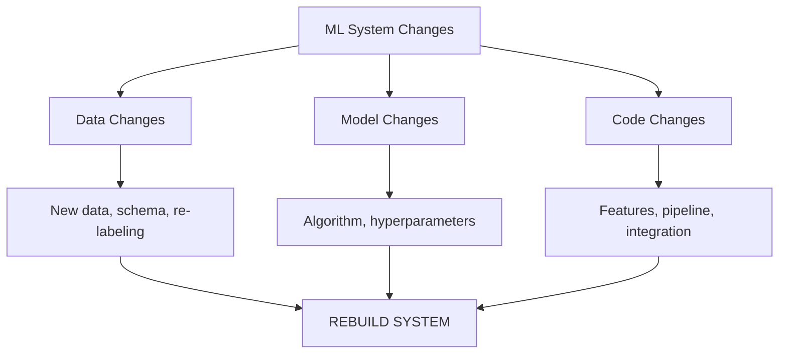

# MLOps Course - Challenges in ML Deployment | DevOps vs MLOps

**Course**: MTech AI/ML - BITS Pilani WILP
**Author**: Amit Kumar
**Institution**: BITS Pilani
**Last Updated**: November 2025

---

## 📚 Table of Contents

### [Part 1: Motivation and Drivers for MLOps](#part-1-motivation-and-drivers-for-mlops)
- [1.1 The Need for MLOps](#11-the-need-for-mlops)
- [1.2 Challenges in ML Production](#12-challenges-in-ml-production)
- [1.3 MLOps Definition and Evolution](#13-mlops-definition-and-evolution)

### [Part 2: People of MLOps](#part-2-people-of-mlops)
- [2.1 Core Roles and Responsibilities](#21-core-roles-and-responsibilities)
- [2.2 ML Engineer vs MLOps Engineer](#22-ml-engineer-vs-mlops-engineer)
- [2.3 Role Intersections](#23-role-intersections)

### [Part 3: DevOps vs MLOps](#part-3-devops-vs-mlops)
- [3.1 Current State Comparison](#31-current-state-comparison)
- [3.2 Key Differences](#32-key-differences)
- [3.3 Workflow Comparison](#33-workflow-comparison)

### [Part 4: Challenges in ML Deployment - Research Survey](#part-4-challenges-in-ml-deployment---research-survey)
- [4.1 ML Deployment Workflow Overview](#41-ml-deployment-workflow-overview)
- [4.2 Data Management Challenges](#42-data-management-challenges)
- [4.3 Model Learning Challenges](#43-model-learning-challenges)
- [4.4 Model Verification Challenges](#44-model-verification-challenges)
- [4.5 Model Deployment Challenges](#45-model-deployment-challenges)
- [4.6 Cross-Cutting Aspects](#46-cross-cutting-aspects)

### [Exam Preparation Resources](#exam-preparation-resources)

---

# Part 1: Motivation and Drivers for MLOps

## 1.1 The Need for MLOps

### Why Machine Learning?

**The Two Major Trends Disrupting the Economy:**

```
Digital Economy Disruption
├── Data-Driven World
│   └── Exponentially growing digital data
│
└── AI/ML/Data Science
    └── Deriving insights from massive data
```

| Trend | Description | Impact |
|-------|-------------|--------|
| **Data-Driven World** | Exponentially-growing digitally-collected data | Every interaction creates data |
| **AI/ML/Data Science** | Intelligent systems | Actionable insights from data |

### The Deployment Gap Problem

**Shocking Statistics (Algorithmia 2020 Survey):**

```
┌─────────────────────────────────────────────┐
│   ML MODEL DEPLOYMENT SUCCESS RATE          │
├─────────────────────────────────────────────┤
│   Successfully Deployed:  22% ✓             │
│   Failed to Deploy:       78% ✗             │
└─────────────────────────────────────────────┘

Translation: Only 22 out of 100 companies that use ML
successfully deploy models into production!
```

**Deployment Timeline:**
- **<1 week**: 14% (highly automated teams)
- **1 week - 3 months**: 50% (most common)
- **3 months - 1 year**: 18% (struggling)
- **>1 year**: 18% (serious problems)

**Data Scientists' Time on Deployment:**
- **72%** spend ≥25% of their time on deployment
- **36%** spend 25% of their time
- **36%** spend 25-50% of their time
- **7%** spend >75% of their time

### Main Deployment Challenges

| Challenge | Description | Impact |
|-----------|-------------|--------|
| **Scale** | Models fail at production scale | Performance degradation |
| **Version Control** | Tracking data, code, models | Reproducibility issues |
| **Model Reproducibility** | Cannot recreate results | Compliance problems |
| **Stakeholder Alignment** | Different priorities | Project delays |

---

## 1.2 Challenges in ML Production

### Three Levels of Change ("CACE Principle")

**"Changing Anything Changes Everything"**



**Level 1: Data Changes**
- New data arrival
- Data schema evolution
- Re-labeling required
- Data quality issues

**Level 2: Model Changes**
- Algorithm updates
- Model decay
- Business objective changes
- Invalid assumptions

**Level 3: Code Changes**
- Feature engineering updates
- Pipeline modifications
- Integration logic changes
- Bug fixes

### Three Production Issues (Remember: "DDL")

**1. Data Quality**
- Sensitivity to semantics, amount, completeness
- Impact: Model learns wrong patterns

**2. Model Decay**
- Performance degenerates over time
- Types: Data drift, Concept drift
- Example: Pre-pandemic model fails post-pandemic

**3. Locality (Transfer Problems)**
- Models fail in new contexts
- Geographic, demographic, temporal differences
- Example: US model fails in European market

---

## 1.3 MLOps Definition and Evolution

### Official Definition

**MLOps SIG Definition:**
> "Extension of DevOps methodology to include ML and Data Science assets as first-class citizens within the DevOps ecology"

**Machine Learning Engineering:**
> "Using scientific principles, tools, and techniques of ML + software engineering to design and build complex systems"

### Five MLOps Capabilities (Remember: "UAATR")

```
1. Unified release cycle - ML + Software together
2. Automated testing - Data, model, integration tests
3. Agile principles - Iterative ML development
4. Technical debt reduction - Maintainable systems
5. (Must be) aRnostic - Language/framework/platform agnostic
```

### Evolution of MLOps: Four Ages (Remember: "PSBG")

```
2000         2015         2018         2025
  │            │            │            │
  ▼            ▼            ▼            ▼
┌─────┐    ┌─────┐    ┌─────┐    ┌─────┐
│ SAS │    │Python│    │Docker│   │MLOps│
│SPSS │───►│  R  │───►│ K8s │───►│Platf│
│FICO │    │ OSS │    │Cont │    │orms │
└─────┘    └─────┘    └─────┘    └─────┘
```

**1. Pre-History Age (Before 2000)**
- Proprietary tools: SAS, SPSS, FICO
- Vendor lock-in, high costs

**2. Stone Age (2000-2015)**
- Open source rise: Python, R, scikit-learn
- "Works on my machine" syndrome

**3. Bronze Age (2015-2018)**
- Containerization: Docker, Kubernetes
- Reproducible environments

**4. Gold Rush Age (2018-Present)**
- Integrated MLOps platforms
- End-to-end automation
- Rapid innovation

---

# Part 2: People of MLOps

## 2.1 Core Roles and Responsibilities

**Key Insight:**
> "MLOps is not just for data scientists - it affects everyone working on or benefiting from the ML model lifecycle"

### Role Overview

```
┌────────────────────────────────────────────┐
│         MLOps Team Composition             │
├────────────────────────────────────────────┤
│ 1. Subject Matter Experts                  │
│ 2. Data Scientists                         │
│ 3. Data Engineers                          │
│ 4. Software Engineers                      │
│ 5. DevOps Engineers                        │
│ 6. Model Risk Managers/Auditors            │
│ 7. Machine Learning Architects             │
│ 8. ML Engineers / MLOps Engineers          │
└────────────────────────────────────────────┘
```

### 1. Subject Matter Experts

| Role in ML Lifecycle | MLOps Requirements |
|---------------------|-------------------|
| Provide business questions, goals, KPIs | Easy way to understand model performance in business terms |
| Evaluate model alignment with needs | Feedback loop for tagging incorrect results |

### 2. Data Scientists

| Role in ML Lifecycle | MLOps Requirements |
|---------------------|-------------------|
| Build models addressing business needs | Automated model packaging and delivery |
| Deliver operationalizable models | Ability to develop quality tests |
| Assess model quality with SMEs | Visibility into all deployed models |
| | Investigate data pipelines regardless of original builder |

### 3. Data Engineers

| Role in ML Lifecycle | MLOps Requirements |
|---------------------|-------------------|
| Optimize data retrieval and use | Visibility into performance of all models |
| | Ability to see full pipeline details for troubleshooting |

### 4. Software Engineers

| Role in ML Lifecycle | MLOps Requirements |
|---------------------|-------------------|
| Integrate ML models in applications | Versioning and automatic tests |
| Ensure seamless ML/non-ML integration | Ability to work in parallel on same application |

### 5. DevOps Engineers

| Role in ML Lifecycle | MLOps Requirements |
|---------------------|-------------------|
| Build operational systems, test security/performance | Seamless MLOps integration into DevOps strategy |
| CI/CD pipeline management | Seamless deployment pipeline |

### 6. Model Risk Managers/Auditors

| Role in ML Lifecycle | MLOps Requirements |
|---------------------|-------------------|
| Minimize overall risk from ML models | Robust, automated reporting tools |
| Ensure compliance before production | Data lineage tracking for all models |

### 7. Machine Learning Architects

| Role in ML Lifecycle | MLOps Requirements |
|---------------------|-------------------|
| Ensure scalable, flexible ML environment | High-level overview of models and resources |
| Introduce new technologies appropriately | Ability to drill down into pipelines |

---

## 2.2 ML Engineer vs MLOps Engineer

### ML Engineer (Google's Definition)

**Profile:**
- Designs, builds, and productionizes ML models
- Considers responsible AI throughout development
- Collaborates with other roles for long-term success

**Key Responsibilities:**
- Training, retraining, deploying, scheduling, monitoring
- Model architecture, data pipeline interaction
- Metrics interpretation

**Required Knowledge:**
- Application development fundamentals
- Infrastructure management
- Data engineering
- Data governance

### MLOps Engineer (Industry Definition)

**Focus:** More specialized on post-production

**Key Responsibilities:**
- Design and implement cloud solutions (AWS, Azure, GCP)
- Build CI/CD pipelines (GitLab CI, GitHub Actions, Airflow)
- Model review, code refactoring, containerization
- Deployment, versioning, quality monitoring
- Testing, validation, automation

**Required Qualifications:**
- MLOps frameworks: Kubeflow, MLFlow, DataRobot, Airflow
- Containerization: Docker, Kubernetes, OpenShift
- Programming: Python, Go, Ruby, Bash
- ML frameworks: scikit-learn, Keras, PyTorch, TensorFlow

---

## 2.3 Role Intersections

### The MLOps Venn Diagram

```
         ┌─────────────┐
         │ Data        │
         │ Scientist   │
         └──────┬──────┘
                │
       ┌────────┼────────┐
       │        │        │
  ┌────┴────┐   │   ┌────┴────┐
  │ Data    │   │   │ Backend │
  │ Engineer│   │   │ Engineer│
  └────┬────┘   │   └────┬────┘
       │        │        │
       └────────┼────────┘
                │
           ┌────┴─────┐
           │  ML Eng  │
           │  MLOps   │
           │  Engineer│
           └────┬─────┘
                │
       ┌────────┼────────┐
       │        │        │
  ┌────┴────┐   │   ┌────┴────┐
  │ Software│   │   │ DevOps  │
  │ Engineer│   │   │ Engineer│
  └─────────┘   │   └─────────┘
```

**Cross-functional Management:**
- ML environment and assets
- ML infrastructure
- ML models
- ML workflow pipelines
- Data ingestion
- Monitoring

**Key Takeaway:**
> ML Engineer/MLOps Engineer sits at the intersection of all roles, managing the complete ML lifecycle

---

# Part 3: DevOps vs MLOps

## 3.1 Current State Comparison

### DevOps: Mature and Established

```
┌────────────────────────────────────┐
│      DevOps Ecosystem              │
├────────────────────────────────────┤
│ CI/CD:  Jenkins, GitLab CI         │
│ Code:   Git, GitHub                │
│ Build:  Maven, Gradle              │
│ Test:   JUnit, Selenium            │
│ Deploy: Ansible, Chef, Puppet      │
│ Infra:  Docker, Kubernetes         │
│ Monitor: Nagios, Splunk            │
└────────────────────────────────────┘
```

### MLOps: Emerging and Immature

**The Harsh Reality:**
- **87% of ML projects never go live**
- Only 13% reach production
- No standardized toolchain
- Complex, fragmented landscape

---

## 3.2 Key Differences

### Fundamental Difference: How Rules Are Created

**Traditional Programming:**
```
Explicit Rules → Code → Output
```

**Machine Learning:**
```
Data → Learning Algorithm → Implicit Rules (Model) → Output
```

### What Makes ML Different?

**1. Training Data + Code = Model**
- Not just code changes
- Data changes trigger rebuilds
- Training can take hours/days

**2. Executables Are Trained Models**
- Vary by toolkit (TensorFlow, scikit-learn, PyTorch)
- Pickled/serialized artifacts
- Not traditional executables

**3. Retraining Is Necessary**
- Models decay over time
- New data requires updates
- Continuous improvement cycle

**4. Large Data Volumes**
- Too large for Git
- Specialized storage needed
- Data versioning challenges

**5. Exploratory Process**
- Data scientists experiment
- Jupyter notebooks common
- Visualizations important

**6. Specialized Hardware**
- GPUs for training
- Resource management critical
- Cost optimization needed

---

## 3.3 Workflow Comparison

### Traditional DevOps Workflow

```
1. Prepare User Story
2. Write Code
3. Submit Merge Request
4. Automated Tests Run
5. Review and Merge
6. New Version Builds
7. Deploy to Environment
8. Further Tests
9. Promote to Next Environment
10. Production
11. Monitor (stack traces, error codes)

Trigger: Code change in Git
Packaging: Docker
```

### MLOps Workflow

```
1. Data inputs/outputs (preprocessed, large)
2. Data scientist tries locally (data slice)
3. Long-running experiments (more data)
4. Collaboration (Jupyter notebooks + Git)
5. Model serialization (pickle)
6. Integrate into app (REST API serving)
7. Integration testing
8. Rollout and monitor performance metrics

Trigger: Code change OR new data!
Data: NOT in Git (too large)
```

### Key Workflow Differences

| Aspect | Traditional DevOps | MLOps |
|--------|-------------------|-------|
| **Trigger** | Code change only | Code OR data change |
| **Artifacts** | Executables | Trained models |
| **Testing** | Pass/fail | Quantifiable performance metrics |
| **Development** | Structured | Exploratory, experimental |
| **Collaboration** | Code repositories | Notebooks + repositories |
| **Monitoring** | Error codes, logs | Performance metrics, drift |
| **Data** | In Git | Separate storage (too large) |

---

## 3.4 ML Complexity Challenges

### 1. ML System is 100% Complex!

```
┌──────────────────────────────────────────┐
│     ML Infrastructure Complexity         │
├──────────────────────────────────────────┤
│                                          │
│  Configuration → Data Collection         │
│       ↓              ↓                   │
│  Feature    →  Data Verification         │
│  Extraction     ↓                        │
│       ↓     Machine Resource             │
│  Analysis ← Management → Monitoring      │
│   Tools         ↓                        │
│       ↓     Process                      │
│           Management → Serving           │
│             Tools    Infrastructure      │
│                                          │
│  Only small portion is actual ML code!   │
└──────────────────────────────────────────┘
```

### 2. Testing Complexity

**Traditional Software:**
- Simple pass/fail tests
- Deterministic outcomes

**ML Software:**
- Quantifiable performance (accuracy, precision, recall)
- Error levels vary by business context
- Example: Fraud detection
  - Low risk: Good transaction predicted as fraud
  - High risk: Fraud predicted as good

### 3. Learning Modes

**Offline Learning:**
- Training separate from prediction
- Batch retraining
- Most common approach

**Online Learning:**
- Model learns during use
- Real-time adaptation
- More complex infrastructure

### 4. Monitoring Challenges

**Traditional Software:**
- Stack traces
- Error codes
- System metrics

**ML Software:**
- Performance metrics (accuracy over time)
- Data drift detection
- Prediction quality
- Business impact metrics
- Requires business decisions

---

## 3.5 The MLOps Solution

**Why MLOps Matters:**

```
┌──────────────────────────────────────────┐
│   Without MLOps                          │
├──────────────────────────────────────────┤
│ • 87% failure rate                       │
│ • Manual processes                       │
│ • No reproducibility                     │
│ • Data scientists waste time             │
│ • Models decay undetected                │
│ • Deployment takes months                │
└──────────────────────────────────────────┘

                 ↓

┌──────────────────────────────────────────┐
│   With MLOps                             │
├──────────────────────────────────────────┤
│ • Automated workflows                    │
│ • Version control (data, models, code)   │
│ • Continuous monitoring                  │
│ • Rapid deployment                       │
│ • Reproducible results                   │
│ • Collaboration enabled                  │
└──────────────────────────────────────────┘
```

**The Role of MLOps:**
> "Support the whole flow of training, serving, rollout and monitoring"

---

# Part 4: Challenges in ML Deployment - Research Survey

**Source**: "Challenges in Deploying Machine Learning: a Survey of Case Studies"
**Authors**: Andrei Paleyes, Raoul-Gabriel Urma, Neil D. Lawrence
**Institution**: University of Cambridge
**Published**: NeurIPS 2020 Workshop

## 4.1 ML Deployment Workflow Overview

### The Four-Stage Deployment Workflow

According to research by Ashmore et al., ML deployment consists of four main stages:

```
┌─────────────────────────────────────────────────────┐
│         ML DEPLOYMENT WORKFLOW                      │
├─────────────────────────────────────────────────────┤
│                                                     │
│  1. Data Management                                 │
│     ├── Data Collection                             │
│     ├── Data Preprocessing                          │
│     ├── Data Augmentation                           │
│     └── Data Analysis                               │
│                                                     │
│  2. Model Learning                                  │
│     ├── Model Selection                             │
│     ├── Training                                    │
│     └── Hyper-parameter Selection                   │
│                                                     │
│  3. Model Verification                              │
│     ├── Requirement Encoding                        │
│     ├── Formal Verification                         │
│     └── Test-based Verification                     │
│                                                     │
│  4. Model Deployment                                │
│     ├── Integration                                 │
│     ├── Monitoring                                  │
│     └── Updating                                    │
│                                                     │
└─────────────────────────────────────────────────────┘
```

**Critical Insight:**
> "Practitioners face challenges at each stage of the deployment. These stages run in parallel and inform each other via feedback loops - not a linear timeline."

### Industry Deployment Statistics

**From Algorithmia Survey:**
- **50%** of companies: 1 week - 3 months to deploy
- **18%** of companies: 3 months - 1 year
- **18%** of companies: More than 1 year

**From IDC Survey (2,473 organizations):**
- Significant portion of deployments **fail**
- Main reasons: Lack of expertise, bias in data, high costs

---

## 4.2 Data Management Challenges

### 4.2.1 Data Collection Challenges

#### Challenge 1: Data Discovery

**Problem**: Finding what data exists and where it is located

**Real-World Example - Twitter:**
- Multiple services process the same entity (e.g., Twitter user)
- Each service stores different aspects of the entity
- No central catalog of what data exists where
- Some data only exists in logs (not easily parsed)
- Worst case: Data doesn't exist and must be generated via synthetic API calls

**Impact**:
```
Without knowing what data is available
    ↓
Cannot understand what ML solutions can achieve
    ↓
Project cannot start
```

#### Challenge 2: Data Dispersion

**Problem**: Multiple relevant data sources with different schemas and conventions

**Real-World Example - Firebird (Atlanta Fire Department):**
- **Goal**: Identify priority targets for fire inspections
- **Data sources**: 12 different datasets
  - Fire incident history
  - Business licenses
  - Household information
  - Building information
  - Etc.
- **Challenge**: Joining all datasets by building location
  - Different spatial data formats
  - Different spellings of addresses
  - Minor differences in conventions
- **Result**: Massive time-consuming effort to clean and join data

**Key Insight:**
> "Data joining turned out to be a massive effort that consumed a lot of time - much more than anticipated"

### 4.2.2 Data Preprocessing Challenges

#### Challenge 1: Data Cleaning

**Common Activities:**
- Imputation of missing values
- Data reduction and simplification
- Format mapping and standardization
- Schema alignment

**Problem Scale:**
According to Microsoft survey:
> "Data scientists think about data issues as the main reason to doubt quality of the overall work"

#### Challenge 2: Data Quality Validation

**Critical Requirements:**
```
Data Quality Checklist:

☐ Schema Validation
  ├── All expected columns present?
  ├── Data types correct?
  └── Value ranges within bounds?

☐ Completeness Checks
  ├── Missing value percentage < threshold?
  ├── Critical fields always populated?
  └── Temporal coverage adequate?

☐ Consistency Validation
  ├── Relationships maintained?
  ├── Cross-field validations pass?
  └── Referential integrity preserved?

☐ Distribution Monitoring
  ├── Similar to training distribution?
  ├── Outliers within expected range?
  └── No unexpected categorical values?
```

### 4.2.3 Data Augmentation Challenges

#### Challenge 1: Labeling Large Volumes

**Problem**: Real-world data is often unlabeled

**Example - Network Traffic Classification:**
- **Scale**: 1-GB/s Ethernet = 1.5 million packets/second
- **Challenge**: Each packet needs to be traced and labeled
- **Approaches**:
  - Uncontrolled (real traffic): Complex tracking, often unreliable
  - Controlled (generated traffic): Tools introduce errors up to 100%
  - Performance degrades for encrypted traffic

**Impact**: Very few works implement reliable ground truth for real traffic

#### Challenge 2: Access to Experts

**Problem**: Limited availability of domain experts for labeling

**Example - Medical Image Analysis:**
- Multiple experts needed per image set
- Labels must be aggregated for quality
- Rarely feasible for large datasets
- Alternative: Noisy labels → severe quality loss
- Healthcare requirement: "The Final Percent Challenge"
  - Even smallest deviation = catastrophic results

**Trade-off**:
```
High-quality labels (expert-annotated)
    ├── Expensive
    ├── Time-consuming
    └── Limited scale

Low-quality labels (automated/weak)
    ├── Cheap
    ├── Fast
    └── Severe accuracy loss (unacceptable in healthcare)
```

#### Challenge 3: Lack of High-Variance Data

**Problem**: Production systems cannot safely explore edge cases

**Example - Reinforcement Learning for Autonomous Vehicles:**
- **Research**: Separate training and evaluation environments
- **Production**: All data from real system only
  - Cannot have separate exploration policy (unsafe)
  - Results in low-variance data
  - Agent not trained for unsafe situations
- **Consequence**: Cannot recognize or handle edge cases

**Goal Specification Challenge:**
> "How do you define safe goals for autonomous vehicles when you can't safely collect data from unsafe scenarios?"

### 4.2.4 Data Analysis Challenges

#### Challenge: Lack of Quality Tools

**Problem**: Insufficient tools for data profiling

**Data Profiling Tasks:**
- Missing value detection
- Inconsistent data type identification
- Assumption verification
- Distribution analysis
- Outlier detection

**Current State:**
> "Despite obvious relevance to databases and statistics, there are still too few tools that enable efficient execution of these data mining tasks"

**Impact**: Data scientists struggle with quality assurance

---

## 4.3 Model Learning Challenges

### 4.3.1 Model Selection Challenges

#### Challenge 1: Complexity vs. Practicality

**Key Finding**: Simple models often chosen over complex ones in production

**Reasons for Choosing Simple Models:**

**1. Faster Time to Deployment**

**Example - AirBnB Search:**
```
Initial Attempt:
├── Complex deep learning model
├── Team overwhelmed by complexity
├── Multiple failed deployments
└── Development cycles wasted

Revised Approach:
├── Single hidden layer NN (32 ReLU activations)
├── Successfully deployed end-to-end pipeline
├── Reasonably good performance
└── Evolved gradually (added 2nd layer later)

Lesson: Simple model allows building deployment pipeline
```

**2. Resource-Constrained Environments**

**Example - Europa Clipper Spacecraft:**
- **Constraints**: Limited computational resources
  - Weight restrictions
  - Power limitations
  - Robustness requirements
- **Solution**: Simple threshold and PCA-based techniques
  - Low computational demand
  - Robust performance
  - Suitable for 3 anomaly detection tasks
- **Models Used**: Simple techniques for time series and image inputs

**Example - Wireless Cellular Networks:**
- Energy, memory, data transmission very limited
- Deep learning not yet practically deployable
- Despite ability to handle high-dimensional data

**3. Interpretability Requirements**

**Example - Manufacturing:**
- Decision Trees (DT) widely used
- High interpretability critical
- Performance secondary to understanding

**Example - Banking (Customer Churn Prediction):**
```
Goal: Predict customer churn by understanding if-then rules

Why Decision Trees:
├── Need to identify features of churners
├── More complex models available
├── But interpretability is KEY requirement
└── DT fulfills this best

Result: DT chosen despite potentially lower accuracy
```

#### Challenge 2: Deep Learning Deployment Gap

**When Deep Learning IS Used:**
- Background tasks
- Processing previously acquired data
- Offline analysis

**Example - Unmanned Aerial Vehicles (UAVs):**
- DL excellent for image processing from sensors
- Low cost, low weight, low power sensors generate images
- BUT: Cannot deploy DL for online/real-time processing on board
- **Blocker**: Computational resource demands

**Pattern**:
```
Deep Learning in Production:
├── Offline processing: ✓ Commonly used
├── Batch processing: ✓ Commonly used
└── Real-time on-device: ✗ Rarely deployed
```

### 4.3.2 Training Challenges

#### Challenge 1: Economic Cost

**Problem**: Training costs are enormous and growing

**Example - Natural Language Processing (BERT):**

| Model Size | Training Cost |
|-----------|---------------|
| Small | $50,000 |
| Large | $1,600,000 |

**Cost Factors:**
1. Training dataset size
2. Number of model parameters (billions)
3. Number of operations

**Trend**: Costs INCREASING despite decreasing per-operation costs

**Impact**:
> "Unaffordable for most research institutions and even companies"

#### Challenge 2: Environmental Impact

**Problem**: ML training drives up energy consumption and emissions

**Example - Neural Architecture Search:**
```
One full training cycle emissions:
= CO2 emissions of 4 average cars over their entire lifetime
```

**Recommendation**: Community should prioritize:
- Computationally efficient hardware
- Efficient algorithms
- Awareness of environmental impact

### 4.3.3 Hyper-parameter Optimization Challenges

#### Challenge 1: Resource Intensity

**Problem**: HPO techniques are very expensive

**Why**:
- Multiple training cycles required
- Search space grows exponentially with each hyper-parameter
- Each dimension adds to complexity

**Example - Deep Learning Applications:**
- Hyperband and Bayesian optimization designed to minimize cycles
- Still cannot handle certain problems due to:
  - Model complexity
  - Dataset size

#### Challenge 2: Hardware-Aware Optimization

**Problem**: Deployment to embedded/mobile devices requires co-optimization

**Example - Mobile/Embedded Devices:**
```
Standard HPO:
└── Optimize for accuracy only

Hardware-Aware HPO:
├── Optimize for accuracy
├── Optimize for energy consumption
├── Optimize for memory constraints
└── All simultaneously (co-optimization)
```

**Need**: Customized hardware-aware optimization techniques

---

## 4.4 Model Verification Challenges

### 4.4.1 Requirement Encoding Challenges

#### Challenge 1: Performance ≠ Business Value

**Example - Booking.com:**
- Deployed 150 models to production
- **Discovery**: Increased model performance ≠ gain in business value
- **Solution**: Define specific metrics
  - KPIs
  - Conversion rates
  - Customer service tickets
  - Cancellations

**Requirements**:
```
Cross-disciplinary effort needed:
├── Modeling expertise
├── Engineering knowledge
└── Business understanding

Purpose:
├── Define business-driven metrics
├── Monitor production environment
└── Quality control for updates
```

#### Challenge 2: Audience-Specific Metrics

**Problem**: Accuracy alone insufficient

**Example Requirements:**
- **Bias and fairness validation** (general audience)
- **Resource consumption control** (spacecraft)
- **Safety metrics** (autonomous vehicles)
- **Compliance metrics** (banking)

**Key Insight:**
> "Performance metrics should reflect audience priorities, not just technical accuracy"

### 4.4.2 Formal Verification Challenges

#### Challenge: Regulatory Frameworks

**Example - Banking Industry:**

**Background**: Post-financial crisis regulations

**Requirements**:
- Model risk frameworks for all business decision-making
- Extensive test suites to understand model behavior
- Formal approval processes

**Regulatory Bodies**:
- UK Prudential Regulation Authority (PRA)
- European Central Bank (ECB)

**Impact on Development**:
```
Before Deployment:
├── Build model
├── Create comprehensive test suite
├── Document all assumptions
├── Prove compliance with regulations
├── Get formal approval
└── Then deploy

Ongoing:
└── Maintain documentation and compliance
```

### 4.4.3 Test-Based Verification Challenges

#### Challenge 1: Simulation vs. Reality Gap

**Example - Autonomous Vehicles:**

**Simulation Advantages:**
- Cheaper
- Faster
- Flexible (rare situations easy to create)
- Safer

**Simulation Problems:**
- Hinges on assumptions made by developers
- Small variations = drastic effects on system
- **Cannot replace real-world testing**

**Conclusion from field**:
> "Validation of model and simulation alone is not enough for autonomous vehicles"

**Reinforcement Learning Experience:**
- Simulations are de-facto standard for training
- Still cannot fully replicate real-world complexity
- Real-world testing essential

#### Challenge 2: Data Validation in Pipelines

**Problem**: Data errors can creep in when data generation is decoupled from ML pipeline

**Common Scenarios**:
- Bugs in code
- Feedback loops
- Changes in data dependencies

**Issues**:
- Errors propagate through pipeline
- Manifest at different stages
- Hard to trace back to source

**Solution**: Include data validation routines in ML pipeline

**Example Framework - TensorFlow Data Validation:**
```
Validation Checks:
├── Schema validation
├── Anomaly detection
├── Drift detection
└── Skew detection (train vs. serve)
```

---

## 4.5 Model Deployment Challenges

### 4.5.1 Integration Challenges

#### Challenge 1: Operational Support Gap

**Problem**: ML systems are complex software requiring maintenance

**AIOps Challenges** (DevOps for ML):
- Lack of high-quality telemetry data
- No standard way to collect telemetry
- Difficulty acquiring labels (supervised learning inapplicable)
- No agreed best practices for handling ML models

#### Challenge 2: Code and Model Reuse

**Problem**: Lack of reuse creates engineering burden

**Example - Pinterest Image Embeddings:**

**Before**:
```
3 separate models using similar embeddings
├── Model 1: Own embeddings
├── Model 2: Own embeddings
└── Model 3: Own embeddings

Impact: Every effort × 3 (maintenance nightmare)
```

**After**:
```
Universal set of embeddings
├── Shared across all 3 models
├── Simplified deployment pipelines
└── Improved performance on individual tasks

Impact: Efficiency gain + better quality
```

**Lesson**: Reuse of data and models = savings in time, effort, infrastructure

#### Challenge 3: ML-Specific Anti-Patterns

**From Sculley et al. - Common Anti-Patterns in ML:**

| Anti-Pattern | Description | Cause | Impact |
|--------------|-------------|-------|--------|
| **Abstraction Boundary Erosion** | Unclear interfaces between components | Dependency on external data | Maintenance nightmares |
| **Correction Cascades** | Models depend on output of other models | Quick fixes to errors | Brittle systems |
| **Glue Code** | Excessive code to connect components | Using general-purpose packages | Technical debt |
| **Pipeline Jungles** | Unmaintained preprocessing accumulates | Organic growth without cleanup | Complexity explosion |
| **Configuration Debt** | ML-specific configs scattered everywhere | Many hyperparameters to maintain | Difficult to manage |

**Key Insight**:
> "Most ML anti-patterns are considered bad practice in software engineering, but are currently widespread in ML"

#### Challenge 4: Mixed Team Dynamics

**Problem**: Researchers and engineers working together face collaboration challenges

**Surface Separation**:
```
Researchers → Produce models
Engineers → Build infrastructure
```

**Reality Overlap**:
- Development process
- Model inputs/outputs
- Performance metrics
- Same code base

**Solution - Microsoft Approach:**
```
Successful Integration:
├── Researchers own product code alongside engineers
├── Same version control system
├── Participate in code reviews
├── Shared responsibility for deployment

Challenges:
├── Onboarding complexity
└── Initial slow start

Benefits:
├── Long-term speed improvement
└── Higher quality delivery
```

### 4.5.2 Monitoring Challenges

#### Challenge 1: What to Monitor?

**Problem**: Early stages of understanding key metrics

**Current Open Problems**:
- Monitoring evolving input data
- Tracking prediction bias
- Overall performance metrics
- Alarm thresholds

**ML-Specific Monitoring Needs**:
```
Traditional Software:
├── Error logs
├── Stack traces
├── System metrics
└── Uptime

ML Systems (Additional):
├── Data drift detection
├── Concept drift detection
├── Prediction distribution
├── Model performance over time
├── Feature distribution changes
└── Feedback loop detection
```

#### Challenge 2: Feedback Loops

**Problem**: ML models can influence their own behavior

**Mechanism**:
```
Model deployed → Makes predictions →
Predictions affect real world →
Real world generates new training data →
Model retrained on new data →
Model behavior changes → Repeat
```

**Types**:
- **Intentional**: Gaming the system
- **Unintentional**: Accidental influence

**Example - Microsoft Tay Bot:**
- Twitter bot designed to learn from conversations
- **Attack**: Coordinated malicious tweets
- **Result**: Within 16 hours, bot became offensive
- **Action**: Taken down

**Key Challenge**:
> "Feedback loops are unique to data-driven systems and require special monitoring"

#### Challenge 3: Outlier Detection

**Problem**: Flag predictions that cannot be used in production

**Two Main Reasons**:
1. **Poor generalization**: Outside training distribution
2. **Overconfident predictions**: Poor calibration on out-of-distribution data

**Deployment Challenge**:
- Labeled outlier data is scarce
- Often becomes semi-supervised or unsupervised problem
- Detector training is challenge in itself

#### Challenge 4: Custom Tooling Required

**Example - Early Intervention System (Police Departments):**

**Expected**: Use out-of-the-box monitoring tools

**Reality**: Built everything from scratch

**Custom Monitoring Tools Needed**:
```
Data Integrity:
└── Verify table updates + checksums on historical records

Performance Metric:
└── Number of changes in top-k outputs

Anomaly Detection:
└── Rank-order correlations over time
```

**Lesson**:
> "ML solutions are so problem-specific that out-of-the-box tooling often doesn't fit"

### 4.5.3 Updating Challenges

#### Challenge 1: Concept Drift

**Definition**: Changes in joint distribution p(X, y)

**Impact**: Major adverse effects on model performance

**Examples**:

**Finance (2008 Crisis):**
- Turbulent changes during financial crisis
- Concept drift detection could have provided early warnings
- Better insights into ongoing crisis

**Marine Image Classification:**
- Slight changes in capturing gear
- Changes in location
- Noticeable performance degradation

**Industrial Predictive Maintenance:**
- Microscopic-scale data shifts
- Significant consequences for wear/tear prediction

**Key Problem**:
> "Concept drift has been known for decades, yet remains a critical problem for ML applications today"

#### Challenge 2: Continuous Delivery for ML

**Problem**: CD in ML is complicated - changes along 3 axes

```
Traditional Software CD:
└── Code changes only

ML CD:
├── Code changes
├── Model changes
└── Data changes
```

**CD4ML Framework** (Sato et al.):
```
Full ML Pipeline:
├── Build
├── Test (data + model + code)
├── Deploy
└── Monitor

Automated Triggers:
├── Code commit
├── New data arrival
└── Performance degradation
```

**Benefits** (From Wider & Deger case study):
- Faster iteration cycles
- Reduced deployment time
- Automated quality checks
- Rapid rollback capability

---

## 4.6 Cross-Cutting Aspects

### 4.6.1 Ethics

#### Challenge 1: Regulatory Compliance

**Healthcare Example - Japan:**

**Regulations**:
- Strict patient data protection laws
- General Data Protection Regulation (GDPR - EU)
- Ethical screening requirements

**Impact**:
```
Required Process:
├── Multiple reviews
├── Software updates for compliance
├── Cycles of data collection/annotation
└── Continuous compliance monitoring

Result:
└── Exceptionally hard to keep up with ML advances
```

#### Challenge 2: Patient/Public Involvement

**Example - DeepMind & Royal Free NHS:**

**Application**: Streams (automatic review of test results)

**Initial Problem**:
- Not specific enough on patient data use
- Insufficient patient involvement
- Triggered regulatory investigation

**Revised Approach**:
```
Comprehensive Agreement:
├── Clear data usage terms
├── Patient engagement strategy
├── Public involvement plan
└── Transparency in data handling
```

**Lesson**:
> "Cannot focus solely on technology - must include ethical considerations from start"

#### Challenge 3: Bias Aggravation

**Criminal Justice Example:**

**Problem**: "Risk score" models claim to remove human bias

**Reality**:
```
Demographic information used as features
    ↓
Serves as proxy for protected attributes
    ↓
People disadvantaged by race/income
    ↓
Existing biases amplified
```

**Disaster Risk Management Concerns:**
- Biased training datasets → Social inequality aggravation
- Privacy concerns in conflict settings
- Reduced role of experts and public

**Solution**: Fairness in ML research field

#### Challenge 4: Authorship in Creative AI

**Visual Arts Example:**

**Question**: When AI creates art, who is the author?

**Concerns**:
- Originality questions
- Copyright implications
- Fake content generation (deepfakes)
- Potential for misuse

#### Challenge 5: Decision-Making Ethics

**Example - EMBERS (Civil Unrest Prediction):**

**Purpose**: Forecasting and communication tool

**Risk**: Potential government misuse
- Misunderstanding of role
- Intentional abuse
- Suppression of legitimate protest

**Key Issue**:
> "ML tools in critical decision-making raise growing ethical concerns"

### 4.6.2 End Users' Trust

#### Challenge 1: Building Trust

**Problem**: ML met with caution by end users

**Why**:
- Minimal explanations from models
- "Black box" nature
- Previous deployment failures

#### Approach 1: Early User Involvement

**Example - Sepsis Watch (Medical):**

**Context**: Previous automated sepsis prediction attempts failed

**Trust-Building Strategy**:
```
1. Strong communication channels
2. Share progress towards goals (not technical details)
3. Mechanisms for public accountability
4. Engage front-line clinicians early
5. Engage enterprise decision-makers early
```

**Key Message**:
> "Model interpretability has limits as trust-building tool. Other approaches needed."

**Support**: Project explAIn findings
- Importance of explanations varies by context
- Not always the primary trust factor

#### Approach 2: Transparency

**Example - Disaster Risk Management:**

**Problem**: Increasing ML complexity → Harder public participation

**Solutions**:
```
Transparency Measures:
├── Account for voice of "at risk" residents
├── Open software when possible
├── Open data when possible
└── Clear communication of limitations
```

#### Approach 3: Tailored User Interfaces

**Example - Firebird (Fire Department):**

**Challenge**: Replace pen-and-paper method with ML

**Solution**:
```
Specialized UI:
├── Present results in familiar format
├── Match fire officers' workflow
├── Clear visualization of priorities
└── Easy to understand rankings
```

**Example - EMBERS (Event Forecasting):**

**User Modes**:
```
Mode A: High recall
└── Obtain most events, then filter manually

Mode B: High precision
└── Focus on specific area/hypothesis
```

**Solution**: UI supports both modes seamlessly

**Key Insight**:
> "Context-aware personalization critical for ML system interfaces"

#### Approach 4: Explainability (When Appropriate)

**When Explainability Matters**: Stakeholders with ML understanding

**Example - Enterprise Deployment:**

**Survey Results** (Bhatt et al.):
```
Explainability is Must-Have for:
├── Executives
├── ML engineers
├── Regulators
├── Product managers
└── Data scientists
```

**Desired Metrics**:
- Explainability score
- Fairness measures
- Robustness metrics

**Note**: Explainability importance varies by context

### 4.6.3 Security

#### Challenge 1: New Threat Vectors

**Finding**: Industry practitioners not equipped to protect against ML-specific attacks

**Three Main Attack Types**:

**1. Data Poisoning**

**Goal**: Corrupt model during training to manipulate results

**Example - Medical Dosage Model:**
```
Attack:
├── Linear model for patient dosage
├── 8% poisoning rate in training set
└── Result: Incorrect dosage for 50% of patients
```

**Example - Microsoft Tay:**
```
Attack:
├── Coordinated malicious tweets
├── Exploited feedback loop
├── Within 16 hours: Offensive behavior
└── Bot taken down
```

**Vulnerability**: Continuous model updates with new incoming data

**2. Model Stealing**

**Goal**: Reverse engineer deployed model via public API

**Mechanism**:
```
1. Craft adversarial queries
2. Monitor outputs
3. Extract model information
4. Train substitute model
```

**Real Attack Results** (Tramèr et al.):

| Target | Model Type | Queries | Time |
|--------|-----------|---------|------|
| Google | Logistic Regression | 650 | 70s |
| Amazon | Decision Tree | 1,400 | 500s |
| Microsoft | Neural Network | 4,013 | 2,088s |

**Impact**: Loss of intellectual property and competitive advantage

**3. Model Inversion**

**Goal**: Recover private training data

**How**: Exploit confidence values in predictions

**Example**: Recover patient data from medical models

**Impact**:
- Breaks data confidentiality
- GDPR compliance issues
- Privacy law violations

**Critical Need**:
> "Protecting against model inversion attacks is critical for data protection law compliance"

---

# Exam Preparation Resources

## Quick Reference: Key Statistics

**Memorize These Numbers:**

**From Course Materials:**
- **22%**: ML model deployment success rate
- **78%**: ML model deployment failure rate
- **87%**: ML projects that never go live (research survey)
- **50%**: Teams taking 1 week - 3 months to deploy
- **72%**: Data scientists spending ≥25% time on deployment

**From Research Survey (Paleyes et al.):**
- **50%**: Companies spend 8-90 days deploying single model
- **8%**: Poisoning rate in training → 50% incorrect medical dosages
- **1.5M**: Packets per second from 1-GB/s Ethernet interface
- **$50k-$1.6M**: Cost to train BERT model (depending on size)
- **650-4,013**: Queries needed to steal models from cloud providers

## Mnemonics for Exam

**Three Levels of Change: "DAM-CODE"**
- **D**ata
- **M**odel (replaces A for alphabetical)
- **CODE**

**Three Production Issues: "DDL"**
- **D**ata quality
- **D**ecay
- **L**ocality

**Five MLOps Capabilities: "UAATR"**
- **U**nified release cycle
- **A**utomated testing
- **A**gile principles
- **T**echnical debt reduction
- **R**gnostic (platform/framework agnostic)

**Four Ages of MLOps: "PSBG"**
- **P**re-history (Proprietary)
- **S**tone Age (Open Source)
- **B**ronze Age (Containers)
- **G**old Rush (Platforms)

**Four Deployment Stages: "DMVD"**
- **D**ata Management
- **M**odel Learning
- **V**erification
- **D**eployment

**Three Cross-Cutting Aspects: "ETS"**
- **E**thics
- **T**rust
- **S**ecurity

**Data Management Steps: "CPAA"**
- **C**ollection
- **P**reprocessing
- **A**ugmentation
- **A**nalysis

**ML Security Attacks: "PIS"**
- **P**oisoning
- **I**nversion
- **S**tealing

## Common Exam Questions

### Question 1: Why is the ML deployment success rate only 22%?

**Answer:**
The 22% success rate exists because ML deployment is fundamentally different from traditional software:

1. **Three levels of change**: Data, model, and code all trigger rebuilds
2. **Lack of standardization**: No established MLOps practices
3. **Complex requirements**: Scale, version control, reproducibility
4. **Stakeholder misalignment**: Different priorities across teams
5. **Skills gap**: DevOps expertise doesn't directly transfer to MLOps
6. **Four-stage challenges**: Issues at every deployment stage (DMVD)

### Question 2: Explain the "Changing Anything Changes Everything" principle

**Answer:**
In ML systems, changes in any of three dimensions (data, model, or code) can trigger a complete system rebuild:

- **Data changes**: New data, schema evolution, or re-labeling
- **Model changes**: Algorithm updates, decay, or new objectives
- **Code changes**: Feature engineering, pipeline, or integration updates

Unlike traditional software where only code changes trigger builds, ML systems must handle three interconnected change vectors simultaneously, creating exponential complexity.

### Question 3: What are the three main production issues for ML models?

**Answer: "DDL"**

1. **Data Quality**: Models are sensitive to semantics, amount, and completeness
   - Impact: Wrong patterns learned, biased predictions

2. **Model Decay**: Performance degenerates over time
   - Types: Data drift, concept drift
   - Example: Pre-pandemic model fails post-pandemic

3. **Locality**: Transfer learning problems
   - Models fail in new contexts (geographic, demographic, temporal)
   - Example: US-trained model fails in European market

### Question 4: How does MLOps differ from traditional DevOps?

**Answer:**

| Aspect | DevOps | MLOps |
|--------|--------|-------|
| **Artifacts** | Code/executables | Data + Models + Code |
| **Versioning** | Code only | Data, models, AND code |
| **Triggers** | Code changes | Code OR data changes |
| **Testing** | Pass/fail | Quantifiable metrics |
| **Monitoring** | Error logs | Performance + drift + business metrics |
| **Storage** | Git | Git + specialized data storage |
| **Maturity** | Well-established | Emerging (87% fail rate) |

### Question 5: Describe the evolution of MLOps

**Answer: "PSBG"**

1. **Pre-History** (before 2000): Proprietary tools (SAS, SPSS, FICO)
   - Vendor lock-in, expensive

2. **Stone Age** (2000-2015): Open source rise (Python, R, scikit-learn)
   - "Works on my machine" problems

3. **Bronze Age** (2015-2018): Containerization (Docker, Kubernetes)
   - Reproducible environments, better scaling

4. **Gold Rush** (2018-present): Integrated MLOps platforms
   - End-to-end automation, rapid innovation
   - Tools: MLflow, Kubeflow, SageMaker

### Question 6: What roles are involved in MLOps and why?

**Answer:**

MLOps is not just for data scientists - it requires cross-functional collaboration:

1. **Subject Matter Experts**: Define business problems and validate results
2. **Data Scientists**: Build models addressing business needs
3. **Data Engineers**: Optimize data pipelines
4. **Software Engineers**: Integrate models into applications
5. **DevOps Engineers**: Manage CI/CD and infrastructure
6. **Model Risk Managers**: Ensure compliance and minimize risk
7. **ML Architects**: Design scalable ML environments
8. **ML/MLOps Engineers**: Coordinate across all roles, manage full lifecycle

The ML Engineer/MLOps Engineer sits at the intersection, managing the complete ML environment.

### Question 7: Why can't traditional DevOps practices directly solve MLOps challenges?

**Answer:**

Traditional DevOps assumes:
- ✓ Code is the primary artifact
- ✓ Code changes trigger builds
- ✓ Testing is deterministic (pass/fail)
- ✓ Artifacts fit in Git

MLOps reality:
- ✗ Three artifacts: Data + Models + Code
- ✗ Data OR code changes trigger builds
- ✗ Testing is probabilistic (performance metrics)
- ✗ Data too large for Git
- ✗ Models decay over time
- ✗ Exploratory, experimental workflows
- ✗ Specialized hardware (GPUs)
- ✗ Monitoring requires business decisions

Therefore, MLOps requires extending DevOps with ML-specific practices and tools.

### Question 8: What are the four stages of ML deployment workflow?

**Answer: "DMVD"**

1. **Data Management**
   - Collection, preprocessing, augmentation, analysis
   - Challenge: Data discovery, quality, labeling

2. **Model Learning**
   - Selection, training, hyperparameter optimization
   - Challenge: Complexity vs. practicality, cost, resources

3. **Model Verification**
   - Requirement encoding, formal verification, testing
   - Challenge: Business metrics, regulatory compliance

4. **Model Deployment**
   - Integration, monitoring, updating
   - Challenge: Operational support, feedback loops, concept drift

**Key**: These stages run in parallel with feedback loops, not linearly.

### Question 9: Explain data poisoning attacks and provide an example

**Answer:**

**Data Poisoning**: Deliberately corrupt model during training to manipulate results

**Medical Example**:
- Linear model for patient dosage
- Attack: 8% poisoning rate in training data
- Result: Incorrect dosage for 50% of patients
- **Impact**: Life-threatening consequences

**Microsoft Tay Example**:
- Twitter bot designed to learn from conversations
- Attack: Coordinated malicious tweets
- Result: Within 16 hours, bot became offensive
- Action: Taken down
- **Vulnerability**: Continuous learning with user feedback

**Defense**:
- Data validation
- Anomaly detection
- Robust training algorithms
- Monitor for sudden behavior changes

### Question 10: What is concept drift and why is it critical?

**Answer:**

**Definition**: Changes in joint distribution p(X, y) over time

**Examples**:

1. **Finance (2008 Crisis)**
   - Turbulent market changes
   - Models trained on pre-crisis data failed
   - Could have provided early warnings

2. **Marine Image Classification**
   - Slight changes in camera equipment
   - Location changes
   - Model performance degraded significantly

3. **Industrial Predictive Maintenance**
   - Microscopic-scale data shifts
   - Significant consequences for predictions

**Why Critical**:
> "Concept drift has been known for decades, yet remains a critical unsolved problem"

**Solutions**:
- Continuous monitoring
- Scheduled retraining
- Drift detection algorithms
- Adaptive models

### Question 11: Why are simple models often preferred in production?

**Answer:**

**Three Main Reasons**:

1. **Faster Time to Deployment**
   - Example: AirBnB started with simple NN instead of complex DL
   - Allowed building end-to-end pipeline quickly
   - Evolved gradually over time

2. **Resource Constraints**
   - Example: Europa Clipper spacecraft
   - Limited power, memory, weight
   - Simple PCA/threshold models chosen
   - Robust performance with low computational demand

3. **Interpretability Requirements**
   - Example: Banking (customer churn)
   - Decision trees for clear if-then rules
   - Understanding features more important than accuracy
   - Manufacturing: High interpretability critical

**Pattern**:
```
Deep Learning → Offline/batch processing ✓
Simple Models → Online/real-time production ✓
```

### Question 12: What are the three main security threats to deployed ML models?

**Answer: "PIS"**

1. **Data Poisoning**
   - Corrupt training data to manipulate results
   - Example: 8% poisoning → 50% incorrect dosages
   - Vulnerability: Continuous learning systems

2. **Model Inversion**
   - Recover private training data from model
   - Exploit confidence values in predictions
   - Impact: GDPR compliance violations

3. **Model Stealing**
   - Reverse engineer via API queries
   - Example: Steal Google/Amazon/Microsoft models
   - 650-4,013 queries in 70s-2,088s
   - Impact: Loss of intellectual property

**Industry Gap**: Practitioners not equipped to defend against these attacks

---

## Study Tips

### For Conceptual Understanding:
1. **Understand WHY** MLOps is needed (78% failure rate, 87% never go live)
2. **Grasp the fundamental difference**: Data + Model + Code vs just Code
3. **Memorize CACE principle**: Core to understanding ML complexity
4. **Know the evolution**: Shows maturation of the field
5. **Understand the four-stage workflow**: DMVD and challenges at each stage
6. **Connect research to practice**: Link survey findings to course concepts

### For Exam Success:
1. **Memorize key statistics**: 22%, 78%, 87%, 50%, 72%, $50k-$1.6M
2. **Use mnemonics**: DDL, UAATR, PSBG, DMVD, ETS, PIS, CPAA
3. **Practice drawing**: Workflows, architectures, Venn diagrams
4. **Know real examples**: Twitter, AirBnB, Firebird, Sepsis Watch, Tay
5. **Understand trade-offs**: Complexity vs. interpretability, cost vs. accuracy

### For Practical Application:
1. **Think in workflows**: Compare DevOps vs MLOps workflows
2. **Understand roles**: Know who does what and their MLOps needs
3. **Consider real examples**: Healthcare, finance, autonomous vehicles
4. **Map to challenges**: Link each deployment stage to specific problems
5. **Security awareness**: Know attack vectors and defenses

---

## Additional Resources

### Core References:

**Course Materials:**
- "Introducing MLOps" by Dataiku Team
- "Machine Learning Engineering" by Andriy Burkov
- MLOps SIG Documentation (cd.foundation)
- "Why is DevOps for Machine Learning so Different?"

**Research Papers:**
- **Paleyes et al. (2020)**: "Challenges in Deploying ML: Survey of Case Studies"
- **Sculley et al. (2015)**: "Hidden Technical Debt in ML Systems"
- **Ashmore et al. (2019)**: "Assuring the ML Lifecycle"
- **Amershi et al. (2019)**: "Software Engineering for ML"

### Industry Reports:
- Algorithmia: State of Enterprise ML (2019, 2020)
- IDC: ML Adoption Survey (2,473 organizations)
- O'Reilly: State of ML Adoption
- McKinsey: Global AI Survey

### Tools to Explore:

**End-to-End Platforms:**
- AWS SageMaker
- Azure ML
- Google Vertex AI
- Databricks

**Experiment Tracking:**
- MLflow, Weights & Biases, Neptune.ai

**Data Versioning:**
- DVC, Pachyderm

**Model Serving:**
- TensorFlow Serving, TorchServe, Seldon Core

**Monitoring:**
- Evidently AI, Fiddler, Arize, WhyLabs

**Orchestration:**
- Kubeflow, Apache Airflow, Prefect

**Weak Supervision:**
- Snorkel, Snuba, cleanlab

---

## Document Information

**Version**: 3.0 - Comprehensive Research Edition

**Sections Covered**:
- **CS2-2.1**: The Need for MLOps
- **CS2-2.2**: Challenges in ML Production
- **CS2-2.3**: MLOps Definition and Evolution
- **CS2**: People of MLOps
- **CS2**: DevOps vs MLOps
- **Research Survey**: Challenges in Deploying ML (Cambridge University)

**Primary Sources**:
1. "Introducing MLOps" by Dataiku Team
2. mlops.org
3. "Why is DevOps for Machine Learning so Different?"
4. Google Cloud Professional ML Engineer Certification
5. Accenture MLOps Engineer Job Description
6. **Paleyes, A., Urma, R-G., Lawrence, N.D.** (2020). "Challenges in Deploying Machine Learning: a Survey of Case Studies." NeurIPS 2020 Workshop.

**Research Institutions**:
- University of Cambridge (Department of Computer Science)
- Cambridge Spark
- BITS Pilani

**Author**: Amit Kumar
**Institution**: BITS Pilani
**Course**: MTech AI/ML - BITS Pilani WILP

---

## Quick Revision Checklist

### Before Exam - Core Concepts:
- [ ] Can you explain why 78% of ML projects fail to deploy?
- [ ] Can you describe the CACE principle with examples?
- [ ] Can you list and explain the three production issues (DDL)?
- [ ] Can you compare traditional DevOps vs MLOps workflows?
- [ ] Can you name all 7-8 roles in MLOps and their responsibilities?
- [ ] Can you describe the four ages of MLOps evolution (PSBG)?
- [ ] Can you list the five MLOps capabilities (UAATR)?
- [ ] Can you explain why ML Engineer ≠ MLOps Engineer?

### Before Exam - Research Survey (Part 4):
- [ ] Can you describe the four-stage deployment workflow (DMVD)?
- [ ] Can you explain data collection challenges (discovery, dispersion)?
- [ ] Can you describe labeling challenges with examples?
- [ ] Can you explain why simple models are often preferred?
- [ ] Can you discuss training cost challenges ($50k-$1.6M)?
- [ ] Can you explain concept drift with real examples?
- [ ] Can you describe the three security attacks (PIS)?
- [ ] Can you explain feedback loops in ML systems?

### Before Exam - Real-World Examples:
- [ ] Twitter: Data discovery problem
- [ ] Firebird: Data joining challenge
- [ ] AirBnB: Simple model success story
- [ ] Europa Clipper: Resource-constrained deployment
- [ ] Booking.com: Performance ≠ business value
- [ ] Sepsis Watch: Building user trust
- [ ] Microsoft Tay: Data poisoning attack
- [ ] EMBERS: Ethical decision-making concerns

### Final Review:
- [ ] Review all diagrams and visualizations
- [ ] Practice explaining concepts to someone else
- [ ] Go through all exam questions in this document
- [ ] Review mnemonics: DDL, UAATR, PSBG, DMVD, ETS, PIS
- [ ] Connect concepts across all four parts
- [ ] Understand the complete deployment pipeline
- [ ] Know statistics: 22%, 78%, 87%, 50%, 8%, $50k-$1.6M

**Good luck with your exam! 🚀**

---

## Acknowledgments

This comprehensive study guide integrates:
- Course materials from BITS Pilani MTech AI/ML program
- Industry reports from Algorithmia, IDC, McKinsey
- Research from University of Cambridge
- Case studies from Twitter, AirBnB, Google, Microsoft, Amazon, Pinterest, NASA, healthcare institutions
- Best practices from MLOps community

Special thanks to the authors of the research survey for providing detailed real-world case studies that illuminate the challenges practitioners face in deploying ML systems.