# MLOps Course - CS3: Key MLOps Features

**Course**: MTech AI/ML - BITS Pilani WILP
**Author**: Amit Kumar
**Institution**: BITS Pilani
**Source**: "Introducing MLOps" by Treveil and Dataiku team
**Enhanced with**: Practical examples, real-world analogies, and exam-focused content

---

## 📚 Table of Contents

### CS3 - Key MLOps Features
- [3.1 MLOps Components Overview](#31-mlops-components-overview)
- [3.2 Model Development](#32-model-development)
  - [3.2.1 Establishing Business Objectives](#321-establishing-business-objectives)
  - [3.2.2 Data Sources and EDA](#322-data-sources-and-exploratory-data-analysis)
  - [3.2.3 Feature Engineering and Selection](#323-feature-engineering-and-selection)
  - [3.2.4 Training and Evaluation](#324-training-and-evaluation)
  - [3.2.5 Reproducibility](#325-reproducibility)
- [3.3 Productionalization and Deployment](#33-productionalization-and-deployment)
  - [3.3.1 Model Deployment Types](#331-model-deployment-types-and-contents)
  - [3.3.2 Deployment Requirements](#332-model-deployment-requirements)
- [3.4 Monitoring](#34-monitoring)
  - [3.4.1 DevOps Concerns](#341-devops-concerns)
  - [3.4.2 Data Scientist Concerns](#342-data-scientist-concerns)
  - [3.4.3 Business Concerns](#343-business-concerns)
- [3.5 Iteration and Life Cycle](#35-iteration-and-life-cycle)
  - [3.5.1 Iteration Strategies](#351-iteration-strategies)
  - [3.5.2 The Feedback Loop](#352-the-feedback-loop)
- [3.6 Governance](#36-governance)
  - [3.6.1 Data Governance](#361-data-governance)
  - [3.6.2 Process Governance](#362-process-governance)
- [Exam Preparation Resources](#exam-preparation-resources)

---

## 3.1 MLOps Components Overview

### The Five Key Components of MLOps

**Remember: "DDMIG"**
- **D**evelopment
- **D**eployment
- **M**onitoring
- **I**teration
- **G**overnance

```mermaid
graph TD
    A[MLOps Lifecycle] --> B[Development]
    A --> C[Deployment]
    A --> D[Monitoring]
    A --> E[Iteration]
    A --> F[Governance]

    B --> B1[Business Objectives]
    B --> B2[Data Exploration]
    B --> B3[Feature Engineering]
    B --> B4[Model Training]

    C --> C1[Productionalization]
    C --> C2[CI/CD Pipeline]
    C --> C3[Model Serving]

    D --> D1[Performance Metrics]
    D --> D2[Data Drift]
    D --> D3[Business KPIs]

    E --> E1[Model Retraining]
    E --> E2[A/B Testing]
    E --> E3[Shadow Testing]

    F --> F1[Data Governance]
    F --> F2[Process Governance]
    F --> F3[Compliance]

    style A fill:#4CAF50
    style B fill:#2196F3
    style C fill:#FF9800
    style D fill:#9C27B0
    style E fill:#00BCD4
    style F fill:#F44336
```

### How MLOps Components Affect the Organization

| Component | Affected Roles | Key Activities |
|-----------|---------------|----------------|
| **Development** | Data Scientists, ML Engineers | Model building, experimentation, feature engineering |
| **Deployment** | DevOps Engineers, Software Engineers | CI/CD, containerization, model serving |
| **Monitoring** | All roles | Performance tracking, drift detection, KPI monitoring |
| **Iteration** | Data Scientists, MLOps Engineers | Retraining, versioning, A/B testing |
| **Governance** | Risk Managers, Legal, Data Scientists | Compliance, auditing, documentation |

### Cross-Reference to Previous Sessions

**Topics Already Covered:**

| Topic | Previously Covered In | Current CS3 Focus |
|-------|----------------------|-------------------|
| **ML Lifecycle Phases** | CS1 Section 1.2 - Six phases of ML lifecycle | Detailed implementation of each phase |
| **Model Development Workflow** | CS1 Section 1.2.5 - Phase 4: Model Development | Practical aspects and best practices |
| **Deployment Challenges** | CS2 Section 4.5 - Model Deployment Challenges | Solutions and implementation strategies |
| **Monitoring Requirements** | CS1 Section 1.1.5 - Model Performance Monitoring | Stakeholder-specific monitoring needs |

**🔗 Key Insight**: CS3 builds upon the foundational concepts from CS1 and CS2 by providing **practical implementation details** and **operational best practices** for each component.

---

## 3.2 Model Development

### Overview

**🎯 Cross-Reference**: This section expands on **CS1 Section 1.2.2 (ML Problem Framing)** and **CS1 Section 1.2.4 (Model Development)** with practical implementation details.

Model development encompasses the entire journey from business problem to trained model, including:

```
Business Problem → Data Acquisition → Feature Engineering →
Model Training → Evaluation → Reproducibility
```

---

## 3.2.1 Establishing Business Objectives

### Why Business Objectives Matter

**The Foundation Principle:**
> "ML projects are generally part of a larger project that impacts technologies, processes, and people"

### Key Components of Business Objectives

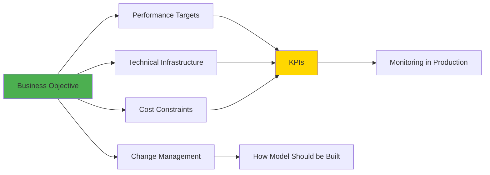

### Business Objectives Framework

| Component | Description | Example |
|-----------|-------------|---------|
| **Business Goal** | Clear problem definition | Reduce fraudulent transactions to < 0.1% |
| **Performance Targets** | Quantifiable success metrics | 95% precision, 90% recall |
| **Technical Requirements** | Infrastructure constraints | Response time < 100ms |
| **Cost Constraints** | Budget limitations | Training cost < $10,000/month |
| **KPIs** | Key Performance Indicators | False positive rate, processing time |

### Real-World Examples

**Example 1: Fraud Detection System**

```
Business Objective: Reduce fraudulent transactions

Performance Targets:
├── Fraud detection rate: > 95%
├── False positive rate: < 2%
├── Processing time: < 50ms per transaction
└── Cost per transaction: < $0.01

Technical Infrastructure:
├── Real-time scoring (REST API)
├── Handle 10,000 requests/second
└── 99.99% uptime requirement

Cost Constraints:
├── Development: $100,000
├── Monthly operations: $20,000
└── Training compute: $5,000/month

Change Management:
├── Train fraud analysts on new system
├── Update business processes
└── Customer communication plan
```

**Example 2: Face Recognition on Social Media**

```
Business Objective: Enable automatic face tagging

Performance Targets:
├── Face detection accuracy: > 98%
├── Face recognition accuracy: > 95%
└── Response time: < 200ms

Technical Infrastructure:
├── Mobile-friendly model (< 50MB)
├── Batch processing for uploaded photos
└── Edge deployment for privacy

Cost Constraints:
├── GPU training budget: $15,000
├── Storage: $10,000/month
└── Inference: $0.001 per image

KPIs to Monitor:
├── User engagement (tags accepted)
├── Privacy complaints
└── System performance metrics
```

### Critical Success Factors

**🔗 See Also**: CS1 Section 1.2.2 (Phase 2: ML Problem Framing) for problem definition methodology

| Factor | Why It Matters | How to Achieve |
|--------|----------------|----------------|
| **Measurable Value** | Track ROI and success | Define quantifiable KPIs |
| **Achievable Target** | Ensure realistic goals | Review published research, POCs |
| **Stakeholder Alignment** | Get buy-in from all parties | Regular communication, demos |
| **Clear Path to Production** | Ensure deployment feasibility | Define technical requirements early |

### Best Practices Checklist

**Before Starting Model Development:**

- [ ] Business objective clearly defined and documented
- [ ] Performance targets are quantifiable and realistic
- [ ] Technical infrastructure requirements identified
- [ ] Cost constraints understood and approved
- [ ] KPIs defined and monitoring plan established
- [ ] Change management strategy in place
- [ ] All stakeholders aligned and committed

---

## 3.2.2 Data Sources and Exploratory Data Analysis

### Data Discovery Challenge

**🔗 Cross-Reference**: See **CS2 Section 4.2.1 (Data Collection Challenges)** for detailed challenges in data discovery and dispersion.

**The Search for Suitable Input Data:**
> "Finding data sounds simple, but in practice, it can be the **most arduous part of the journey**"

### Data Discovery Process

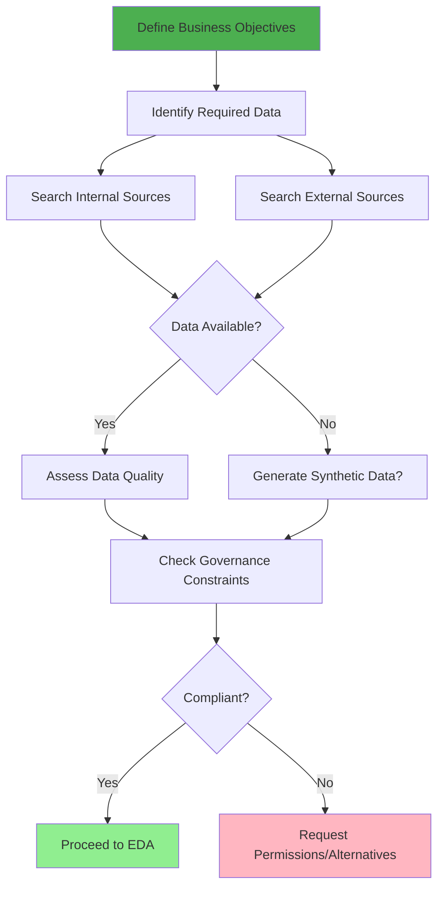

### Data Governance Constraints

**Key Questions to Answer:**

```
Data Privacy & Compliance:
├── Is personal data involved? (GDPR, CCPA compliance)
├── Do we have consent to use this data?
├── Are there industry regulations? (HIPAA, PCI-DSS)
├── Is data anonymization required?
└── What is the data retention policy?

Data Access & Security:
├── Who can access this data?
├── Where can data be stored?
├── Can data leave certain jurisdictions?
├── What encryption is required?
└── Are there data sharing restrictions?

Data Quality & Lineage:
├── What is the data source?
├── How fresh is the data?
├── Is there a data catalog?
├── Can we trust this data?
└── What transformations were applied?
```

### Exploratory Data Analysis (EDA)

**Purpose of EDA:**
> "It always helps to build an understanding of the patterns in data before attempting to train models"

**🔗 See Also**: CS1 Section 1.2.4 (Data Processing - Data Exploration) for EDA fundamentals

### EDA Techniques

| Technique | Purpose | Tools/Methods |
|-----------|---------|---------------|
| **Visual EDA** | Intuitive insights | Histograms, scatter plots, box plots |
| **Statistical EDA** | Rigorous analysis | Correlation matrices, hypothesis testing |
| **Hypothesis Building** | Guide feature engineering | Domain knowledge + data patterns |
| **Data Cleaning Identification** | Find quality issues | Missing values, outliers, duplicates |
| **Feature Significance** | Identify important variables | Feature importance, correlation analysis |

### EDA Workflow Example

**Credit Card Fraud Detection:**

```
Step 1: Initial Data Profiling
─────────────────────────────
Dataset: 284,807 transactions
Features: 30 (28 anonymized + Amount + Time)
Target: Class (0=Normal, 1=Fraud)

Observation:
├── Imbalanced: 99.83% normal, 0.17% fraud
├── Anonymized features (V1-V28) from PCA
├── Amount: Right-skewed distribution
└── Time: Seconds from first transaction

Step 2: Visual Analysis
─────────────────────────
Distribution Plots:
├── Fraud amounts: Generally smaller than normal
├── Time patterns: No clear temporal pattern
└── Feature distributions: Some separation visible

Box Plots:
├── V1-V28: Identify outliers per class
├── Amount: Significant outliers in both classes
└── Statistical differences between classes

Step 3: Statistical Analysis
─────────────────────────────
Correlation Matrix:
├── Features mostly uncorrelated (PCA result)
├── Amount weakly correlated with fraud
└── Some V features show stronger relationships

Class Distribution:
├── Severe imbalance: 492 frauds vs 284,315 normal
├── Sampling strategy needed
└── Evaluation metrics: Precision/Recall > Accuracy

Step 4: Hypothesis Formation
─────────────────────────────
Hypotheses:
├── Smaller transactions may be fraud probes
├── Certain V features separate classes well
├── Time may not be a strong predictor
└── Feature engineering may not be needed (PCA done)

Step 5: Data Cleaning Requirements
─────────────────────────────────────
Identified Needs:
├── Handle class imbalance (SMOTE, undersampling)
├── Scale 'Amount' feature
├── No missing values (clean dataset)
└── Remove extreme outliers (if any)
```

### EDA Best Practices

**Visual EDA:**
```
Essential Visualizations:
├── Distribution plots (histograms, KDE)
├── Relationships (scatter plots, pair plots)
├── Categorical analysis (bar charts, count plots)
├── Temporal patterns (time series plots)
├── Correlation heatmaps
└── Box plots for outlier detection
```

**Statistical EDA:**
```
Key Statistical Tests:
├── Descriptive statistics (mean, median, std)
├── Correlation analysis (Pearson, Spearman)
├── Hypothesis testing (t-tests, chi-square)
├── Normality tests (Shapiro-Wilk, KS test)
└── Variance analysis (ANOVA)
```

---

## 3.2.3 Feature Engineering and Selection

**🔗 Cross-Reference**: See **CS1 Section 1.2.4 (Feature Engineering)** for theoretical foundations. This section focuses on practical implementation.

### The Core Principle

**What ML Algorithms Understand:**
> "Features are **arrays of numbers of fixed size**, as it is the only object that ML algorithms understand"

### Feature Engineering Process

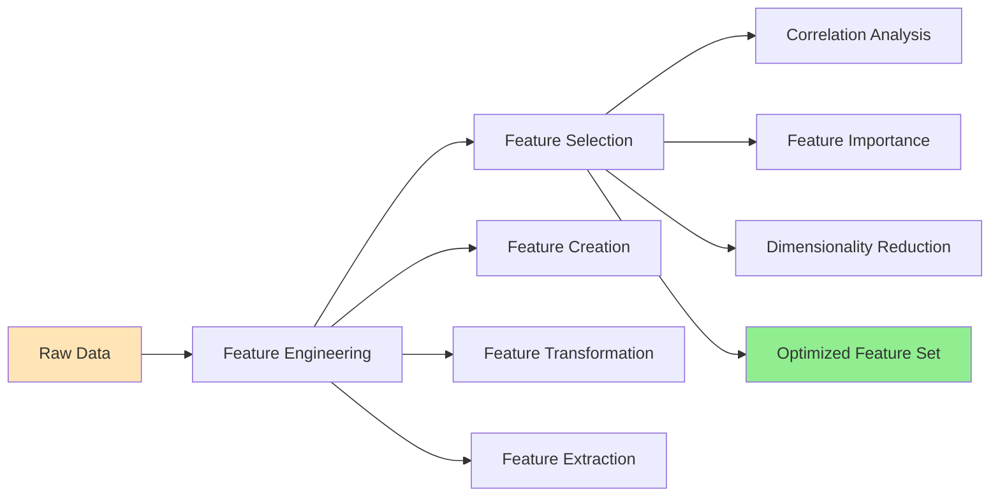

### Why Feature Engineering Matters

**The Time Investment:**
> "Feature engineering includes data cleansing, which can represent the **largest part of an ML project in terms of time spent**"

### Feature Engineering Benefits

| Benefit | Impact | Example |
|---------|--------|---------|
| **Important Feature Identification** | Focus on predictive variables | 50 of 100 features explain 80% of variance |
| **Redundancy Removal** | Eliminate correlated features | Remove features with >60% correlation |
| **Dimensionality Reduction** | Reduce computational cost | 100,000 × 400 → 100,000 × 50 features |
| **Avoid Overfitting** | Better generalization | Simpler model, better performance |
| **Accurate Predictions** | Improved model performance | 5-10% accuracy improvement typical |

### Feature Selection Strategies

**Strategy 1: Correlation Analysis**

```
Goal: Remove highly correlated features

Method:
1. Calculate correlation matrix
2. Identify pairs with correlation > threshold (0.60-0.80)
3. For each correlated pair:
   ├── Keep feature with higher target correlation
   └── Remove the other feature
4. Result: Independent features with unique information

Example:
────────────────────────────────────────
Features: Temperature_Celsius, Temperature_Fahrenheit
Correlation: 1.0 (perfectly correlated)
Action: Remove one (they contain identical information)

Features: Customer_Age, Account_Years
Correlation: 0.75 (highly correlated)
Explanation: Older customers → longer accounts
Action: Keep the more predictive feature
```

**Strategy 2: Random Forest Feature Importance**

```python
# Conceptual approach (no actual code implementation)

Process:
1. Train Random Forest on all features
2. Extract feature importance scores
3. Rank features by importance
4. Select top N features (e.g., top 50 out of 100)
5. Retrain model with selected features

Typical Results:
├── Top 20% features: 80% of total importance
├── Middle 60% features: 19% of total importance
└── Bottom 20% features: 1% of total importance

Decision: Keep top 20-30% features
```

**Strategy 3: Dimensionality Reduction (PCA)**

```
Principal Component Analysis (PCA)

Input: 400 features (100,000 rows × 400 columns)
Process: Find principal components
Output: 50 components (100,000 rows × 50 columns)

Benefits:
├── 87.5% reduction in dimensions
├── Captures maximum variance
├── Removes multicollinearity
├── Faster training (10× or more)
└── Often improves model performance

Trade-off:
├── Pros: Dimensionality reduction, faster training
└── Cons: Loss of interpretability
```

### Practical Feature Engineering Example

**E-commerce Customer Churn Prediction:**

```
Raw Data:
├── Customer_ID
├── Registration_Date
├── Last_Login_Date
├── Total_Orders
├── Total_Spend
├── Support_Tickets
└── Email_Opens

Engineered Features:
├── Account_Age_Days (from Registration_Date)
├── Days_Since_Last_Login (from Last_Login_Date)
├── Average_Order_Value (Total_Spend / Total_Orders)
├── Orders_Per_Month (Total_Orders / Account_Age_Months)
├── Support_Ticket_Rate (Tickets / Total_Orders)
├── Email_Engagement_Rate (Opens / Emails_Sent)
├── Recent_Activity_Flag (Last_Login < 7 days)
└── High_Value_Customer (Total_Spend > threshold)

Feature Selection Results:
─────────────────────────────────────
100 initial features (raw + engineered)
↓
Correlation analysis: Remove 30 correlated features
↓
Random Forest importance: Top 50 features
↓
PCA: 50 features → 30 components (if needed)
↓
Final: 30-50 optimized features

Impact:
├── Training time: 2 hours → 20 minutes (6× faster)
├── Model accuracy: 82% → 87% (5% improvement)
├── Inference time: 100ms → 15ms (6.7× faster)
└── Storage: 400MB → 60MB (87% reduction)
```

### Feature Store Implementation

**🔗 See Also**: CS1 Section 1.2.8 (Feature Store) for architectural details

**Benefits of Feature Stores:**

```
┌─────────────────────────────────────────┐
│         FEATURE STORE BENEFITS          │
├─────────────────────────────────────────┤
│                                         │
│  1. Reusability                         │
│     ├── Share features across teams    │
│     ├── Avoid duplicate engineering    │
│     └── Faster model development       │
│                                         │
│  2. Consistency                         │
│     ├── Same features for train/serve  │
│     ├── Version control                │
│     └── Reproducible results           │
│                                         │
│  3. Efficiency                          │
│     ├── Pre-computed features          │
│     ├── Low-latency retrieval          │
│     └── Reduced computation            │
│                                         │
│  4. Quality                             │
│     ├── Centralized validation         │
│     ├── Monitoring and alerts          │
│     └── Data lineage tracking          │
│                                         │
└─────────────────────────────────────────┘
```

### Feature Engineering Best Practices

**Checklist:**

- [ ] Document all feature transformations
- [ ] Maintain feature creation code in version control
- [ ] Use feature store for reusability and consistency
- [ ] Regularly review feature importance
- [ ] Remove redundant features (correlation > 0.60)
- [ ] Apply dimensionality reduction if needed
- [ ] Validate features don't cause data leakage
- [ ] Test features in both training and serving environments

---

## 3.2.4 Training and Evaluation

**🔗 Cross-Reference**: See **CS1 Section 1.2.5 (Model Development - Training)** for training fundamentals and **CS2 Section 4.3 (Model Learning Challenges)** for practical challenges.

### The Iterative Nature of Training

**Key Characteristic:**
> "The process of training and optimizing a new ML model is **iterative**"

### Training Iteration Cycle

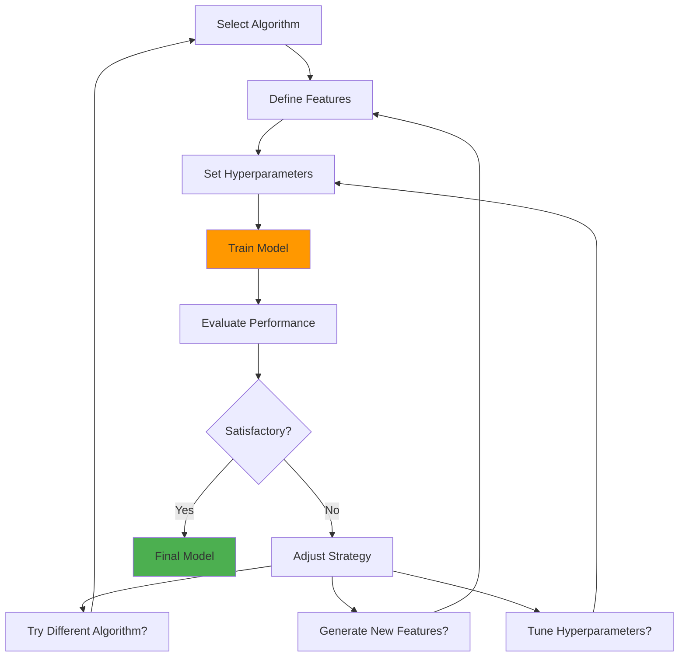

### Training Activities

| Activity | Description | Typical Iterations |
|----------|-------------|-------------------|
| **Algorithm Selection** | Test multiple algorithms | 3-10 algorithms |
| **Feature Generation** | Automated feature creation | 2-5 iterations |
| **Feature Selection** | Adapt feature subsets | 5-20 combinations |
| **Hyperparameter Tuning** | Optimize model parameters | 50-500 trials |

### Computational Intensity

**Resource Requirements:**

```
Training Phases by Computational Demand:

Low Compute:
├── Simple models (Linear Regression, Logistic Regression)
├── Small datasets (< 100K rows)
├── Few features (< 100)
└── Training time: Minutes to hours

Medium Compute:
├── Ensemble models (Random Forest, XGBoost)
├── Medium datasets (100K - 10M rows)
├── Moderate features (100-1000)
└── Training time: Hours to days

High Compute:
├── Deep learning (Neural Networks)
├── Large datasets (> 10M rows)
├── High dimensions (> 1000 features or images)
└── Training time: Days to weeks

Very High Compute:
├── Large language models (BERT, GPT)
├── Massive datasets (billions of tokens)
├── Billion+ parameters
└── Training time: Weeks to months
```

**🔗 See Also**: CS2 Section 4.3.2 (Training Challenges - Economic Cost) for training cost analysis (BERT: $50K-$1.6M)

### Experiment Tracking

**The Complexity Problem:**
> "Keeping track of the results of each experiment when iterating becomes **complex quickly**"

**What to Track:**

```
Per Experiment:
├── Data
│   ├── Training dataset version
│   ├── Validation dataset version
│   ├── Feature set used
│   └── Data preprocessing steps
│
├── Model
│   ├── Algorithm type
│   ├── Model architecture
│   ├── Hyperparameters
│   └── Training configuration
│
├── Performance
│   ├── Training metrics
│   ├── Validation metrics
│   ├── Convergence plots
│   └── Confusion matrices
│
├── Environment
│   ├── Library versions
│   ├── Hardware used
│   ├── Random seeds
│   └── Execution time
│
└── Metadata
    ├── Timestamp
    ├── Experimenter
    ├── Tags/labels
    └── Notes/observations
```

### Experiment Tracking Tools

| Tool | Key Features | Best For |
|------|-------------|----------|
| **MLflow** | Auto-logging, model registry, open-source | General purpose, on-premise |
| **Weights & Biases** | Real-time collaboration, visualization | Team projects, deep learning |
| **Neptune.ai** | Metadata store, experiment comparison | Long-running experiments |
| **TensorBoard** | TensorFlow integration, visualization | TensorFlow/PyTorch projects |
| **Comet.ml** | Code tracking, reproducibility | Research and production |

### Training Best Practices

**Experiment Organization:**

```
Project Structure:
├── experiments/
│   ├── exp001_baseline_lr/
│   │   ├── config.yaml
│   │   ├── train.log
│   │   ├── metrics.json
│   │   └── model.pkl
│   ├── exp002_rf_tuned/
│   ├── exp003_xgboost/
│   └── exp004_neural_net/
│
├── data/
│   ├── raw/
│   ├── processed/
│   └── features/
│
└── tracking/
    ├── experiments.db
    └── comparison_report.html
```

### Evaluation Metrics Selection

**🔗 Cross-Reference**: See **CS1 Section 1.1.4 (Model Evaluation & Testing)** for detailed metrics explanation.

**Classification Tasks:**

| Metric | When to Use | Formula/Concept |
|--------|-------------|-----------------|
| **Accuracy** | Balanced datasets | (TP + TN) / Total |
| **Precision** | Minimize false positives | TP / (TP + FP) |
| **Recall** | Minimize false negatives | TP / (TP + FN) |
| **F1-Score** | Balance precision/recall | 2 × (Precision × Recall) / (Precision + Recall) |
| **AUC-ROC** | Threshold-independent | Area under ROC curve |

**Regression Tasks:**

| Metric | When to Use | Characteristic |
|--------|-------------|----------------|
| **MAE** | Outlier-robust | Average absolute error |
| **RMSE** | Penalize large errors | Root mean squared error |
| **R²** | Variance explained | Coefficient of determination |
| **MAPE** | Percentage-based | Mean absolute percentage error |

### Training Example: Credit Card Fraud Detection

```
Problem: Highly imbalanced classification (99.83% normal, 0.17% fraud)

Iteration 1: Baseline Logistic Regression
─────────────────────────────────────────
Features: All 30 features
Algorithm: Logistic Regression
Class Balancing: None
Results:
├── Accuracy: 99.85% (misleading!)
├── Precision: 5%
├── Recall: 60%
└── F1-Score: 9%
Conclusion: Model predicts mostly "normal" - useless!

Iteration 2: Class Balancing Applied
─────────────────────────────────────
Features: All 30 features
Algorithm: Logistic Regression
Class Balancing: SMOTE (Synthetic Minority Oversampling)
Results:
├── Accuracy: 97%
├── Precision: 15%
├── Recall: 85%
└── F1-Score: 25%
Conclusion: Better recall, but too many false positives

Iteration 3: Random Forest with Feature Selection
──────────────────────────────────────────────────
Features: Top 20 features (from importance analysis)
Algorithm: Random Forest
Class Balancing: Weighted classes
Hyperparameters: 100 trees, max_depth=10
Results:
├── Accuracy: 99.5%
├── Precision: 85%
├── Recall: 80%
└── F1-Score: 82%
Conclusion: Good balance, acceptable false positives

Iteration 4: XGBoost with Hyperparameter Tuning
────────────────────────────────────────────────
Features: Top 20 features
Algorithm: XGBoost
Class Balancing: scale_pos_weight
Hyperparameters: Tuned via Bayesian optimization
Results:
├── Accuracy: 99.7%
├── Precision: 92%
├── Recall: 88%
└── F1-Score: 90%
Conclusion: Best performance, ready for deployment!

Total Iterations: 40+ experiments over 2 weeks
Final Decision: XGBoost model (Iteration 4 variant)
```

---

## 3.2.5 Reproducibility

**The Reproducibility Challenge:**
> "Without reproducibility, data scientists have **little chance of being able to confidently iterate on models**"

### Why Reproducibility Matters

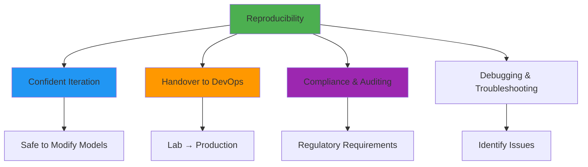

### Requirements for True Reproducibility

**Version Control Needed:**

```
Assets to Version:
├── Code
│   ├── Training scripts
│   ├── Preprocessing code
│   ├── Feature engineering logic
│   └── Evaluation code
│
├── Data
│   ├── Training dataset version
│   ├── Validation dataset version
│   ├── Test dataset version
│   └── Data schema/metadata
│
├── Model
│   ├── Algorithm choice
│   ├── Hyperparameters
│   ├── Model architecture
│   └── Trained weights
│
├── Environment
│   ├── Python/R version
│   ├── Library versions (requirements.txt)
│   ├── Hardware specs (GPU type)
│   └── Operating system
│
└── Configuration
    ├── Random seeds
    ├── Training config
    ├── Deployment settings
    └── Environment variables
```

### Reproducibility Failure Scenarios

**Scenario 1: "Works on My Machine"**

```
Problem:
Data Scientist's Laptop:
├── Python 3.8
├── scikit-learn 0.24.1
├── Model accuracy: 92%
└── "Ready for production!"

Production Environment:
├── Python 3.9
├── scikit-learn 0.23.0
├── Model accuracy: 87%
└── "Why is performance different?"

Cause: Different library versions produce different results

Solution:
├── Lock all dependency versions
├── Use containerization (Docker)
├── Document environment completely
└── Test in production-like environment
```

**Scenario 2: Data Leakage**

```
Problem:
Original Development:
├── Split data: Train/Val/Test
├── Remove duplicates AFTER split
├── Model accuracy: 98%
└── Suspicious performance!

Reproduction Attempt:
├── Split data: Train/Val/Test
├── Remove duplicates BEFORE split (correct)
├── Model accuracy: 89%
└── "Cannot reproduce results!"

Cause: Duplicates leaked from train to test

Solution:
├── Document exact preprocessing order
├── Version preprocessed datasets
├── Include data validation checks
└── Code review for data leakage
```

**Scenario 3: Random Seed Issues**

```
Problem:
Training Run 1:
├── Random seed: not set
├── Train/val split: random
├── Model init: random
└── Accuracy: 91%

Training Run 2 (attempt to reproduce):
├── Random seed: not set
├── Train/val split: different!
├── Model init: different!
└── Accuracy: 88%

Cause: Non-deterministic randomness

Solution:
├── Set all random seeds (Python, NumPy, TensorFlow, etc.)
├── Document seed values
├── Use deterministic algorithms when possible
└── Accept small variance for some operations
```

### Reproducibility Best Practices

**Implementation Checklist:**

- [ ] All code in version control (Git)
- [ ] Data versions tracked (DVC, S3 versioning)
- [ ] Requirements.txt or environment.yml frozen
- [ ] Random seeds set and documented
- [ ] Training configuration files versioned
- [ ] Experiment tracking tool used (MLflow, W&B)
- [ ] Container images for environments (Docker)
- [ ] README with exact reproduction steps

### Tools for Reproducibility

| Tool | Purpose | Key Features |
|------|---------|-------------|
| **Git** | Code versioning | Branch, commit, tag model versions |
| **DVC** | Data version control | Track large datasets, S3/GCS integration |
| **Docker** | Environment consistency | Containerize entire stack |
| **MLflow** | Experiment tracking | Log parameters, metrics, artifacts |
| **Conda/Pip** | Dependency management | Lock library versions |

### Reproducibility Example

**Complete Reproducibility Package:**

```
fraud_detection_model_v2.3/
├── README.md                      # Reproduction instructions
├── environment.yml                # Exact environment
├── requirements.txt               # Pinned Python packages
├── Dockerfile                     # Container definition
│
├── data/
│   ├── raw_data_v1.csv           # Original data (or S3 link)
│   ├── processed_data_v1.pkl     # After preprocessing
│   └── data_schema.json          # Data structure
│
├── src/
│   ├── preprocess.py             # Data cleaning
│   ├── feature_engineering.py    # Feature creation
│   ├── train.py                  # Model training
│   └── evaluate.py               # Model evaluation
│
├── config/
│   ├── train_config.yaml         # Hyperparameters
│   └── preprocessing_config.yaml # Preprocessing params
│
├── models/
│   ├── model_v2.3.pkl           # Trained model
│   └── scaler_v2.3.pkl          # Feature scaler
│
├── experiments/
│   └── mlflow_experiment_123/   # MLflow tracking
│       ├── metrics.json
│       ├── params.json
│       └── artifacts/
│
└── docs/
    ├── model_card.md            # Model documentation
    ├── training_report.pdf      # Training results
    └── reproduction_log.txt     # Step-by-step log
```

**Reproduction Steps:**

```bash
# Documented in README.md

# Step 1: Set up environment
docker build -t fraud_detection:v2.3 .
docker run -it fraud_detection:v2.3

# Step 2: Download exact data version
dvc pull data/raw_data_v1.csv.dvc

# Step 3: Run preprocessing
python src/preprocess.py --config config/preprocessing_config.yaml

# Step 4: Train model
python src/train.py --config config/train_config.yaml --seed 42

# Step 5: Evaluate
python src/evaluate.py --model models/model_v2.3.pkl

# Expected Output:
# Accuracy: 99.7%
# Precision: 92%
# Recall: 88%
# F1-Score: 90%
```

---

## 3.3 Productionalization and Deployment

**🔗 Cross-Reference**: See **CS2 Section 4.5 (Model Deployment Challenges)** for deployment challenges. This section focuses on solutions and implementation.

### The Deployment Challenge

**Key Insight:**
> "Productionalizing and deploying models presents an **entirely different set of technical challenges** than developing the model"

### Organizational Challenge

```
Data Scientists ←────[Communication Gap]────→ DevOps Team
     │                                              │
     │ Skills: ML, Python, Jupyter                  │ Skills: Infrastructure,
     │ Focus: Model accuracy                        │         CI/CD, Reliability
     │ Tools: scikit-learn, TensorFlow              │ Tools: Docker, Kubernetes
     │                                              │
     └──────────────────┬───────────────────────────┘
                        │
                   ⚠️ Challenge:
                Information exchange &
                effective collaboration
                        │
                        ▼
               Without collaboration:
               Deployment delays inevitable!
```

### Critical Success Factor

**Essential Requirement:**
> "Without effective collaboration between the teams, **delays or failures to deploy are inevitable!**"

---

## 3.3.1 Model Deployment Types and Contents

### What Goes Into Production?

**Fundamental Questions:**
- What exactly is going into production?
- What does a model consist of?

### Two Types of Model Deployment

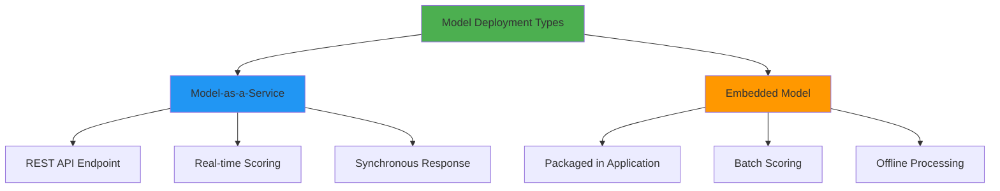

### Type 1: Model-as-a-Service (Live Scoring)

**Characteristics:**

```
Architecture:
┌─────────────────────────────────────────┐
│  REST API Endpoint                      │
├─────────────────────────────────────────┤
│  Request → Model → Response (real-time) │
└─────────────────────────────────────────┘

Example Use Cases:
├── Fraud detection (per transaction)
├── Recommendation engine (per user request)
├── Image classification (per upload)
├── Chatbot responses (per message)
└── Search ranking (per query)

Typical Latency: < 100ms

Infrastructure:
├── Load balancer
├── Multiple model instances
├── Auto-scaling capability
└── Health monitoring
```

**Example: Fraud Detection API**

```
Request:
POST /api/v1/predict/fraud
{
  "transaction_id": "TX123456",
  "amount": 1500.00,
  "merchant": "Online Store",
  "card_present": false,
  "distance_from_home": 500,
  "time_of_day": "02:30"
}

Response (< 50ms):
{
  "transaction_id": "TX123456",
  "prediction": "fraud",
  "confidence": 0.87,
  "risk_score": 0.92,
  "factors": ["high_amount", "unusual_time", "card_not_present"]
}
```

### Type 2: Embedded Model (Batch Scoring)

**Characteristics:**

```
Architecture:
┌─────────────────────────────────────────┐
│  Application Package                   │
├─────────────────────────────────────────┤
│  Model embedded → Batch processing      │
└─────────────────────────────────────────┘

Example Use Cases:
├── Daily customer churn scoring
├── Weekly sales forecasting
├── Monthly credit risk assessment
├── Nightly email campaign targeting
└── Quarterly financial projections

Typical Schedule: Hourly/Daily/Weekly

Infrastructure:
├── Scheduled job (cron, Airflow)
├── Batch processing framework
├── Database for results
└── Monitoring dashboard
```

**Example: Churn Prediction Batch Job**

```
Batch Process (runs daily at 2 AM):

Input: 1 million active customers
Processing:
├── Load customer features from database
├── Score all customers with churn model
├── Rank by churn probability
└── Save results to database

Output:
├── High risk: 50,000 customers (prob > 0.7)
├── Medium risk: 200,000 customers (prob 0.4-0.7)
└── Low risk: 750,000 customers (prob < 0.4)

Action:
├── Trigger retention campaigns for high risk
└── Update dashboard for business team

Processing Time: 15 minutes for 1M customers
```

### Model Contents and Dependencies

**What a Model Consists Of:**

```
Model Package:
├── Code Artifacts
│   ├── Python/R/Java code
│   ├── Preprocessing functions
│   ├── Feature engineering logic
│   └── Prediction functions
│
├── Data Artifacts
│   ├── Trained model weights (pickle, HDF5, ONNX)
│   ├── Feature scalers/normalizers
│   ├── Encoders (label, one-hot)
│   └── Lookup tables
│
├── Configuration
│   ├── Hyperparameters
│   ├── Feature names/order
│   ├── Model version
│   └── API schema
│
└── Dependencies
    ├── Runtime (Python 3.9)
    ├── Libraries (scikit-learn==1.0.2)
    ├── System packages
    └── Hardware requirements (GPU?)
```

### The Dependency Challenge

**Critical Issue:**
> "Use of different versions may cause **model predictions to differ**"

**Example of Version Sensitivity:**

```
Development Environment:
├── Python 3.8.10
├── scikit-learn 0.24.1
├── NumPy 1.20.0
└── Prediction: [0.87, 0.13]

Production Environment:
├── Python 3.9.5
├── scikit-learn 0.23.0  ← Different version!
├── NumPy 1.21.0
└── Prediction: [0.82, 0.18]  ← Different result!

Impact: 5% difference in prediction confidence
Could affect business decisions!
```

### Portable Model Formats

**Reducing Environment Dependencies:**

| Format | Full Name | Best For | Limitations |
|--------|-----------|----------|-------------|
| **PMML** | Predictive Model Markup Language | Traditional ML (trees, regression) | Limited algorithm support |
| **PFA** | Portable Format for Analytics | Statistical models | Less common |
| **ONNX** | Open Neural Network Exchange | Deep learning | Some ops not supported |
| **POJO** | Plain Old Java Object | Java environments | Language-specific |

**Trade-offs of Portable Formats:**

```
✅ Pros:
├── Reduced dependency on specific libraries
├── Improved portability across systems
├── Simplified deployment
└── Better interoperability

❌ Cons:
├── Limited algorithm support
├── Potential behavior differences vs original
├── Loss of some advanced features
└── Additional conversion step
```

**Example: ONNX Export**

```
Original Model (PyTorch):
├── Framework: PyTorch 1.9
├── Dependencies: Heavy
├── Deployment: Python + PyTorch required
└── Inference: 100ms

Converted to ONNX:
├── Framework: ONNX Runtime
├── Dependencies: Minimal
├── Deployment: Any ONNX-compatible runtime
└── Inference: 15ms (6× faster!)

Trade-off:
├── Some PyTorch operations not supported
├── Need to verify predictions match
└── Limited to inference (no training)
```

---

## 3.3.2 Model Deployment Requirements

### The Deployment Spectrum

**🔗 See Also**: CS1 Section 1.2.6 (Model Deployment) for deployment pipeline architecture

```
Lightweight Deployment ←──────────────────→ Robust Deployment
(Self-service apps)                      (Mission-critical apps)
     │                                              │
     │ Simple framework (Flask)                     │ Full CI/CD pipeline
     │ Minimal testing                              │ Extensive testing
     │ Fast iteration                               │ Quality gates
     │ Low stakes                                   │ High stakes
     │                                              │
     └──────────────────┬───────────────────────────┘
                        │
                   Choose based on:
                   ├── Use case criticality
                   ├── User base
                   ├── Business impact
                   └── Compliance needs
```

### Lightweight Deployment

**When to Use:**
- Short-lifetime applications
- Self-service use cases
- Internal tools
- Prototypes and demos

**Example: Flask API for Internal Tool**

```
Simple Deployment:
├── Framework: Flask (Python micro-framework)
├── Hosting: Single server or serverless (AWS Lambda)
├── Testing: Basic smoke tests
├── Monitoring: Minimal (error logs)
└── Time to deploy: Hours

Structure:
app.py (100 lines of code)
├── Load model (pickle)
├── Define API endpoint
├── Parse input
├── Make prediction
└── Return JSON response

Deployment:
$ python app.py
Running on http://localhost:5000
```

### Robust CI/CD Pipeline

**When to Use:**
- Customer-facing applications
- Mission-critical systems
- Regulated industries
- High-volume services

**Required Steps:**

```
┌───────────────────────────────────────────────────┐
│     ROBUST CI/CD PIPELINE FOR ML MODELS           │
├───────────────────────────────────────────────────┤
│                                                   │
│  1. Coding Standards                              │
│     ├── Code review process                       │
│     ├── Linting and formatting                    │
│     ├── Documentation standards                   │
│     └── Unit test coverage > 80%                  │
│                                                   │
│  2. Re-create in Production-Like Environment      │
│     ├── Containerization (Docker)                 │
│     ├── Match production specs                    │
│     ├── Integration testing                       │
│     └── Load testing                              │
│                                                   │
│  3. Model Revalidation                            │
│     ├── Accuracy verification                     │
│     ├── Performance benchmarks                    │
│     ├── Compare with development results          │
│     └── Regression testing                        │
│                                                   │
│  4. Explainability Checks                         │
│     ├── SHAP values analysis                      │
│     ├── Feature importance verification           │
│     ├── Prediction justifications                 │
│     └── Stakeholder review                        │
│                                                   │
│  5. Governance Requirements                       │
│     ├── Compliance validation (GDPR, etc.)        │
│     ├── Bias/fairness checks                      │
│     ├── Security scan                             │
│     └── Legal approval                            │
│                                                   │
│  6. Data Quality Checks                           │
│     ├── Schema validation                         │
│     ├── Distribution monitoring                   │
│     ├── Outlier detection                         │
│     └── Completeness verification                 │
│                                                   │
│  7. Resource Testing                              │
│     ├── Load testing (1000s requests/sec)         │
│     ├── Memory profiling                          │
│     ├── CPU/GPU utilization                       │
│     └── Latency measurement                       │
│                                                   │
│  8. Application Integration                       │
│     ├── End-to-end testing                        │
│     ├── API contract testing                      │
│     ├── Error handling verification               │
│     └── Rollback procedures                       │
│                                                   │
└───────────────────────────────────────────────────┘
```

### Explainability Checks (Critical Component)

**🔗 Cross-Reference**: See **CS1 Section 1.1.6 (Explainable AI)** for black box vs white box models

**Why Explainability Matters:**

```
Black Box Models (Neural Networks):
├── High accuracy (95%+)
├── Zero transparency
└── Stakeholder problem: "Why this prediction?"

Solution: Explainability Tools
├── SHAP (SHapley Additive exPlanations)
├── LIME (Local Interpretable Model-agnostic Explanations)
├── Feature importance plots
└── Partial dependence plots
```

**Example: Explainability in Loan Approval**

```
Prediction: Loan Application REJECTED

Black Box Output:
└── Approval Probability: 0.23 (below 0.5 threshold)
    ├── ❌ Not helpful for customer
    └── ❌ Cannot improve application

With Explainability (SHAP):
└── Rejection Factors:
    ├── Credit Score: 580 (target: >650) [-0.15]
    ├── Income: $35K/year (target: >$45K) [-0.08]
    ├── Debt-to-Income: 45% (target: <40%) [-0.06]
    ├── Employment Duration: 3 months (prefer: >1 year) [-0.04]
    └── Age: 22 years (neutral) [+0.01]

Benefits:
├── ✓ Customer knows why rejected
├── ✓ Clear path to approval (improve score, income)
├── ✓ Regulatory compliance (fair lending)
└── ✓ Builds trust in system
```

### Deployment Pipeline Example

**End-to-End Deployment:**

```
Code Commit (Git)
    ↓
Automated Tests
├── Unit tests (code)
├── Integration tests (API)
└── Model tests (accuracy)
    ↓
Code Review
├── Peer review required
└── Security scan
    ↓
Build Docker Image
├── Freeze dependencies
├── Package model artifacts
└── Tag with version
    ↓
Deploy to Staging
├── Production-like environment
├── Smoke tests
└── Load testing
    ↓
Model Validation
├── Revalidate accuracy
├── Explainability checks
└── Performance benchmarks
    ↓
Governance Approval
├── Compliance checks
├── Bias assessment
└── Sign-off from risk team
    ↓
Deploy to Production
├── Blue-green deployment
├── Gradual traffic ramp
└── Monitor metrics
    ↓
Post-Deployment Monitoring
├── Prediction distribution
├── Latency tracking
├── Error rates
└── Business KPIs
```

### Best Practices Summary

**Deployment Requirements Checklist:**

**Lightweight Deployment:**
- [ ] Model serialized and loadable
- [ ] Basic API framework (Flask, FastAPI)
- [ ] Smoke tests pass
- [ ] Error logging enabled

**Robust Deployment:**
- [ ] All code reviewed and approved
- [ ] Comprehensive test suite (unit + integration)
- [ ] Model accuracy validated in staging
- [ ] Explainability checks completed
- [ ] Governance requirements met
- [ ] Data quality validation automated
- [ ] Load testing passed (target throughput)
- [ ] Security scan completed
- [ ] Rollback plan documented
- [ ] Monitoring and alerting configured

---

## 3.4 Monitoring

**🔗 Cross-Reference**: See **CS1 Section 1.2.7 (Model Monitoring)** for monitoring system architecture and **CS2 Section 4.5.2 (Monitoring Challenges)** for specific challenges.

### The Multi-Stakeholder Challenge

**Key Insight:**
> "Good performance means **different things to different people**, particularly to the DevOps team, to data scientists, and to the business"

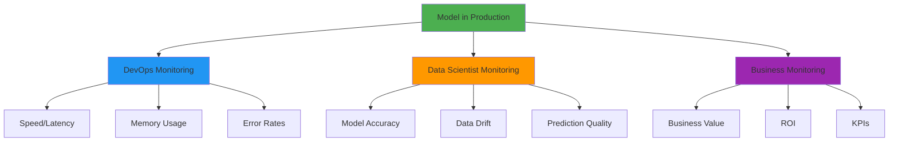

---

## 3.4.1 DevOps Concerns

### Infrastructure and Performance Monitoring

**Primary Questions:**
- Is the model getting the job done **quickly enough**?
- Is it using a **sensible amount of memory and processing time**?

### DevOps Monitoring Metrics

| Metric Category | Specific Metrics | Target Example |
|----------------|------------------|----------------|
| **Latency** | Response time per request | < 100ms (p95) |
| **Throughput** | Requests per second | > 1000 req/s |
| **Resource Usage** | CPU utilization | < 70% average |
|  | Memory consumption | < 4GB per instance |
|  | GPU utilization (if applicable) | > 80% (efficiency) |
| **Reliability** | Uptime percentage | 99.9% (3 nines) |
|  | Error rate | < 0.1% |
|  | Failed request count | < 10/hour |
| **Scalability** | Auto-scaling responsiveness | Scale in < 5 min |
|  | Load balancer health | All instances healthy |

### Traditional DevOps Expertise Applies

**Good News:**
> "The existing expertise in DevOps teams for monitoring and managing resources can be **readily applied to ML models**"

**Standard DevOps Tools Work:**

```
Monitoring Stack:
├── Metrics Collection
│   ├── Prometheus (metrics scraping)
│   ├── StatsD (application metrics)
│   └── CloudWatch/Stackdriver (cloud native)
│
├── Logging
│   ├── ELK Stack (Elasticsearch, Logstash, Kibana)
│   ├── Splunk (log aggregation)
│   └── CloudWatch Logs
│
├── Visualization
│   ├── Grafana (dashboards)
│   ├── Kibana (log visualization)
│   └── DataDog (all-in-one)
│
├── Alerting
│   ├── PagerDuty (incident management)
│   ├── Opsgenie (on-call routing)
│   └── Alert Manager (Prometheus alerts)
│
└── Tracing
    ├── Jaeger (distributed tracing)
    ├── Zipkin (request tracing)
    └── X-Ray (AWS tracing)
```

### Example: Production Model Monitoring Dashboard

```
┌─────────────────────────────────────────────────────┐
│     FRAUD DETECTION API - DEVOPS DASHBOARD          │
├─────────────────────────────────────────────────────┤
│                                                     │
│  Response Time (p95)              Memory Usage      │
│  ┌──────────────────┐            ┌──────────────┐   │
│  │    85ms ✓        │            │   3.2 GB ✓  │   │
│  │  Target: <100ms  │            │ Target: <4GB│   │
│  └──────────────────┘            └──────────────┘   │
│                                                     │
│  Throughput                       Error Rate        │
│  ┌──────────────────┐            ┌──────────────┐   │
│  │  1,250 req/s ✓   │            │   0.05% ✓   │   │
│  │ Target: >1000    │            │ Target: <0.1%│   │
│  └──────────────────┘            └──────────────┘   │
│                                                     │
│  CPU Utilization                  Active Instances  │
│  ┌──────────────────┐            ┌──────────────┐   │
│  │      65% ✓       │            │      8/10    │   │
│  │  Target: <70%    │            │   Auto-scale │   │
│  └──────────────────┘            └──────────────┘   │
│                                                     │
│  Recent Alerts: None                                │
│  Last Deploy: 2 days ago (v2.3.1)                   │
│  Uptime: 99.95% (30 days)                           │
│                                                     │
└─────────────────────────────────────────────────────┘
```

### DevOps Monitoring Best Practices

**Infrastructure Monitoring:**

- [ ] Set up comprehensive metrics collection
- [ ] Configure dashboards for real-time visibility
- [ ] Establish alert thresholds (latency, errors, resources)
- [ ] Implement auto-scaling based on metrics
- [ ] Monitor all instances/replicas
- [ ] Track deployment history
- [ ] Log all requests for debugging

**Example Alert Configuration:**

```yaml
alerts:
  - name: high_latency
    condition: p95_response_time > 150ms for 5 minutes
    severity: warning
    action: notify_team

  - name: error_spike
    condition: error_rate > 1% for 2 minutes
    severity: critical
    action: page_oncall

  - name: memory_pressure
    condition: memory_usage > 90% for 10 minutes
    severity: warning
    action: scale_up
```

---

## 3.4.2 Data Scientist Concerns

### The Model Degradation Problem

**New Challenge for DevOps:**
> "ML models can **degrade over time**, since they are effectively models of the data they were trained on. This is **not a problem faced by traditional software**, but it is inherent to machine learning."

### Why Models Degrade

**🔗 Cross-Reference**: See **CS2 Section 4.6 (Model Drift)** for detailed drift types and **CS1 Section 1.2.7 (Monitoring - Drift Detection)** for detection methods.

```
Model Training (Jan 2024):
├── Training data: User behavior from 2023
├── Patterns learned: Purchase patterns, preferences
└── Accuracy: 92%

Model in Production (Nov 2024):
├── User behavior changed (new trends, seasons)
├── Patterns no longer match training data
└── Accuracy: 78% ← Model degraded!

Cause: Data distribution shifted over time
```

### Data Scientist Monitoring Metrics

| Metric Category | What to Monitor | Detection Method |
|----------------|-----------------|------------------|
| **Model Accuracy** | Precision, Recall, F1 | Compare predictions vs ground truth |
| **Data Drift** | Input distribution changes | Statistical tests (KS, Chi-square) |
| **Concept Drift** | Input-output relationship changes | Model performance over time |
| **Prediction Distribution** | Output probability shifts | Monitor prediction histograms |
| **Feature Importance** | Changes in feature contributions | Track SHAP/importance values |

### Data Drift Detection

**Example: Customer Churn Model**

```
Training Data (2023):
┌──────────────────────────────────────┐
│  Feature: Customer Age               │
│  ┌────────────────────────────┐      │
│  │      █                     │      │
│  │    █ █ █                   │      │
│  │  █ █ █ █ █                 │      │
│  └────────────────────────────┘      │
│  Mean: 35, Std: 10                   │
└──────────────────────────────────────┘

Production Data (Nov 2024):
┌──────────────────────────────────────┐
│  Feature: Customer Age               │
│  ┌────────────────────────────┐      │
│  │              █             │      │
│  │            █ █ █           │      │
│  │          █ █ █ █ █         │      │
│  └────────────────────────────┘      │
│  Mean: 42, Std: 12                   │
│  ⚠️  Drift Detected! (KS test p<0.01) │
└──────────────────────────────────────┘

Action Required:
├── Investigate cause (marketing to older demographic?)
├── Retrain model with recent data
└── Consider adaptive modeling
```

### Concept Drift Detection

**Example: Fraud Detection**

```
Before COVID-19 (2019):
Pattern: Online purchases from home = Low risk
Accuracy: 95%

During COVID-19 (2020):
Pattern: MASSIVE increase in online purchases from home
Model flags most transactions as fraud (false positives)
Accuracy: 70% ← Concept drift!

Cause: Relationship between features and fraud changed
Normal behavior now looks like old fraud patterns

Solution:
├── Immediate: Adjust thresholds temporarily
├── Short-term: Retrain with recent data
└── Long-term: Implement continuous learning
```

### When Retraining Becomes Necessary

**Decision Framework:**

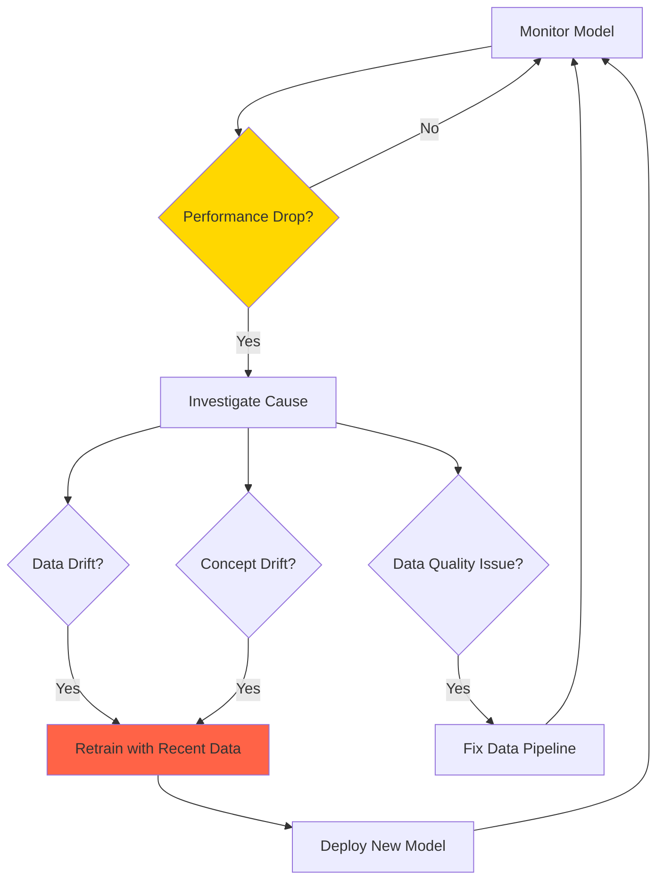

### Monitoring Example: Real-Time Performance Tracking

```
┌─────────────────────────────────────────────────────┐
│   CHURN PREDICTION MODEL - DATA SCIENCE DASHBOARD   │
├─────────────────────────────────────────────────────┤
│                                                     │
│  Model Accuracy (7-day rolling)                     │
│  ┌──────────────────────────────────────────┐      │
│  │ 92% ────────────────────────╮            │      │
│  │                             │╲           │      │
│  │                             │ ╲          │      │
│  │                             │  ╲ 85%     │      │
│  │                             │   ─────    │      │
│  └──────────────────────────────────────────┘      │
│  ⚠️  Performance degraded 7% in 2 weeks!            │
│                                                     │
│  Data Drift Detection                               │
│  Feature               | KS Statistic | Alert       │
│  ─────────────────────────────────────────────      │
│  Age                   |   0.08       | ✓ OK        │
│  Tenure_Months         |   0.15       | ⚠️  Warning │
│  Monthly_Charges       |   0.25       | 🚨 DRIFT!   │
│  Total_Services        |   0.06       | ✓ OK        │
│                                                     │
│  Prediction Distribution                            │
│  ┌──────────────────────────────────────────┐      │
│  │ Training: 30% churn, 70% no churn        │      │
│  │ Current:  45% churn, 55% no churn        │      │
│  └──────────────────────────────────────────┘      │
│  ⚠️  Shift in prediction distribution detected      │
│                                                     │
│  Recommendation:                                    │
│  1. Investigate Monthly_Charges drift               │
│  2. Collect ground truth for recent predictions     │
│  3. Schedule model retraining                       │
│                                                     │
└─────────────────────────────────────────────────────┘
```

### Retraining Schedule Example

```
Automated Retraining Triggers:

Scheduled:
├── Weekly: Retrain with last 6 months data
└── Purpose: Stay current with trends

Performance-Based:
├── Trigger: Accuracy drops below 85%
├── Action: Immediate retraining
└── Approval: Automatic if test accuracy > 90%

Drift-Based:
├── Trigger: Data drift detected (KS > 0.2)
├── Action: Alert data science team
└── Decision: Manual review, then retrain

Manual:
├── Trigger: Business rules change
├── Action: Planned retraining
└── Approval: Full validation required
```

---

## 3.4.3 Business Concerns

### Holistic Business Monitoring

**Business Perspective:**
> "The business has a **holistic outlook** on monitoring"

### Key Business Questions

```
Primary Concerns:
├── Is the model delivering value to the enterprise?
├── Do benefits outweigh costs of development and deployment?
├── How can we measure this?
└── Are business objectives being met?
```

### Business Monitoring Framework

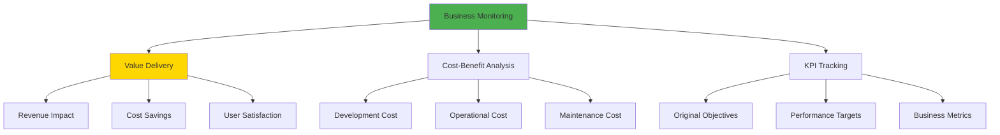

### KPIs: From Technical to Business

**🔗 See Also**: CS1 Section 1.2.2 (Business Goal Identification) for establishing KPIs

| Domain | Technical Metric | Business KPI |
|--------|-----------------|--------------|
| **Fraud Detection** | Precision: 92%, Recall: 88% | $2.4M annual fraud prevented<br>False positive cost: $50K/year |
| **Customer Churn** | Accuracy: 87%, F1: 0.85 | 15% reduction in churn<br>$1.2M additional revenue retained |
| **Recommendation** | Click-through rate: 8% | 20% increase in sales<br>Average order value: +$15 |
| **Predictive Maintenance** | Failure prediction accuracy: 95% | 40% reduction in downtime<br>$500K savings in repairs |

### Business Monitoring Example: Fraud Detection ROI

```
┌─────────────────────────────────────────────────────┐
│     FRAUD DETECTION - BUSINESS DASHBOARD            │
├─────────────────────────────────────────────────────┤
│                                                     │
│  Financial Impact (Monthly)                         │
│  ┌──────────────────────────────────────────┐      │
│  │  Fraud Prevented:      $200,000          │      │
│  │  False Positives Cost:  $4,000           │      │
│  │  Model Operating Cost: $20,000           │      │
│  │  ──────────────────────────────────      │      │
│  │  Net Benefit:          $176,000 ✓        │      │
│  │  ROI:                  880%              │      │
│  └──────────────────────────────────────────┘      │
│                                                     │
│  Business KPIs                                      │
│  Metric                 | Target  | Current | ✓/✗  │
│  ────────────────────────────────────────────────   │
│  Fraud Detection Rate   | >90%    | 92%     | ✓    │
│  False Positive Rate    | <2%     | 1.8%    | ✓    │
│  Processing Time        | <50ms   | 35ms    | ✓    │
│  Customer Complaints    | <100/mo | 45/mo   | ✓    │
│  Manual Review Time     | -50%    | -60%    | ✓    │
│                                                     │
│  Cumulative Savings (12 months): $2.1M              │
│  Development Cost (amortized): $100K                │
│  Net Annual Benefit: $2.0M                          │
│                                                     │
│  Business Outcome: ✓ SUCCESSFUL                     │
│  Recommendation: Continue monitoring, expand to     │
│                  additional transaction types       │
│                                                     │
└─────────────────────────────────────────────────────┘
```

### Automated vs. Manual KPI Monitoring

**Challenge:**
> "Where possible, KPIs should be **monitored automatically**, but this is **rarely trivial**"

**Why KPI Automation is Difficult:**

```
Technical Metrics:
├── Easy to automate
├── Direct from system logs
├── Real-time availability
└── Example: Response time, error rate

Business Metrics:
├── Difficult to automate
├── Require ground truth data
├── Delayed availability
└── Example: Actual fraud (discovered weeks later)
```

### Ground Truth Delay Problem

**Example: Fraud Detection**

```
Timeline:

Day 1: Transaction processed
├── Model prediction: FRAUD (blocked)
└── Business metric: TBD (waiting for confirmation)

Day 7: Customer reports legitimate transaction blocked
├── Ground truth: FALSE POSITIVE
└── Update KPI: False positive count++

Day 30: Actual fraudster attempts chargeback
├── Ground truth: TRUE POSITIVE
└── Update KPI: Fraud prevented++

Challenge:
├── Cannot calculate accuracy immediately
├── Business impact measured over weeks/months
└── Need to reconcile predictions with outcomes
```

### Monitoring Pipeline Example

**Real-World Implementation:**

```
ETL Pipeline Schedule:
├── 6:00 AM - 8:00 AM: Data ingestion
│   ├── Run every 30 minutes
│   ├── Write to Data Lake (folder: 2025-05-18)
│   └── Validate data quality

├── 10:00 AM: Forecasting pipelines (5 models)
│   ├── Load processed data
│   ├── Generate predictions
│   └── Write to prediction database

├── 11:30 AM: Dashboard generation
│   ├── Aggregate predictions
│   ├── Calculate business metrics
│   └── Update visualization

├── 12:00 PM: Business review
    └── Stakeholders access dashboard

Failure Scenario:
├── 9:30 AM: Data ingestion failed (corrupted file)
├── 10:00 AM: Forecasting cannot run (missing data)
├── 12:00 PM: Dashboard shows old data (no value!)
└── Impact: Business decisions delayed

Monitoring Solution:
├── Log files analyzed (Big data volume)
├── ML models detect anomalies in logs
├── Alert sent: "Data ingestion failure at 9:30 AM"
├── Auto-retry triggered
└── Issue resolved by 11:00 AM
```

### Success Rate Tracking

**Pipeline Health Monitoring:**

```
Monthly Pipeline Execution:
├── Total scheduled runs: 30 days × 3 runs/day = 90
├── Successful runs: 85
├── Failed runs: 5
└── Success rate: 85/90 = 94.4%

Failure Analysis:
├── Data quality issues: 3 (60%)
├── Infrastructure timeout: 1 (20%)
└── Code bugs: 1 (20%)

Action Items:
├── Improve data validation (reduce quality issues)
├── Increase timeout thresholds
└── Fix identified bugs
```

### Business Monitoring Best Practices

**Implementation Checklist:**

- [ ] Define clear business KPIs (not just technical metrics)
- [ ] Establish ground truth collection process
- [ ] Set up reconciliation between predictions and outcomes
- [ ] Create business-friendly dashboards
- [ ] Automate KPI calculation where possible
- [ ] Schedule regular business reviews
- [ ] Track ROI continuously
- [ ] Compare actual vs. expected business impact

---

## 3.5 Iteration and Life Cycle

**The Essential Nature of Iteration:**
> "Developing and deploying improved versions of a model is an **essential part of the MLOps life cycle** - one of the more challenging"

### Reasons for Model Updates

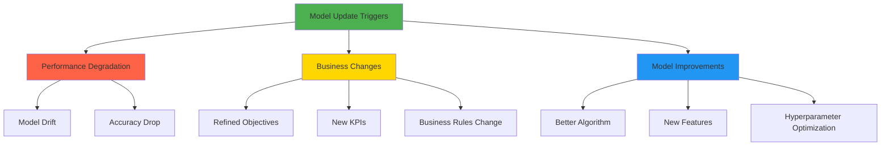

---

## 3.5.1 Iteration Strategies

### Automated Retraining: The Simple Scenario

**When to Use:**
- Fast-moving business environments
- Daily new training data availability
- Established, stable model architecture

**Example: E-commerce Recommendation System**

```
Daily Retraining Cycle:

Day N:
├── 12:00 AM: Collect previous day's user interactions
├── 02:00 AM: Preprocess and prepare training data
├── 03:00 AM: Retrain recommendation model
├── 05:00 AM: Evaluate on validation set
├── 06:00 AM: Deploy if validation passes
└── 07:00 AM: Model serving updated recommendations

Purpose: Capture latest user preferences and trends

Benefits:
├── Always reflects recent user behavior
├── Adapts to trends quickly (new products, seasons)
└── Automated (no manual intervention)

Requirements:
├── Robust data pipeline
├── Automated validation checks
├── Rollback mechanism
└── Monitoring for anomalies
```

### Retraining Complexity

**The Challenge:**
> "Retraining in other scenarios is likely to be **even more complicated**, rendering automated redeployment unlikely"

**Complexity Factors:**

| Scenario | Complexity | Automation Feasibility |
|----------|-----------|----------------------|
| **Same architecture + new data** | Low | High (fully automate) |
| **New features added** | Medium | Medium (semi-automate) |
| **Algorithm change** | High | Low (manual review) |
| **Business logic change** | High | Low (stakeholder approval) |

### Model Comparison Requirements

**Critical Step:**
> "With a new model version built, the next step is to **compare the metrics with the current live model version**"

**Comparison Process:**

```
Step 1: Prepare Test Environment
├── Use SAME development dataset for both models
├── Ensure fair comparison (identical data)
└── Lock dataset version

Step 2: Evaluate Both Models
├── Current Model (v2.3): Test on dataset
├── New Model (v2.4): Test on dataset
└── Calculate all metrics

Step 3: Compare Metrics
├── Accuracy: v2.3 = 92%, v2.4 = 94% ✓
├── Precision: v2.3 = 88%, v2.4 = 90% ✓
├── Recall: v2.3 = 85%, v2.4 = 89% ✓
└── Inference Time: v2.3 = 50ms, v2.4 = 45ms ✓

Step 4: Check for Wide Variations
├── If variation > threshold (e.g., >5%): Manual review
├── If variation < threshold: Can automate
└── Document comparison results

Step 5: Approval Decision
├── Automated: Small improvements, stable performance
└── Manual: Large changes, stakeholder input needed
```

### Automated Redeployment Checks

**Safety Checks Before Auto-Deploy:**

```yaml
redeployment_rules:
  automatic_approval:
    - accuracy_improvement: > 1%
    - accuracy_drop: < 0.5%
    - latency_increase: < 10%
    - prediction_distribution_shift: < 5%

  manual_review_required:
    - accuracy_improvement: > 5%  # Too good to be true?
    - accuracy_drop: > 0.5%        # Performance regression
    - latency_increase: > 10%      # Slower model
    - prediction_distribution_shift: > 5%  # Behavior change

  automatic_rejection:
    - accuracy_drop: > 2%
    - critical_failures: > 0
    - compliance_check_failed: true
```

### Complex Retraining Scenarios

**Scenario 1: New Feature Added**

```
Current Model (v2.3):
├── Features: 50
├── Algorithm: XGBoost
├── Accuracy: 92%
└── Training data: Last 6 months

New Model (v2.4):
├── Features: 55 (5 new features added)
├── Algorithm: XGBoost
├── Accuracy: 95%
└── Training data: Last 6 months + new features

Comparison Challenge:
├── Cannot use exact same dataset (new features!)
├── Need to regenerate features for test set
├── Risk: New features may introduce bias
└── Decision: Manual review required

Steps:
1. Validate new features don't leak information
2. Compare on overlapping feature subset
3. A/B test in production
4. Stakeholder approval
```

**Scenario 2: Algorithm Change**

```
Current Model (v2.3):
├── Algorithm: Random Forest
├── Interpretability: Medium
├── Accuracy: 92%
└── Inference: 50ms

New Model (v3.0):
├── Algorithm: Deep Neural Network
├── Interpretability: Low
├── Accuracy: 96%
└── Inference: 100ms

Challenges:
├── Interpretability reduction
├── Higher latency
├── Different error patterns
└── Stakeholder concerns

Required Approvals:
├── Technical: Performance vs latency trade-off
├── Business: Acceptability of black box model
├── Compliance: Regulatory requirements
└── Deployment: Infrastructure changes (GPU?)

Decision: Extensive validation + stakeholder sign-off
```

---

## 3.5.2 The Feedback Loop

### Production Environment Separation

**Enterprise Best Practice:**
> "In large enterprises, DevOps best practices typically dictate that **the live model scoring environment and the model retraining environment are distinct**"

```
┌─────────────────────────────────────────────────┐
│         ENVIRONMENT SEPARATION                  │
├─────────────────────────────────────────────────┤
│                                                 │
│  Production Scoring Environment                 │
│  ├── Purpose: Serve predictions                 │
│  ├── Optimized for: Low latency, high throughput│
│  ├── Resources: Minimal compute (cost-effective)│
│  └── Constraints: No experimentation allowed    │
│                                                 │
│  Retraining Environment                         │
│  ├── Purpose: Develop new model versions        │
│  ├── Optimized for: Training speed, flexibility │
│  ├── Resources: High compute (GPUs, memory)     │
│  └── Freedom: Experimentation encouraged        │
│                                                 │
│  Problem:                                       │
│  └── New model evaluated in retraining env      │
│      may behave differently in production!      │
│                                                 │
└─────────────────────────────────────────────────┘
```

**Consequence:**
> "As a result, the evaluation of a new model version on the retraining environment is likely to be **compromised**"

### Shadow Testing

**Mitigation Strategy #1: Shadow Testing**

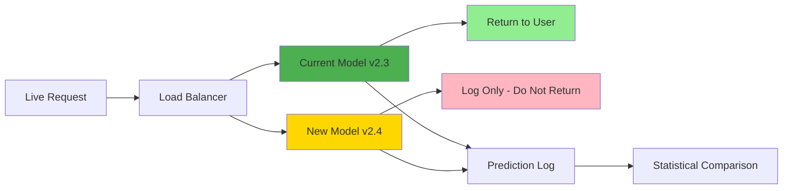

**How Shadow Testing Works:**

```
Deployment:
├── New model (v2.4) deployed alongside current (v2.3)
├── Both models receive ALL requests
├── Only current model (v2.3) serves responses
└── New model (v2.4) predictions logged but discarded

Process:
1. User request arrives
2. Load balancer duplicates request to both models
3. Current model (v2.3):
   ├── Makes prediction
   ├── Returns to user
   └── Logs prediction
4. New model (v2.4):
   ├── Makes prediction
   ├── Does NOT return to user
   └── Logs prediction
5. Both predictions stored for analysis

Analysis (after sufficient data):
├── Compare predictions on same requests
├── Statistical analysis of differences
├── Identify edge cases or disagreements
└── Validate performance in production environment

Benefits:
├── ✓ Zero risk to users (shadow model hidden)
├── ✓ Real production data and environment
├── ✓ Head-to-head comparison on same requests
├── ✓ Stakeholder visibility into future model
└── ✓ Smoother transition (familiar with behavior)
```

**Example: Shadow Testing Results**

```
Shadow Test Period: 7 days
Total Requests: 1,000,000

Comparison Results:
┌─────────────────────────────────────────────┐
│  Metric          | v2.3  | v2.4  | Diff    │
│  ────────────────────────────────────────   │
│  Accuracy        | 92%   | 94%   | +2% ✓   │
│  Avg Latency     | 50ms  | 45ms  | -5ms ✓  │
│  P95 Latency     | 80ms  | 75ms  | -5ms ✓  │
│  Error Rate      | 0.1%  | 0.08% | -0.02%✓ │
│  Memory Usage    | 2GB   | 2.1GB | +0.1GB  │
└─────────────────────────────────────────────┘

Prediction Agreement:
├── Exact same prediction: 95% of requests
├── Different predictions: 5% of requests
└── Investigation: Differences on edge cases (expected)

Decision: ✓ Approve deployment of v2.4
Rationale:
├── Consistent improvements across all metrics
├── Acceptable disagreement rate
└── Stakeholders reviewed and approved
```

### A/B Testing

**Mitigation Strategy #2: A/B Testing**

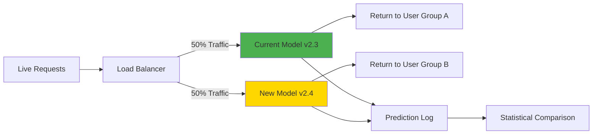

**How A/B Testing Works:**

```
Deployment:
├── Both models deployed in production
├── Traffic split between models
├── Each request served by ONE model
└── Results logged from both groups

Traffic Split Strategies:
├── Random split (50/50, 90/10, etc.)
├── User-based (consistent per user)
├── Geographic (by region)
└── Gradual ramp (start 5%, increase to 50%)

Key Difference from Shadow Testing:
├── Shadow: Same request → both models (compare predictions)
└── A/B: Different requests → different models (compare outcomes)

Example Split:
User 12345 → Model v2.3 (Group A)
User 67890 → Model v2.4 (Group B)
User 11111 → Model v2.3 (Group A)
User 22222 → Model v2.4 (Group B)
```

**A/B Testing Requirements:**

```
Statistical Rigor:
├── Sample size calculation
├── Hypothesis testing
├── Confidence intervals
└── Statistical significance (p < 0.05)

Careful Planning:
├── Define success metrics upfront
├── Determine test duration
├── Calculate required sample size
├── Establish stopping criteria

Monitoring:
├── Track metrics in real-time
├── Watch for unexpected behavior
├── Kill switch for immediate rollback
└── Segment analysis (by user type, region)
```

**Example: A/B Test Plan**

```
Goal: Determine if new model (v2.4) improves user engagement

Hypothesis:
├── Null (H0): v2.4 engagement = v2.3 engagement
└── Alternative (H1): v2.4 engagement > v2.3 engagement

Success Metric: Click-through rate (CTR)

Sample Size Calculation:
├── Current CTR: 5%
├── Desired improvement: +0.5% (absolute)
├── Confidence level: 95%
├── Statistical power: 80%
└── Required sample: 50,000 users per group

Test Design:
├── Duration: 2 weeks
├── Split: 50/50 random assignment
├── Consistent assignment (same user → same model)
└── Exclusions: Bot traffic, internal users

Test Execution:
Week 1:
├── Group A (v2.3): 50,000 users, CTR = 5.0%
├── Group B (v2.4): 50,000 users, CTR = 5.6%
└── Early indication: v2.4 performing better

Week 2:
├── Group A (v2.3): 50,000 users, CTR = 5.1%
├── Group B (v2.4): 50,000 users, CTR = 5.7%
└── Consistent improvement

Statistical Analysis:
├── CTR difference: 0.6% (5.7% - 5.1%)
├── P-value: 0.003 (< 0.05) ✓ Significant!
├── 95% CI: [0.2%, 1.0%] (doesn't include 0)
└── Conclusion: v2.4 is statistically better

Business Impact:
├── 0.6% CTR improvement
├── Applied to 10M daily users
├── Additional 60,000 clicks/day
└── Estimated revenue: +$50K/month

Decision: ✓ Deploy v2.4 to 100% of users
```

### Shadow Testing vs. A/B Testing

| Aspect | Shadow Testing | A/B Testing |
|--------|---------------|-------------|
| **Risk to Users** | Zero (shadow hidden) | Low (both models live) |
| **Request Handling** | Same request → both models | Different requests → different models |
| **Comparison** | Direct prediction comparison | Statistical outcome comparison |
| **Duration** | Shorter (days) | Longer (weeks) |
| **Use Case** | Technical validation | Business impact validation |
| **Stakeholder Value** | See future model behavior | Measure business metrics |
| **Statistical Rigor** | Not required | Essential |

### Best Practice: Combine Both Approaches

**Recommended Deployment Path:**

```
1. Shadow Testing (1 week)
   ├── Validate technical performance
   ├── Compare predictions
   ├── Identify edge cases
   └── Build stakeholder confidence

2. A/B Testing (2 weeks)
   ├── Start with 10% traffic to new model
   ├── Monitor business metrics
   ├── Gradually increase to 50%
   └── Statistical validation

3. Full Rollout
   ├── If A/B test successful
   ├── Deploy to 100% of users
   └── Continue monitoring
```

---

## 3.6 Governance

**The Foundation of Responsible ML:**
> "Governance is the set of controls placed on a business to ensure that it delivers on its **responsibilities to all stakeholders**"

### Governance Pillars

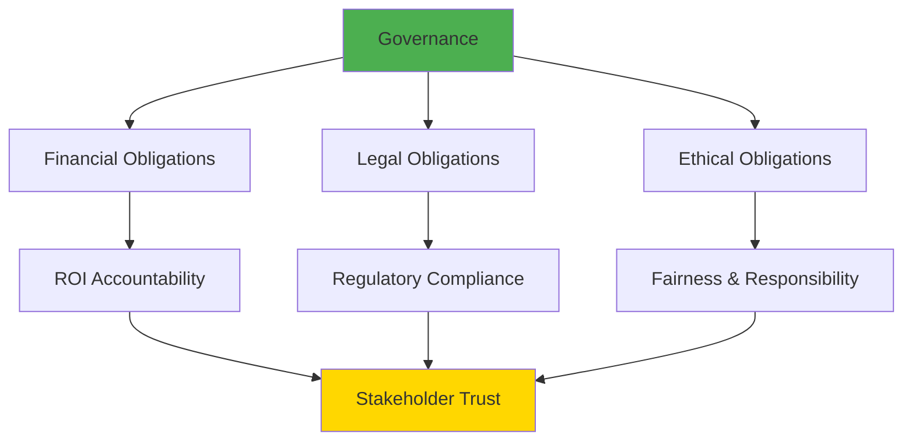

**Fundamental Principle:**
> "Underpinning all three of these is the **fundamental principle of fairness**"

### Stakeholders in ML Governance

```
Internal Stakeholders:
├── Shareholders (financial returns)
├── Employees (job security, ethics)
├── Management (risk management)
└── Board of Directors (oversight)

External Stakeholders:
├── Customers (fair treatment, privacy)
├── Regulators (compliance)
├── Public (societal impact)
└── National Governments (laws, regulations)
```

---

## 3.6.1 Data Governance

**Definition:**
> "A framework for ensuring **appropriate use and management of data**"

### Data Governance Framework

**🔗 Cross-Reference**: See **CS2 Section 4.6.1 (Ethics)** for ethical considerations in data use

```
┌─────────────────────────────────────────────────┐
│         DATA GOVERNANCE FRAMEWORK               │
├─────────────────────────────────────────────────┤
│                                                 │
│  1. Data Privacy & Protection                   │
│     ├── GDPR compliance (EU)                    │
│     ├── CCPA compliance (California)            │
│     ├── Personal data classification            │
│     ├── Consent management                      │
│     └── Data anonymization/pseudonymization     │
│                                                 │
│  2. Data Quality & Integrity                    │
│     ├── Data validation rules                   │
│     ├── Quality metrics tracking                │
│     ├── Data lineage documentation              │
│     └── Error detection and correction          │
│                                                 │
│  3. Data Access & Security                      │
│     ├── Role-based access control (RBAC)        │
│     ├── Data encryption (at rest & in transit)  │
│     ├── Audit logging                           │
│     └── Secure data sharing protocols           │
│                                                 │
│  4. Data Retention & Disposal                   │
│     ├── Retention policies                      │
│     ├── Archival procedures                     │
│     ├── Secure deletion methods                 │
│     └── Compliance with regulations             │
│                                                 │
│  5. Data Ethics                                 │
│     ├── Bias detection and mitigation           │
│     ├── Fairness assessments                    │
│     ├── Responsible data collection             │
│     └── Stakeholder consent                     │
│                                                 │
└─────────────────────────────────────────────────┘
```

### Key Regulations (As of 2024-2025)

**1. GDPR (General Data Protection Regulation) - EU, 2016**

```
Key Principles:
├── Lawfulness, fairness, transparency
├── Purpose limitation
├── Data minimization
├── Accuracy
├── Storage limitation
├── Integrity and confidentiality
└── Accountability

Individual Rights:
├── Right to access
├── Right to rectification
├── Right to erasure ("right to be forgotten")
├── Right to data portability
├── Right to object
└── Right not to be subject to automated decision-making

Penalties:
├── Up to €20 million OR
└── 4% of annual global turnover (whichever is higher)
```

**2. CCPA (California Consumer Privacy Act) - USA, 2018**

```
Consumer Rights:
├── Know what personal data is collected
├── Delete personal data
├── Opt-out of sale of personal data
└── Non-discrimination for exercising rights

Business Obligations:
├── Disclosure of data collection practices
├── Implement opt-out mechanisms
├── Respond to consumer requests (45 days)
└── Maintain reasonable security

Scope:
├── Businesses with CA residents' data
├── Revenue > $25M OR
├── 50,000+ consumers/households/devices OR
└── 50%+ revenue from selling consumer data
```

### Emerging ML-Specific Regulations

**🔗 See Also**: CS2 Section 4.6.1 (Ethics - Regulatory Compliance) for healthcare examples

**Areas of Focus:**

```
Algorithmic Accountability:
├── Model explainability requirements
├── Bias audits mandatory
├── Impact assessments
└── Transparency in automated decisions

Examples:
├── NYC Automated Employment Decision Tools (2023)
├── EU AI Act (proposed)
├── Algorithmic Accountability Act (US proposed)
└── Various state-level initiatives
```

---

## 3.6.2 Process Governance

**Definition:**
> "The use of well-defined processes to ensure all governance considerations have been addressed at the **correct point in the life cycle** of the model and that a **full and accurate record has been kept**"

### MLOps Governance Challenges

**The Complexity Problem:**
> "Applying good governance to MLOps is **challenging**! The processes are complex, the technology is opaque, and the dependence on data is fundamental"

### Process Governance Components

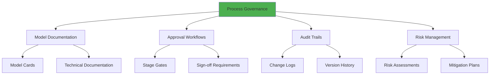

### Model Cards: Documentation Standard

**What is a Model Card?**

```
Model Card: Standardized documentation for ML models

Includes:
├── Model Details
│   ├── Model name, version, date
│   ├── Model type (algorithm)
│   ├── Training data description
│   └── Intended use cases
│
├── Performance Metrics
│   ├── Accuracy, precision, recall
│   ├── Performance across subgroups
│   └── Known limitations
│
├── Fairness & Bias
│   ├── Bias assessments
│   ├── Fairness metrics
│   └── Mitigation strategies
│
├── Ethical Considerations
│   ├── Potential harms
│   ├── Use case restrictions
│   └── Responsible AI review
│
└── Operational Details
    ├── Deployment environment
    ├── Monitoring plan
    └── Update frequency
```

**Example: Loan Approval Model Card**

```
═══════════════════════════════════════════════════
           LOAN APPROVAL MODEL CARD
═══════════════════════════════════════════════════

Model Details:
─────────────────────────────────────────────────
Model Name: Loan Approval Classifier v2.4
Model Type: Gradient Boosting (XGBoost)
Version: 2.4.0
Last Updated: 2024-11-15
Intended Use: Predict loan approval likelihood
Owner: Credit Risk Team
Contact: credit-risk@bank.com

Training Data:
─────────────────────────────────────────────────
Dataset: Historical loan applications (2020-2024)
Size: 500,000 applications
Features: 45 (income, credit score, employment, etc.)
Target: Loan approved (Yes/No)
Data Quality: 98% complete, validated

Performance:
─────────────────────────────────────────────────
Overall Accuracy: 87%
Precision: 85%
Recall: 88%
F1-Score: 86.5%
AUC-ROC: 0.92

Performance by Demographic:
├── Age 18-30: Accuracy 85%
├── Age 31-50: Accuracy 88%
├── Age 51+: Accuracy 89%
└── No significant disparity detected

Fairness Assessment:
─────────────────────────────────────────────────
Demographic Parity:
├── Approval rate difference < 5% across groups ✓
└── Tested: Age, gender, race, geography

Equal Opportunity:
├── True positive rate difference < 3% ✓
└── Model performs fairly across subgroups

Known Limitations:
─────────────────────────────────────────────────
├── Limited data for self-employed applicants
├── May not generalize to economic downturns
└── Performance degrades for non-standard loans

Ethical Considerations:
─────────────────────────────────────────────────
Potential Harms:
├── Automated rejection may feel impersonal
├── Errors impact individuals' financial futures
└── Over-reliance on model could perpetuate bias

Mitigation Strategies:
├── Human review for all rejections
├── Explainability required for decisions
├── Regular bias audits (quarterly)
└── Appeals process available

Use Restrictions:
├── Must not be sole decision-maker
├── Requires human oversight
└── Not for use in protected classes discrimination

Deployment:
─────────────────────────────────────────────────
Environment: AWS Elastic Container Service
API Endpoint: https://api.bank.com/loan/v2.4/predict
Latency: < 100ms (p95)
Monitoring: Real-time performance tracking

Update Schedule:
├── Retraining: Monthly (with recent data)
├── Bias audit: Quarterly
└── Full review: Annually

Compliance:
─────────────────────────────────────────────────
├── Fair Lending Act: Compliant ✓
├── Equal Credit Opportunity Act: Compliant ✓
├── Internal Risk Framework: Approved ✓
└── Last Audit: 2024-10-01

Approvals:
─────────────────────────────────────────────────
├── Model Risk Manager: [Signature]
├── Chief Data Officer: [Signature]
├── Compliance Officer: [Signature]
└── Date: 2024-11-15

═══════════════════════════════════════════════════
```

### Approval Workflows and Stage Gates

**Multi-Stage Approval Process:**

```
┌─────────────────────────────────────────────────┐
│         MODEL APPROVAL WORKFLOW                 │
├─────────────────────────────────────────────────┤
│                                                 │
│  Stage 1: Development Complete                  │
│  ├── Data scientist submits model               │
│  ├── Technical documentation reviewed           │
│  ├── Performance metrics validated              │
│  └── Approval: Tech Lead ✓                      │
│                    ↓                            │
│  Stage 2: Technical Review                      │
│  ├── Code quality assessment                    │
│  ├── Reproducibility verified                   │
│  ├── Security scan passed                       │
│  └── Approval: ML Engineer ✓                    │
│                    ↓                            │
│  Stage 3: Business Validation                   │
│  ├── Alignment with business objectives         │
│  ├── ROI analysis                               │
│  ├── Stakeholder demo                           │
│  └── Approval: Product Manager ✓                │
│                    ↓                            │
│  Stage 4: Governance Review                     │
│  ├── Fairness assessment                        │
│  ├── Bias audit                                 │
│  ├── Ethics review                              │
│  ├── Compliance check                           │
│  └── Approval: Model Risk Manager ✓             │
│                    ↓                            │
│  Stage 5: Deployment Readiness                  │
│  ├── Infrastructure validation                  │
│  ├── Monitoring setup confirmed                 │
│  ├── Rollback plan documented                   │
│  └── Approval: DevOps Lead ✓                    │
│                    ↓                            │
│  Stage 6: Final Sign-Off                        │
│  ├── All previous approvals collected           │
│  ├── Risk assessment accepted                   │
│  └── Approval: Chief Data Officer ✓             │
│                    ↓                            │
│         ✅ APPROVED FOR PRODUCTION               │
│                                                 │
└─────────────────────────────────────────────────┘
```

### Audit Trail Requirements

**Complete Record Keeping:**

```
What to Log:
├── Model Development
│   ├── Experiments conducted
│   ├── Data versions used
│   ├── Hyperparameters tested
│   ├── Performance metrics
│   └── Decision rationale
│
├── Approvals
│   ├── Who approved what
│   ├── When approvals granted
│   ├── Conditions attached
│   └── Sign-off documentation
│
├── Deployment
│   ├── Deployment timestamps
│   ├── Version deployed
│   ├── Configuration used
│   └── Deployment method
│
├── Production
│   ├── Predictions made
│   ├── Input data received
│   ├── Model versions used
│   └── Performance metrics
│
└── Changes
    ├── Model updates
    ├── Configuration changes
    ├── Incident reports
    └── Corrective actions
```

### Responsible AI Principles

**Ethical, Transparent, and Accountable AI:**

```
┌─────────────────────────────────────────────────┐
│         RESPONSIBLE AI FRAMEWORK                │
├─────────────────────────────────────────────────┤
│                                                 │
│  1. Fairness                                    │
│     ├── Avoid discriminatory outcomes           │
│     ├── Regular bias audits                     │
│     └── Diverse representation in data          │
│                                                 │
│  2. Transparency                                │
│     ├── Explainable decisions                   │
│     ├── Clear communication                     │
│     └── Open documentation                      │
│                                                 │
│  3. Accountability                              │
│     ├── Clear ownership                         │
│     ├── Audit trails                            │
│     └── Redress mechanisms                      │
│                                                 │
│  4. Privacy                                     │
│     ├── Data minimization                       │
│     ├── Secure handling                         │
│     └── Consent management                      │
│                                                 │
│  5. Safety & Reliability                        │
│     ├── Robust testing                          │
│     ├── Monitoring for failures                 │
│     └── Incident response plans                 │
│                                                 │
│  6. Human Oversight                             │
│     ├── Human-in-the-loop for critical decisions│
│     ├── Override capabilities                   │
│     └── Regular reviews                         │
│                                                 │
└─────────────────────────────────────────────────┘
```

### Governance Best Practices

**Implementation Checklist:**

**Data Governance:**
- [ ] Data classification scheme implemented
- [ ] Privacy policies documented and enforced
- [ ] Consent mechanisms in place
- [ ] Data access controls configured
- [ ] Retention policies defined
- [ ] Regular data quality audits scheduled

**Process Governance:**
- [ ] Model development process documented
- [ ] Approval workflows established
- [ ] Model cards created for all models
- [ ] Audit trail system implemented
- [ ] Regular governance reviews scheduled
- [ ] Incident response procedures defined

**Responsible AI:**
- [ ] Bias assessment process defined
- [ ] Fairness metrics tracked
- [ ] Explainability requirements met
- [ ] Ethics review board established
- [ ] Stakeholder feedback mechanisms
- [ ] Regular responsible AI training for team

---

## Exam Preparation Resources

### Quick Reference: Key Concepts

**Five MLOps Components (DDMIG):**
- **D**evelopment
- **D**eployment
- **M**onitoring
- **I**teration
- **G**overnance

**Model Deployment Types:**
- **Model-as-a-Service**: REST API, real-time scoring
- **Embedded Model**: Batch processing, application-packaged

**Portable Model Formats:**
- **PMML**: Traditional ML
- **ONNX**: Deep learning
- **PFA**: Statistical models
- **POJO**: Java environments

**Three Monitoring Stakeholders:**
- **DevOps**: Latency, throughput, resources
- **Data Scientists**: Accuracy, drift, model quality
- **Business**: ROI, KPIs, value delivery

**Iteration Strategies:**
- **Shadow Testing**: Both models, one serves
- **A/B Testing**: Traffic split, statistical comparison

**Two Governance Categories:**
- **Data Governance**: Privacy, quality, security
- **Process Governance**: Documentation, approvals, audits

### Common Exam Questions

#### Question 1: What are the five key components of MLOps and why are they important?

**Answer:**

The five key components are Development, Deployment, Monitoring, Iteration, and Governance (DDMIG):

1. **Development**: Encompasses business objectives, data exploration, feature engineering, and model training. Critical for building accurate models aligned with business needs.

2. **Deployment**: Productionalization and integration into applications. Requires collaboration between data scientists and DevOps teams to bridge the gap between lab and production.

3. **Monitoring**: Tracks performance from multiple perspectives:
   - DevOps: Infrastructure (latency, throughput)
   - Data Scientists: Model quality (accuracy, drift)
   - Business: Value delivery (ROI, KPIs)

4. **Iteration**: Continuous improvement through retraining and updates. Essential because ML models degrade over time due to data/concept drift.

5. **Governance**: Ensures compliance, fairness, and accountability through data governance (privacy, quality) and process governance (documentation, approvals).

**Why Important**: These components span the entire ML lifecycle and affect many roles across the organization, from data scientists to business stakeholders.

#### Question 2: Explain feature engineering and why it's the largest part of ML projects.

**Answer:**

**Feature Engineering** is the process of transforming raw data into fixed-size arrays of numbers (features) that ML algorithms can understand.

**Why It's the Largest Part:**
> "Feature engineering includes data cleansing, which can represent the **largest part of an ML project in terms of time spent**"

**Key Activities:**
1. **Feature Creation**: Generate new features from existing data (one-hot encoding, binning)
2. **Feature Transformation**: Handle missing values, normalize, scale
3. **Feature Extraction**: Dimensionality reduction (PCA)
4. **Feature Selection**: Identify important variables, remove redundant features

**Impact:**
- Reduces dimensions: 100,000 × 400 → 100,000 × 50 (87.5% reduction)
- Improves accuracy: Typical 5-10% improvement
- Faster training: 6-10× speed improvement
- Avoids overfitting: Simpler, better-generalizing models

**Example**: Credit card fraud detection may start with 100 features, but correlation analysis reveals 50 are redundant (>60% correlation). Feature importance identifies top 30. Final model uses 30 optimized features with better performance than original 100.

#### Question 3: What is reproducibility and why is it critical in MLOps?

**Answer:**

**Reproducibility** is the ability to recreate an ML model with the same results from scratch by saving enough information about the development environment.

**Why Critical:**
> "Without reproducibility, data scientists have **little chance of being able to confidently iterate on models**, worse, they are unlikely to be able to hand over the model to DevOps to see if what was created in the lab can be faithfully reproduced in production"

**Requirements for Reproducibility:**

```
Version Control Needed:
├── Code (training scripts, preprocessing)
├── Data (training, validation, test sets)
├── Model (algorithm, hyperparameters, weights)
├── Environment (Python version, library versions)
└── Configuration (random seeds, settings)
```

**Consequences of Poor Reproducibility:**
- Cannot iterate confidently on models
- Lab results differ from production
- Debugging becomes impossible
- Compliance issues (cannot audit)
- Team collaboration breaks down

**Solution Tools:**
- Git (code versioning)
- DVC (data versioning)
- Docker (environment consistency)
- MLflow (experiment tracking)
- Requirements.txt (dependency locking)

#### Question 4: Compare Shadow Testing vs A/B Testing

**Answer:**

| Aspect | Shadow Testing | A/B Testing |
|--------|---------------|-------------|
| **Risk** | Zero (shadow hidden from users) | Low (both models live) |
| **Request Handling** | Same request → both models | Different requests → different models |
| **Comparison Type** | Direct prediction comparison | Statistical outcome comparison |
| **User Impact** | None (shadow results discarded) | Split user base |
| **Duration** | Shorter (days) | Longer (weeks for significance) |
| **Purpose** | Technical validation | Business impact validation |
| **Statistical Rigor** | Not required | Essential (sample size, p-values) |

**When to Use Each:**

**Shadow Testing:**
- First step after development
- Technical performance validation
- Compare predictions on same requests
- Build stakeholder confidence
- No risk tolerance

**A/B Testing:**
- After shadow testing passes
- Measure business impact
- Requires statistical planning
- Some risk acceptable
- Need business validation

**Best Practice**: Use shadow testing first (1 week), then A/B testing (2 weeks) before full rollout.

#### Question 5: What are the two types of model deployment and their use cases?

**Answer:**

**1. Model-as-a-Service (Live Scoring)**

```
Architecture: REST API endpoint
Response: Real-time (synchronous)
Latency: Typically < 100ms
Infrastructure: Load balancer, auto-scaling, multiple instances

Use Cases:
├── Fraud detection (per transaction)
├── Recommendation engines (per user request)
├── Image classification (per upload)
├── Chatbot responses (per message)
└── Search ranking (per query)
```

**2. Embedded Model (Batch Scoring)**

```
Architecture: Packaged in application
Response: Batch processing (asynchronous)
Schedule: Hourly/Daily/Weekly
Infrastructure: Scheduled jobs (cron, Airflow)

Use Cases:
├── Daily customer churn scoring
├── Weekly sales forecasting
├── Monthly credit risk assessment
├── Nightly email campaign targeting
└── Quarterly financial projections
```

**Key Differences:**
- **Latency Requirements**: Real-time vs batch
- **Infrastructure**: Always-on API vs scheduled jobs
- **Use Case**: Immediate decision vs bulk processing
- **Cost**: Higher (24/7 service) vs lower (periodic execution)

#### Question 6: Explain the three stakeholder perspectives on monitoring

**Answer:**

**🔗 Cross-Reference**: See CS1 Section 1.2.7 (Model Monitoring) for monitoring system architecture.

**1. DevOps Concerns: Infrastructure Performance**

Questions:
- Is the model fast enough? (latency < 100ms?)
- Is it using reasonable resources? (CPU < 70%, Memory < 4GB?)

Metrics:
- Response time, throughput, error rate, CPU/memory usage, uptime

Tools: Prometheus, Grafana, ELK stack (existing DevOps expertise applies)

**2. Data Scientist Concerns: Model Quality**

Questions:
- Is the model still accurate?
- Has the data distribution changed (data drift)?
- Is model degrading over time?

Unique Challenge:
> "ML models can **degrade over time** - not a problem faced by traditional software, but inherent to machine learning"

Metrics:
- Accuracy, precision, recall, data drift (KS test), prediction distribution

**3. Business Concerns: Value Delivery**

Questions:
- Is the model delivering value?
- Do benefits outweigh costs?
- Are business objectives met?

Challenge:
> "Where possible, KPIs should be monitored automatically, but this is **rarely trivial**"

Metrics:
- ROI, cost savings, revenue impact, original KPIs

Example: Fraud detection - not just "accuracy" but "$2.4M fraud prevented annually"

#### Question 7: What makes governance challenging in MLOps?

**Answer:**

**The Core Challenge:**
> "Applying good governance to MLOps is **challenging**! The processes are complex, the technology is opaque, and the dependence on data is fundamental"

**Three Complexity Dimensions:**

**1. Process Complexity**
- Multi-stage ML lifecycle (6 phases)
- Iterative experimentation (100s of experiments)
- Multiple stakeholders (8+ roles)
- Continuous updates (unlike traditional software)

**2. Technology Opacity**
- Black box models (neural networks)
- Difficult to explain predictions
- Non-deterministic behavior (randomness)
- Emergent properties from data

**3. Data Dependence**
- Data quality determines model quality
- Privacy regulations (GDPR, CCPA)
- Bias in data → bias in models
- Data drift requires retraining

**Two Governance Categories:**

**Data Governance:**
- Privacy & protection (GDPR, CCPA)
- Quality & integrity
- Access & security
- Retention & disposal
- Ethics & fairness

**Process Governance:**
- Model documentation (Model Cards)
- Approval workflows (multi-stage gates)
- Audit trails (complete record keeping)
- Risk management

**Regulatory Evolution:**
- Traditional: Industry-specific regulations (finance, pharma)
- Recent: Data protection (GDPR 2016, CCPA 2018)
- Emerging: ML-specific regulations (algorithmic accountability)

**Solution**: Implement robust framework combining data governance and process governance with clear responsibilities.

---

### Cross-Reference Summary

**CS3 builds upon CS1 and CS2 as follows:**

| CS3 Topic | Builds On | How It Extends |
|-----------|-----------|----------------|
| **Model Development** | CS1-1.2 ML Lifecycle | Practical implementation details |
| **Feature Engineering** | CS1-1.2.4 Data Processing | Feature store, real-world examples |
| **Reproducibility** | CS1-1.1.7 Best Practices | Tools and complete workflow |
| **Deployment Types** | CS1-1.2.6 Model Deployment | Detailed deployment patterns |
| **Deployment Requirements** | CS2-4.5 Deployment Challenges | Solutions to challenges |
| **Monitoring** | CS1-1.2.7 Monitoring | Multi-stakeholder perspectives |
| **Data Drift** | CS2-4.6 Concept Drift | Detection and mitigation |
| **Iteration** | CS1-1.2 Lifecycle Phases | Shadow/A/B testing strategies |
| **Governance** | CS2-4.6.1 Ethics | Data and process governance |

---

## Study Tips for CS3

### For Conceptual Understanding:
1. **Understand the five components (DDMIG)** and how they interact
2. **Grasp feature engineering importance**: Why it's the largest time investment
3. **Know reproducibility requirements**: Version control of everything
4. **Understand deployment types**: When to use each
5. **Know monitoring from three perspectives**: DevOps, Data Scientist, Business
6. **Understand iteration strategies**: Shadow vs A/B testing
7. **Grasp governance complexity**: Why it's challenging in ML

### For Exam Success:
1. **Memorize DDMIG**: Five key MLOps components
2. **Know deployment types**: Model-as-a-Service vs Embedded
3. **Understand portable formats**: PMML, ONNX, PFA, POJO
4. **Remember three monitoring stakeholders**: DevOps, DS, Business
5. **Know Shadow vs A/B differences**: Table comparison
6. **Understand two governance types**: Data vs Process
7. **Know major regulations**: GDPR (2016), CCPA (2018)

### For Practical Application:
1. **Think in workflows**: Development → Deployment → Monitoring → Iteration
2. **Understand real examples**: Fraud detection, churn prediction, recommendations
3. **Know tools**: MLflow, Docker, DVC, Prometheus, Grafana
4. **Consider stakeholders**: Different roles have different needs
5. **Understand trade-offs**: Complexity vs interpretability, automation vs control

---

## Document Information

**Version**: 1.0 - CS3 Comprehensive Edition

**Sections Covered**:
- **CS3-3.1**: MLOps Components Overview
- **CS3-3.2**: Model Development (5 subsections)
- **CS3-3.3**: Productionalization and Deployment (2 subsections)
- **CS3-3.4**: Monitoring (3 subsections)
- **CS3-3.5**: Iteration and Life Cycle (2 subsections)
- **CS3-3.6**: Governance (2 subsections)

**Primary Sources**:
1. "Introducing MLOps" by Treveil and Dataiku team
2. MLOps Course - BITS Pilani WILP
3. CS1 and CS2 lecture materials (cross-referenced throughout)

**Author**: Amit Kumar
**Institution**: BITS Pilani
**Course**: MTech AI/ML - BITS Pilani WILP

**Enhanced With**:
- Practical examples from industry
- Real-world analogies for complex concepts
- Cross-references to CS1 and CS2
- Comprehensive tables and diagrams
- Exam-focused content and Q&A

---

## Final Revision Checklist

### Before Exam - CS3 Core Concepts:
- [ ] Can you list and explain the five MLOps components (DDMIG)?
- [ ] Can you explain why feature engineering takes the most time?
- [ ] Can you describe what reproducibility requires?
- [ ] Can you compare the two model deployment types?
- [ ] Can you explain deployment requirements (lightweight vs robust)?
- [ ] Can you describe monitoring from three stakeholder perspectives?
- [ ] Can you compare shadow testing vs A/B testing?
- [ ] Can you explain the two types of governance?

### Integration with CS1 and CS2:
- [ ] Understand how CS3 extends CS1 ML Lifecycle concepts
- [ ] Connect CS3 monitoring to CS1 architecture components
- [ ] Link CS3 deployment to CS2 deployment challenges
- [ ] Relate CS3 governance to CS2 ethics and regulations

### Practical Understanding:
- [ ] Can you design a complete MLOps workflow?
- [ ] Can you identify which deployment type for a use case?
- [ ] Can you explain when to use shadow vs A/B testing?
- [ ] Can you describe a complete governance framework?

**Good luck with your exam! 🚀**